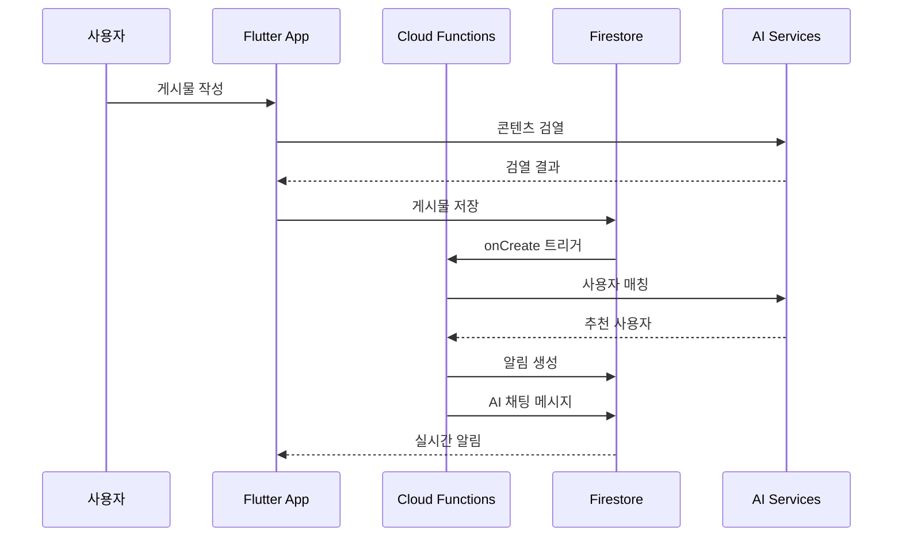
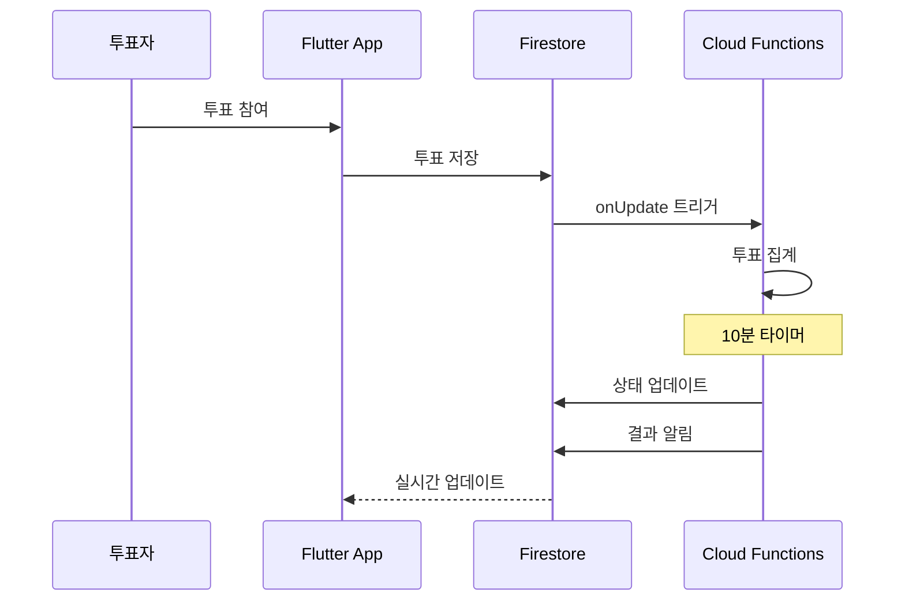
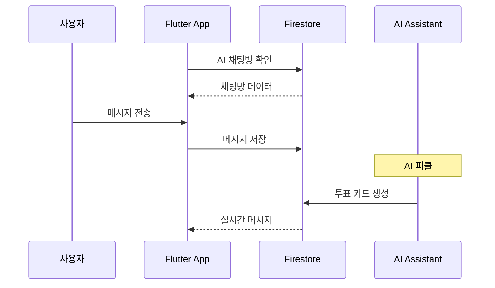
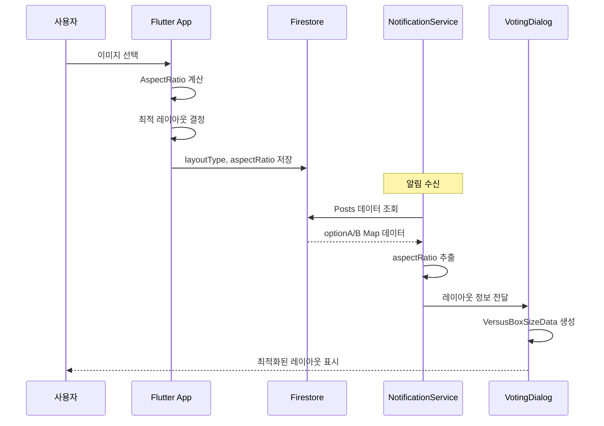

# Versus Space 시스템 아키텍처

## 🏗️ 전체 시스템 구조

```
┌─────────────────────────────────────────────────────────────────────┐
│                           Flutter App                                │
│  ┌─────────────┐  ┌──────────────┐  ┌────────────────┐             │
│  │   UI Layer  │  │ State Mgmt   │  │  Services      │             │
│  │  - Pages    │  │ - Provider   │  │  - AI Mod      │             │
│  │  - Widgets  │  │ - AppState   │  │  - Notif       │             │
│  │  - Design   │  │ - Navigation │  │  - Chat        │             │
│  │  - Smart    │  │              │  │  - Layout      │             │
│  │    Layout   │  │              │  │                │             │
│  └─────────────┘  └──────────────┘  └────────────────┘             │
└─────────────────────────────┬───────────────────────────────────────┘
                              │
                              ▼
┌─────────────────────────────────────────────────────────────────────┐
│                      Firebase Backend                                │
│  ┌─────────────┐  ┌──────────────┐  ┌────────────────┐             │
│  │  Firestore  │  │   Storage    │  │ Cloud Functions│             │
│  │  - Users    │  │  - Images    │  │  - Triggers    │             │
│  │  - Posts    │  │  - Videos    │  │  - Scheduled   │             │
│  │  - Messages │  │  - Thumbnails│  │  - HTTPS       │             │
│  └─────────────┘  └──────────────┘  └────────────────┘             │
└─────────────────────────────┬───────────────────────────────────────┘
                              │
                              ▼
┌─────────────────────────────────────────────────────────────────────┐
│                      External Services                               │
│  ┌─────────────┐  ┌──────────────┐  ┌────────────────┐             │
│  │  Gemini AI  │  │ Vision API   │  │ Perspective   │             │
│  │  - Content  │  │  - Image     │  │  - Text       │             │
│  │  - Matching │  │  - Safety    │  │  - Toxicity   │             │
│  └─────────────┘  └──────────────┘  └────────────────┘             │
└─────────────────────────────────────────────────────────────────────┘
```

## 🔄 주요 시스템 플로우

### 1. 게시물 생성 및 알림 플로우



### 2. 투표 시스템 플로우



### 3. AI 채팅 시스템 플로우



### 4. 스마트 레이아웃 데이터 플로우 (v1.3.0)



## 🗂️ 데이터 흐름

### Firestore 컬렉션 관계

```
users
├── friends_list (서브컬렉션)
└── 연관: posts, messages, notifications

posts
├── comments (서브컬렉션)
├── likes (서브컬렉션)
└── dislikes (서브컬렉션)

chats
└── messages (서브컬렉션)

notifications
└── 연관: posts, users
```

### 실시간 업데이트 구조

1. **Firestore Listeners**
   - 채팅 메시지: `chats/{chatId}/messages`
   - 알림: `notifications` where `user_id == currentUser`
   - 투표 상태: `posts/{postId}` 

2. **State Management**
   - Provider Pattern으로 전역 상태 관리
   - AppState에서 사용자 정보 및 설정 관리
   - NavigationProvider로 네비게이션 상태 관리

## 🔐 보안 구조

### Firebase Security Rules

```javascript
// 기본 읽기 권한
match /posts/{post} {
  allow read: if true;
  allow write: if request.auth.uid == resource.data.userid;
}

// 사용자별 접근 제어
match /users/{userId} {
  allow read: if true;
  allow write: if request.auth.uid == userId;
}

// 채팅 메시지 접근 제어
match /chats/{chatId}/messages/{message} {
  allow read: if request.auth.uid in parent(/databases/$(database)/documents/chats/$(chatId)).data.participantIds;
  allow create: if request.auth.uid in parent(/databases/$(database)/documents/chats/$(chatId)).data.participantIds;
}
```

### API 키 관리

- Firebase Functions Config로 안전하게 관리
- 환경별 분리 (개발/운영)
- 클라이언트에서 직접 API 호출 금지

## 🚀 성능 최적화

### 1. 이미지 처리
- **업로드 시**: 3단계 리사이징 (original, display, thumbnail)
- **캐싱**: CachedNetworkImage 사용
- **압축**: JPEG 85% 품질

### 2. 데이터베이스 최적화
- **인덱스**: 자주 사용하는 쿼리에 복합 인덱스 생성
- **배치 처리**: 대량 작업 시 배치 write 사용
- **병렬 처리**: Promise.all()로 독립적인 작업 병렬 실행

### 3. Cloud Functions 최적화
- **콜드 스타트 최소화**: 함수 분리 및 메모리 최적화
- **타임아웃 설정**: 함수별 적절한 타임아웃 설정
- **리전 설정**: asia-northeast3 (서울) 사용

## 📱 클라이언트 아키텍처

### Flutter 앱 구조

```
lib/
├── backend/          # Firebase 통합
│   ├── schema/      # 데이터 모델
│   └── firebase/    # Firebase 설정
├── services/        # 비즈니스 로직
│   ├── ai_moderation/
│   ├── notification_service.dart
│   └── chat_service.dart
├── pages/          # UI 페이지
├── components/     # 재사용 컴포넌트
├── providers/      # 상태 관리
└── utils/         # 유틸리티
```

### 디자인 시스템

- **색상**: VersusColors (primary, secondary, etc.)
- **간격**: VersusSpacing (4px 기반)
- **텍스트**: VersusTextStyles (Plus Jakarta Sans)
- **컴포넌트**: 일관된 디자인 언어

### 주요 컴포넌트 구조

#### 투표 메시지 시스템 (v2.1.0)
```
components/chat/
├── base_vote_message.dart      # 추상 베이스 클래스
│   ├── 공통 상태 관리
│   ├── 투표 로직
│   └── currentUserName prop
└── vote_card_message.dart      # 통합 구현체
    ├── UI 렌더링
    ├── 스마트 레이아웃
    └── 사용자 정보 표시
```

**주요 특징**:
- 단일 컴포넌트로 통합 (VoteRequestMessage 제거)
- 사용자 이름 표시 기능
- 진행중 상태 파란색 표시
- 결과 표시: "피클! 피클! 피클! {사용자}님 결과를 보러오세요!"

## 🔄 CI/CD 파이프라인

### 배포 프로세스

1. **개발**: feature 브랜치에서 작업
2. **테스트**: 자동화된 테스트 실행
3. **스테이징**: 테스트 환경 배포
4. **프로덕션**: main 브랜치 병합 후 배포

### 모니터링

- **Firebase Performance**: 앱 성능 모니터링
- **Cloud Functions Logs**: 서버 로그 모니터링
- **Firestore Usage**: 데이터베이스 사용량 추적

## 🛠️ 개발 환경

### 필수 도구
- Flutter SDK (stable)
- Node.js 18+
- Firebase CLI
- VS Code / Android Studio

### 환경 설정
```bash
# Flutter 의존성
flutter pub get

# Functions 의존성
cd firebase/functions
npm install

# 환경 변수
firebase functions:config:set \
  gemini.api_key="KEY" \
  perspective.api_key="KEY"
```

## 📈 확장성 고려사항

### 현재 지원
- 1000명 동시 투표 처리 (<60초)
- 실시간 채팅 및 알림
- 멀티미디어 콘텐츠 지원

### 향후 확장
- 샤딩을 통한 데이터베이스 확장
- CDN을 통한 미디어 전송 최적화
- 마이크로서비스 아키텍처 전환 고려