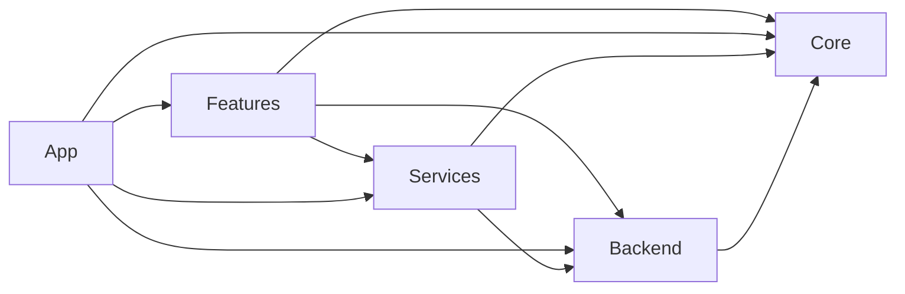

# 🏛️ Feature-First Architecture 가이드

> Versus Space의 Feature-First + Clean Architecture 상세 설명서
> 작성일: 2025-08-27 | 버전: 1.0.0

## 📋 개요

Versus Space는 **Feature-First Architecture**와 **Clean Architecture** 원칙을 결합한 구조를 채택했습니다. 이는 각 비즈니스 기능을 독립적인 모듈로 관리하면서도, 공통 요소는 전역 레이어에서 효율적으로 공유하는 방식입니다.

## 🎯 아키텍처 철학

### 1. 기능 중심 설계 (Feature-First)
- **독립성**: 각 Feature는 다른 Feature에 의존하지 않음
- **완결성**: Feature 내에서 필요한 모든 레이어 포함
- **재사용성**: Feature를 다른 프로젝트로 이식 가능
- **테스트 용이성**: Feature 단위로 독립적 테스트 가능

### 2. Clean Architecture 원칙
- **관심사 분리**: 각 레이어는 명확한 책임을 가짐
- **의존성 규칙**: 내부 레이어는 외부 레이어를 모름
- **테스트 가능성**: 비즈니스 로직은 UI와 독립적
- **유연성**: 프레임워크 변경에 강건함

## 🏗️ 전체 구조

```
lib/
├── features/              # 🎯 비즈니스 기능별 모듈
│   ├── auth/
│   ├── chat/
│   ├── posts/
│   ├── profile/
│   ├── search/
│   ├── voting/
│   └── notifications/
│
├── core/                  # 🔧 전역 공통 요소
├── backend/               # 🗄️ 전역 백엔드 레이어
├── services/              # 🛠️ 전역 서비스 레이어
└── app/                   # 🚀 앱 설정 및 진입점
```

## 📦 Feature 모듈 구조

### 표준 Feature 구조
```
features/[feature_name]/
├── data/                  # 데이터 레이어
│   ├── datasources/      # 데이터 소스
│   │   ├── remote/      # API, Firebase
│   │   └── local/       # 캐시, 로컬 DB
│   ├── repositories/    # Repository 구현
│   └── services/        # Feature 전용 서비스
│
├── domain/               # 도메인 레이어 (비즈니스 로직)
│   ├── models/          # 도메인 모델
│   ├── usecases/        # 유스케이스
│   └── repositories/    # Repository 인터페이스
│
└── presentation/         # 프레젠테이션 레이어
    ├── screens/         # 화면 위젯
    ├── widgets/         # UI 컴포넌트
    └── providers/       # 상태 관리
```

### 레이어별 책임

#### 📊 Data Layer
- **목적**: 데이터 획득 및 저장
- **책임**: 
  - 외부 API 호출
  - 로컬 데이터베이스 관리
  - 캐싱 전략 구현
  - 데이터 변환 (Entity ↔ Model)

#### 💼 Domain Layer
- **목적**: 비즈니스 로직
- **책임**:
  - 비즈니스 규칙 정의
  - 유스케이스 구현
  - 도메인 모델 정의
  - Repository 인터페이스 정의

#### 🎨 Presentation Layer
- **목적**: 사용자 인터페이스
- **책임**:
  - UI 렌더링
  - 사용자 입력 처리
  - 상태 관리
  - 네비게이션

## 🌐 전역 레이어

### Core Layer (`/lib/core/`)
```
core/
├── design_system/        # 디자인 시스템
│   ├── components/      # 공통 UI 컴포넌트
│   └── tokens/          # 색상, 타이포그래피, 스페이싱
├── theme/               # 앱 테마
├── localization/        # 다국어 지원
├── utils/               # 유틸리티 함수
└── widgets/             # 공통 위젯
```

### Backend Layer (`/lib/backend/`)
```
backend/
├── firebase/            # Firebase 설정
│   ├── config/         # Firebase 구성
│   └── firestore/      # Firestore 유틸리티
├── models/             # 데이터 모델
│   ├── user/          # 사용자 관련
│   ├── post/          # 게시물 관련
│   └── chat/          # 채팅 관련
├── api/               # 외부 API
└── repositories/      # 공통 Repository
```

### Services Layer (`/lib/services/`)
```
services/
├── cache/              # 캐싱 서비스
├── moderation/         # 콘텐츠 검열
├── logger/            # 로깅
└── validators/        # 유효성 검증
```

### App Layer (`/lib/app/`)
```
app/
├── router/            # 라우팅 설정
├── state/             # 전역 상태 관리
├── di/                # 의존성 주입
└── app.dart           # 앱 진입점
```

## 🔄 의존성 규칙

### 허용되는 의존성


### 금지되는 의존성
- ❌ Core → Features
- ❌ Backend → Features
- ❌ Services → Features
- ❌ Feature A → Feature B
- ❌ Core → Services
- ❌ Core → Backend

## 🔀 Feature 간 통신

Feature는 서로 직접 의존하지 않습니다. 대신 다음 방법을 사용:

### 1. 이벤트 버스
```dart
// Event 정의 (core/events/)
class PostCreatedEvent {
  final String postId;
  PostCreatedEvent(this.postId);
}

// Feature A에서 발행
eventBus.fire(PostCreatedEvent(postId));

// Feature B에서 구독
eventBus.on<PostCreatedEvent>().listen((event) {
  // 처리
});
```

### 2. 공유 Repository
```dart
// backend/repositories/
abstract class PostRepository {
  Future<Post> getPost(String id);
}

// Feature A, B 모두 사용 가능
final post = await postRepository.getPost(id);
```

### 3. 라우팅을 통한 통신
```dart
// Feature A에서
context.push('/feature-b', extra: {'data': data});

// Feature B에서
final data = GoRouterState.of(context).extra;
```

## ✅ 새 Feature 추가 가이드

### 1. Feature 구조 생성
```bash
# 디렉토리 생성
mkdir -p lib/features/new_feature/{data,domain,presentation}
mkdir -p lib/features/new_feature/data/{datasources,repositories,services}
mkdir -p lib/features/new_feature/domain/{models,usecases,repositories}
mkdir -p lib/features/new_feature/presentation/{screens,widgets,providers}
```

### 2. 도메인 모델 정의
```dart
// domain/models/new_model.dart
class NewModel {
  final String id;
  final String name;
  
  NewModel({required this.id, required this.name});
}
```

### 3. Repository 인터페이스 정의
```dart
// domain/repositories/new_repository.dart
abstract class NewRepository {
  Future<NewModel> getData(String id);
}
```

### 4. UseCase 구현
```dart
// domain/usecases/get_data_usecase.dart
class GetDataUseCase {
  final NewRepository repository;
  
  GetDataUseCase(this.repository);
  
  Future<NewModel> call(String id) {
    return repository.getData(id);
  }
}
```

### 5. Repository 구현
```dart
// data/repositories/new_repository_impl.dart
class NewRepositoryImpl implements NewRepository {
  final RemoteDataSource remoteDataSource;
  final LocalDataSource localDataSource;
  
  NewRepositoryImpl({
    required this.remoteDataSource,
    required this.localDataSource,
  });
  
  @override
  Future<NewModel> getData(String id) async {
    // 구현
  }
}
```

### 6. UI 구현
```dart
// presentation/screens/new_screen.dart
class NewScreen extends StatelessWidget {
  @override
  Widget build(BuildContext context) {
    // UI 구현
  }
}
```

## 📋 체크리스트

### Feature 개발 체크리스트
- [ ] Feature 디렉토리 구조 생성
- [ ] 도메인 모델 정의
- [ ] Repository 인터페이스 정의
- [ ] UseCase 구현
- [ ] Repository 구현체 작성
- [ ] DataSource 구현
- [ ] UI Screen 구현
- [ ] Widget 컴포넌트 작성
- [ ] State Provider 구현
- [ ] 라우팅 설정
- [ ] 테스트 코드 작성
- [ ] README.md 문서화

## 🎯 베스트 프랙티스

### 1. 단일 책임 원칙
- 각 클래스는 하나의 책임만 가짐
- UseCase는 하나의 비즈니스 규칙만 구현

### 2. 의존성 주입
- Constructor injection 사용
- DI Container를 통한 의존성 관리

### 3. 에러 처리
- Either 패턴 사용
- 명시적 에러 타입 정의

### 4. 테스트
- Unit Test: Domain Layer
- Widget Test: Presentation Layer
- Integration Test: 전체 Feature

## 📚 참고 자료

- [Clean Architecture by Robert C. Martin](https://blog.cleancoder.com/uncle-bob/2012/08/13/the-clean-architecture.html)
- [Feature-Sliced Design](https://feature-sliced.design/)
- [Flutter Clean Architecture](https://resocoder.com/flutter-clean-architecture-tdd/)

---

*이 문서는 Versus Space의 Feature-First Architecture 가이드입니다.*
*질문이나 개선사항은 이슈로 등록해주세요.*