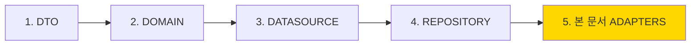

# 📋 Notifications Adapters 마이그레이션 가이드

> Clean Architecture 준수를 위한 Adapter 레이어 마이그레이션 가이드  
> **최종 업데이트**: 2025-01-09 | **버전**: 1.2.0
> **현재 상태**: ⏳ 시작 대기중 (Domain 레이어 ✅ 100% 완료)
> **예상 시간**: 4시간 - MASTER_MIGRATION_GUIDE.md Phase 2의 일부
> 
> ⚠️ **Note**: 이 문서는 전체 마이그레이션 Phase 2(Data 레이어)의 Sub-phase 4에 해당합니다.

## 📌 Prerequisites (전제조건)

### 시작 전 확인사항  
- [ ] 모든 하위 레이어 완료 (DTO → Datasources → Repository)
- [x] Domain UseCase 정의 완료 ✅ **완료됨** ([domain/usecases/](../../domain/usecases/) 참조)
- [ ] Presentation Provider 준비
- [ ] DI 환경 설정 완료

### 필요한 도구
- [SUBAGENTS_MANUAL.md](/docs/SUBAGENTS_MANUAL.md) 참조
- GetIt (의존성 주입)
- Provider/Riverpod (상태 관리)

## 🔗 마이그레이션 체인에서의 위치

### 실행 순서 (최종 단계)


### 의존성 관계
- **Input**: 
  - Domain UseCase 인터페이스
  - Repository 구현체
- **Output**: 
  - 간소화된 Service 레이어
  - Presentation Provider
- **목표**: 모든 Data Layer 준비 후 비즈니스 로직 정리

## 🤖 서브에이전트 활용

### Phase 1: GlobalNotificationManager 분해
```bash
# State 분리
/spawn struct-weaver "--task state --mode detect --map 'NotificationQueueProvider->lib/features/notifications/presentation/providers/notification_queue_provider.dart;NotificationDisplayProvider->lib/features/notifications/presentation/providers/notification_display_provider.dart'"

# 패치 적용
git apply patches/struct_weaver_state.diff
```

### Phase 2: UseCase 생성 및 DI
```bash
# UseCase DI 바인딩
/spawn di-binder "--feature notifications --port 'IShowNotificationUseCase' --adapter 'ShowNotificationUseCaseImpl' --deps 'INotificationRepository' --mode apply"

/spawn di-binder "--feature notifications --port 'IQueueNotificationUseCase' --adapter 'QueueNotificationUseCaseImpl' --deps 'INotificationRepository' --mode apply"
```

### Phase 3: 최종 검증
```bash
# Import 위반 검사
/spawn import-guardian "--scope notifications --mode detect"

# 전체 빌드 및 테스트
/spawn build-sentinel "full"
```

## 🎯 마이그레이션 목표

notifications feature를 완전한 Clean Architecture로 전환하여:
- 레이어 간 의존성 규칙 준수
- 테스트 가능성 향상
- 유지보수성 개선
- Feature 간 독립성 확보

## 🚨 현재 위반 사항 요약

### Critical Issues (즉시 수정)
1. **GlobalNotificationManager** (data/adapters)
   - Presentation 위젯 직접 import (2건)
   - Cross-feature 직접 의존 (2건)
   - UI 로직과 비즈니스 로직 혼재

2. **큰 Presentation 위젯들**
   - `versus_notification_box.dart` (955줄)
   - `notification_image_viewer.dart` (936줄)
   - `voting_notification_dialog.dart` (725줄)

## 📝 파일별 상세 마이그레이션 계획

### 1. GlobalNotificationManager 분리 (최우선)

#### 현재 문제점
```dart
// ❌ 현재 - data/adapters/global_notification_manager.dart
import '/features/notifications/presentation/widgets/voting_notification_dialog.dart';
import '/features/auth/data/adapters/auth_util.dart';
import '/features/posts/data/adapters/vote/vote_status_service.dart';

class GlobalNotificationManager {
  // UI 표시 로직이 data 레이어에 존재
  showDialog(
    context: context,
    builder: (context) => VotingNotificationDialog(...) // ❌ UI 직접 호출
  );
}
```

#### Step 1: Domain UseCase 생성
```dart
// ✅ 신규 - domain/usecases/show_notification_usecase.dart
abstract class IShowNotificationUseCase {
  Future<void> execute(NotificationEntity notification);
}

// ✅ 신규 - domain/usecases/queue_notification_usecase.dart
abstract class IQueueNotificationUseCase {
  void addToQueue(NotificationEntity notification);
  Stream<NotificationEntity> get queueStream;
}

// ✅ 신규 - domain/usecases/process_vote_usecase.dart
abstract class IProcessVoteUseCase {
  Future<void> execute({
    required String postId,
    required String userId,
    required String choice,
  });
}
```

#### Step 2: Data 레이어 구현체 생성
```dart
// ✅ 신규 - data/usecases/queue_notification_usecase_impl.dart
class QueueNotificationUseCaseImpl implements IQueueNotificationUseCase {
  final List<NotificationEntity> _queue = [];
  final StreamController<NotificationEntity> _controller;
  
  @override
  void addToQueue(NotificationEntity notification) {
    _queue.add(notification);
    _processQueue();
  }
  
  // 비즈니스 로직만 포함 (UI 없음)
}
```

#### Step 3: Presentation Provider 생성
```dart
// ✅ 신규 - presentation/providers/notification_display_provider.dart
class NotificationDisplayProvider extends ChangeNotifier {
  final IQueueNotificationUseCase _queueUseCase;
  final IProcessVoteUseCase _voteUseCase;
  
  StreamSubscription? _queueSubscription;
  
  void init() {
    _queueSubscription = _queueUseCase.queueStream.listen((notification) {
      _showNotificationDialog(notification);
    });
  }
  
  void _showNotificationDialog(NotificationEntity notification) {
    // UI 표시 로직 (showDialog 호출)
    showDialog(
      context: context,
      builder: (_) => VotingNotificationDialog(
        notification: notification,
        onVote: (choice) => _handleVote(notification.postId, choice),
      ),
    );
  }
  
  Future<void> _handleVote(String postId, String choice) async {
    await _voteUseCase.execute(
      postId: postId,
      userId: currentUserId,
      choice: choice,
    );
  }
}
```

#### Step 4: Cross-feature 의존성 인터페이스화
```dart
// ✅ 신규 - domain/repositories/i_auth_service.dart
abstract class IAuthService {
  String get currentUserId;
  User? get currentUser;
}

// ✅ 신규 - domain/repositories/i_vote_service.dart
abstract class IVoteService {
  Future<void> submitVote({
    required String postId,
    required String userId,
    required String choice,
  });
}
```

#### Step 5: DI 바인딩 업데이트
```dart
// ✅ 수정 - app/di/modules/notification_module.dart
void setupNotificationDI() {
  // UseCases
  GetIt.I.registerLazySingleton<IQueueNotificationUseCase>(
    () => QueueNotificationUseCaseImpl(
      notificationRepo: GetIt.I<INotificationRepository>(),
    ),
  );
  
  GetIt.I.registerLazySingleton<IProcessVoteUseCase>(
    () => ProcessVoteUseCaseImpl(
      voteService: GetIt.I<IVoteService>(),
    ),
  );
  
  // Provider
  GetIt.I.registerFactory<NotificationDisplayProvider>(
    () => NotificationDisplayProvider(
      queueUseCase: GetIt.I<IQueueNotificationUseCase>(),
      voteUseCase: GetIt.I<IProcessVoteUseCase>(),
    ),
  );
}
```

### 2. 큰 위젯 파일 분리

#### versus_notification_box.dart (955줄) 분리
```
presentation/widgets/notification_box/
├── versus_notification_box.dart          # 메인 위젯 (100줄)
├── components/
│   ├── box_container.dart                # 박스 컨테이너 (150줄)
│   ├── box_content.dart                  # 콘텐츠 렌더링 (150줄)
│   ├── box_overlay.dart                  # 오버레이 요소 (100줄)
│   └── box_animations.dart               # 애니메이션 (100줄)
├── utils/
│   ├── box_size_calculator.dart          # 크기 계산 로직 (150줄)
│   └── box_layout_helper.dart            # 레이아웃 헬퍼 (100줄)
└── models/
    └── box_state.dart                     # 상태 모델 (55줄)
```

#### notification_image_viewer.dart (936줄) 분리
```
presentation/widgets/image_viewer/
├── notification_image_viewer.dart        # 메인 위젯 (100줄)
├── components/
│   ├── image_gallery.dart               # 갤러리 뷰 (200줄)
│   ├── image_carousel.dart              # 캐러셀 (150줄)
│   ├── image_controls.dart              # 컨트롤 UI (100줄)
│   └── image_indicators.dart            # 인디케이터 (50줄)
├── controllers/
│   └── image_viewer_controller.dart     # 상태 관리 (200줄)
└── utils/
    └── image_cache_manager.dart          # 캐시 관리 (136줄)
```

### 3. Target Audience Service 개선

#### Cross-feature 의존성 제거
```dart
// ❌ 현재
import '/backend/schema/users_model.dart';

// ✅ 개선 - domain/entities/user_profile.dart
class UserProfile {
  final String id;
  final String name;
  final List<String> interests;
  final int age;
  final String gender;
}

// ✅ 개선 - domain/repositories/i_user_profile_service.dart
abstract class IUserProfileService {
  Future<List<UserProfile>> getActiveUsers(int limit);
  Future<UserProfile?> getUserProfile(String userId);
}
```

## 🔄 마이그레이션 실행 순서

### Phase 1: 긴급 수정 (2-3시간)
1. GlobalNotificationManager UseCase 분리
2. Presentation Provider 생성
3. DI 바인딩 설정

### Phase 2: 구조 개선 (3-4시간)
4. Cross-feature 인터페이스 정의
5. 큰 위젯 파일 분리 시작
6. Domain entities 정의

### Phase 3: 완성 (3-5시간)
7. 모든 위젯 분리 완료
8. 테스트 코드 작성
9. 문서 업데이트

## 🧪 검증 체크리스트

### 마이그레이션 전
- [ ] 현재 기능 동작 확인
- [ ] 백업 브랜치 생성
- [ ] 테스트 시나리오 문서화

### 마이그레이션 중
- [ ] 각 단계별 빌드 확인
- [ ] Import Guardian 실행 (위반 0 확인)
- [ ] BuildSentinel 실행 (analyze 통과)

### 마이그레이션 후
- [ ] 모든 알림 기능 동작 테스트
- [ ] Cross-feature 의존성 제거 확인
- [ ] 레이어 의존성 규칙 준수 확인
- [ ] 단위 테스트 작성 및 실행

## 📚 참고 자료

- [ARCHITECTURE_RULES.md](/lib/ARCHITECTURE_RULES.md)
- [SUBAGENTS_MANUAL.md](/docs/SUBAGENTS_MANUAL.md)
- [Clean Architecture 원칙](https://blog.cleancoder.com/uncle-bob/2012/08/13/the-clean-architecture.html)

## 🛠️ 도구 및 명령어

### Import Guardian 실행
```bash
/spawn import-guardian "--scope notifications --mode detect"
/spawn import-guardian "--scope notifications --mode fix --apply false"
```

### Build Sentinel 실행
```bash
/spawn build-sentinel "quick"
```

### DI Binder 실행
```bash
/spawn di-binder "--feature notifications --port 'IQueueNotificationUseCase' --adapter 'QueueNotificationUseCaseImpl' --mode apply"
```

## ⚠️ 주의사항

1. **점진적 마이그레이션**: 한 번에 모든 것을 변경하지 말고 단계별로 진행
2. **기능 유지**: 각 단계에서 기존 기능이 정상 동작하는지 확인
3. **버전 관리**: 각 Phase 완료 시 커밋하여 롤백 가능하도록 유지
4. **테스트 우선**: 변경 전 테스트 케이스 작성으로 안전성 확보

---

*이 가이드는 notifications feature를 Clean Architecture로 마이그레이션하기 위한 상세 계획입니다.*  
*질문이나 이슈가 있으면 아키텍처 팀에 문의하세요.*