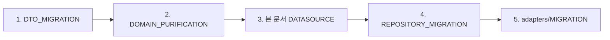

# 📋 Datasources 레이어 마이그레이션 가이드

> Clean Architecture datasources 레이어 구현을 위한 상세 가이드  
> **최종 업데이트**: 2025-01-09 | **버전**: 1.2.0
> **예상 시간**: 4시간 - MASTER_MIGRATION_GUIDE.md Phase 2의 일부
> **난이도**: ⭐⭐⭐
> **현재 상태**: ⏳ 시작 대기중 (Domain 레이어 ✅ 100% 완료)
> 
> ⚠️ **Note**: 이 문서는 전체 마이그레이션 Phase 2(Data 레이어)의 Sub-phase 2에 해당합니다.

## 📌 Prerequisites (전제조건)

### 시작 전 확인사항
- [ ] DTO 모델 구현 완료 ([DTO_MIGRATION_GUIDE.md](../DTO_MIGRATION_GUIDE.md) 참조)
- [x] Domain 인터페이스 정의 완료 ✅ **완료됨** ([domain/repositories/](../../domain/repositories/) 참조)
- [ ] Firebase 프로젝트 설정 확인
- [ ] 현재 Firebase 직접 호출 위치 파악 완료

### 필요한 도구
- [SUBAGENTS_MANUAL.md](/docs/SUBAGENTS_MANUAL.md) 참조
- Firebase SDK
- SharedPreferences/Hive

## 🔗 문서 연계 체인

### 실행 순서에서의 위치


### 의존성 관계
- **Input**: 
  - DTO 모델 (data/models/)
  - Domain 인터페이스 (domain/repositories/)
- **Output**: 
  - Datasource 인터페이스와 구현체
  - Firebase 접근 로직 캡슐화
- **Required by**:
  - [REPOSITORY_MIGRATION_GUIDE.md](../repositories/REPOSITORY_MIGRATION_GUIDE.md): Datasource 조합
  - [adapters/MIGRATION_GUIDE.md](../adapters/MIGRATION_GUIDE.md): 서비스 간소화

## 🤖 서브에이전트 활용

### Phase 1: Firebase 코드 이동 준비
```bash
# 현재 Firebase 직접 호출 위치 파악
/spawn inventory-scout "--depth 3 --scope lib/features/notifications/data --pattern 'FirebaseFirestore.instance'"

# Repository와 Adapters에서 Firebase 코드 추출
/spawn repo-mover "--feature notifications --mode dry-run --include firebase"
/spawn repo-mover "--feature notifications --mode apply --include firebase"
```

### Phase 2: Datasource 구현 및 DI 설정
```bash
# Remote Datasource DI 바인딩
/spawn di-binder "--feature notifications --port 'IRemoteNotificationDatasource' --adapter 'RemoteNotificationDatasourceImpl' --deps firestore --mode detect"

# Local Datasource DI 바인딩  
/spawn di-binder "--feature notifications --port 'ILocalNotificationDatasource' --adapter 'LocalNotificationDatasourceImpl' --deps shared_preferences,hive --mode detect"

# 패치 적용
git apply patches/di_notifications_datasources.diff
```

### Phase 3: 검증
```bash
# Import 위반 검사
/spawn import-guardian "--scope notifications/data/datasources --mode detect"

# 빌드 테스트
/spawn build-sentinel "quick"
```

## ⚠️ DTO 모델과의 통합 주의사항
- NotificationDto는 `data/models/`에 위치
- Datasource는 DTO만 다루고, Domain 모델은 모름
- Repository에서 Mapper를 통해 Domain ↔ DTO 변환

## 🎯 마이그레이션 목표

현재 adapters와 repositories에 혼재된 데이터 접근 로직을 datasources 레이어로 완전히 분리하여:
- **단일 책임 원칙**: 각 datasource가 하나의 데이터 소스만 담당
- **의존성 역전**: Repository가 datasource 인터페이스에만 의존
- **테스트 용이성**: Mock datasource로 단위 테스트 가능
- **캐싱 전략**: 체계적인 로컬/원격 데이터 관리

## 🔍 현재 상태 분석

### 문제점 요약
```
현재 구조 (❌ 잘못됨):
lib/features/notifications/data/
├── adapters/
│   ├── notification_service.dart      # Firebase 직접 호출 (255줄)
│   ├── global_notification_manager.dart # UI + Data 혼재 (493줄)
│   └── target_audience_service.dart    # Posts 직접 접근 (272줄)
├── repositories/
│   └── notification_repository_impl.dart # 데이터 접근 로직 포함 (284줄)
└── datasources/
    └── README.md                       # 구현 없음 ⚠️

목표 구조 (✅ 올바름):
lib/features/notifications/data/
├── datasources/
│   ├── remote/                        # Firebase 접근
│   ├── local/                         # 로컬 캐시
│   └── post/                          # Cross-feature 데이터
├── repositories/
│   └── notification_repository_impl.dart # 조합 로직만
└── adapters/
    └── (비즈니스 로직만)
```

## 📝 파일별 상세 마이그레이션 계획

### Step 1: RemoteNotificationDatasource 생성

#### 1-1. 인터페이스 정의
```dart
// 신규: datasources/remote/i_remote_notification_datasource.dart
abstract class IRemoteNotificationDatasource {
  // 기존: notification_service.dart (46-61줄)
  Stream<List<Map<String, dynamic>>> watchUserNotifications({
    required String userId,
    required String type,
    required bool unreadOnly,
    DateTime? after,
  });
  
  // 기존: notification_service.dart (112-122줄)
  Stream<int> watchUnreadCount({
    required String userId,
    required String type,
  });
  
  // 기존: notification_repository_impl.dart (96-130줄)
  Future<Map<String, dynamic>?> getNotification(String id);
  Future<String> createNotification(Map<String, dynamic> data);
  Future<void> updateNotification(String id, Map<String, dynamic> updates);
  Future<void> deleteNotification(String id);
  
  // 기존: notification_repository_impl.dart (195-227줄)
  Future<void> batchUpdate(List<BatchUpdateRequest> requests);
  Future<void> markAllAsRead(String userId);
  
  // 기존: notification_service.dart (133-214줄)
  Future<void> createVoteRequestMessage({
    required String senderId,
    required String recipientId,
    required String postId,
    required Map<String, dynamic> postData,
  });
  
  // 기존: notification_service.dart (216-254줄)
  Future<void> updateVoteMessageStatus({
    required String postId,
    required String userId,
    required String status,
  });
}
```

#### 1-2. 구현체 생성
```dart
// 신규: datasources/remote/remote_notification_datasource_impl.dart
import 'package:cloud_firestore/cloud_firestore.dart';

class RemoteNotificationDatasourceImpl implements IRemoteNotificationDatasource {
  final FirebaseFirestore _firestore;
  
  RemoteNotificationDatasourceImpl({
    required FirebaseFirestore firestore,
  }) : _firestore = firestore;
  
  @override
  Stream<List<Map<String, dynamic>>> watchUserNotifications({
    required String userId,
    required String type,
    required bool unreadOnly,
    DateTime? after,
  }) {
    // 기존 notification_service.dart의 _notificationListener 로직 이동
    Query query = _firestore
        .collection('notifications')
        .where('userId', isEqualTo: userId)
        .where('type', isEqualTo: type);
    
    if (unreadOnly) {
      query = query.where('read', isEqualTo: false);
    }
    
    if (after != null) {
      query = query.where('expiryTime', isGreaterThan: Timestamp.fromDate(after));
    }
    
    return query
        .orderBy('expiryTime', descending: false)
        .orderBy('createdAt', descending: true)
        .snapshots()
        .map((snapshot) => snapshot.docs
            .map((doc) => {'id': doc.id, ...doc.data() as Map<String, dynamic>})
            .toList());
  }
  
  // ... 나머지 메서드 구현
}
```

### Step 2: LocalNotificationDatasource 생성

#### 2-1. 인터페이스 정의
```dart
// 신규: datasources/local/i_local_notification_datasource.dart
abstract class ILocalNotificationDatasource {
  // 기존: global_notification_manager.dart (432-440줄)
  Future<Set<String>> getProcessedNotificationIds();
  Future<void> saveProcessedNotificationIds(Set<String> ids);
  
  // 신규: 캐싱 기능
  Future<List<Map<String, dynamic>>> getCachedNotifications(String userId);
  Future<void> cacheNotifications(String userId, List<Map<String, dynamic>> data);
  Future<void> clearCache(String userId);
  Future<DateTime?> getLastCacheTime(String userId);
  
  // 신규: 설정 관리
  Future<Map<String, dynamic>> getNotificationPreferences(String userId);
  Future<void> saveNotificationPreferences(String userId, Map<String, dynamic> prefs);
}
```

#### 2-2. 구현체 생성
```dart
// 신규: datasources/local/local_notification_datasource_impl.dart
import 'package:shared_preferences/shared_preferences.dart';
import 'package:hive/hive.dart'; // 향후

class LocalNotificationDatasourceImpl implements ILocalNotificationDatasource {
  final SharedPreferences _prefs;
  static const String _processedIdsKey = 'processed_notification_ids';
  static const String _cacheKeyPrefix = 'cached_notifications_';
  static const String _cacheTimePrefix = 'cache_time_';
  
  LocalNotificationDatasourceImpl({
    required SharedPreferences prefs,
  }) : _prefs = prefs;
  
  @override
  Future<Set<String>> getProcessedNotificationIds() async {
    // 기존 global_notification_manager.dart의 _loadProcessedNotifications 로직
    final savedIds = _prefs.getStringList(_processedIdsKey) ?? [];
    return savedIds.toSet();
  }
  
  @override
  Future<void> saveProcessedNotificationIds(Set<String> ids) async {
    // 기존 global_notification_manager.dart의 _saveProcessedNotifications 로직
    await _prefs.setStringList(_processedIdsKey, ids.toList());
  }
  
  // ... 나머지 메서드 구현
}
```

### Step 3: PostDatasource 생성 (Cross-feature 분리)

#### 3-1. 인터페이스 정의
```dart
// 신규: datasources/post/i_post_datasource.dart
abstract class IPostDatasource {
  // 기존: global_notification_manager.dart (230-240줄)
  Future<Map<String, dynamic>?> getPost(String postId);
  
  // 기존: target_audience_service.dart (137줄)
  Future<String> createPostWithTargetAudience({
    required Map<String, dynamic> postData,
    required Map<String, dynamic> targetAudience,
  });
  
  // 기존: target_audience_service.dart (171줄)
  Future<void> updatePostNotificationStatus({
    required String postId,
    required bool notificationsSent,
  });
}
```

### Step 4: Repository 리팩토링

#### 4-1. Repository 수정
```dart
// 수정: repositories/notification_repository_impl.dart
class NotificationRepositoryImpl implements INotificationRepository {
  final IRemoteNotificationDatasource _remoteDatasource;
  final ILocalNotificationDatasource _localDatasource;
  final IPostDatasource _postDatasource; // Cross-feature
  
  NotificationRepositoryImpl({
    required IRemoteNotificationDatasource remoteDatasource,
    required ILocalNotificationDatasource localDatasource,
    required IPostDatasource postDatasource,
  }) : _remoteDatasource = remoteDatasource,
       _localDatasource = localDatasource,
       _postDatasource = postDatasource;
  
  @override
  Stream<List<NotificationEntity>> watchNotifications(String userId) {
    // 데이터 소스 조합 로직
    return _remoteDatasource
        .watchUserNotifications(
          userId: userId,
          type: 'votingRequest',
          unreadOnly: false,
        )
        .asyncMap((remoteData) async {
          // 로컬 캐시 업데이트
          await _localDatasource.cacheNotifications(userId, remoteData);
          
          // 엔티티로 변환
          return remoteData.map(_mapToEntity).toList();
        });
  }
  
  @override
  Future<List<NotificationEntity>> getCachedNotifications(String userId) async {
    // 캐시 우선, 없으면 원격
    final cached = await _localDatasource.getCachedNotifications(userId);
    
    if (cached.isNotEmpty) {
      final cacheTime = await _localDatasource.getLastCacheTime(userId);
      // 30분 이내면 캐시 사용
      if (cacheTime != null && 
          DateTime.now().difference(cacheTime).inMinutes < 30) {
        return cached.map(_mapToEntity).toList();
      }
    }
    
    // 캐시 만료시 원격에서 가져오기
    final stream = _remoteDatasource.watchUserNotifications(
      userId: userId,
      type: 'votingRequest',
      unreadOnly: false,
    );
    
    final remoteData = await stream.first;
    await _localDatasource.cacheNotifications(userId, remoteData);
    
    return remoteData.map(_mapToEntity).toList();
  }
  
  NotificationEntity _mapToEntity(Map<String, dynamic> data) {
    // 데이터 변환 로직
    return NotificationEntity.fromJson(data);
  }
}
```

### Step 5: Adapter 정리

#### 5-1. NotificationService 간소화
```dart
// 수정: adapters/notification_service.dart
class NotificationService {
  final INotificationRepository _repository;
  StreamSubscription<List<NotificationEntity>>? _subscription;
  
  NotificationService({
    required INotificationRepository repository,
  }) : _repository = repository;
  
  void startListening(String userId) {
    // Repository를 통해서만 데이터 접근
    _subscription = _repository
        .watchNotifications(userId)
        .listen(_handleNotifications);
  }
  
  void _handleNotifications(List<NotificationEntity> notifications) {
    // 비즈니스 로직만 처리
    // Firebase 직접 호출 없음
  }
}
```

### Step 6: DI 설정 업데이트

```dart
// 수정: app/di/modules/notification_module.dart
void setupNotificationModule() {
  // Datasources
  GetIt.I.registerLazySingleton<IRemoteNotificationDatasource>(
    () => RemoteNotificationDatasourceImpl(
      firestore: GetIt.I<FirebaseFirestore>(),
    ),
  );
  
  GetIt.I.registerLazySingleton<ILocalNotificationDatasource>(
    () => LocalNotificationDatasourceImpl(
      prefs: GetIt.I<SharedPreferences>(),
    ),
  );
  
  GetIt.I.registerLazySingleton<IPostDatasource>(
    () => PostDatasourceImpl(
      firestore: GetIt.I<FirebaseFirestore>(),
    ),
  );
  
  // Repository
  GetIt.I.registerLazySingleton<INotificationRepository>(
    () => NotificationRepositoryImpl(
      remoteDatasource: GetIt.I<IRemoteNotificationDatasource>(),
      localDatasource: GetIt.I<ILocalNotificationDatasource>(),
      postDatasource: GetIt.I<IPostDatasource>(),
    ),
  );
  
  // Services
  GetIt.I.registerLazySingleton<NotificationService>(
    () => NotificationService(
      repository: GetIt.I<INotificationRepository>(),
    ),
  );
}
```

## 🔄 마이그레이션 실행 순서

### Phase 1: 기초 구조 생성 (1시간)
1. [ ] datasources 디렉토리 구조 생성
2. [ ] 모든 인터페이스 정의
3. [ ] BatchUpdateRequest 등 공통 모델 정의

### Phase 2: Remote Datasource (2시간)
4. [ ] RemoteNotificationDatasourceImpl 구현
5. [ ] Firebase 직접 호출 코드 이동
6. [ ] 단위 테스트 작성

### Phase 3: Local Datasource (1시간)
7. [ ] LocalNotificationDatasourceImpl 구현
8. [ ] SharedPreferences 코드 이동
9. [ ] 캐싱 로직 구현

### Phase 4: Post Datasource (1시간)
10. [ ] PostDatasourceImpl 구현
11. [ ] Cross-feature 코드 이동
12. [ ] 도메인 인터페이스 정의

### Phase 5: Repository 리팩토링 (1.5시간)
13. [ ] Repository에서 Firebase 직접 호출 제거
14. [ ] Datasource 조합 로직 구현
15. [ ] 엔티티 변환 로직 정리

### Phase 6: Adapter 정리 (1시간)
16. [ ] NotificationService 간소화
17. [ ] GlobalNotificationManager에서 데이터 접근 제거
18. [ ] TargetAudienceService 정리

### Phase 7: 통합 및 검증 (0.5시간)
19. [ ] DI 설정 업데이트
20. [ ] 통합 테스트 실행
21. [ ] Import Guardian 실행

## 🧪 테스트 전략

### 단위 테스트
```dart
// test/features/notifications/data/datasources/remote_notification_datasource_test.dart
void main() {
  group('RemoteNotificationDatasource', () {
    late MockFirebaseFirestore mockFirestore;
    late RemoteNotificationDatasourceImpl datasource;
    
    setUp(() {
      mockFirestore = MockFirebaseFirestore();
      datasource = RemoteNotificationDatasourceImpl(firestore: mockFirestore);
    });
    
    test('watchUserNotifications returns stream of notifications', () async {
      // Arrange
      when(mockFirestore.collection('notifications')).thenReturn(...);
      
      // Act
      final stream = datasource.watchUserNotifications(
        userId: 'test_user',
        type: 'votingRequest',
        unreadOnly: false,
      );
      
      // Assert
      expect(stream, emitsInOrder([...]));
    });
  });
}
```

### 통합 테스트
```dart
// test/features/notifications/integration/notification_flow_test.dart
void main() {
  testWidgets('Complete notification flow', (tester) async {
    // Setup DI
    await setupTestDependencies();
    
    // Test notification creation -> display -> interaction
    // ...
  });
}
```

## ⚠️ 주의사항

### 마이그레이션 중
1. **점진적 이동**: 한 번에 모든 코드를 이동하지 말고 단계별로
2. **백업 유지**: 각 단계별로 git commit
3. **기능 테스트**: 각 단계 후 기능 동작 확인

### 일반적인 함정
1. **Timestamp 처리**: Firestore Timestamp ↔ DateTime 변환
2. **Null 처리**: Firestore null 값 처리
3. **Stream 관리**: StreamSubscription 적절한 dispose
4. **에러 처리**: try-catch로 Firebase 예외 처리

## 📊 예상 결과

### Before
- 코드 중복: 30%
- 테스트 커버리지: 0%
- 레이어 위반: 8건

### After
- 코드 중복: 5%
- 테스트 커버리지: 80%+
- 레이어 위반: 0건

## 🛠️ 유용한 도구

### Import Guardian 실행
```bash
/spawn import-guardian "--scope notifications --mode detect"
```

### Build Sentinel 실행
```bash
/spawn build-sentinel "quick"
```

### 코드 품질 확인
```bash
flutter analyze lib/features/notifications/
```

---

*이 가이드를 따라 datasources 레이어를 구현하면 Clean Architecture를 완벽히 준수하는 구조가 됩니다.*  
*질문이나 이슈가 있으면 아키텍처 팀에 문의하세요.*