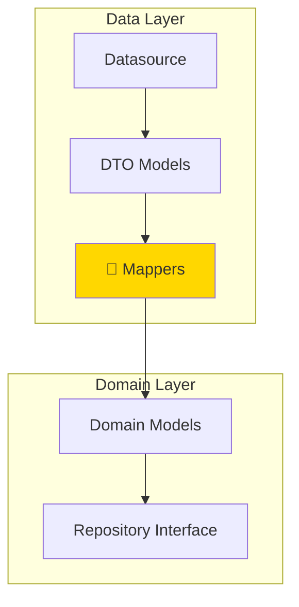

# 🔄 Notifications Mappers

> DTO ↔ Domain Model 변환 레이어  
> 최종 업데이트: 2025-01-09

## 📋 개요

Mapper는 Data Layer의 DTO와 Domain Layer의 순수 모델 간 변환을 담당합니다.
Firebase 스키마 변경이나 Domain 모델 변경 시 이 레이어만 수정하면 됩니다.

## 🏛️ 아키텍처 위치



### 핵심 책임
- **양방향 변환**: DTO ↔ Domain 상호 변환
- **타입 안정성**: 컴파일 타임 타입 체크
- **에러 처리**: 변환 실패 시 적절한 처리
- **다형성 처리**: 알림 타입별 적절한 모델 생성

## 📁 파일 구조

```
mappers/
├── notification_mapper.dart        # 메인 매퍼
├── vote_notification_mapper.dart   # 투표 알림 전용
├── social_notification_mapper.dart # 소셜 알림 전용
├── mapper_extensions.dart          # 유틸리티 확장
└── mapper_exceptions.dart          # 매핑 에러 정의
```

## 🔧 구현 예시

### 메인 Mapper 구현

```dart
// notification_mapper.dart
import '../models/notification_dto.dart';
import '../../../domain/models/notification.dart';
import '../../../domain/models/vote_notification.dart';
import '../../../domain/models/social_notification.dart';
import '../../../domain/models/system_notification.dart';

class NotificationMapper {
  // DTO → Domain
  static Notification toDomain(NotificationDto dto) {
    try {
      // 타입별 분기 처리
      switch (dto.type) {
        case 'vote_request':
          return _toVoteNotification(dto);
        
        case 'post_liked':
        case 'comment_added':
          return _toSocialNotification(dto);
        
        case 'system_alert':
          return _toSystemNotification(dto);
        
        default:
          throw UnknownNotificationTypeException(dto.type);
      }
    } catch (e) {
      throw MappingException(
        'Failed to map NotificationDto to Domain',
        source: dto,
        error: e,
      );
    }
  }
  
  // Domain → DTO
  static NotificationDto toDto(Notification domain) {
    try {
      if (domain is VoteNotification) {
        return _fromVoteNotification(domain);
      } else if (domain is SocialNotification) {
        return _fromSocialNotification(domain);
      } else if (domain is SystemNotification) {
        return _fromSystemNotification(domain);
      } else {
        throw UnknownDomainTypeException(domain.runtimeType);
      }
    } catch (e) {
      throw MappingException(
        'Failed to map Domain to NotificationDto',
        source: domain,
        error: e,
      );
    }
  }
  
  // 투표 알림 변환
  static VoteNotification _toVoteNotification(NotificationDto dto) {
    // 필수 필드 검증
    if (dto.postId == null || dto.voteOptions == null) {
      throw InvalidDtoException(
        'VoteNotification requires postId and voteOptions',
      );
    }
    
    return VoteNotification(
      id: dto.id,
      userId: dto.userId,
      createdAt: DateTime.fromMillisecondsSinceEpoch(dto.createdAt),
      isRead: dto.read,
      postId: dto.postId!,
      postTitle: dto.postTitle ?? '',
      imageUrlsA: dto.imageUrlsA ?? [],
      imageUrlsB: dto.imageUrlsB ?? [],
      voteOptions: VoteOptions.fromMap(dto.voteOptions!),
      voteEndTime: dto.voteEndTime != null
          ? DateTime.fromMillisecondsSinceEpoch(dto.voteEndTime!)
          : DateTime.now().add(Duration(minutes: 10)),
      targetAudience: dto.targetAudience,
    );
  }
  
  // 소셜 알림 변환
  static SocialNotification _toSocialNotification(NotificationDto dto) {
    final actionType = dto.type == 'post_liked' 
        ? SocialActionType.like 
        : SocialActionType.comment;
    
    return SocialNotification(
      id: dto.id,
      userId: dto.userId,
      createdAt: DateTime.fromMillisecondsSinceEpoch(dto.createdAt),
      isRead: dto.read,
      actionType: actionType,
      actorId: dto.likerId ?? dto.commenterId ?? '',
      postId: dto.postId ?? '',
      content: dto.commentText,
    );
  }
  
  // 역변환: VoteNotification → DTO
  static NotificationDto _fromVoteNotification(VoteNotification domain) {
    return NotificationDto(
      id: domain.id,
      userId: domain.userId,
      type: 'vote_request',
      createdAt: domain.createdAt.millisecondsSinceEpoch,
      read: domain.isRead,
      postId: domain.postId,
      postTitle: domain.postTitle,
      imageUrlsA: domain.imageUrlsA,
      imageUrlsB: domain.imageUrlsB,
      voteOptions: domain.voteOptions.toMap(),
      voteEndTime: domain.voteEndTime.millisecondsSinceEpoch,
      targetAudience: domain.targetAudience,
    );
  }
}
```

### 유틸리티 확장

```dart
// mapper_extensions.dart
extension DateTimeMapping on DateTime {
  int toFirestoreTimestamp() => millisecondsSinceEpoch;
  
  static DateTime fromFirestoreTimestamp(dynamic value) {
    if (value is int) {
      return DateTime.fromMillisecondsSinceEpoch(value);
    } else if (value is Timestamp) {
      return value.toDate();
    } else {
      return DateTime.now();
    }
  }
}

extension SafeMapping<T> on T? {
  R mapOrDefault<R>(R Function(T) mapper, R defaultValue) {
    return this != null ? mapper(this as T) : defaultValue;
  }
}
```

### 에러 처리

```dart
// mapper_exceptions.dart
class MappingException implements Exception {
  final String message;
  final dynamic source;
  final dynamic error;
  
  MappingException(this.message, {this.source, this.error});
  
  @override
  String toString() => 'MappingException: $message\n'
      'Source: $source\n'
      'Error: $error';
}

class UnknownNotificationTypeException extends MappingException {
  UnknownNotificationTypeException(String type) 
      : super('Unknown notification type: $type');
}

class InvalidDtoException extends MappingException {
  InvalidDtoException(String message) : super(message);
}
```

## 🔄 변환 플로우

### 1. Firestore → Domain
```
Firestore Document
    ↓
NotificationDto.fromFirestore()
    ↓
NotificationMapper.toDomain()
    ↓
Domain Model (VoteNotification, etc.)
```

### 2. Domain → Firestore
```
Domain Model
    ↓
NotificationMapper.toDto()
    ↓
NotificationDto.toJson()
    ↓
Firestore Document
```

## 🎯 타입별 매핑 규칙

### VoteNotification 매핑
| DTO Field | Domain Property | Transformation |
|-----------|----------------|----------------|
| `postId` | `postId` | Direct |
| `imageUrlsA` | `imageUrlsA` | Default to [] |
| `voteOptions` | `voteOptions` | Map → VoteOptions |
| `createdAt` (int) | `createdAt` (DateTime) | Timestamp conversion |

### SocialNotification 매핑
| DTO Field | Domain Property | Transformation |
|-----------|----------------|----------------|
| `type` | `actionType` | String → Enum |
| `likerId`/`commenterId` | `actorId` | Conditional |
| `commentText` | `content` | Optional |

## 🧪 테스트 전략

### 단위 테스트
```dart
// test/mappers/notification_mapper_test.dart
void main() {
  group('NotificationMapper', () {
    test('should map VoteNotification DTO to Domain', () {
      final dto = NotificationDto(
        id: '123',
        userId: 'user1',
        type: 'vote_request',
        // ... 필드들
      );
      
      final domain = NotificationMapper.toDomain(dto);
      
      expect(domain, isA<VoteNotification>());
      expect(domain.id, equals('123'));
    });
    
    test('should handle invalid DTO gracefully', () {
      final invalidDto = NotificationDto(
        type: 'vote_request',
        // postId 누락!
      );
      
      expect(
        () => NotificationMapper.toDomain(invalidDto),
        throwsA(isA<InvalidDtoException>()),
      );
    });
  });
}
```

## ⚠️ 주의사항

1. **Null Safety**: 모든 nullable 필드 안전하게 처리
2. **에러 전파**: 변환 실패 시 명확한 에러 메시지
3. **성능**: 대량 변환 시 배치 처리 고려
4. **메모리**: 순환 참조 방지

## 📊 매핑 복잡도

| Notification Type | Fields | Complexity | Notes |
|------------------|--------|------------|-------|
| VoteNotification | 12 | High | 이미지 배열, 옵션 맵 처리 |
| SocialNotification | 8 | Medium | 조건부 필드 처리 |
| SystemNotification | 5 | Low | 단순 텍스트 기반 |

## 🚀 Best Practices

1. **불변성 유지**: 변환 중 원본 데이터 수정 금지
2. **타입 안정성**: Generic 활용으로 타입 안정성 확보
3. **에러 복구**: 가능한 경우 기본값으로 복구
4. **로깅**: 변환 실패 시 상세 로그 남기기

```dart
// 좋은 예: 에러 복구
final imageUrlsA = dto.imageUrlsA ?? [];  // 기본값 제공

// 나쁜 예: 에러 무시
final imageUrlsA = dto.imageUrlsA!;  // null 시 크래시
```

## 📈 마이그레이션 상태

| 항목 | 상태 | 설명 |
|-----|------|------|
| 기본 Mapper 구조 | 🟡 진행중 | 인터페이스 설계 완료 |
| 타입별 변환 로직 | ⏳ 대기 | 각 타입별 구현 필요 |
| 에러 처리 | ⏳ 대기 | Exception 클래스 정의 |
| 테스트 작성 | ⏳ 대기 | 단위 테스트 필요 |

## 🔗 관련 문서

- [DTO 모델 문서](../models/README.md)
- [Domain 모델 문서](../../domain/models/README.md)
- [Repository 구현](../repositories/README.md)