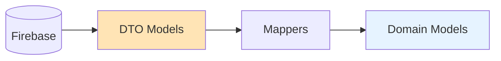

# 📦 Notifications Data Models (DTOs)

> Data Transfer Objects for Notifications Feature  
> 최종 업데이트: 2025-01-09

## 📋 개요

이 디렉토리는 Firebase와 직접 통신하는 DTO(Data Transfer Object) 모델들을 포함합니다. 
DTO는 외부 데이터 소스(Firebase)의 스키마를 그대로 반영하며, Domain 모델과의 변환을 담당합니다.

## 🏛️ 아키텍처 역할



### 핵심 원칙
- **Firebase 스키마 그대로 반영**: 필드명, 타입 모두 Firebase와 1:1 매칭
- **JSON Serialization 지원**: json_serializable 패키지 활용
- **Domain 독립성**: Domain 모델을 import하지 않음
- **타입 안정성**: nullable 필드로 폴리모픽 데이터 처리

## 📁 파일 구조

```
models/
├── notification_dto.dart          # 기본 알림 DTO
├── notification_dto.g.dart         # JSON 생성 코드 (자동생성)
├── vote_notification_dto.dart      # 투표 알림 전용 DTO
├── social_notification_dto.dart    # 소셜 알림 전용 DTO
└── system_notification_dto.dart    # 시스템 알림 전용 DTO
```

## 🔧 구현 예시

### 기본 DTO 구조

```dart
// notification_dto.dart
import 'package:json_annotation/json_annotation.dart';

part 'notification_dto.g.dart';

@JsonSerializable()
class NotificationDto {
  // Firebase 필드명 그대로 사용 (snake_case)
  final String id;
  final String userId;  // Firestore: userId
  final String type;
  final int createdAt;  // Timestamp as milliseconds
  final bool read;
  
  // 타입별 폴리모픽 필드들 (nullable)
  final String? postId;
  final String? postTitle;
  final List<String>? imageUrlsA;
  final List<String>? imageUrlsB;
  final Map<String, dynamic>? voteOptions;
  final String? likerId;
  final String? commentText;
  final String? systemMessage;
  
  NotificationDto({
    required this.id,
    required this.userId,
    required this.type,
    required this.createdAt,
    required this.read,
    this.postId,
    this.postTitle,
    this.imageUrlsA,
    this.imageUrlsB,
    this.voteOptions,
    this.likerId,
    this.commentText,
    this.systemMessage,
  });
  
  factory NotificationDto.fromJson(Map<String, dynamic> json) =>
      _$NotificationDtoFromJson(json);
      
  Map<String, dynamic> toJson() => _$NotificationDtoToJson(this);
  
  // Firestore Document 변환
  factory NotificationDto.fromFirestore(
    DocumentSnapshot<Map<String, dynamic>> doc,
  ) {
    final data = doc.data()!;
    return NotificationDto.fromJson({
      'id': doc.id,
      ...data,
      // Timestamp 변환
      'createdAt': (data['createdAt'] as Timestamp?)
          ?.millisecondsSinceEpoch ?? 
          DateTime.now().millisecondsSinceEpoch,
    });
  }
}
```

### 투표 알림 전용 DTO

```dart
// vote_notification_dto.dart
@JsonSerializable()
class VoteNotificationDto extends NotificationDto {
  @override
  final String postId;
  @override
  final String postTitle;
  @override
  final List<String> imageUrlsA;
  @override
  final List<String> imageUrlsB;
  @override
  final Map<String, dynamic> voteOptions;
  
  final int voteEndTime;
  final String? targetAudience;
  
  VoteNotificationDto({
    required super.id,
    required super.userId,
    required super.createdAt,
    required super.read,
    required this.postId,
    required this.postTitle,
    required this.imageUrlsA,
    required this.imageUrlsB,
    required this.voteOptions,
    required this.voteEndTime,
    this.targetAudience,
  }) : super(type: 'vote_request');
}
```

## 🔄 Firebase 스키마 매핑

| Firebase Field | DTO Property | Type | Description |
|---------------|--------------|------|-------------|
| `userId` | `userId` | `String` | 사용자 ID |
| `type` | `type` | `String` | 알림 타입 |
| `createdAt` | `createdAt` | `int` | 생성 시간 (ms) |
| `read` | `read` | `bool` | 읽음 여부 |
| `postId` | `postId` | `String?` | 게시물 ID (vote) |
| `imageUrlsA` | `imageUrlsA` | `List<String>?` | A 옵션 이미지 |
| `imageUrlsB` | `imageUrlsB` | `List<String>?` | B 옵션 이미지 |

## 🎯 알림 타입별 DTO

### 타입 분류
```dart
enum NotificationDtoType {
  voteRequest,    // 투표 요청
  postLiked,      // 게시물 좋아요
  commentAdded,   // 댓글 추가
  friendRequest,  // 친구 요청
  systemAlert,    // 시스템 알림
}
```

### 타입별 필수 필드
- **vote_request**: postId, postTitle, imageUrlsA/B, voteOptions
- **post_liked**: postId, likerId, likedAt
- **comment_added**: postId, commenterId, commentText
- **friend_request**: requesterId, requesterName
- **system_alert**: systemMessage, priority

## 🚀 사용 방법

### 1. Firestore에서 DTO 로드
```dart
// datasource에서 사용
Stream<List<NotificationDto>> getNotifications(String userId) {
  return FirebaseFirestore.instance
      .collection('notifications')
      .where('userId', isEqualTo: userId)
      .snapshots()
      .map((snapshot) => snapshot.docs
          .map((doc) => NotificationDto.fromFirestore(doc))
          .toList());
}
```

### 2. JSON 직렬화
```dart
// API 응답 처리
final json = response.data;
final dto = NotificationDto.fromJson(json);

// 로컬 캐싱
final jsonString = jsonEncode(dto.toJson());
```

## ⚠️ 주의사항

1. **Domain 모델 import 금지**: DTO는 순수 데이터 전송 객체
2. **비즈니스 로직 금지**: 모든 로직은 Domain 모델에서 처리
3. **Firebase 타입 사용 최소화**: fromFirestore 메서드에서만 사용
4. **필드명 변경 금지**: Firebase 스키마와 1:1 매칭 유지

## 📈 마이그레이션 상태

| 항목 | 상태 | 설명 |
|-----|------|------|
| DTO 모델 생성 | 🟡 진행중 | 기본 구조 설계 완료 |
| JSON Serialization | ⏳ 대기 | json_serializable 설정 필요 |
| Firebase 매핑 | ⏳ 대기 | fromFirestore 메서드 구현 |
| 타입별 DTO | ⏳ 대기 | 각 타입별 DTO 생성 필요 |

## 🔗 관련 문서

- [Mapper 구현 가이드](../mappers/README.md)
- [Domain 모델 문서](../../domain/models/README.md)
- [전체 마이그레이션 가이드](../MIGRATION_GUIDE.md)