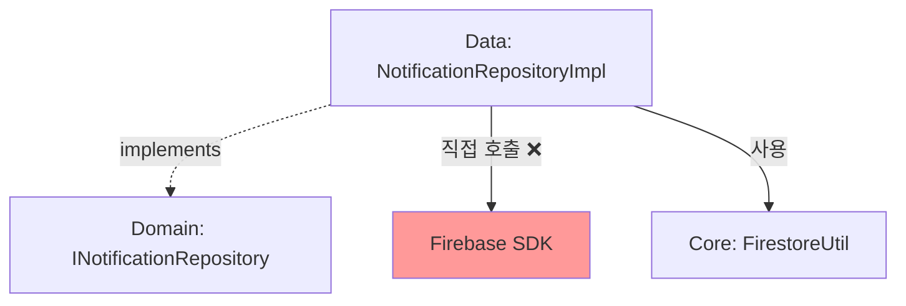
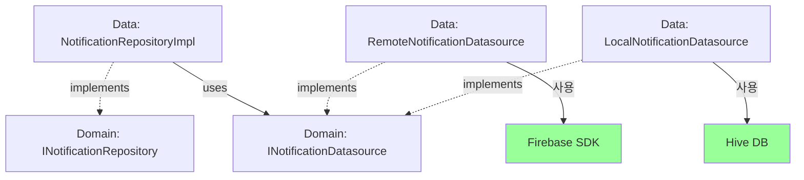

# 📦 Notifications Data Repositories Layer

> Feature-First Clean Architecture - 알림 레포지토리 구현 레이어  
> **최종 업데이트**: 2025-01-09 | **상태**: ⚠️ 리팩토링 필요 (60% 준수)

## 📋 현재 상황

**구현 상태**: NotificationRepositoryImpl이 구현되어 있으나, Clean Architecture 원칙을 완전히 준수하지 않고 있습니다.

### 현재 문제점
- **Firebase 직접 호출**: Repository에서 `FirebaseFirestore.instance` 직접 사용 (15회)
- **Datasource 레이어 우회**: 데이터 접근 로직이 Repository에 직접 구현됨
- **싱글톤 패턴**: 의존성 주입 대신 하드코딩된 싱글톤 사용
- **Domain 타입 오염**: Domain 인터페이스에 Firebase `Query` 타입 노출

### 준수 사항
- ✅ INotificationRepository 인터페이스 100% 구현 (71개 메서드)
- ✅ Cross-feature 의존성 없음
- ✅ Presentation layer import 없음
- ✅ 풍부한 기능 지원 (CRUD, 쿼리, 배치, 푸시 알림)

## 🏗️ 현재 구조

```
data/repositories/
├── README.md                             # 이 문서
├── notification_repository_impl.dart     # Repository 구현 (284줄)
└── REPOSITORY_MIGRATION_GUIDE.md        # 마이그레이션 가이드 (생성 예정)
```

## 📦 구현된 기능

### NotificationRepositoryImpl
**현재 구현** (284줄):
- **Query 연산**: queryNotificationModel, queryNotifications (Stream/Future)
- **Count 연산**: queryNotificationModelCount, queryNotificationsCount
- **CRUD 연산**: create, get, update, delete
- **읽음 처리**: markAsRead, markAllAsRead, getUnreadCount
- **사용자별 조회**: getUserNotifications (페이지네이션 지원)
- **배치 연산**: deleteAllNotifications, deleteOldNotifications
- **푸시 알림**: sendPushNotification, sendBatchNotifications (TODO 상태)

## 🔌 현재 의존성 구조



## 🎯 목표 의존성 구조



## 🔧 사용 방법

### 현재 사용법 (싱글톤)
```dart
// 현재: 싱글톤 패턴
final repository = NotificationRepositoryImpl.instance;

// 알림 조회
final notifications = await repository.getUserNotifications(
  userId: 'user123',
  limit: 20,
  unreadOnly: true,
);

// 읽음 처리
await repository.markAsRead('notification_id');
```

### 권장 사용법 (의존성 주입)
```dart
// 권장: 의존성 주입
// app/di/modules/notification_module.dart
GetIt.I.registerLazySingleton<INotificationRepository>(
  () => NotificationRepositoryImpl(
    remoteDatasource: GetIt.I<IRemoteNotificationDatasource>(),
    localDatasource: GetIt.I<ILocalNotificationDatasource>(),
  ),
);

// 사용처에서
final repository = GetIt.I<INotificationRepository>();
```

## 🚨 아키텍처 위반 사항

### 1. Firebase 직접 호출 (Critical)
**위반 라인**: 96, 105, 121, 130, 141-142, 164, 184, 197-198, 215-216, 263, 267
```dart
// ❌ 현재: Repository에서 Firebase 직접 호출
FirebaseFirestore.instance.collection('notifications')

// ✅ 개선: Datasource를 통한 간접 호출
_remoteDatasource.getNotification(id)
```

### 2. Domain 타입 오염 (High)
**위반 파일**: `/domain/repositories/i_notification_repository.dart`
```dart
// ❌ 현재: Firebase Query 타입 노출
Query Function(Query)? queryBuilder

// ✅ 개선: 도메인 타입 사용
NotificationQueryBuilder? queryBuilder
```

### 3. 싱글톤 안티패턴 (Medium)
**위반 라인**: 9-12
```dart
// ❌ 현재: 하드코딩된 싱글톤
static NotificationRepositoryImpl? _instance;

// ✅ 개선: 생성자 주입
NotificationRepositoryImpl(this._remoteDatasource, this._localDatasource);
```

## 📊 API 연계 상황

### Firebase Firestore
- **컬렉션**: `notifications`
- **작업 수**: 15개 직접 호출
- **배치 작업**: 3개 (markAllAsRead, deleteAll, deleteOld)
- **트랜잭션**: 미사용

### Firebase Cloud Messaging (FCM)
- **상태**: TODO 주석 처리됨
- **대체 구현**: Firestore에 알림 레코드 생성
- **향후 계획**: FCM SDK 통합 필요

## 🔄 마이그레이션 고려사항

### 새 기능 추가 시
1. **Datasource 먼저 확인**: 데이터 접근 로직은 Datasource에 추가
2. **Repository는 조율만**: Repository는 Datasource 호출과 에러 처리만 담당
3. **Domain 순수성 유지**: Domain 인터페이스에 Firebase 타입 노출 금지

### 코드 수정 시
1. **Firebase 호출 제거**: 모든 `FirebaseFirestore.instance`를 Datasource 호출로 변경
2. **의존성 주입 적용**: 싱글톤 제거하고 생성자 주입 사용
3. **에러 처리 강화**: try-catch와 Either 타입 활용

## ✅ 체크리스트

### 구현 완료
- [x] NotificationRepositoryImpl 생성
- [x] 모든 Domain 인터페이스 메서드 구현
- [x] 기본 CRUD 연산
- [x] 쿼리 및 스트림 지원
- [x] 배치 작업 지원

### 리팩토링 필요
- [ ] Datasource 레이어 분리 (Critical)
- [ ] Firebase 직접 호출 제거 (Critical)
- [ ] Domain 타입 순수화 (High)
- [ ] 싱글톤 제거 및 DI 적용 (Medium)
- [ ] 에러 처리 개선 (Low)

### 향후 구현
- [ ] FCM 통합
- [ ] 오프라인 동기화
- [ ] 캐시 전략 고도화

---

*Feature-First Architecture의 일부로 작성됨*
*최종 업데이트: 2025-08-25*