# Versus Space 백엔드 아키텍처 다이어그램

## 1. 전체 시스템 아키텍처 (활성화 상태 포함)

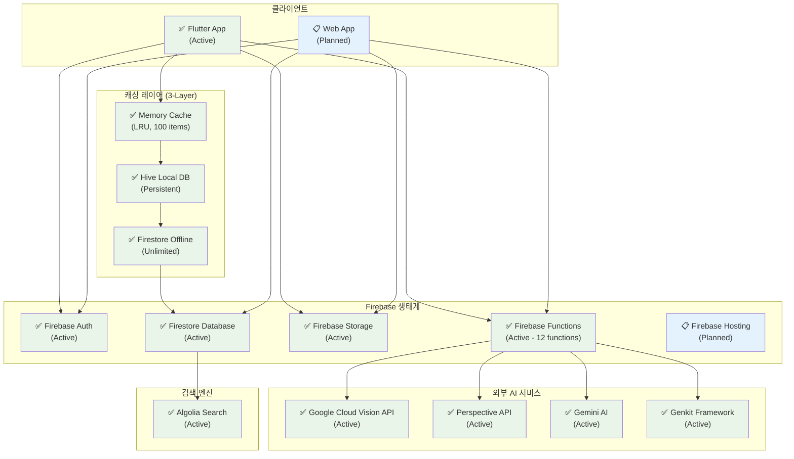

## 2. Firestore 데이터 모델 ERD

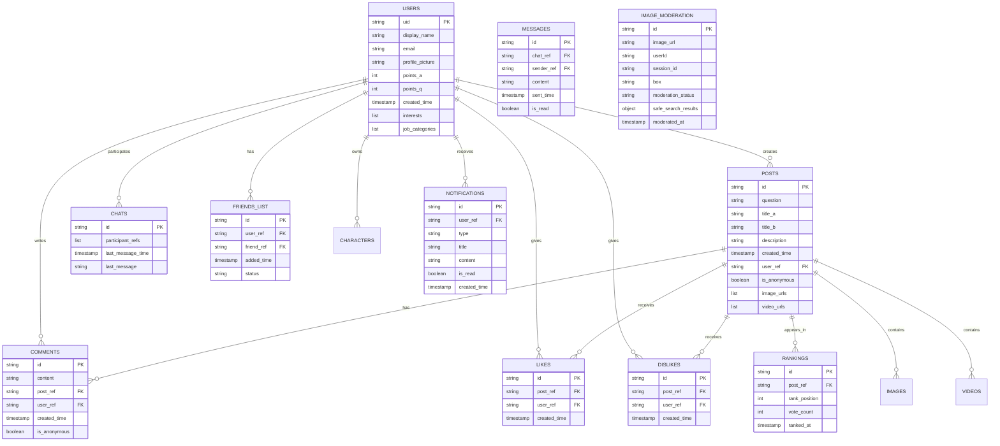

## 3. AI 검열 시스템 플로우

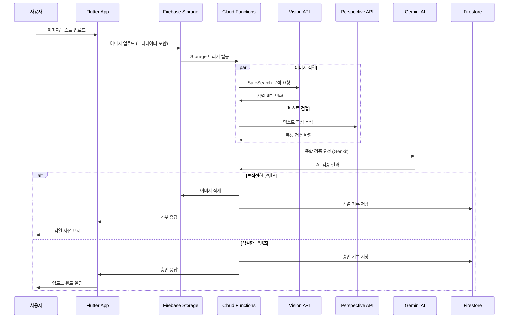

## 4. 콘텐츠 생성 및 발행 플로우

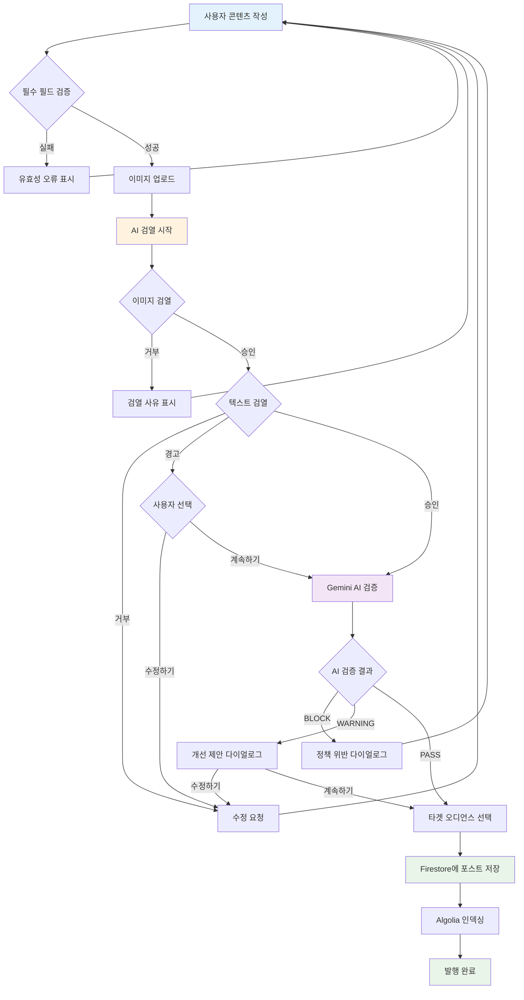

## 5. Firebase Functions 상세 기능 (배포 상태)

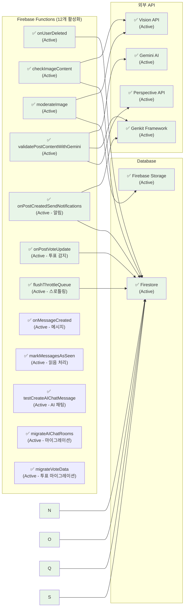

## 6. AI 기반 알림 시스템 플로우

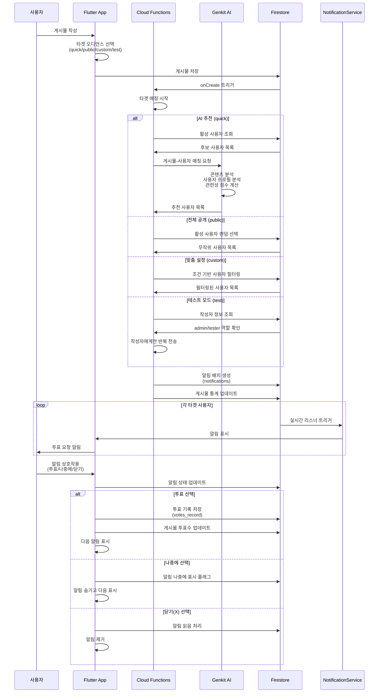

## 7. 투표 자동 완료 처리 플로우

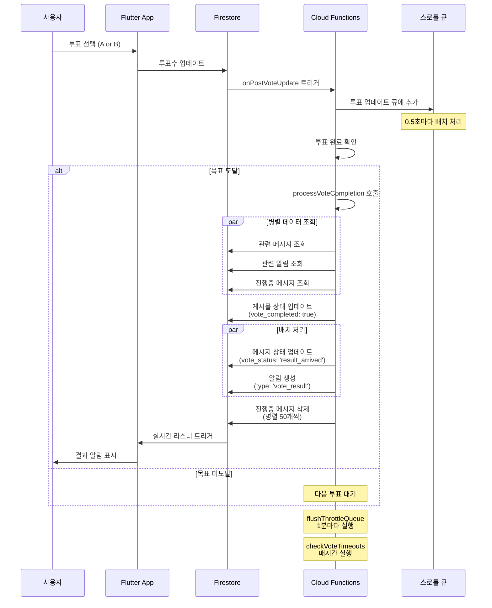

### 투표 완료 처리 최적화
- **병렬 처리**: 데이터 조회 및 업데이트 동시 실행
- **배치 처리**: Firestore 500개 제한 준수
- **스로틀링**: 실시간 부하 분산
- **자동 재시도**: 실패 시 재시도 로직

## 8. 데이터베이스 컬렉션 구조

### 핵심 컬렉션 (35개)

#### 사용자 관리
- `users`: 사용자 프로필, 포인트, 설정
- `characters`: 사용자 아바타/캐릭터
- `settings`: 개인 설정
- `notifications`: 알림 관리

#### 콘텐츠 관리
- `posts`: A vs B 포스트 메인 데이터
- `comments`: 댓글 시스템
- `images`: 이미지 메타데이터
- `video`: 비디오 메타데이터
- `encodings`: 비디오 인코딩 상태

#### 소셜 기능
- `likes` / `dislikes`: 좋아요/싫어요
- `chats` / `group_chats`: 메시징
- `messages` / `group_messages`: 메시지 내용
- `friends_list`: 친구 관계

#### 게임화 요소
- `rankings`: 리더보드
- `point`: 포인트 거래 내역
- `votes` / `votecounts`: 투표 시스템
- `premium_users`: 프리미엄 구독

#### 검색 및 카테고리
- `searches`: 검색 기록
- `interest`: 관심사 카테고리
- `jops_category` / `jops_name`: 직업 분류

#### 콘텐츠 모더레이션
- `image_moderation`: 이미지 검열 결과
- `content_validations`: AI 검증 로그 (Functions에서 생성)

## 7. 3-Layer 캐싱 시스템 아키텍처

### 캐싱 레이어 플로우

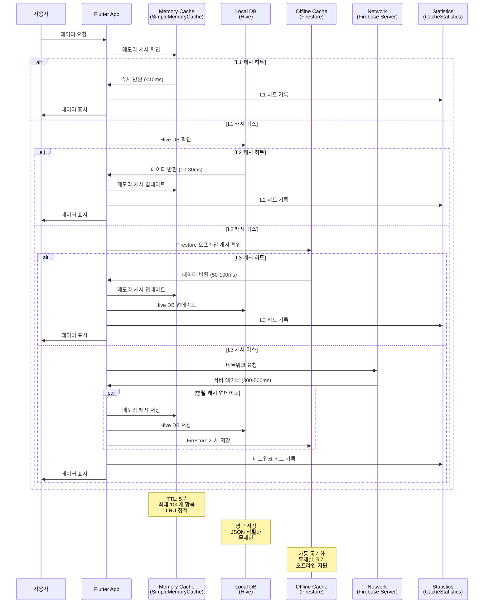

### 캐시 키 구조

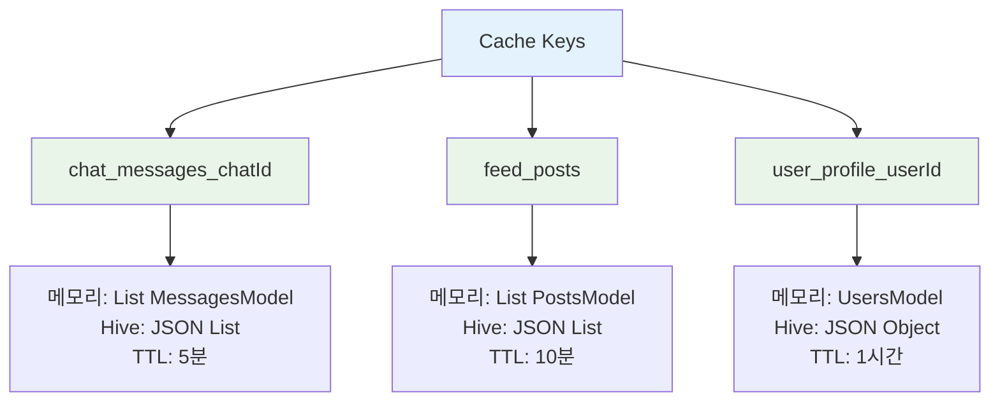

### 캐시 통계 시스템

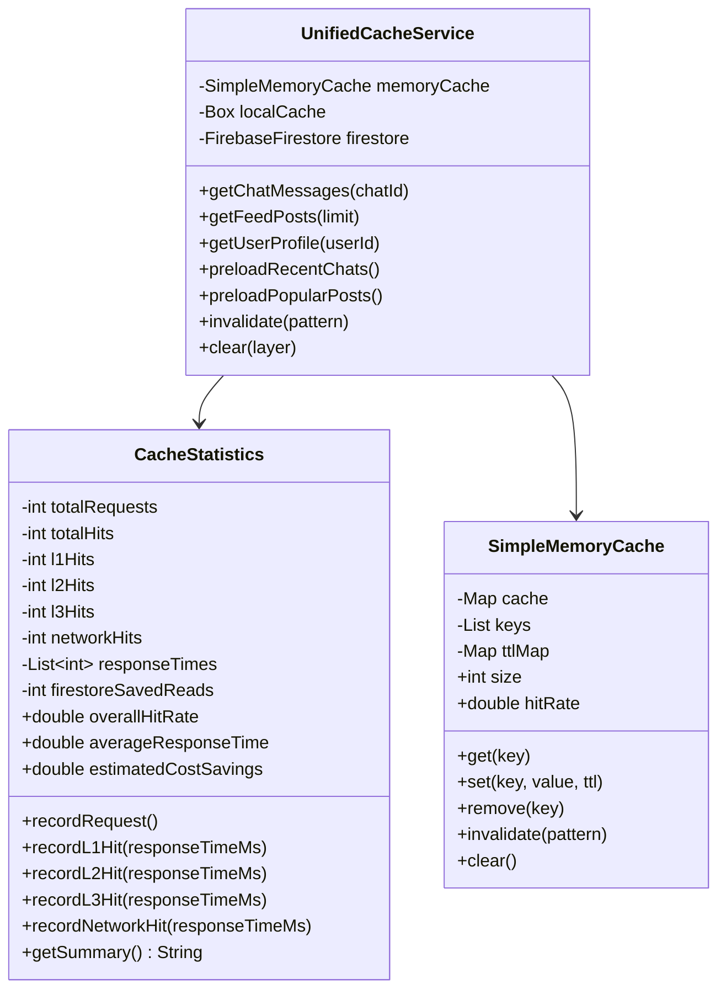

### 프리로딩 전략

```mermaid
flowchart TD
    A[앱 시작] --> B[main.dart 초기화]
    B --> C[UnifiedCacheService.initialize()]
    C --> D[Hive DB 초기화]
    D --> E[Firestore 오프라인 캐시 설정]
    E --> F[백그라운드 프리로딩 시작]
    
    F --> G[preloadRecentChats()]
    F --> H[preloadPopularPosts()]
    
    G --> I[최근 채팅 5개 로드]
    I --> J[각 채팅 메시지 30개 캐싱]
    
    H --> K[인기 포스트 10개 로드]
    K --> L[메모리 캐시에 저장]
    
    style A fill:#e3f2fd
    style C fill:#fff3e0
    style F fill:#e8f5e8
    style G fill:#e8f5e8
    style H fill:#e8f5e8
```

### 성능 메트릭

| 캐시 레이어 | 응답 시간 | 히트율 목표 | 비용 절감 |
|------------|----------|------------|-----------|
| L1 Memory | <10ms | 60-70% | 100% |
| L2 Hive | 10-30ms | 20-30% | 100% |
| L3 Firestore | 50-100ms | 5-10% | 100% |
| Network | 300-500ms | <5% | 0% |

- **일일 절약 예상**: $0.06-0.12 (10만 읽기 기준)
- **월간 절약 예상**: $1.80-3.60
- **캐시 적중률 목표**: >95%

## 8. 보안 및 권한 관리

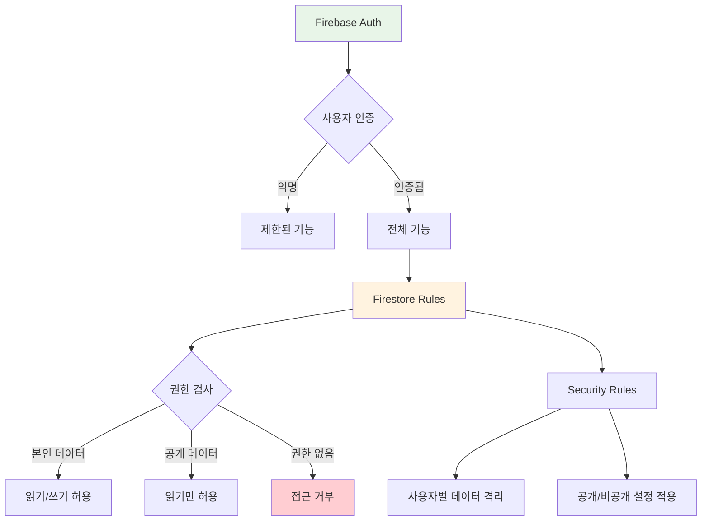

## 8. 성능 최적화 전략

### 데이터베이스 최적화
- **복합 인덱스**: 자주 쿼리되는 필드 조합
- **페이지네이션**: 무한 스크롤 구현
- **캐싱**: 자주 접근하는 데이터 로컬 캐싱

### 이미지 처리 최적화
- **다중 해상도**: original, display(800px), thumbnail(150px)
- **압축**: JPEG 85% 품질
- **CDN**: Firebase Storage 자동 CDN

### AI 서비스 최적화
- **토큰 사용량 추적**: Gemini AI 비용 관리
- **배치 처리**: 다중 이미지 병렬 검열
- **캐싱**: 검열 결과 재사용

## 9. 상태 표시 범례

### 🎯 상태 아이콘 의미
- **✅ Active**: 완전히 구현되고 현재 사용 중
- **🚧 Development**: 부분적으로 구현되거나 개발 중
- **❌ Inactive**: 구현되었지만 현재 비활성화
- **📋 Planned**: 계획되었지만 아직 구현되지 않음

### 🎨 색상 코드
- **녹색 (`#e8f5e8`)**: 활성화된 서비스
- **파란색 (`#e3f2fd`)**: 계획 중인 서비스
- **노란색 (`#fff3e0`)**: 개발 중인 서비스
- **회색 (`#f5f5f5`)**: 비활성화된 서비스

### 📊 현재 프로젝트 상태 요약
- **활성화된 서비스**: 14개 (Firebase + AI + 캐싱 시스템)
- **계획 중인 서비스**: 2개 (Web App, Firebase Hosting)
- **배포된 Cloud Functions**: 12개 (채팅, 투표, 마이그레이션 포함)
- **통합된 AI 서비스**: 4개 (Vision, Perspective, Gemini, Genkit)
- **사용 중인 Firestore 컬렉션**: 36개
- **캐싱 시스템**: 3-Layer (Memory → Hive → Firestore)
- **알림 시스템**: AI 기반 타겟팅 (3가지 모드: quick, public, custom)
- **투표 시스템**: 자동 완료 처리 및 결과 알림

### 🚀 최근 추가 기능 (2025-07-20 ~ 2025-08-13)
- **AI 기반 알림 시스템**: Genkit을 활용한 스마트 사용자 매칭 (2025-07-20)
- **타겟 오디언스**: quick(AI), public(랜덤), custom(조건) 모드 - test 모드 제거 (2025-07-31)
- **실시간 알림**: NotificationService를 통한 즉시 알림
- **향상된 알림 UI**: 모달 다이얼로그, 멀티이미지 지원, 박스 크기 평균화
- **사용자 반응 추적**: 투표/나중에/닫기 선택 기록 및 처리
- **듀얼 모드 네비게이션**: 메인/채팅 모드 전환 가능한 하단 네비게이션 바 (2025-07-25)
- **디자인 시스템 통합**: 전체 UI 컴포넌트 표준화 (2025-07-25)
- **채팅 시스템 현대화**: flutter_chat_ui 통합, 미디어 메시지 지원 (2025-07-26)
- **투표 메시지 통합**: 알림과 채팅 메시지 연동, A vs B 투표 메시지 타입 (2025-07-26)
- **자동 투표 완료 처리**: 목표 도달 시 자동 완료, 진행중 메시지 삭제, 결과 알림 (2025-07-26)
- **성능 최적화**: 배치 처리, 스로틀링, 1000명 동시 처리 지원 (2025-07-26)
- **컬렉션 이름 정규화**: 모든 _record 접미사 제거로 Flutter 앱과 동기화 (2025-07-31)
- **투표 메시지 컴포넌트 통합**: VoteRequestMessage 제거, VoteCardMessage로 통합 (2025-08-06)
- **투표 메시지 UI 개선**: 불필요한 UI 요소 제거, 진행중 상태 파란색 변경 (2025-08-06)
- **3-Layer 캐싱 시스템**: Memory → Hive → Firestore 캐싱 아키텍처 구현 (2025-08-13)
- **캐시 통계 시스템**: 실시간 성능 모니터링 및 비용 절감 계산 (2025-08-13)
- **프리로딩 전략**: 최근 채팅 및 인기 포스트 백그라운드 로딩 (2025-08-13)

## 9. 채팅 시스템 아키텍처

### 채팅 메시지 플로우

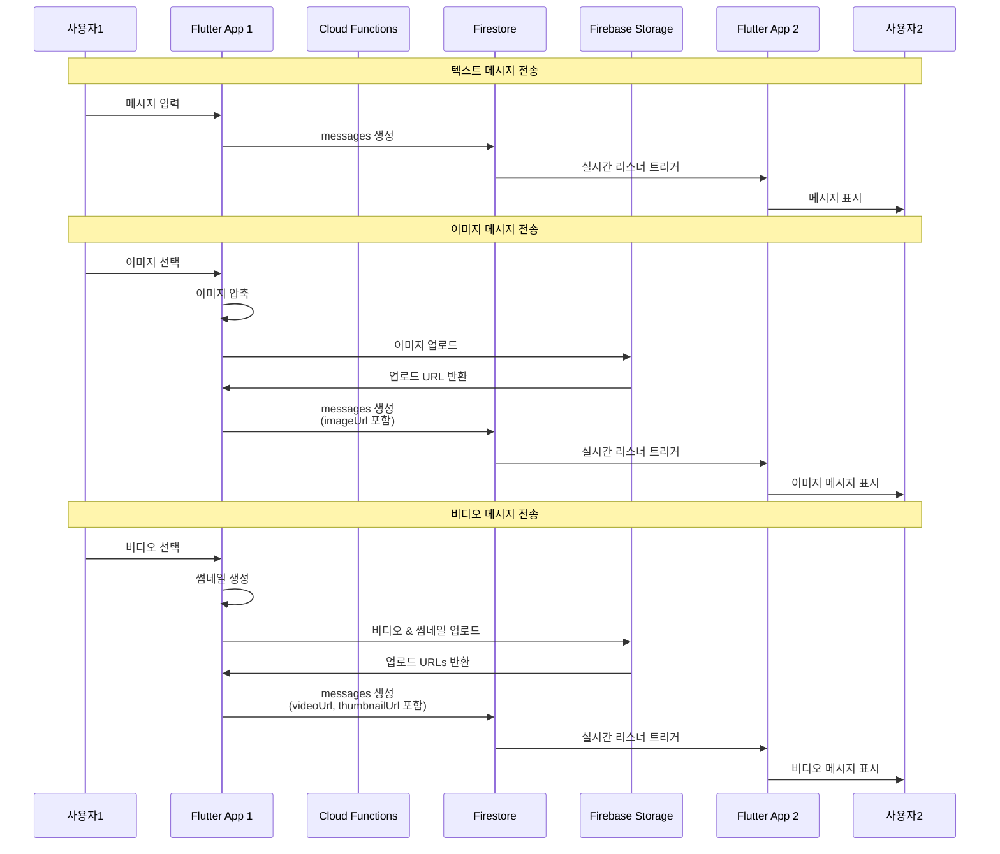

### 투표 알림과 채팅 메시지 통합

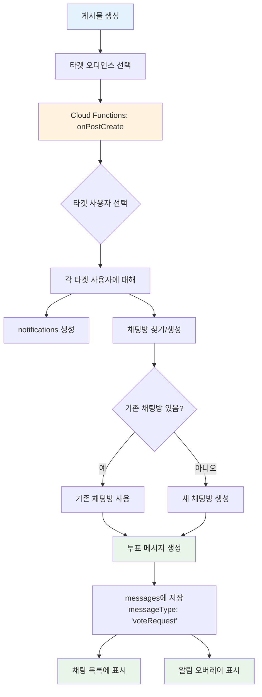

### 채팅 메시지 타입 구조

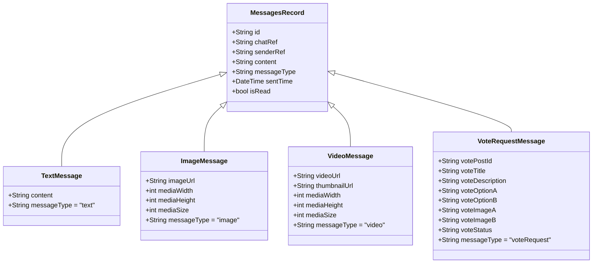

### 채팅 UI 라이브러리 통합

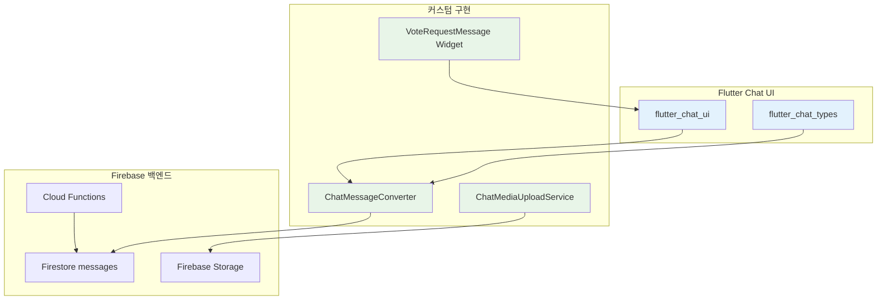

## 10. 네비게이션 시스템 플로우

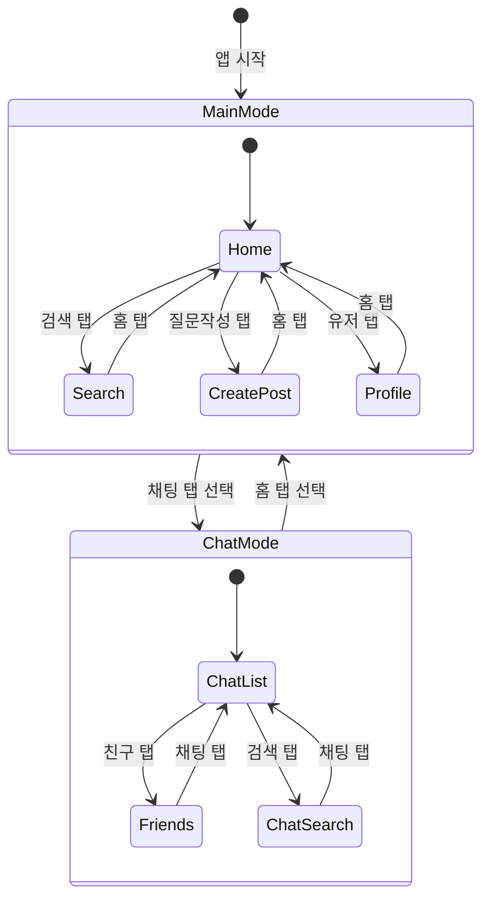

### 네비게이션 아키텍처
- **Provider 패턴**: NavigationProvider로 중앙 상태 관리
- **GoRouter ShellRoute**: 페이지 전환 시 네비게이션 바 유지
- **애니메이션 전환**: 300ms 부드러운 모드 전환
- **컨텍스트 인식**: 현재 위치에 따른 자동 모드 전환

---

**작성일**: 2025-07-18  
**버전**: 1.9 (3-Layer 캐싱 시스템 추가)  
**프로젝트**: Versus Space Flutter App  
**백엔드**: Firebase 생태계 + AI 서비스 + 캐싱 시스템  
**마지막 업데이트**: 2025-08-13

### 🔧 주요 변경사항 (2025-08-13)
- **3-Layer 캐싱 시스템 구현**:
  - Memory Cache (SimpleMemoryCache): LRU 정책, 100개 제한, 5분 TTL
  - Local DB (Hive): 영구 저장, JSON 직렬화
  - Offline Cache (Firestore): 무제한 크기, 자동 동기화
- **캐시 통계 시스템**:
  - 레이어별 히트율 추적 (L1, L2, L3, Network)
  - 응답 시간 모니터링 및 평균 계산
  - Firestore 읽기 비용 절감 계산 ($0.06/100K reads)
- **프리로딩 전략**:
  - 앱 시작 시 최근 채팅 5개 자동 로드
  - 홈 페이지에서 인기 포스트 10개 프리로드
  - 백그라운드 동기화로 UI 차단 없음
- **Firebase Functions 업데이트**:
  - 총 12개 함수 활성화 (기존 11개 → 12개)
  - onMessageCreated, markMessagesAsSeen 추가
- **성능 개선**:
  - 캐시 히트 시 <10ms 응답 (기존 300-500ms)
  - 목표 캐시 적중률 >95%
  - 예상 월간 비용 절감 $1.80-3.60