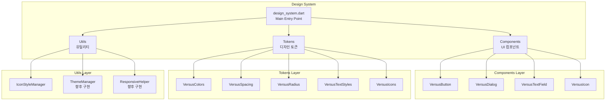

# 🎨 Versus Space Design System
> 일관된 사용자 경험을 위한 통합 디자인 시스템

## 🎯 개요

Versus Space Design System은 애플리케이션 전반에서 일관된 UI/UX를 제공하기 위한 포괄적인 디자인 시스템입니다. 2025-07-25에 도입되어 앱 전반의 시각적 일관성과 개발 효율성을 향상시킵니다. 디자인 토큰, UI 컴포넌트, 유틸리티 함수를 체계적으로 구조화하여 개발 효율성과 유지보수성을 극대화합니다.

### 핵심 가치
- **일관성**: 모든 화면에서 통일된 디자인 언어 사용
- **효율성**: 재사용 가능한 컴포넌트로 개발 시간 단축
- **확장성**: 새로운 요구사항에 유연하게 대응
- **접근성**: 모든 사용자를 위한 포용적 디자인
- **성능**: 최적화된 컴포넌트로 빠른 렌더링

## 📐 네이밍 컨벤션

```dart
// 파일명: snake_case (Dart 표준)
design_system.dart
versus_colors.dart
icon_style_manager.dart

// 클래스명: PascalCase
class VersusColors
class VersusButton
class IconStyleManager

// 메서드명: lowerCamelCase
VersusButton.primary()
IconStyleManager.initialize()

// 상수/변수명: lowerCamelCase
static const Color primary
final double screenPadding
```

- 참조: [NAMING_CONVENTION.md](../../NAMING_CONVENTION.md)

## 🏗️ 시스템 아키텍처

### 전체 구조


### 레이어별 역할

#### 1. **Components Layer** (UI 컴포넌트)
재사용 가능한 UI 컴포넌트들의 집합입니다.
- **VersusButton**: 다양한 스타일의 버튼 컴포넌트
- **VersusDialog**: 경고, 확인, 정보 표시용 다이얼로그
- **VersusTextField**: 입력 필드와 유효성 검사
- **VersusIcon**: 플랫폼별 아이콘 표시

#### 2. **Tokens Layer** (디자인 토큰)
디자인 시스템의 기본 값들을 정의합니다.
- **VersusColors**: 색상 팔레트
- **VersusSpacing**: 간격 시스템 (4px 그리드)
- **VersusRadius**: 둥근 모서리 값
- **VersusTextStyles**: 타이포그래피 시스템
- **VersusIcons**: 아이콘 데이터 및 스타일

#### 3. **Utils Layer** (유틸리티)
디자인 시스템을 지원하는 헬퍼 함수들입니다.
- **IconStyleManager**: 플랫폼별 아이콘 스타일 관리
- **ThemeManager**: 다크모드/라이트모드 전환 (예정)
- **ResponsiveHelper**: 반응형 디자인 지원 (예정)

## 📦 디렉토리 구조

```
lib/design_system/
├── README.md                    # 현재 문서
├── design_system.dart           # 메인 진입점 (barrel export)
│
├── components/                  # UI 컴포넌트 레이어
│   ├── README.md               # 컴포넌트 상세 문서
│   ├── versus_components.dart  # 컴포넌트 barrel export
│   ├── versus_button.dart      # 버튼 컴포넌트
│   ├── versus_dialog.dart      # 다이얼로그 컴포넌트
│   ├── versus_text_field.dart  # 텍스트 필드 컴포넌트
│   └── versus_icon.dart        # 아이콘 컴포넌트
│
├── tokens/                      # 디자인 토큰 레이어
│   ├── README.md               # 토큰 상세 문서
│   ├── versus_tokens.dart      # 토큰 barrel export
│   ├── versus_colors.dart      # 색상 시스템
│   ├── versus_spacing.dart     # 간격 시스템
│   ├── versus_radius.dart      # 둥근 모서리
│   ├── versus_text_styles.dart # 타이포그래피
│   ├── versus_icons.dart       # 아이콘 정의
│   └── versus_icon_data.dart   # 아이콘 데이터 구조
│
└── utils/                       # 유틸리티 레이어
    ├── README.md               # 유틸리티 상세 문서
    └── icon_style_manager.dart # 아이콘 스타일 관리자
```

## 🎨 디자인 토큰

### 1. 색상 시스템 (VersusColors)

```dart
import 'package:versus_space/design_system/tokens/versus_tokens.dart';

// 브랜드 색상
VersusColors.primary        // #D95B5B - 빨간색 (주요 CTA)
VersusColors.secondary      // #588157 - 초록색 (보조 액션)

// 배경 색상
VersusColors.backgroundPrimary    // #FAF9F6 - 메인 배경
VersusColors.backgroundSecondary  // #F5F2E8 - 카드/섹션 배경

// 텍스트 색상
VersusColors.textPrimary    // #4A444B - 주요 텍스트
VersusColors.textSecondary  // #8A817C - 보조 텍스트

// UI 요소 색상
VersusColors.borderColor    // 검은색 테두리
VersusColors.borderLight    // #E0E3E7 - 연한 테두리

// 상태 색상
VersusColors.success        // #249689 - 성공
VersusColors.warning        // #F9CF58 - 경고
VersusColors.error          // #FF5963 - 에러
VersusColors.info           // #4B39EF - 정보

// 투명도 적용
VersusColors.primaryWithAlpha(0.5)  // 50% 투명도
```

### 2. 간격 시스템 (VersusSpacing)

4px 기반의 일관된 간격 시스템:

```dart
// 기본 간격 값
VersusSpacing.xs   // 4px
VersusSpacing.sm   // 8px
VersusSpacing.md   // 16px
VersusSpacing.lg   // 24px
VersusSpacing.xl   // 32px
VersusSpacing.xxl  // 48px

// 특수 간격
VersusSpacing.screenHorizontal  // EdgeInsets.symmetric(horizontal: 20)
VersusSpacing.screenVertical    // EdgeInsets.symmetric(vertical: 16)
VersusSpacing.cardInternal      // EdgeInsets.all(16)
VersusSpacing.buttonInternal    // EdgeInsets.symmetric(h: 16, v: 8)

// 커스텀 간격
VersusSpacing.fromSTEB(20, 2, 20, 0)  // 기존 코드 호환

// 유틸리티 위젯
VersusSpacing.gapH(16)  // 가로 간격
VersusSpacing.gapV(16)  // 세로 간격
```

### 3. 타이포그래피 (VersusTextStyles)

Plus Jakarta Sans 폰트 기반:

```dart
// Display 스타일 (큰 제목)
VersusTextStyles.displayLarge   // 57px
VersusTextStyles.displayMedium  // 45px
VersusTextStyles.displaySmall   // 36px

// Heading 스타일
VersusTextStyles.headingLarge   // 32px, bold
VersusTextStyles.headingMedium  // 24px, bold
VersusTextStyles.headingSmall   // 18px, bold

// Body 스타일
VersusTextStyles.bodyLarge      // 16px
VersusTextStyles.bodyMedium     // 14px
VersusTextStyles.bodySmall      // 12px

// Label 스타일
VersusTextStyles.labelLarge     // 14px, medium
VersusTextStyles.labelMedium    // 12px, medium
VersusTextStyles.labelSmall     // 11px, medium

// 버튼 스타일
VersusTextStyles.buttonLarge    // 16px, medium
VersusTextStyles.buttonMedium   // 14px, medium
VersusTextStyles.buttonSmall    // 12px, medium
```

### 4. 모서리 둥글기 (VersusRadius)

```dart
VersusRadius.radiusNone     // 0px
VersusRadius.radiusSmall    // 8px
VersusRadius.radiusMedium   // 16px
VersusRadius.radiusLarge    // 24px
VersusRadius.radiusXLarge   // 32px
VersusRadius.radiusCircle   // 9999px (원형)
```

### 5. 아이콘 (VersusIcons)

```dart
// 네비게이션
VersusIcons.home
VersusIcons.search
VersusIcons.chat
VersusIcons.profile

// 액션
VersusIcons.add
VersusIcons.edit
VersusIcons.delete
VersusIcons.share

// 상태
VersusIcons.success
VersusIcons.warning
VersusIcons.error
VersusIcons.info
```

## 🧩 컴포넌트

### 1. VersusButton

표준화된 버튼 컴포넌트:

```dart
// Primary 버튼 (주요 액션)
VersusButton.primary(
  text: '투표하기',
  onPressed: () => handleVote(),
  isFullWidth: true,
)

// Secondary 버튼 (보조 액션)
VersusButton.secondary(
  text: '공유',
  icon: Icon(VersusIcons.share),
  onPressed: () => sharePost(),
)

// Outline 버튼 (테두리)
VersusButton.outline(
  text: '취소',
  onPressed: () => Navigator.pop(context),
  size: VersusButtonSize.small,
)

// Text 버튼 (배경 없음)
VersusButton.text(
  text: '더 보기',
  onPressed: () => showMore(),
)

// Error 버튼 (위험한 액션)
VersusButton.error(
  text: '삭제',
  icon: Icon(VersusIcons.delete),
  onPressed: () => deletePost(),
  isLoading: isDeleting,
)
```

버튼 크기:
- `VersusButtonSize.small` - 작은 버튼
- `VersusButtonSize.medium` - 중간 버튼 (기본)
- `VersusButtonSize.large` - 큰 버튼

### 2. VersusDialog

일관된 다이얼로그 스타일:

```dart
// 경고 다이얼로그
VersusDialog.warning(
  context: context,
  title: '주의',
  content: '이 작업은 되돌릴 수 없습니다.',
  actions: [
    VersusButton.outline(text: '취소'),
    VersusButton.error(text: '삭제'),
  ],
);

// 확인 다이얼로그
VersusDialog.confirm(
  context: context,
  title: '로그아웃',
  content: '정말 로그아웃하시겠습니까?',
  onConfirm: () => logout(),
);

// 정보 다이얼로그
VersusDialog.info(
  context: context,
  title: '업데이트 완료',
  content: '프로필이 성공적으로 업데이트되었습니다.',
);
```

### 3. VersusTextField

표준 입력 필드:

```dart
VersusTextField(
  label: '이메일',
  hint: 'example@email.com',
  controller: emailController,
  validator: (value) => validateEmail(value),
  keyboardType: TextInputType.emailAddress,
  prefixIcon: Icon(VersusIcons.email),
)
```

### 4. VersusIcon

아이콘 래퍼 컴포넌트:

```dart
VersusIcon(
  VersusIcons.heart,
  size: VersusIconSize.medium,
  color: VersusColors.primary,
)
```

## 💻 사용 방법

### 전체 디자인 시스템 import

```dart
import 'package:versus_space/design_system/design_system.dart';

// 모든 토큰과 컴포넌트에 접근 가능
class MyWidget extends StatelessWidget {
  @override
  Widget build(BuildContext context) {
    return Container(
      padding: VersusSpacing.paddingMD,
      decoration: BoxDecoration(
        color: VersusColors.primary,
        borderRadius: VersusRadius.radiusMedium,
      ),
      child: Column(
        children: [
          Text(
            'Versus Space',
            style: VersusTextStyles.headingLarge,
          ),
          VersusSpacing.gapMD,
          VersusButton.primary(
            text: '시작하기',
            onPressed: () {},
          ),
        ],
      ),
    );
  }
}
```

### 개별 레이어 import

```dart
// 토큰만 필요한 경우
import 'package:versus_space/design_system/tokens/versus_tokens.dart';

// 컴포넌트만 필요한 경우
import 'package:versus_space/design_system/components/versus_components.dart';

// 특정 컴포넌트만 필요한 경우
import 'package:versus_space/design_system/components/versus_button.dart';
```

## 🔄 마이그레이션 가이드

### 기존 코드에서 디자인 시스템으로

#### Step 1: Import 변경
```dart
// Before
import 'package:versus_space/core/app_theme.dart';

// After
import 'package:versus_space/design_system/design_system.dart';
```

#### Step 2: 색상 변경
```dart
// Before
AppTheme.primaryColor
Color(0xFFD95B5B)

// After
VersusColors.primary
```

#### Step 3: 간격 변경
```dart
// Before
EdgeInsets.all(16.0)
EdgeInsetsDirectional.fromSTEB(20, 16, 20, 16)

// After
VersusSpacing.paddingMD
VersusSpacing.fromSTEB(20, 16, 20, 16)
```

#### Step 4: 컴포넌트 교체
```dart
// Before
ElevatedButton(
  style: ElevatedButton.styleFrom(
    backgroundColor: Color(0xFFD95B5B),
  ),
  child: Text('확인'),
  onPressed: () {},
)

// After
VersusButton.primary(
  text: '확인',
  onPressed: () {},
)
```

## 🎯 베스트 프랙티스

### 1. 일관된 토큰 사용
```dart
// ❌ 하드코딩된 값
Container(
  padding: EdgeInsets.all(16.0),
  color: Color(0xFFD95B5B),
)

// ✅ 디자인 토큰 사용
Container(
  padding: VersusSpacing.paddingMD,
  color: VersusColors.primary,
)
```

### 2. 컴포넌트 재사용
```dart
// ❌ 커스텀 버튼 생성
ElevatedButton(
  style: ElevatedButton.styleFrom(
    backgroundColor: Color(0xFFD95B5B),
    padding: EdgeInsets.all(16),
  ),
  child: Text('확인'),
  onPressed: () {},
)

// ✅ VersusButton 사용
VersusButton.primary(
  text: '확인',
  onPressed: () {},
)
```

### 3. 플랫폼 고려
```dart
// ❌ 단일 아이콘 사용
Icon(Icons.home)

// ✅ 플랫폼별 아이콘
VersusIcon(VersusIcons.home)
```


## 📊 성능 최적화

### 1. Tree Shaking
디자인 시스템은 tree shaking을 지원하여 사용하지 않는 컴포넌트는 빌드에서 제외됩니다.

### 2. Const 생성자
모든 토큰은 compile-time 상수로 정의되어 있어 성능에 영향을 주지 않습니다.

### 3. 메모이제이션
IconStyleManager는 플랫폼 정보를 캐싱하여 반복적인 플랫폼 체크를 방지합니다.

## 🔍 디버깅

### 디자인 토큰 확인
```dart
if (!kReleaseMode) {
  print('Primary Color: ${VersusColors.primary}');
  print('Current Icon Style: ${IconStyleManager.getCurrentStyle()}');
  print('Screen Padding: ${VersusSpacing.screenPadding}');
}
```

### 컴포넌트 상태 확인
```dart
// VersusButton 상태 로깅
VersusButton.primary(
  text: 'Debug',
  onPressed: () {
    print('Button pressed');
  },
  isLoading: true,  // 로딩 상태 테스트
)
```

## 📝 변경 이력

### 2025-08-24
- 디자인 시스템 전체 구조 문서화
- 3개 레이어 (Components, Tokens, Utils) 통합 문서 작성
- 사용 가이드 및 베스트 프랙티스 추가
- 마이그레이션 가이드 작성

### 2025-08-22
- 초기 디자인 시스템 구축
- Components, Tokens, Utils 디렉토리 생성
- 기본 컴포넌트 및 토큰 구현

### 2025-07-25
- 디자인 시스템 도입
- AppTheme과 호환성 유지하며 새로운 토큰 시스템 구축

## 🚀 향후 계획

### Phase 1: 기본 기능 완성 (현재)
- ✅ 색상 시스템
- ✅ 간격 시스템
- ✅ 타이포그래피
- ✅ 기본 컴포넌트
- ✅ 아이콘 관리

### Phase 2: 고급 기능 (계획)
- ⏳ ThemeManager (다크모드 지원)
- ⏳ ResponsiveHelper (반응형 디자인)
- ⏳ AnimationManager (애니메이션 프리셋)
- ⏳ ColorSchemeGenerator (동적 테마)
- ⏳ VersusCard (카드 컴포넌트)
- ⏳ VersusChip (칩/태그 컴포넌트)
- ⏳ VersusAvatar (아바타 컴포넌트)
- ⏳ VersusBottomSheet (바텀시트 컴포넌트)

### Phase 3: 확장 기능 (향후)
- 📅 접근성 향상 도구
- 📅 디자인 토큰 검사 도구
- 📅 컴포넌트 플레이그라운드
- 📅 자동 문서 생성

## 🤝 기여 가이드

### 새 컴포넌트 추가
1. `/components` 디렉토리에 파일 생성
2. VersusComponents barrel에 export 추가
3. README 문서 업데이트
4. 사용 예제 작성

### 새 토큰 추가
1. 적절한 토큰 파일에 상수 추가
2. VersusTokens barrel에 export 확인
3. 문서에 사용법 추가

### 코드 리뷰 체크리스트
- [ ] 네이밍 컨벤션 준수
- [ ] 디자인 토큰 사용
- [ ] 문서 업데이트
- [ ] 테스트 작성
- [ ] 접근성 고려

## 📚 참고 자료

### 내부 문서
- [컴포넌트 상세 문서](./components/README.md)
- [토큰 상세 문서](./tokens/README.md)
- [유틸리티 상세 문서](./utils/README.md)
- [프로젝트 네이밍 컨벤션](../../NAMING_CONVENTION.md)

### 외부 리소스
- [Material Design 3](https://m3.material.io/)
- [Flutter 위젯 카탈로그](https://docs.flutter.dev/development/ui/widgets)
- [Dart 스타일 가이드](https://dart.dev/guides/language/effective-dart/style)

---

*이 문서는 Versus Space Design System v1.0.0 기준으로 작성되었습니다.*
*최종 업데이트: 2025-08-24*