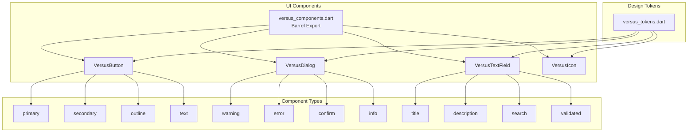
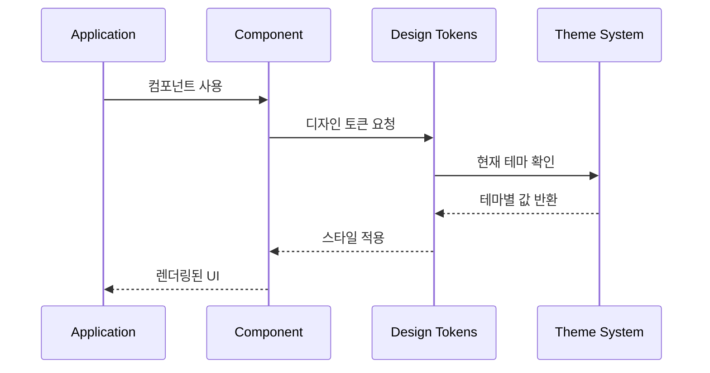

# 🎨 Design System Components 디렉토리
> Versus Space 디자인 시스템의 재사용 가능한 UI 컴포넌트 라이브러리

## 🎯 개요

이 디렉토리는 Versus Space 애플리케이션 전반에서 사용되는 표준화된 UI 컴포넌트를 제공합니다. 기존 프로젝트에서 사용되던 다양한 UI 패턴을 분석하여 일관된 디자인 언어로 통합했으며, 재사용성과 유지보수성을 극대화한 컴포넌트 라이브러리입니다.

### 주요 특징
- **표준화된 디자인**: 모든 컴포넌트가 통일된 디자인 토큰 사용
- **유연한 팩토리 패턴**: 용도별 맞춤형 컴포넌트 생성
- **타입 안정성**: 강력한 타입 시스템으로 런타임 에러 방지
- **접근성 지원**: 시맨틱 레이블 및 키보드 네비게이션 지원
- **다크모드 대응**: 테마별 자동 스타일 전환

## 📐 네이밍 컨벤션

```dart
// 파일명: snake_case (Dart 표준)
versus_button.dart
versus_dialog.dart
versus_text_field.dart

// 클래스명: PascalCase
class VersusButton
class VersusDialog
class VersusTextField

// 팩토리 메서드: lowerCamelCase
VersusButton.primary()
VersusDialog.warning()
VersusTextField.title()

// 변수명: lowerCamelCase
final VersusButtonType type;
final bool isLoading;
```

- 참조: [NAMING_CONVENTION.md](../../../NAMING_CONVENTION.md)

## 🏗️ 아키텍처

### 컴포넌트 구조


### 디자인 시스템 통합


## 🔧 주요 구성요소

### 1. VersusComponents (Barrel Export)
**위치**: `versus_components.dart`

모든 컴포넌트를 한 번에 import할 수 있는 진입점입니다.

```dart
import 'package:versus_space/design_system/components/versus_components.dart';

// 모든 컴포넌트 사용 가능
```

### 2. VersusButton (버튼 컴포넌트)
**위치**: `versus_button.dart`

표준화된 버튼 컴포넌트로 다양한 스타일과 크기를 지원합니다.

#### 버튼 타입
- **Filled**: 배경색이 채워진 버튼
- **Outline**: 테두리만 있는 버튼
- **Text**: 배경 없는 텍스트 버튼
- **Icon**: 아이콘 포함 버튼

#### 버튼 크기
- **Small**: 작은 크기 (높이 32px)
- **Medium**: 기본 크기 (높이 40px)
- **Large**: 큰 크기 (높이 48px)

#### 팩토리 메서드
```dart
// 주요 액션용 버튼
VersusButton.primary(
  text: '확인',
  onPressed: () {},
)

// 보조 액션용 버튼
VersusButton.secondary(
  text: '취소',
  onPressed: () {},
)

// 외곽선 버튼
VersusButton.outline(
  text: '더보기',
  onPressed: () {},
)

// 텍스트 버튼
VersusButton.text(
  text: '건너뛰기',
  onPressed: () {},
)
```

### 3. VersusDialog (다이얼로그 컴포넌트)
**위치**: `versus_dialog.dart`

AI Moderation 시스템의 다이얼로그 패턴을 표준화한 컴포넌트입니다.

#### 다이얼로그 타입
```dart
// 경고 다이얼로그 (수정/진행 선택)
VersusDialog.warning(
  context: context,
  title: '부적절한 내용 감지',
  content: '게시물에 부적절한 내용이 포함되어 있을 수 있습니다.',
  suggestions: '- 욕설이나 비속어를 제거해주세요\n- 개인정보를 포함하지 마세요',
  confirmText: '계속하기',
  cancelText: '수정하기',
)

// 에러 다이얼로그 (차단/수정 요구)
VersusDialog.error(
  context: context,
  title: '게시 불가',
  content: '커뮤니티 가이드라인을 위반하는 내용입니다.',
  violations: ['폭력적 내용', '선정적 표현'],
  suggestions: '내용을 수정한 후 다시 시도해주세요.',
)

// 확인 다이얼로그
VersusDialog.confirm(
  context: context,
  title: '삭제 확인',
  content: '정말로 삭제하시겠습니까?',
  confirmText: '삭제',
  cancelText: '취소',
)

// 정보 다이얼로그
VersusDialog.info(
  context: context,
  title: '안내',
  content: '새로운 기능이 추가되었습니다!',
  details: '- 실시간 투표 알림\n- AI 추천 시스템',
)
```

### 4. VersusTextField (텍스트 필드 컴포넌트)
**위치**: `versus_text_field.dart`

기존 SimpleValidatedField와 TextField 패턴을 표준화한 입력 필드입니다.

#### 텍스트 필드 타입
- **Outline**: 테두리가 있는 필드
- **Filled**: 배경색이 있는 필드
- **Underline**: 하단 라인만 있는 필드

#### 텍스트 필드 크기
- **Small**: 작은 크기 (높이 36px)
- **Medium**: 기본 크기 (높이 44px)
- **Large**: 큰 크기 (높이 52px)

#### 팩토리 메서드
```dart
// 제목 입력 필드
VersusTextField.title(
  hintText: '제목을 입력하세요',
  maxLength: 50,
  onChanged: (value) {},
)

// 설명 입력 필드
VersusTextField.description(
  hintText: '설명을 입력하세요',
  maxLength: 500,
  maxLines: 5,
)

// 검색 필드
VersusTextField.search(
  hintText: '검색어를 입력하세요',
  onSubmitted: (value) {},
)

// 유효성 검사 필드
VersusTextField.validated(
  labelText: '이메일',
  hintText: 'example@email.com',
  validator: (value) {
    if (!value.contains('@')) {
      return '올바른 이메일을 입력하세요';
    }
    return null;
  },
)
```

### 5. VersusIcon (아이콘 컴포넌트)
**위치**: `versus_icon.dart`

VersusIconData와 연동되어 자동으로 현재 스타일에 맞는 아이콘을 표시합니다.

```dart
// 기본 사용
VersusIcon(
  VersusIcons.home,
  size: 24,
  color: VersusColors.primary,
)

// 시맨틱 레이블과 함께 사용
VersusIcon(
  VersusIcons.settings,
  semanticLabel: '설정',
)
```

## 💻 사용 예시

### 기본 사용법
```dart
import 'package:versus_space/design_system/components/versus_components.dart';

class MyScreen extends StatelessWidget {
  @override
  Widget build(BuildContext context) {
    return Column(
      children: [
        // 제목 입력
        VersusTextField.title(
          hintText: '제목을 입력하세요',
          maxLength: 50,
        ),
        
        // 설명 입력
        VersusTextField.description(
          hintText: '내용을 입력하세요',
          maxLength: 500,
        ),
        
        // 버튼 그룹
        Row(
          children: [
            VersusButton.outline(
              text: '취소',
              onPressed: () => Navigator.pop(context),
            ),
            SizedBox(width: 8),
            VersusButton.primary(
              text: '저장',
              onPressed: _handleSave,
            ),
          ],
        ),
      ],
    );
  }
}
```

### 다이얼로그 사용 예시
```dart
// AI 검증 경고
final shouldContinue = await VersusDialog.warning(
  context: context,
  title: '내용 검토 필요',
  content: '작성하신 내용을 다시 한번 확인해주세요.',
  suggestions: '- 개인정보가 포함되어 있지 않은지 확인\n- 타인을 비방하는 내용이 없는지 검토',
);

if (shouldContinue == true) {
  // 계속 진행
  _submitPost();
} else {
  // 수정하기 선택
  _editContent();
}
```

### 로딩 상태 처리
```dart
VersusButton.primary(
  text: '제출',
  isLoading: _isSubmitting,
  onPressed: _isSubmitting ? null : _handleSubmit,
)
```

## 🎨 스타일링

### 커스텀 스타일
```dart
// 커스텀 색상 버튼
VersusButton(
  text: '커스텀',
  type: VersusButtonType.filled,
  customColor: Colors.purple,
  onPressed: () {},
)

// 커스텀 테두리 색상
VersusTextField(
  hintText: '입력',
  borderColor: Colors.green,
)
```

### 전체 너비 설정
```dart
// 전체 너비 버튼
VersusButton.primary(
  text: '로그인',
  isFullWidth: true,
  onPressed: () {},
)

// 너비 제한 텍스트 필드
VersusTextField(
  hintText: '검색',
  isFullWidth: false,
)
```

## 🔄 상태 관리

### 컨트롤러 사용
```dart
class MyForm extends StatefulWidget {
  @override
  _MyFormState createState() => _MyFormState();
}

class _MyFormState extends State<MyForm> {
  final _titleController = TextEditingController();
  final _descController = TextEditingController();
  
  @override
  Widget build(BuildContext context) {
    return Column(
      children: [
        VersusTextField.title(
          controller: _titleController,
          onChanged: (value) {
            setState(() {});
          },
        ),
        
        VersusTextField.description(
          controller: _descController,
        ),
        
        VersusButton.primary(
          text: '저장',
          onPressed: _titleController.text.isNotEmpty 
            ? _handleSave 
            : null,
        ),
      ],
    );
  }
  
  @override
  void dispose() {
    _titleController.dispose();
    _descController.dispose();
    super.dispose();
  }
}
```

## 📱 반응형 디자인

### 화면 크기별 대응
```dart
// 화면 크기에 따른 버튼 크기 조정
VersusButton.primary(
  text: '확인',
  size: MediaQuery.of(context).size.width > 600 
    ? VersusButtonSize.large 
    : VersusButtonSize.medium,
  onPressed: () {},
)

// 화면 크기에 따른 다이얼로그 너비
VersusDialog.custom(
  context: context,
  maxWidth: MediaQuery.of(context).size.width > 600 
    ? 500 
    : double.infinity,
)
```

## ♿ 접근성

### 시맨틱 레이블
```dart
VersusButton.primary(
  text: '검색',
  icon: VersusIcon(
    VersusIcons.search,
    semanticLabel: '검색하기',
  ),
  onPressed: () {},
)

VersusTextField.search(
  labelText: '검색어',
  hintText: '검색어를 입력하세요',
  semanticLabel: '검색어 입력 필드',
)
```

### 키보드 네비게이션
```dart
VersusTextField(
  textInputAction: TextInputAction.next,
  onSubmitted: (value) {
    FocusScope.of(context).nextFocus();
  },
)
```

## 🔍 디버깅

### 디버그 모드
```dart
// 디버그 정보 출력
if (!kReleaseMode) {
  print('[VersusButton] Type: $type, Size: $size');
  print('[VersusDialog] Showing: $title');
  print('[VersusTextField] Value changed: $value');
}
```

### 일반적인 문제 해결

1. **버튼이 비활성화됨**
   - onPressed가 null인지 확인
   - isLoading이 true인지 확인

2. **다이얼로그가 닫히지 않음**
   - barrierDismissible 설정 확인
   - Navigator.pop() 호출 확인

3. **텍스트 필드 값이 업데이트되지 않음**
   - controller 사용 확인
   - onChanged 콜백 설정 확인

## 📝 변경 이력

- **2025-08-23**: 종합 문서 작성
  - 5개 컴포넌트 상세 문서화
  - 사용 예시 및 가이드라인 추가
  - 아키텍처 다이어그램 추가
  
- **2025-08-22**: 초기 디렉토리 생성
  - 기본 컴포넌트 구현
  - 디자인 토큰 통합

## 🚀 향후 계획

1. **추가 컴포넌트**
   - VersusCard: 카드 컴포넌트
   - VersusChip: 칩/태그 컴포넌트
   - VersusSwitch: 스위치/토글 컴포넌트
   - VersusBottomSheet: 바텀시트 컴포넌트

2. **애니메이션 지원**
   - 컴포넌트 전환 애니메이션
   - 로딩 애니메이션 개선
   - 인터랙션 피드백

3. **테마 확장**
   - 커스텀 테마 생성 지원
   - 컴포넌트별 테마 오버라이드
   - 다크모드 최적화

4. **성능 최적화**
   - 컴포넌트 메모이제이션
   - 불필요한 리빌드 방지
   - 번들 크기 최적화