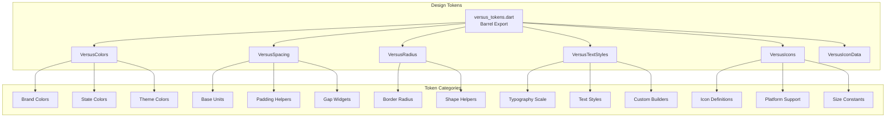
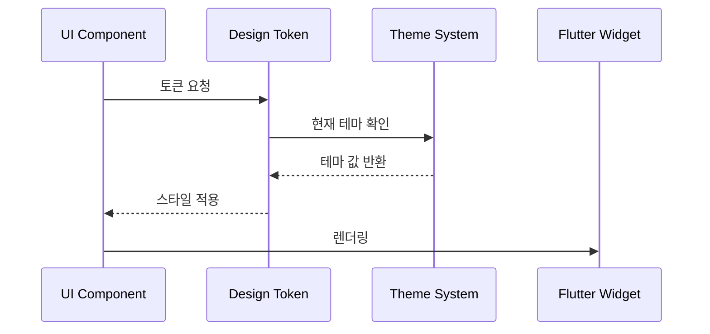

# 🎨 Design System Tokens 디렉토리
> Versus Space 디자인 시스템의 핵심 토큰과 스타일 정의

## 🎯 개요

이 디렉토리는 Versus Space 애플리케이션 전반에서 사용되는 디자인 토큰을 정의합니다. 기존 AppTheme과 UI 패턴에서 추출한 표준화된 디자인 요소들을 제공하여, 일관된 사용자 경험과 효율적인 개발을 지원합니다.

### 핵심 원칙
- **일관성**: 모든 UI 컴포넌트가 동일한 디자인 토큰 사용
- **유지보수성**: 중앙 집중식 스타일 관리로 쉬운 업데이트
- **확장성**: 다크모드 등 향후 확장을 고려한 설계
- **호환성**: 기존 AppTheme과의 완벽한 호환성 유지

## 📐 네이밍 컨벤션

```dart
// 파일명: snake_case (Dart 표준)
versus_colors.dart
versus_spacing.dart
versus_text_styles.dart

// 클래스명: PascalCase
class VersusColors
class VersusSpacing
class VersusTextStyles

// 상수/속성: lowerCamelCase
static const Color primary
static const double screenPadding
static TextStyle get bodyMedium

// 메서드명: lowerCamelCase
static EdgeInsets horizontal()
static BorderRadius custom()
```

- 참조: [NAMING_CONVENTION.md](../../../NAMING_CONVENTION.md)

## 🏗️ 아키텍처

### 토큰 시스템 구조


### 토큰 적용 플로우


## 🔧 주요 구성요소

### 1. VersusTokens (Barrel Export)
**위치**: `versus_tokens.dart`

모든 디자인 토큰을 한 번에 import할 수 있는 진입점입니다.

```dart
import 'package:versus_space/design_system/tokens/versus_tokens.dart';

// 모든 토큰 사용 가능
Container(
  padding: VersusSpacing.paddingMD,
  decoration: BoxDecoration(
    color: VersusColors.backgroundSecondary,
    borderRadius: VersusRadius.radiusMedium,
  ),
)
```

### 2. VersusColors (색상 시스템)
**위치**: `versus_colors.dart`

브랜드 색상부터 상태 색상까지 모든 색상을 정의합니다.

#### 색상 카테고리
- **브랜드 색상**: primary (#D95B5B), secondary (#588157)
- **배경 색상**: backgroundPrimary, backgroundSecondary
- **텍스트 색상**: textPrimary, textSecondary
- **상태 색상**: success, warning, error, info
- **다크모드 색상**: darkPrimary, darkBackground 등

#### 사용 예시
```dart
// 기본 색상 사용
Container(
  color: VersusColors.primary,
)

// 투명도 적용
Container(
  color: VersusColors.primaryWithAlpha(0.5),
)

// 텍스트 색상
Text(
  '안녕하세요',
  style: TextStyle(color: VersusColors.textPrimary),
)
```

### 3. VersusSpacing (간격 시스템)
**위치**: `versus_spacing.dart`

일관된 간격과 패딩을 제공하는 4px 기반 시스템입니다.

#### 간격 단위
- **xs**: 4px (매우 작은 간격)
- **sm**: 8px (작은 간격)
- **md**: 16px (기본 간격)
- **lg**: 20px (큰 간격)
- **xl**: 32px (매우 큰 간격)
- **xxl**: 48px (섹션 구분)

#### 헬퍼 메서드
```dart
// EdgeInsets 헬퍼
Container(
  padding: VersusSpacing.paddingMD,  // 16px 전체 패딩
)

// 방향별 패딩
Container(
  padding: VersusSpacing.horizontal(20),  // 좌우 20px
)

// SizedBox 간격
Column(
  children: [
    Text('제목'),
    VersusSpacing.gapMD,  // 16px 간격
    Text('내용'),
  ],
)

// 커스텀 패딩
Container(
  padding: VersusSpacing.custom(
    top: 10,
    bottom: 20,
    left: 15,
    right: 15,
  ),
)
```

### 4. VersusRadius (둥근 모서리 시스템)
**위치**: `versus_radius.dart`

표준화된 BorderRadius 값을 제공합니다.

#### Radius 값
- **none**: 0px (직각)
- **small**: 8px (버튼, 작은 컨테이너)
- **medium**: 16px (카드, 다이얼로그)
- **large**: 24px (큰 컨테이너)
- **circular**: 25px (원형 요소)

#### 사용 예시
```dart
// 기본 사용
Container(
  decoration: BoxDecoration(
    borderRadius: VersusRadius.radiusMedium,
  ),
)

// 용도별 사용
OutlinedButton(
  style: OutlinedButton.styleFrom(
    shape: VersusRadius.buttonShape,  // 8px radius
  ),
)

// 커스텀 radius
Container(
  decoration: BoxDecoration(
    borderRadius: VersusRadius.custom(12),
  ),
)

// 방향별 radius
Container(
  decoration: BoxDecoration(
    borderRadius: VersusRadius.only(
      topLeft: 16,
      topRight: 16,
    ),
  ),
)
```

### 5. VersusTextStyles (타이포그래피 시스템)
**위치**: `versus_text_styles.dart`

Plus Jakarta Sans 폰트 기반의 텍스트 스타일을 제공합니다.

#### 텍스트 스타일 카테고리
- **Headings**: headingLarge (32px), headingMedium (24px), headingSmall (20px)
- **Body**: bodyLarge (16px), bodyMedium (14px), bodySmall (12px)
- **Labels**: labelLarge, labelMedium, labelSmall
- **Buttons**: buttonLarge, buttonMedium, buttonSmall
- **Special**: dialogTitle, dialogContent, inputField, error

#### 사용 예시
```dart
// 제목 텍스트
Text(
  'Versus Space',
  style: VersusTextStyles.headingLarge,
)

// 본문 텍스트
Text(
  '설명 내용입니다',
  style: VersusTextStyles.bodyMedium,
)

// 색상 변경
Text(
  '중요한 텍스트',
  style: VersusTextStyles.withPrimaryColor(
    VersusTextStyles.bodyLarge
  ),
)

// 커스텀 스타일
Text(
  '커스텀 텍스트',
  style: VersusTextStyles.custom(
    fontSize: 18,
    fontWeight: FontWeight.bold,
    color: VersusColors.primary,
  ),
)
```

### 6. VersusIcons (아이콘 시스템)
**위치**: `versus_icons.dart`, `versus_icon_data.dart`

플랫폼별 아이콘을 통합 관리하는 시스템입니다.

#### 지원 플랫폼
- **Material Icons**: Google Material Design
- **SF Symbols**: Apple iOS 아이콘
- **Cupertino Icons**: Flutter 내장 iOS 스타일

#### 아이콘 카테고리
- **네비게이션**: back, forward, close, menu
- **미디어**: image, video, camera, gallery
- **액션**: add, edit, delete, share
- **상태**: success, error, warning, info
- **특수**: target, check, vote, notification
- **기타**: home, search, profile, settings, heart

#### 사용 예시
```dart
// VersusIcon 위젯과 함께 사용
VersusIcon(
  VersusIcons.home,
  size: VersusIcons.sizeMedium,
  color: VersusColors.primary,
)

// 직접 IconData 가져오기
Icon(
  VersusIcons.settings.getIcon(VersusIcons.currentStyle),
  size: 24,
)

// 플랫폼 스타일 변경
VersusIcons.currentStyle = VersusIconStyle.cupertino;
```

## 💻 사용 예시

### 통합 사용 예시
```dart
import 'package:versus_space/design_system/tokens/versus_tokens.dart';

class ProfileCard extends StatelessWidget {
  @override
  Widget build(BuildContext context) {
    return Container(
      padding: VersusSpacing.paddingLG,
      margin: VersusSpacing.screenHorizontal,
      decoration: BoxDecoration(
        color: VersusColors.backgroundSecondary,
        borderRadius: VersusRadius.card,
        border: Border.all(
          color: VersusColors.borderLight,
          width: 1,
        ),
      ),
      child: Column(
        crossAxisAlignment: CrossAxisAlignment.start,
        children: [
          // 제목
          Text(
            '프로필',
            style: VersusTextStyles.headingMedium,
          ),
          
          VersusSpacing.gapMD,
          
          // 사용자 정보
          Row(
            children: [
              VersusIcon(
                VersusIcons.profile,
                size: VersusIcons.sizeLarge,
                color: VersusColors.textSecondary,
              ),
              VersusSpacing.gapH(8),
              Text(
                '사용자 이름',
                style: VersusTextStyles.bodyLarge,
              ),
            ],
          ),
          
          VersusSpacing.gapLG,
          
          // 액션 버튼
          ElevatedButton(
            style: ElevatedButton.styleFrom(
              backgroundColor: VersusColors.primary,
              shape: VersusRadius.buttonShape,
              padding: VersusSpacing.buttonInternal,
            ),
            onPressed: () {},
            child: Text(
              '프로필 편집',
              style: VersusTextStyles.buttonMedium.copyWith(
                color: Colors.white,
              ),
            ),
          ),
        ],
      ),
    );
  }
}
```

### 다크모드 대응
```dart
// 테마에 따른 색상 선택
Color getBackgroundColor(BuildContext context) {
  final isDarkMode = Theme.of(context).brightness == Brightness.dark;
  return isDarkMode 
    ? VersusColors.darkBackground 
    : VersusColors.backgroundPrimary;
}

// 사용
Container(
  color: getBackgroundColor(context),
)
```

### 반응형 디자인
```dart
// 화면 크기에 따른 텍스트 크기 조정
Text(
  '제목',
  style: MediaQuery.of(context).size.width > 600
    ? VersusTextStyles.headingLarge
    : VersusTextStyles.headingMedium,
)

// 화면 크기에 따른 패딩 조정
Container(
  padding: MediaQuery.of(context).size.width > 600
    ? VersusSpacing.paddingXL
    : VersusSpacing.paddingMD,
)
```

## 🎨 스타일 가이드

### 색상 사용 원칙
1. **브랜드 색상**: 주요 CTA와 브랜딩 요소에만 사용
2. **상태 색상**: 사용자 피드백과 시스템 상태 표시
3. **텍스트 색상**: 가독성을 위해 적절한 대비 유지
4. **배경 색상**: 계층 구조를 명확하게 표현

### 간격 사용 원칙
1. **일관성**: 같은 용도에는 같은 간격 사용
2. **계층구조**: 관련성에 따라 간격 차별화
3. **여백**: 충분한 여백으로 가독성 향상
4. **정렬**: 그리드 시스템 준수

### 타이포그래피 원칙
1. **계층구조**: 명확한 제목-본문 구분
2. **가독성**: 적절한 크기와 행간 유지
3. **일관성**: 같은 용도에 같은 스타일
4. **강조**: 굵기와 색상으로 중요도 표현

## 🔄 마이그레이션 가이드

### 기존 코드 → 디자인 토큰
```dart
// Before
Container(
  padding: EdgeInsets.all(16.0),
  decoration: BoxDecoration(
    color: Color(0xFFF5F2E8),
    borderRadius: BorderRadius.circular(16.0),
  ),
  child: Text(
    '텍스트',
    style: GoogleFonts.plusJakartaSans(
      fontSize: 14.0,
      color: Color(0xFF4A444B),
    ),
  ),
)

// After
Container(
  padding: VersusSpacing.paddingMD,
  decoration: BoxDecoration(
    color: VersusColors.backgroundSecondary,
    borderRadius: VersusRadius.radiusMedium,
  ),
  child: Text(
    '텍스트',
    style: VersusTextStyles.bodyMedium,
  ),
)
```

## 🔍 디버깅

### 토큰 값 확인
```dart
// 런타임에 토큰 값 확인
if (!kReleaseMode) {
  print('Primary Color: ${VersusColors.primary}');
  print('MD Spacing: ${VersusSpacing.md}');
  print('Card Radius: ${VersusRadius.card}');
}
```

### 일반적인 문제 해결

1. **색상이 표시되지 않음**
   - Color 객체 올바른 사용 확인
   - 투명도 값 확인

2. **간격이 적용되지 않음**
   - EdgeInsets vs SizedBox 적절한 사용
   - Container constraints 확인

3. **텍스트 스타일 미적용**
   - copyWith() 사용 시 올바른 속성 전달
   - Theme override 확인

## 📝 변경 이력

- **2025-08-24**: 종합 문서 작성
  - 7개 토큰 파일 상세 문서화
  - 사용 예시 및 가이드라인 추가
  - 마이그레이션 가이드 작성
  
- **2025-08-22**: 초기 디렉토리 생성
  - 기본 토큰 파일 구현
  - AppTheme에서 추출한 스타일 정의

## 🚀 향후 계획

1. **다크모드 완전 지원**
   - 모든 컴포넌트의 다크모드 대응
   - 자동 테마 전환 시스템
   - 사용자 설정 저장

2. **애니메이션 토큰**
   - Duration 상수 정의
   - Curve 프리셋 추가
   - 전환 효과 표준화

3. **브레이크포인트 시스템**
   - 반응형 디자인 지원
   - 디바이스별 최적화
   - 레이아웃 토큰 추가

4. **접근성 향상**
   - 고대비 모드 지원
   - 폰트 크기 조절 지원
   - 색맹 친화적 팔레트