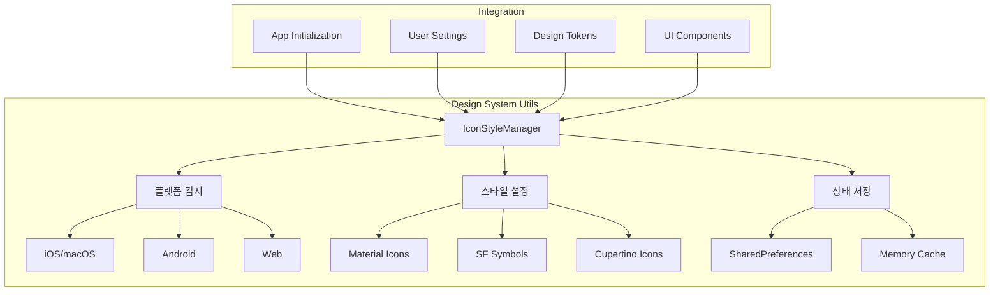
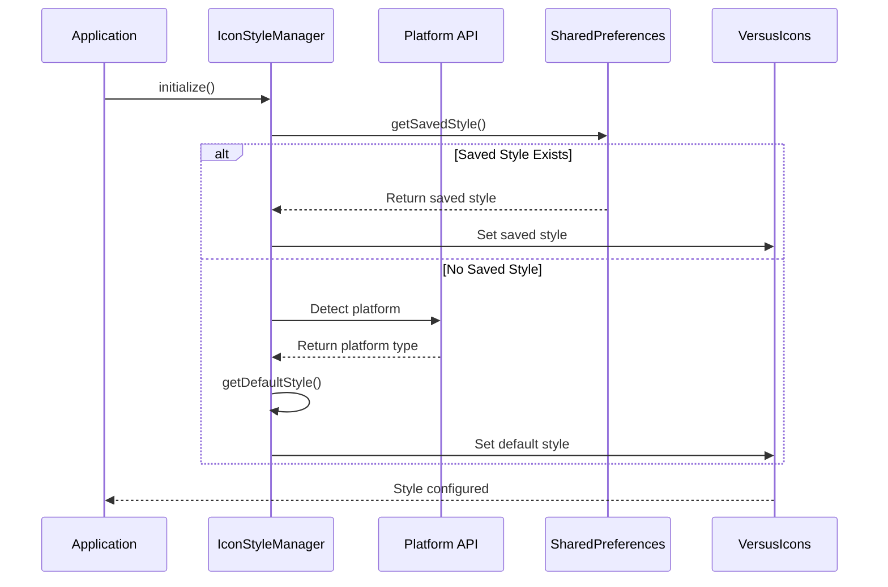

# 🛠️ Design System Utils 디렉토리
> Versus Space 디자인 시스템의 유틸리티 함수와 헬퍼 클래스

## 🎯 개요

이 디렉토리는 Versus Space 디자인 시스템을 지원하는 유틸리티 클래스와 헬퍼 함수들을 포함합니다. 플랫폼별 최적화, 상태 관리, 테마 전환 등 디자인 토큰과 컴포넌트를 효과적으로 활용하기 위한 도구들을 제공합니다.

### 핵심 역할
- **플랫폼별 최적화**: iOS/Android/Web별 맞춤 설정
- **상태 관리**: 사용자 설정 저장 및 복원
- **테마 전환**: 다크모드/라이트모드 전환 지원
- **성능 최적화**: 캐싱 및 메모리 관리

## 📐 네이밍 컨벤션

```dart
// 파일명: snake_case (Dart 표준)
icon_style_manager.dart
theme_manager.dart
responsive_helper.dart

// 클래스명: PascalCase
class IconStyleManager
class ThemeManager
class ResponsiveHelper

// 메서드명: lowerCamelCase
static void initialize()
static VersusIconStyle getDefaultStyle()
static void setIconStyle()

// 변수명: lowerCamelCase
final VersusIconStyle currentStyle
final bool isDarkMode
```

- 참조: [NAMING_CONVENTION.md](../../../NAMING_CONVENTION.md)

## 🏗️ 아키텍처

### 유틸리티 시스템 구조


### 초기화 플로우


## 🔧 주요 구성요소

### 1. IconStyleManager (아이콘 스타일 관리자)
**위치**: `icon_style_manager.dart`

플랫폼별 아이콘 스타일을 자동으로 설정하고 사용자 선호도를 관리합니다.

#### 주요 기능
- **플랫폼 자동 감지**: iOS/macOS에서 SF Symbols, 기타 플랫폼에서 Material Icons
- **스타일 전환**: 런타임에 아이콘 스타일 변경
- **상태 유지**: 사용자 설정 저장 및 복원 (SharedPreferences 통합 가능)

#### 메서드 상세

##### `getDefaultStyle()`
플랫폼에 따른 기본 아이콘 스타일을 반환합니다.

```dart
// iOS/macOS 환경
if (Platform.isIOS || Platform.isMacOS) {
  return VersusIconStyle.sfSymbols;
}
// Android/Web/기타
return VersusIconStyle.material;
```

##### `setIconStyle(VersusIconStyle style)`
아이콘 스타일을 변경합니다.

```dart
IconStyleManager.setIconStyle(VersusIconStyle.cupertino);
```

##### `getCurrentStyle()`
현재 설정된 아이콘 스타일을 반환합니다.

```dart
final currentStyle = IconStyleManager.getCurrentStyle();
print('현재 스타일: $currentStyle');
```

##### `initialize()`
앱 시작 시 아이콘 스타일을 초기화합니다.

```dart
// main.dart에서 호출
void main() {
  IconStyleManager.initialize();
  runApp(MyApp());
}
```

## 💻 사용 예시

### 기본 사용법

#### 앱 초기화
```dart
import 'package:versus_space/design_system/utils/icon_style_manager.dart';

void main() async {
  WidgetsFlutterBinding.ensureInitialized();
  
  // 아이콘 스타일 초기화
  IconStyleManager.initialize();
  
  runApp(MyApp());
}
```

#### 플랫폼별 스타일 적용
```dart
class MyApp extends StatelessWidget {
  @override
  Widget build(BuildContext context) {
    // 자동으로 플랫폼에 맞는 아이콘 스타일이 적용됨
    return MaterialApp(
      home: Scaffold(
        body: Center(
          child: VersusIcon(
            VersusIcons.home,  // 플랫폼에 맞는 아이콘 자동 표시
            size: 32,
          ),
        ),
      ),
    );
  }
}
```

#### 사용자 설정 화면
```dart
class SettingsPage extends StatefulWidget {
  @override
  _SettingsPageState createState() => _SettingsPageState();
}

class _SettingsPageState extends State<SettingsPage> {
  VersusIconStyle _selectedStyle = IconStyleManager.getCurrentStyle();
  
  @override
  Widget build(BuildContext context) {
    return Column(
      children: [
        Text('아이콘 스타일', style: VersusTextStyles.headingMedium),
        
        RadioListTile<VersusIconStyle>(
          title: Text('Material Icons'),
          value: VersusIconStyle.material,
          groupValue: _selectedStyle,
          onChanged: _updateIconStyle,
        ),
        
        RadioListTile<VersusIconStyle>(
          title: Text('SF Symbols'),
          value: VersusIconStyle.sfSymbols,
          groupValue: _selectedStyle,
          onChanged: _updateIconStyle,
        ),
        
        RadioListTile<VersusIconStyle>(
          title: Text('Cupertino Icons'),
          value: VersusIconStyle.cupertino,
          groupValue: _selectedStyle,
          onChanged: _updateIconStyle,
        ),
      ],
    );
  }
  
  void _updateIconStyle(VersusIconStyle? style) {
    if (style != null) {
      setState(() {
        _selectedStyle = style;
        IconStyleManager.setIconStyle(style);
      });
    }
  }
}
```

### 고급 사용법

#### SharedPreferences 통합
```dart
import 'package:shared_preferences/shared_preferences.dart';

class IconStyleManagerWithPersistence {
  static const String _iconStyleKey = 'icon_style';
  
  static Future<void> initialize() async {
    final prefs = await SharedPreferences.getInstance();
    final savedStyle = prefs.getString(_iconStyleKey);
    
    if (savedStyle != null) {
      // 저장된 스타일 복원
      final style = VersusIconStyle.values.firstWhere(
        (e) => e.toString() == savedStyle,
        orElse: () => IconStyleManager.getDefaultStyle(),
      );
      IconStyleManager.setIconStyle(style);
    } else {
      // 플랫폼 기본값 사용
      IconStyleManager.initialize();
    }
  }
  
  static Future<void> saveIconStyle(VersusIconStyle style) async {
    final prefs = await SharedPreferences.getInstance();
    await prefs.setString(_iconStyleKey, style.toString());
    IconStyleManager.setIconStyle(style);
  }
}
```

#### 동적 스타일 전환
```dart
class DynamicIconDemo extends StatelessWidget {
  @override
  Widget build(BuildContext context) {
    return Column(
      children: [
        // 현재 스타일로 아이콘 표시
        VersusIcon(
          VersusIcons.settings,
          size: 48,
        ),
        
        // 스타일 전환 버튼
        ElevatedButton(
          onPressed: () {
            final currentStyle = IconStyleManager.getCurrentStyle();
            final newStyle = _getNextStyle(currentStyle);
            IconStyleManager.setIconStyle(newStyle);
            
            // UI 리빌드를 위해 setState 호출 필요
            // 또는 Provider/Riverpod 사용
          },
          child: Text('아이콘 스타일 변경'),
        ),
      ],
    );
  }
  
  VersusIconStyle _getNextStyle(VersusIconStyle current) {
    switch (current) {
      case VersusIconStyle.material:
        return VersusIconStyle.sfSymbols;
      case VersusIconStyle.sfSymbols:
        return VersusIconStyle.cupertino;
      case VersusIconStyle.cupertino:
        return VersusIconStyle.material;
    }
  }
}
```

## 🎨 플랫폼별 최적화

### iOS/macOS
```dart
// SF Symbols 자동 적용
if (Platform.isIOS || Platform.isMacOS) {
  // SF Symbols가 기본값
  // Apple 플랫폼에 최적화된 아이콘 표시
}
```

### Android
```dart
// Material Icons 자동 적용
if (Platform.isAndroid) {
  // Material Design 가이드라인 준수
  // Google의 디자인 언어와 일관성 유지
}
```

### Web
```dart
// Material Icons 사용 (웹 폰트 지원)
if (kIsWeb) {
  // 웹 브라우저에서 최적화된 렌더링
  // 가벼운 웹 폰트 로딩
}
```

## 🔄 상태 관리 통합

### Provider 패턴
```dart
class IconStyleProvider extends ChangeNotifier {
  VersusIconStyle _style = IconStyleManager.getCurrentStyle();
  
  VersusIconStyle get style => _style;
  
  void updateStyle(VersusIconStyle newStyle) {
    _style = newStyle;
    IconStyleManager.setIconStyle(newStyle);
    notifyListeners();
  }
}

// 사용
Consumer<IconStyleProvider>(
  builder: (context, provider, child) {
    return VersusIcon(
      VersusIcons.home,
      // 자동으로 스타일 변경 반영
    );
  },
)
```

### Riverpod 패턴
```dart
final iconStyleProvider = StateNotifierProvider<IconStyleNotifier, VersusIconStyle>((ref) {
  return IconStyleNotifier();
});

class IconStyleNotifier extends StateNotifier<VersusIconStyle> {
  IconStyleNotifier() : super(IconStyleManager.getCurrentStyle());
  
  void updateStyle(VersusIconStyle style) {
    state = style;
    IconStyleManager.setIconStyle(style);
  }
}
```

## 🔍 디버깅

### 디버그 로깅
```dart
if (!kReleaseMode) {
  print('[IconStyleManager] Platform: ${Platform.operatingSystem}');
  print('[IconStyleManager] Default Style: ${IconStyleManager.getDefaultStyle()}');
  print('[IconStyleManager] Current Style: ${IconStyleManager.getCurrentStyle()}');
}
```

### 일반적인 문제 해결

1. **아이콘이 표시되지 않음**
   - 플랫폼별 아이콘 데이터 확인
   - null 값 처리 확인
   - 폰트 파일 포함 여부 확인

2. **스타일 변경이 반영되지 않음**
   - setState() 또는 notifyListeners() 호출 확인
   - VersusIcon 위젯 재빌드 확인
   - currentStyle 값 업데이트 확인

3. **플랫폼 감지 실패**
   - Platform import 확인
   - kIsWeb import 확인 (웹 플랫폼)
   - 플랫폼별 조건문 확인

## 📝 변경 이력

- **2025-08-24**: 종합 문서 작성
  - IconStyleManager 상세 문서화
  - 사용 예시 및 통합 가이드 추가
  - 플랫폼별 최적화 방법 설명
  
- **2025-08-22**: 초기 디렉토리 생성
  - IconStyleManager 클래스 구현
  - 플랫폼 감지 로직 추가

## 🚀 향후 계획

1. **추가 유틸리티 클래스**
   - ThemeManager: 다크모드/라이트모드 전환
   - ResponsiveHelper: 반응형 디자인 지원
   - AnimationManager: 애니메이션 설정 관리
   - ColorSchemeGenerator: 동적 색상 테마 생성

2. **성능 최적화**
   - 아이콘 캐싱 시스템
   - 지연 로딩 구현
   - 메모리 사용 최적화

3. **개발자 도구**
   - 디자인 토큰 검사 도구
   - 스타일 미리보기 위젯
   - 디버그 오버레이

4. **통합 개선**
   - GetX 상태 관리 통합
   - Bloc 패턴 지원
   - 커스텀 훅 제공