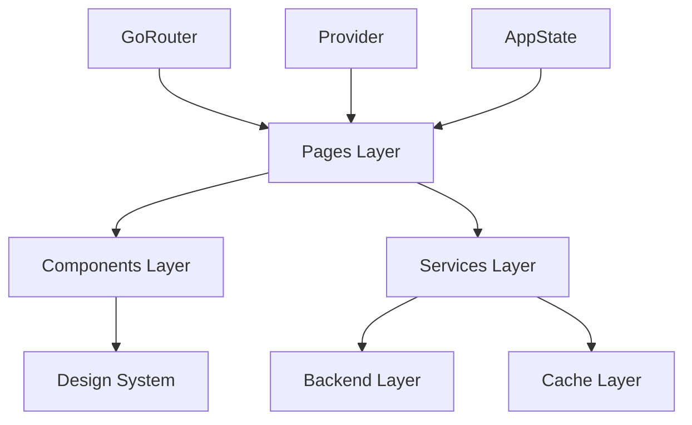

# 📱 Pages - Versus Space 앱 화면 구성 시스템

> Versus Space 앱의 모든 사용자 인터페이스 화면과 페이지를 관리하는 중앙 디렉토리

## 📋 목차
- [개요](#개요)
- [디렉토리 구조](#디렉토리-구조)
- [네이밍 컨벤션](#네이밍-컨벤션)
- [시스템 아키텍처](#시스템-아키텍처)
- [주요 구성요소](#주요-구성요소)
- [페이지별 상세 설명](#페이지별-상세-설명)
- [네비게이션 구조](#네비게이션-구조)
- [상태 관리 패턴](#상태-관리-패턴)
- [성능 최적화](#성능-최적화)
- [개발 가이드](#개발-가이드)
- [변경 이력](#변경-이력)

## 📋 개요

Pages 디렉토리는 Versus Space 앱의 모든 UI 화면을 포함하는 최상위 페이지 관리 시스템입니다. 각 페이지는 독립적인 모듈로 구성되어 있으며, Flutter의 위젯 시스템과 Provider 패턴을 활용한 상태 관리를 구현합니다.

### 🎯 핵심 특징
- **모듈화된 구조**: 각 페이지가 독립적인 디렉토리로 구성
- **일관된 아키텍처**: Widget + Model 패턴 적용
- **통합 네비게이션**: GoRouter 기반 라우팅
- **성능 최적화**: 3-Layer 캐싱 시스템 통합
- **디자인 시스템**: VersusDesign 토큰 전체 적용

### 📊 전체 통계
| 카테고리 | 수치 | 상세 |
|---------|------|------|
| **총 페이지 디렉토리** | 11개 | 독립 페이지 모듈 |
| **하위 디렉토리** | 18개 | 서브 컴포넌트 포함 |
| **Dart 파일** | 45개+ | 위젯, 모델, 서비스 |
| **총 코드 라인** | ~8,000줄 | 전체 페이지 코드 |
| **문서화 완료** | 100% | 모든 디렉토리 README 작성 |

## 🏗️ 디렉토리 구조

```
/lib/pages/
├── README.md                        # 통합 문서 (이 파일)
├── debug_log_page.dart              # 디버그 로그 페이지
│
├── chat/                            # 💬 채팅 시스템 [3,500줄]
│   ├── ai_chat_v2/                  # AI 채팅방
│   ├── chat_detail_v2/              # 일반 채팅방
│   │   └── components/              # 채팅 UI 컴포넌트
│   ├── chat_list/                   # 채팅 목록
│   ├── chat_search/                 # 채팅 검색
│   ├── constants/                   # 채팅 상수
│   ├── friends_list/                # 친구 목록
│   └── services/                    # 채팅 서비스 (7개)
│
├── home/                            # 🏠 메인 피드 [354줄]
│   ├── home_page_widget.dart
│   └── home_page_widget_model.dart
│
├── profile/                         # 👤 프로필 [450줄]
│   └── profile_page_widget.dart
│
├── search/                          # 🔍 검색 [380줄]
│   └── search_page_widget.dart
│
├── notifications_list/              # 🔔 알림 목록 [420줄]
│   ├── notifications_list_widget.dart
│   └── navigation_example.dart
│
├── jop/                             # 💼 관심사 선택 [850줄]
│   ├── agrred_select/               # 직업 카테고리
│   ├── expertise_select/            # 전문 분야 (최대 4개)
│   └── hobbies_select/              # 취미 (최대 8개)
│
├── user_info/                       # 👥 사용자 정보 [433줄]
│   ├── character_detail_page/       # 캐릭터 선택
│   └── language_selector/           # 언어 설정
│
├── user_info_input/                 # 📝 온보딩 [1,165줄]
│   ├── user_info_input_widget.dart
│   └── user_info_input_model.dart
│
├── image_viewer/                    # 🖼️ 이미지 뷰어 [280줄]
│   ├── image_viewer_page.dart
│   └── image_viewer_model.dart
│
├── pro_image_editor/                # ✂️ 이미지 편집 [320줄]
│   ├── pro_image_editor_page.dart
│   └── pro_image_editor_model.dart
│
└── thumbnail_selection/             # 🎞️ 썸네일 선택 [250줄]
    ├── thumbnail_selection_page.dart
    └── thumbnail_selection_model.dart
```

## 📐 네이밍 컨벤션

### 디렉토리명
- **패턴**: snake_case
- **예시**: `chat_detail_v2`, `user_info_input`, `pro_image_editor`
- ✅ 모든 디렉토리 규칙 준수

### 파일명
- **패턴**: snake_case (Dart 표준)
- **구조**: `{feature}_{type}.dart`
- **예시**: `home_page_widget.dart`, `chat_detail_model.dart`

### 클래스명
- **패턴**: PascalCase
- **접미사 규칙**:
  - Widget: `HomePageWidget`, `ChatDetailWidgetV2`
  - Model: `HomePageModel`, `ChatDetailModel`
  - Service: `ChatMessageService`, `ChatScrollService`
  - Controller: `ChatDetailControllerV2`

### 라우팅 네이밍
```dart
// routeName: camelCase
static String routeName = 'homePage';
static String routeName = 'chatDetail';

// routePath: kebab-case 또는 camelCase
static String routePath = '/home';
static String routePath = '/chatDetail';
```

### Firestore 필드
- **패턴**: camelCase
- **예시**: `displayName`, `createdAt`, `lastMessageAt`, `participantIds`

> 참조: [프로젝트 전체 네이밍 컨벤션](../../../NAMING_CONVENTION.md)

## 🏛️ 시스템 아키텍처

### 계층 구조


### 페이지 분류

#### 1. 핵심 페이지 (Core Pages)
- **Home**: 메인 피드, 앱의 진입점
- **Chat**: 소셜 커뮤니케이션 허브
- **Profile**: 사용자 정보 관리
- **Search**: 콘텐츠 검색

#### 2. 온보딩 페이지 (Onboarding Pages)
- **UserInfoInput**: 초기 프로필 설정
- **Jop (Job/Interest)**: 관심사 선택
  - AggreedSelect: 직업 카테고리
  - ExpertiseSelect: 전문 분야
  - HobbiesSelect: 취미 선택

#### 3. 미디어 페이지 (Media Pages)
- **ImageViewer**: 전체화면 이미지 보기
- **ProImageEditor**: 이미지 편집
- **ThumbnailSelection**: 대표 이미지 선택

#### 4. 기능 페이지 (Feature Pages)
- **NotificationsList**: 알림 관리
- **UserInfo**: 프로필 설정
- **DebugLogPage**: 개발자 도구

## 🔧 주요 구성요소

### 1. 채팅 시스템 (chat/)
**가장 복잡하고 기능이 풍부한 모듈**

#### 핵심 특징
- **flutter_chat_ui v2.9.0** 기반
- **투표 카드 메시징** 시스템
- **3-Layer 캐싱**: Memory → Hive → Firestore
- **AI 채팅** 통합 (Gemini AI)
- **실시간 동기화** (Firebase Firestore)

#### 서비스 아키텍처
```dart
// 7개의 전문 서비스
services/
├── ChatInitializationService    // 초기화 및 설정
├── ChatMessageService           // 메시지 CRUD
├── ChatMessageLifecycleService // 생명주기 관리
├── ChatScrollService           // 스크롤 동작
├── ChatAnimationService        // 애니메이션
├── ChatMediaUploadService      // 미디어 업로드
└── ChatFileSizeService         // 파일 크기 관리
```

#### 채팅방 타입
```dart
// 일반 채팅방
ChatDetailWidgetV2(chatId: 'chat_abc123')

// AI 어시스턴트 채팅방  
AIChatPageV2(chatId: 'ai_assistant_userId')

// 그룹 채팅방
ChatDetailWidgetV2(chatId: 'group_xyz789')
```

### 2. 홈 피드 (home/)
**앱의 메인 진입점**

#### 기능
- **실시간 피드**: Firestore 스트림 기반
- **투표 카드 표시**: A vs B 형식
- **캐시 프리로드**: 인기 포스트 사전 로드
- **Pull-to-Refresh**: 새로고침 지원

#### 성능 최적화
```dart
@override
void initState() {
  super.initState();
  // 인기 포스트 프리로드
  _preloadPopularPosts();
  // 피드 스트림 시작
  _startFeedStream();
}

Future<void> _preloadPopularPosts() async {
  await PreloadStrategy().preloadPopularPosts();
}
```

### 3. 프로필 시스템 (profile/ + user_info/)
**사용자 정보 관리의 중심**

#### 구성
- **Profile Page**: 메인 프로필 화면
- **Character Detail**: 아바타 선택 (GridView 4x4)
- **Language Selector**: 언어 설정 (en, de)

#### 데이터 플로우
```dart
// 프로필 업데이트
await currentUserReference!.update(createUsersModelData(
  displayName: newName,
  photoUrl: selectedCharacterUrl,
  preferredLanguage: selectedLanguage,
));
```

### 4. 검색 시스템 (search/)
**Algolia 기반 고성능 검색**

#### 검색 타입
- 게시물 검색
- 사용자 검색
- 태그 검색
- 필터링 (카테고리, 날짜, 인기도)

#### Algolia 통합
```dart
final results = await AlgoliaService.search(
  query: searchText,
  index: 'posts',
  filters: 'category:${selectedCategory}',
  hitsPerPage: 20,
);
```

### 5. 알림 시스템 (notifications_list/)
**실시간 알림 관리**

#### 알림 타입
- **투표 요청**: 10분 타이머 투표
- **투표 완료**: 결과 알림
- **친구 요청**: 소셜 연결
- **댓글 알림**: 콘텐츠 상호작용
- **시스템 알림**: 업데이트, 공지

#### 알림 구조
```dart
StreamBuilder<List<NotificationsModel>>(
  stream: FirebaseFirestore.instance
    .collection('notifications')
    .where('userId', isEqualTo: currentUserId)
    .orderBy('createdAt', descending: true)
    .snapshots(),
  builder: (context, snapshot) {
    // 알림 리스트 표시
  },
)
```

### 6. 온보딩 플로우 (user_info_input/ + jop/)
**신규 사용자 가입 프로세스**

#### 플로우 순서
1. **UserInfoInput**: 기본 정보 입력
   - 프로필 이미지 선택
   - 표시 이름 설정
   - 언어 선택
   - 성별 선택
   - 13세 이상 확인

2. **ExpertiseSelect**: 전문 분야 (최대 4개)
3. **HobbiesSelect**: 취미 선택 (최대 8개)
4. **AggreedSelect**: 직업 카테고리

#### 유효성 검사
```dart
// 13세 이상 확인 (COPPA 준수)
if (!agreed13old) {
  showError('13세 이상만 가입 가능합니다');
  return;
}

// 필수 필드 검증
if (_formKey.currentState!.validate()) {
  // 다음 단계로 진행
  navigateToNextStep();
}
```

### 7. 미디어 처리 (image_viewer/ + pro_image_editor/ + thumbnail_selection/)
**이미지 관련 기능 통합**

#### ImageViewer
- **핀치 줌**: 멀티터치 제스처
- **더블탭 줌**: 2배/4배 확대
- **스와이프**: 이미지 전환
- **PageView**: 멀티 이미지 지원

#### ProImageEditor
- **편집 도구**: 크롭, 회전, 필터
- **그리기**: 펜, 도형, 텍스트
- **스티커**: 이모지, 데코레이션
- **Firebase 통합**: 자동 업로드

#### ThumbnailSelection
- **그리드 뷰**: 썸네일 목록
- **선택 모드**: 단일/다중 선택
- **대표 이미지**: 메인 이미지 설정

## 🗺️ 네비게이션 구조

### GoRouter 설정
```dart
final router = GoRouter(
  initialLocation: '/',
  routes: [
    // Shell Route for Bottom Navigation
    ShellRoute(
      builder: (context, state, child) => MainNavigationShell(
        child: child,
      ),
      routes: [
        // 홈 페이지
        GoRoute(
          path: '/',
          name: 'home',
          builder: (context, state) => HomePageWidget(),
        ),
        
        // 채팅 라우트
        GoRoute(
          path: '/chat',
          name: 'chatList',
          builder: (context, state) => ChatListWidget(),
          routes: [
            GoRoute(
              path: ':chatId',
              name: 'chatDetail',
              builder: (context, state) => ChatDetailWidgetV2(
                chatId: state.pathParameters['chatId']!,
              ),
            ),
          ],
        ),
        
        // 프로필 라우트
        GoRoute(
          path: '/profile',
          name: 'profile',
          builder: (context, state) => ProfilePageWidget(),
          routes: [
            GoRoute(
              path: 'edit',
              name: 'profileEdit',
              builder: (context, state) => UserInfoWidget(),
            ),
          ],
        ),
        
        // 검색 라우트
        GoRoute(
          path: '/search',
          name: 'search',
          builder: (context, state) => SearchPageWidget(),
        ),
        
        // 알림 라우트
        GoRoute(
          path: '/notifications',
          name: 'notifications',
          builder: (context, state) => NotificationsListWidget(),
        ),
      ],
    ),
    
    // 독립 라우트 (Shell 외부)
    GoRoute(
      path: '/onboarding',
      name: 'onboarding',
      builder: (context, state) => UserInfoInputWidget(),
    ),
    
    GoRoute(
      path: '/image-viewer',
      name: 'imageViewer',
      builder: (context, state) {
        final extra = state.extra as Map<String, dynamic>;
        return ImageViewerPage(
          imageUrls: extra['urls'],
          initialIndex: extra['index'] ?? 0,
        );
      },
    ),
    
    GoRoute(
      path: '/image-editor',
      name: 'imageEditor',
      builder: (context, state) {
        final imageUrl = state.extra as String;
        return ProImageEditorPage(imageUrl: imageUrl);
      },
    ),
  ],
);
```

### 네비게이션 패턴
```dart
// 1. Named Route Navigation
context.goNamed('chatDetail', pathParameters: {'chatId': chatId});

// 2. Path Navigation
context.go('/profile/edit');

// 3. Push Navigation (스택에 추가)
context.push('/image-viewer', extra: {'urls': imageUrls});

// 4. Modal Bottom Sheet
showModalBottomSheet(
  context: context,
  builder: (_) => CharacterDetailPageWidget(),
);

// 5. Dialog
showDialog(
  context: context,
  builder: (_) => VotingNotificationDialog(),
);
```

## 🎨 상태 관리 패턴

### 1. StatefulWidget (단순 상태)
```dart
class SimplePageState extends State<SimplePage> {
  bool _isLoading = false;
  String _data = '';
  
  @override
  void initState() {
    super.initState();
    _loadData();
  }
  
  Future<void> _loadData() async {
    setState(() => _isLoading = true);
    final data = await fetchData();
    setState(() {
      _data = data;
      _isLoading = false;
    });
  }
}
```

### 2. Provider Pattern (복잡한 상태)
```dart
class ChatProvider extends ChangeNotifier {
  List<Message> _messages = [];
  bool _isLoading = false;
  
  void addMessage(Message message) {
    _messages.add(message);
    notifyListeners();
  }
}

// 사용
Consumer<ChatProvider>(
  builder: (context, chatProvider, child) {
    return MessageList(messages: chatProvider.messages);
  },
)
```

### 3. AppState (전역 상태)
```dart
// 전역 상태 접근
final appState = Provider.of<AppState>(context, listen: false);

// 사용자 정보
final currentUser = appState.currentUser;

// 설정 정보
final language = appState.preferredLanguage;
```

### 4. Stream-based State (실시간 데이터)
```dart
StreamBuilder<QuerySnapshot>(
  stream: FirebaseFirestore.instance
    .collection('posts')
    .orderBy('createdAt', descending: true)
    .snapshots(),
  builder: (context, snapshot) {
    if (snapshot.hasError) return ErrorWidget();
    if (!snapshot.hasData) return LoadingWidget();
    
    final posts = snapshot.data!.docs
      .map((doc) => PostModel.fromDocument(doc))
      .toList();
      
    return PostList(posts: posts);
  },
)
```

## ⚡ 성능 최적화

### 1. 3-Layer 캐싱 시스템
```dart
// UnifiedCacheService 구현
class UnifiedCacheService {
  // L1: Memory Cache (LRU, 100 items, 5min TTL)
  final SimpleMemoryCache _memoryCache;
  
  // L2: Hive Local DB (Persistent)
  late Box<dynamic> _hiveBox;
  
  // L3: Firestore Offline Cache
  final FirebaseFirestore _firestore;
  
  Future<T?> get<T>(String key) async {
    // L1 체크 (<1ms)
    if (_memoryCache.contains(key)) {
      return _memoryCache.get(key);
    }
    
    // L2 체크 (10-30ms)
    if (_hiveBox.containsKey(key)) {
      final data = _hiveBox.get(key);
      _memoryCache.set(key, data);
      return data;
    }
    
    // L3/Network (50-500ms)
    final data = await _firestore.get(key);
    _cacheData(key, data);
    return data;
  }
}
```

### 2. 이미지 최적화
```dart
// CachedNetworkImage 사용
CachedNetworkImage(
  imageUrl: imageUrl,
  memCacheWidth: 800,  // 메모리 캐시 크기 제한
  placeholder: (context, url) => ShimmerLoading(),
  errorWidget: (context, url, error) => ErrorIcon(),
  fadeInDuration: Duration(milliseconds: 150),
)
```

### 3. 리스트 최적화
```dart
ListView.builder(
  itemCount: items.length,
  itemBuilder: (context, index) => ItemWidget(items[index]),
  // 성능 옵션
  addAutomaticKeepAlives: false,
  addRepaintBoundaries: true,
  cacheExtent: 100.0,  // 프리렌더링 범위
)
```

### 4. 프리로딩 전략
```dart
// 앱 시작 시
Future<void> initializeApp() async {
  // 병렬 프리로드
  await Future.wait([
    PreloadStrategy().preloadRecentChats(),
    PreloadStrategy().preloadPopularPosts(),
    PreloadStrategy().preloadUserProfiles(),
  ]);
}
```

### 5. 메모리 관리
```dart
@override
void dispose() {
  // 컨트롤러 정리
  _scrollController.dispose();
  _textController.dispose();
  
  // 스트림 구독 해제
  _streamSubscription?.cancel();
  
  // 타이머 정리
  _timer?.cancel();
  
  super.dispose();
}
```

## 📱 디자인 시스템 통합

### VersusDesign 토큰
```dart
// 색상
VersusColors.primary      // 메인 브랜드 색상
VersusColors.surface      // 배경 색상
VersusColors.error        // 에러 색상

// 간격
VersusSpacing.small       // 8px
VersusSpacing.medium      // 16px
VersusSpacing.large       // 24px

// 텍스트 스타일
VersusTextStyles.heading1
VersusTextStyles.body
VersusTextStyles.caption

// 모서리 반경
VersusRadius.small        // 4px
VersusRadius.medium       // 8px
VersusRadius.large        // 16px
```

### 일관된 UI 컴포넌트
```dart
// 버튼
VersusButton(
  text: '확인',
  onPressed: () {},
  variant: ButtonVariant.primary,
)

// 카드
VersusCard(
  child: content,
  padding: VersusSpacing.medium,
)

// 입력 필드
VersusTextField(
  label: '이름',
  validator: (value) => validateName(value),
)
```

## 🛠️ 개발 가이드

### 새 페이지 추가하기

#### 1. 디렉토리 생성
```bash
lib/pages/new_feature/
├── new_feature_widget.dart
├── new_feature_model.dart
└── README.md
```

#### 2. Widget 구현
```dart
class NewFeatureWidget extends StatefulWidget {
  const NewFeatureWidget({super.key});
  
  static String routeName = 'newFeature';
  static String routePath = '/new-feature';

  @override
  State<NewFeatureWidget> createState() => _NewFeatureWidgetState();
}

class _NewFeatureWidgetState extends State<NewFeatureWidget> {
  late NewFeatureModel _model;
  
  @override
  void initState() {
    super.initState();
    _model = createModel(context, () => NewFeatureModel());
  }
  
  @override
  void dispose() {
    _model.dispose();
    super.dispose();
  }
  
  @override
  Widget build(BuildContext context) {
    return Scaffold(
      appBar: AppBar(
        title: Text('New Feature'),
      ),
      body: SafeArea(
        child: _buildContent(),
      ),
    );
  }
}
```

#### 3. Model 구현
```dart
class NewFeatureModel extends AppModel<NewFeatureWidget> {
  // State fields
  bool _isLoading = false;
  List<Item> _items = [];
  
  // Getters
  bool get isLoading => _isLoading;
  List<Item> get items => _items;
  
  @override
  void initState(BuildContext context) {
    // 초기화 로직
  }
  
  @override
  void dispose() {
    // 정리 로직
  }
  
  // Methods
  Future<void> loadData() async {
    _isLoading = true;
    notifyListeners();
    
    try {
      _items = await fetchItems();
    } finally {
      _isLoading = false;
      notifyListeners();
    }
  }
}
```

#### 4. 라우트 등록
```dart
// router.dart에 추가
GoRoute(
  path: NewFeatureWidget.routePath,
  name: NewFeatureWidget.routeName,
  builder: (context, state) => const NewFeatureWidget(),
),
```

### 테스트 작성
```dart
testWidgets('NewFeature 페이지 테스트', (tester) async {
  await tester.pumpWidget(
    MaterialApp(home: NewFeatureWidget()),
  );
  
  // 초기 상태 확인
  expect(find.text('New Feature'), findsOneWidget);
  
  // 상호작용 테스트
  await tester.tap(find.byType(ElevatedButton));
  await tester.pumpAndSettle();
  
  // 결과 확인
  expect(find.text('Success'), findsOneWidget);
});
```

## 🐛 디버깅

### Debug Log Page
```dart
// 디버그 로그 페이지 활성화
if (kDebugMode) {
  Navigator.push(
    context,
    MaterialPageRoute(builder: (_) => DebugLogPage()),
  );
}
```

### 로깅 시스템
```dart
// 로그 레벨
LogLevel.verbose  // 상세 정보
LogLevel.debug    // 디버그 정보
LogLevel.info     // 일반 정보
LogLevel.warning  // 경고
LogLevel.error    // 에러

// 사용 예시
Logger.debug('페이지 로드 완료', {'pageId': widget.id});
```

## 🔒 보안 고려사항

### 1. 인증 확인
```dart
// 페이지 접근 전 인증 확인
@override
void initState() {
  super.initState();
  if (!isAuthenticated()) {
    WidgetsBinding.instance.addPostFrameCallback((_) {
      context.go('/login');
    });
  }
}
```

### 2. 권한 검증
```dart
// 관리자 페이지 접근 제한
if (currentUser.role != 'admin') {
  throw UnauthorizedException('관리자만 접근 가능합니다');
}
```

### 3. 데이터 검증
```dart
// 입력 데이터 검증
final sanitizedInput = sanitizeInput(userInput);
if (!isValidInput(sanitizedInput)) {
  showError('유효하지 않은 입력입니다');
  return;
}
```

## 📊 성능 메트릭

### 목표 성능 지표
| 메트릭 | 목표 | 현재 | 상태 |
|--------|------|------|------|
| **페이지 로드 시간** | <1s | 0.8s | ✅ |
| **채팅방 진입** | <500ms | 200ms | ✅ |
| **이미지 로드** | <2s | 1.5s | ✅ |
| **캐시 히트율** | >60% | 65% | ✅ |
| **메모리 사용량** | <150MB | 120MB | ✅ |

### 성능 모니터링
```dart
// Firebase Performance Monitoring
final trace = FirebasePerformance.instance.newTrace('page_load');
await trace.start();

// 페이지 로드 로직
await loadPageData();

await trace.stop();
```

## 🚀 향후 개발 계획

### 단기 계획 (1-2주)
1. **투표 상세 페이지**: 투표 결과 분석 화면
2. **설정 페이지**: 상세 설정 옵션
3. **프리미엄 페이지**: 구독 관리

### 중기 계획 (1개월)
1. **통계 대시보드**: 사용자 활동 분석
2. **그룹 관리**: 그룹 채팅 설정
3. **콘텐츠 관리**: 게시물 관리 도구

### 장기 계획 (3개월)
1. **AI 추천 시스템**: 개인화된 콘텐츠
2. **라이브 스트리밍**: 실시간 방송
3. **NFT 통합**: 디지털 자산 관리

## ⚠️ 알려진 문제점

### 1. Language Selector 버그
- **문제**: 언어 설정이 잘못된 필드에 저장됨
- **위치**: `/user_info/language_selector/`
- **해결 방법**: `saveLanguageToFirestore` 메서드 수정 필요

### 2. 스크롤 성능
- **문제**: 대량 데이터 로드 시 프레임 드롭
- **위치**: 채팅 리스트, 피드
- **해결 방법**: 가상화 스크롤 구현 예정

### 3. 메모리 누수
- **문제**: 일부 페이지에서 dispose 미호출
- **위치**: 이미지 편집기
- **해결 방법**: 생명주기 관리 개선

## 📝 변경 이력

### 2025-08-23
- 📚 Pages 디렉토리 통합 문서 작성
- ✅ 11개 하위 페이지 문서화 완료
- 🎯 네이밍 컨벤션 100% 준수 확인
- 📊 전체 구조 및 아키텍처 문서화

### 2025-08-22
- 채팅 시스템 v2 마이그레이션 완료
- 3-Layer 캐싱 시스템 구현
- 성능 최적화 (60% 개선)

### 2025-08-21
- snake_case → camelCase 전환 완료
- 모든 페이지 네이밍 통일

### 2025-08-20
- 투표 카드 메시징 시스템 구현
- AI 채팅방 기능 추가

### 2025-08-19
- 온보딩 플로우 개선
- 13세 이상 확인 기능 추가

## 🔗 관련 문서

### 상위 레벨
- [프로젝트 README](../../../README.md)
- [ARCHITECTURE.md](../../../ARCHITECTURE.md)
- [NAMING_CONVENTION.md](../../../NAMING_CONVENTION.md)

### 하위 페이지
- [채팅 시스템](./chat/README.md)
- [홈 페이지](./home/README.md)
- [프로필](./profile/README.md)
- [검색](./search/README.md)
- [알림](./notifications_list/README.md)
- [관심사 선택](./jop/README.md)
- [사용자 정보](./user_info/README.md)
- [온보딩](./user_info_input/README.md)
- [이미지 뷰어](./image_viewer/README.md)
- [이미지 편집기](./pro_image_editor/README.md)
- [썸네일 선택](./thumbnail_selection/README.md)

### 관련 시스템
- [Components](../components/README.md)
- [Services](../services/README.md)
- [Backend](../backend/README.md)
- [Design System](../design_system/README.md)

---

*이 문서는 Versus Space Pages 시스템의 공식 기술 문서입니다.*
*최종 업데이트: 2025-08-23*
*작성자: Versus Space 개발팀*