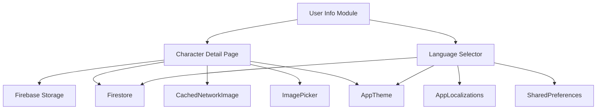
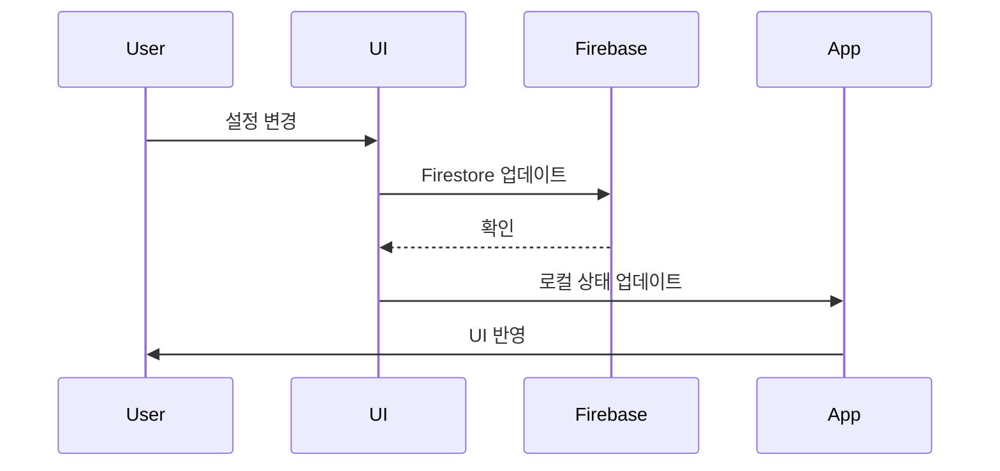

# 👥 User Info - 사용자 정보 관리 모듈

> Versus Space 앱의 사용자 프로필 및 설정 관련 UI 컴포넌트를 관리하는 모듈

## 📋 개요

User Info 모듈은 사용자 프로필 설정과 관련된 UI 컴포넌트들을 포함하는 디렉토리입니다. 현재 프로필 캐릭터(아바타) 선택 기능과 언어 설정 기능을 제공하며, 모든 컴포넌트는 Firebase와 통합되어 실시간으로 사용자 정보를 업데이트합니다.

### 🎯 주요 목적
- **프로필 관리**: 사용자 아바타 및 프로필 이미지 설정
- **언어 설정**: 앱 전체 언어 변경 및 다국어 지원
- **Firebase 통합**: Firestore를 통한 설정 영구 저장
- **UX 최적화**: 직관적인 설정 인터페이스 제공

### 📊 모듈 통계
- **하위 컴포넌트**: 2개 (character_detail_page, language_selector)
- **총 코드 라인**: 433줄
- **파일 수**: 6개 (위젯 2개, 모델 2개, README 3개)
- **생성일**: 2025-08-22
- **최종 업데이트**: 2025-08-23

## 🏗️ 디렉토리 구조

```
/lib/pages/user_info/
├── README.md                              # 통합 문서 (이 파일)
├── character_detail_page/                 # 캐릭터 선택 바텀시트
│   ├── character_detail_page_widget.dart  # UI 구현 (317줄)
│   ├── character_detail_page_model.dart   # 상태 관리 (24줄)
│   └── README.md                          # 컴포넌트 문서 (433줄)
└── language_selector/                     # 언어 선택 드롭다운
    ├── language_selector_widget.dart      # UI 구현 (67줄)
    ├── language_selector_model.dart       # 상태 관리 (25줄)
    └── README.md                          # 컴포넌트 문서 (360줄)
```

### 의존성 관계


## 📐 네이밍 컨벤션

### 파일명
- **패턴**: snake_case (Dart 표준)
- **구조**: `{feature}_{type}.dart`
- **예시**: `character_detail_page_widget.dart`, `language_selector_model.dart`
- ✅ 모든 파일 규칙 준수

### 클래스명
- **패턴**: PascalCase
- **접미사**: Widget, Model, State
- **예시**: `CharacterDetailPageWidget`, `LanguageSelectorModel`

### 필드 및 메서드
- **패턴**: camelCase
- **private**: 언더스코어 접두사 (`_`)
- **예시**: `selectedCharacterUrl`, `saveLanguageToFirestore`

### 알려진 네이밍 문제
- ⚠️ `isDataUploading_userUploadProfileImage` - 언더스코어 혼용 (character_detail_page)
- 추후 리팩토링 필요

> 참조: [프로젝트 전체 네이밍 컨벤션](../../../NAMING_CONVENTION.md)

## 🔧 주요 구성요소

### 1. Character Detail Page - 캐릭터 선택 컴포넌트 👤

**사용자 프로필 아바타를 선택하는 모달 바텀시트입니다.**

#### 핵심 기능
- **GridView 표시**: 4x4 그리드로 캐릭터 목록 표시
- **실시간 동기화**: Firestore characters 컬렉션 StreamBuilder
- **커스텀 업로드**: 갤러리/카메라 이미지 업로드
- **즉시 적용**: 선택 즉시 프로필 업데이트
- **시각적 피드백**: 선택된 캐릭터 테두리 하이라이트

#### UI 구조
```dart
Container(
  height: 450.0,  // 고정 높이 바텀시트
  child: Column(
    children: [
      // 캐릭터 그리드 (300px)
      GridView.builder(
        gridDelegate: SliverGridDelegateWithFixedCrossAxisCount(
          crossAxisCount: 4,
          crossAxisSpacing: 10.0,
          mainAxisSpacing: 10.0,
        ),
      ),
      // 적용 버튼
      AppButtonWidget(text: "Apply"),
      // 갤러리/카메라 버튼
      AppButtonWidget(text: "Gallery / Camera"),
    ],
  ),
)
```

#### 주요 특징
- **Firebase Storage 통합**: 커스텀 이미지 업로드
- **이미지 압축**: 800x800 최대 크기, 70% 품질
- **네트워크 이미지 캐싱**: CachedNetworkImage 사용
- **애니메이션**: fadeIn/fadeOut 500ms

### 2. Language Selector - 언어 선택 컴포넌트 🌐

**앱 전체 언어를 변경하는 드롭다운 위젯입니다.**

#### 핵심 기능
- **언어 목록**: 영어(en), 독일어(de) 지원
- **즉시 적용**: 선택 즉시 앱 전체 반영
- **설정 영구화**: SharedPreferences 저장
- **Firestore 동기화**: 사용자 설정 백업

#### UI 구조
```dart
AppLanguageSelector(
  width: 200.0,
  height: 40.0,
  backgroundColor: AppTheme.of(context).secondaryBackground,
  hideFlags: true,  // 국기 아이콘 숨김
  currentLanguage: AppLocalizations.of(context).languageCode,
  languages: AppLocalizations.languages(),
  onChanged: (lang) => setAppLanguage(context, lang),
)
```

#### 알려진 문제점 ⚠️
```dart
// 버그: 언어 대신 role 필드 업데이트
await currentUserReference!.update(createUsersModelData(
  role: '',  // ❌ 잘못된 필드
));

// 수정 필요:
await currentUserReference!.update(createUsersModelData(
  preferredLanguage: selectedLanguage,  // ✅ 올바른 필드
));
```

## 🎨 디자인 시스템

### AppTheme 통합 (레거시)
두 컴포넌트 모두 FlutterFlow의 AppTheme 시스템을 사용합니다:

```dart
// 색상
AppTheme.of(context).secondaryBackground
AppTheme.of(context).secondaryText

// 텍스트 스타일
AppTheme.of(context).titleSmall
AppTheme.of(context).bodyMedium

// 폰트
GoogleFonts.plusJakartaSans()
```

### UI 일관성
- **모서리 반경**: 8px (드롭다운), 30px (바텀시트)
- **패딩**: 표준 8px, 16px
- **애니메이션**: 500ms fadeIn/fadeOut
- **그리드 간격**: 10px

## 💻 사용 방법

### Character Detail Page 호출
```dart
// 바텀시트로 표시
showModalBottomSheet(
  context: context,
  builder: (context) => CharacterDetailPageWidget(),
  backgroundColor: Colors.transparent,
  isScrollControlled: true,
);
```

### Language Selector 배치
```dart
// 설정 페이지에 배치
Column(
  children: [
    Text('언어 설정'),
    LanguageSelectorWidget(),
  ],
)
```

### Firebase 통합
```dart
// 사용자 프로필 업데이트
await currentUserReference!.update(createUsersModelData(
  photoUrl: selectedCharacterUrl,      // 캐릭터 이미지
  preferredLanguage: selectedLanguage, // 선택 언어
));
```

## 🔄 데이터 플로우



## ⚠️ 알려진 문제점

### 1. Language Selector 버그
- **문제**: Firestore 저장 시 잘못된 필드 업데이트
- **영향**: 언어 설정이 저장되지 않음
- **우선순위**: 높음
- **수정 필요**: `saveLanguageToFirestore` 메서드

### 2. 네이밍 일관성
- **문제**: snake_case와 camelCase 혼용
- **위치**: `isDataUploading_userUploadProfileImage`
- **우선순위**: 낮음
- **권장**: 리팩토링 시 수정

### 3. 국기 아이콘 미표시
- **현황**: `hideFlags: true`로 설정됨
- **개선점**: UX 향상을 위해 활성화 고려
- **우선순위**: 낮음

## 🚀 개선 제안

### 단기 개선 (1-2주)
1. **Language Selector 버그 수정**
   - `saveLanguageToFirestore` 메서드 수정
   - 올바른 필드에 언어 코드 저장
   - 테스트 케이스 추가

2. **에러 처리 강화**
   - null 체크 추가
   - try-catch 블록 구현
   - 사용자 친화적 에러 메시지

3. **로딩 상태 개선**
   - 업로드 중 프로그레스 인디케이터
   - 버튼 비활성화 처리

### 장기 개선 (1-2개월)
1. **FlutterFlow 레거시 제거**
   - AppModel 패턴을 Provider/Riverpod로 마이그레이션
   - AppTheme을 VersusDesign 시스템으로 전환

2. **기능 확장**
   - 더 많은 언어 지원 추가
   - 캐릭터 카테고리 분류
   - 커스텀 캐릭터 크롭 기능

3. **성능 최적화**
   - 이미지 프리로딩
   - 캐싱 전략 개선
   - 배치 업데이트 구현

## 📊 성능 고려사항

### 메모리 관리
- **이미지 캐싱**: CachedNetworkImage 자동 관리
- **압축**: 업로드 이미지 800x800, 70% 품질
- **GridView**: 화면에 보이는 항목만 렌더링

### 네트워크 최적화
- **StreamBuilder**: 실시간 동기화 최소화
- **배치 로드**: 캐릭터 목록 한 번에 로드
- **캐싱**: SharedPreferences로 언어 설정 로컬 저장

### UI 반응성
- **애니메이션**: 500ms 이하 유지
- **바텀시트**: 고정 높이로 레이아웃 시프트 방지
- **즉시 피드백**: 선택 즉시 UI 업데이트

## 🧪 테스트 가이드

### 단위 테스트
```dart
// Character 선택 테스트
testWidgets('캐릭터 선택 및 적용', (tester) async {
  await tester.pumpWidget(CharacterDetailPageWidget());
  
  // 캐릭터 탭
  await tester.tap(find.byType(CachedNetworkImage).first);
  await tester.pump();
  
  // 적용 버튼 탭
  await tester.tap(find.text('Apply'));
  await tester.pumpAndSettle();
  
  // Firestore 업데이트 확인
  verify(mockFirestore.update(any)).called(1);
});

// 언어 변경 테스트
testWidgets('언어 선택 변경', (tester) async {
  await tester.pumpWidget(LanguageSelectorWidget());
  
  // 드롭다운 열기
  await tester.tap(find.byType(AppLanguageSelector));
  await tester.pumpAndSettle();
  
  // 독일어 선택
  await tester.tap(find.text('Deutsch'));
  await tester.pumpAndSettle();
  
  // 언어 변경 확인
  expect(AppLocalizations.of(context).languageCode, 'de');
});
```

### 통합 테스트
1. **캐릭터 선택 플로우**
   - 바텀시트 열기
   - 캐릭터 선택
   - 프로필 업데이트 확인

2. **언어 변경 플로우**
   - 언어 선택
   - 앱 전체 텍스트 변경 확인
   - 재시작 후 설정 유지 확인

3. **커스텀 이미지 업로드**
   - 갤러리/카메라 선택
   - 이미지 업로드
   - Firebase Storage 확인

## 🔗 관련 컴포넌트

### 상위 페이지
- `/lib/pages/profile/` - 프로필 페이지
- `/lib/pages/settings/` - 설정 페이지

### 의존성
- `/core/app_theme.dart` - 테마 시스템
- `/core/app_utils.dart` - 유틸리티 함수
- `/core/internationalization.dart` - 다국어 지원
- `/backend/schema/users_model.dart` - 사용자 모델
- `/backend/schema/characters_model.dart` - 캐릭터 모델

### Firebase 컬렉션
- `users` - 사용자 정보
- `characters` - 캐릭터 목록

## 📈 사용 통계 (예상)

### 기능별 사용 빈도
- **캐릭터 변경**: 월 2-3회/사용자
- **언어 변경**: 최초 1회/사용자
- **커스텀 업로드**: 20% 사용자

### 성능 메트릭
- **바텀시트 로드**: <200ms
- **캐릭터 목록 로드**: <500ms
- **이미지 업로드**: <3초 (네트워크 의존)
- **언어 변경 적용**: <100ms

## 📝 변경 이력

### 2025-08-22
- character_detail_page 초기 생성
- language_selector 초기 생성
- 기본 README 템플릿 생성

### 2025-08-23
- character_detail_page 전체 문서화 완료
- language_selector 전체 문서화 완료
- user_info 통합 문서 작성 완료
- Language Selector 버그 문서화

## 🔍 추가 참고사항

### FlutterFlow 마이그레이션
- 이 모듈은 FlutterFlow에서 생성된 레거시 코드 포함
- AppModel 패턴 사용 중
- 향후 네이티브 Flutter 패턴으로 전환 예정

### 접근성
- 스크린 리더 지원 필요
- 키보드 네비게이션 개선 필요
- 색맹 사용자를 위한 대비 확인 필요

### 보안
- Firebase 규칙 검토 필요
- 이미지 업로드 크기 제한 필요
- XSS 방지 검증 필요

### 국제화
- 현재 2개 언어 지원 (en, de)
- 추가 언어 지원 계획 필요
- RTL 언어 지원 고려

---

*이 문서는 user_info 모듈의 공식 통합 기술 문서입니다.*
*최종 업데이트: 2025-08-23*