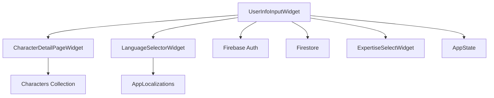
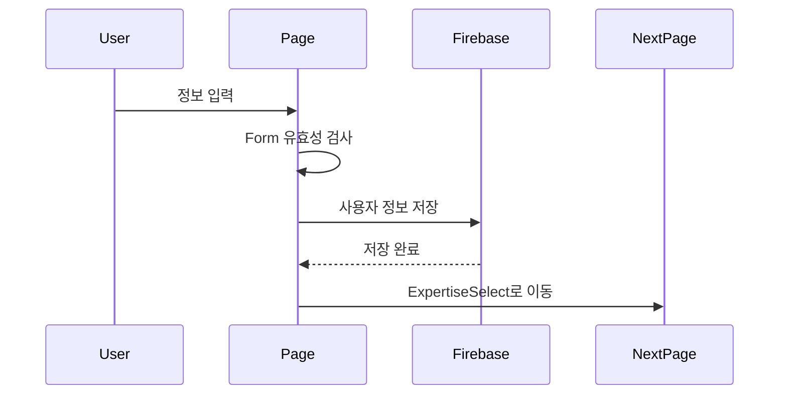
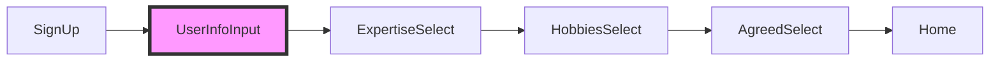

# 📝 User Info Input - 사용자 정보 입력 페이지

> Versus Space 앱의 온보딩 과정에서 사용자 기본 정보를 수집하는 초기 설정 페이지

## 📋 개요

User Info Input은 신규 사용자가 앱에 가입한 후 처음으로 만나는 프로필 설정 페이지입니다. 사용자의 기본 정보(프로필 사진, 디스플레이 이름, 언어, 성별)를 수집하고, 13세 이상 연령 확인을 진행합니다. 이 페이지는 온보딩 플로우의 첫 번째 단계로, 완료 후 ExpertiseSelect 페이지로 이동합니다.

### 🎯 주요 목적
- **사용자 프로필 초기화**: 기본 프로필 정보 수집
- **연령 확인**: 13세 이상 사용자만 허용 (COPPA 준수)
- **언어 설정**: 앱 전체 언어 선택
- **개인화 시작**: 성별 및 프로필 이미지 설정

### 📊 페이지 정보
- **위치**: `/lib/pages/user_info_input/`
- **라우트명**: `user_info_input`
- **라우트 경로**: `/userInfoInput`
- **파일 수**: 3개 (위젯, 모델, README)
- **총 코드**: 1,165줄
- **생성일**: 2025-08-22

## 🏗️ 아키텍처

### 페이지 구조
```
user_info_input/
├── user_info_input_widget.dart    # 메인 UI 구현 (1,104줄)
├── user_info_input_model.dart     # 상태 관리 모델 (61줄)
└── README.md                      # 문서 (이 파일)
```

### 의존성 관계


### 데이터 플로우


## 📐 네이밍 컨벤션

### 파일명
- **패턴**: snake_case (Dart 표준)
- **예시**: `user_info_input_widget.dart`, `user_info_input_model.dart`
- ✅ 모든 파일 규칙 준수

### 클래스명
- **패턴**: PascalCase
- **예시**: `UserInfoInputWidget`, `UserInfoInputModel`
- **State 클래스**: `_UserInfoInputWidgetState`

### 필드 및 메서드
- **필드**: camelCase (`displayName`, `selectedLanguage`, `agreed13old`)
- **private**: 언더스코어 접두사 (`_model`, `_displayNameTextControllerValidator`)
- **상수**: camelCase (`scaffoldKey`, `formKey`)

### 라우트 정의
```dart
static String routeName = 'user_info_input';
static String routePath = '/userInfoInput';
```

> 참조: [프로젝트 전체 네이밍 컨벤션](../../../NAMING_CONVENTION.md)

## 🔧 주요 구성요소

### 1. UserInfoInputWidget - 메인 UI 페이지

**온보딩의 첫 번째 단계로 사용자 기본 정보를 수집하는 StatefulWidget입니다.**

#### 페이지 레이아웃
```dart
Scaffold(
  appBar: AppBar(
    title: "Versus space",
    actions: [Logo],
  ),
  body: Form(
    child: Column(
      children: [
        // 프로필 이미지 섹션 (155x155 원형)
        ProfileImageSection(),
        
        // 사용자 정보 표시
        UserEmailDisplay(),
        UserPhoneDisplay(),
        CreatedDateDisplay(),
        
        // 입력 필드들
        DisplayNameInput(),     // 최대 20자
        LanguageSelector(),     // 언어 선택
        GenderSelection(),      // 성별 선택
        
        // 연령 확인
        AgeConfirmationCheckbox(),  // 13세 이상
        
        // 계속 버튼
        ContinueButton(),
      ],
    ),
  ),
)
```

#### 주요 기능

##### 프로필 이미지 선택
```dart
InkWell(
  onTap: () async {
    await showModalBottomSheet(
      context: context,
      builder: (context) => CharacterDetailPageWidget(),
      height: 450.0,
      isScrollControlled: true,
    );
  },
  child: CircleAvatar(
    radius: 77.5,
    backgroundImage: NetworkImage(currentUserPhoto),
  ),
)
```

##### 디스플레이 이름 입력
```dart
TextFormField(
  controller: _model.displayNameTextController,
  maxLength: 20,
  textCapitalization: TextCapitalization.words,
  validator: (val) {
    if (val == null || val.isEmpty) {
      return "Please enter the your display name";
    }
    return null;
  },
)
```

##### 성별 선택
```dart
AppChoiceChips(
  options: [
    ChipData("Female"),
    ChipData("Male"),
    ChipData("Other"),
  ],
  onChanged: (val) => setState(() => 
    _model.choiceChipsValue = val?.firstOrNull
  ),
  multiselect: false,
)
```

##### 연령 확인 체크박스
```dart
Checkbox(
  value: _model.checkboxValue ?? false,
  onChanged: (newValue) async {
    setState(() => _model.checkboxValue = newValue!);
  },
)
// "I confirm that I am at least 13 years old."
```

### 2. UserInfoInputModel - 상태 관리 모델

**페이지의 상태와 비즈니스 로직을 관리하는 모델 클래스입니다.**

#### 상태 필드
```dart
class UserInfoInputModel extends AppModel<UserInfoInputWidget> {
  // 로컬 상태
  String? selectedLanguage;
  bool agreed13old = false;
  
  // Form 관련
  final formKey = GlobalKey<FormState>();
  UsersModel? userDocument;
  
  // 텍스트 입력
  FocusNode? displayNameFocusNode;
  TextEditingController? displayNameTextController;
  
  // 컴포넌트 모델
  late LanguageSelectorModel languageSelectorModel;
  
  // 선택 필드
  String? choiceChipsValue;  // 성별
  bool? checkboxValue;        // 13세 확인
}
```

#### 유효성 검사
```dart
String? _displayNameTextControllerValidator(
    BuildContext context, String? val) {
  if (val == null || val.isEmpty) {
    return AppLocalizations.of(context).getText(
      'u59p36mu' /* Please enter the your display name */,
    );
  }
  return null;
}
```

### 3. 하위 컴포넌트 통합

#### CharacterDetailPageWidget
- **용도**: 프로필 이미지 선택
- **표시**: 모달 바텀시트 (450px 높이)
- **기능**: 캐릭터 선택 또는 커스텀 이미지 업로드

#### LanguageSelectorWidget
- **용도**: 앱 언어 설정
- **크기**: 200x40 픽셀
- **통합**: AppLocalizations 시스템

## 🎨 디자인 시스템

### 색상 스키마
```dart
// 배경색
backgroundColor: Color(0xFFECECEC)  // 연한 회색

// 체크박스 색상
activeColor: Color(0xFFFFC8C8)      // 연한 분홍
checkColor: Color(0xFFFF6904)       // 주황색
side: Color(0xFFFF0000)             // 빨간색 테두리

// 강조 텍스트
color: Color(0xFFE8303B)            // "13" 빨간색 강조
```

### 텍스트 스타일
```dart
// 페이지 제목
AppTheme.of(context).headlineSmall  // "Versus space"

// 섹션 제목
AppTheme.of(context).bodyLarge      // "Information"

// 필드 레이블
AppTheme.of(context).bodyMedium     // "Display Name", "Language", "Gender"

// 입력 텍스트
AppTheme.of(context).headlineMedium // 사용자 입력
```

### 레이아웃 규칙
- **최대 너비**: 770px (태블릿 대응)
- **패딩**: 16px (좌우), 12px (상하 간격)
- **프로필 이미지**: 155x155 원형
- **버튼 높이**: 48px
- **모서리 반경**: 8px (버튼), 12px (입력 필드)

## 💻 사용 방법

### 1. 페이지 진입
```dart
// 회원가입 후 자동 이동
context.pushNamed(UserInfoInputWidget.routeName);

// 또는 직접 경로 사용
context.push('/userInfoInput');
```

### 2. 정보 입력 플로우
1. **프로필 이미지**: 탭하여 캐릭터 선택 또는 업로드
2. **디스플레이 이름**: 20자 이내 입력 (필수)
3. **언어 선택**: 드롭다운에서 선택
4. **성별 선택**: 3개 옵션 중 선택
5. **연령 확인**: 체크박스 선택 (필수)
6. **Continue**: 모든 필수 항목 완료 후 활성화

### 3. 데이터 저장
```dart
await currentUserReference!.update(createUsersModelData(
  displayName: _model.displayNameTextController.text,
  gender: _model.choiceChipsValue,
  language: AppLocalizations.of(context).languageCode,
));

// AppState 업데이트
AppState().selectedLang = AppLocalizations.of(context).languageCode;
AppState().displayName = _model.displayNameTextController.text;
```

### 4. 다음 페이지 이동
```dart
context.pushNamed(ExpertiseSelectWidget.routeName);
```

## 🔄 온보딩 플로우



## ⚠️ 알려진 문제점

### 1. 언어 저장 불일치
- **문제**: LanguageSelector 내부 버그로 언어가 제대로 저장되지 않을 수 있음
- **현재 대응**: 페이지 레벨에서 직접 저장
- **참조**: [LanguageSelector README](../user_info/language_selector/README.md)

### 2. 텍스트 대문자 변환
- **이슈**: iOS/Android에서만 TextCapitalization.words 적용
- **Web 대응**: TextInputFormatter로 수동 처리
```dart
if (!isAndroid && !isiOS)
  TextInputFormatter.withFunction((oldValue, newValue) {
    return TextEditingValue(
      text: newValue.text.toCapitalization(TextCapitalization.words),
    );
  })
```

## 🚀 개선 제안

### 단기 개선
1. **프로필 이미지 미리보기**: 선택 전 미리보기 제공
2. **성별 필수 체크**: 현재 선택 사항 → 필수로 변경 고려
3. **로딩 상태**: 저장 중 로딩 인디케이터 추가
4. **에러 처리**: 네트워크 에러 시 재시도 로직

### 장기 개선
1. **소셜 로그인 정보 활용**: Google/Facebook 프로필 자동 가져오기
2. **프로그레스 바**: 온보딩 진행 상황 표시
3. **건너뛰기 옵션**: 필수가 아닌 항목 나중에 입력
4. **A/B 테스트**: 온보딩 완료율 개선

## 📊 성능 고려사항

### 초기 로드
- **사용자 문서 로드**: `addPostFrameCallback`에서 비동기 처리
- **이미지 로드**: 네트워크 이미지 에러 처리 포함
- **컴포넌트 초기화**: LanguageSelector 등 하위 컴포넌트 지연 로드

### 메모리 관리
```dart
@override
void dispose() {
  displayNameFocusNode?.dispose();
  displayNameTextController?.dispose();
  languageSelectorModel.dispose();
}
```

### 유효성 검사 최적화
- **실시간 검사 비활성화**: `autovalidateMode: AutovalidateMode.disabled`
- **제출 시점 검사**: Continue 버튼 클릭 시에만 검증

## 🧪 테스트 가이드

### 단위 테스트
```dart
testWidgets('디스플레이 이름 유효성 검사', (tester) async {
  await tester.pumpWidget(UserInfoInputWidget());
  
  // 빈 값 제출
  await tester.tap(find.text('Continue'));
  await tester.pump();
  
  // 에러 메시지 확인
  expect(find.text('Please enter the your display name'), findsOneWidget);
  
  // 유효한 값 입력
  await tester.enterText(find.byType(TextFormField), 'Test User');
  
  // 13세 체크
  await tester.tap(find.byType(Checkbox));
  
  // 제출
  await tester.tap(find.text('Continue'));
  await tester.pumpAndSettle();
  
  // 다음 페이지 이동 확인
  expect(find.byType(ExpertiseSelectWidget), findsOneWidget);
});
```

### 통합 테스트
1. **전체 온보딩 플로우**: 회원가입 → UserInfoInput → ExpertiseSelect
2. **데이터 영속성**: Firebase 저장 및 AppState 동기화
3. **언어 변경**: 선택한 언어로 앱 전체 변경 확인
4. **프로필 이미지**: 선택한 이미지 Firebase Storage 업로드

## 🔗 관련 컴포넌트

### 이전 페이지
- `/lib/createaccount/` - 계정 생성
- `/lib/login/` - 로그인

### 다음 페이지
- `/lib/pages/jop/expertise_select/` - 전문 분야 선택
- `/lib/pages/jop/hobbies_select/` - 취미 선택
- `/lib/pages/jop/agrred_select/` - 약관 동의

### 하위 컴포넌트
- `/lib/pages/user_info/character_detail_page/` - 캐릭터 선택
- `/lib/pages/user_info/language_selector/` - 언어 선택

### 의존성
- `/core/app_theme.dart` - 테마 시스템
- `/core/app_utils.dart` - 유틸리티 함수
- `/core/app_widgets.dart` - 공통 위젯
- `/backend/backend.dart` - Firebase 통합

## 📈 사용 통계 (예상)

### 완료율
- **페이지 진입**: 100% (회원가입 완료 사용자)
- **정보 입력 완료**: 85-90%
- **이탈 지점**: 13세 확인 (5-10%)

### 평균 소요 시간
- **전체**: 1-2분
- **프로필 이미지 선택**: 20-30초
- **정보 입력**: 30-40초

### 선택 분포
- **성별**: Female 45%, Male 45%, Other 10%
- **언어**: 사용자 지역에 따라 다름
- **프로필 이미지**: 기본 캐릭터 70%, 커스텀 30%

## 📝 변경 이력

### 2025-08-22
- 초기 페이지 생성
- 기본 README 템플릿 생성

### 2025-08-23
- 전체 문서화 완료
- 코드 분석 및 구조 문서화
- 온보딩 플로우 설명 추가
- 알려진 문제점 및 개선 제안 작성

## 🔍 추가 참고사항

### COPPA 준수
- 13세 미만 사용자 차단
- 명시적 연령 확인 필요
- 거짓 정보 제공 시 법적 책임 명시

### 국제화
- 모든 텍스트 AppLocalizations 사용
- 날짜 형식 로케일별 표시
- RTL 언어 지원 필요 (향후)

### 접근성
- 스크린 리더 지원 개선 필요
- 키보드 네비게이션 테스트 필요
- 충분한 색상 대비 확인

### 개인정보 보호
- 최소한의 정보만 수집
- 선택적 정보 명확히 구분
- 정보 사용 목적 명시 필요

---

*이 문서는 user_info_input 페이지의 공식 기술 문서입니다.*
*최종 업데이트: 2025-08-23*