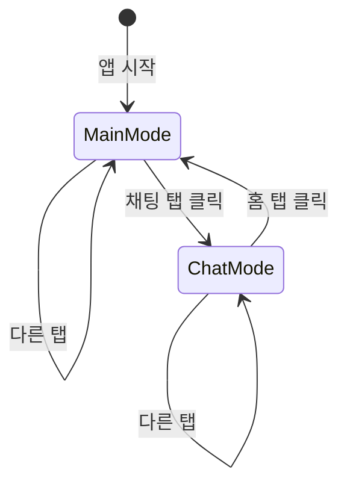

# 🔄 Providers - 상태 관리 시스템

> Versus Space 앱의 전역 상태 관리를 담당하는 Provider 패턴 구현

## 📊 모듈 메타정보

| 항목 | 상태 | 상세 |
|------|------|------|
| **모듈명** | Providers | 상태 관리 레이어 |
| **패턴** | Provider | ChangeNotifier 기반 |
| **버전** | v1.0.0 | 2025-08-23 기준 |
| **파일 수** | 1개 | NavigationProvider |
| **의존성** | provider: ^6.1.2 | Flutter 상태 관리 |

## 🎯 개요

Providers 디렉토리는 Versus Space 앱의 **전역 상태 관리**를 담당합니다. Provider 패턴을 사용하여 위젯 트리 전체에서 접근 가능한 상태를 관리하며, 불필요한 리빌드를 최소화하고 효율적인 상태 전파를 구현합니다.

### 핵심 원칙
- 🎯 **단일 책임**: 각 Provider는 하나의 도메인만 관리
- 🔄 **반응형 상태**: ChangeNotifier를 통한 자동 UI 업데이트
- 📦 **캡슐화**: 상태 로직을 위젯에서 분리
- 🚀 **성능 최적화**: 필요한 부분만 리빌드

## 📐 네이밍 컨벤션

| 구분 | 규칙 | 예시 |
|------|------|------|
| **파일명** | snake_case | `navigation_provider.dart` |
| **클래스명** | PascalCase + Provider | `NavigationProvider` |
| **메서드명** | camelCase | `setTabIndex()` |
| **변수명** | camelCase with _ prefix for private | `_mainTabIndex` |
| **enum** | PascalCase | `NavigationMode` |

> 상세 규칙은 [프로젝트 네이밍 컨벤션](../../NAMING_CONVENTION.md) 참조

## 🏗️ 아키텍처

### Provider 계층 구조
```
MultiProvider (main.dart)
├── NavigationProvider          # 네비게이션 상태
├── UserProvider (예정)          # 사용자 정보
├── PostProvider (예정)          # 게시물 상태
├── NotificationProvider (예정)  # 알림 상태
└── ThemeProvider (예정)         # 테마 설정
```

### 상태 흐름도
```mermaid
graph TD
    A[User Action] --> B[Provider Method]
    B --> C[State Update]
    C --> D[notifyListeners()]
    D --> E[Consumer Rebuild]
    E --> F[UI Update]
```

## 🔧 주요 구성요소

### 1. NavigationProvider

앱의 전체 네비게이션 상태를 관리하는 핵심 Provider입니다.

#### 클래스 구조
```dart
class NavigationProvider extends ChangeNotifier {
  // 상태 변수
  NavigationMode _mode = NavigationMode.main;
  int _mainTabIndex = 0;
  int _chatTabIndex = 0;
  
  // Getters
  NavigationMode get mode => _mode;
  int get currentTabIndex => ...;
  
  // 상태 변경 메서드
  void setMode(NavigationMode mode) { ... }
  void setTabIndex(int index) { ... }
  void navigateToRoute(String route) { ... }
}
```

#### NavigationMode Enum
```dart
enum NavigationMode {
  main,  // 기본 모드: 홈/검색/질문작성/채팅/유저
  chat,  // 채팅 모드: 채팅/친구/검색/홈
}
```

#### NavigationItem 모델
```dart
class NavigationItem {
  final String label;        // 표시 레이블
  final IconData icon;        // 기본 아이콘
  final IconData activeIcon;  // 활성 아이콘
  final String route;         // 라우트 경로
}
```

### 듀얼 모드 네비게이션 시스템

#### Main Mode (기본 모드)
| 인덱스 | 레이블 | 라우트 | 아이콘 |
|--------|--------|--------|--------|
| 0 | 홈 | `/home` | home |
| 1 | 검색 | `/search` | search |
| 2 | 질문작성 | `/inPutPostImage` | add_circle |
| 3 | 채팅 | `/chat/list` | chat_bubble |
| 4 | 유저 | `/profile` | person |

#### Chat Mode (채팅 모드)
| 인덱스 | 레이블 | 라우트 | 아이콘 |
|--------|--------|--------|--------|
| 0 | 채팅 | `/chat/list` | chat_bubble |
| 1 | 친구 | `/chat/friends` | people |
| 2 | 검색 | `/chat/search` | search |
| 3 | 홈 | `/home` | home |

### 자동 모드 전환 로직



#### 전환 규칙
1. **Main → Chat**: 메인 모드에서 인덱스 3 (채팅) 선택
2. **Chat → Main**: 채팅 모드에서 인덱스 3 (홈) 선택
3. **라우트 기반**: `/chat/*` 라우트는 자동으로 채팅 모드

## 💡 핵심 기능

### 상태 관리 메서드

#### setMode(NavigationMode mode)
네비게이션 모드를 변경합니다.
```dart
provider.setMode(NavigationMode.chat);
```

#### setTabIndex(int index)
현재 모드의 탭 인덱스를 설정하고 필요시 모드를 자동 전환합니다.
```dart
provider.setTabIndex(2); // 현재 모드의 2번 탭 선택
```

#### navigateToRoute(String route)
라우트를 분석하여 적절한 모드와 탭을 자동 설정합니다.
```dart
provider.navigateToRoute('/chat/friends'); // 채팅 모드, 친구 탭
```

#### switchToMainMode() / switchToChatMode()
편의 메서드로 빠른 모드 전환을 지원합니다.
```dart
provider.switchToMainMode();  // 메인 모드로
provider.switchToChatMode();   // 채팅 모드로
```

## 🚀 사용 예시

### 1. Provider 등록 (main.dart)
```dart
void main() {
  runApp(
    MultiProvider(
      providers: [
        ChangeNotifierProvider(create: (_) => NavigationProvider()),
        // 다른 Provider들...
      ],
      child: MyApp(),
    ),
  );
}
```

### 2. Consumer 패턴
```dart
// 상태가 변경될 때마다 리빌드
Consumer<NavigationProvider>(
  builder: (context, navigationProvider, child) {
    return BottomNavigationBar(
      currentIndex: navigationProvider.currentTabIndex,
      items: navigationProvider.currentItems.map((item) {
        return BottomNavigationBarItem(
          icon: Icon(item.icon),
          activeIcon: Icon(item.activeIcon),
          label: item.label,
        );
      }).toList(),
      onTap: navigationProvider.setTabIndex,
    );
  },
)
```

### 3. Selector 패턴
```dart
// 특정 값만 감시하여 최적화
Selector<NavigationProvider, NavigationMode>(
  selector: (_, provider) => provider.mode,
  builder: (context, mode, child) {
    return Text('현재 모드: ${mode.name}');
  },
)
```

### 4. Provider.of 직접 접근
```dart
// listen: false로 리빌드 방지
final navigationProvider = Provider.of<NavigationProvider>(
  context, 
  listen: false
);
navigationProvider.switchToChatMode();
```

### 5. context.read/watch 확장 메서드
```dart
// 읽기 전용 (리빌드 없음)
context.read<NavigationProvider>().setTabIndex(1);

// 감시 (리빌드 있음)
final mode = context.watch<NavigationProvider>().mode;
```

## 📦 상태 흐름 예시

### 시나리오 1: 채팅 진입
```dart
// 1. 사용자가 메인 화면에서 채팅 탭 클릭
// 2. NavigationProvider.setTabIndex(3) 호출
// 3. 내부 로직이 채팅 모드로 자동 전환
// 4. notifyListeners() 호출
// 5. Consumer 위젯들 리빌드
// 6. 채팅 화면 표시
```

### 시나리오 2: 딥링크 처리
```dart
// 1. 딥링크 '/chat/friends' 수신
// 2. NavigationProvider.navigateToRoute('/chat/friends') 호출
// 3. 채팅 모드로 전환 + 친구 탭 선택
// 4. UI 자동 업데이트
```

## 🔄 상태 지속성

### 현재 구현
- 메모리 기반 상태 (앱 재시작 시 초기화)
- 각 모드별 탭 인덱스 독립 유지

### 향후 개선
```dart
// SharedPreferences를 활용한 상태 저장
Future<void> saveState() async {
  final prefs = await SharedPreferences.getInstance();
  await prefs.setString('navigation_mode', _mode.name);
  await prefs.setInt('main_tab_index', _mainTabIndex);
  await prefs.setInt('chat_tab_index', _chatTabIndex);
}

// 앱 시작 시 상태 복원
Future<void> restoreState() async {
  final prefs = await SharedPreferences.getInstance();
  // 저장된 상태 복원...
}
```

## 🚧 향후 확장 계획

### 1. UserProvider (계획)
```dart
class UserProvider extends ChangeNotifier {
  UserModel? _currentUser;
  bool _isAuthenticated = false;
  
  // 사용자 정보 관리
  // 인증 상태 관리
  // 프로필 업데이트
}
```

### 2. PostProvider (계획)
```dart
class PostProvider extends ChangeNotifier {
  List<PostModel> _posts = [];
  bool _isLoading = false;
  
  // 게시물 CRUD
  // 페이지네이션
  // 캐싱 로직
}
```

### 3. NotificationProvider (계획)
```dart
class NotificationProvider extends ChangeNotifier {
  List<NotificationModel> _notifications = [];
  int _unreadCount = 0;
  
  // 알림 수신
  // 읽음 처리
  // 실시간 업데이트
}
```

### 4. ThemeProvider (계획)
```dart
class ThemeProvider extends ChangeNotifier {
  ThemeMode _themeMode = ThemeMode.system;
  Color _primaryColor = Colors.blue;
  
  // 테마 전환
  // 커스텀 색상
  // 폰트 설정
}
```

## 📊 성능 최적화

### Best Practices
1. **listen: false 사용**: 읽기만 할 때는 리빌드 방지
2. **Selector 활용**: 필요한 부분만 감시
3. **Consumer 범위 최소화**: 리빌드 영역 제한
4. **메모이제이션**: 계산 비용이 큰 값은 캐싱

### Anti-Patterns 피하기
```dart
// ❌ 나쁜 예: 전체 위젯 트리 리빌드
Consumer<NavigationProvider>(
  builder: (context, provider, child) {
    return MaterialApp(...); // 전체 앱 리빌드
  },
)

// ✅ 좋은 예: 필요한 부분만 리빌드
Consumer<NavigationProvider>(
  builder: (context, provider, child) {
    return BottomNavigationBar(...); // 네비게이션 바만 리빌드
  },
)
```

## 🐛 디버깅

### 로그 패턴
```dart
void setTabIndex(int index) {
  debugPrint('[NavigationProvider] Tab changed: $_mainTabIndex -> $index');
  // 로직...
}
```

### Provider Inspector
Flutter DevTools의 Provider 탭에서 실시간 상태 모니터링 가능

## 🧪 테스트

### 단위 테스트 예시
```dart
test('NavigationProvider mode switching', () {
  final provider = NavigationProvider();
  
  expect(provider.mode, NavigationMode.main);
  
  provider.switchToChatMode();
  expect(provider.mode, NavigationMode.chat);
  
  provider.setTabIndex(3); // 홈 선택
  expect(provider.mode, NavigationMode.main);
});
```

### 위젯 테스트 예시
```dart
testWidgets('Navigation updates on provider change', (tester) async {
  await tester.pumpWidget(
    ChangeNotifierProvider(
      create: (_) => NavigationProvider(),
      child: TestWidget(),
    ),
  );
  
  // 테스트 로직...
});
```

## 📝 변경 이력

- **2025-08-23**: 문서 전면 개편 및 확장
- **2025-07-25**: NavigationProvider 구현
- **2025-07-25**: 듀얼 모드 네비게이션 시스템 완성

---

*이 문서는 Versus Space Providers 모듈의 구조와 사용법을 설명합니다.*
*최종 업데이트: 2025-08-23*