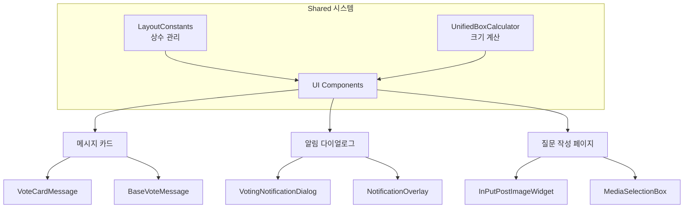
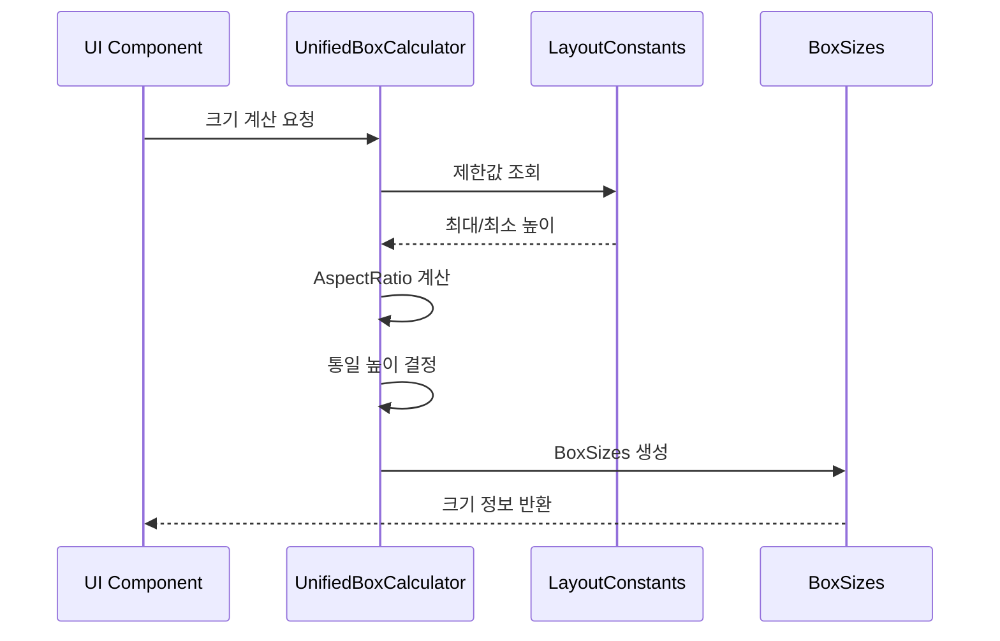

# 🔧 Shared 디렉토리
> Versus Space 애플리케이션 전반에서 공유되는 핵심 서비스와 상수 시스템

## 🎯 개요

이 디렉토리는 Versus Space 앱의 모든 컴포넌트에서 공통으로 사용되는 중앙 집중식 시스템을 포함합니다. 스마트 레이아웃 시스템의 핵심으로, A/B 박스 UI의 일관된 크기와 비율을 보장하며, 질문 작성, 알림 다이얼로그, 메시지 카드 등 모든 UI 컴포넌트에서 통일된 레이아웃을 제공합니다.

### 주요 특징
- **통합 레이아웃 시스템**: 모든 A/B 박스 컴포넌트의 크기와 비율 중앙 관리
- **AspectRatio 기반 계산**: 이미지 비율을 고려한 동적 크기 조정
- **컨테이너별 최적화**: 메시지/알림/질문별 맞춤 크기 제한
- **반응형 디자인**: 화면 크기와 레이아웃에 따른 자동 조정
- **중앙 집중식 상수 관리**: 일관된 UI/UX를 위한 상수 시스템

## 📐 네이밍 컨벤션

```dart
// 파일명: snake_case (Dart 표준)
shared/
├── constants/
│   └── layout_constants.dart
└── services/
    └── unified_box_calculator.dart

// 클래스명: PascalCase
class LayoutConstants
class UnifiedBoxCalculator
class BoxSizes

// 메서드명: lowerCamelCase
static BoxSizes calculate()
static double getMaxHeight()

// 변수명: lowerCamelCase
final double unifiedHeight;
static const double questionHorizontalMaxHeight;
```

- 참조: [NAMING_CONVENTION.md](../../NAMING_CONVENTION.md)

## 🏗️ 아키텍처

### 시스템 구조


### 데이터 플로우


## 🔧 주요 구성요소

### 1. Constants (상수 관리)
**위치**: `/lib/shared/constants/`

중앙 집중식 레이아웃 상수 관리 시스템으로, 앱 전체의 일관된 UI를 보장합니다.

#### LayoutConstants 클래스
- **목적**: 모든 레이아웃 상수를 한 곳에서 관리
- **기능**: 
  - 컨테이너별 최대/최소 높이 제공
  - 박스 너비 비율 계산
  - 간격 및 여백 표준화

#### 주요 상수 그룹
```dart
// 질문 작성 페이지
questionHorizontalMaxHeight = 500.0
questionVerticalMaxHeight = 400.0
questionSingleMaxHeight = 600.0

// 알림 다이얼로그  
notificationMaxHeightRatio = 0.8
notificationWidthRatio = 0.92

// 메시지 카드
messageHorizontalMaxHeight = 400.0
messageVerticalMaxHeight = 350.0
```

### 2. Services (서비스 레이어)
**위치**: `/lib/shared/services/`

통합 박스 크기 계산 서비스로, 모든 A/B 박스 UI의 크기를 동적으로 계산합니다.

#### UnifiedBoxCalculator 클래스
- **목적**: 모든 A/B 박스 레이아웃의 크기 중앙 관리
- **기능**:
  - AspectRatio 기반 동적 크기 계산
  - 컨테이너별 맞춤 크기 제한
  - 통일된 높이로 일관성 보장

#### 핵심 메서드
```dart
// 범용 계산
static BoxSizes calculate({...})

// 컨테이너별 전용 메서드
static BoxSizes calculateForMessageCard({...})
static BoxSizes calculateForNotificationDialog({...})
static BoxSizes calculateForQuestion({...})
```

#### BoxSizes 데이터 모델
```dart
class BoxSizes {
  final Size sizeA;           // A 박스 크기
  final Size sizeB;           // B 박스 크기
  final LayoutType layoutType; // 레이아웃 타입
  final double unifiedHeight;  // 통일 높이
  final double boxWidth;       // 박스 너비
  final double spacing;        // 간격
}
```

## 💻 사용 예시

### 메시지 카드에서 사용
```dart
import 'package:versus_space/shared/services/unified_box_calculator.dart';
import 'package:versus_space/shared/constants/layout_constants.dart';

// 크기 계산
final boxSizes = UnifiedBoxCalculator.calculateForMessageCard(
  bubbleWidth: 344.0,
  layoutType: LayoutType.horizontal,
  aspectRatioA: 1.5,
  aspectRatioB: 1.3,
);

// 상수 사용
final maxHeight = LayoutConstants.getMaxHeight(
  containerType: LayoutConstants.containerTypeMessage,
  isHorizontal: true,
);
```

### 알림 다이얼로그에서 사용
```dart
// 다이얼로그 크기 계산
final dialogWidth = MediaQuery.of(context).size.width * 
    LayoutConstants.notificationWidthRatio;

final boxSizes = UnifiedBoxCalculator.calculateForNotificationDialog(
  dialogWidth: dialogWidth,
  layoutType: LayoutType.vertical,
  aspectRatioA: imageAspectRatio,
  aspectRatioB: imageAspectRatio,
);
```

### 질문 작성 페이지에서 사용
```dart
// 박스 크기 업데이트
void updateBoxSizes() {
  final boxSizes = UnifiedBoxCalculator.calculateForQuestion(
    containerWidth: MediaQuery.of(context).size.width,
    layoutType: currentLayoutType,
    aspectRatioA: uploadedImageAspectRatioA,
    aspectRatioB: uploadedImageAspectRatioB,
  );
  
  setState(() {
    boxAHeight = boxSizes.sizeA.height;
    boxBHeight = boxSizes.sizeB.height;
  });
}
```

## 📊 크기 제한 사양

### 컨테이너별 제한값
| 컨테이너 | 레이아웃 | 최대 높이 | 최소 높이 | 박스 너비 |
|---------|----------|-----------|-----------|----------|
| **메시지 카드** | | | | |
| | 단일 | 400px | 100px | 80% |
| | 가로 | 400px | 200px | 49.5% |
| | 세로 | 171px | 100px | 95% |
| **알림 다이얼로그** | | | | |
| | 단일 | 500px | 150px | 95% |
| | 가로 | 400px | 150px | 계산값 |
| | 세로 | 171px | 100px | 95% |
| **질문 작성** | | | | |
| | 단일 | 600px | 150px | 95% |
| | 가로 | 500px | 150px | 49.5% |
| | 세로 | 400px | 120px | 95% |

## 🔄 통합 포인트

### UI 컴포넌트 통합
- **메시지 카드**: `/lib/components/chat/vote_card_message.dart`
- **알림 다이얼로그**: `/lib/components/notifications/voting_notification_dialog.dart`
- **질문 작성**: `/lib/posts/in_put_post_image/in_put_post_image_widget.dart`
- **미디어 선택**: `/lib/posts/in_put_post_image/components/media_selection_box.dart`

### 헬퍼 시스템 연동
- **AspectRatioAnalyzer**: 이미지 비율 분석 및 최적 레이아웃 결정
- **DynamicBoxCalculator**: 레거시 호환성 유지
- **VersusBoxSizeCalculator**: 알림 시스템 전용 계산기

## 📈 성능 최적화

### 캐싱 전략
```dart
// VoteCardMessage 전역 캐시
static final Map<String, BoxSizes> _boxSizesCache = {};

// 캐시 키 생성 및 활용
final cacheKey = '${message.id}_${layoutType.name}';
if (!_boxSizesCache.containsKey(cacheKey)) {
  _boxSizesCache[cacheKey] = UnifiedBoxCalculator.calculateForMessageCard(...);
}
```

### 최적화 기법
1. **컴파일 타임 최적화**: static const 상수 사용
2. **메모리 효율성**: 단일 인스턴스 유지
3. **계산 최소화**: 캐싱으로 중복 계산 방지
4. **재계산 트리거**: AspectRatio 변경 시에만

## 🎨 디자인 시스템

### 반응형 디자인
- **모바일**: 최소 320px 너비 보장
- **태블릿**: 최대 500px 너비 제한
- **화면 비율**: 다양한 화면 비율 대응

### 접근성
- 최소 크기 보장으로 터치 타겟 확보
- 적절한 간격으로 오터치 방지
- 일관된 레이아웃으로 예측 가능한 UX

## 🔍 디버깅

### 디버그 모드
```dart
if (!kReleaseMode) {
  print('[UnifiedBoxCalculator] 계산 결과:');
  print('  컨테이너: $containerType');
  print('  레이아웃: $layoutType');
  print('  통일 높이: ${unifiedHeight}px');
}
```

### 일반적인 문제 해결
1. **박스 크기 불일치**
   - 원인: AspectRatio null 또는 0
   - 해결: 기본값 사용 (boxWidth / 1.5)

2. **세로 배치 넘침**
   - 원인: 전체 높이가 컨테이너 초과
   - 해결: 자동 스케일링 적용 (88% 사용)

3. **스크롤 점프**
   - 원인: 동적 높이 변경
   - 해결: BoxSizes 캐싱 사용

## 📝 변경 이력

- **2025-08-23**: 통합 문서 작성
  - constants와 services 하위 디렉토리 문서 통합
  - 시스템 아키텍처 다이어그램 추가
  - 사용 예시 및 통합 포인트 정리
  
- **2025-08-22**: 하위 디렉토리 구조화
  - constants/ 디렉토리 생성 및 문서화
  - services/ 디렉토리 생성 및 문서화
  - 스마트 레이아웃 시스템 구축

## 🚀 향후 계획

1. **동적 테마 지원**
   - 다크/라이트 모드별 상수 분리
   - 테마별 간격 및 크기 조정

2. **태블릿 최적화**
   - 큰 화면용 별도 상수 세트
   - 멀티 컬럼 레이아웃 지원

3. **애니메이션 통합**
   - 크기 변경 애니메이션
   - 레이아웃 전환 효과

4. **성능 모니터링**
   - 계산 시간 측정
   - 캐시 히트율 추적

5. **접근성 개선**
   - 최소 터치 영역 상수
   - 고대비 모드 지원
