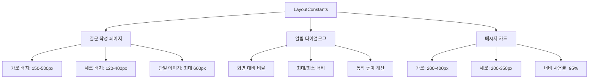

# 📐 Constants 디렉토리
> Versus Space 애플리케이션의 중앙 집중식 상수 관리 시스템

## 🎯 개요

이 디렉토리는 앱 전체에서 사용되는 레이아웃 상수와 설정값을 중앙에서 관리합니다. 스마트 레이아웃 시스템의 핵심 구성요소로, 질문 작성, 알림 다이얼로그, 메시지 카드 등 모든 UI 컴포넌트에서 일관된 크기와 비율을 보장합니다.

### 주요 특징
- **중앙 집중식 관리**: 모든 레이아웃 상수를 한 곳에서 관리
- **컨테이너별 최적화**: 질문/알림/메시지별 맞춤 설정
- **동적 계산 지원**: 화면 크기와 이미지 비율에 따른 동적 크기 계산
- **일관성 보장**: 전체 앱에서 통일된 레이아웃 규칙 적용

## 📐 네이밍 컨벤션

```dart
// 파일명: snake_case (Dart 표준)
layout_constants.dart

// 클래스명: PascalCase
class LayoutConstants

// 상수명: lowerCamelCase (static const)
static const double questionHorizontalMaxHeight = 500.0;

// 메서드명: lowerCamelCase
static double getMaxHeight()

// 문자열 상수: lowerCamelCase
static const String containerTypeQuestion = 'question';
```

- 참조: [NAMING_CONVENTION.md](../../../NAMING_CONVENTION.md)

## 🏗️ 아키텍처

### 레이아웃 상수 체계


### 컨테이너 타입별 설정
```dart
// 3가지 컨테이너 타입
- 'question'     // 질문 작성 페이지
- 'notification' // 투표 알림 다이얼로그
- 'message'      // 채팅 메시지 카드
```

## 🔧 주요 구성요소

### 1. LayoutConstants 클래스
앱 전체 레이아웃 상수를 관리하는 중앙 클래스

#### 질문 작성 페이지 상수
```dart
// 가로 배치 (2개 박스 나란히)
static const double questionHorizontalMaxHeight = 500.0;  // 최대 높이
static const double questionHorizontalMinHeight = 150.0;  // 최소 높이

// 세로 배치 (2개 박스 위아래)
static const double questionVerticalMaxHeight = 400.0;    // 최대 높이
static const double questionVerticalMinHeight = 120.0;    // 최소 높이

// 단일 이미지 (B박스 숨김)
static const double questionSingleMaxHeight = 600.0;      // 최대 높이
```

#### 알림 다이얼로그 상수
```dart
// 화면 대비 비율로 계산
static const double notificationMaxHeightRatio = 0.8;     // 화면의 80%
static const double notificationHorizontalHeightRatio = 0.9; // 가로 90%
static const double notificationVerticalHeightRatio = 0.88;  // 세로 88%
static const double notificationWidthRatio = 0.92;        // 너비 92%

// 절대값 제한
static const double notificationMaxWidth = 500.0;         // 최대 너비
static const double notificationMinWidth = 320.0;         // 최소 너비
static const double notificationMinBoxHeight = 150.0;     // 최소 높이
```

#### 메시지 카드 상수
```dart
// 가로 배치
static const double messageHorizontalMaxHeight = 400.0;   // 최대 높이
static const double messageHorizontalMinHeight = 200.0;   // 최소 높이

// 세로 배치
static const double messageVerticalMaxHeight = 350.0;     // 최대 높이
static const double messageVerticalMinHeight = 200.0;     // 최소 높이

// 너비 사용률
static const double messageWidthRatio = 0.95;            // 95% 사용
```

#### 공통 레이아웃 설정
```dart
// 박스 간 간격
static const double horizontalSpacing = 8.0;    // 가로 배치 간격
static const double verticalSpacing = 12.0;     // 세로 배치 간격

// 박스 너비 비율
static const double horizontalBoxWidthRatio = 0.495;  // 각 49.5%
static const double verticalBoxWidthRatio = 0.95;     // 95%
static const double singleBoxWidthRatio = 0.95;       // 95%

// 기본값
static const double defaultBoxHeight = 350.0;         // 기본 높이
static const double defaultAspectRatio = 1.0;         // 정사각형
```

### 2. 헬퍼 메서드

#### getMaxHeight()
컨테이너 타입과 레이아웃에 따른 최대 높이 반환
```dart
static double getMaxHeight({
  required String containerType,     // 'question', 'notification', 'message'
  required bool isHorizontal,        // 가로/세로 배치
  bool isSingle = false,             // 단일 이미지 여부
  double? screenHeight,              // 화면 높이 (알림용)
})
```

#### getMinHeight()
컨테이너 타입과 레이아웃에 따른 최소 높이 반환
```dart
static double getMinHeight({
  required String containerType,
  required bool isHorizontal,
  bool isSingle = false,
})
```

#### getWidthRatio()
컨테이너 타입별 너비 사용률 반환
```dart
static double getWidthRatio({
  required String containerType,
  required bool isHorizontal,
  required bool isSingle,
})
```

#### getSpacing()
레이아웃별 박스 간격 반환
```dart
static double getSpacing(bool isHorizontal)
```

#### getBoxWidthRatio()
개별 박스의 너비 비율 반환
```dart
static double getBoxWidthRatio({
  required bool isHorizontal,
  required bool isSingle,
})
```

## 💻 사용 예시

### 질문 작성 페이지에서 사용
```dart
import 'package:versus_space/shared/constants/layout_constants.dart';

// 최대 높이 가져오기
final maxHeight = LayoutConstants.getMaxHeight(
  containerType: LayoutConstants.containerTypeQuestion,
  isHorizontal: true,
  isSingle: false,
);

// 박스 간격 가져오기
final spacing = LayoutConstants.getSpacing(true);

// 박스 너비 비율
final boxWidth = containerWidth * LayoutConstants.getBoxWidthRatio(
  isHorizontal: true,
  isSingle: false,
);
```

### 알림 다이얼로그에서 사용
```dart
// 화면 크기 기반 높이 계산
final dialogHeight = LayoutConstants.getMaxHeight(
  containerType: LayoutConstants.containerTypeNotification,
  isHorizontal: layoutType == 'horizontal',
  screenHeight: MediaQuery.of(context).size.height,
);

// 다이얼로그 너비
final dialogWidth = MediaQuery.of(context).size.width * 
    LayoutConstants.notificationWidthRatio;
```

### 메시지 카드에서 사용
```dart
// 메시지 카드 크기 설정
final cardHeight = LayoutConstants.getMaxHeight(
  containerType: LayoutConstants.containerTypeMessage,
  isHorizontal: isHorizontalLayout,
);

final cardWidth = availableWidth * LayoutConstants.messageWidthRatio;
```

## 🔄 통합 포인트

### 1. 스마트 레이아웃 시스템
- `/lib/posts/in_put_post_image/helpers/` - 박스 크기 계산
- `/lib/components/notifications/` - 알림 다이얼로그 레이아웃
- `/lib/components/chat/` - 메시지 카드 크기 설정

### 2. 동적 크기 계산
- `VersusBoxSizeCalculator` - 박스 크기 동적 계산
- `DynamicBoxCalculator` - 이미지 비율 기반 크기 조정
- `AspectRatioAnalyzer` - 최적 레이아웃 결정

### 3. UI 일관성
- 모든 컴포넌트에서 동일한 상수 사용
- 한 곳에서 수정하면 전체 앱에 반영
- 디자인 시스템과의 통합

## 📊 성능 최적화

### 상수 사용의 이점
1. **컴파일 타임 최적화**: static const로 선언된 값들은 컴파일 시점에 결정
2. **메모리 효율성**: 단일 인스턴스만 메모리에 유지
3. **계산 최소화**: 반복적인 계산 대신 미리 정의된 값 사용
4. **유지보수성**: 중앙 관리로 일관성 유지 및 쉬운 수정

### 최적화 전략
```dart
// ❌ 나쁜 예: 매번 계산
double getHeight() {
  return MediaQuery.of(context).size.height * 0.8;
}

// ✅ 좋은 예: 상수 활용
double getHeight(double screenHeight) {
  return screenHeight * LayoutConstants.notificationMaxHeightRatio;
}
```

## 🎨 디자인 시스템 연동

### 반응형 디자인
- **모바일**: 최소 320px 너비 보장
- **태블릿**: 최대 500px 너비 제한
- **화면 비율**: 다양한 화면 비율에 대응

### 접근성
- 최소 크기 보장으로 터치 타겟 확보
- 적절한 간격으로 오터치 방지
- 일관된 레이아웃으로 예측 가능한 UX

## 🔍 디버깅

### 레이아웃 디버그 모드
```dart
// 디버그 정보 출력
if (kDebugMode) {
  print('Container Type: $containerType');
  print('Max Height: ${LayoutConstants.getMaxHeight(...)}');
  print('Min Height: ${LayoutConstants.getMinHeight(...)}');
  print('Width Ratio: ${LayoutConstants.getWidthRatio(...)}');
}
```

### 일반적인 문제 해결
1. **박스 크기 이상**: 컨테이너 타입 확인
2. **간격 문제**: isHorizontal 플래그 확인
3. **화면 넘침**: 최대/최소 높이 제한 확인

## 📝 변경 이력

- **2025-08-22**: 초기 문서 작성
  - LayoutConstants 클래스 상세 문서화
  - 사용 예시 및 통합 포인트 추가
  - 성능 최적화 가이드라인 작성

## 🚀 향후 계획

1. **동적 테마 지원**
   - 다크/라이트 모드별 상수 분리
   - 테마별 간격 및 크기 조정

2. **태블릿 최적화**
   - 큰 화면용 별도 상수 세트
   - 멀티 컬럼 레이아웃 지원

3. **애니메이션 상수**
   - 레이아웃 전환 애니메이션 duration
   - 이징 커브 표준화

4. **접근성 개선**
   - 최소 터치 영역 상수
   - 고대비 모드 지원