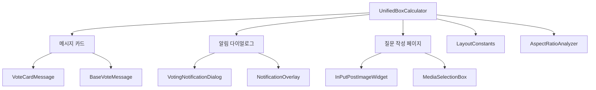
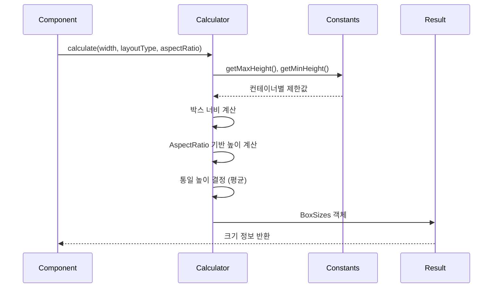

# 📦 Shared Services 디렉토리
> Versus Space 애플리케이션 전반에서 공유되는 핵심 서비스 레이어

## 🎯 개요

이 디렉토리는 앱의 여러 컴포넌트에서 공통으로 사용되는 중앙 집중식 서비스들을 포함합니다. 스마트 레이아웃 시스템의 핵심 계산 로직을 담당하며, 질문 작성, 알림 다이얼로그, 메시지 카드 등 모든 A/B 박스 UI에서 일관된 크기와 비율을 보장합니다.

### 주요 특징
- **통합 박스 계산**: 모든 컴포넌트에서 일관된 박스 크기 계산
- **AspectRatio 기반**: 이미지 비율을 고려한 동적 크기 조정
- **컨테이너별 최적화**: 메시지/알림/질문별 맞춤 크기 제한
- **반응형 디자인**: 화면 크기와 레이아웃에 따른 자동 조정

## 📐 네이밍 컨벤션

```dart
// 파일명: snake_case (Dart 표준)
unified_box_calculator.dart

// 클래스명: PascalCase
class UnifiedBoxCalculator
class BoxSizes

// 메서드명: lowerCamelCase
static BoxSizes calculate()
static BoxSizes calculateForMessageCard()

// 변수명: lowerCamelCase
final double unifiedHeight;
final LayoutType layoutType;
```

- 참조: [NAMING_CONVENTION.md](../../../NAMING_CONVENTION.md)

## 🏗️ 아키텍처

### 서비스 계층 구조


### 계산 플로우


## 🔧 주요 구성요소

### 1. UnifiedBoxCalculator 클래스
모든 A/B 박스 레이아웃의 크기를 중앙에서 관리하는 핵심 서비스

#### 핵심 계산 원칙
```dart
// 1. 너비는 컨테이너가 허용하는 최대값 사용
// 2. 높이는 aspectRatio 기반으로 계산 후 평균값 사용
// 3. 각 컨테이너별 고유 제한값 존중
```

#### 주요 메서드

##### calculate() - 범용 계산 메서드
```dart
static BoxSizes calculate({
  required double containerWidth,      // 컨테이너 너비
  double? containerHeight,             // 컨테이너 높이 (선택)
  required String containerType,       // 'message', 'notification', 'question'
  required LayoutType layoutType,      // horizontal, vertical, single
  double? aspectRatioA,               // A 박스 이미지 비율
  double? aspectRatioB,               // B 박스 이미지 비율
  bool hasImageA = true,              // A 박스 이미지 유무
  bool hasImageB = true,              // B 박스 이미지 유무
})
```

##### calculateForMessageCard() - 메시지 카드 전용
```dart
static BoxSizes calculateForMessageCard({
  required double bubbleWidth,        // 채팅 버블 너비
  required LayoutType layoutType,     // 레이아웃 타입
  double? aspectRatioA,
  double? aspectRatioB,
  bool hasImageA = true,
  bool hasImageB = true,
})
```

##### calculateForNotificationDialog() - 알림 다이얼로그 전용
```dart
static BoxSizes calculateForNotificationDialog({
  required double dialogWidth,        // 다이얼로그 너비
  required LayoutType layoutType,
  double? aspectRatioA,
  double? aspectRatioB,
  bool hasImageA = true,
  bool hasImageB = true,
})
```

##### calculateForQuestion() - 질문 작성 페이지 전용
```dart
static BoxSizes calculateForQuestion({
  required double containerWidth,     // 컨테이너 너비
  required LayoutType layoutType,
  double? aspectRatioA,
  double? aspectRatioB,
  bool hasImageA = true,
  bool hasImageB = true,
})
```

### 2. BoxSizes 클래스
박스 크기 계산 결과를 담는 데이터 모델

```dart
class BoxSizes {
  final Size sizeA;              // A 박스 크기 (너비 x 높이)
  final Size sizeB;              // B 박스 크기 (너비 x 높이)
  final LayoutType layoutType;   // 레이아웃 타입
  final String containerType;    // 컨테이너 타입
  final double spacing;          // 박스 간 간격
  final double unifiedHeight;    // 통일된 높이
  final double boxWidth;         // 개별 박스 너비
  
  // 헬퍼 메서드
  bool get isHorizontal;        // 가로 배치 여부
  bool get isVertical;          // 세로 배치 여부  
  bool get isSingle;            // 단일 이미지 여부
  Size get containerSize;       // 전체 컨테이너 크기
  bool get hasUnifiedSize;      // 두 박스 크기 동일 여부
}
```

## 💻 사용 예시

### 메시지 카드에서 사용
```dart
import 'package:versus_space/shared/services/unified_box_calculator.dart';

// 채팅 메시지 카드 크기 계산
final boxSizes = UnifiedBoxCalculator.calculateForMessageCard(
  bubbleWidth: 344.0,
  layoutType: LayoutType.horizontal,
  aspectRatioA: 1.5,  // 가로가 세로의 1.5배
  aspectRatioB: 1.3,
  hasImageA: true,
  hasImageB: true,
);

// 계산된 크기 사용
Container(
  width: boxSizes.sizeA.width,
  height: boxSizes.sizeA.height,
  child: Image.network(imageUrlA),
);
```

### 알림 다이얼로그에서 사용
```dart
// 다이얼로그 내부 박스 크기 계산
final dialogWidth = MediaQuery.of(context).size.width * 0.92;

final boxSizes = UnifiedBoxCalculator.calculateForNotificationDialog(
  dialogWidth: dialogWidth,
  layoutType: LayoutType.vertical,
  aspectRatioA: aspectRatioFromPost,
  aspectRatioB: aspectRatioFromPost,
);

// 세로 배치 다이얼로그 구성
Column(
  children: [
    Container(
      width: boxSizes.sizeA.width,
      height: boxSizes.sizeA.height,
      child: OptionAContent(),
    ),
    SizedBox(height: boxSizes.spacing),
    Container(
      width: boxSizes.sizeB.width,
      height: boxSizes.sizeB.height,
      child: OptionBContent(),
    ),
  ],
);
```

### 질문 작성 페이지에서 사용
```dart
// 이미지 선택 후 박스 크기 업데이트
void updateBoxSizes() {
  final boxSizes = UnifiedBoxCalculator.calculateForQuestion(
    containerWidth: MediaQuery.of(context).size.width,
    layoutType: currentLayoutType,
    aspectRatioA: uploadedImageAspectRatioA,
    aspectRatioB: uploadedImageAspectRatioB,
    hasImageA: imageUrlA != null,
    hasImageB: imageUrlB != null,
  );
  
  setState(() {
    boxAHeight = boxSizes.sizeA.height;
    boxBHeight = boxSizes.sizeB.height;
  });
}
```

## 📊 크기 제한 사양

### 메시지 카드 (VoteCardMessage)
| 레이아웃 | 최대 높이 | 최소 높이 | 박스 너비 |
|---------|-----------|-----------|-----------|
| **단일** | 400px | 100px | 버블의 80% |
| **가로** | 400px | 200px | (버블-간격)의 49.5% |
| **세로** | 171px (각) | 100px | 버블의 95% |
| **세로 전체** | 350px | - | - |

### 알림 다이얼로그
| 레이아웃 | 최대 높이 | 최소 높이 | 박스 너비 |
|---------|-----------|-----------|-----------|
| **단일** | 500px | 150px | 다이얼로그의 95% |
| **가로** | 400px | 150px | (다이얼로그-간격-여백)/2 |
| **세로** | 171px (각) | 100px | 다이얼로그의 95% |
| **세로 전체** | 350px | - | - |

### 질문 작성 페이지
| 레이아웃 | 최대 높이 | 최소 높이 | 박스 너비 |
|---------|-----------|-----------|-----------|
| **단일** | 600px | 150px | 컨테이너의 95% |
| **가로** | 500px | 150px | (컨테이너-간격)의 49.5% |
| **세로** | 400px | 120px | 컨테이너의 95% |

## 🎨 레이아웃 타입

### LayoutType 열거형
```dart
enum LayoutType {
  horizontal,  // 가로 배치 (A | B)
  vertical,    // 세로 배치 (A 위, B 아래)
  single,      // 단일 이미지
}
```

### 레이아웃 결정 로직
1. **단일 이미지**: B박스 숨김 또는 이미지 하나만 있음
2. **가로 배치**: 기본값 또는 가로형 이미지들
3. **세로 배치**: 세로형 이미지들 또는 사용자 선택

## 🔄 통합 포인트

### 1. 메시지 카드 시스템
- `/lib/components/chat/vote_card_message.dart` - 전역 BoxSizes 캐시
- `/lib/components/chat/base_vote_message.dart` - 기본 메시지 레이아웃

### 2. 알림 시스템
- `/lib/components/notifications/widgets/voting_notification_dialog.dart`
- `/lib/components/notifications/notification_overlay.dart`

### 3. 질문 작성 시스템
- `/lib/posts/in_put_post_image/in_put_post_image_widget.dart`
- `/lib/posts/in_put_post_image/components/media_selection_box.dart`

### 4. 상수 시스템
- `/lib/shared/constants/layout_constants.dart` - 크기 제한값
- `/lib/posts/in_put_post_image/helpers/aspect_ratio_analyzer.dart` - 비율 분석

## 📈 성능 최적화

### 캐싱 전략
```dart
// VoteCardMessage에서 전역 캐시 사용
static final Map<String, BoxSizes> _boxSizesCache = {};

// 캐시 키 생성
final cacheKey = '${message.id}_${layoutType.name}';

// 캐시 확인 및 저장
if (!_boxSizesCache.containsKey(cacheKey)) {
  _boxSizesCache[cacheKey] = UnifiedBoxCalculator.calculateForMessageCard(...);
}
```

### 재계산 최소화
- AspectRatio 변경 시에만 재계산
- 레이아웃 타입 변경 시에만 재계산
- 이미지 추가/삭제 시에만 재계산

### 디버그 모드
```dart
// 개발 환경에서만 로그 출력
if (!kReleaseMode) {
  print('[UnifiedBoxCalculator] 계산 결과:');
  print('  통일 높이: ${unifiedHeight}px');
}
```

## 🔍 디버깅

### 일반적인 문제 해결

#### 1. 박스 크기 불일치
- **원인**: AspectRatio null 또는 0
- **해결**: 기본값 사용 (boxWidth / 1.5)

#### 2. 세로 배치 넘침
- **원인**: 전체 높이가 컨테이너 초과
- **해결**: 자동 스케일링 적용 (88% 사용)

#### 3. 스크롤 점프
- **원인**: 동적 높이 변경
- **해결**: BoxSizes 캐싱 사용

### 디버그 출력 예시
```
[UnifiedBoxCalculator] 메시지 카드 계산:
  버블 너비: 344.0px
  레이아웃: horizontal
  박스 너비: 168.0px
  최대 높이: 400.0px
  계산된 높이 A: 112.0px
  계산된 높이 B: 129.2px
  통일 높이: 120.6px
```

## 📝 변경 이력

- **2025-08-23**: 한국어 문서 작성
  - UnifiedBoxCalculator 상세 문서화
  - BoxSizes 데이터 구조 설명
  - 사용 예시 및 통합 포인트 추가
  - 성능 최적화 가이드라인 작성

## 🚀 향후 계획

1. **동적 스케일링 개선**
   - 태블릿 화면 대응
   - 가로/세로 모드 전환 최적화

2. **캐싱 시스템 고도화**
   - LRU 캐시 구현
   - 메모리 관리 개선

3. **애니메이션 지원**
   - 크기 변경 애니메이션
   - 레이아웃 전환 효과

4. **성능 모니터링**
   - 계산 시간 측정
   - 캐시 히트율 추적