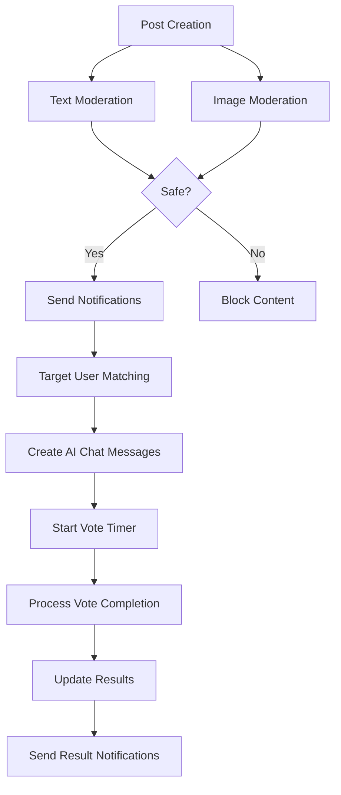

# 📦 Firebase Functions 서비스 레이어

> Versus Space 프로젝트의 핵심 비즈니스 로직과 외부 API 통합을 담당하는 서비스 계층

## 📋 목차
- [개요](#개요)
- [아키텍처](#아키텍처)
- [네이밍 컨벤션](#네이밍-컨벤션)
- [주요 구성요소](#주요-구성요소)
  - [AI 채팅 서비스](#1-ai-채팅-서비스-aichatservicejs)
  - [투표 관리 서비스](#2-투표-관리-서비스-votemanagementjs)
  - [이미지 검열 서비스](#3-이미지-검열-서비스-imagemoderationjs)
  - [텍스트 검열 서비스](#4-텍스트-검열-서비스-textmoderationjs)
  - [알림 서비스](#5-알림-서비스-notificationservicejs)
- [서비스 상호작용](#서비스-상호작용)
- [코드 예시](#코드-예시)
- [환경 설정](#환경-설정)
- [에러 처리](#에러-처리)
- [성능 최적화](#성능-최적화)
- [변경 이력](#변경-이력)
- [테스트 가이드](#테스트-가이드)

## 개요

Firebase Functions 서비스 레이어는 Versus Space 앱의 핵심 비즈니스 로직을 모듈화하여 관리합니다. 각 서비스는 단일 책임 원칙(SRP)을 따르며, 재사용 가능하고 테스트 가능한 형태로 구현되어 있습니다.

### 🎯 핵심 기능
- **AI 기반 스마트 기능**: 사용자 매칭, 콘텐츠 검열, 투표 예측
- **실시간 처리**: 투표 상태 동기화, 알림 전송, 채팅 메시지 관리
- **안전성 보장**: 다층 콘텐츠 검열, 유해 콘텐츠 자동 차단
- **성능 최적화**: 배치 처리, 병렬 실행, 캐싱 전략

## 아키텍처

```
┌─────────────────────────────────────────────────────────────┐
│                     Firebase Functions                       │
├─────────────────────────────────────────────────────────────┤
│                      Services Layer                          │
│  ┌──────────────┐  ┌──────────────┐  ┌──────────────┐      │
│  │ AI Chat      │  │ Vote Mgmt    │  │ Notification │      │
│  │ Service      │  │ Service      │  │ Service      │      │
│  └──────────────┘  └──────────────┘  └──────────────┘      │
│  ┌──────────────┐  ┌──────────────┐                        │
│  │ Image        │  │ Text         │                        │
│  │ Moderation   │  │ Moderation   │                        │
│  └──────────────┘  └──────────────┘                        │
├─────────────────────────────────────────────────────────────┤
│                    External APIs                             │
│  ┌──────────────┐  ┌──────────────┐  ┌──────────────┐      │
│  │ Vision API   │  │ Perspective  │  │ Gemini AI    │      │
│  └──────────────┘  │ API          │  └──────────────┘      │
│                    └──────────────┘                         │
└─────────────────────────────────────────────────────────────┘
```

## 네이밍 컨벤션

본 디렉토리는 프로젝트 전체 네이밍 컨벤션을 준수합니다:

### ✅ CamelCase 사용
- **변수명**: `userId`, `postData`, `voteResults`
- **함수명**: `createVoteRequestMessage()`, `processVoteCompletion()`
- **Firestore 필드**: `votesA`, `votesB`, `voteEndTime`
- **상수**: `AI_ASSISTANT_ID`, `PERSPECTIVE_API_KEY`

### ✅ Snake_case 사용
- **파일명**: `ai_chat_service.js` (권장), 현재는 camelCase 사용 중
- **특수 ID**: `ai_assistant_userId` (채팅방 ID 형식)

## 주요 구성요소

### 1. AI 채팅 서비스 (aiChatService.js)

AI 피클과의 1:1 채팅방 관리 및 투표 카드 메시지 처리를 담당합니다.

#### 📍 주요 기능
- **채팅방 ID 생성**: 일관된 형식으로 AI 채팅방 ID 생성
- **투표 요청 메시지**: 타겟 사용자에게 투표 요청 메시지 생성
- **투표 생성 메시지**: 작성자에게 투표 생성 확인 메시지 전송
- **투표 결과 업데이트**: 투표 완료 시 모든 참여자 메시지 상태 업데이트

#### 🔧 핵심 함수

```javascript
// AI 채팅방 ID 생성 (버그 수정 완료)
function getAIChatId(userId) {
  // 이전 버그: sort()로 인한 ID 불일치
  // return [AI_ASSISTANT_ID, userId].sort().join('_');
  
  // 수정된 코드: 고정 형식 사용
  return `${AI_ASSISTANT_ID}_${userId}`;
}

// 투표 요청 메시지 생성
async function createVoteRequestMessage(userId, postId, postData) {
  const chatId = getAIChatId(userId);
  const messageId = uuidv4();
  
  const messageData = {
    messageId: messageId,
    senderId: AI_ASSISTANT_ID,
    receiverId: userId,
    messageType: 'voteRequest',
    votePostId: postId,
    voteTitle: postData.questionTitle || '',
    voteOptionAText: postData.optionA || '',
    voteOptionBText: postData.optionB || '',
    voteOptionAImages: postData.imageUrlsA || null,
    voteOptionBImages: postData.imageUrlsB || null,
    voteAspectRatioA: postData.aspectRatioA || null,
    voteAspectRatioB: postData.aspectRatioB || null,
    cardStatus: 'votingRequest',
    voteEndTime: admin.firestore.Timestamp.fromDate(
      new Date(Date.now() + 10 * 60 * 1000) // 10분 타이머
    ),
    userVotes: {}
  };
  
  // 채팅방 생성 또는 업데이트
  // 메시지 저장
  // 메시지 ID 반환
}
```

### 2. 투표 관리 서비스 (voteManagement.js)

투표 완료 처리 및 표시 숫자 증폭 알고리즘을 구현합니다.

#### 📍 주요 기능
- **투표 완료 처리**: 10분 타이머 완료 시 자동 처리
- **참여자 상태 업데이트**: 모든 참여자 알림 및 메시지 상태 변경
- **투표 증폭 알고리즘**: 실제 투표와 AI 예측 결합
- **배치 처리**: Firestore 작업 최적화

#### 🔧 핵심 알고리즘

```javascript
// 투표 증폭 알고리즘 - 실제 투표와 AI 예측 결합
function calculateDisplayVotes(actualVotes, targetCount, expectedRatio = { A: 0.5, B: 0.5 }) {
  const actualTotal = (actualVotes.A || 0) + (actualVotes.B || 0);
  
  // 투표가 없는 경우: AI 예상 비율 사용
  if (actualTotal === 0) {
    return addRandomVariation({
      A: Math.round(targetCount * expectedRatio.A),
      B: Math.round(targetCount * expectedRatio.B)
    }, targetCount);
  }
  
  // 가중치 계산 - 실제 투표수에 따라 동적 조정
  let weight;
  if (actualTotal <= 5) {
    weight = 0.2 + (actualTotal * 0.06); // 20-50% 실제 비율
  } else if (actualTotal <= 20) {
    weight = 0.5 + ((actualTotal - 5) * 0.02); // 50-80% 실제 비율
  } else if (actualTotal <= 50) {
    weight = 0.8 + ((actualTotal - 20) * 0.003); // 80-90% 실제 비율
  } else {
    weight = 0.9; // 90% 실제 비율
  }
  
  // 실제 비율과 AI 예측 결합
  const actualRatioA = actualVotes.A / actualTotal;
  const actualRatioB = actualVotes.B / actualTotal;
  
  const finalRatioA = (actualRatioA * weight) + (expectedRatio.A * (1 - weight));
  const finalRatioB = (actualRatioB * weight) + (expectedRatio.B * (1 - weight));
  
  return addRandomVariation({
    A: Math.round(targetCount * finalRatioA),
    B: Math.round(targetCount * finalRatioB)
  }, targetCount);
}

// 배치 처리 프로세서
async function processBatch(items, processor, batchSize = 500) {
  const db = admin.firestore();
  const results = [];
  
  for (let i = 0; i < items.length; i += batchSize) {
    const batch = db.batch();
    const batchItems = items.slice(i, i + batchSize);
    
    for (const item of batchItems) {
      await processor(batch, item);
    }
    
    try {
      await batch.commit();
      results.push({
        success: true,
        processed: batchItems.length,
        startIndex: i
      });
    } catch (error) {
      console.error(`[배치 처리] 오류 at index ${i}:`, error);
      results.push({
        success: false,
        processed: 0,
        startIndex: i,
        error: error.message
      });
    }
  }
  
  return results;
}
```

### 3. 이미지 검열 서비스 (imageModeration.js)

Google Cloud Vision API를 활용한 이미지 안전성 검사를 수행합니다.

#### 📍 주요 기능
- **SafeSearch 검출**: 성인물, 폭력, 선정적 콘텐츠 감지
- **OCR 텍스트 추출**: 이미지 내 텍스트 추출 및 검열
- **다층 검증**: Vision API + Perspective API 결합
- **자동 삭제**: 부적절한 이미지 모든 버전 삭제

#### 🔧 구현 예시

```javascript
async function checkImageContent(imageContent) {
  try {
    console.log('[이미지 검열] 이미지 검사 시작');
    
    // Vision API로 SafeSearch 검출
    const [result] = await visionClient.safeSearchDetection({
      image: { content: imageContent }
    });
    
    const detections = result.safeSearchAnnotation;
    
    // OCR로 텍스트 추출 및 검열
    let textDetected = '';
    let isTextInappropriate = false;
    
    try {
      const [textResult] = await visionClient.textDetection({
        image: { content: imageContent },
        imageContext: {
          languageHints: ['ko', 'en']  // 한국어와 영어 지원
        }
      });
      
      if (textResult.textAnnotations && textResult.textAnnotations.length > 0) {
        textDetected = textResult.textAnnotations[0].description || '';
        
        // Perspective API로 텍스트 검열
        const textCheckResult = await checkTextWithPerspective(textDetected);
        isTextInappropriate = textCheckResult.isInappropriate;
      }
    } catch (ocrError) {
      console.error('[이미지 검열] OCR 처리 중 오류:', ocrError);
    }
    
    // 부적절한 콘텐츠 판단 기준
    const isImageInappropriate = 
      detections.adult === "VERY_LIKELY" || 
      detections.adult === "LIKELY" ||
      detections.violence === "VERY_LIKELY" ||
      detections.violence === "LIKELY" ||
      detections.racy === "VERY_LIKELY";
    
    return {
      isAppropriate: !(isImageInappropriate || isTextInappropriate),
      reason: determineReason(detections, isTextInappropriate),
      hasText: textDetected.length > 0,
      detections: detections,
      textDetected: textDetected
    };
    
  } catch (error) {
    console.error('[이미지 검열] 오류:', error);
    throw error;
  }
}

// 모든 버전의 이미지 삭제
async function deleteAllImageVersions(bucket, filePath) {
  const baseFileName = filePath.replace(/_original\.|_display\.|_thumb\./, '.');
  const versions = ['_original', '_display', '_thumb'];
  const extensions = ['.jpg', '.jpeg', '.png', '.gif', '.webp'];
  
  for (const version of versions) {
    for (const ext of extensions) {
      if (baseFileName.endsWith(ext)) {
        const versionPath = baseFileName.replace(ext, `${version}${ext}`);
        try {
          await bucket.file(versionPath).delete();
          console.log(`[이미지 검열] 삭제됨: ${versionPath}`);
        } catch (deleteError) {
          // 파일이 없는 경우는 무시
        }
      }
    }
  }
}
```

### 4. 텍스트 검열 서비스 (textModeration.js)

Google Perspective API를 활용한 텍스트 유해성 검사를 수행합니다.

#### 📍 주요 기능
- **다국어 지원**: 한국어, 영어 자동 감지 및 처리
- **다차원 분석**: 독성, 모욕, 위협, 혐오 표현 등 감지
- **임계값 기반 판단**: 속성별 커스텀 임계값 설정
- **폴백 메커니즘**: API 실패 시 기본 필터 적용

#### 🔧 언어 분석 및 검열

```javascript
// 텍스트 언어 분석
function analyzeTextLanguage(text) {
  const koreanChars = (text.match(/[ㄱ-ㅎ|ㅏ-ㅣ|가-힣]/g) || []).length;
  const englishChars = (text.match(/[a-zA-Z]/g) || []).length;
  const totalChars = text.length;
  
  return {
    hasKorean: koreanChars > 0,
    hasEnglish: englishChars > 0,
    koreanRatio: koreanChars / totalChars,
    englishRatio: englishChars / totalChars,
    primaryLanguage: koreanChars > englishChars ? 'ko' : 'en'
  };
}

// Perspective API로 텍스트 검열
async function checkTextWithPerspective(text) {
  if (!PERSPECTIVE_API_KEY) {
    console.warn('[텍스트 검열] API 키 없음');
    return { isInappropriate: false, reason: '' };
  }
  
  if (!text || text.trim().length < 3) {
    return { isInappropriate: false, reason: '' };
  }
  
  // 언어 분석
  const langInfo = analyzeTextLanguage(text);
  
  // 속성 설정 (언어별 최적화)
  const requestedAttributes = {
    TOXICITY: {},
    SEVERE_TOXICITY: {},
    IDENTITY_ATTACK: {},
    INSULT: {},
    PROFANITY: {},
    THREAT: {}
  };
  
  // 영어 텍스트일 때만 성적 콘텐츠 검사 추가
  if (!langInfo.hasKorean || langInfo.englishRatio > 0.8) {
    requestedAttributes.SEXUALLY_EXPLICIT = {};
  }
  
  const languages = langInfo.hasKorean ? ['ko'] : ['en'];
  
  try {
    const response = await axios.post(
      `${PERSPECTIVE_API_URL}?key=${PERSPECTIVE_API_KEY}`,
      {
        comment: { text: text },
        requestedAttributes: requestedAttributes,
        languages: languages
      }
    );
    
    // 점수 임계값 기반 판단
    const scores = response.data.attributeScores;
    const thresholds = {
      SEVERE_TOXICITY: 0.5,
      TOXICITY: 0.6,
      IDENTITY_ATTACK: 0.7,
      INSULT: 0.5,
      PROFANITY: 0.5,
      THREAT: 0.7,
      SEXUALLY_EXPLICIT: 0.7
    };
    
    // 부적절한 콘텐츠 감지
    for (const [attribute, threshold] of Object.entries(thresholds)) {
      if (scores[attribute] && scores[attribute].summaryScore.value >= threshold) {
        const reasonMap = {
          SEVERE_TOXICITY: '심각한 유해 콘텐츠',
          TOXICITY: '유해한 콘텐츠',
          IDENTITY_ATTACK: '혐오 표현',
          INSULT: '모욕적 표현',
          PROFANITY: '욕설',
          THREAT: '위협적 표현',
          SEXUALLY_EXPLICIT: '성적 콘텐츠'
        };
        
        return { 
          isInappropriate: true, 
          reason: reasonMap[attribute] || '부적절한 텍스트' 
        };
      }
    }
    
    return { isInappropriate: false, reason: '' };
    
  } catch (error) {
    console.error('[텍스트 검열] API 오류:', error);
    // 폴백: 기본 필터 적용
    return checkTextWithBasicFilter(text);
  }
}
```

### 5. 알림 서비스 (notificationService.js)

AI 기반 스마트 알림 전송 시스템을 구현합니다.

#### 📍 주요 기능
- **타겟 사용자 매칭**: AI가 콘텐츠와 사용자 프로필 분석
- **다양한 타겟 모드**: quick(AI), public(랜덤), custom(조건)
- **작성자 필터링**: 게시물 작성자 자동 제외
- **알림 생성**: 풍부한 알림 콘텐츠 생성

#### 🔧 스마트 알림 전송

```javascript
async function sendSmartNotifications(postId, postData) {
  const results = {
    success: false,
    notificationsSent: 0,
    errors: [],
    matchedUsers: 0
  };
  
  try {
    // targetAudience 확인
    if (!postData.targetAudience) {
      console.log('[알림 서비스] targetAudience 없음');
      return results;
    }
    
    const { type, targetCount = 100 } = postData.targetAudience;
    
    // 지원하는 타겟 타입 확인
    if (!['quick', 'public', 'custom'].includes(type)) {
      console.log(`[알림 서비스] 지원하지 않는 타입: ${type}`);
      return results;
    }
    
    // 타겟 사용자 매칭 (AI 또는 조건 기반)
    const matchedUsers = await matchTargetUsers(postData.targetAudience, postData);
    
    // 작성자 제외 필터링
    const creatorId = postData.uid || postData.userid;
    const filteredUsers = matchedUsers.filter(user => {
      const isCreator = user.id === creatorId;
      if (isCreator) {
        console.log(`[알림 서비스] 작성자 제외: ${user.id}`);
      }
      return !isCreator;
    });
    
    results.matchedUsers = filteredUsers.length;
    
    if (filteredUsers.length === 0) {
      console.log('[알림 서비스] 매칭된 사용자 없음');
      return results;
    }
    
    console.log(`[알림 서비스] ${filteredUsers.length}명 매칭됨`);
    
    // 알림 생성
    await createNotificationsForUsers(filteredUsers, postId, postData);
    
    results.success = true;
    results.notificationsSent = filteredUsers.length;
    
    return results;
    
  } catch (error) {
    console.error('[알림 서비스] 오류:', error);
    results.errors.push(error.message);
    throw error;
  }
}
```

## 서비스 상호작용

서비스들은 다음과 같이 상호작용합니다:



## 코드 예시

### 통합 사용 예시

```javascript
// 게시물 생성 시 전체 플로우
async function handlePostCreation(postId, postData) {
  try {
    // 1. 텍스트 검열
    const textResult = await checkTextWithPerspective(postData.questionTitle);
    if (textResult.isInappropriate) {
      throw new Error(`텍스트 검열 실패: ${textResult.reason}`);
    }
    
    // 2. 이미지 검열 (있는 경우)
    if (postData.imageUrlA) {
      const imageResult = await checkImageContent(postData.imageUrlA);
      if (!imageResult.isAppropriate) {
        throw new Error(`이미지 검열 실패: ${imageResult.reason}`);
      }
    }
    
    // 3. 스마트 알림 전송
    const notificationResult = await sendSmartNotifications(postId, postData);
    console.log(`알림 전송: ${notificationResult.notificationsSent}명`);
    
    // 4. AI 채팅 메시지 생성
    for (const userId of notificationResult.matchedUserIds) {
      await createVoteRequestMessage(userId, postId, postData);
    }
    
    // 5. 작성자에게 확인 메시지
    await createVoteCreatedMessage(postData.uid, postId, postData);
    
    return {
      success: true,
      notificationsSent: notificationResult.notificationsSent
    };
    
  } catch (error) {
    console.error('게시물 생성 오류:', error);
    throw error;
  }
}

// 투표 완료 처리
async function handleVoteCompletion(postId) {
  try {
    // 투표 결과 계산
    const voteResults = await calculateVoteResults(postId);
    
    // 표시용 숫자 증폭
    const displayVotes = calculateDisplayVotes(
      { A: voteResults.votesA, B: voteResults.votesB },
      voteResults.targetCount,
      voteResults.expectedRatio
    );
    
    // 모든 참여자 업데이트
    await processVoteCompletion(postId, {
      ...voteResults,
      displayVotesA: displayVotes.A,
      displayVotesB: displayVotes.B
    });
    
    // AI 채팅 메시지 업데이트
    await updateAllVoteMessages(postId, voteResults);
    
    return { success: true };
    
  } catch (error) {
    console.error('투표 완료 처리 오류:', error);
    throw error;
  }
}
```

## 환경 설정

### 필수 환경 변수

```bash
# Google Cloud APIs
PERSPECTIVE_API_KEY=your_perspective_api_key

# Firebase (자동 구성)
# FIREBASE_PROJECT_ID
# FIREBASE_DATABASE_URL
# FIREBASE_STORAGE_BUCKET
```

### 권한 설정

```javascript
// Vision API 권한
// - Cloud Vision API 활성화 필요
// - 서비스 계정에 Vision API 사용자 역할 필요

// Firestore 권한
// - 읽기/쓰기 권한 필요한 컬렉션:
//   - users, posts, notifications, chats, messages
```

## 에러 처리

### 일관된 에러 처리 패턴

```javascript
// 표준 에러 처리 템플릿
async function serviceFunction(params) {
  try {
    // 전제 조건 검증
    if (!params.required) {
      console.warn('[서비스명] 필수 파라미터 누락');
      return defaultResponse();
    }
    
    // 메인 로직
    const result = await mainLogic(params);
    
    // 성공 로깅
    console.log('[서비스명] 성공:', result.summary);
    
    return result;
    
  } catch (error) {
    // 에러 로깅
    console.error('[서비스명] 오류:', error);
    
    // 폴백 처리
    if (error.code === 'EXTERNAL_API_ERROR') {
      return fallbackLogic(params);
    }
    
    // 에러 전파
    throw error;
  }
}
```

### 우아한 실패 처리 (Graceful Degradation)

- **텍스트 검열 실패**: 기본 필터 적용
- **이미지 검열 실패**: 수동 검토 큐에 추가
- **알림 전송 실패**: 재시도 큐에 추가
- **AI 매칭 실패**: 랜덤 선택으로 폴백

## 성능 최적화

### 1. 배치 처리 전략

```javascript
// Firestore 배치 제한 준수 (500개)
const BATCH_SIZE = 500;

async function batchProcess(items) {
  const batches = [];
  
  for (let i = 0; i < items.length; i += BATCH_SIZE) {
    const batch = items.slice(i, i + BATCH_SIZE);
    batches.push(processBatch(batch));
  }
  
  return Promise.all(batches);
}
```

### 2. 병렬 처리 최적화

```javascript
// 독립적인 작업 병렬 실행
async function parallelProcess(postData) {
  const [textResult, imageResult, userMatching] = await Promise.all([
    checkTextWithPerspective(postData.text),
    checkImageContent(postData.image),
    matchTargetUsers(postData.targetAudience)
  ]);
  
  return { textResult, imageResult, userMatching };
}
```

### 3. 캐싱 전략

```javascript
// 메모리 캐싱 (5분 TTL)
const cache = new Map();
const CACHE_TTL = 5 * 60 * 1000; // 5분

function getCached(key) {
  const cached = cache.get(key);
  if (cached && Date.now() - cached.timestamp < CACHE_TTL) {
    return cached.value;
  }
  cache.delete(key);
  return null;
}

function setCached(key, value) {
  cache.set(key, {
    value,
    timestamp: Date.now()
  });
}
```

## 변경 이력

### 2025-08-03: AI 채팅방 ID 생성 버그 수정
- **문제**: JavaScript `sort()` 함수가 대소문자를 구분하여 일관되지 않은 채팅방 ID 생성
  ```javascript
  // 버그가 있던 코드
  ['ai_assistant', 'User123'].sort() // ['User123', 'ai_assistant']
  ['ai_assistant', 'user456'].sort() // ['ai_assistant', 'user456']
  ```
- **해결**: 고정된 형식 `ai_assistant_userId` 사용
- **영향**: 모든 AI 채팅 관련 기능 정상화
- **파일**: `aiChatService.js`

### 2025-08-13: 투표 증폭 알고리즘 개선
- **개선**: 실제 투표수에 따른 동적 가중치 조정
- **효과**: 더 자연스러운 투표 결과 표시
- **파일**: `voteManagement.js`

### 2025-08-17: 배치 처리 최적화
- **개선**: Firestore 배치 제한 준수 및 에러 처리 강화
- **효과**: 대량 데이터 처리 안정성 향상
- **파일**: `voteManagement.js`

### 2025-08-21: CamelCase 네이밍 컨벤션 적용
- **변경**: 모든 필드명 snake_case → camelCase 변환
- **영향**: 전체 서비스 파일 업데이트
- **호환성**: Backward compatibility 제거

## 테스트 가이드

### 단위 테스트

```javascript
// 텍스트 검열 테스트
describe('Text Moderation Service', () => {
  test('should detect toxic content', async () => {
    const result = await checkTextWithPerspective('욕설이 포함된 텍스트');
    expect(result.isInappropriate).toBe(true);
    expect(result.reason).toBe('욕설');
  });
  
  test('should handle API failure gracefully', async () => {
    // API 키 임시 제거
    const originalKey = process.env.PERSPECTIVE_API_KEY;
    delete process.env.PERSPECTIVE_API_KEY;
    
    const result = await checkTextWithPerspective('테스트 텍스트');
    expect(result.isInappropriate).toBe(false);
    
    // API 키 복원
    process.env.PERSPECTIVE_API_KEY = originalKey;
  });
});
```

### 통합 테스트

```javascript
// 전체 플로우 테스트
describe('Post Creation Flow', () => {
  test('should complete full flow successfully', async () => {
    const postData = {
      questionTitle: '어떤 것이 더 좋을까요?',
      optionA: '옵션 A',
      optionB: '옵션 B',
      targetAudience: {
        type: 'quick',
        targetCount: 50
      }
    };
    
    const result = await handlePostCreation('test-post-id', postData);
    
    expect(result.success).toBe(true);
    expect(result.notificationsSent).toBeGreaterThan(0);
  });
});
```

### 성능 테스트

```javascript
// 배치 처리 성능 테스트
describe('Batch Processing Performance', () => {
  test('should handle 1000 items within 60 seconds', async () => {
    const items = Array(1000).fill(null).map((_, i) => ({
      id: `item-${i}`,
      data: `data-${i}`
    }));
    
    const startTime = Date.now();
    const results = await processBatch(items, batchProcessor);
    const duration = Date.now() - startTime;
    
    expect(duration).toBeLessThan(60000);
    expect(results.every(r => r.success)).toBe(true);
  });
});
```

## 모니터링 및 로깅

### 로그 레벨 가이드

```javascript
// 에러 - 즉시 조치 필요
console.error('[서비스명] Critical error:', error);

// 경고 - 주의 필요
console.warn('[서비스명] API key missing');

// 정보 - 일반 작업
console.log('[서비스명] Processing started');

// 디버그 - 개발 중에만
if (process.env.NODE_ENV === 'development') {
  console.debug('[서비스명] Debug info:', debugData);
}
```

### 성능 메트릭

- **응답 시간**: 각 서비스 함수 실행 시간 측정
- **처리량**: 초당 처리 가능한 요청 수
- **에러율**: 전체 요청 대비 실패 비율
- **API 사용량**: 외부 API 호출 횟수 및 비용

## 보안 고려사항

### API 키 관리
- 환경 변수로 관리
- Firebase Functions 구성으로 보호
- 키 로테이션 정기 실행

### 데이터 보호
- PII 로깅 금지
- 민감 정보 마스킹
- HTTPS 전용 통신

### 접근 제어
- 서비스 계정 최소 권한 원칙
- Firestore Security Rules 적용
- 함수 호출 인증 검증

---

*마지막 업데이트: 2025-08-21*
*작성자: Versus Space 개발팀*