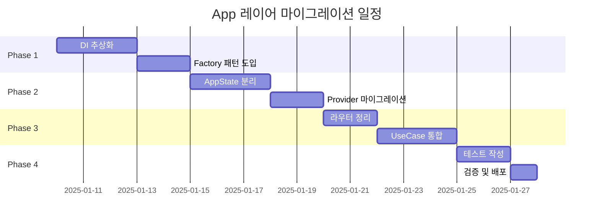

# 📱 App 레이어 연동 가이드

> 최종 업데이트: 2025-01-09 | 버전: 1.0.0
> 
> App 레이어와 Feature 모듈 간의 Clean Architecture 기반 연동 가이드

## 📋 목차

1. [현재 상황 분석](#현재-상황-분석)
2. [아키텍처 위반 사항](#아키텍처-위반-사항)
3. [마이그레이션 전략](#마이그레이션-전략)
4. [단계별 구현 가이드](#단계별-구현-가이드)
5. [DI 설정 가이드](#di-설정-가이드)
6. [상태 관리 가이드](#상태-관리-가이드)
7. [라우팅 통합 가이드](#라우팅-통합-가이드)
8. [검증 및 테스트](#검증-및-테스트)

## 현재 상황 분석

### 🚨 Critical Issues (2025-01-09)

App 레이어가 Clean Architecture 원칙을 심각하게 위반하고 있습니다:

```
현재 의존성 흐름 (❌ 잘못됨):
App → Data (직접 접근)
App → Firebase (직접 호출)
App → Feature Adapters (구체 구현체)

올바른 의존성 흐름 (✅):
App → Domain (인터페이스)
App → UseCase (비즈니스 로직)
App → Abstract Services (추상화)
```

### 📊 위반 통계

| 위반 유형 | 건수 | 심각도 |
|---------|------|--------|
| App→Data 직접 접근 | 10건 | 🔴 Critical |
| 구체 구현체 DI | 7건 | 🔴 Critical |
| Firebase 직접 호출 | 3건 | 🔴 Critical |
| 거대 AppState | 554줄 | 🟡 High |
| Core 역방향 의존성 | 4건 | 🟡 High |

## 아키텍처 위반 사항

### 1. DI 모듈의 구체 구현체 직접 참조

#### 현재 코드 (❌)
```dart
// app/di/notification_module.dart
import '../../features/notifications/data/repositories/notification_repository_impl.dart';
import '../../features/notifications/data/adapters/notification_service.dart';

void registerNotificationModule() {
  // ❌ 구체 구현체 직접 등록
  sl.registerLazySingleton<NotificationRepositoryImpl>(
    () => NotificationRepositoryImpl(),
  );
  
  // ❌ Data 레이어 서비스 직접 사용
  sl.registerLazySingleton<NotificationService>(
    () => NotificationService.instance,
  );
}
```

#### 문제점
- App이 Data 레이어 구현 세부사항을 알고 있음
- 테스트 시 Mock 주입 불가능
- Feature 모듈 변경 시 App 레이어도 수정 필요

### 2. AppState의 도메인 로직 혼재

#### 현재 코드 (❌)
```dart
// app/state/app_state.dart
class AppState extends ChangeNotifier {
  // ❌ 알림 도메인 로직
  List<NotificationsModel> _activeNotifications = [];
  
  // ❌ 미디어 업로드 비즈니스 로직
  Future<void> uploadImages() async {
    // Firebase Storage 직접 호출
    final ref = FirebaseStorage.instance.ref();
    // ...
  }
  
  // ❌ 투표 상태 관리
  Map<String, VoteState> _voteStates = {};
}
```

### 3. 라우터에서 비즈니스 로직 처리

#### 현재 코드 (❌)
```dart
// app/app.dart
GoRoute(
  path: '/notifications',
  builder: (context, state) {
    // ❌ 라우터에서 Firebase 직접 호출
    FirebaseFirestore.instance
      .collection('users')
      .doc(userId)
      .update({'lastActive': FieldValue.serverTimestamp()});
    
    return NotificationsPage();
  },
)
```

## 마이그레이션 전략

### 🎯 목표

1. **의존성 역전**: App → Domain 인터페이스만 의존
2. **관심사 분리**: DI, 라우팅, 상태관리 책임 분리
3. **테스트 가능성**: Mock 주입 가능한 구조
4. **모듈 독립성**: Feature 변경이 App에 영향 없도록

### 📅 타임라인



## 단계별 구현 가이드

### Phase 1: DI 추상화 (3-5일)

#### Step 1.1: Repository Factory 생성

```dart
// app/di/factories/repository_factory.dart
abstract class RepositoryFactory {
  INotificationRepository createNotificationRepository();
  IAuthRepository createAuthRepository();
  IPostRepository createPostRepository();
  // ... 기타 Repository
}

// app/di/factories/repository_factory_impl.dart
class RepositoryFactoryImpl implements RepositoryFactory {
  @override
  INotificationRepository createNotificationRepository() {
    // 구현체는 여기서만 import
    return NotificationRepositoryImpl(
      firestore: sl<FirebaseFirestore>(),
      storage: sl<FirebaseStorage>(),
    );
  }
}
```

#### Step 1.2: DI 모듈 리팩토링

```dart
// app/di/notification_module.dart (수정 후 ✅)
import '../../features/notifications/domain/repositories/i_notification_repository.dart';
import '../../features/notifications/domain/usecases/get_notifications_usecase.dart';
import '../factories/repository_factory.dart';

void registerNotificationModule() {
  // ✅ 인터페이스로 등록
  sl.registerLazySingleton<INotificationRepository>(
    () => sl<RepositoryFactory>().createNotificationRepository(),
  );
  
  // ✅ UseCase 등록
  sl.registerLazySingleton<GetNotificationsUseCase>(
    () => GetNotificationsUseCase(
      repository: sl<INotificationRepository>(),
    ),
  );
  
  // ✅ Provider 등록
  sl.registerFactory<NotificationProvider>(
    () => NotificationProvider(
      getNotifications: sl<GetNotificationsUseCase>(),
      markAsRead: sl<MarkAsReadUseCase>(),
    ),
  );
}
```

#### Step 1.3: Service Locator 통합

```dart
// app/di/service_locator.dart
import 'package:get_it/get_it.dart';

final sl = GetIt.instance;

class ServiceLocator {
  static Future<void> init() async {
    // Core 모듈
    await _registerCore();
    
    // Factory 등록
    sl.registerLazySingleton<RepositoryFactory>(
      () => RepositoryFactoryImpl(),
    );
    
    // Feature 모듈 등록
    registerAuthModule();
    registerNotificationModule();
    registerPostModule();
    registerChatModule();
    registerVotingModule();
    registerProfileModule();
    registerSearchModule();
  }
  
  static Future<void> _registerCore() async {
    // Firebase
    sl.registerLazySingleton(() => FirebaseFirestore.instance);
    sl.registerLazySingleton(() => FirebaseAuth.instance);
    sl.registerLazySingleton(() => FirebaseStorage.instance);
    
    // 공통 서비스
    sl.registerLazySingleton<CacheService>(() => CacheServiceImpl());
    sl.registerLazySingleton<LoggerService>(() => LoggerServiceImpl());
  }
}
```

### Phase 2: AppState 분리 (3-5일)

#### Step 2.1: 도메인별 State 분리

```dart
// app/state/ui_state.dart
class UIState extends ChangeNotifier {
  String _selectedLanguage = 'ko';
  ThemeMode _themeMode = ThemeMode.system;
  bool _isLoading = false;
  
  // UI 전용 상태만 관리
  String get selectedLanguage => _selectedLanguage;
  ThemeMode get themeMode => _themeMode;
  bool get isLoading => _isLoading;
  
  void setLanguage(String lang) {
    _selectedLanguage = lang;
    notifyListeners();
  }
}

// features/notifications/presentation/state/notification_state.dart
class NotificationState extends ChangeNotifier {
  final GetNotificationsUseCase _getNotifications;
  final MarkAsReadUseCase _markAsRead;
  
  List<Notification> _notifications = [];
  bool _isLoading = false;
  
  NotificationState({
    required GetNotificationsUseCase getNotifications,
    required MarkAsReadUseCase markAsRead,
  }) : _getNotifications = getNotifications,
       _markAsRead = markAsRead;
  
  Future<void> loadNotifications() async {
    _isLoading = true;
    notifyListeners();
    
    final result = await _getNotifications();
    result.fold(
      (failure) => _handleError(failure),
      (notifications) => _setNotifications(notifications),
    );
    
    _isLoading = false;
    notifyListeners();
  }
}
```

#### Step 2.2: Provider 통합

```dart
// app/app.dart
class MyApp extends StatelessWidget {
  @override
  Widget build(BuildContext context) {
    return MultiProvider(
      providers: [
        // UI State (App 레이어)
        ChangeNotifierProvider(create: (_) => sl<UIState>()),
        
        // Feature States (각 Feature에서 관리)
        ChangeNotifierProvider(create: (_) => sl<NotificationState>()),
        ChangeNotifierProvider(create: (_) => sl<PostState>()),
        ChangeNotifierProvider(create: (_) => sl<ChatState>()),
        ChangeNotifierProvider(create: (_) => sl<VotingState>()),
      ],
      child: MaterialApp.router(
        routerConfig: AppRouter.router,
      ),
    );
  }
}
```

### Phase 3: 라우터 정리 (2-3일)

#### Step 3.1: 라우터 추상화

```dart
// app/router/app_router.dart
class AppRouter {
  static final GoRouter router = GoRouter(
    routes: [
      // Feature 라우트 통합
      ...AuthRoutes.routes,
      ...NotificationRoutes.routes,
      ...PostRoutes.routes,
      ...ChatRoutes.routes,
    ],
    redirect: (context, state) => _handleRedirect(context, state),
    observers: [AppRouteObserver()],
  );
  
  static String? _handleRedirect(BuildContext context, GoRouterState state) {
    // 인증 체크 (UseCase 사용)
    final authState = context.read<AuthState>();
    if (!authState.isAuthenticated && !_isPublicRoute(state.location)) {
      return '/login';
    }
    return null;
  }
}
```

#### Step 3.2: Feature 라우트 모듈

```dart
// features/notifications/presentation/routes/notification_routes.dart
class NotificationRoutes {
  static List<RouteBase> routes = [
    GoRoute(
      path: '/notifications',
      name: 'notifications',
      builder: (context, state) => const NotificationsPage(),
      routes: [
        GoRoute(
          path: 'detail/:id',
          name: 'notification-detail',
          builder: (context, state) {
            final id = state.pathParameters['id']!;
            return NotificationDetailPage(notificationId: id);
          },
        ),
      ],
    ),
  ];
}
```

#### Step 3.3: Route Observer

```dart
// app/router/observers/app_route_observer.dart
class AppRouteObserver extends NavigatorObserver {
  final IAnalyticsService _analytics;
  final IUserPresenceService _presence;
  
  AppRouteObserver({
    required IAnalyticsService analytics,
    required IUserPresenceService presence,
  }) : _analytics = analytics,
       _presence = presence;
  
  @override
  void didPush(Route<dynamic> route, Route<dynamic>? previousRoute) {
    super.didPush(route, previousRoute);
    
    // UseCase를 통한 비즈니스 로직 처리
    if (route.settings.name != null) {
      _analytics.logScreenView(route.settings.name!);
      _presence.updateLastActive();
    }
  }
}
```

### Phase 4: UseCase 통합 (3-5일)

#### Step 4.1: App 레벨 UseCase

```dart
// app/domain/usecases/initialize_app_usecase.dart
class InitializeAppUseCase {
  final IAuthRepository _authRepository;
  final ICacheService _cacheService;
  final IConfigService _configService;
  
  InitializeAppUseCase({
    required IAuthRepository authRepository,
    required ICacheService cacheService,
    required IConfigService configService,
  }) : _authRepository = authRepository,
       _cacheService = cacheService,
       _configService = configService;
  
  Future<Result<void>> call() async {
    try {
      // 1. 캐시 초기화
      await _cacheService.initialize();
      
      // 2. 설정 로드
      await _configService.load();
      
      // 3. 자동 로그인 체크
      final user = await _authRepository.getCurrentUser();
      if (user != null) {
        await _authRepository.refreshToken();
      }
      
      return Result.success(null);
    } catch (e) {
      return Result.failure(AppInitializationFailure(e.toString()));
    }
  }
}
```

#### Step 4.2: main.dart 통합

```dart
// main.dart
void main() async {
  WidgetsFlutterBinding.ensureInitialized();
  
  // Firebase 초기화
  await Firebase.initializeApp();
  
  // DI 초기화
  await ServiceLocator.init();
  
  // App 초기화 UseCase 실행
  final initializeApp = sl<InitializeAppUseCase>();
  final result = await initializeApp();
  
  result.fold(
    (failure) => _handleInitError(failure),
    (_) => runApp(MyApp()),
  );
}

void _handleInitError(Failure failure) {
  // 에러 처리
  runApp(ErrorApp(message: failure.message));
}
```

## DI 설정 가이드

### 의존성 주입 원칙

1. **인터페이스 우선**: 항상 추상 인터페이스를 주입
2. **Factory 패턴**: 구체 구현체는 Factory에서만 생성
3. **생명주기 관리**: Singleton vs Factory 적절히 구분
4. **테스트 지원**: Mock 주입 가능한 구조

### DI 구조

```
app/di/
├── service_locator.dart      # GetIt 인스턴스
├── factories/                # 구체 구현체 생성
│   ├── repository_factory.dart
│   ├── service_factory.dart
│   └── usecase_factory.dart
└── modules/                  # Feature별 DI 모듈
    ├── auth_module.dart
    ├── notification_module.dart
    └── ...
```

### Mock 주입 예시

```dart
// test/helpers/test_injection.dart
void setupTestDI() {
  // Mock Repository 주입
  sl.registerLazySingleton<INotificationRepository>(
    () => MockNotificationRepository(),
  );
  
  // Real UseCase with Mock Repository
  sl.registerLazySingleton<GetNotificationsUseCase>(
    () => GetNotificationsUseCase(
      repository: sl<INotificationRepository>(),
    ),
  );
}
```

## 상태 관리 가이드

### 상태 분류

| 상태 유형 | 위치 | 예시 |
|---------|------|-----|
| UI 상태 | app/state/ui_state.dart | 테마, 언어, 로딩 |
| 도메인 상태 | features/*/presentation/state | 알림, 포스트, 채팅 |
| 임시 상태 | Widget State | 폼 입력, 애니메이션 |

### Provider 계층 구조

```dart
MyApp (Root)
├── UIState (App 전역)
├── AuthState (인증)
└── Feature States
    ├── NotificationState
    ├── PostState
    └── ChatState
```

### 상태 접근 패턴

```dart
// 읽기
final notifications = context.watch<NotificationState>().notifications;

// 액션 실행
context.read<NotificationState>().loadNotifications();

// Consumer 패턴
Consumer<NotificationState>(
  builder: (context, state, child) {
    if (state.isLoading) return LoadingWidget();
    return NotificationList(notifications: state.notifications);
  },
)
```

## 라우팅 통합 가이드

### 라우트 구성

```dart
// app/router/routes.dart
abstract class Routes {
  // Auth
  static const login = '/login';
  static const register = '/register';
  
  // Main
  static const home = '/';
  static const notifications = '/notifications';
  static const posts = '/posts';
  
  // Dynamic
  static String notificationDetail(String id) => '/notifications/$id';
  static String postDetail(String id) => '/posts/$id';
}
```

### Deep Link 처리

```dart
// app/router/deep_link_handler.dart
class DeepLinkHandler {
  final GoRouter _router;
  
  void handleDeepLink(Uri uri) {
    switch (uri.pathSegments.first) {
      case 'notification':
        _router.go(Routes.notificationDetail(uri.pathSegments[1]));
        break;
      case 'post':
        _router.go(Routes.postDetail(uri.pathSegments[1]));
        break;
      default:
        _router.go(Routes.home);
    }
  }
}
```

### Route Guard

```dart
// app/router/guards/auth_guard.dart
class AuthGuard {
  final IAuthService _authService;
  
  String? redirect(BuildContext context, GoRouterState state) {
    final isAuthenticated = _authService.isAuthenticated;
    final isAuthRoute = state.location.startsWith('/auth');
    
    if (!isAuthenticated && !isAuthRoute) {
      return '/login?redirect=${state.location}';
    }
    
    if (isAuthenticated && isAuthRoute) {
      return '/';
    }
    
    return null;
  }
}
```

## 검증 및 테스트

### 체크리스트

#### DI 검증
- [ ] 모든 Repository가 인터페이스로 주입되는가?
- [ ] Factory 패턴이 올바르게 구현되었는가?
- [ ] Mock 주입이 가능한가?
- [ ] 순환 의존성이 없는가?

#### 상태 관리 검증
- [ ] AppState가 UI 상태만 관리하는가?
- [ ] Feature별 State가 독립적인가?
- [ ] Provider 계층이 명확한가?
- [ ] 메모리 누수가 없는가?

#### 라우팅 검증
- [ ] 비즈니스 로직이 라우터에서 제거되었는가?
- [ ] Deep Link가 정상 작동하는가?
- [ ] Route Guard가 올바르게 동작하는가?
- [ ] 네비게이션 스택이 올바른가?

### 통합 테스트

```dart
// test/integration/app_integration_test.dart
void main() {
  group('App Integration', () {
    setUp(() async {
      await ServiceLocator.init();
    });
    
    testWidgets('앱 초기화 및 라우팅', (tester) async {
      await tester.pumpWidget(MyApp());
      
      // 초기 화면 확인
      expect(find.byType(LoginPage), findsOneWidget);
      
      // 로그인
      final authState = tester.state<AuthState>(find.byType(MyApp));
      await authState.signIn('test@test.com', 'password');
      await tester.pumpAndSettle();
      
      // 홈 화면 이동 확인
      expect(find.byType(HomePage), findsOneWidget);
      
      // 알림 화면 네비게이션
      await tester.tap(find.text('알림'));
      await tester.pumpAndSettle();
      
      expect(find.byType(NotificationsPage), findsOneWidget);
    });
    
    test('DI 컨테이너 검증', () {
      // Repository 인터페이스 확인
      expect(sl<INotificationRepository>(), isA<INotificationRepository>());
      expect(sl<INotificationRepository>(), isNot(isA<NotificationRepositoryImpl>()));
      
      // UseCase 주입 확인
      expect(sl<GetNotificationsUseCase>(), isNotNull);
      
      // Provider 주입 확인
      expect(sl<NotificationState>(), isNotNull);
    });
  });
}
```

### 성능 테스트

```dart
// test/performance/app_performance_test.dart
void main() {
  test('앱 초기화 성능', () async {
    final stopwatch = Stopwatch()..start();
    
    await ServiceLocator.init();
    final initializeApp = sl<InitializeAppUseCase>();
    await initializeApp();
    
    stopwatch.stop();
    
    // 초기화 시간이 2초 이내여야 함
    expect(stopwatch.elapsedMilliseconds, lessThan(2000));
  });
  
  test('라우팅 성능', () async {
    final router = AppRouter.router;
    final stopwatch = Stopwatch()..start();
    
    // 100개 라우트 네비게이션
    for (int i = 0; i < 100; i++) {
      router.go('/notifications');
      router.go('/posts');
      router.go('/');
    }
    
    stopwatch.stop();
    
    // 평균 10ms 이내
    expect(stopwatch.elapsedMilliseconds / 300, lessThan(10));
  });
}
```

## 마이그레이션 체크포인트

### Phase 1 완료 조건
- [ ] 모든 DI 모듈이 인터페이스만 참조
- [ ] Repository Factory 구현 완료
- [ ] 구체 구현체 import 제거

### Phase 2 완료 조건
- [ ] AppState 554줄 → 100줄 이하로 축소
- [ ] Feature별 State 분리 완료
- [ ] Provider 계층 구조 확립

### Phase 3 완료 조건
- [ ] 라우터에서 Firebase 직접 호출 제거
- [ ] Feature 라우트 모듈화 완료
- [ ] Route Observer 구현

### Phase 4 완료 조건
- [ ] App 초기화 UseCase 구현
- [ ] 모든 비즈니스 로직 UseCase로 이동
- [ ] 통합 테스트 통과

## 트러블슈팅

### 순환 의존성 에러

```dart
// 문제
class ServiceA {
  final ServiceB b;
  ServiceA(this.b);
}

class ServiceB {
  final ServiceA a;
  ServiceB(this.a);
}

// 해결
class ServiceA {
  ServiceB get b => sl<ServiceB>();
}
```

### Provider 업데이트 안됨

```dart
// 문제
state.notifications = newList;  // 참조만 변경

// 해결
state._notifications = newList;
notifyListeners();  // 명시적 알림
```

### Mock 주입 실패

```dart
// 문제
sl.registerLazySingleton<Service>(() => ServiceImpl());
// 테스트에서 Mock 주입 시도 -> 에러

// 해결
if (sl.isRegistered<Service>()) {
  sl.unregister<Service>();
}
sl.registerLazySingleton<Service>(() => MockService());
```

## 다음 단계

1. **통합 가이드 업데이트**: 전체 레이어 통합 문서 작성
2. **CI/CD 파이프라인**: 자동 검증 시스템 구축
3. **모니터링**: 런타임 의존성 검증 도구 도입
4. **문서화**: API 문서 및 개발 가이드 작성

---

*이 가이드는 Clean Architecture 원칙에 따라 App 레이어를 올바르게 구성하는 방법을 제시합니다.*
*질문이나 이슈는 GitHub Issues에 등록해주세요.*