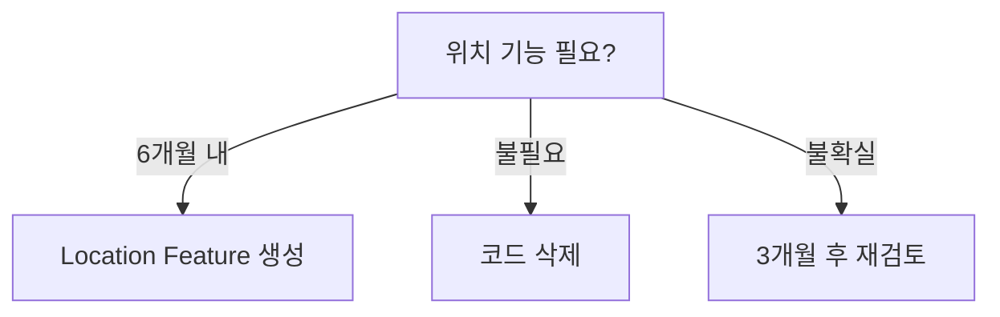

# 📐 App 레이어 마이그레이션 통합 규칙 문서

> Feature-First Architecture 적용을 위한 통합 마이그레이션 규칙과 순서  
> 작성일: 2025-08-28 | 총 예상 기간: 4주

## 🎯 마이그레이션 핵심 목표

### 1. 아키텍처 목표
- **레이어 분리**: App/Features/Core/Backend/Services 명확한 경계
- **Feature 독립성**: 각 Feature가 독립적으로 개발/테스트 가능
- **의존성 주입**: GetIt 기반 DI 시스템으로 중앙화
- **테스트 가능성**: 80% 이상 테스트 커버리지 달성

### 2. 코드 품질 목표
- **파일 크기**: 단일 파일 최대 200줄 이하
- **순환 의존성**: 0개
- **미사용 코드**: 완전 제거
- **타입 안전성**: 100% 타입 안전성 보장

## 🛡️ 마이그레이션 백업 규칙

### 1. Git 백업 전략
```bash
# 마이그레이션 시작 전 브랜치 생성
git checkout -b migration/app-layer-$(date +%Y%m%d)
git tag -a backup/pre-migration-$(date +%Y%m%d) -m "Before app layer migration"

# 각 단계별 체크포인트 생성
git commit -m "checkpoint: [phase-name] [step-number]"
git tag -a checkpoint/[phase]-[step] -m "Checkpoint description"
```

### 2. 코드 백업 규칙
```dart
// 삭제 전 반드시 @deprecated 마킹 (최소 1주일 유지)
@deprecated
class OldClass { }

// 아카이브 디렉토리 생성
lib/archive/[date]/[removed-code]
```

### 3. 데이터 보존 규칙
- **SharedPreferences**: 키 이름 유지 또는 마이그레이션 함수 제공
- **Firebase 데이터**: 필드명 변경 시 backward compatibility 유지
- **캐시 데이터**: 버전 관리로 자동 무효화

## 📋 마이그레이션 실행 순서

### Phase 0: 준비 단계 (Day 1-2)


#### 체크리스트
- [ ] 전체 프로젝트 백업
- [ ] 의존성 그래프 생성
- [ ] 테스트 스위트 준비
- [ ] 롤백 계획 수립
- [ ] 팀 일정 조율

### Phase 1: DI 시스템 구축 (Week 1)
**목표**: GetIt 기반 의존성 주입 시스템 구축

#### 실행 순서
1. **패키지 설치** (Day 1)
   ```yaml
   dependencies:
     get_it: ^7.6.0
     injectable: ^2.3.0
   dev_dependencies:
     injectable_generator: ^2.4.0
     build_runner: ^2.4.0
   ```

2. **DI 인프라 구축** (Day 2-3)
   - `/lib/app/di/injection.dart` 생성
   - Firebase 모듈 생성
   - main.dart 통합

3. **전역 서비스 마이그레이션** (Day 4-5)
   - UnifiedCacheService DI 전환
   - AuthUtil → AuthService 전환
   - NotificationService DI 전환

#### 성공 기준
- ✅ 모든 싱글톤 DI로 관리
- ✅ Mock 주입 가능
- ✅ 기존 기능 정상 동작

### Phase 2: Router 시스템 리팩토링 (Week 2)
**목표**: 542줄 nav.dart를 모듈화된 라우터 시스템으로 분리

#### 실행 순서
1. **파일 분리** (Day 1-2)
   ```
   lib/app/router/
   ├── router.dart (< 100줄)
   ├── routes.dart (< 50줄)
   ├── state/auth_state_notifier.dart (< 80줄)
   ├── guards/auth_guard.dart (< 100줄)
   └── transitions/app_transitions.dart (< 100줄)
   ```

2. **Feature 라우트 모듈화** (Day 3-4)
   - 각 Feature별 라우트 파일 생성
   - IFeatureRoute 인터페이스 구현
   - 중앙 등록 시스템 구축

3. **Guard 시스템 구축** (Day 5)
   - AuthGuard 구현
   - PermissionGuard 구현
   - Guard 체인 메커니즘

#### 성공 기준
- ✅ Feature 직접 import 0개
- ✅ 모든 파일 < 200줄
- ✅ 라우트별 테스트 가능

### Phase 3: State 관리 분리 (Week 3)
**목표**: 555줄 AppState를 Feature별 Provider로 분리

#### 실행 순서
1. **Provider 구조 생성** (Day 1-2)
   ```dart
   // Feature별 Provider 생성
   ContentCreationProvider (200줄)
   MediaUploadProvider (150줄)
   PostCreationUIState (100줄)
   AppPreferences (100줄)
   ```

2. **브리지 패턴 구현** (Day 3)
   - 기존 AppState와 새 Provider 동시 지원
   - 점진적 마이그레이션 지원

3. **UI 컴포넌트 업데이트** (Day 4-5)
   - Phase 1: 읽기만 새 Provider 사용
   - Phase 2: 쓰기도 새 Provider 사용
   - Phase 3: 기존 AppState 참조 제거

#### 성공 기준
- ✅ AppState < 50줄
- ✅ Feature별 상태 독립
- ✅ 테스트 커버리지 80%

### Phase 4: Widgets 레이어 정리 (Week 4, Day 1-2)
**목표**: index.dart 제거 및 레이어 경계 정리

#### 실행 순서
1. **의존성 제거** (Day 1)
   - index.dart 사용처 파악
   - 라우터에서 직접 import로 전환
   - 임시 호환성 레이어 생성

2. **구조 정리** (Day 2)
   - debug → dev_tools 이동
   - NavigationItemWidget 정리
   - 문서 업데이트

#### 성공 기준
- ✅ 계층 위반 0개
- ✅ 명확한 레이어 경계
- ✅ 모든 라우팅 정상 동작

### Phase 5: Models 정리 (Week 4, Day 3)
**목표**: 미사용 Location 모델 처리

#### 결정 트리


#### Option B 실행 (권장)
1. Git 아카이브 브랜치 생성
2. 파일 삭제
3. 문서 업데이트

### Phase 6: 테스트 및 검증 (Week 4, Day 4-5)
**목표**: 전체 시스템 검증 및 문서화

#### 실행 순서
1. **테스트 실행**
   - 단위 테스트 전체 실행
   - 통합 테스트 실행
   - E2E 테스트 실행

2. **성능 검증**
   - 앱 시작 시간 측정
   - 메모리 사용량 확인
   - 빌드 시간 비교

3. **문서 업데이트**
   - README.md 업데이트
   - CHANGELOG.md 작성
   - 팀 위키 업데이트

## 🔧 코드 개선 규칙

### 1. 기능 보존 규칙
```dart
// RULE 1: 기능은 반드시 유지
// Before
class AppState {
  String uploadTextA;
  void updateTextA(String text) { 
    uploadTextA = text;
    notifyListeners();
  }
}

// After - 동일한 기능 유지
class ContentCreationProvider {
  ContentBox _boxA;
  void updateBoxA({String? text}) {
    _boxA.text = text;
    notifyListeners(); // 동일한 알림 메커니즘
  }
}
```

### 2. UI 보존 규칙
```dart
// RULE 2: UI는 점진적으로 변경
// Step 1: 읽기만 변경
Text(provider.boxA.text ?? appState.uploadTextA)

// Step 2: Feature Flag 사용
if (FeatureFlags.useNewProvider) {
  // 새 구현
} else {
  // 기존 구현
}
```

### 3. 데이터 마이그레이션 규칙
```dart
// RULE 3: 데이터는 자동 마이그레이션
class DataMigration {
  static Future<void> migrateAppState() async {
    final prefs = await SharedPreferences.getInstance();
    
    // 기존 키에서 읽기
    final oldValue = prefs.getString('old_key');
    
    // 새 키로 저장
    if (oldValue != null) {
      await prefs.setString('new_key', oldValue);
      // 기존 키는 일정 기간 유지
    }
  }
}
```

### 4. 의존성 분리 규칙
```dart
// RULE 4: Feature간 직접 의존 금지
// ❌ Bad
import '/features/auth/presentation/widgets/login_widget.dart';

// ✅ Good - 인터페이스 사용
import '/core/interfaces/auth_interface.dart';

// ✅ Good - DI 사용
final authService = getIt<AuthService>();
```

### 5. 테스트 우선 규칙
```dart
// RULE 5: 변경 전 테스트 작성
test('should preserve existing behavior', () {
  // Given
  final oldImplementation = OldClass();
  final newImplementation = NewClass();
  
  // When
  final oldResult = oldImplementation.method();
  final newResult = newImplementation.method();
  
  // Then
  expect(newResult, equals(oldResult));
});
```

## 🚨 위험 관리 매트릭스

| 위험 요소 | 발생 확률 | 영향도 | 대응 방안 | 책임자 |
|----------|---------|-------|----------|--------|
| **기능 손실** | 낮음 | 높음 | 브리지 패턴, 점진적 마이그레이션 | 개발팀 |
| **성능 저하** | 중간 | 중간 | 프로파일링, 최적화 | 개발팀 |
| **빌드 실패** | 낮음 | 높음 | CI/CD 파이프라인, 단계별 검증 | DevOps |
| **데이터 손실** | 매우 낮음 | 매우 높음 | 백업, 마이그레이션 함수 | 개발팀 |
| **순환 의존성** | 중간 | 높음 | 의존성 그래프 분석, DI 사용 | 아키텍트 |

## 🔄 롤백 전략

### 1. 즉시 롤백 (< 1시간)
```bash
# 최근 체크포인트로 롤백
git reset --hard checkpoint/[phase]-[step]

# Feature Flag 비활성화
FeatureFlags.useNewSystem = false;
```

### 2. 부분 롤백 (< 1일)
```dart
// 특정 Feature만 롤백
class FeatureFlags {
  static bool useNewDI = true;        // 유지
  static bool useNewRouter = false;   // 롤백
  static bool useNewState = true;     // 유지
}
```

### 3. 전체 롤백 (< 1주)
```bash
# 마이그레이션 전 상태로 복원
git checkout backup/pre-migration-[date]
git checkout -b hotfix/rollback-migration
```

## 📊 성공 측정 지표

### 정량적 지표
- [ ] **코드 품질**
  - 파일당 평균 줄 수: < 150줄
  - 순환 의존성: 0개
  - 테스트 커버리지: > 80%

- [ ] **성능 지표**
  - 앱 시작 시간: ±5% 이내
  - 메모리 사용량: -10% 개선
  - 빌드 시간: ±10% 이내

- [ ] **유지보수성**
  - Feature 추가 시간: -30% 단축
  - 버그 수정 시간: -40% 단축
  - 코드 리뷰 시간: -25% 단축

### 정성적 지표
- [ ] 팀 만족도 향상
- [ ] 코드 가독성 개선
- [ ] 아키텍처 명확성 증대
- [ ] 테스트 작성 용이성

## 🏁 최종 체크리스트

### 마이그레이션 전
- [ ] 전체 백업 완료
- [ ] 의존성 분석 완료
- [ ] 테스트 환경 준비
- [ ] 팀 교육 완료
- [ ] 롤백 계획 수립

### 마이그레이션 중
- [ ] 일일 체크포인트 생성
- [ ] 기능 테스트 통과
- [ ] 성능 모니터링 정상
- [ ] 팀 커뮤니케이션 활발
- [ ] 문서 실시간 업데이트

### 마이그레이션 후
- [ ] 전체 테스트 통과
- [ ] 성능 지표 달성
- [ ] 문서 최종 업데이트
- [ ] 팀 회고 완료
- [ ] 개선사항 기록

## 📚 참고 문서

- [DI Migration Guide](./di/MIGRATION_Part3.md)
- [Router Migration Guide](./router/MIGRATION_Part3.md)
- [State Migration Guide](./state/MIGRATION_Part3.md)
- [Widgets Migration Guide](./widgets/MIGRATION_Part3.md)
- [Models Migration Guide](./models/MIGRATION_Part3.md)
- [Feature-First Architecture](/FEATURE_ARCHITECTURE.md)

## 🤝 책임 및 역할

| 역할 | 담당자 | 책임 범위 |
|-----|-------|----------|
| **아키텍트** | TBD | 전체 설계, 기술 결정 |
| **리드 개발자** | TBD | 구현 감독, 코드 리뷰 |
| **개발팀** | TBD | 구현, 테스트 작성 |
| **QA** | TBD | 테스트 계획, 검증 |
| **DevOps** | TBD | CI/CD, 배포 |

---

*이 문서는 App 레이어 전체 마이그레이션의 통합 규칙과 실행 순서를 정의합니다.*  
*4주간의 체계적인 마이그레이션으로 안정적이고 확장 가능한 아키텍처를 구축합니다.*