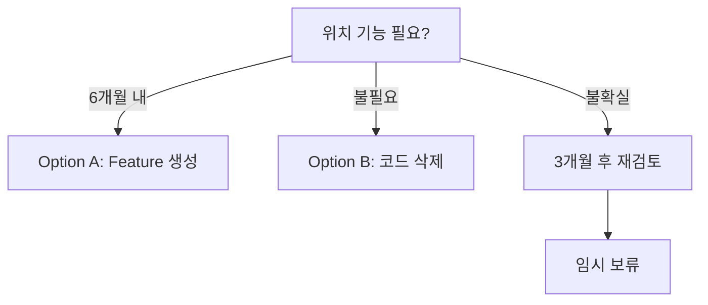

# 🚀 Migration Part 3: App Models to Location Feature

> 미사용 위치 모델을 Feature-First Architecture로 마이그레이션  
> 작성일: 2025-08-27 | 대상: /lib/app/models

## 📋 개요

이 문서는 `/lib/app/models`에 있는 미사용 위치 관련 모델들을 Feature-First Architecture에 맞게 마이그레이션하는 가이드입니다.
현재 코드는 사용되지 않고 있으며, 잘못된 레이어에 위치하고 있습니다.

## 🎯 마이그레이션 목표

### 주요 목표
1. **Feature 모듈화**: 위치 기능을 독립적인 Feature로 분리
2. **Clean Architecture**: Data/Domain/Presentation 레이어 적용
3. **코드 정리**: 미사용 코드 제거 또는 적절한 위치로 이동
4. **확장성 확보**: 향후 위치 기능 추가를 위한 기반 구축

### 결정 포인트
- **Option A**: Location Feature 생성 (위치 기능 계획이 있는 경우)
- **Option B**: 코드 삭제 (위치 기능 계획이 없는 경우)

## 🔍 현재 상태 분석

### 현재 파일 구조
```
lib/app/models/
├── lat_lng.dart    # 19줄 - 위도/경도 모델
└── place.dart      # 46줄 - 장소 정보 모델
```

### 코드 사용 현황
```bash
# 실제 사용: 0건
# README 언급: 3건 (예시로만 사용)
# import 참조: 0건
```

### 문제점 식별
| 문제 | 영향도 | 설명 |
|------|--------|------|
| **미사용 코드** | High | 실제로 사용되지 않는 코드가 존재 |
| **잘못된 위치** | High | app 레이어에 도메인 모델이 존재 |
| **Feature 미분리** | Medium | 위치 기능이 Feature로 구성되지 않음 |
| **확장성 부족** | Medium | 향후 위치 기능 추가 시 구조 재설계 필요 |

## 📝 마이그레이션 시나리오

## 🅰️ Option A: Location Feature 생성

### 적용 조건
- ✅ 6개월 내 위치 기반 기능 계획이 있는 경우
- ✅ 지도, 위치 검색 등의 기능이 로드맵에 있는 경우
- ✅ 사용자 위치 기반 콘텐츠 제공 계획이 있는 경우

### Phase 1: Feature 구조 생성 (Day 1)

#### Step 1: 디렉토리 구조 생성
```bash
# Feature 디렉토리 생성
mkdir -p lib/features/location/{data,domain,presentation}
mkdir -p lib/features/location/data/{datasources,repositories}
mkdir -p lib/features/location/domain/{models,repositories,usecases}
mkdir -p lib/features/location/presentation/{screens,widgets,providers}
```

#### Step 2: 모델 마이그레이션
```bash
# 기존 모델 이동
mv lib/app/models/lat_lng.dart lib/features/location/domain/models/
mv lib/app/models/place.dart lib/features/location/domain/models/
```

#### Step 3: 모델 리팩토링
```dart
// lib/features/location/domain/models/location.dart
import 'package:freezed_annotation/freezed_annotation.dart';

part 'location.freezed.dart';
part 'location.g.dart';

@freezed
class Location with _$Location {
  const factory Location({
    required double latitude,
    required double longitude,
    String? address,
    String? city,
    String? country,
  }) = _Location;
  
  factory Location.fromJson(Map<String, dynamic> json) =>
      _$LocationFromJson(json);
}
```

### Phase 2: Repository 구현 (Day 2)

#### Step 1: Repository 인터페이스
```dart
// lib/features/location/domain/repositories/location_repository.dart
abstract class LocationRepository {
  Future<Location> getCurrentLocation();
  Future<List<Place>> searchPlaces(String query);
  Future<Place?> getPlaceDetails(String placeId);
  Stream<Location> watchLocationUpdates();
}
```

#### Step 2: Repository 구현체
```dart
// lib/features/location/data/repositories/location_repository_impl.dart
import 'package:geolocator/geolocator.dart';
import 'package:google_maps_flutter/google_maps_flutter.dart';

@Injectable(as: LocationRepository)
class LocationRepositoryImpl implements LocationRepository {
  final Geolocator _geolocator;
  final GoogleMapsApi _googleMapsApi;
  
  LocationRepositoryImpl(
    this._geolocator,
    this._googleMapsApi,
  );
  
  @override
  Future<Location> getCurrentLocation() async {
    final permission = await Geolocator.checkPermission();
    if (permission == LocationPermission.denied) {
      await Geolocator.requestPermission();
    }
    
    final position = await Geolocator.getCurrentPosition();
    return Location(
      latitude: position.latitude,
      longitude: position.longitude,
    );
  }
}
```

### Phase 3: Use Cases 구현 (Day 3)

#### Step 1: 현재 위치 획득
```dart
// lib/features/location/domain/usecases/get_current_location.dart
@injectable
class GetCurrentLocation {
  final LocationRepository _repository;
  
  GetCurrentLocation(this._repository);
  
  Future<Either<LocationFailure, Location>> execute() async {
    try {
      final location = await _repository.getCurrentLocation();
      return Right(location);
    } catch (e) {
      return Left(LocationFailure.permissionDenied());
    }
  }
}
```

#### Step 2: 장소 검색
```dart
// lib/features/location/domain/usecases/search_places.dart
@injectable
class SearchPlaces {
  final LocationRepository _repository;
  
  SearchPlaces(this._repository);
  
  Future<Either<LocationFailure, List<Place>>> execute(String query) async {
    if (query.length < 3) {
      return Left(LocationFailure.invalidQuery());
    }
    
    try {
      final places = await _repository.searchPlaces(query);
      return Right(places);
    } catch (e) {
      return Left(LocationFailure.searchFailed());
    }
  }
}
```

### Phase 4: Presentation 레이어 (Day 4-5)

#### Step 1: Provider 구현
```dart
// lib/features/location/presentation/providers/location_provider.dart
class LocationProvider extends ChangeNotifier {
  final GetCurrentLocation _getCurrentLocation;
  final SearchPlaces _searchPlaces;
  
  Location? _currentLocation;
  List<Place> _searchResults = [];
  bool _isLoading = false;
  
  LocationProvider({
    required GetCurrentLocation getCurrentLocation,
    required SearchPlaces searchPlaces,
  }) : _getCurrentLocation = getCurrentLocation,
       _searchPlaces = searchPlaces;
  
  Future<void> fetchCurrentLocation() async {
    _isLoading = true;
    notifyListeners();
    
    final result = await _getCurrentLocation.execute();
    result.fold(
      (failure) => _handleError(failure),
      (location) {
        _currentLocation = location;
        notifyListeners();
      },
    );
    
    _isLoading = false;
    notifyListeners();
  }
}
```

#### Step 2: UI 구현
```dart
// lib/features/location/presentation/screens/location_picker_screen.dart
class LocationPickerScreen extends StatelessWidget {
  @override
  Widget build(BuildContext context) {
    return Consumer<LocationProvider>(
      builder: (context, provider, child) {
        return Scaffold(
          appBar: AppBar(title: Text('위치 선택')),
          body: GoogleMap(
            initialCameraPosition: CameraPosition(
              target: LatLng(
                provider.currentLocation?.latitude ?? 37.5665,
                provider.currentLocation?.longitude ?? 126.9780,
              ),
              zoom: 14,
            ),
            onMapCreated: (controller) {
              // 지도 컨트롤러 설정
            },
            markers: _buildMarkers(provider),
          ),
        );
      },
    );
  }
}
```

## 🅱️ Option B: 코드 삭제

### 적용 조건
- ❌ 위치 기능이 로드맵에 없는 경우
- ❌ 6개월 내 위치 기능 계획이 없는 경우
- ❌ 프로젝트가 위치 독립적인 경우

### 삭제 절차 (즉시)

#### Step 1: 백업 생성
```bash
# Git 태그로 백업
git tag -a "backup/location-models-$(date +%Y%m%d)" \
  -m "Backup location models before removal"

# 아카이브 브랜치 생성
git checkout -b archive/location-models
git add lib/app/models/
git commit -m "Archive: Location models before removal"
git checkout main
```

#### Step 2: 코드 삭제
```bash
# 파일 삭제
rm -rf lib/app/models/

# Git 커밋
git add -A
git commit -m "refactor: Remove unused location models

- Remove LatLng and AppPlace models
- No actual usage in the project
- Can be restored from archive/location-models branch if needed"
```

#### Step 3: 문서 업데이트
```bash
# index_document.md에서 제거
# CHANGELOG.md에 기록
```

## 📊 마이그레이션 영향 분석

### Option A: Location Feature 생성
| 영향 | 수준 | 설명 |
|------|------|------|
| **개발 시간** | 5일 | Feature 전체 구조 구현 |
| **테스트** | 3일 | Unit/Integration 테스트 |
| **의존성** | +3 패키지 | geolocator, google_maps, geocoding |
| **코드 증가** | +1,500줄 | Feature 전체 구현 |
| **유지보수** | Medium | 새로운 Feature 관리 필요 |

### Option B: 코드 삭제
| 영향 | 수준 | 설명 |
|------|------|------|
| **개발 시간** | 30분 | 백업 및 삭제 |
| **테스트** | 0 | 영향 없음 |
| **의존성** | 0 | 변경 없음 |
| **코드 감소** | -65줄 | 미사용 코드 제거 |
| **유지보수** | 개선 | 불필요한 코드 제거 |

## 🔄 마이그레이션 체크리스트

### Option A 체크리스트
- [ ] 프로덕트 팀과 위치 기능 로드맵 확인
- [ ] Feature 디렉토리 구조 생성
- [ ] 모델 파일 이동 및 리팩토링
- [ ] Repository 패턴 구현
- [ ] Use Cases 구현
- [ ] Provider 구현
- [ ] UI 스크린 구현
- [ ] 테스트 코드 작성
- [ ] 문서 업데이트
- [ ] Code Review

### Option B 체크리스트
- [ ] 코드 사용 여부 최종 확인
- [ ] Git 백업 태그 생성
- [ ] 아카이브 브랜치 생성
- [ ] 파일 삭제
- [ ] 문서 업데이트
- [ ] CHANGELOG 업데이트

## ⚠️ 위험 요소 및 대응

### Option A 위험 요소
1. **복잡도 증가**: 새로운 Feature 추가로 프로젝트 복잡도 상승
   - **대응**: Clean Architecture 엄격히 적용
   
2. **권한 이슈**: iOS/Android 위치 권한 처리
   - **대응**: Permission Handler 패키지 사용

3. **API 비용**: Google Maps API 사용료
   - **대응**: 사용량 모니터링 및 캐싱 적용

### Option B 위험 요소
1. **향후 복원 어려움**: 삭제 후 다시 필요할 때
   - **대응**: Git 아카이브 브랜치 유지

2. **의존성 발견**: 숨겨진 의존성이 있을 수 있음
   - **대응**: 철저한 코드 검색 후 삭제

## 📈 권장사항

### 결정 기준


### 최종 권장
- **즉시 결정**: 미사용 코드는 기술 부채
- **Option B 선호**: 현재 사용하지 않으므로 삭제 권장
- **필요 시 재구현**: 삭제 후 필요하면 Feature로 새로 구현

## 📚 참고 자료

- [Feature-First Architecture](/FEATURE_ARCHITECTURE.md)
- [Clean Architecture in Flutter](https://resocoder.com/clean-architecture/)
- [Google Maps Flutter](https://pub.dev/packages/google_maps_flutter)
- [Geolocator Package](https://pub.dev/packages/geolocator)

---

*이 마이그레이션은 미사용 코드 정리와 Feature-First Architecture 적용을 목표로 합니다.*
*Option B(삭제)를 권장하며, 향후 필요 시 Option A로 재구현할 수 있습니다.*