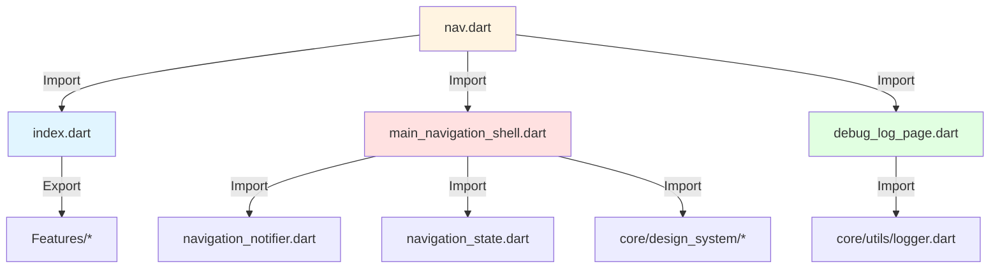

# 📦 App Widgets 레이어

> Versus Space 앱의 공통 위젯 및 Export 중앙화 디렉토리
> **최종 업데이트**: 2025-11-10 | **버전**: 2.0.0 | **Migration**: ✅ Clean Architecture v4.0 + Riverpod 3.x

[](https://flutter.dev)
[](https://riverpod.dev)
[](https://blog.cleancoder.com/uncle-bob/2012/08/13/the-clean-architecture.html)

---

## 📋 목차

- [개요](#-개요)
- [디렉토리 구조](#-디렉토리-구조)
- [주요 파일 상세](#-주요-파일-상세)
  - [1. index.dart (Export 중앙화)](#1-indexdart-export-중앙화)
  - [2. debug/debug_log_page.dart](#2-debugdebug_log_pagedart)
  - [3. navigation/main_navigation_shell.dart](#3-navigationmain_navigation_shelldart)
- [파일 간 연계성](#-파일-간-연계성)
- [사용 가이드](#-사용-가이드)
  - [Feature 위젯 추가하기](#feature-위젯-추가하기)
  - [디버그 로그 사용하기](#디버그-로그-사용하기)
  - [네비게이션 모드 전환하기](#네비게이션-모드-전환하기)
- [아키텍처 결정 (ADR)](#-아키텍처-결정-adr)
- [Future Enhancements](#-future-enhancements)
- [관련 문서](#-관련-문서)

---

## 🎯 개요

`/lib/app/widgets`는 Versus Space 앱의 **공통 위젯 및 Export 중앙화**를 담당하는 앱 레벨 디렉토리입니다.

### 핵심 역할

| 역할 | 설명 | 파일 |
|------|------|------|
| **Export 중앙화** | Feature별 페이지 위젯 24개를 한 곳에서 Export | `index.dart` |
| **네비게이션 UI** | GoRouter ShellRoute의 하단 네비게이션 바 관리 | `navigation/main_navigation_shell.dart` |
| **디버깅 도구** | 개발자 전용 로그 뷰어 (kDebugMode 전용) | `debug/debug_log_page.dart` |

### 설계 원칙

✅ **Clean Architecture v4.0**: Presentation Layer의 UI 컴포넌트
✅ **Riverpod 3.x**: ConsumerWidget 기반 상태 관리
✅ **Barrel Export Pattern**: import 경로 간소화
✅ **kDebugMode 보안**: 디버그 기능 Release 빌드 차단

---

## 🏗️ 디렉토리 구조

```
lib/app/widgets/
├── README.md                              # 👈 이 문서
├── index.dart                             # 47줄 - 24개 위젯 Export 중앙화
├── debug/                                 # 디버깅 도구
│   ├── README.md                          # debug/ 상세 문서
│   └── debug_log_page.dart                # 63줄 - 디버그 로그 뷰어 (kDebugMode 전용)
└── navigation/                            # 네비게이션 위젯
    ├── README.md                          # navigation/ 상세 문서
    └── main_navigation_shell.dart         # 163줄 - 메인 네비게이션 쉘 (Riverpod 3.x)

총 파일: 3개 (.dart)
총 라인 수: 273줄
총 README: 4개 (이 문서 포함)
```

### 디렉토리별 통계

| 디렉토리 | 파일 수 | 라인 수 | 역할 | Migration |
|---------|---------|---------|------|----------|
| **`/` (루트)** | 1 | 47 | Export 중앙화 | N/A |
| **`debug/`** | 1 | 63 | 개발자 도구 | ✅ StatelessWidget (적합) |
| **`navigation/`** | 1 | 163 | 네비게이션 UI | ✅ Riverpod 3.x |

---

## 📂 주요 파일 상세

### 1. index.dart (Export 중앙화)

**파일 정보**:
- **경로**: `/lib/app/widgets/index.dart`
- **라인 수**: 47줄
- **패턴**: Barrel Export Pattern
- **Migration**: N/A (Export만, 로직 없음)

**목적**: Feature별 페이지 위젯을 한 곳에서 Export하여 import 경로 간소화

#### Export 대상 분석

**총 Export**: **24개 위젯** (8개 Feature)

| Feature | 위젯 수 | Export 위젯 |
|---------|---------|-------------|
| **Auth** (6개) | 6 | LoginPageWidget, CreateAccountWidget, ForgotPasswordWidget, StartPageWidget, PhoneCreatAccountWidget, PhonelogeinpincodeWidget |
| **Profile** (6개) | 6 | UserInfoInputWidget, ExpertiseSelectWidget, HobbiesSelectWidget, AgrredSelectWidget, ProfilePageWidget, UserInfoDisplayScreen |
| **Creation** (3개) | 3 | CreatePostScreen, ProImageEditorPage, ImageViewerPage |
| **Chat** (4개) | 4 | ChatListWidgetClean, FriendsWidget, ChatDetailWidgetClean, AIChatPageClean |
| **Notifications** (1개) | 1 | NotificationsListWidget |
| **Post** (1개) | 1 | HomePageWidget |
| **Search** (1개) | 1 | SearchPageWidget |
| **Debug** (1개) | 1 | DebugLogPage |
| **Test** (1개) | 1 | TestpageSelectWidget |

#### Export 패턴

```dart
// Export 예시
export '/features/auth/presentation/screens/login/login_page/login_page_widget.dart'
    show LoginPageWidget;

export '/features/profile/presentation/screens/profile_main/profile_page_widget.dart'
    show ProfilePageWidget;

// Debug 전용 위젯
export '/app/widgets/debug/debug_log_page.dart' show DebugLogPage;
```

#### 사용처

**nav.dart (GoRouter 라우트 등록)**:
```dart
// lib/app/router/navigation/nav.dart
import '/app/widgets/index.dart';  // 한 줄로 24개 위젯 Import

GoRouter createRouter() => GoRouter(
  routes: [
    GoRoute(path: '/home', builder: (context, state) => HomePageWidget()),
    GoRoute(path: '/login', builder: (context, state) => LoginPageWidget()),
    // ... 나머지 22개 위젯
  ],
);
```

**장점**:
- ✅ **Import 간소화**: 24개 import → 1개 import
- ✅ **경로 변경 내성**: Feature 디렉토리 구조 변경 시 index.dart만 수정
- ✅ **명확한 Public API**: Export된 위젯 = 앱 레벨에서 사용 가능

**단점**:
- ⚠️ **파일 크기 증가**: 현재 47줄 (수용 가능)
- ⚠️ **모든 위젯 Import**: 사용 안 해도 Import (Tree-shaking으로 해결)

---

### 2. debug/debug_log_page.dart

**파일 정보**:
- **경로**: `/lib/app/widgets/debug/debug_log_page.dart`
- **라인 수**: 63줄
- **클래스**: `DebugLogPage` (StatelessWidget)
- **라우트**: `/debug/logs`
- **접근 제어**: `kDebugMode == true` (개발 모드 전용)

**목적**: 개발 중 로그를 실시간으로 조회하고 복사/삭제하는 디버깅 도구

#### 주요 기능

| 기능 | 설명 | UI 요소 |
|------|------|---------|
| **로그 조회** | `Logger.getAllLogs()` 호출하여 전체 로그 출력 | Body (SelectableText) |
| **전체 로그 복사** | 클립보드에 전체 로그 복사 | AppBar Copy Icon |
| **최근 100개 로그 복사** | 최근 100개 로그만 복사 (빠른 디버깅) | FloatingActionButton |
| **로그 삭제** | `Logger.clearLogs()` 호출하여 메모리 절약 | AppBar Delete Icon |

#### UI 특징

- **터미널 스타일**: 검은 배경 + 초록 텍스트
- **Monospace 폰트**: 가독성 향상 (Courier)
- **SelectableText**: 텍스트 선택 가능
- **SingleChildScrollView**: 긴 로그 스크롤 지원

#### 보안

✅ **이중 접근 제어**:
1. **nav.dart**: `if (!kDebugMode) return AccessDeniedScreen()`
2. **Release 빌드**: kDebugMode == false로 자동 제외

#### Import 의존성

```dart
import 'package:flutter/material.dart';        // Flutter 기본
import 'package:flutter/services.dart';        // Clipboard
import '/core/utils/logger.dart';              // Logger 유틸리티
```

#### 사용 예시

```dart
// 앱 실행 중 어디서든 접근
context.go('/debug/logs');

// 또는 개발자 메뉴에서 버튼 추가
ElevatedButton(
  onPressed: () => context.go('/debug/logs'),
  child: Text('디버그 로그 보기'),
)
```

**상세 문서**: [debug/README.md](debug/README.md)

---

### 3. navigation/main_navigation_shell.dart

**파일 정보**:
- **경로**: `/lib/app/widgets/navigation/main_navigation_shell.dart`
- **라인 수**: 163줄
- **클래스**:
  - `MainNavigationShell` (ConsumerWidget) - 주 위젯
  - `NavigationItemWidget` (StatelessWidget) - 커스텀 아이템 위젯 (미사용)
- **Migration**: ✅ **Riverpod 3.x 완료** (StatelessWidget → ConsumerWidget)

**목적**: GoRouter ShellRoute의 래퍼로 하단 네비게이션 바 관리 및 페이지 전환

#### 핵심 기능

1. **ShellRoute 래퍼**: GoRouter의 ShellRoute로 하단 네비게이션 유지
2. **네비게이션 모드 관리**: Main Mode ↔ Chat Mode 전환
3. **애니메이션**: 탭 전환 시 아이콘 애니메이션 (200ms)
4. **Design System 통합**: VersusColors, VersusTextStyles 사용

#### 네비게이션 모드

| 모드 | 탭 개수 | 탭 구성 | 사용 시나리오 |
|------|---------|---------|--------------|
| **Main Mode** | 5개 | 홈, 검색, 질문작성, 채팅, 유저 | 기본 앱 네비게이션 |
| **Chat Mode** | 4개 | 채팅, 친구, 검색, 홈 | 채팅 중심 네비게이션 |

#### 모드 전환 로직

```dart
void _onItemTapped(BuildContext context, WidgetRef ref, NavigationState state, int index) {
  final notifier = ref.read(navigationProvider.notifier);

  // 특별 처리: Main Mode에서 "채팅" 탭 (index 3) 선택
  if (state.mode == NavigationMode.main && index == 3) {
    notifier.switchToChatMode();  // Chat Mode로 전환
    context.go('/chat/list');
  }
  // 특별 처리: Chat Mode에서 "홈" 탭 (index 3) 선택
  else if (state.mode == NavigationMode.chat && index == 3) {
    notifier.switchToMainMode();  // Main Mode로 전환
    context.go('/home');
  }
  // 일반 탭 선택
  else {
    notifier.setTabIndex(index);
    context.go(selectedItem.route);
  }
}
```

#### Riverpod 3.x 통합

```dart
@override
Widget build(BuildContext context, WidgetRef ref) {
  // Riverpod 3.x: navigationProvider 구독
  final navigationState = ref.watch(navigationProvider);

  return Scaffold(
    body: child,  // GoRouter가 주입한 현재 페이지
    bottomNavigationBar: _buildBottomNavigationBar(context, ref, navigationState),
  );
}
```

#### 애니메이션

**바텀 네비게이션 바** (300ms):
```dart
AnimatedContainer(
  duration: const Duration(milliseconds: 300),
  curve: Curves.easeInOut,
  decoration: BoxDecoration(
    boxShadow: [BoxShadow(...)],
  ),
)
```

**아이콘 전환** (200ms):
```dart
BottomNavigationBarItem(
  icon: AnimatedSwitcher(
    duration: const Duration(milliseconds: 200),
    child: Icon(
      isSelected ? item.activeIcon : item.icon,
      key: ValueKey(isSelected),
    ),
  ),
)
```

#### GoRouter 통합

```dart
// lib/app/router/navigation/nav.dart
ShellRoute(
  builder: (context, state, child) => MainNavigationShell(child: child),
  routes: [
    // 7개 메인 페이지 (하단 네비게이션 유지)
    GoRoute(path: '/home', builder: (context, state) => HomePageWidget()),
    GoRoute(path: '/search', builder: (context, state) => SearchPageWidget()),
    GoRoute(path: '/profile', builder: (context, state) => ProfilePageWidget()),
    GoRoute(path: '/inPutPostImage', builder: (context, state) => CreatePostScreen()),
    GoRoute(path: '/chat/list', builder: (context, state) => ChatListWidgetClean()),
    GoRoute(path: '/chat/friends', builder: (context, state) => FriendsWidget()),
  ],
)
```

**상세 문서**: [navigation/README.md](navigation/README.md)

---

## 🔗 파일 간 연계성

### 의존성 그래프



### Import 매트릭스

| 파일 | Import 대상 | Import 수 | Export 대상 |
|-----|------------|----------|-------------|
| **index.dart** | - | 0 | Features/* (24개 위젯) |
| **debug_log_page.dart** | flutter/material, flutter/services, core/utils/logger | 3 | - |
| **main_navigation_shell.dart** | flutter_riverpod, go_router, core/design_system, app/router/navigation/* | 6 | - |

### 공통 사용 패턴

**1. Feature 위젯 Export 패턴**:
```dart
// index.dart
export '/features/*/presentation/screens/*/*.dart' show *Widget;

// nav.dart
import '/app/widgets/index.dart';  // 모든 위젯 한 번에
```

**2. GoRouter ShellRoute 패턴**:
```dart
ShellRoute(
  builder: (context, state, child) => MainNavigationShell(child: child),
  routes: [...],  // index.dart에서 Import한 위젯 사용
)
```

**3. Riverpod State 구독 패턴**:
```dart
final navigationState = ref.watch(navigationProvider);
```

---

## 🎓 사용 가이드

### Feature 위젯 추가하기

**Step 1: Feature에서 위젯 생성**

```dart
// lib/features/my_feature/presentation/screens/my_screen/my_widget.dart
class MyWidget extends StatelessWidget {
  static const routeName = 'MyScreen';
  static const routePath = '/myScreen';

  @override
  Widget build(BuildContext context) {
    return Scaffold(
      appBar: AppBar(title: Text('My Screen')),
      body: Center(child: Text('Hello World')),
    );
  }
}
```

**Step 2: index.dart에 Export 추가**

```dart
// lib/app/widgets/index.dart
export '/features/my_feature/presentation/screens/my_screen/my_widget.dart'
    show MyWidget;
```

**Step 3: nav.dart에 라우트 등록**

```dart
// lib/app/router/navigation/nav.dart
import '/app/widgets/index.dart';

AppRoute(
  name: MyWidget.routeName,
  path: MyWidget.routePath,
  builder: (context, params) => MyWidget(),
).toRoute(appStateNotifier),
```

**Step 4: 네비게이션 사용**

```dart
// 앱 어디서든 사용 가능
context.goNamed(MyWidget.routeName);
// 또는
context.go(MyWidget.routePath);
```

---

### 디버그 로그 사용하기

#### 접근 방법

**방법 1: 직접 라우트 이동**
```dart
context.go('/debug/logs');
```

**방법 2: Settings 화면에서 5번 탭**
1. Settings 화면 접속
2. "설정" 타이틀 5번 연속 탭 (5초 내)
3. 🔧 "Debug mode activated" 메시지 확인
4. 디버그 로그 페이지 자동 이동

#### 로그 활용

**1. 전체 로그 복사**
- AppBar의 복사 아이콘 클릭
- 클립보드에 전체 로그 복사
- 텍스트 에디터에 붙여넣기 후 분석

**2. 최근 100개 로그 복사**
- FloatingActionButton 클릭
- 최근 100개 로그만 복사 (빠른 디버깅)

**3. 로그 삭제**
- AppBar의 삭제 아이콘 클릭
- 메모리 절약 (긴 세션 후)

#### Logger 사용법

```dart
// 로그 기록
Logger.info('User logged in: ${user.id}');
Logger.warning('Low memory warning');
Logger.error('Network request failed: $error');

// 로그 조회 (프로그래밍 방식)
final allLogs = Logger.getAllLogs();
final recentLogs = Logger.getRecentLogs(50);

// 로그 삭제
Logger.clearLogs();
```

⚠️ **보안 주의사항**:
- ❌ 비밀번호, API 키 로깅 금지
- ✅ 사용자 ID는 마스킹 후 로깅
- ✅ Release 빌드에서 자동 비활성화

---

### 네비게이션 모드 전환하기

#### Main Mode → Chat Mode

**시나리오**: 사용자가 Main Mode에서 "채팅" 탭 선택

**동작**:
1. `NavigationNotifier.switchToChatMode()` 호출
2. `NavigationState.mode = NavigationMode.chat`
3. `NavigationState.chatTabIndex = 0` (채팅 리스트)
4. `context.go('/chat/list')`
5. 하단 네비게이션 바 → Chat Mode 4개 탭으로 변경

#### Chat Mode → Main Mode

**시나리오**: 사용자가 Chat Mode에서 "홈" 탭 선택

**동작**:
1. `NavigationNotifier.switchToMainMode()` 호출
2. `NavigationState.mode = NavigationMode.main`
3. `NavigationState.mainTabIndex = 0` (홈)
4. `context.go('/home')`
5. 하단 네비게이션 바 → Main Mode 5개 탭으로 변경

#### 프로그래밍 방식 모드 전환

```dart
// Riverpod Provider로 직접 제어
final notifier = ref.read(navigationProvider.notifier);

// Chat Mode로 전환
notifier.switchToChatMode();
context.go('/chat/list');

// Main Mode로 전환
notifier.switchToMainMode();
context.go('/home');

// 특정 탭으로 이동
notifier.setTabIndex(2);  // Main Mode: 질문작성, Chat Mode: 검색
```

#### 상태 추적

```dart
// 현재 모드 확인
final state = ref.watch(navigationProvider);
print('Current mode: ${state.mode}');  // NavigationMode.main 또는 chat
print('Current tab: ${state.currentTabIndex}');  // 0~4 (Main) 또는 0~3 (Chat)

// 현재 아이템 리스트
final items = state.currentItems;  // mainNavigationItems 또는 chatNavigationItems
```

---

## 🏛️ 아키텍처 결정 (ADR)

### ADR-1: 왜 Barrel Export Pattern? (index.dart)

**결정**: Feature별 위젯을 index.dart에서 중앙 Export

**근거**:

1. **Import 간소화**:
   ```dart
   // ❌ Before (24개 import)
   import '/features/auth/presentation/screens/login/login_page/login_page_widget.dart';
   import '/features/auth/presentation/screens/signup/create_account/create_account_widget.dart';
   import '/features/profile/presentation/screens/profile_main/profile_page_widget.dart';
   // ... 21개 더

   // ✅ After (1개 import)
   import '/app/widgets/index.dart';  // 한 줄로 24개 위젯 Import
   ```

2. **경로 변경 내성**:
   - Feature 디렉토리 구조 변경 시 index.dart만 수정
   - nav.dart는 변경 불필요

3. **명확한 Public API**:
   - index.dart에 Export된 위젯 = 앱 레벨에서 사용 가능
   - Export 안 된 위젯 = Feature 내부 전용

**Trade-offs**:
- ✅ 가독성 향상, 유지보수 용이
- ⚠️ index.dart 파일 크기 증가 (현재 47줄, 수용 가능)
- ⚠️ 모든 위젯 Import (사용 안 해도) → Tree-shaking으로 해결

**대안 검토**:
- ❌ Feature별 개별 Import: 너무 많은 import 문 (가독성 저하)
- ❌ 자동 생성 스크립트: 복잡도 증가, 수동 관리로 충분

---

### ADR-2: 왜 ConsumerWidget? (main_navigation_shell.dart)

**결정**: Riverpod 3.x ConsumerWidget 사용

**근거**:

1. **상태 자동 동기화**:
   ```dart
   final navigationState = ref.watch(navigationProvider);
   // NavigationState 변경 시 자동 UI 업데이트
   ```

2. **Clean Architecture 준수**:
   - ✅ Presentation Layer → Riverpod Provider
   - ✅ Domain Layer → NavigationState (Freezed)
   - ✅ 단방향 데이터 흐름

3. **테스트 용이성**:
   ```dart
   testWidgets('네비게이션 모드 전환 테스트', (tester) async {
     final container = ProviderContainer(
       overrides: [
         navigationProvider.overrideWith(() => MockNavigationNotifier()),
       ],
     );
     // Mock 주입으로 간편한 테스트
   });
   ```

**대안 검토**:
- ❌ StatefulWidget + setState(): 상태 관리 복잡, 테스트 어려움
- ❌ InheritedWidget: Boilerplate 많음
- ❌ Provider 0.x: 구버전, Migration 완료됨

---

### ADR-3: 왜 kDebugMode 제한? (debug_log_page.dart)

**결정**: Release 빌드에서 접근 차단

**근거**:

1. **보안**: 로그에 민감 정보 포함 가능 (API 응답, 사용자 행동)
2. **성능**: Logger 메모리 사용, Release 빌드에서 불필요
3. **UX**: 일반 사용자에게 디버그 화면 노출 방지

**구현**:
```dart
// nav.dart
if (!kDebugMode) {
  return MaterialPage(
    child: Scaffold(
      body: Center(child: Text('Debug mode only')),
    ),
  );
}
return MaterialPage(child: DebugLogPage());
```

**대안 검토**:
- ❌ 런타임 권한 체크: 복잡, Firebase Auth 의존성
- ❌ 빌드 타겟 분리: 관리 부담

**결과**:
- ✅ 컴파일 타임 제거: `kDebugMode == false` → DebugLogPage 코드 완전 제외
- ✅ Tree Shaking: Release 빌드 크기 절감

---

### ADR-4: 왜 NavigationItemWidget 미사용?

**결정**: 정의만 하고 현재 사용 안 함

**근거**:

1. **향후 확장성**:
   - 디자인 시스템 업데이트 시 커스텀 디자인 적용
   - BottomNavigationBar의 제약 (애니메이션, 레이아웃) 극복

2. **현재 충분성**:
   - BottomNavigationBar 기본 스타일로 요구사항 만족
   - 조기 최적화 방지 (YAGNI 원칙)

3. **코드 준비**:
   - 향후 변경 시 빠른 전환 가능
   - 인터페이스 설계 완료

**향후 활용 시나리오**:
- Badge 지원 (알림 카운트 표시)
- 커스텀 애니메이션 (탭 전환 시 물결 효과)
- 접근성 개선 (Semantics, VoiceOver 지원)

**전환 계획**:
```dart
// 현재 (BottomNavigationBar 기본 스타일)
BottomNavigationBar(items: [...])

// 향후 (커스텀 위젯 - NavigationItemWidget 활용)
Row(
  children: items.map((item) => NavigationItemWidget(item: item)).toList(),
)
```

---

## 🚀 Future Enhancements

### 우선순위 1 (단기)

- [ ] **NavigationItemWidget 활성화**: 커스텀 디자인 적용
- [ ] **Badge 지원**: 알림 카운트 표시 (채팅, 알림 탭)
- [ ] **로그 필터링**: 로그 레벨별 필터 (INFO, WARNING, ERROR)
- [ ] **테스트 작성**: Widget Test 3개 (MainNavigationShell, DebugLogPage, Export 확인)

### 우선순위 2 (중기)

- [ ] **로그 검색**: 키워드 기반 로그 검색 기능
- [ ] **로그 Export**: .txt 파일로 로그 내보내기
- [ ] **실시간 로그 스트리밍**: StreamBuilder로 자동 업데이트
- [ ] **제스처 네비게이션**: 스와이프로 탭 전환

### 우선순위 3 (장기)

- [ ] **성능 모니터**: FPS, 메모리 사용량 실시간 표시
- [ ] **네트워크 인스펙터**: API 요청/응답 로깅
- [ ] **A/B 테스트**: 네비게이션 바 디자인 A/B 테스트
- [ ] **자동 생성 스크립트**: index.dart 자동 생성 (Feature 추가 시)

---

## 📚 관련 문서

### 하위 README
- [debug/README.md](debug/README.md) - 디버그 도구 상세 문서
- [navigation/README.md](navigation/README.md) - 네비게이션 시스템 상세 문서

### App 레벨 문서
- [app/README.md](../README.md) - App 디렉토리 전체 개요
- [app/router/navigation/README.md](../router/navigation/README.md) - GoRouter 설정 상세

### Feature 문서
- [features/auth/README.md](../../features/auth/README.md) - 인증 Feature
- [features/profile/README.md](../../features/profile/README.md) - 프로필 Feature
- [features/chat/README.md](../../features/chat/README.md) - 채팅 Feature

### Core 문서
- [core/design_system/README.md](../../core/design_system/README.md) - 디자인 시스템
- [core/utils/README.md](../../core/utils/README.md) - 유틸리티 (Logger 포함)

### 아키텍처 문서
- [CLAUDE.md](../../../CLAUDE.md) - Versus Space 전체 아키텍처 가이드

---

## ⚠️ 주의사항

### DO ✅
- ✅ **index.dart에 Feature 위젯 추가 시**: nav.dart에 라우트도 함께 등록
- ✅ **디버그 기능 사용 시**: kDebugMode 체크 확인
- ✅ **네비게이션 상태 변경 시**: NavigationNotifier 사용 (직접 State 수정 금지)
- ✅ **Design System 준수**: VersusColors, VersusTextStyles 사용

### DON'T ❌
- ❌ **index.dart에 로직 추가 금지**: Export만 사용, 비즈니스 로직 금지
- ❌ **Release 빌드에 디버그 코드 포함 금지**: kDebugMode로 차단 필수
- ❌ **BottomNavigationBar 직접 수정 금지**: MainNavigationShell 사용
- ❌ **Logger에 민감 정보 로깅 금지**: 비밀번호, API 키 등

---

**마지막 업데이트**: 2025-11-10
**작성자**: Claude Code
**문서 버전**: 2.0.0
**Migration 상태**: ✅ Clean Architecture v4.0 + Riverpod 3.x 완료
