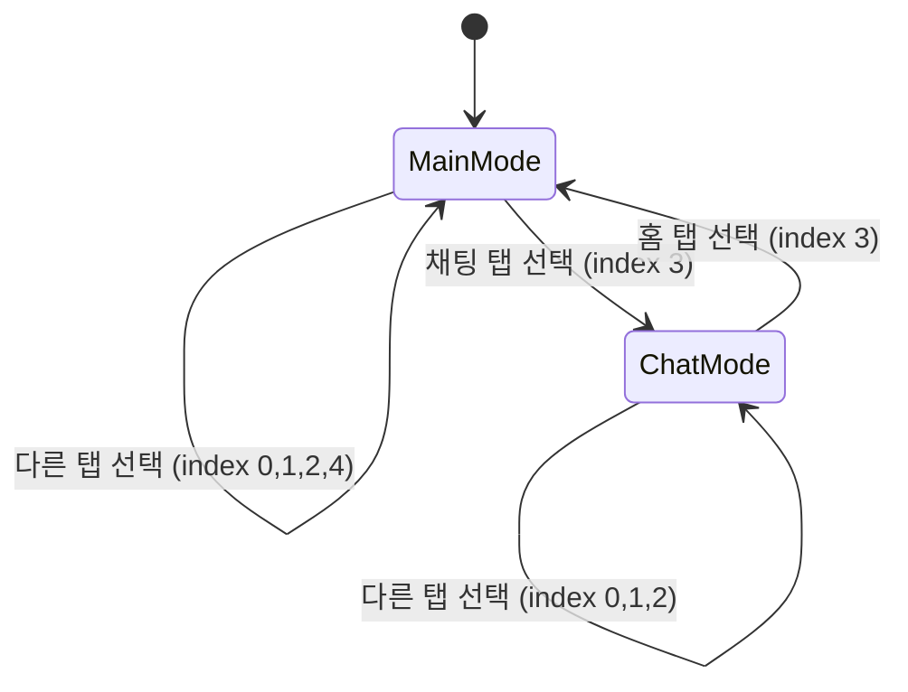

# 🧭 Navigation Widgets

> GoRouter ShellRoute의 네비게이션 UI 컴포넌트
> **최종 업데이트**: 2025-11-10 | **버전**: 2.0.0 | **Migration**: ✅ Riverpod 3.x

[](https://riverpod.dev)
[](https://pub.dev/packages/go_router)
[](https://blog.cleancoder.com/uncle-bob/2012/08/13/the-clean-architecture.html)

---

## 📋 목차

- [개요](#-개요)
- [MainNavigationShell 상세](#-mainnavigationshell-상세)
- [네비게이션 모드](#-네비게이션-모드)
- [Riverpod 3.x 통합](#-riverpod-3x-통합)
- [사용 가이드](#-사용-가이드)
- [아키텍처 결정 (ADR)](#-아키텍처-결정-adr)
- [Future Enhancements](#-future-enhancements)

---

## 🎯 개요

`/lib/app/widgets/navigation` 디렉토리는 앱의 메인 네비게이션 UI 컴포넌트를 제공합니다. 현재 **MainNavigationShell**만 포함되어 있으며, GoRouter ShellRoute의 래퍼로 하단 네비게이션 바를 관리합니다.

### 핵심 역할

| 역할 | 설명 |
|------|------|
| **ShellRoute 래퍼** | GoRouter의 ShellRoute로 하단 네비게이션 유지 |
| **네비게이션 모드 관리** | Main Mode ↔ Chat Mode 전환 |
| **상태 동기화** | Riverpod 3.x Provider로 실시간 상태 반영 |
| **애니메이션** | 탭 전환 시 부드러운 애니메이션 (200ms/300ms) |

### 설계 원칙

✅ **Riverpod 3.x**: ConsumerWidget 기반 상태 관리
✅ **ShellRoute 패턴**: 페이지 전환 시 네비게이션 바 유지
✅ **Design System 통합**: VersusColors, VersusTextStyles 사용
✅ **애니메이션**: AnimatedContainer + AnimatedSwitcher

---

## 📂 MainNavigationShell 상세

### 파일 정보

| 항목 | 값 |
|------|-----|
| **경로** | `/lib/app/widgets/navigation/main_navigation_shell.dart` |
| **라인 수** | 163줄 |
| **클래스** | `MainNavigationShell` (ConsumerWidget), `NavigationItemWidget` (미사용) |
| **Migration** | ✅ Riverpod 3.x 완료 (StatelessWidget → ConsumerWidget) |
| **GoRouter 통합** | ShellRoute builder |

### 클래스 구조

```dart
/// MainNavigationShell - 메인 네비게이션 바 위젯
///
/// **역할**:
/// - GoRouter ShellRoute의 래퍼
/// - 하단 네비게이션 바 렌더링
/// - Main Mode ↔ Chat Mode 전환
///
/// **Migration**: ✅ Riverpod 3.x ConsumerWidget
class MainNavigationShell extends ConsumerWidget {
  const MainNavigationShell({
    super.key,
    required this.child,  // GoRouter가 주입한 현재 페이지
  });

  final Widget child;

  @override
  Widget build(BuildContext context, WidgetRef ref) {
    final navigationState = ref.watch(navigationProvider);

    return Scaffold(
      body: child,
      bottomNavigationBar: _buildBottomNavigationBar(context, ref, navigationState),
    );
  }
}
```

### UI 구조

```
MainNavigationShell
├── Scaffold
│   ├── body: child (GoRouter가 주입한 페이지)
│   │   - HomePageWidget
│   │   - SearchPageWidget
│   │   - ProfilePageWidget
│   │   - CreatePostScreen
│   │   - ChatListWidgetClean
│   │   - FriendsWidget
│   └── bottomNavigationBar
│       └── AnimatedContainer (300ms)
│           └── BottomNavigationBar
│               ├── currentIndex: state.currentTabIndex
│               ├── onTap: _onItemTapped
│               └── items: [
│                   BottomNavigationBarItem (AnimatedSwitcher 200ms)
│                   // Main Mode: 5개 탭
│                   // Chat Mode: 4개 탭
│                 ]
```

---

## 🔄 네비게이션 모드

### 모드 개요

MainNavigationShell은 **2가지 네비게이션 모드**를 지원합니다:

| 모드 | 탭 개수 | 탭 구성 | 사용 시나리오 |
|------|---------|---------|--------------|
| **Main Mode** | 5개 | 홈, 검색, 질문작성, 채팅, 유저 | 기본 앱 네비게이션 |
| **Chat Mode** | 4개 | 채팅, 친구, 검색, 홈 | 채팅 중심 네비게이션 |

### Main Mode (기본 모드)

**탭 구성** (5개):

```dart
const List<NavigationItem> mainNavigationItems = [
  NavigationItem(
    label: '홈',
    icon: Icons.home_outlined,
    activeIcon: Icons.home,
    route: '/home',
  ),
  NavigationItem(
    label: '검색',
    icon: Icons.search_outlined,
    activeIcon: Icons.search,
    route: '/search',
  ),
  NavigationItem(
    label: '질문작성',
    icon: Icons.add_circle_outline,
    activeIcon: Icons.add_circle,
    route: '/inPutPostImage',
  ),
  NavigationItem(
    label: '채팅',
    icon: Icons.chat_bubble_outline,
    activeIcon: Icons.chat_bubble,
    route: '/chat/list',
  ),
  NavigationItem(
    label: '유저',
    icon: Icons.person_outline,
    activeIcon: Icons.person,
    route: '/profile',
  ),
];
```

**사용 시나리오**:
- 사용자가 앱을 처음 열었을 때
- 홈, 검색, 질문작성, 유저 프로필 탐색 시
- 채팅 기능 외 모든 기능 사용 시

### Chat Mode (채팅 모드)

**탭 구성** (4개):

```dart
const List<NavigationItem> chatNavigationItems = [
  NavigationItem(
    label: '채팅',
    icon: Icons.chat_bubble_outline,
    activeIcon: Icons.chat_bubble,
    route: '/chat/list',
  ),
  NavigationItem(
    label: '친구',
    icon: Icons.people_outline,
    activeIcon: Icons.people,
    route: '/chat/friends',
  ),
  NavigationItem(
    label: '검색',
    icon: Icons.search_outlined,
    activeIcon: Icons.search,
    route: '/chat/search',
  ),
  NavigationItem(
    label: '홈',
    icon: Icons.home_outlined,
    activeIcon: Icons.home,
    route: '/home',
  ),
];
```

**사용 시나리오**:
- 사용자가 Main Mode에서 "채팅" 탭 선택 시 자동 전환
- 채팅, 친구 목록, 채팅 내 검색 기능 사용 시
- 채팅 중심 작업 수행 시

### 모드 전환 로직

```dart
void _onItemTapped(
  BuildContext context,
  WidgetRef ref,
  NavigationState state,
  int index,
) {
  final notifier = ref.read(navigationProvider.notifier);
  final selectedItem = state.currentItems[index];

  // ✅ 특별 처리: Main Mode에서 "채팅" 탭 (index 3) 선택
  if (state.mode == NavigationMode.main && index == 3) {
    notifier.switchToChatMode();  // Chat Mode로 전환
    context.go('/chat/list');
    return;
  }

  // ✅ 특별 처리: Chat Mode에서 "홈" 탭 (index 3) 선택
  if (state.mode == NavigationMode.chat && index == 3) {
    notifier.switchToMainMode();  // Main Mode로 전환
    context.go('/home');
    return;
  }

  // 일반 탭 선택
  notifier.setTabIndex(index);
  context.go(selectedItem.route);
}
```

**전환 플로우**:



---

## 🔗 Riverpod 3.x 통합

### NavigationProvider 구독

```dart
@override
Widget build(BuildContext context, WidgetRef ref) {
  // Riverpod 3.x: navigationProvider 구독
  final navigationState = ref.watch(navigationProvider);

  return Scaffold(
    body: child,
    bottomNavigationBar: _buildBottomNavigationBar(context, ref, navigationState),
  );
}
```

**장점**:
- ✅ **자동 UI 업데이트**: NavigationState 변경 시 자동 리빌드
- ✅ **타입 안전**: Freezed로 불변성 보장
- ✅ **테스트 용이**: Mock Provider 주입 가능

### NavigationState (Freezed)

```dart
@freezed
sealed class NavigationState with _$NavigationState {
  const factory NavigationState({
    @Default(NavigationMode.main) NavigationMode mode,
    @Default(0) int mainTabIndex,
    @Default(0) int chatTabIndex,
  }) = _NavigationState;

  // Computed properties
  int get currentTabIndex => mode == NavigationMode.main
    ? mainTabIndex
    : chatTabIndex;

  List<NavigationItem> get currentItems => mode == NavigationMode.main
    ? mainNavigationItems
    : chatNavigationItems;
}
```

**필드 설명**:
- **mode**: 현재 네비게이션 모드 (Main/Chat)
- **mainTabIndex**: Main Mode에서 선택된 탭 인덱스 (0~4)
- **chatTabIndex**: Chat Mode에서 선택된 탭 인덱스 (0~3)
- **currentTabIndex** (Computed): 현재 모드에서의 활성 탭
- **currentItems** (Computed): 현재 모드의 네비게이션 아이템 리스트

### NavigationNotifier (Riverpod 3.x)

```dart
@riverpod
class Navigation extends _$Navigation {
  @override
  NavigationState build() => NavigationState.initial();

  // 모드 전환
  void setMode(NavigationMode mode) {
    state = state.copyWith(mode: mode);
  }

  void switchToMainMode() {
    state = state.copyWith(
      mode: NavigationMode.main,
      mainTabIndex: 0,  // 홈으로 리셋
    );
  }

  void switchToChatMode() {
    state = state.copyWith(
      mode: NavigationMode.chat,
      chatTabIndex: 0,  // 채팅 리스트로 리셋
    );
  }

  // 탭 인덱스 변경
  void setTabIndex(int index) {
    if (state.mode == NavigationMode.main) {
      state = state.copyWith(mainTabIndex: index);
    } else {
      state = state.copyWith(chatTabIndex: index);
    }
  }

  // 특정 라우트로 이동
  void navigateToRoute(String route) {
    final items = state.currentItems;
    final index = items.indexWhere((item) => item.route == route);
    if (index != -1) {
      setTabIndex(index);
    }
  }
}
```

**사용 예시**:

```dart
// Provider 읽기 (자동 리빌드)
final state = ref.watch(navigationProvider);

// Notifier 사용 (상태 변경)
final notifier = ref.read(navigationProvider.notifier);

// 모드 전환
notifier.switchToChatMode();

// 탭 변경
notifier.setTabIndex(2);

// 라우트로 이동
notifier.navigateToRoute('/chat/friends');
```

---

## 🎨 애니메이션

### 바텀 네비게이션 바 애니메이션 (300ms)

```dart
AnimatedContainer(
  duration: const Duration(milliseconds: 300),
  curve: Curves.easeInOut,
  decoration: BoxDecoration(
    color: Colors.white,
    boxShadow: [
      BoxShadow(
        color: Colors.black.withOpacity(0.1),
        blurRadius: 10,
        offset: Offset(0, -2),
      ),
    ],
  ),
  child: BottomNavigationBar(...),
)
```

**효과**:
- 탭 전환 시 그림자 부드럽게 변경
- easeInOut 커브로 자연스러운 전환

### 아이콘 전환 애니메이션 (200ms)

```dart
BottomNavigationBarItem(
  icon: AnimatedSwitcher(
    duration: const Duration(milliseconds: 200),
    transitionBuilder: (child, animation) {
      return FadeTransition(
        opacity: animation,
        child: child,
      );
    },
    child: Icon(
      isSelected ? item.activeIcon : item.icon,
      key: ValueKey(isSelected),  // 애니메이션 트리거
    ),
  ),
  label: item.label,
)
```

**효과**:
- 선택 시 아이콘 변경 (outline → filled)
- FadeTransition으로 부드러운 전환
- ValueKey로 애니메이션 트리거

### Design System 통합

```dart
BottomNavigationBar(
  currentIndex: state.currentTabIndex,
  onTap: (index) => _onItemTapped(context, ref, state, index),
  type: BottomNavigationBarType.fixed,

  // VersusColors 사용
  selectedItemColor: VersusColors.primary,
  unselectedItemColor: VersusColors.textSecondary,
  backgroundColor: Colors.white,

  // VersusTextStyles 사용
  selectedLabelStyle: VersusTextStyles.labelSmall.copyWith(
    fontWeight: FontWeight.w600,
  ),
  unselectedLabelStyle: VersusTextStyles.labelSmall,

  items: state.currentItems.map((item) => ...).toList(),
)
```

---

## 🎓 사용 가이드

### GoRouter ShellRoute 등록

```dart
// lib/app/router/navigation/nav.dart
import '/app/widgets/navigation/main_navigation_shell.dart';

GoRouter createRouter() => GoRouter(
  routes: [
    // ShellRoute로 하단 네비게이션 유지
    ShellRoute(
      builder: (context, state, child) => MainNavigationShell(child: child),
      routes: [
        // 7개 메인 페이지 (하단 네비게이션 유지)
        GoRoute(
          path: '/home',
          builder: (context, state) => HomePageWidget(),
        ),
        GoRoute(
          path: '/search',
          builder: (context, state) => SearchPageWidget(),
        ),
        GoRoute(
          path: '/profile',
          builder: (context, state) => ProfilePageWidget(),
        ),
        GoRoute(
          path: '/inPutPostImage',
          builder: (context, state) => CreatePostScreen(),
        ),
        GoRoute(
          path: '/chat/list',
          builder: (context, state) => ChatListWidgetClean(),
        ),
        GoRoute(
          path: '/chat/friends',
          builder: (context, state) => FriendsWidget(),
        ),
      ],
    ),

    // ShellRoute 외부 (하단 네비게이션 없음)
    GoRoute(
      path: '/login',
      builder: (context, state) => LoginPageWidget(),
    ),
    GoRoute(
      path: '/chat/detail',
      builder: (context, state) => ChatDetailWidgetClean(),
    ),
  ],
);
```

**ShellRoute vs 일반 GoRoute**:

| 항목 | ShellRoute 내부 | ShellRoute 외부 |
|------|----------------|----------------|
| **하단 네비게이션** | ✅ 유지 | ❌ 없음 |
| **페이지 전환** | 탭 전환 (빠름) | 전체 화면 전환 |
| **상태 보존** | ✅ 유지 | ❌ 재생성 |
| **사용 예시** | 홈, 검색, 프로필 | 로그인, 채팅 상세 |

### 프로그래밍 방식 모드 전환

```dart
// Riverpod Provider로 직접 제어
final notifier = ref.read(navigationProvider.notifier);

// Chat Mode로 전환
notifier.switchToChatMode();
context.go('/chat/list');

// Main Mode로 전환
notifier.switchToMainMode();
context.go('/home');

// 특정 탭으로 이동
notifier.setTabIndex(2);  // Main Mode: 질문작성, Chat Mode: 검색
```

### 상태 추적

```dart
// 현재 모드 확인
final state = ref.watch(navigationProvider);
print('Current mode: ${state.mode}');  // NavigationMode.main 또는 chat
print('Current tab: ${state.currentTabIndex}');  // 0~4 (Main) 또는 0~3 (Chat)

// 현재 아이템 리스트
final items = state.currentItems;  // mainNavigationItems 또는 chatNavigationItems
print('Available tabs: ${items.map((item) => item.label).join(', ')}');

// 리스너로 변화 감지
ref.listen<NavigationState>(
  navigationProvider,
  (previous, next) {
    if (previous?.mode != next.mode) {
      print('Mode changed: ${previous?.mode} → ${next.mode}');
    }
  },
);
```

---

## 🏛️ 아키텍처 결정 (ADR)

### ADR-1: 왜 ConsumerWidget?

**결정**: Riverpod 3.x ConsumerWidget 사용

**근거**:

1. **상태 자동 동기화**:
   ```dart
   final navigationState = ref.watch(navigationProvider);
   // NavigationState 변경 시 자동 UI 업데이트
   ```

2. **Clean Architecture 준수**:
   - ✅ Presentation Layer → Riverpod Provider
   - ✅ Domain Layer → NavigationState (Freezed)
   - ✅ 단방향 데이터 흐름

3. **테스트 용이성**:
   ```dart
   testWidgets('네비게이션 모드 전환 테스트', (tester) async {
     final container = ProviderContainer(
       overrides: [
         navigationProvider.overrideWith(() => MockNavigationNotifier()),
       ],
     );
     // Mock 주입으로 간편한 테스트
   });
   ```

**대안 검토**:
- ❌ StatefulWidget + setState(): 상태 관리 복잡, 테스트 어려움
- ❌ InheritedWidget: Boilerplate 많음
- ❌ Provider 0.x: 구버전, Migration 완료됨

---

### ADR-2: 왜 ShellRoute?

**결정**: GoRouter ShellRoute 사용

**근거**:

1. **네비게이션 바 유지**:
   - 페이지 전환 시 하단 네비게이션 바 유지
   - 사용자 경험 향상 (일관된 UI)

2. **상태 보존**:
   - 탭 이동 시 페이지 재생성 방지
   - 스크롤 위치, 입력 데이터 유지

3. **GoRouter 공식 권장**:
   - GoRouter 문서에서 권장하는 패턴
   - Flutter 커뮤니티 Best Practice

**구현**:
```dart
ShellRoute(
  builder: (context, state, child) => MainNavigationShell(child: child),
  routes: [...],  // 하단 네비게이션 유지할 페이지들
)
```

**대안 검토**:
- ❌ Navigator + PageView: 복잡도 증가, GoRouter와 충돌
- ❌ IndexedStack: 모든 페이지 메모리 상주 (메모리 낭비)

---

### ADR-3: 왜 NavigationItemWidget을 미사용?

**결정**: 정의만 하고 현재 사용 안 함

**근거**:

1. **향후 확장성**:
   - 디자인 시스템 업데이트 시 커스텀 디자인 적용
   - BottomNavigationBar의 제약 (애니메이션, 레이아웃) 극복

2. **현재 충분성**:
   - BottomNavigationBar 기본 스타일로 요구사항 만족
   - 조기 최적화 방지 (YAGNI 원칙)

3. **코드 준비**:
   - 향후 변경 시 빠른 전환 가능
   - 인터페이스 설계 완료

**전환 계획**:
```dart
// 현재 (BottomNavigationBar 기본 스타일)
BottomNavigationBar(items: [...])

// 향후 (커스텀 위젯 - NavigationItemWidget 활용)
Row(
  mainAxisAlignment: MainAxisAlignment.spaceAround,
  children: state.currentItems.map((item) {
    return NavigationItemWidget(
      item: item,
      isSelected: item.route == currentRoute,
      onTap: () => _onItemTapped(context, ref, state, index),
    );
  }).toList(),
)
```

---

## 🚀 Future Enhancements

### 우선순위 1 (단기)

- [ ] **NavigationItemWidget 활성화**: 커스텀 디자인 적용
  ```dart
  class NavigationItemWidget extends StatelessWidget {
    final NavigationItem item;
    final bool isSelected;
    final VoidCallback onTap;

    @override
    Widget build(BuildContext context) {
      return GestureDetector(
        onTap: onTap,
        child: AnimatedContainer(
          duration: Duration(milliseconds: 200),
          padding: EdgeInsets.symmetric(vertical: 8, horizontal: 16),
          decoration: BoxDecoration(
            color: isSelected ? VersusColors.primary.withOpacity(0.1) : null,
            borderRadius: BorderRadius.circular(12),
          ),
          child: Column(
            children: [
              Icon(
                isSelected ? item.activeIcon : item.icon,
                color: isSelected ? VersusColors.primary : VersusColors.textSecondary,
              ),
              SizedBox(height: 4),
              Text(
                item.label,
                style: isSelected
                  ? VersusTextStyles.labelSmall.copyWith(color: VersusColors.primary)
                  : VersusTextStyles.labelSmall,
              ),
            ],
          ),
        ),
      );
    }
  }
  ```

- [ ] **Badge 지원**: 알림 카운트 표시
  ```dart
  BottomNavigationBarItem(
    icon: Badge(
      label: Text('3'),  // 알림 개수
      child: Icon(Icons.chat_bubble_outline),
    ),
  )
  ```

### 우선순위 2 (중기)

- [ ] **제스처 네비게이션**: 스와이프로 탭 전환
  ```dart
  GestureDetector(
    onHorizontalDragEnd: (details) {
      if (details.primaryVelocity! > 0) {
        // 왼쪽으로 스와이프 → 이전 탭
        _navigateToPreviousTab();
      } else {
        // 오른쪽으로 스와이프 → 다음 탭
        _navigateToNextTab();
      }
    },
    child: child,
  )
  ```

- [ ] **탭 롱프레스 메뉴**: 빠른 액션
  ```dart
  BottomNavigationBarItem(
    icon: GestureDetector(
      onLongPress: () {
        showMenu(
          context: context,
          items: [
            PopupMenuItem(child: Text('새 게시물')),
            PopupMenuItem(child: Text('임시 저장')),
          ],
        );
      },
      child: Icon(Icons.add_circle_outline),
    ),
  )
  ```

### 우선순위 3 (장기)

- [ ] **A/B 테스트**: 네비게이션 바 디자인 A/B 테스트
- [ ] **접근성 개선**: Semantics, VoiceOver 지원
- [ ] **다크 모드**: Design System 통합 다크 모드

---

## 📚 관련 문서

- [widgets/README.md](../README.md) - App Widgets 메인 문서
- [app/router/navigation/navigation_state.dart](../../router/navigation/navigation_state.dart) - NavigationState Freezed
- [app/router/navigation/navigation_notifier.dart](../../router/navigation/navigation_notifier.dart) - NavigationNotifier Riverpod 3.x
- [core/design_system/README.md](../../../core/design_system/README.md) - Design System

---

**마지막 업데이트**: 2025-11-10
**작성자**: Claude Code
**문서 버전**: 2.0.0
**Migration 상태**: ✅ Riverpod 3.x 완료
