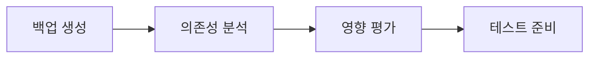

# 📐 Backend 레이어 마이그레이션 통합 규칙 문서

> Feature-First Architecture 적용을 위한 Backend Layer 통합 마이그레이션 규칙과 순서  
> 작성일: 2025-08-28 | 총 예상 기간: 4주

## 🎯 마이그레이션 핵심 목표

### 1. 아키텍처 목표
- **Repository Pattern 완성**: 데이터 접근 추상화 100% 구현
- **Clean Architecture**: 계층 간 명확한 경계와 의존성 역전
- **테스트 가능성**: Mock 가능한 구조로 85% 테스트 커버리지
- **캐싱 전략**: 3-Layer 캐싱으로 성능 최적화

### 2. 코드 품질 목표
- **인터페이스 기반**: 모든 Repository에 인터페이스 정의
- **타입 안전성**: 100% 타입 안전한 데이터 모델
- **에러 처리**: 통일된 에러 처리 시스템
- **중복 제거**: API 호출 로직 통합

## 🛡️ 마이그레이션 백업 규칙

### 1. Git 백업 전략
```bash
# 마이그레이션 시작 전 브랜치 생성
git checkout -b migration/backend-layer-$(date +%Y%m%d)
git tag -a backup/pre-backend-migration-$(date +%Y%m%d) -m "Before backend layer migration"

# 각 디렉토리별 체크포인트
git tag -a checkpoint/backend-[directory]-[step] -m "Checkpoint description"

# 예시
git tag -a checkpoint/backend-repositories-interfaces -m "Repository interfaces complete"
git tag -a checkpoint/backend-models-migration -m "Models migration complete"
```

### 2. 코드 백업 규칙
```dart
// 삭제 전 반드시 @deprecated 마킹
@deprecated
class OldRepository { }

// 아카이브 디렉토리 생성
lib/archive/backend/[date]/[removed-code]
```

### 3. 호환성 유지 규칙
```dart
// 임시 별칭 제공 (2주일 유지)
// lib/backend/repositories/user_repository.dart
@Deprecated('Use IUserRepository from domain layer')
typedef UserRepositoryLegacy = UserRepository;
```

## 📊 현재 상태 분석

### 디렉토리별 현황
| 디렉토리 | 파일 수 | 구현율 | 우선순위 | 예상 작업일 |
|----------|---------|--------|----------|-------------|
| **repositories** | 4 | 0% | 🔴 Critical | 10일 |
| **models** | 15+ | 60% | 🔴 Critical | 5일 |
| **firebase** | 8 | 90% | 🟡 Medium | 2일 |
| **api** | 3 | 70% | 🟡 Medium | 2일 |
| **algolia** | 2 | 80% | 🟢 Low | 1일 |

### 핵심 문제 매트릭스
| 문제 | 심각도 | 영향 범위 | 해결 우선순위 |
|------|--------|-----------|--------------|
| Repository 패턴 부재 | 🔴 매우 높음 | 전체 앱 | 1 |
| 직접 Firestore 호출 | 🔴 매우 높음 | UI Layer | 2 |
| 캐싱 전략 부재 | 🟡 중간 | 성능 | 3 |
| Models 분산 필요 | 🟡 중간 | 구조 | 4 |
| API 통합 미완성 | 🟢 낮음 | 검색 | 5 |

## 📋 마이그레이션 실행 순서

### Phase 0: 준비 단계 (Week 1, Day 1)


#### 체크리스트
- [ ] 전체 Backend 디렉토리 백업
- [ ] UI Layer의 직접 호출 분석
- [ ] Firebase 의존성 매핑
- [ ] 테스트 인프라 준비

### Phase 1: Repository 인터페이스 정의 (Week 1, Day 2-3)
**목표**: 모든 Repository 인터페이스 정의

#### Day 2: 인터페이스 설계
```
lib/features/[feature]/domain/repositories/
├── i_user_repository.dart
├── i_post_repository.dart
├── i_chat_repository.dart
└── i_media_repository.dart
```

#### Day 3: 공통 모델 정의
```
lib/backend/models/
├── base/
│   ├── repository_exception.dart
│   ├── repository_result.dart
│   └── pagination_params.dart
├── domain/
│   ├── user.dart
│   ├── post.dart
│   └── message.dart
```

#### 성공 기준
- ✅ 모든 Repository 인터페이스 정의
- ✅ 도메인 모델 정의
- ✅ 에러 처리 시스템 구축

### Phase 2: UserRepository 구현 (Week 1, Day 4-5 & Week 2, Day 1)
**목표**: 첫 번째 Repository 완전 구현

#### 실행 순서
1. **구현체 작성** (Day 4)
   ```dart
   class UserRepository implements IUserRepository {
     final FirebaseFirestore _firestore;
     final UnifiedCacheService _cache;
     final UserMapper _mapper;
   }
   ```

2. **캐싱 통합** (Day 5)
   ```dart
   // 3-Layer 캐싱 적용
   // L1: Memory Cache
   // L2: Hive Storage
   // L3: Firestore Offline
   ```

3. **테스트 작성** (Week 2, Day 1)
   ```dart
   // 85% 테스트 커버리지
   // Mock 시스템 구축
   // Integration 테스트
   ```

#### 성공 기준
- ✅ CRUD 작업 구현
- ✅ 캐싱 시스템 통합
- ✅ 테스트 커버리지 85%

### Phase 3: PostRepository 구현 (Week 2, Day 2-4)
**목표**: 복잡한 쿼리 처리 구현

#### 구현 내용
1. **기본 CRUD** (Day 2)
2. **Feed 쿼리** (Day 3)
   - Pagination
   - Filtering
   - Sorting
3. **투표 시스템** (Day 4)
   - 실시간 업데이트
   - 중복 방지
   - 결과 집계

#### 성공 기준
- ✅ 복잡한 쿼리 최적화
- ✅ 실시간 스트림 구현
- ✅ 투표 무결성 보장

### Phase 4: ChatRepository 구현 (Week 2, Day 5 & Week 3, Day 1-2)
**목표**: 실시간 채팅 시스템

#### 구현 내용
1. **메시지 관리** (Day 5)
2. **채팅방 관리** (Week 3, Day 1)
3. **AI 채팅 통합** (Week 3, Day 2)

#### 성공 기준
- ✅ 실시간 메시지 스트림
- ✅ 오프라인 지원
- ✅ AI 응답 처리

### Phase 5: MediaRepository 구현 (Week 3, Day 3-4)
**목표**: 미디어 관리 시스템

#### 구현 내용
1. **업로드 처리** (Day 3)
   - 이미지/비디오 업로드
   - 압축 및 최적화
   - 진행률 추적
2. **다운로드 처리** (Day 4)
   - 캐싱 시스템
   - 썸네일 생성

#### 성공 기준
- ✅ 효율적인 미디어 처리
- ✅ 업로드 진행률 추적
- ✅ 썸네일 자동 생성

### Phase 6: Models 마이그레이션 (Week 3, Day 5 & Week 4, Day 1)
**목표**: 모델을 적절한 Feature로 이동

#### 이동 계획
```
backend/models/users_model.dart → features/auth/domain/models/user.dart
backend/models/posts_model.dart → features/posts/domain/models/post.dart
backend/models/messages_model.dart → features/chat/domain/models/message.dart
backend/models/notifications_model.dart → features/notifications/domain/models/notification.dart
```

#### 성공 기준
- ✅ 모든 모델 Feature별 정리
- ✅ Backward compatibility 제공
- ✅ Import 경로 정리

### Phase 7: API & Firebase 정리 (Week 4, Day 2-3)
**목표**: API 통합 및 Firebase 설정 최적화

#### API 통합 (Day 2)
1. **Algolia 서비스 개선**
   - 검색 최적화
   - 인덱싱 자동화
2. **API 레이어 통합**
   - HTTP 클라이언트 통합
   - 에러 처리 통일

#### Firebase 정리 (Day 3)
1. **설정 파일 정리**
2. **Security Rules 최적화**
3. **인덱스 최적화**

### Phase 8: 테스트 및 검증 (Week 4, Day 4-5)
**목표**: 전체 Backend Layer 검증

#### Day 4: 통합 테스트
- Feature에서 Repository 사용 테스트
- 캐싱 효과 측정
- 성능 벤치마크

#### Day 5: 문서화
- API 문서 생성
- 사용 가이드 작성
- 마이그레이션 완료 보고서

## 🔧 코드 개선 규칙

### 1. Repository Pattern 규칙
```dart
// RULE 1: 모든 데이터 접근은 Repository를 통해
// ❌ Bad - UI에서 직접 Firestore 호출
FirebaseFirestore.instance.collection('users').doc(userId).get();

// ✅ Good - Repository 사용
final user = await userRepository.getUser(userId);
```

### 2. 인터페이스 정의 규칙
```dart
// RULE 2: 모든 Repository는 인터페이스 구현
// ❌ Bad
class UserRepository {
  // 직접 구현
}

// ✅ Good
abstract interface class IUserRepository {
  Future<User?> getUser(String userId);
}

class UserRepository implements IUserRepository {
  @override
  Future<User?> getUser(String userId) {
    // 구현
  }
}
```

### 3. 에러 처리 규칙
```dart
// RULE 3: 통일된 에러 처리
// ❌ Bad
try {
  // Firestore 호출
} catch (e) {
  print(e); // 단순 출력
}

// ✅ Good
try {
  // Repository 호출
} on RepositoryException catch (e) {
  // 구조화된 에러 처리
  logger.error(e.code, e.message);
  showError(e.userMessage);
}
```

### 4. 캐싱 규칙
```dart
// RULE 4: 3-Layer 캐싱 적용
// ✅ Good
Future<User?> getUser(String userId) async {
  // L1: Memory Cache
  final cached = _memoryCache.get(userId);
  if (cached != null) return cached;
  
  // L2: Local Storage
  final stored = await _localStorage.get(userId);
  if (stored != null) {
    _memoryCache.set(userId, stored);
    return stored;
  }
  
  // L3: Network
  final user = await _firestore.get(userId);
  await _localStorage.set(userId, user);
  _memoryCache.set(userId, user);
  return user;
}
```

### 5. 테스트 우선 규칙
```dart
// RULE 5: Repository 변경 전 테스트 작성
@GenerateMocks([IUserRepository, FirebaseFirestore])
void main() {
  test('should return user from cache when available', () async {
    // Given
    when(mockCache.get('user_123')).thenReturn(testUser);
    
    // When
    final user = await repository.getUser('user_123');
    
    // Then
    expect(user, equals(testUser));
    verifyNever(mockFirestore.collection(any));
  });
}
```

## 🚨 위험 관리 매트릭스

| 위험 요소 | 발생 확률 | 영향도 | 대응 방안 | 책임자 |
|----------|---------|-------|----------|--------|
| **UI Breaking Changes** | 높음 | 높음 | 점진적 마이그레이션, 별칭 제공 | 개발팀 |
| **캐시 동기화 문제** | 중간 | 중간 | TTL 설정, 무효화 전략 | 백엔드팀 |
| **성능 저하** | 낮음 | 높음 | 프로파일링, 최적화 | 성능팀 |
| **테스트 부족** | 중간 | 중간 | TDD 적용, CI/CD 통합 | QA팀 |
| **데이터 일관성** | 낮음 | 높음 | 트랜잭션, 검증 로직 | 아키텍트 |

## 🔄 롤백 전략

### 1. 즉시 롤백 (< 1시간)
```bash
# 최근 체크포인트로 롤백
git reset --hard checkpoint/backend-[directory]-[step]

// Feature Flag 사용
FeatureFlags.useNewRepository = false;
```

### 2. 부분 롤백 (< 1일)
```dart
// 특정 Repository만 롤백
class RepositoryConfig {
  static bool useNewUserRepo = false;   // 롤백
  static bool useNewPostRepo = true;    // 유지
  static bool useNewChatRepo = true;    // 유지
}
```

### 3. 전체 롤백 (< 1주)
```bash
# 마이그레이션 전 상태로 복원
git checkout backup/pre-backend-migration-[date]
git checkout -b hotfix/rollback-backend-migration
```

## 📊 성공 측정 지표

### 정량적 지표
- [ ] **구현 완성도**
  - Repository 구현율: 100% (4/4)
  - 테스트 커버리지: > 85%
  - 에러 처리: 100% 구조화

- [ ] **성능 지표**
  - API 응답 시간: < 200ms
  - 캐시 히트율: > 60%
  - 오프라인 지원: 100%

- [ ] **코드 품질**
  - 순환 의존성: 0개
  - 코드 중복: < 5%
  - 타입 안전성: 100%

### 정성적 지표
- [ ] UI Layer 분리 완성
- [ ] 개발 속도 30% 향상
- [ ] 테스트 가능성 향상
- [ ] 유지보수성 개선

## 🏁 최종 체크리스트

### Week 1 완료 조건
- [ ] Repository 인터페이스 100% 정의
- [ ] UserRepository 구현 시작
- [ ] 캐싱 시스템 설계
- [ ] 테스트 인프라 구축

### Week 2 완료 조건
- [ ] UserRepository 완성
- [ ] PostRepository 완성
- [ ] ChatRepository 구현 시작
- [ ] 테스트 커버리지 50%+

### Week 3 완료 조건
- [ ] ChatRepository 완성
- [ ] MediaRepository 완성
- [ ] Models 마이그레이션 완료
- [ ] 테스트 커버리지 75%+

### Week 4 완료 조건
- [ ] API/Firebase 정리
- [ ] 통합 테스트 완료
- [ ] 테스트 커버리지 85%+
- [ ] 문서화 100%

## 📚 참고 문서

### 디렉토리별 마이그레이션 가이드
- [Repositories Migration](./repositories/MIGRATION_Part3.md)
- [Models Migration](./models/MIGRATION_Part3.md)
- [Firebase Migration](./firebase/MIGRATION_Part3.md)
- [API Migration](./api/MIGRATION_Part3.md)
- [Algolia Migration](./algolia/MIGRATION_Part3.md)

### 테스트 가이드
- [Repositories Test Guide](./repositories/TEST.md)
- [Models Test Guide](./models/TEST.md)
- [Firebase Test Guide](./firebase/TEST.md)
- [API Test Guide](./api/TEST.md)
- [Algolia Test Guide](./algolia/TEST.md)

### 아키텍처 문서
- [Feature-First Architecture](/FEATURE_ARCHITECTURE.md)
- [Clean Architecture Guide](/CLEAN_ARCHITECTURE.md)
- [Core Layer Documentation](/lib/core/README.md)

## 🤝 책임 및 역할

| 역할 | 담당자 | 책임 범위 |
|-----|-------|----------|
| **아키텍트** | TBD | 전체 설계, Repository Pattern |
| **백엔드 리드** | TBD | Repository 구현 |
| **프론트엔드 리드** | TBD | UI Layer 마이그레이션 |
| **QA** | TBD | 테스트 작성 및 검증 |
| **DevOps** | TBD | CI/CD, 성능 모니터링 |

---

*이 문서는 Backend 레이어 전체 마이그레이션의 통합 규칙과 실행 순서를 정의합니다.*  
*4주간의 체계적인 마이그레이션으로 완전한 Repository Pattern과 Clean Architecture를 구축합니다.*