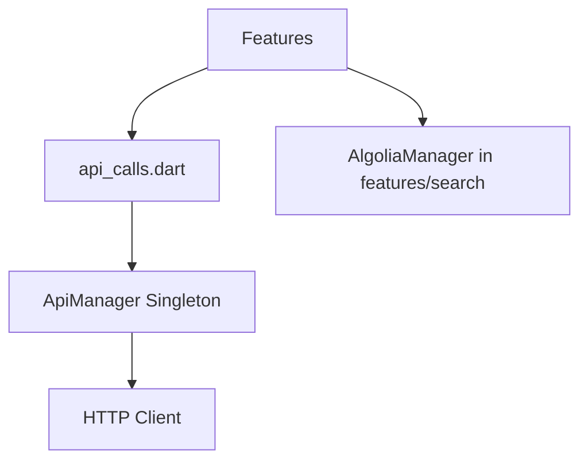

# 🔄 Backend API 레이어 마이그레이션 계획

> Feature-First Architecture 적용을 위한 API 레이어 리팩토링 가이드  
> 작성일: 2025-08-28 | 예상 기간: 5일

## 📌 현재 상태 분석

### 문제점 매트릭스

| 문제 영역 | 심각도 | 영향 범위 | 우선순위 |
|----------|--------|----------|----------|
| **API 키 하드코딩** | 🔴 Critical | 보안 | 1 |
| **싱글톤 패턴** | 🟡 High | 테스트, 유지보수 | 2 |
| **Feature 종속성** | 🟡 High | 아키텍처 | 3 |
| **에러 처리 부재** | 🟡 High | 안정성 | 4 |
| **테스트 불가능** | 🟡 High | 품질 | 5 |

### 현재 의존성 그래프



## 🎯 마이그레이션 목표

### 1. 아키텍처 목표
- **계층 분리**: Backend API는 순수 HTTP 클라이언트 역할만
- **의존성 주입**: GetIt을 통한 DI 패턴 적용
- **인터페이스 기반**: 모든 API 클라이언트 추상화
- **Feature 독립성**: 각 Feature가 자체 DataSource 보유

### 2. 품질 목표
- **테스트 커버리지**: 85% 이상
- **타입 안전성**: 100% (no dynamic)
- **보안**: 모든 API 키 환경 변수화
- **문서화**: 100% API 문서

## 📐 목표 아키텍처

```
/lib/backend/api/
├── core/                        # 핵심 API 시스템
│   ├── interfaces/
│   │   ├── i_http_client.dart      # HTTP 클라이언트 인터페이스
│   │   ├── i_api_interceptor.dart  # 인터셉터 인터페이스
│   │   └── i_api_cache.dart        # 캐시 인터페이스
│   ├── models/
│   │   ├── api_request.dart        # 요청 모델
│   │   ├── api_response.dart       # 응답 모델
│   │   └── api_exception.dart      # 예외 모델
│   └── constants/
│       ├── http_methods.dart       # HTTP 메서드 상수
│       └── status_codes.dart       # 상태 코드 상수
│
├── clients/                     # 구체적 구현
│   ├── http_client.dart           # 기본 HTTP 클라이언트
│   ├── dio_client.dart            # Dio 기반 클라이언트 (권장)
│   └── mock_client.dart           # 테스트용 Mock 클라이언트
│
├── interceptors/                # 요청/응답 처리
│   ├── auth_interceptor.dart     # 인증 토큰 자동 추가
│   ├── logging_interceptor.dart  # 로깅
│   ├── retry_interceptor.dart    # 재시도 로직
│   └── error_interceptor.dart    # 에러 처리
│
├── cache/                       # 캐싱 시스템
│   ├── memory_cache.dart         # 메모리 캐시
│   ├── disk_cache.dart           # 디스크 캐시
│   └── cache_manager.dart        # 캐시 관리
│
├── config/                      # 설정
│   ├── api_config.dart          # API 설정
│   ├── environment.dart         # 환경별 설정
│   └── endpoints.dart           # 엔드포인트 정의
│
└── di/                          # 의존성 주입
    └── api_module.dart          # DI 모듈 설정

/lib/features/encoder/
└── data/
    ├── datasources/
    │   └── encoder_remote_datasource.dart
    └── repositories/
        └── encoder_repository_impl.dart

/lib/features/search/
└── data/
    ├── datasources/
    │   └── search_remote_datasource.dart
    └── repositories/
        └── search_repository_impl.dart
```

## 📋 마이그레이션 단계

### Phase 1: 기반 구조 구축 (Day 1)

#### 1.1 패키지 설치
```yaml
dependencies:
  dio: ^5.3.0
  retrofit: ^4.0.0
  pretty_dio_logger: ^1.3.0
  dio_cache_interceptor: ^3.4.0
  flutter_dotenv: ^5.1.0
```

#### 1.2 인터페이스 정의
```dart
// lib/backend/api/core/interfaces/i_http_client.dart
abstract class IHttpClient {
  Future<ApiResponse<T>> get<T>(
    String path, {
    Map<String, dynamic>? queryParameters,
    Options? options,
  });
  
  Future<ApiResponse<T>> post<T>(
    String path, {
    dynamic data,
    Map<String, dynamic>? queryParameters,
    Options? options,
  });
  
  Future<ApiResponse<T>> put<T>(String path, {dynamic data});
  Future<ApiResponse<T>> delete<T>(String path);
  Future<ApiResponse<T>> patch<T>(String path, {dynamic data});
}
```

#### 1.3 모델 정의
```dart
// lib/backend/api/core/models/api_response.dart
class ApiResponse<T> {
  final T? data;
  final int statusCode;
  final String? message;
  final Map<String, String> headers;
  
  bool get isSuccess => statusCode >= 200 && statusCode < 300;
  
  ApiResponse.success({
    required this.data,
    this.statusCode = 200,
    this.message,
    this.headers = const {},
  });
  
  ApiResponse.error({
    this.data,
    required this.statusCode,
    required this.message,
    this.headers = const {},
  });
}
```

### Phase 2: Dio 클라이언트 구현 (Day 2)

#### 2.1 Dio 클라이언트
```dart
// lib/backend/api/clients/dio_client.dart
@LazySingleton(as: IHttpClient)
class DioClient implements IHttpClient {
  late final Dio _dio;
  
  DioClient({required ApiConfig config}) {
    _dio = Dio(BaseOptions(
      baseUrl: config.baseUrl,
      connectTimeout: config.connectTimeout,
      receiveTimeout: config.receiveTimeout,
    ));
    
    _setupInterceptors();
  }
  
  void _setupInterceptors() {
    _dio.interceptors.addAll([
      AuthInterceptor(),
      LoggingInterceptor(),
      RetryInterceptor(),
      ErrorInterceptor(),
      CacheInterceptor(),
    ]);
  }
  
  @override
  Future<ApiResponse<T>> get<T>(
    String path, {
    Map<String, dynamic>? queryParameters,
    Options? options,
  }) async {
    try {
      final response = await _dio.get<T>(
        path,
        queryParameters: queryParameters,
        options: options,
      );
      return ApiResponse.success(
        data: response.data,
        statusCode: response.statusCode!,
        headers: response.headers.map,
      );
    } on DioException catch (e) {
      return _handleError<T>(e);
    }
  }
  
  ApiResponse<T> _handleError<T>(DioException error) {
    return ApiResponse.error(
      statusCode: error.response?.statusCode ?? 500,
      message: _getErrorMessage(error),
    );
  }
}
```

#### 2.2 인터셉터 구현
```dart
// lib/backend/api/interceptors/auth_interceptor.dart
class AuthInterceptor extends Interceptor {
  final IAuthService _authService = getIt<IAuthService>();
  
  @override
  void onRequest(RequestOptions options, RequestInterceptorHandler handler) async {
    final token = await _authService.getAccessToken();
    if (token != null) {
      options.headers['Authorization'] = 'Bearer $token';
    }
    super.onRequest(options, handler);
  }
  
  @override
  void onError(DioException err, ErrorInterceptorHandler handler) async {
    if (err.response?.statusCode == 401) {
      // Token refresh logic
      final newToken = await _authService.refreshToken();
      if (newToken != null) {
        // Retry with new token
        final opts = err.requestOptions;
        opts.headers['Authorization'] = 'Bearer $newToken';
        final response = await _dio.fetch(opts);
        return handler.resolve(response);
      }
    }
    super.onError(err, handler);
  }
}
```

### Phase 3: 환경 설정 시스템 (Day 3)

#### 3.1 환경 설정
```dart
// lib/backend/api/config/environment.dart
enum Environment {
  development,
  staging,
  production,
}

class EnvironmentConfig {
  static Environment _environment = Environment.development;
  
  static void setEnvironment(Environment env) {
    _environment = env;
  }
  
  static String get baseUrl {
    switch (_environment) {
      case Environment.development:
        return 'https://dev-api.versusspace.com';
      case Environment.staging:
        return 'https://staging-api.versusspace.com';
      case Environment.production:
        return 'https://api.versusspace.com';
    }
  }
  
  static String get algoliaAppId => dotenv.env['ALGOLIA_APP_ID']!;
  static String get algoliaApiKey => dotenv.env['ALGOLIA_API_KEY']!;
  static String get encoderApiUrl => dotenv.env['ENCODER_API_URL']!;
}
```

#### 3.2 API 설정
```dart
// lib/backend/api/config/api_config.dart
@injectable
class ApiConfig {
  final String baseUrl;
  final Duration connectTimeout;
  final Duration receiveTimeout;
  final bool enableLogging;
  final bool enableCache;
  
  ApiConfig({
    required this.baseUrl,
    this.connectTimeout = const Duration(seconds: 30),
    this.receiveTimeout = const Duration(seconds: 30),
    this.enableLogging = kDebugMode,
    this.enableCache = true,
  });
  
  factory ApiConfig.fromEnvironment() {
    return ApiConfig(
      baseUrl: EnvironmentConfig.baseUrl,
      enableLogging: EnvironmentConfig.environment != Environment.production,
    );
  }
}
```

### Phase 4: Feature DataSource 마이그레이션 (Day 4)

#### 4.1 Encoder DataSource
```dart
// lib/features/encoder/data/datasources/encoder_remote_datasource.dart
abstract class EncoderRemoteDataSource {
  Future<String> getUploadUrl(String fileName, String contentType);
  Future<void> requestEncoding(EncodingRequest request);
}

@LazySingleton(as: EncoderRemoteDataSource)
class EncoderRemoteDataSourceImpl implements EncoderRemoteDataSource {
  final IHttpClient _client;
  
  EncoderRemoteDataSourceImpl(this._client);
  
  @override
  Future<String> getUploadUrl(String fileName, String contentType) async {
    final response = await _client.post<Map<String, dynamic>>(
      '/generate-upload-url',
      data: {
        'fileName': fileName,
        'contentType': contentType,
      },
    );
    
    if (response.isSuccess) {
      return response.data!['signedUrl'];
    }
    throw ApiException(response.message ?? 'Failed to get upload URL');
  }
  
  @override
  Future<void> requestEncoding(EncodingRequest request) async {
    final response = await _client.post<void>(
      '/encode',
      data: request.toJson(),
    );
    
    if (!response.isSuccess) {
      throw ApiException(response.message ?? 'Encoding request failed');
    }
  }
}
```

#### 4.2 Search DataSource 마이그레이션
```dart
// lib/features/search/data/datasources/search_remote_datasource.dart
abstract class SearchRemoteDataSource {
  Future<List<SearchResult>> search(String query);
  Future<List<String>> getSuggestions(String query);
}

@LazySingleton(as: SearchRemoteDataSource)
class AlgoliaSearchDataSource implements SearchRemoteDataSource {
  final IHttpClient _client;
  final String _appId;
  final String _apiKey;
  
  AlgoliaSearchDataSource(
    this._client,
    @Named('algoliaAppId') this._appId,
    @Named('algoliaApiKey') this._apiKey,
  );
  
  @override
  Future<List<SearchResult>> search(String query) async {
    final response = await _client.post<Map<String, dynamic>>(
      'https://$_appId-dsn.algolia.net/1/indexes/posts/query',
      data: {'query': query},
      options: Options(headers: {
        'X-Algolia-API-Key': _apiKey,
        'X-Algolia-Application-Id': _appId,
      }),
    );
    
    if (response.isSuccess) {
      final hits = response.data!['hits'] as List;
      return hits.map((hit) => SearchResult.fromJson(hit)).toList();
    }
    throw ApiException('Search failed');
  }
}
```

### Phase 5: DI 설정 및 테스트 (Day 5)

#### 5.1 DI 모듈
```dart
// lib/backend/api/di/api_module.dart
@module
abstract class ApiModule {
  @lazySingleton
  ApiConfig provideApiConfig() => ApiConfig.fromEnvironment();
  
  @lazySingleton
  @Named('algoliaAppId')
  String provideAlgoliaAppId() => EnvironmentConfig.algoliaAppId;
  
  @lazySingleton
  @Named('algoliaApiKey')
  String provideAlgoliaApiKey() => EnvironmentConfig.algoliaApiKey;
}
```

#### 5.2 테스트 설정
```dart
// test/backend/api/dio_client_test.dart
void main() {
  group('DioClient', () {
    late MockDio mockDio;
    late DioClient client;
    
    setUp(() {
      mockDio = MockDio();
      client = DioClient(
        config: ApiConfig(baseUrl: 'https://test.com'),
        dio: mockDio,
      );
    });
    
    test('should add auth token to headers', () async {
      // Given
      when(mockAuthService.getAccessToken()).thenAnswer((_) async => 'token123');
      
      // When
      await client.get('/test');
      
      // Then
      verify(mockDio.get(
        '/test',
        options: argThat(
          isA<Options>().having(
            (o) => o.headers!['Authorization'],
            'auth header',
            'Bearer token123',
          ),
        ),
      ));
    });
  });
}
```

## 🔄 마이그레이션 순서

### Step 1: 브랜치 생성 및 백업
```bash
git checkout -b migration/api-layer-$(date +%Y%m%d)
git tag -a backup/pre-api-migration -m "Before API migration"
```

### Step 2: 패키지 설치
```bash
flutter pub add dio retrofit pretty_dio_logger dio_cache_interceptor flutter_dotenv
flutter pub add -d retrofit_generator build_runner mockito
```

### Step 3: 코드 마이그레이션
1. **Day 1**: 인터페이스 및 모델 생성
2. **Day 2**: Dio 클라이언트 구현
3. **Day 3**: 환경 설정 시스템
4. **Day 4**: Feature DataSource 마이그레이션
5. **Day 5**: DI 설정 및 테스트

### Step 4: 기존 코드 교체
```dart
// Before
final response = await ApiManager.instance.makeApiCall(...);

// After
final encoderDataSource = getIt<EncoderRemoteDataSource>();
final uploadUrl = await encoderDataSource.getUploadUrl(fileName, contentType);
```

### Step 5: 테스트 및 검증
```bash
flutter test test/backend/api/
flutter test test/features/encoder/
flutter test test/features/search/
```

## 🧹 정리 작업

### 제거할 파일
```
lib/backend/api/rest/
├── api_calls.dart         # → features/*/data/datasources로 이동
├── api_manager.dart       # → clients/dio_client.dart로 대체
└── get_streamed_response.dart  # → Dio가 자체 지원
```

### 아카이브
```bash
# 백업 생성
mkdir -p lib/archive/backend/api/$(date +%Y%m%d)
cp -r lib/backend/api/rest/* lib/archive/backend/api/$(date +%Y%m%d)/

# @deprecated 마킹 (1주일 유지)
echo "// @deprecated - Will be removed after migration" >> lib/backend/api/rest/api_manager.dart
```

## ✅ 체크리스트

### Pre-Migration
- [ ] 모든 API 호출 사용처 파악
- [ ] 테스트 환경 준비
- [ ] .env 파일 설정
- [ ] 백업 생성

### Migration
- [ ] Dio 클라이언트 구현
- [ ] 인터셉터 구현
- [ ] 환경 설정 시스템 구현
- [ ] Encoder DataSource 마이그레이션
- [ ] Search DataSource 마이그레이션
- [ ] DI 설정

### Post-Migration
- [ ] 모든 테스트 통과
- [ ] 기존 코드 제거
- [ ] 문서 업데이트
- [ ] 성능 테스트

## 📊 예상 결과

### Before
```dart
// 하드코딩, 싱글톤, 테스트 불가능
ApiManager.instance.makeApiCall(
  apiUrl: 'https://hardcoded.url',
  headers: {'X-API-Key': 'hardcoded_key'},
);
```

### After
```dart
// DI, 환경 설정, 테스트 가능
@injectable
class PostRepository {
  final EncoderRemoteDataSource _encoderDataSource;
  
  PostRepository(this._encoderDataSource);
  
  Future<void> uploadVideo(File video) async {
    final url = await _encoderDataSource.getUploadUrl(
      video.name,
      'video/mp4',
    );
    // 업로드 로직
  }
}
```

## 🎯 성공 지표

| 지표 | 현재 | 목표 | 검증 방법 |
|-----|------|------|----------|
| **테스트 커버리지** | 0% | 85% | `flutter test --coverage` |
| **API 키 하드코딩** | 3개 | 0개 | `grep -r "API.*Key" lib/` |
| **싱글톤 사용** | 1개 | 0개 | 코드 리뷰 |
| **타입 안전성** | 60% | 100% | `flutter analyze` |
| **응답 시간** | 기준선 | -20% | 성능 테스트 |

## 🚨 위험 관리

| 위험 | 발생 확률 | 영향도 | 대응 방안 |
|-----|----------|--------|----------|
| **API 호환성 깨짐** | 중간 | 높음 | 점진적 마이그레이션, Feature Flag |
| **성능 저하** | 낮음 | 중간 | 프로파일링, 캐싱 최적화 |
| **테스트 실패** | 중간 | 중간 | Mock 서버 구축, 통합 테스트 |

## 🔄 롤백 계획

### 즉시 롤백 (< 1시간)
```dart
// Feature Flag 사용
if (FeatureFlags.useNewApiClient) {
  // 새 구현
  return getIt<EncoderRemoteDataSource>().getUploadUrl();
} else {
  // 기존 구현
  return EncoderGroup.getUploadUrlCall.call();
}
```

### 완전 롤백
```bash
git checkout backup/pre-api-migration
git checkout -b hotfix/api-rollback
```

---

*이 문서는 Backend API 레이어의 Feature-First Architecture 마이그레이션 계획입니다.*  
*5일간의 체계적인 마이그레이션으로 테스트 가능하고 확장 가능한 API 레이어를 구축합니다.*