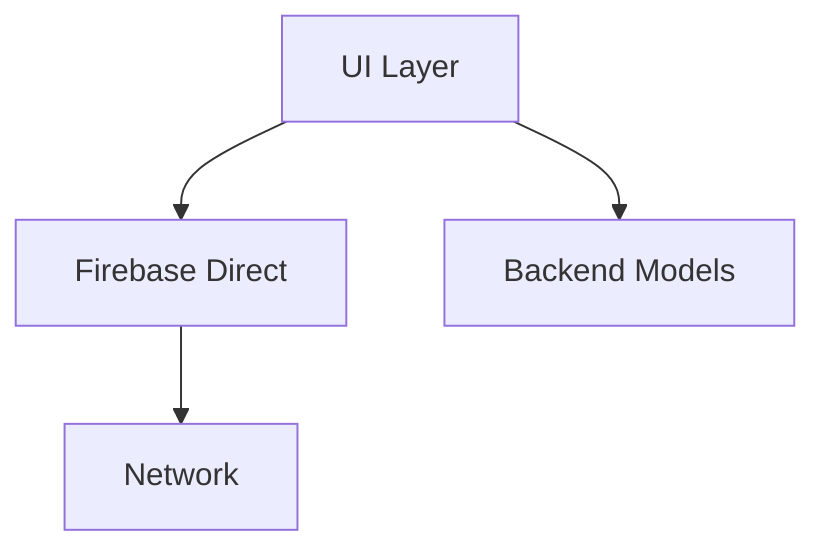
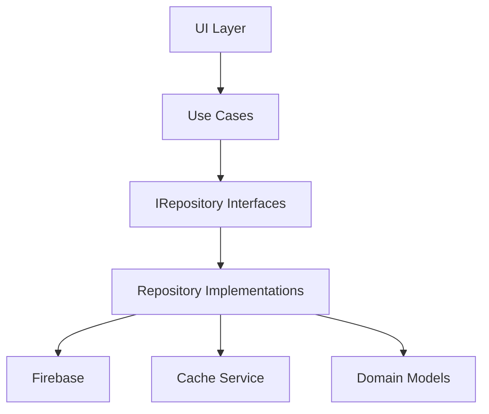

# 📚 Backend Repositories 레이어

> Versus Space 앱의 데이터 접근 추상화 레이어  
> 최종 업데이트: 2025-08-28 | 버전: 1.0.0

## 📋 개요

Backend Repositories 레이어는 데이터 소스와 비즈니스 로직 사이의 추상화 계층으로 설계되었습니다. 현재는 모든 파일이 TODO 상태로 구현이 필요한 상태입니다. Repository 패턴을 통해 데이터 접근 로직을 중앙화하고 테스트 가능한 구조를 만드는 것이 목표입니다.

## 🏗️ 현재 디렉토리 구조

```
/lib/backend/repositories/
├── README.md                    # 이 문서
├── post_repository.dart         # TODO - 게시물 데이터 접근
├── user_repository.dart         # TODO - 사용자 데이터 접근
├── chat_repository.dart         # TODO - 채팅 데이터 접근
└── media_repository.dart        # TODO - 미디어 데이터 접근
```

## 📊 구현 상태 분석

| 파일 | 상태 | 우선순위 | 의존성 | 예상 작업일 |
|------|------|---------|--------|------------|
| **user_repository.dart** | ❌ TODO | 🔴 Critical | AuthService, UsersModel | 3일 |
| **post_repository.dart** | ❌ TODO | 🔴 Critical | PostsModel, VotingService | 4일 |
| **chat_repository.dart** | ❌ TODO | 🟡 High | MessagesModel, CacheService | 3일 |
| **media_repository.dart** | ❌ TODO | 🟡 High | Firebase Storage, ImageService | 2일 |

## 🚨 현재 문제점

### 1. Repository 패턴 부재 🔴 심각
```dart
// 현재 상황: 직접 Firestore 호출
// /lib/features/posts/presentation/screens/feed/home_page_widget.dart
FirebaseFirestore.instance
    .collection('posts')
    .orderBy('createdAt', descending: true)
    .limit(20)
    .get();
```
**문제**: 
- 데이터 접근 로직이 UI 레이어에 산재
- 테스트 불가능한 구조
- 중복 코드 발생
- 비즈니스 로직과 데이터 로직 혼재

### 2. 의존성 역전 원칙 위반 🔴 심각
```dart
// UI가 구체적인 구현에 의존
import 'package:cloud_firestore/cloud_firestore.dart';
```
**영향**: 
- Firebase 변경 시 전체 앱 수정 필요
- Mock 테스트 불가능
- 유지보수성 저하

### 3. 캐싱 전략 부재 🟡 중간
```dart
// 매번 네트워크 호출
// 캐싱 로직 없음
```
**영향**: 
- 불필요한 네트워크 비용
- 느린 앱 반응 속도
- 오프라인 지원 불가

### 4. 에러 처리 일관성 부재 🟡 중간
```dart
// 각자 다른 에러 처리
try {
  // Firestore 호출
} catch (e) {
  print(e); // 단순 출력
}
```
**영향**: 
- 예측 불가능한 에러 동작
- 사용자 경험 저하
- 디버깅 어려움

## 🎯 설계 목표

### 1. Clean Architecture 준수
```
Presentation Layer (UI)
    ↓ (의존)
Domain Layer (Use Cases)
    ↓ (의존)
Data Layer (Repositories) ← 현재 위치
    ↓ (의존)
Infrastructure Layer (Firebase, APIs)
```

### 2. Repository 패턴 구현
```dart
// 인터페이스 정의
abstract class IUserRepository {
  Future<User?> getUser(String userId);
  Future<void> updateUser(User user);
  Stream<User> watchUser(String userId);
}

// 구체적 구현
class UserRepository implements IUserRepository {
  final FirebaseFirestore _firestore;
  final UnifiedCacheService _cache;
  
  // DI를 통한 의존성 주입
}
```

### 3. Feature-First Architecture 통합
```
/lib/features/auth/
├── data/
│   └── repositories/
│       └── auth_repository.dart    # Feature 전용 Repository
└── domain/
    └── repositories/
        └── i_auth_repository.dart  # 인터페이스
```

## 📦 계획된 Repository 구조

### 1. UserRepository
```dart
class UserRepository implements IUserRepository {
  // 핵심 메서드
  Future<User?> getUser(String userId);
  Future<List<User>> getUsers(List<String> userIds);
  Future<void> createUser(User user);
  Future<void> updateUser(User user);
  Future<void> deleteUser(String userId);
  
  // 스트림
  Stream<User> watchUser(String userId);
  Stream<List<User>> watchUsers();
  
  // 특수 쿼리
  Future<List<User>> searchUsers(String query);
  Future<List<User>> getUsersByInterests(List<String> interests);
  Future<User?> getUserByEmail(String email);
}
```

### 2. PostRepository
```dart
class PostRepository implements IPostRepository {
  // CRUD 작업
  Future<Post?> getPost(String postId);
  Future<void> createPost(Post post);
  Future<void> updatePost(Post post);
  Future<void> deletePost(String postId);
  
  // 피드 관련
  Future<List<Post>> getFeedPosts({int limit, DocumentSnapshot? startAfter});
  Future<List<Post>> getUserPosts(String userId);
  Future<List<Post>> getTrendingPosts();
  
  // 투표 관련
  Future<void> vote(String postId, String userId, VoteOption option);
  Future<VoteResult> getVoteResults(String postId);
  
  // 상호작용
  Future<void> likePost(String postId, String userId);
  Future<void> unlikePost(String postId, String userId);
  Future<void> sharePost(String postId);
}
```

### 3. ChatRepository
```dart
class ChatRepository implements IChatRepository {
  // 메시지 관리
  Future<void> sendMessage(Message message);
  Future<List<Message>> getMessages(String chatId, {int limit});
  Future<void> deleteMessage(String messageId);
  
  // 채팅방 관리
  Future<Chat?> getChat(String chatId);
  Future<Chat> createChat(List<String> participants);
  Future<List<Chat>> getUserChats(String userId);
  
  // 실시간 기능
  Stream<List<Message>> watchMessages(String chatId);
  Stream<List<Chat>> watchUserChats(String userId);
  
  // AI 채팅
  Future<void> sendToAIChat(String userId, String message);
  Future<AIResponse> getAIResponse(String prompt);
}
```

### 4. MediaRepository
```dart
class MediaRepository implements IMediaRepository {
  // 업로드
  Future<String> uploadImage(File image, {String? path});
  Future<String> uploadVideo(File video, {String? path});
  Future<List<String>> uploadMultipleImages(List<File> images);
  
  // 다운로드
  Future<File?> downloadFile(String url);
  Future<Uint8List?> getImageBytes(String url);
  
  // 삭제
  Future<void> deleteFile(String url);
  Future<void> deleteMultipleFiles(List<String> urls);
  
  // 썸네일
  Future<String> generateThumbnail(String videoUrl);
  Future<String> resizeImage(String imageUrl, {int width, int height});
}
```

## 🔗 의존성 관계

### 현재 의존성 (문제 상태)


### 목표 의존성 (Repository 패턴)


## 💡 사용 예시

### 현재 방식 (직접 Firestore 호출)
```dart
// ❌ Bad - UI에서 직접 데이터 접근
class HomePageWidget extends ConsumerWidget {
  Future<void> loadPosts() async {
    final posts = await FirebaseFirestore.instance
        .collection('posts')
        .orderBy('createdAt')
        .limit(20)
        .get();
    
    // UI 업데이트
  }
}
```

### Repository 패턴 적용 후
```dart
// ✅ Good - Repository를 통한 데이터 접근
class HomePageWidget extends ConsumerWidget {
  final IPostRepository _postRepository = getIt<IPostRepository>();
  
  Future<void> loadPosts() async {
    try {
      final posts = await _postRepository.getFeedPosts(limit: 20);
      // UI 업데이트
    } on RepositoryException catch (e) {
      // 일관된 에러 처리
      showError(e.userMessage);
    }
  }
}
```

### 테스트 가능한 구조
```dart
// Mock Repository로 테스트
class MockPostRepository implements IPostRepository {
  @override
  Future<List<Post>> getFeedPosts({int limit, DocumentSnapshot? startAfter}) {
    // 테스트 데이터 반환
    return Future.value([
      Post(id: '1', title: 'Test Post 1'),
      Post(id: '2', title: 'Test Post 2'),
    ]);
  }
}

// 테스트 코드
test('should load feed posts', () async {
  final mockRepo = MockPostRepository();
  final viewModel = FeedViewModel(mockRepo);
  
  await viewModel.loadPosts();
  
  expect(viewModel.posts.length, 2);
});
```

## 🔧 구현 전략

### Phase 1: 인터페이스 정의 (1일)
- Repository 인터페이스 정의
- Domain 모델 정의
- Exception 클래스 정의

### Phase 2: 기본 구현 (3일)
- Firebase 연동 구현
- 기본 CRUD 작업 구현
- 에러 처리 구현

### Phase 3: 캐싱 통합 (2일)
- UnifiedCacheService 통합
- 캐싱 전략 구현
- 오프라인 지원 추가

### Phase 4: 고급 기능 (2일)
- 페이지네이션 구현
- 실시간 스트림 구현
- 복잡한 쿼리 구현

### Phase 5: 마이그레이션 (3일)
- 기존 코드를 Repository 사용으로 전환
- 테스트 작성
- 문서화

## 📊 메트릭

| 지표 | 현재 | 목표 |
|-----|------|------|
| **구현률** | 0% | 100% |
| **테스트 커버리지** | 0% | 85% |
| **코드 중복** | 높음 | 최소화 |
| **의존성 결합도** | 강결합 | 약결합 |
| **캐싱 효율** | 0% | 70% |

## ⚠️ 주의사항

1. **Backward Compatibility**: 기존 코드가 동작하도록 점진적 마이그레이션
2. **Performance**: 캐싱과 배치 처리로 성능 최적화
3. **Error Handling**: 일관된 에러 처리 및 사용자 친화적 메시지
4. **Testing**: 모든 public 메서드에 대한 테스트 작성
5. **Documentation**: 각 메서드에 대한 명확한 문서화

## 🔗 관련 문서

- [Backend 전체 구조](../README.md)
- [Models 레이어](../models/README.md)
- [Firebase 설정](../firebase/README.md)
- [마이그레이션 계획](./MIGRATION_Part3.md)
- [테스트 가이드](./TEST.md)

---

*이 문서는 Backend Repositories 레이어의 현재 상태와 구현 계획을 설명합니다.*