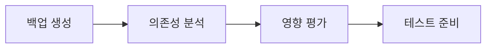

# 📐 Core 레이어 마이그레이션 통합 규칙 문서

> Feature-First Architecture 적용을 위한 Core Layer 통합 마이그레이션 규칙과 순서  
> 작성일: 2025-08-28 | 총 예상 기간: 3주

## 🎯 마이그레이션 핵심 목표

### 1. 아키텍처 목표
- **계층 무결성**: Core → Feature 의존성 완전 제거
- **재사용성**: 모든 Feature가 공유 가능한 순수 Core
- **모듈화**: 카테고리별 체계적인 구조
- **테스트 가능성**: 85% 이상 테스트 커버리지 달성

### 2. 코드 품질 목표
- **파일 크기**: 단일 파일 최대 300줄 이하
- **순환 의존성**: 0개 
- **네이밍 통일**: Versus 접두사로 100% 통일
- **중복 제거**: 비디오 플레이어 1개로 통합

## 🛡️ 마이그레이션 백업 규칙

### 1. Git 백업 전략
```bash
# 마이그레이션 시작 전 브랜치 생성
git checkout -b migration/core-layer-$(date +%Y%m%d)
git tag -a backup/pre-core-migration-$(date +%Y%m%d) -m "Before core layer migration"

# 각 디렉토리별 체크포인트
git tag -a checkpoint/core-[directory]-[step] -m "Checkpoint description"

# 예시
git tag -a checkpoint/core-actions-interfaces -m "Actions interfaces complete"
git tag -a checkpoint/core-widgets-categorized -m "Widgets categorization complete"
```

### 2. 코드 백업 규칙
```dart
// 삭제 전 반드시 @deprecated 마킹
@deprecated
class OldVideoPlayer { }

// 아카이브 디렉토리 생성
lib/archive/core/[date]/[removed-code]
```

### 3. 호환성 유지 규칙
```dart
// 임시 별칭 제공 (1주일 유지)
// lib/core/widgets/app_widgets.dart
@Deprecated('Use VersusButton instead')
typedef AppButtonWidget = VersusButton;
```

## 📊 현재 상태 분석

### 디렉토리별 현황
| 디렉토리 | 파일 수 | 총 줄 수 | 구현율 | 우선순위 | 예상 작업일 |
|----------|---------|----------|--------|----------|-------------|
| **actions** | 1 | 14 | 11% | 🔴 Critical | 2일 |
| **animations** | 11 | 2,083 | 100% | 🟢 Complete | 0.5일 |
| **constants** | 1 | 26 | 100% | 🟢 Complete | 0일 |
| **design_system** | 15 | 3,412 | 60% | 🟡 High | 3일 |
| **localization** | 1 | 2,419 | 100% | 🟢 Complete | 0일 |
| **models** | 3 | 293 | 80% | 🟡 Medium | 1일 |
| **theme** | 6 | 892 | 100% | 🟢 Complete | 0.5일 |
| **utils** | 26 | 3,547 | 100% | 🟢 Complete | 1일 |
| **widgets** | 18 | 2,941 | 70% | 🟡 High | 3일 |

### 핵심 문제 매트릭스
| 문제 | 심각도 | 영향 범위 | 해결 우선순위 |
|------|--------|-----------|--------------|
| Core → Feature 의존성 | 🔴 매우 높음 | Actions | 1 |
| Actions 89% 미구현 | 🔴 매우 높음 | 전체 앱 | 2 |
| 위젯 구조화 부재 | 🟡 중간 | Widgets | 3 |
| Design System 미완성 | 🟡 중간 | UI 일관성 | 4 |
| 비디오 플레이어 중복 | 🟢 낮음 | Media | 5 |

## 📋 마이그레이션 실행 순서

### Phase 0: 준비 단계 (Day 1)


#### 체크리스트
- [ ] 전체 Core 디렉토리 백업
- [ ] 의존성 그래프 생성
- [ ] Feature → Core 사용 분석
- [ ] 테스트 인프라 준비

### Phase 1: Actions 시스템 구축 (Week 1, Day 2-3)
**목표**: 인터페이스 기반 액션 시스템 구축

#### Day 2: 인터페이스 및 모델 정의
```
lib/core/actions/
├── interfaces/
│   ├── i_action.dart
│   ├── i_app_action.dart
│   ├── i_url_action.dart
│   └── i_share_action.dart
├── models/
│   ├── action_result.dart
│   ├── action_context.dart
│   └── action_exception.dart
└── constants/
    └── action_types.dart
```

#### Day 3: Services 레이어 구현
```
lib/services/actions/
├── app_actions_service.dart
├── url_actions_service.dart
├── share_actions_service.dart
├── clipboard_actions_service.dart
├── file_actions_service.dart
├── permission_actions_service.dart
├── error_actions_service.dart
├── analytics_actions_service.dart
└── notification_actions_service.dart
```

#### 성공 기준
- ✅ Core → Feature 의존성 0개
- ✅ 모든 액션 인터페이스 구현
- ✅ 테스트 커버리지 95%

### Phase 2: Widgets 카테고리화 (Week 1, Day 4-5 & Week 2, Day 1)
**목표**: 18개 위젯을 6개 카테고리로 정리

#### 실행 순서
1. **디렉토리 구조 생성** (Day 4 오전)
   ```bash
   mkdir -p lib/core/widgets/{buttons,inputs,media,feedback,layout,specialized}
   ```

2. **네이밍 변경 및 이동** (Day 4 오후 - Day 5)
   ```dart
   // App* → Versus* 변경
   app_widgets.dart → buttons/versus_button.dart
   app_icon_button.dart → buttons/versus_icon_button.dart
   highlighted_text_field.dart → inputs/highlighted_text_field.dart
   ```

3. **중복 제거** (Week 2, Day 1)
   - 3개 비디오 플레이어 → 1개 통합 플레이어
   - editviedo → editvideo 철자 수정

#### 성공 기준
- ✅ 모든 위젯 카테고리화
- ✅ Versus 네이밍 100%
- ✅ 중복 코드 제거

### Phase 3: Design System 완성 (Week 2, Day 2-4)
**목표**: 컴포넌트 라이브러리 구축

#### 구조 생성
```
lib/core/design_system/
├── components/
│   ├── buttons/
│   │   ├── primary_button.dart
│   │   ├── secondary_button.dart
│   │   └── text_button.dart
│   ├── cards/
│   │   ├── content_card.dart
│   │   └── versus_card.dart
│   ├── forms/
│   │   ├── form_field.dart
│   │   └── form_validators.dart
│   └── dialogs/
│       ├── confirmation_dialog.dart
│       └── alert_dialog.dart
├── tokens/
│   ├── colors.dart
│   ├── spacing.dart
│   ├── typography.dart
│   └── shadows.dart
└── themes/
    ├── light_theme.dart
    └── dark_theme.dart
```

#### 성공 기준
- ✅ 20+ 컴포넌트 구현
- ✅ 디자인 토큰 100% 정의
- ✅ Storybook 문서화

### Phase 4: 완성된 디렉토리 정리 (Week 2, Day 5)
**목표**: 이미 완성된 디렉토리 최적화

#### 작업 내용
1. **Animations** (오전)
   - 테스트 추가 (목표 80%)
   - 문서 업데이트

2. **Utils** (오후)
   - 카테고리별 정리
   - 중복 유틸리티 제거
   - 테스트 추가 (목표 85%)

#### 성공 기준
- ✅ 테스트 커버리지 목표 달성
- ✅ 문서 100% 업데이트

### Phase 5: Models 정리 (Week 3, Day 1)
**목표**: 모델 구조 정리 및 이동

#### 실행 순서
1. **action.dart 이동**
   ```
   core/models/action.dart → core/actions/models/action_model.dart
   ```

2. **data_map_model.dart 개선**
   - Generic 타입 안전성 강화
   - 유효성 검사 추가

3. **uploaded_file.dart 최적화**
   - 불필요한 메서드 제거
   - 성능 개선

#### 성공 기준
- ✅ 모델 적절한 위치로 이동
- ✅ 타입 안전성 100%
- ✅ 테스트 커버리지 90%

### Phase 6: 레거시 제거 (Week 3, Day 2)
**목표**: 불필요한 코드 제거

#### 삭제 대상
```
lib/core/
├── nav/                    # → 삭제 (App Layer에 있음)
├── internationalization/   # → 삭제 (localization으로 통합)
└── index.dart              # → 삭제 (core_exports.dart 사용)
```

#### 성공 기준
- ✅ 미사용 코드 0개
- ✅ 중복 시스템 제거
- ✅ import 경로 정리

### Phase 7: 테스트 및 검증 (Week 3, Day 3-5)
**목표**: 전체 Core Layer 검증

#### Day 3: 테스트 작성
```
test/core/
├── actions/         # 95% 목표
├── animations/      # 80% 목표
├── design_system/   # 90% 목표
├── widgets/         # 90% 목표
├── models/          # 90% 목표
└── utils/           # 85% 목표
```

#### Day 4: 통합 테스트
- Feature에서 Core 사용 테스트
- 성능 벤치마크
- 메모리 누수 검사

#### Day 5: 문서화
- README 업데이트
- API 문서 생성
- 마이그레이션 가이드 작성

## 🔧 코드 개선 규칙

### 1. 계층 무결성 규칙
```dart
// RULE 1: Core는 Feature를 절대 import하지 않음
// ❌ Bad
import '/features/auth/services/auth_service.dart';

// ✅ Good - 인터페이스 사용
import '/core/interfaces/i_auth.dart';

// ✅ Good - DI 사용
final authService = getIt<IAuthService>();
```

### 2. 네이밍 통일 규칙
```dart
// RULE 2: 모든 Core 위젯은 Versus 접두사
// ❌ Bad
class AppButton extends StatelessWidget { }
class CustomTextField extends StatelessWidget { }

// ✅ Good
class VersusButton extends StatelessWidget { }
class VersusTextField extends StatelessWidget { }
```

### 3. 구조화 규칙
```dart
// RULE 3: 카테고리별 정리
// ❌ Bad - 한 디렉토리에 모든 위젯
core/widgets/
├── button.dart
├── text_field.dart
├── video_player.dart
└── loading.dart

// ✅ Good - 카테고리별 정리
core/widgets/
├── buttons/
├── inputs/
├── media/
└── feedback/
```

### 4. 테스트 우선 규칙
```dart
// RULE 4: 변경 전 테스트 작성
test('VersusButton should maintain AppButton behavior', () {
  // Given
  final oldButton = AppButton(text: 'Test');
  final newButton = VersusButton(text: 'Test');
  
  // When & Then
  expect(newButton.text, equals(oldButton.text));
  expect(newButton.onPressed, equals(oldButton.onPressed));
});
```

### 5. 점진적 마이그레이션 규칙
```dart
// RULE 5: 임시 별칭으로 호환성 유지
// lib/core/widgets/app_widgets.dart
@Deprecated('Use VersusButton instead. Will be removed in v4.0.0')
typedef AppButtonWidget = VersusButton;

// 사용처에서 점진적 변경
// Before
AppButtonWidget(text: 'Click')
// After  
VersusButton(text: 'Click')
```

## 🚨 위험 관리 매트릭스

| 위험 요소 | 발생 확률 | 영향도 | 대응 방안 | 책임자 |
|----------|---------|-------|----------|--------|
| **계층 위반 재발생** | 중간 | 높음 | 인터페이스 기반 설계, DI 사용 | 아키텍트 |
| **위젯 Breaking Changes** | 높음 | 높음 | 별칭 제공, 점진적 마이그레이션 | 개발팀 |
| **테스트 부족** | 중간 | 중간 | TDD 적용, 테스트 우선 작성 | QA |
| **성능 저하** | 낮음 | 중간 | 프로파일링, 최적화 | 개발팀 |
| **문서 불일치** | 중간 | 낮음 | 실시간 문서 업데이트 | 스크라이브 |

## 🔄 롤백 전략

### 1. 즉시 롤백 (< 1시간)
```bash
# 최근 체크포인트로 롤백
git reset --hard checkpoint/core-[directory]-[step]

// 별칭 활성화
#define USE_LEGACY_NAMES true
```

### 2. 부분 롤백 (< 1일)
```dart
// 특정 디렉토리만 롤백
class FeatureFlags {
  static bool useNewActions = false;   // 롤백
  static bool useNewWidgets = true;    // 유지
  static bool useNewDesignSystem = true; // 유지
}
```

### 3. 전체 롤백 (< 1주)
```bash
# 마이그레이션 전 상태로 복원
git checkout backup/pre-core-migration-[date]
git checkout -b hotfix/rollback-core-migration
```

## 📊 성공 측정 지표

### 정량적 지표
- [ ] **코드 품질**
  - 계층 위반: 0개
  - 순환 의존성: 0개
  - 테스트 커버리지: > 85%
  - 파일당 평균 줄 수: < 200줄

- [ ] **구현 완성도**
  - Actions 구현율: 100%
  - Design System 컴포넌트: 20개+
  - 위젯 카테고리화: 100%

- [ ] **성능 지표**
  - 위젯 렌더링: < 16ms
  - 메모리 사용량: -5% 개선
  - 번들 크기: ±5% 이내

### 정성적 지표
- [ ] Feature 팀 재사용성 향상
- [ ] 개발 속도 20% 향상
- [ ] 코드 일관성 증대
- [ ] 유지보수성 개선

## 🏁 최종 체크리스트

### Week 1 완료 조건
- [ ] Actions 시스템 100% 구현
- [ ] Core → Feature 의존성 0개
- [ ] Widgets 카테고리화 시작
- [ ] 테스트 인프라 구축

### Week 2 완료 조건  
- [ ] Widgets 카테고리화 완료
- [ ] Design System 구축 완료
- [ ] 완성 디렉토리 최적화
- [ ] 테스트 커버리지 70%+

### Week 3 완료 조건
- [ ] Models 정리 완료
- [ ] 레거시 코드 제거
- [ ] 테스트 커버리지 85%+
- [ ] 문서화 100%

## 📚 참고 문서

### 디렉토리별 마이그레이션 가이드
- [Actions Migration](./actions/MIGRATION_Part3.md)
- [Animations Migration](./animations/MIGRATION_Part3.md)
- [Constants Migration](./constants/MIGRATION_Part3.md)
- [Design System Migration](./design_system/MIGRATION_Part3.md)
- [Localization Migration](./localization/MIGRATION_Part3.md)
- [Models Migration](./models/MIGRATION_Part3.md)
- [Theme Migration](./theme/MIGRATION_Part3.md)
- [Utils Migration](./utils/MIGRATION_Part3.md)
- [Widgets Migration](./widgets/MIGRATION_Part3.md)

### 테스트 가이드
- [Actions Test Guide](./actions/TEST.md)
- [Animations Test Guide](./animations/TEST.md)
- [Widgets Test Guide](./widgets/TEST.md)

### 아키텍처 문서
- [Feature-First Architecture](/FEATURE_ARCHITECTURE.md)
- [Global Layers Documentation](/GLOBAL_LAYERS.md)
- [App Layer Documentation](/lib/app/README.md)

## 🤝 책임 및 역할

| 역할 | 담당자 | 책임 범위 |
|-----|-------|----------|
| **아키텍트** | TBD | 전체 설계, 계층 무결성 |
| **리드 개발자** | TBD | Actions, Widgets 구현 |
| **UI 개발자** | TBD | Design System 구축 |
| **QA** | TBD | 테스트 작성 및 검증 |
| **스크라이브** | TBD | 문서화 및 가이드 작성 |

---

*이 문서는 Core 레이어 전체 마이그레이션의 통합 규칙과 실행 순서를 정의합니다.*  
*3주간의 체계적인 마이그레이션으로 재사용 가능하고 안정적인 Core 레이어를 구축합니다.*