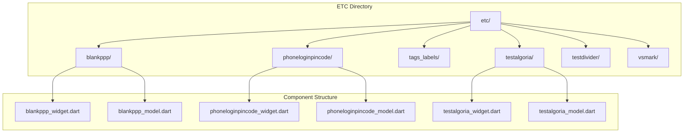
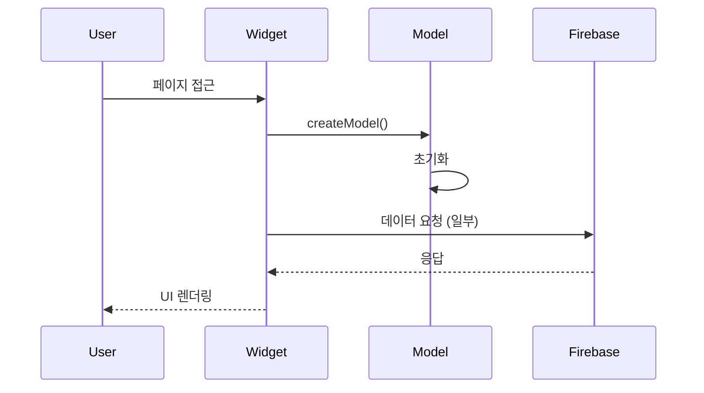

# 🧪 ETC (Experimental & Test Components) 디렉토리
> FlutterFlow 레거시 테스트 및 실험적 컴포넌트 모음

## 🎯 개요

이 디렉토리는 FlutterFlow에서 생성된 테스트 페이지, 실험적 기능, 미사용 컴포넌트들을 포함합니다. 대부분 개발 과정에서 생성된 테스트 코드이며, 현재 프로덕션 앱에서는 사용되지 않습니다.

### ⚠️ 주의사항
- **프로덕션 미사용**: 이 디렉토리의 코드는 프로덕션에서 사용되지 않음
- **레거시 코드**: FlutterFlow 초기 개발 단계의 잔여 코드
- **테스트 목적**: 기능 테스트 및 프로토타이핑용
- **향후 제거 대상**: 프로젝트 정리 시 제거 예정

## 📐 네이밍 컨벤션

```dart
// 파일명: snake_case (Dart 표준)
testalgoria_widget.dart
blankppp_model.dart
vsmark_widget.dart

// 클래스명: PascalCase
class TestalgoriaWidget
class BlankpppModel
class VsmarkWidget

// 라우트명: lowerCamelCase
static String routeName = 'testalgoria';
static String routePath = '/testalgoria';
```

- 참조: [NAMING_CONVENTION.md](../../NAMING_CONVENTION.md)

## 🏗️ 아키텍처

### 디렉토리 구조


### 컴포넌트 패턴


## 🔧 주요 구성요소

### 1. blankppp (빈 페이지 템플릿)
**위치**: `/blankppp`

FlutterFlow에서 생성한 기본 로그인 페이지 템플릿입니다.

#### 특징
- 이메일/비밀번호 로그인 폼
- 페이지 로드 애니메이션
- Firebase 인증 연동 준비

#### 구성 파일
- `blankppp_widget.dart`: 로그인 UI 위젯
- `blankppp_model.dart`: 상태 관리 모델

### 2. phoneloginpincode (전화번호 인증)
**위치**: `/phoneloginpincode`

전화번호 기반 PIN 코드 인증 테스트 페이지입니다.

#### 특징
- PIN 코드 입력 UI
- SMS 인증 플로우 테스트
- 타이머 기능

### 3. testalgoria (Algolia 검색 테스트)
**위치**: `/testalgoria`

Algolia 검색 기능 테스트를 위한 페이지입니다.

#### 특징
- 검색 입력 필드
- Algolia API 연동 테스트
- 검색 결과 표시

### 4. testdivider (구분선 테스트)
**위치**: `/testdivider`

UI 구분선 컴포넌트 테스트 페이지입니다.

#### 특징
- 다양한 스타일의 구분선
- 커스텀 디바이더 테스트

### 5. tags_labels (태그/라벨 테스트)
**위치**: `/tags_labels`

태그 및 라벨 UI 컴포넌트 테스트입니다.

#### 특징
- 태그 생성/삭제
- 라벨 스타일링
- 칩 컴포넌트 테스트

### 6. vsmark (VS 마크 컴포넌트)
**위치**: `/vsmark`

Versus Space 브랜드 마크 표시 테스트입니다.

#### 특징
- VS 로고 표시
- 브랜드 마크 애니메이션

## 💻 사용 예시

### 테스트 페이지 접근
```dart
// 라우트를 통한 접근 (비활성화됨)
context.pushNamed(TestalgoriaWidget.routeName);

// 직접 위젯 사용 (권장하지 않음)
Navigator.push(
  context,
  MaterialPageRoute(
    builder: (context) => TestalgoriaWidget(),
  ),
);
```

### 모델 초기화 패턴
```dart
class _TestPageState extends State<TestPage> {
  late TestModel _model;
  
  @override
  void initState() {
    super.initState();
    _model = createModel(context, () => TestModel());
  }
  
  @override
  void dispose() {
    _model.dispose();
    super.dispose();
  }
}
```

## 🚫 사용하지 않는 이유

### 1. 레거시 코드
- FlutterFlow 초기 버전에서 생성
- 현재 아키텍처와 불일치
- 네이티브 Flutter 마이그레이션 후 미사용

### 2. 테스트 목적
- 실제 기능 구현 전 프로토타이핑
- UI/UX 실험
- API 연동 테스트

### 3. 중복 기능
- 프로덕션 코드에 동일 기능 구현됨
- 더 나은 구현체 존재
- 디자인 시스템과 불일치

## 🔍 코드 품질 이슈

### 발견된 문제점
1. **하드코딩된 값**: 색상, 크기 등 직접 입력
2. **중복 코드**: 유사한 패턴 반복
3. **미사용 import**: 불필요한 의존성
4. **일관성 부재**: 각 컴포넌트마다 다른 스타일

### 개선 필요사항
```dart
// ❌ 현재 코드
Container(
  color: Color(0xFFECECEC),
  padding: EdgeInsets.all(24.0),
)

// ✅ 개선된 코드 (디자인 시스템 사용)
Container(
  color: VersusColors.backgroundSecondary,
  padding: VersusSpacing.paddingLG,
)
```

## ⚙️ 설정 및 의존성

### 공통 의존성
```dart
import '/core/app_theme.dart';
import '/core/app_utils.dart';
import '/core/app_widgets.dart';
import 'package:flutter/material.dart';
import 'package:google_fonts/google_fonts.dart';
```

### 특수 의존성
- **blankppp**: Firebase Auth
- **testalgoria**: Algolia SDK
- **phoneloginpincode**: Firebase Auth (SMS)

## 📝 변경 이력

### 2025-08-24
- ETC 디렉토리 전체 문서화
- 6개 하위 디렉토리 분석
- 레거시 코드 식별 및 문서화

### 2025-07-03
- FlutterFlow → Native Flutter 마이그레이션
- 대부분의 테스트 코드 비활성화

### 2025-08-22
- 초기 생성

## 🚀 향후 계획

### Phase 1: 코드 정리
- ✅ 문서화 완료
- ⏳ 사용 여부 최종 확인
- ⏳ 프로덕션 의존성 체크

### Phase 2: 제거 또는 리팩토링
- 📅 미사용 코드 제거
- 📅 필요한 코드만 `/tests` 디렉토리로 이동
- 📅 디자인 시스템 적용 (필요시)

### Phase 3: 아카이브
- 📅 제거 전 백업
- 📅 Git 히스토리 보존
- 📅 문서화 업데이트

## ⚠️ 권장사항

### DO
- ✅ 테스트 목적으로만 참조
- ✅ 새로운 기능 개발 시 패턴 참고
- ✅ 문제 해결을 위한 디버깅 용도

### DON'T
- ❌ 프로덕션에 직접 사용
- ❌ 새로운 의존성 추가
- ❌ 이 디렉토리에 새 코드 추가

## 📚 참고 자료

### 관련 문서
- [프로젝트 전체 구조](../README.md)
- [네이밍 컨벤션](../../NAMING_CONVENTION.md)
- [FlutterFlow 마이그레이션 가이드](../../MIGRATION.md)

### 대체 구현
- 로그인: `/lib/login/`
- 검색: `/lib/pages/search/`
- 인증: `/lib/auth/`

---

*이 디렉토리는 레거시 코드를 포함하고 있으며, 향후 제거될 예정입니다.*
*최종 업데이트: 2025-08-24*
