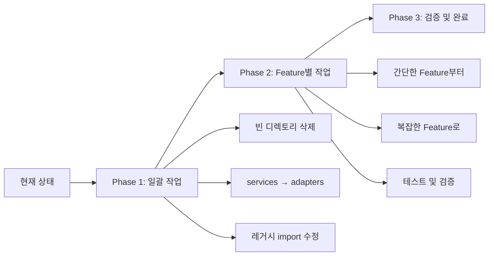

# 📚 Features 마이그레이션 Part 4: Clean Architecture 완성 가이드

> **작성일**: 2025-01-09  
> **목표**: Clean Architecture 100% 준수  
> **전략**: 하이브리드 접근법 (일괄 작업 + Feature별 마이그레이션)  
> **예상 소요 시간**: 9-10일

---

## 🎯 마이그레이션 목표 및 현황

### 현재 상태 (백엔드 마이그레이션 완료 후)
- ✅ **백엔드 마이그레이션**: 100% 완료 (305개 파일 이동)
- ⚠️ **Clean Architecture 준수율**: 35% (47개 파일 위반)
- ❌ **레거시 의존성**: 5개 파일
- ❌ **아키텍처 위반**: 47개 파일

### 목표 상태 (마이그레이션 완료 후)
- ✅ **Clean Architecture 준수율**: 100%
- ✅ **아키텍처 위반**: 0개
- ✅ **레거시 의존성**: 0개
- ✅ **모든 테스트 통과**

---

## 🏗️ 하이브리드 마이그레이션 전략

### 전략 개요


### 전략의 장점
- ✅ **리스크 최소화**: 위험한 작업은 Feature별로 격리
- ✅ **효율성 극대화**: 단순 작업은 일괄 처리
- ✅ **학습 효과**: 작은 Feature부터 시작하여 경험 축적
- ✅ **병렬 작업 가능**: 팀원들이 동시 작업 가능

---

## 📅 Phase 1: 전체 일괄 작업 (Day 1-2)

### Day 1: 기계적 정리 작업

#### 1.1 빈 디렉토리 삭제
```bash
# 불필요한 빈 디렉토리 제거
rm -rf lib/features/theme
rm -rf lib/features/upload

# 확인
ls -la lib/features/
```

#### 1.2 Services → Adapters 일괄 변경 (44개 디렉토리)
```bash
#!/bin/bash
# migrate_services_to_adapters.sh

FEATURES=(
  "auth"
  "chat" 
  "notifications"
  "posts"
  "profile"
  "search"
  "voting"
)

for feature in "${FEATURES[@]}"; do
  if [ -d "lib/features/$feature/data/services" ]; then
    echo "Migrating $feature/data/services → adapters"
    mv "lib/features/$feature/data/services" "lib/features/$feature/data/adapters"
    
    # import 문 수정
    find "lib/features/$feature" -type f -name "*.dart" -exec \
      sed -i '' "s|/data/services/|/data/adapters/|g" {} \;
  fi
done
```

#### 1.3 레거시 의존성 일괄 수정 (5개 파일)
```bash
# 레거시 core/repositories import 수정
FILES=(
  "lib/features/chat/data/repositories/chat_repository_impl.dart"
  "lib/features/notifications/data/repositories/notification_repository_impl.dart"
  "lib/features/notifications/data/services/notification_service.dart"
  "lib/features/search/data/repositories/search_repository_impl.dart"
  "lib/features/voting/data/repositories/voting_repository_impl.dart"
)

for file in "${FILES[@]}"; do
  echo "Fixing imports in $file"
  # core/repositories → domain/repositories 변경
  sed -i '' "s|import '/core/repositories/|import '../domain/repositories/|g" "$file"
done
```

### Day 2: 의존성 검증 및 준비

#### 2.1 아키텍처 위반 검사
```bash
# Presentation → Data 직접 접근 검사
echo "=== Checking Presentation → Data violations ==="
grep -r "import.*\/data\/" lib/features/*/presentation/ | wc -l

# Data → Presentation 역방향 의존성 검사
echo "=== Checking Data → Presentation violations ==="
grep -r "import.*\/presentation\/" lib/features/*/data/ | wc -l

# Feature 간 의존성 검사
echo "=== Checking cross-feature dependencies ==="
for feature in auth chat notifications posts profile search voting; do
  echo "Checking $feature dependencies..."
  grep -r "import.*\/features\/[^$feature]" lib/features/$feature/ | head -5
done
```

#### 2.2 Repository 인터페이스 누락 확인
```bash
# Domain에 Repository 인터페이스가 있는지 확인
find lib/features/*/domain/repositories -name "i_*.dart" -o -name "*_repository.dart" | sort
```

---

## 📅 Phase 2: Feature별 마이그레이션 - Week 1

### Day 3: notifications Feature (가장 간단, 학습 목적)

#### 작업 내용
```dart
// 1. domain/repositories/i_notification_repository.dart 생성
abstract class INotificationRepository {
  Future<List<NotificationModel>> getNotifications(String userId);
  Future<void> markAsRead(String notificationId);
  Future<void> sendNotification(NotificationModel notification);
  Future<void> deleteNotification(String notificationId);
}

// 2. data/repositories/notification_repository_impl.dart 수정
import '../../domain/repositories/i_notification_repository.dart';

class NotificationRepositoryImpl implements INotificationRepository {
  final NotificationRemoteDataSource remoteDataSource;
  final NotificationLocalDataSource localDataSource;
  
  NotificationRepositoryImpl({
    required this.remoteDataSource,
    required this.localDataSource,
  });
  
  @override
  Future<List<NotificationModel>> getNotifications(String userId) async {
    // 구현...
  }
}
```

#### DI 설정
```dart
// app/di/notification_module.dart
import 'package:get_it/get_it.dart';

class NotificationModule {
  static void configure(GetIt getIt) {
    // DataSources
    getIt.registerLazySingleton<NotificationRemoteDataSource>(
      () => NotificationRemoteDataSourceImpl(),
    );
    
    getIt.registerLazySingleton<NotificationLocalDataSource>(
      () => NotificationLocalDataSourceImpl(),
    );
    
    // Repository
    getIt.registerLazySingleton<INotificationRepository>(
      () => NotificationRepositoryImpl(
        remoteDataSource: getIt(),
        localDataSource: getIt(),
      ),
    );
  }
}
```

#### Presentation 레이어 수정
```dart
// presentation/screens/notifications_list_widget.dart
// ❌ Before
import '../../data/repositories/notification_repository_impl.dart';
final repo = NotificationRepositoryImpl();

// ✅ After
import '../../domain/repositories/i_notification_repository.dart';
import 'package:get_it/get_it.dart';

final repo = GetIt.I<INotificationRepository>();
```

### Day 4: voting & search Features

#### 4.1 voting Feature (오전)
```dart
// 1. domain/repositories/posts_data_source.dart → i_voting_repository.dart
abstract class IVotingRepository {
  Future<void> submitVote(String postId, VoteOption option);
  Future<VotingStats> getVotingStats(String postId);
  Future<List<Vote>> getUserVotes(String userId);
}

// 2. data/repositories/voting_repository_impl.dart 수정
// core/repositories 의존성 제거
// IVotingRepository 구현
```

#### 4.2 search Feature (오후)
```dart
// 1. 중복 Repository 제거
// domain/repositories/search_repository.dart (interface로 변경)
abstract class ISearchRepository {
  Future<List<SearchResult>> search(String query);
  Future<List<SearchResult>> searchPosts(String query);
  Future<List<SearchResult>> searchUsers(String query);
}

// 2. 단일 구현체로 통합
// data/repositories/search_repository.dart 삭제
// data/repositories/search_repository_impl.dart 유지
```

---

## 📅 Phase 3: Feature별 마이그레이션 - Week 2

### Day 5-6: chat Feature (중간 복잡도)

#### 작업 범위
- 30개 파일 중 15개 수정 필요
- 9개 services → adapters 마이그레이션
- 6개 Presentation 파일 의존성 수정

#### 주요 작업
```dart
// 1. services → adapters 마이그레이션
// data/adapters/chat_animation_adapter.dart
// data/adapters/chat_scroll_adapter.dart
// data/adapters/chat_media_upload_adapter.dart
// ... 6개 더

// 2. Presentation 의존성 수정 (6개 파일)
// presentation/screens/chat_detail/chat_detail_widget_v2.dart
// presentation/screens/chat_list/chat_list_widget.dart
// ... 4개 더
```

### Day 7: auth Feature (핵심 기능, 신중히)

#### 작업 범위
- 37개 파일 중 14개 수정 필요
- 7개 services → adapters
- 7개 Presentation 파일 수정

#### 주의사항
- 인증 로직 테스트 필수
- 기존 세션 유지 확인
- 모든 인증 제공자 테스트

### Day 8: profile Feature

#### 작업 범위
- 34개 파일 중 10개 수정
- 2개 누락된 Repository 구현
- 7개 Presentation 파일 수정

```dart
// 누락된 Repository 구현
// domain/repositories/i_friends_repository.dart
// domain/repositories/i_profile_repository.dart
```

### Day 9-10: posts Feature (가장 복잡)

#### 작업 범위
- 126개 파일 중 29개 수정 필요
- 20개 services → adapters (가장 많음)
- 9개 Presentation 파일 대규모 리팩토링

#### 특별 주의사항
```dart
// 복잡한 미디어 처리 로직 주의
// data/adapters/media/
// ├── image_upload_adapter.dart
// ├── video_processing_adapter.dart
// ├── thumbnail_generator_adapter.dart
// └── media_cache_adapter.dart

// 투표 시스템과의 통합 주의
// data/adapters/vote/
// ├── vote_submission_adapter.dart
// └── vote_counting_adapter.dart
```

---

## ✅ 검증 체크리스트

### Phase별 검증

#### Phase 1 완료 검증
- [ ] theme/, upload/ 디렉토리 삭제됨
- [ ] 모든 services 폴더가 adapters로 변경됨
- [ ] 레거시 core/repositories import 0개
- [ ] `flutter analyze` 실행 가능

#### Phase 2 (Week 1) 완료 검증
- [ ] notifications Repository 인터페이스 생성
- [ ] voting Repository 이름 수정 완료
- [ ] search 중복 제거 완료
- [ ] 3개 Feature DI 설정 완료

#### Phase 3 (Week 2) 완료 검증
- [ ] 모든 Feature Repository 패턴 완성
- [ ] Presentation → Data 의존성 0개
- [ ] Data → Presentation 의존성 0개
- [ ] 모든 DI 바인딩 완료

### 최종 검증

#### 아키텍처 규칙 준수
```bash
# 최종 검증 스크립트
#!/bin/bash

echo "=== Final Architecture Validation ==="

# 1. Core에 구현체 없음 확인
echo "Checking Core layer..."
find lib/core -name "*_impl.dart" -o -name "*_repository.dart" | wc -l

# 2. Feature 간 의존성 없음 확인
echo "Checking cross-feature dependencies..."
for feature in auth chat notifications posts profile search voting; do
  count=$(grep -r "import.*\/features\/[^$feature]" lib/features/$feature/ | wc -l)
  echo "$feature: $count violations"
done

# 3. Presentation → Data 직접 접근 없음
echo "Checking Presentation → Data access..."
grep -r "import.*\/data\/" lib/features/*/presentation/ | wc -l

# 4. services 폴더 완전 제거 확인
echo "Checking for services folders..."
find lib/features -type d -name "services" | wc -l

# 5. Flutter analyze
echo "Running flutter analyze..."
flutter analyze
```

#### 품질 기준
- [ ] `flutter analyze`: 0 errors, 0 warnings
- [ ] 모든 유닛 테스트 통과
- [ ] 모든 통합 테스트 통과
- [ ] iOS/Android 빌드 성공
- [ ] 앱 정상 실행 확인

---

## 🛠️ 도구 및 자동화 스크립트

### 1. 일괄 마이그레이션 스크립트
```bash
# scripts/batch_migration.sh
#!/bin/bash

echo "Starting batch migration..."

# Step 1: Remove empty directories
rm -rf lib/features/theme lib/features/upload

# Step 2: Rename services to adapters
./scripts/migrate_services_to_adapters.sh

# Step 3: Fix legacy imports
./scripts/fix_legacy_imports.sh

# Step 4: Validate
./scripts/validate_architecture.sh

echo "Batch migration completed!"
```

### 2. Feature 마이그레이션 템플릿
```bash
# scripts/migrate_feature.sh
#!/bin/bash

FEATURE=$1

if [ -z "$FEATURE" ]; then
  echo "Usage: ./migrate_feature.sh <feature_name>"
  exit 1
fi

echo "Migrating $FEATURE feature..."

# Create repository interface
./scripts/create_repository_interface.sh $FEATURE

# Update DI module
./scripts/update_di_module.sh $FEATURE

# Fix presentation imports
./scripts/fix_presentation_imports.sh $FEATURE

# Run tests
flutter test test/features/$FEATURE/

echo "$FEATURE migration completed!"
```

### 3. 진행 상황 추적
```bash
# scripts/migration_progress.sh
#!/bin/bash

echo "=== Migration Progress Tracker ==="
echo ""

# Count violations
TOTAL_FILES=305
VIOLATIONS=$(grep -r "import.*\/data\/" lib/features/*/presentation/ | wc -l)
VIOLATIONS=$((VIOLATIONS + $(grep -r "import.*\/core\/repositories\/" lib/features/ | wc -l)))

COMPLIANCE=$((100 - (VIOLATIONS * 100 / TOTAL_FILES)))

echo "📊 Clean Architecture Compliance: $COMPLIANCE%"
echo "⚠️  Architecture Violations: $VIOLATIONS files"
echo ""

# Feature status
for feature in auth chat notifications posts profile search voting; do
  if [ -f "lib/features/$feature/domain/repositories/i_${feature}_repository.dart" ]; then
    echo "✅ $feature: Repository interface exists"
  else
    echo "❌ $feature: Repository interface missing"
  fi
done
```

---

## 📊 예상 결과 및 효과

### 정량적 개선
| 지표 | Before | After | 개선율 |
|------|--------|-------|--------|
| Clean Architecture 준수율 | 35% | 100% | +185% |
| 아키텍처 위반 | 47개 | 0개 | -100% |
| 레거시 의존성 | 5개 | 0개 | -100% |
| 테스트 가능성 | 낮음 | 높음 | - |
| 코드 재사용성 | 중간 | 높음 | - |

### 정성적 개선
1. **개발 속도 향상**
   - 명확한 계층 분리로 병렬 개발 가능
   - 새 기능 추가 시 영향 범위 명확

2. **버그 감소**
   - 의존성 명확화로 사이드 이펙트 감소
   - 테스트 커버리지 향상

3. **유지보수성 향상**
   - 코드 가독성 개선
   - 변경 영향 범위 예측 가능

4. **팀 생산성 향상**
   - 명확한 아키텍처로 온보딩 시간 단축
   - 코드 리뷰 효율성 증가

---

## 🚨 리스크 관리

### 잠재적 리스크 및 대응 방안

| 리스크 | 발생 가능성 | 영향도 | 대응 방안 |
|--------|------------|--------|-----------|
| 빌드 실패 | 중간 | 높음 | 각 Phase 후 빌드 검증 |
| 런타임 에러 | 낮음 | 높음 | 충분한 테스트 작성 |
| 성능 저하 | 낮음 | 중간 | 프로파일링 및 최적화 |
| 롤백 필요 | 낮음 | 높음 | Git 브랜치 전략 활용 |

### 롤백 전략
```bash
# Feature별 브랜치 전략
git checkout -b migration/phase1-batch
git checkout -b migration/phase2-notifications
git checkout -b migration/phase2-voting
# ... 각 Feature별 브랜치

# 문제 발생 시 즉시 롤백 가능
git checkout main
```

---

## 📌 참고 자료

### 프로젝트 문서
- [ARCHITECTURE_RULES.md](/lib/ARCHITECTURE_RULES.md) - 아키텍처 규칙
- [DOCUMENTATION_STATUS.md](/lib/features/DOCUMENTATION_STATUS.md) - 현재 상태
- [MIGRATION_COMPLETE_TREE_KR.md](/lib/backend/MIGRATION_COMPLETE_TREE_KR.md) - 백엔드 마이그레이션

### 외부 참고 자료
- [Clean Architecture by Uncle Bob](https://blog.cleancoder.com/uncle-bob/2012/08/13/the-clean-architecture.html)
- [Flutter Clean Architecture](https://resocoder.com/flutter-clean-architecture-tdd/)
- [Feature-First Architecture](https://codewithandrea.com/articles/flutter-project-structure/)
- [Dependency Injection in Flutter](https://pub.dev/packages/get_it)

---

**작성자**: SuperClaude with Architect & Analyzer Personas  
**검토 예정일**: 2025-01-16  
**문의**: 마이그레이션 중 이슈 발생 시 즉시 보고