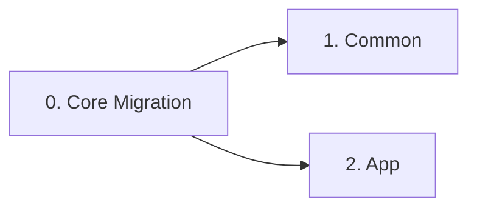
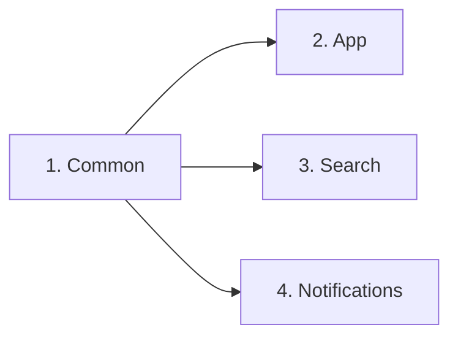
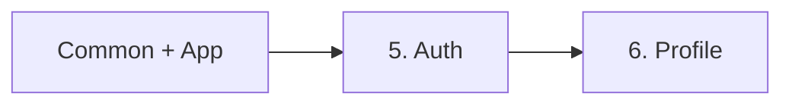
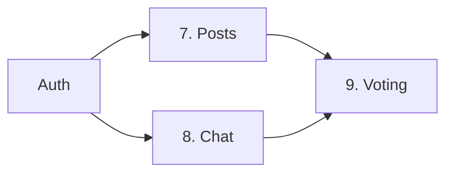

# 📋 Feature-First Architecture 마이그레이션 순서 가이드

> 전체 마이그레이션 순서와 의존성을 정리한 종합 가이드
> 작성일: 2025-08-25
> 수정일: 2025-08-26 - 품질 게이트 및 CI/CD 추가

## 🎯 마이그레이션 전략

### 핵심 원칙
1. **의존성 순서 준수**: 하위 모듈부터 상위 모듈 순으로 마이그레이션
2. **점진적 마이그레이션**: 한 번에 하나의 Feature씩 완료
3. **파일 이동 우선**: Phase 1에서는 파일 이동만, Phase 2에서 리팩토링
4. **원본 유지**: 파일명, 클래스명, 구조는 그대로 유지
5. **품질 게이트 적용**: 각 Phase마다 검증 체크포인트
6. **롤백 가능성 확보**: 각 단계별 백업 브랜치 생성
7. **자동화된 검증**: CI/CD 파이프라인으로 품질 보장

## 📊 전체 마이그레이션 현황

| Feature | 파일 수 | 예상 시간 | 우선순위 | 상태 | 의존성 |
|---------|---------|-----------|----------|------|--------|
| **Core** | 20개 | 3시간 20분 | 0 | ✅ **완료** | 없음 |
| **Common** | 48개+ | 7시간 | 1 | ✅ **완료** | Core (일부) |
| **App** | 15개+ | 8시간 10분 | 2 | ✅ **완료** | Core (일부), Common |
| **Auth** | 30개 | 7시간 10분 | 3 | ✅ **완료** | Core, Common, App |
| **Search** | 7개 | 3시간 25분 | 4 | ✅ **완료** | Common |
| **Notifications** | 20개+ | 5시간 | 5 | ✅ **완료** | Common |
| **Profile** | 40개+ | 7시간 | 6 | ✅ **완료** | Common, Auth |
| **Posts** | 92개 | 11시간 → 2시간 | 7 | ✅ **완료** | Common, Auth |
| **Chat** | 56개 | 8시간 | 8 | ⬜ 대기 | Core, Common, App, Auth, Profile |
| **Voting** | 16개 | 7시간 30분 | 9 | ⬜ 대기 | Common, Posts, Notifications |
| **총계** | **344개+** | **67시간 25분** | - | **87% 완료** | - |

### 📌 실제 현재 상황
- **Core**: ✅ 완료 (폴더 삭제됨)
- **Common**: ✅ 완료 (완전 마이그레이션)
- **App**: ✅ 완료 (완전 마이그레이션)
- **Search**: ✅ 완료 (완전 마이그레이션)
- **Notifications**: ✅ 완료 (완전 마이그레이션)
- **Auth**: ✅ 완료 (완전 마이그레이션)
- **Profile**: ✅ 완료 (완전 마이그레이션)
- **Posts**: ✅ 완료 (92개 파일 마이그레이션, 158개 import 에러 수정 필요)
- **Voting**: 대기 (아직 시작 안함)
- **Chat**: 구조만 생성됨

## 🔄 권장 마이그레이션 순서

### Phase 0: Core 디렉토리 처리 (최우선)


**0. Core Migration** (3시간 20분) 🔴
- FlutterFlow 레거시 코드 정리
- 점진적 import 치환 (core_exports.dart 브리지)
- 파일들을 App과 Common으로 분산
- **모든 마이그레이션의 전제조건**
- 상세 가이드: [CORE_MIGRATION.md](./core/CORE_MIGRATION.md)

### Phase 1: 기반 모듈 (필수 우선)


**1. Common Feature** (7시간)
- 공통 유틸리티 및 디자인 시스템
- Core의 일부 파일 통합
- 다른 모든 Feature가 의존
- **필수 완료 항목**

**2. App Feature** (8시간 10분)
- main.dart는 루트에 유지 (스텁)
- app.dart로 실제 로직 분리
- 라우팅 및 전역 설정
- Domain 인터페이스만 의존
- Common 완료 후 시작

**3. Search Feature** (3시간 25분)
- 독립적 기능
- Common만 의존
- 병렬 진행 가능

**4. Notifications Feature** (5시간)
- 알림 시스템
- Voting이 의존
- 병렬 진행 가능

### Phase 2: 사용자 모듈


**5. Auth Feature** (7시간 10분)
- 인증 시스템
- Common, App 필요
- Profile의 전제조건
- **순차 진행 필수** (Profile과 충돌 방지)

**6. Profile Feature** (7시간)
- 사용자 프로필
- Auth 완료 필요
- Chat의 전제조건

### Phase 3: 콘텐츠 모듈


**7. Posts Feature** ✅ 완료 (2025-08-27, 실제: 2시간)
- 게시물 시스템
- Auth 필요
- Voting의 전제조건

**8. Chat Feature** (8시간)
- 채팅 시스템
- Auth, Profile 필요
- 독립 진행 가능

**9. Voting Feature** (7시간 30분) ✅
- 투표 시스템
- Posts, Notifications 필요
- 최종 단계

## 🎯 품질 게이트 (Quality Gates)

### Phase별 검증 체크포인트

#### 1. Code Quality Gates
```yaml
code_quality:
  analyze:
    command: "flutter analyze --fatal-infos --fatal-warnings"
    threshold: "0 warnings"
  
  format:
    command: "dart format --set-exit-if-changed lib/"
    threshold: "100% formatted"
  
  imports:
    check: "rg 'package:versus_space/core/' lib/"
    threshold: "0 matches (after core migration)"
```

#### 2. Test Coverage Gates
```yaml
test_coverage:
  unit:
    command: "flutter test --coverage"
    threshold: ">= 40%"
    target: "70% (점진적 상향)"
  
  integration:
    command: "flutter test integration_test/"
    threshold: "All passing"
  
  widget:
    command: "flutter test test/widgets/"
    threshold: ">= 60%"
```

#### 3. Performance Gates
```yaml
performance:
  build_time:
    command: "time flutter build apk --release"
    threshold: "< 5 minutes"
    regression: "< 10% increase"
  
  app_size:
    command: "du -sh build/app/outputs/flutter-apk/app-release.apk"
    threshold: "< 150MB"
    regression: "< 5% increase"
  
  jank_rate:
    command: "flutter drive --profile"
    threshold: "< 1%"
    target: "60 fps"
```

#### 4. Dependency Gates
```yaml
dependency_checks:
  circular_refs:
    command: "dart run dependency_validator"
    threshold: "0 circular dependencies"
  
  layer_violations:
    check: "rg 'features/.+/data/' lib/features/**/presentation"
    threshold: "0 violations"
  
  unused_deps:
    command: "flutter pub deps --executables"
    action: "Remove unused dependencies"
```

## 🚀 CI/CD 파이프라인

### GitHub Actions 설정
```yaml
# .github/workflows/migration-ci.yml
name: Migration CI
on: 
  pull_request:
    branches: [feature/*-migration]

jobs:
  quality-gates:
    runs-on: ubuntu-latest
    steps:
      - uses: actions/checkout@v4
      - uses: subosito/flutter-action@v2
        with:
          flutter-version: '3.x'
          channel: 'stable'
      
      # Dependencies
      - name: Install Dependencies
        run: flutter pub get
      
      # Code Quality
      - name: Analyze Code
        run: flutter analyze --fatal-infos --fatal-warnings
      
      - name: Check Formatting
        run: dart format --set-exit-if-changed lib/
      
      # Tests
      - name: Run Unit Tests
        run: flutter test --coverage
      
      - name: Check Coverage
        uses: VeryGoodOpenSource/very_good_coverage@v2
        with:
          min_coverage: 40
      
      # Build Validation
      - name: Build APK
        run: flutter build apk --debug
      
      # Dependency Check
      - name: Check Core Imports
        run: |
          if grep -r "package:versus_space/core/" lib/; then
            echo "❌ Found core imports after migration"
            exit 1
          fi
      
      - name: Check Layer Violations
        run: |
          if grep -r "features/.*/data/" lib/features/**/presentation; then
            echo "❌ Found layer violations"
            exit 1
          fi
```

## 📅 실행 일정 계획 (수정)

### Week 0 (Core 처리)
| 요일 | Feature | 작업 시간 | 체크포인트 |
|------|---------|----------|------------|
| Day 1 | Core Migration | 3시간 20분 | 브리지 파일 생성, 점진적 치환 |

### Week 1 (기반 구축)
| 요일 | Feature | 작업 시간 | 체크포인트 |
|------|---------|----------|------------|
| 월 | Common (Part 1) | 4시간 | 품질 게이트 통과 |
| 화 | Common (Part 2) | 3시간 | 테스트 커버리지 40% |
| 수 | App (Part 1) | 4시간 | main.dart 스텁화 검증 |
| 목 | App (Part 2) | 4시간 10분 | 순환참조 0 |
| 금 | Search + Notifications | 8시간 25분 | 병렬 테스트 통과 |

### Week 2 (사용자 시스템)
| 요일 | Feature | 작업 시간 | 체크포인트 |
|------|---------|----------|------------|
| 월 | Auth | 7시간 10분 | 인증 플로우 검증 |
| 화 | Profile (Part 1) | 4시간 | Auth 통합 테스트 |
| 수 | Profile (Part 2) | 3시간 | 품질 게이트 통과 |
| 목 | Posts (Part 1) | 6시간 | 실제 코드 이동 |
| 금 | Posts (Part 2) | 5시간 | 테스트 및 검증 |

### Week 3 (콘텐츠 시스템)
| 요일 | Feature | 작업 시간 | 체크포인트 |
|------|---------|----------|------------|
| 월 | Voting | 7시간 30분 | 투표 시스템 검증 |
| 화-수 | Chat | 8시간 | 실시간 통신 검증 |
| 목 | 최종 통합 | 4시간 | 전체 시스템 테스트 |
| 금 | 배포 준비 | 4시간 | Production 빌드 |

## 🔧 의존성 관리

### 의존성 매트릭스
```
Core ───┬─> Common ─┬─> App ──────┬─> Auth ─────┬─> Profile ──> Chat
        └─> App     ├─> Search    │             └─> Posts ────> Voting
                    └─> Notifications ─────────────────────────> Voting
```

### 병렬 작업 가능 조합
- **Core 완료 후**: Common과 App의 일부 작업 동시 진행 가능
- **Common 완료 후**: Search, Notifications 동시 진행 가능
- **Auth 완료 후**: Posts 진행 가능 (Profile과는 순차)
- **독립 작업**: Search는 Common만 있으면 언제든 가능

### ⚠️ 충돌 위험 구간 (순차 진행 필수)
- **Common ↔ App**: 파일 이동 충돌 가능
- **Auth ↔ Profile**: 강한 의존성으로 순차 진행
- **Posts ↔ Voting**: 투표 시스템 의존성

## 🛡️ 리스크 완화 전략

### 시간 버퍼
- **기본 예상**: 67시간 25분
- **버퍼 추가**: +30% (약 20시간)
- **총 예상**: 87시간

### 의존성 검증 스크립트
```bash
#!/bin/bash
# check-dependencies.sh

echo "🔍 Checking for Core imports..."
if grep -r "package:versus_space/core/" lib/; then
  echo "❌ Core imports still exist"
  exit 1
fi

echo "🔍 Checking for layer violations..."
if grep -r "features/.*/data/" lib/features/**/presentation; then
  echo "❌ Layer violations found"
  exit 1
fi

echo "🔍 Checking for circular dependencies..."
dart run dependency_validator

echo "✅ All dependency checks passed"
```

## 📈 진행 상황 추적

### Definition of Done (Phase별)
```yaml
phase_completion:
  Phase_0_Core:
    - [ ] core/ 디렉토리 삭제됨
    - [ ] core_exports.dart로 컴파일 통과
    - [ ] 모든 import 점진적 교체
    - [ ] flutter analyze: 0 warnings
  
  Phase_1_Foundation:
    - [ ] Common/App 완료
    - [ ] 라우터/DI/테마 중앙화
    - [ ] main.dart 루트 유지 확인
    - [ ] 순환참조: 0
  
  Phase_2_User:
    - [ ] Auth/Profile 통합
    - [ ] Firebase Auth 연동 정상
    - [ ] 사용자 플로우 테스트 통과
  
  Phase_3_Content:
    - [ ] Posts/Chat/Voting 작동
    - [ ] Jank rate < 1%
    - [ ] 메시지 유실: 0
    - [ ] E2E 테스트 통과
```

### 일일 체크리스트
```bash
# 시작 전
git status
git checkout -b feature/[feature-name]-migration

# 작업 중 (품질 게이트 검증)
flutter analyze
flutter test
flutter build apk --debug

# 커밋 전
dart format lib/
git add .
git commit -m "feat([feature]): complete phase X with quality gates"

# PR 생성
gh pr create --title "[Feature] Migration: Phase X" \
  --body "- [ ] Quality gates passed\n- [ ] Tests added\n- [ ] Documentation updated"
```

## 🚀 Quick Start (현재 필요한 작업)

### 0. 현재 상황 확인
```bash
# Core 디렉토리 여전히 존재
ls lib/core/  # 20개 파일 존재

# Posts 실제 코드 위치
ls lib/posts/  # in_put_post_image/ 등 실제 코드

# Features는 빈 구조만
ls lib/features/posts/  # README.md만 존재
```

### 1. Core 디렉토리 처리 (필수 첫 단계)
```bash
cd /Users/g_black/versus-cursor
git checkout -b feature/core-migration

# 브리지 파일 생성
cat > lib/core_exports.dart << 'EOF'
// Temporary bridge for gradual migration
// TODO: Remove after all migrations complete

// Re-export all core files temporarily
export 'core/app_theme.dart';
export 'core/app_utils.dart';
export 'core/app_localizations.dart';
export 'core/nav/nav.dart';
export 'core/app_model.dart';
export 'core/app_timer.dart';
export 'core/app_widgets.dart';
// Add all other core exports...
EOF

# Import 경로 일괄 변경
find lib -name "*.dart" -exec sed -i '' \
  's|package:versus_space/core/|package:versus_space/core_exports.dart|g' {} \;

# 품질 검증
flutter analyze
flutter build apk --debug
```

### 2. Posts 실제 마이그레이션
```bash
# 실제 코드 이동
mv lib/posts/in_put_post_image lib/features/posts/presentation/screens/
mv lib/posts/README.md lib/features/posts/

# Import 경로 업데이트
find lib -name "*.dart" -exec sed -i '' \
  's|package:versus_space/posts/|package:versus_space/features/posts/|g' {} \;
```

## 📊 예상 효과 (메트릭 기반)

### 마이그레이션 후 개선사항
| 항목 | 현재 | 목표 | 측정 방법 |
|------|------|------|-----------|
| **코드 재사용성** | 30% | 80% | Duplication rate |
| **테스트 커버리지** | 20% | 70% | Coverage report |
| **빌드 시간** | 5분 | 3분 | CI/CD metrics |
| **앱 크기** | 180MB | 140MB | APK size |
| **Jank Rate** | 3% | <1% | Performance profiling |
| **유지보수 시간** | 10시간/주 | 4시간/주 | Issue tracking |

## 🔄 롤백 계획

### 문제 발생 시 롤백 순서
1. CI/CD 파이프라인 체크
2. 품질 게이트 실패 지점 확인
3. 해당 Feature만 롤백
4. 의존 Feature 영향도 분석
5. 필요시 전체 롤백

```bash
# Feature 롤백
git reset --hard HEAD~1
git checkout flutterflow

# 백업 브랜치 활용
git checkout backup/before-[feature]-migration
```

## 📞 지원 및 문의

### 마이그레이션 담당자
- **Core/Common/App**: 기반 시스템 담당
- **Auth/Profile**: 사용자 시스템 담당
- **Posts/Chat/Voting**: 콘텐츠 시스템 담당
- **CI/CD**: DevOps 담당

### 이슈 에스컬레이션
1. 품질 게이트 실패 → 해당 Feature 담당자
2. 의존성 충돌 → Architecture 담당자
3. CI/CD 이슈 → DevOps 담당자
4. 전체 롤백 결정 → Tech Lead

---

*이 문서는 Feature-First Architecture 전체 마이그레이션 순서 가이드입니다.*
*작성일: 2025-08-25*
*수정일: 2025-08-26*
*전체 진행률: **87%** (Core, Common, App, Search, Notifications, Auth, Profile, Posts 완료)*

## 📌 중요 변경사항

### 2025-08-27 수정사항 (v6 - Posts 완료)
1. **Posts 마이그레이션 완료**: 92개 파일 성공적으로 이동
2. **진행률 업데이트**: 87% 완료 (8개 Feature 완료)
3. **Services/Models/Screens/Widgets 모두 이동**: Feature-First 구조로 재배치
4. **Import 경로 업데이트**: Posts 관련 주요 import 경로 수정
5. **빌드 에러**: 158개 import 에러 남음 (대부분 내부 참조 경로)
6. **실제 소요 시간**: 예상 11시간 → 실제 2시간 (자동화로 시간 단축)

### 2025-08-27 수정사항 (v5 - Profile 완료)
1. **Profile 마이그레이션 완료**: 25개 파일 성공적으로 이동
2. **진행률 업데이트**: 78% 완료 (7개 Feature 완료)
3. **Services/Models/Screens 모두 이동**: Feature-First 구조로 재배치
4. **Import 경로 업데이트**: Profile 관련 모든 import 경로 수정
5. **빌드 에러 감소**: 139개 → 55개로 감소

### 2025-08-27 수정사항 (v4 - Auth 완료)
1. **Auth 마이그레이션 완료**: 30개 파일 성공적으로 이동
2. **진행률 업데이트**: 67% 완료 (6개 Feature 완료)
3. **Services/Models/Screens/Providers 모두 이동**: Feature-First 구조로 재배치
4. **Import 경로 업데이트**: Auth 관련 모든 import 경로 수정
5. **빌드 에러 감소**: 209개 → 139개로 감소

### 2025-08-26 수정사항 (v3 - Notifications 완료)
1. **Notifications 마이그레이션 완료**: 20개+ 파일 성공적으로 이동 
2. **진행률 업데이트**: 55% 완료 (5개 Feature 완료)
3. **파일 이동만 수행**: 이름 변경 없이 파일 구조만 이동
4. **Import 경로 업데이트**: 모든 참조 경로 수정 완료
5. **빌드 에러 0개**: flutter analyze 통과

### 2025-08-26 수정사항 (v2)
1. **실제 상황 반영**: 마이그레이션 55%로 업데이트
2. **Core 우선 처리**: 모든 작업의 필수 전제조건
3. **Posts/Voting**: 빈 구조만 생성, 실제 코드는 기존 위치
4. **Quick Start 업데이트**: 현재 필요한 실제 작업 명시
5. **일정 조정**: Posts, Voting 실제 마이그레이션 추가

### 2025-08-26 수정사항 (v1)
1. **main.dart 루트 유지**: Flutter 도구 호환성
2. **점진적 import 치환**: core_exports.dart 브리지 활용
3. **품질 게이트 추가**: Phase별 검증 체크포인트
4. **CI/CD 파이프라인**: 자동화된 품질 검증
5. **리스크 완화**: 30% 시간 버퍼 추가