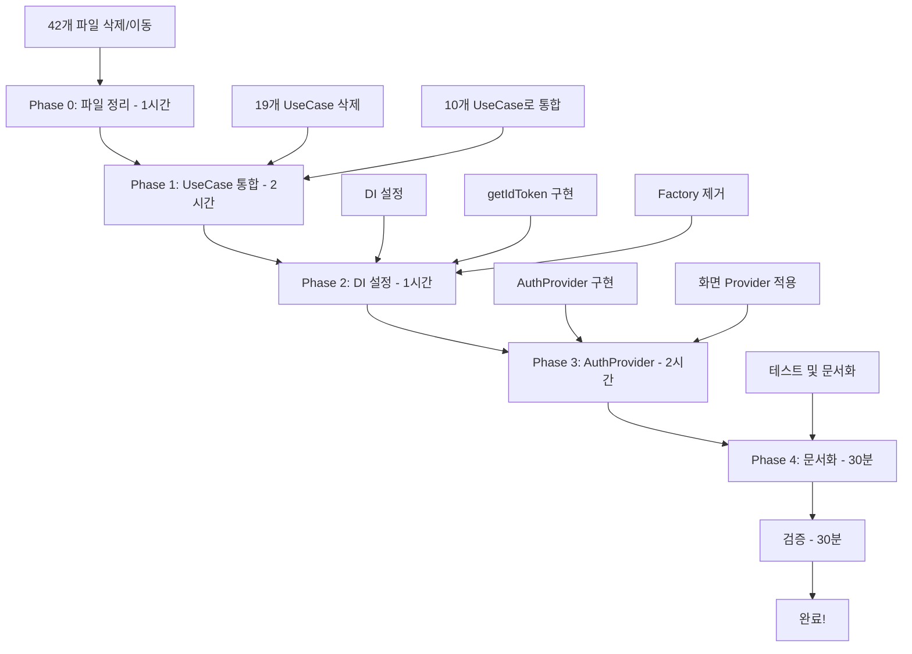

# 📋 Auth Feature - Contract 패턴 마이그레이션 가이드

> **작성일**: 2025-01-23
> **최종 수정**: 2025-01-23
> **버전**: 4.0.0 (논리적 일관성 및 실제 디렉토리 동기화)
> **대상**: Auth Feature (70% → 100% 완료)
> **예상 소요 시간**: 7-8시간
> **참조**: ARCHITECTURE_RULES.md v5.0 (Contract Pattern)

## 📊 현재 상태 분석

### 🔍 파일 분석 결과
- **총 파일 수**: 93개
- **삭제/이동 대상**: 42개 (45%)
- **유지 대상**: 51개 (55%)
- **ARCHITECTURE_RULES.md 위반**: 5가지 주요 패턴

### ✅ 완료된 부분 (70%)

#### Domain Layer (100% ✅)
- ✅ 28개 UseCase 구현 완료 (과도하게 세분화됨)
- ✅ IAuthRepository 인터페이스 정의
- ✅ Domain Models (AuthUser, AuthSession, AuthToken)
- ✅ Value Objects 구현
- ⚠️ 불필요한 모델 2개 존재 (premium_users_model, user_contents_model)

#### Data Layer (85% ⚠️)
- ✅ FirebaseAuthRemoteDataSource 구현
- ✅ AuthLocalDataSource 구현
- ✅ AuthRepositoryImpl (Repository + AuthContract)
- ✅ DTO/Mapper 구현
- ❌ getIdToken() 메서드 미구현 (TODO)
- ⚠️ adapters 디렉토리 정리 필요 (12개 파일)
- ⚠️ exports 파일 제거 필요

#### Presentation Layer (40% 🔴)
- ✅ 화면 위젯 구현 (6개 화면 플로우)
- ❌ UseCase 연결 미흡 (Factory 패턴 사용)
- ❌ Provider/StateNotifier 미구현
- ❌ 중앙 상태 관리 부재

### ❌ 미완성 부분 (30%)

1. **DI 설정 미등록**
2. **getIdToken() 메서드 미구현**
3. **Presentation-Domain 연결 미흡**
4. **Provider 패턴 미적용**
5. **UseCase 과도하게 세분화 (28개 → 10개로 통합 필요)**
6. **테스트 코드 부재**
7. **ARCHITECTURE_RULES.md 위반 파일 44개 정리 필요**

## 🎯 마이그레이션 목표

### 핵심 목표
1. **Contract 패턴 완전 적용**: Auth Feature가 AuthContract를 통해 다른 Feature와 통신
2. **DI 통합**: GetIt을 통한 의존성 주입 완료
3. **상태 관리 중앙화**: Provider 패턴으로 전역 인증 상태 관리
4. **코드 최적화**: UseCase 통합 및 폴더 구조 정리

## 📊 UseCase 통합 상세 계획

### 현재 28개 UseCase → 10개로 통합

| 최종 UseCase (10개) | 포함될 기존 UseCase | 처리 방법 |
|---|---|---|
| **1. SignInWithEmailUseCase** | sign_in_with_email_usecase.dart | 유지 |
| **2. SignUpWithEmailUseCase** | create_account_with_email_usecase.dart | 유지 (계정 생성만 담당) |
| **3. SignInWithGoogleUseCase** | sign_in_with_google_usecase.dart | 유지 |
| **4. SignInWithAppleUseCase** | sign_in_with_apple_usecase.dart | 유지 |
| **5. SignInWithPhoneUseCase** | sign_in_with_phone_usecase.dart<br>send_sms_otp_usecase.dart<br>verify_phone_otp_usecase.dart<br>resend_sms_otp_usecase.dart<br>create_phone_account_usecase.dart | 통합 (전화번호 인증 전체 플로우) |
| **6. SignOutUseCase** | sign_out_usecase.dart | 유지 |
| **7. GetCurrentUserUseCase** | get_current_user_usecase.dart<br>get_current_user_uid_usecase.dart<br>get_current_user_email_usecase.dart | 통합 (사용자 정보 조회) |
| **8. PasswordManagementUseCase** | reset_password_usecase.dart<br>update_password_usecase.dart | 통합 (비밀번호 관리) |
| **9. EmailVerificationUseCase** | verify_email_usecase.dart<br>send_email_verification_usecase.dart | 통합 (이메일 인증) |
| **10. AccountManagementUseCase** | delete_account_usecase.dart<br>delete_user_usecase.dart<br>update_user_profile_usecase.dart | 통합 (계정 관리) |

### Provider/Contract로 이동할 UseCase (제거 대상)

| 기존 UseCase | 이동 위치 | 이유 |
|---|---|---|
| is_authenticated_usecase.dart | AuthProvider | 상태 관리 로직 |
| is_email_verified_usecase.dart | AuthProvider | 상태 관리 로직 |
| auth_state_usecase.dart | AuthProvider | 상태 관리 로직 |
| get_jwt_token_usecase.dart | AuthContract | 타 Feature 접근용 |
| refresh_token_usecase.dart | AuthContract | 타 Feature 접근용 |
| create_test_account_usecase.dart | 테스트 코드 | 테스트 전용 |
| sign_in_with_github_usecase.dart | 제거 또는 별도 Feature | 미사용 |
| sign_in_anonymously_usecase.dart | 제거 또는 별도 Feature | 미사용 |

## 🚨 ARCHITECTURE_RULES.md 위반 파일 분석

### 1. Factory 패턴 (Contract 패턴 위반) - 1개
```bash
❌ lib/features/auth/domain/factories/auth_repository_factory.dart
```
**위반 이유**: Contract 패턴에서는 Factory 대신 DI(GetIt) 사용

### 2. Adapters 디렉토리 (잘못된 위치) - 10개 (2개는 유지)
```bash
# 삭제 대상 (5개)
❌ lib/features/auth/data/adapters/auth_manager.dart          → 삭제 (Provider로 대체)
❌ lib/features/auth/data/adapters/base_auth_user_provider.dart → 삭제 (도메인 모델 사용)
❌ lib/features/auth/data/adapters/firebase_user_provider.dart  → 삭제 (datasource로 통합)
❌ lib/features/auth/data/adapters/user_service_impl.dart      → 삭제 (불필요)
❌ lib/features/auth/data/adapters/jwt_token_auth.dart         → 삭제 (AuthContract로 이동)

# OAuth 이동 대상 (5개)
❌ lib/features/auth/data/adapters/email_auth.dart         → datasources/oauth/로 이동
❌ lib/features/auth/data/adapters/google_auth.dart        → datasources/oauth/로 이동
❌ lib/features/auth/data/adapters/apple_auth.dart         → datasources/oauth/로 이동
❌ lib/features/auth/data/adapters/github_auth.dart        → datasources/oauth/로 이동
❌ lib/features/auth/data/adapters/anonymous_auth.dart     → datasources/oauth/로 이동

# 유지 (2개)
✅ lib/features/auth/data/adapters/auth_service_impl.dart  → 유지 (AuthContract 구현)
✅ lib/features/auth/data/adapters/auth_util.dart          → 유지 (유틸리티)
```

### 3. 잘못된 위치의 모델 - 2개
```bash
❌ lib/features/auth/domain/models/premium_users_model.dart → Profile feature로 이동
❌ lib/features/auth/domain/models/user_contents_model.dart → Posts feature로 이동
```
**위반 이유**: Auth와 직접 관련 없는 비즈니스 모델

### 4. 불필요한 Exports - 1개
```bash
❌ lib/features/auth/data/exports/auth_models.dart → 삭제
```
**위반 이유**: 다른 Feature 모델을 export하여 의존성 위반

### 5. 문서/보고서 (별도 관리) - 10개
```bash
📝 lib/features/auth/reports/ → /docs/reports/auth/로 이동
📝 lib/features/auth/*.md → CONTRACT_PATTERN_MIGRATION.md 제외하고 /docs/guides/auth/로 이동
```

## 📁 제거할 파일 목록 (총 42개)

### 1. Factory 패턴 파일 (1개)
```bash
lib/features/auth/domain/factories/auth_repository_factory.dart
```

### 2. Provider로 이동 (6개)
```bash
lib/features/auth/domain/usecases/is_authenticated_usecase.dart
lib/features/auth/domain/usecases/is_email_verified_usecase.dart
lib/features/auth/domain/usecases/auth_state_usecase.dart
lib/features/auth/domain/usecases/get_jwt_token_usecase.dart
lib/features/auth/domain/usecases/refresh_token_usecase.dart
lib/features/auth/domain/usecases/create_test_account_usecase.dart
```

### 3. 다른 UseCase에 통합 (11개)
```bash
lib/features/auth/domain/usecases/create_account_with_email_usecase.dart
lib/features/auth/domain/usecases/send_sms_otp_usecase.dart
lib/features/auth/domain/usecases/verify_phone_otp_usecase.dart
lib/features/auth/domain/usecases/resend_sms_otp_usecase.dart
lib/features/auth/domain/usecases/create_phone_account_usecase.dart
lib/features/auth/domain/usecases/get_current_user_uid_usecase.dart
lib/features/auth/domain/usecases/get_current_user_email_usecase.dart
lib/features/auth/domain/usecases/update_password_usecase.dart
lib/features/auth/domain/usecases/delete_user_usecase.dart
lib/features/auth/domain/usecases/update_user_profile_usecase.dart
lib/features/auth/domain/usecases/send_email_verification_usecase.dart
```

### 4. 미사용 UseCase (2개)
```bash
lib/features/auth/domain/usecases/sign_in_with_github_usecase.dart
lib/features/auth/domain/usecases/sign_in_anonymously_usecase.dart
```

### 5. Adapters 디렉토리 파일 (5개 삭제)
```bash
lib/features/auth/data/adapters/auth_manager.dart
lib/features/auth/data/adapters/base_auth_user_provider.dart
lib/features/auth/data/adapters/firebase_user_provider.dart
lib/features/auth/data/adapters/user_service_impl.dart
lib/features/auth/data/adapters/jwt_token_auth.dart
```

### 6. Adapters → OAuth 이동 (5개)
```bash
lib/features/auth/data/adapters/email_auth.dart → lib/features/auth/data/datasources/oauth/email_auth.dart
lib/features/auth/data/adapters/google_auth.dart → lib/features/auth/data/datasources/oauth/google_auth.dart
lib/features/auth/data/adapters/apple_auth.dart → lib/features/auth/data/datasources/oauth/apple_auth.dart
lib/features/auth/data/adapters/github_auth.dart → lib/features/auth/data/datasources/oauth/github_auth.dart
lib/features/auth/data/adapters/anonymous_auth.dart → lib/features/auth/data/datasources/oauth/anonymous_auth.dart
```

### 7. 다른 Feature로 이동 (2개)
```bash
lib/features/auth/domain/models/premium_users_model.dart → lib/features/profile/domain/models/
lib/features/auth/domain/models/user_contents_model.dart → lib/features/posts/domain/models/
```

### 8. Exports 파일 (1개)
```bash
lib/features/auth/data/exports/auth_models.dart
```

### 9. 문서/보고서 이동 (10개+)
```bash
lib/features/auth/reports/ → /docs/reports/auth/
lib/features/auth/*.md (CONTRACT_PATTERN_MIGRATION.md 제외) → /docs/guides/auth/
```

## 📝 상세 작업 태스크

### 🚨 Phase 0: 파일 정리 (1시간)

#### Task 0.1: 즉시 삭제할 파일들 (15분)
```bash
# Factory 파일 삭제
rm lib/features/auth/domain/factories/auth_repository_factory.dart

# 불필요한 exports 삭제
rm lib/features/auth/data/exports/auth_models.dart

# 불필요한 adapters 삭제
rm lib/features/auth/data/adapters/auth_manager.dart
rm lib/features/auth/data/adapters/base_auth_user_provider.dart
rm lib/features/auth/data/adapters/firebase_user_provider.dart
rm lib/features/auth/data/adapters/user_service_impl.dart
rm lib/features/auth/data/adapters/jwt_token_auth.dart

# 미사용 UseCase 삭제
rm lib/features/auth/domain/usecases/sign_in_with_github_usecase.dart
rm lib/features/auth/domain/usecases/sign_in_anonymously_usecase.dart
```

#### Task 0.2: OAuth 파일 이동 (15분)
```bash
# OAuth 디렉토리 생성
mkdir -p lib/features/auth/data/datasources/oauth

# OAuth 파일 이동
mv lib/features/auth/data/adapters/email_auth.dart lib/features/auth/data/datasources/oauth/
mv lib/features/auth/data/adapters/google_auth.dart lib/features/auth/data/datasources/oauth/
mv lib/features/auth/data/adapters/apple_auth.dart lib/features/auth/data/datasources/oauth/
mv lib/features/auth/data/adapters/github_auth.dart lib/features/auth/data/datasources/oauth/
mv lib/features/auth/data/adapters/anonymous_auth.dart lib/features/auth/data/datasources/oauth/
```

#### Task 0.3: 모델 파일 이동 (15분)
```bash
# Profile feature로 이동
mv lib/features/auth/domain/models/premium_users_model.dart lib/features/profile/domain/models/

# Posts feature로 이동
mv lib/features/auth/domain/models/user_contents_model.dart lib/features/posts/domain/models/
```

#### Task 0.4: 문서 이동 (15분)
```bash
# 문서 디렉토리 생성
mkdir -p /docs/reports/auth
mkdir -p /docs/guides/auth

# 문서 이동 (CONTRACT_PATTERN_MIGRATION.md 제외)
mv lib/features/auth/reports/* /docs/reports/auth/ 2>/dev/null || true
find lib/features/auth -name "*.md" ! -name "CONTRACT_PATTERN_MIGRATION.md" -exec mv {} /docs/guides/auth/ \;
```

### 🚨 Phase 1: UseCase 통합 (2시간)

#### Task 1.1: UseCase 파일 삭제 (30분)
```bash
# Provider로 이동할 UseCase 삭제
rm lib/features/auth/domain/usecases/is_authenticated_usecase.dart
rm lib/features/auth/domain/usecases/is_email_verified_usecase.dart
rm lib/features/auth/domain/usecases/auth_state_usecase.dart
rm lib/features/auth/domain/usecases/get_jwt_token_usecase.dart
rm lib/features/auth/domain/usecases/refresh_token_usecase.dart
rm lib/features/auth/domain/usecases/create_test_account_usecase.dart

# 통합될 UseCase 삭제
rm lib/features/auth/domain/usecases/create_account_with_email_usecase.dart
rm lib/features/auth/domain/usecases/send_sms_otp_usecase.dart
rm lib/features/auth/domain/usecases/verify_phone_otp_usecase.dart
rm lib/features/auth/domain/usecases/resend_sms_otp_usecase.dart
rm lib/features/auth/domain/usecases/create_phone_account_usecase.dart
rm lib/features/auth/domain/usecases/get_current_user_uid_usecase.dart
rm lib/features/auth/domain/usecases/get_current_user_email_usecase.dart
rm lib/features/auth/domain/usecases/update_password_usecase.dart
rm lib/features/auth/domain/usecases/delete_user_usecase.dart
rm lib/features/auth/domain/usecases/update_user_profile_usecase.dart
rm lib/features/auth/domain/usecases/send_email_verification_usecase.dart

# 미사용 UseCase 삭제
rm lib/features/auth/domain/usecases/sign_in_with_github_usecase.dart
rm lib/features/auth/domain/usecases/sign_in_anonymously_usecase.dart
```

#### Task 1.2: UseCase 통합 구현 (1시간 30분)

**통합될 UseCase들**:
1. SignInWithPhoneUseCase: 전화번호 인증 전체 플로우 통합
2. GetCurrentUserUseCase: 사용자 정보 조회 통합
3. PasswordManagementUseCase: 비밀번호 관리 통합
4. EmailVerificationUseCase: 이메일 인증 통합
5. AccountManagementUseCase: 계정 관리 통합

### 🔧 Phase 2: DI 설정 (1시간)

#### Task 2.1: DI 설정 완료 (30분)
**파일**: `/lib/app/di.dart`

```dart
// 1. DataSource 등록
getIt.registerLazySingleton<IAuthRemoteDataSource>(
  () => FirebaseAuthRemoteDataSource(
    firebaseAuth: FirebaseAuth.instance,
    firestore: FirebaseFirestore.instance,
    googleSignIn: GoogleSignIn(),
  ),
);

getIt.registerLazySingleton<IAuthLocalDataSource>(
  () => AuthLocalDataSource(
    prefs: getIt<SharedPreferences>(),
  ),
);

// 2. Repository 등록
getIt.registerLazySingleton<IAuthRepository>(
  () => AuthRepositoryImpl(
    remoteDataSource: getIt<IAuthRemoteDataSource>(),
    localDataSource: getIt<IAuthLocalDataSource>(),
  ),
);

// 3. AuthContract 등록
getIt.registerLazySingleton<AuthContract>(
  () => getIt<IAuthRepository>() as AuthContract,
);

// 4. 핵심 UseCase 등록 (10개로 축소)
getIt.registerFactory(() => SignInWithEmailUseCase(
  repository: getIt<IAuthRepository>()
));
getIt.registerFactory(() => SignUpWithEmailUseCase(
  repository: getIt<IAuthRepository>()
));
getIt.registerFactory(() => SignInWithGoogleUseCase(
  repository: getIt<IAuthRepository>()
));
getIt.registerFactory(() => SignInWithAppleUseCase(
  repository: getIt<IAuthRepository>()
));
getIt.registerFactory(() => SignInWithPhoneUseCase(
  repository: getIt<IAuthRepository>()
));
getIt.registerFactory(() => SignOutUseCase(
  repository: getIt<IAuthRepository>()
));
getIt.registerFactory(() => GetCurrentUserUseCase(
  repository: getIt<IAuthRepository>()
));
getIt.registerFactory(() => SendPasswordResetUseCase(
  repository: getIt<IAuthRepository>()
));
getIt.registerFactory(() => SendEmailVerificationUseCase(
  repository: getIt<IAuthRepository>()
));
getIt.registerFactory(() => DeleteAccountUseCase(
  repository: getIt<IAuthRepository>()
));
```

**체크리스트**:
- [ ] DataSource 인터페이스와 구현체 등록
- [ ] Repository 등록
- [ ] AuthContract 등록
- [ ] 핵심 UseCase 10개 등록

#### Task 2.2: getIdToken() 구현 (10분)
**파일**: `/lib/features/auth/data/datasources/firebase_auth_remote_datasource.dart`

```dart
// IAuthRemoteDataSource 인터페이스에 추가
Future<String?> getIdToken({bool forceRefresh = false});

// FirebaseAuthRemoteDataSource 구현에 추가
@override
Future<String?> getIdToken({bool forceRefresh = false}) async {
  try {
    final user = _firebaseAuth.currentUser;
    if (user == null) return null;

    return await user.getIdToken(forceRefresh);
  } catch (e) {
    debugPrint('Error getting ID token: $e');
    return null;
  }
}
```

**파일**: `/lib/features/auth/data/repositories/auth_repository_impl.dart`

```dart
// Line 352 수정
@override
Future<String?> getIdToken() async {
  try {
    return await _remoteDataSource.getIdToken();
  } catch (e) {
    debugPrint('Error getting ID token: $e');
    return null;
  }
}

@override
Future<String?> refreshToken() async {
  return await _remoteDataSource.getIdToken(forceRefresh: true);
}
```

**체크리스트**:
- [ ] DataSource 인터페이스에 메서드 추가
- [ ] DataSource 구현체에 메서드 구현
- [ ] Repository에서 TODO 제거 및 구현

#### Task 2.3: Factory 패턴 제거 (20분)
**삭제할 파일**: `/lib/features/auth/domain/factories/auth_repository_factory.dart`

**현재 Factory 사용 화면들**:
1. `login_page_widget.dart`
2. `create_account_widget.dart`
3. `start_page_widget.dart`
4. `forgot_password_widget.dart`
5. `phone_creat_account_widget.dart`
6. `phonelogeinpincode_widget.dart`

**변경 예시 - login_page_widget.dart**:
```dart
// 기존 (Factory 패턴)
import '../../domain/factories/auth_repository_factory.dart';

class _LoginPageWidgetState extends State<LoginPageWidget> {
  late IAuthRepository _authRepository;
  late SignInWithEmailUseCase _signInUseCase;

  @override
  void initState() {
    super.initState();
    _authRepository = AuthRepositoryFactory.create();
    _signInUseCase = SignInWithEmailUseCase(repository: _authRepository);
  }
}

// 변경 후 (GetIt DI)
import 'package:get_it/get_it.dart';
import '../../domain/usecases/sign_in_with_email_usecase.dart';

class _LoginPageWidgetState extends State<LoginPageWidget> {
  late SignInWithEmailUseCase _signInUseCase;

  @override
  void initState() {
    super.initState();
    _signInUseCase = GetIt.instance<SignInWithEmailUseCase>();
  }
}
```

**체크리스트**:
- [ ] AuthRepositoryFactory.dart 파일 삭제
- [ ] 6개 화면에서 Factory import 제거
- [ ] GetIt import 추가 및 사용 코드 변경

### 🔧 Phase 3: AuthProvider 구현 (2시간)

#### Task 3.1: AuthProvider 구현 (1시간)
**새 파일**: `/lib/features/auth/presentation/providers/auth_provider.dart`

```dart
import 'package:flutter/foundation.dart';
import '../../domain/models/auth_user.dart';
import '../../domain/repositories/i_auth_repository.dart';
import '../../domain/usecases/get_current_user_usecase.dart';
import '../../domain/usecases/sign_in_with_email_usecase.dart';
import '../../domain/usecases/sign_out_usecase.dart';

/// 중앙 집중식 인증 상태 관리 Provider
class AuthProvider extends ChangeNotifier {
  final IAuthRepository _repository;
  final GetCurrentUserUseCase _getCurrentUserUseCase;
  final SignInWithEmailUseCase _signInWithEmailUseCase;
  final SignOutUseCase _signOutUseCase;

  AuthUser? _currentUser;
  bool _isLoading = false;
  String? _error;

  AuthProvider({
    required IAuthRepository repository,
    required GetCurrentUserUseCase getCurrentUserUseCase,
    required SignInWithEmailUseCase signInWithEmailUseCase,
    required SignOutUseCase signOutUseCase,
  })  : _repository = repository,
        _getCurrentUserUseCase = getCurrentUserUseCase,
        _signInWithEmailUseCase = signInWithEmailUseCase,
        _signOutUseCase = signOutUseCase {
    _initializeAuth();
  }

  // Getters
  AuthUser? get currentUser => _currentUser;
  bool get isAuthenticated => _currentUser != null;
  bool get isLoading => _isLoading;
  String? get error => _error;
  bool get isEmailVerified => _currentUser?.emailVerified ?? false;

  /// 초기화 - 현재 사용자 확인
  Future<void> _initializeAuth() async {
    _setLoading(true);
    try {
      _currentUser = await _getCurrentUserUseCase.execute();
      notifyListeners();
    } catch (e) {
      _setError(e.toString());
    } finally {
      _setLoading(false);
    }
  }

  /// 이메일 로그인
  Future<bool> signInWithEmail({
    required String email,
    required String password,
  }) async {
    _setLoading(true);
    _clearError();

    try {
      final result = await _signInWithEmailUseCase.execute(
        email: email,
        password: password,
      );

      if (result.isSuccess && result.data != null) {
        _currentUser = result.data;
        notifyListeners();
        return true;
      } else {
        _setError(result.error ?? 'Login failed');
        return false;
      }
    } catch (e) {
      _setError(e.toString());
      return false;
    } finally {
      _setLoading(false);
    }
  }

  /// 로그아웃
  Future<void> signOut() async {
    _setLoading(true);
    try {
      await _signOutUseCase.execute();
      _currentUser = null;
      notifyListeners();
    } catch (e) {
      _setError(e.toString());
    } finally {
      _setLoading(false);
    }
  }

  /// Auth 상태 스트림 구독
  void subscribeToAuthChanges() {
    _repository.authStateChanges.listen((user) {
      _currentUser = user;
      notifyListeners();
    });
  }

  // Private helpers
  void _setLoading(bool value) {
    _isLoading = value;
    notifyListeners();
  }

  void _setError(String? error) {
    _error = error;
    notifyListeners();
  }

  void _clearError() {
    _error = null;
  }

  @override
  void dispose() {
    // Clean up any subscriptions
    super.dispose();
  }
}
```

**DI 등록 추가** (`/lib/app/di.dart`):
```dart
// AuthProvider 등록
getIt.registerSingleton<AuthProvider>(
  AuthProvider(
    repository: getIt<IAuthRepository>(),
    getCurrentUserUseCase: getIt<GetCurrentUserUseCase>(),
    signInWithEmailUseCase: getIt<SignInWithEmailUseCase>(),
    signOutUseCase: getIt<SignOutUseCase>(),
  ),
);
```

**체크리스트**:
- [ ] AuthProvider 클래스 생성
- [ ] 핵심 인증 메서드 구현
- [ ] 상태 관리 로직 구현
- [ ] DI에 Provider 등록
- [ ] Auth 상태 스트림 구독 구현

#### Task 3.2: 화면에 Provider 적용 (1시간)
**수정할 파일들**:
1. `/lib/features/auth/presentation/screens/login/login_page/login_page_widget.dart`
2. `/lib/features/auth/presentation/screens/signup/create_account/create_account_widget.dart`
3. `/lib/features/auth/presentation/screens/start/start_page/start_page_widget.dart`

**예시 - LoginPageWidget 수정**:
```dart
import 'package:provider/provider.dart';
import 'package:get_it/get_it.dart';
import '../../../providers/auth_provider.dart';

class _LoginPageWidgetState extends State<LoginPageWidget> {
  late AuthProvider _authProvider;

  @override
  void initState() {
    super.initState();
    _authProvider = GetIt.instance<AuthProvider>();
    // Factory 패턴 제거
    // _initializeUseCases() 메서드 삭제
  }

  Future<void> _handleEmailLogin() async {
    if (_formKey.currentState?.validate() ?? false) {
      final success = await _authProvider.signInWithEmail(
        email: _emailController.text,
        password: _passwordController.text,
      );

      if (success && mounted) {
        context.pushNamed('HomePage');
      } else {
        // 에러 표시
        ScaffoldMessenger.of(context).showSnackBar(
          SnackBar(content: Text(_authProvider.error ?? 'Login failed')),
        );
      }
    }
  }

  @override
  Widget build(BuildContext context) {
    return ChangeNotifierProvider.value(
      value: _authProvider,
      child: Consumer<AuthProvider>(
        builder: (context, auth, child) {
          if (auth.isLoading) {
            return const Center(child: CircularProgressIndicator());
          }

          return Scaffold(
            // 기존 UI 코드...
          );
        },
      ),
    );
  }
}
```

**체크리스트**:
- [ ] LoginPageWidget에서 Factory 제거 및 Provider 사용
- [ ] CreateAccountWidget Provider 적용
- [ ] StartPageWidget Provider 적용
- [ ] 기타 인증 화면 Provider 적용
- [ ] 로딩 상태 및 에러 처리 통합

### 💡 Phase 4: 문서화 및 테스트 (30분)

#### Task 4.1: 기본 테스트 작성 (15분)
**새 파일**: `/test/features/auth/domain/usecases/sign_in_with_email_usecase_test.dart`

```dart
import 'package:flutter_test/flutter_test.dart';
import 'package:mockito/mockito.dart';
import 'package:mockito/annotations.dart';

@GenerateMocks([IAuthRepository])
void main() {
  group('SignInWithEmailUseCase', () {
    late SignInWithEmailUseCase useCase;
    late MockIAuthRepository mockRepository;

    setUp(() {
      mockRepository = MockIAuthRepository();
      useCase = SignInWithEmailUseCase(repository: mockRepository);
    });

    test('should return AuthUser when sign in is successful', () async {
      // Arrange
      const email = 'test@example.com';
      const password = 'password123';
      final authUser = AuthUser(
        uid: '123',
        email: email,
        emailVerified: true,
      );

      when(mockRepository.signInWithEmailAndPassword(email, password))
          .thenAnswer((_) async => authUser);

      // Act
      final result = await useCase.execute(
        email: email,
        password: password,
      );

      // Assert
      expect(result.isSuccess, true);
      expect(result.data, authUser);
      verify(mockRepository.signInWithEmailAndPassword(email, password));
    });

    test('should return error when sign in fails', () async {
      // Arrange
      const email = 'test@example.com';
      const password = 'wrong_password';

      when(mockRepository.signInWithEmailAndPassword(email, password))
          .thenThrow(Exception('Invalid credentials'));

      // Act
      final result = await useCase.execute(
        email: email,
        password: password,
      );

      // Assert
      expect(result.isSuccess, false);
      expect(result.error, isNotNull);
    });
  });
}
```

**체크리스트**:
- [ ] test 폴더 구조 생성
- [ ] Mock 생성을 위한 build_runner 실행
- [ ] 핵심 UseCase 테스트 작성
- [ ] Repository 테스트 작성

### 💡 Phase 4: Low Priority Tasks (30분)

#### Task 4.1: 문서화 (30분)
**새 파일**: `/lib/features/auth/README.md`

```markdown
# Auth Feature

## Overview
Authentication feature using Clean Architecture with Contract Pattern.

## Architecture
- **Domain Layer**: Business logic and use cases
- **Data Layer**: Firebase integration and data management
- **Presentation Layer**: UI and state management

## Usage

### DI Setup
```dart
// Initialize in main.dart
await configureDependencies();
```

### Using AuthProvider
```dart
// In widgets
final authProvider = GetIt.instance<AuthProvider>();

// Check authentication
if (authProvider.isAuthenticated) {
  // User is logged in
}

// Sign in
await authProvider.signInWithEmail(
  email: 'user@example.com',
  password: 'password',
);
```

## Contract Pattern
Auth Feature exposes `AuthContract` for cross-feature communication:
- `getCurrentUserId()`
- `getCurrentUserEmail()`
- `isSignedIn`
- `getIdToken()`

## Testing
Run tests with:
```bash
flutter test test/features/auth
```
```

**체크리스트**:
- [ ] README.md 작성
- [ ] API 문서 추가
- [ ] 사용 예시 추가
- [ ] 아키텍처 다이어그램 추가 (선택)

## 🔍 검증 체크리스트

### 파일 제거 확인 (42개)
- [ ] Factory 파일 삭제: 1개
- [ ] Provider 이동 UseCase: 6개 삭제
- [ ] 통합될 UseCase: 11개 삭제
- [ ] 미사용 UseCase: 2개 삭제
- [ ] Adapters 삭제: 5개
- [ ] Adapters→OAuth 이동: 5개
- [ ] 모델 파일 이동: 2개
- [ ] Exports 파일 삭제: 1개
- [ ] 문서/보고서 이동: 10개+
- [ ] **전체 처리 파일 수: 42개**

### UseCase 통합 확인 (28개 → 10개)
- [ ] SignInWithEmailUseCase 작동
- [ ] SignUpWithEmailUseCase 통합 완료
- [ ] SignInWithPhoneUseCase (5개 통합) 작동
- [ ] GetCurrentUserUseCase (3개 통합) 작동
- [ ] PasswordManagementUseCase (2개 통합) 작동
- [ ] EmailVerificationUseCase (2개 통합) 작동
- [ ] AccountManagementUseCase (3개 통합) 작동
- [ ] 소셜 로그인 UseCase 3개 유지

### Factory 패턴 제거 확인
- [ ] 6개 화면에서 Factory import 제거
- [ ] GetIt DI로 모든 의존성 주입 변경
- [ ] Factory 관련 에러 없음 확인

### 기능 검증
- [ ] 이메일 로그인/회원가입 작동
- [ ] 전화번호 로그인 (OTP 전체 플로우) 작동
- [ ] 소셜 로그인 작동 (Google, Apple)
- [ ] 로그아웃 작동
- [ ] 비밀번호 재설정/변경 작동
- [ ] 이메일 인증 발송/확인 작동
- [ ] 계정 삭제 작동
- [ ] 프로필 업데이트 작동

### 기술 검증
- [ ] DI 통해 의존성 주입 확인
- [ ] AuthContract 통해 다른 Feature 접근 가능
- [ ] AuthProvider 통해 상태 관리 작동
- [ ] getIdToken(), refreshToken() 구현 완료
- [ ] 테스트 실행 및 통과

### Import 에러 확인
- [ ] 삭제된 UseCase import 에러 해결
- [ ] Factory import 에러 해결
- [ ] 순환 의존성 없음 확인

## 📊 예상 결과

### Before (70%)
- Factory 패턴 사용 (1개 파일)
- 28개 UseCase (과도하게 세분화)
- DI 미적용
- Provider 없음
- 테스트 없음
- getIdToken() 미구현

### After (100%)
- Factory 패턴 완전 제거
- 10개 핵심 UseCase로 통합
- DI 완전 적용 (GetIt)
- AuthProvider 상태 관리
- Contract 패턴 완성
- getIdToken()/refreshToken() 구현
- 기본 테스트 구현
- 문서화 완료

## 🚀 실행 순서



## 📌 주의사항

1. **순서 준수**: Phase 0 파일 정리부터 시작 필수
2. **파일 삭제 주의**: 42개 파일 삭제/이동 전 백업 권장
3. **Import 에러**: 삭제된 UseCase import 모두 확인
4. **OAuth 파일 이동 후**: import 경로 업데이트 필수
5. **모델 이동 후**: 다른 Feature에서 import 경로 수정
6. **테스트 우선**: 각 Phase 완료 후 기능 테스트
7. **커밋 단위**:
   - Phase 0: 파일 정리 (42개 파일 처리)
   - Phase 1: UseCase 통합
   - Phase 2: DI 설정, getIdToken 구현
   - Phase 3: AuthProvider, 화면 적용
   - Phase 4: 테스트 및 문서화
8. **롤백 가능**: 문제 발생 시 이전 커밋으로 롤백

## 🎉 완료 기준

- ✅ 모든 검증 체크리스트 통과
- ✅ 앱 정상 작동 확인
- ✅ 테스트 코드 실행 성공
- ✅ 문서화 완료
- ✅ 코드 리뷰 완료

---

**작성자**: Claude Code Assistant
**검토자**: [개발자 이름]
**승인일**: [날짜]