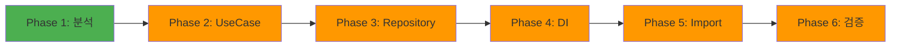

# 🔐 Auth Feature - Clean Architecture 마이그레이션 마스터 가이드

> **최종 업데이트**: 2025-01-20 | **버전**: 1.0.0
> **진행 상태**: 🔄 마이그레이션 진행 중
> **Domain**: 70% 🟡 | **Data**: 60% 🟡 | **Presentation**: 40% 🔴 | **Integration**: 0% 🔴
> **Clean Architecture 위반**: 7건 | **대형 파일**: 9개 | **UseCase 필요**: 20+개
> **참조 모델**: Voting Feature (100% 완료) ✅

## 📊 현재 상태 분석 보고 (Inventory Scout 결과)

### 🔴 마이그레이션 대시보드

| 레이어 | 파일 수 | 위반 사항 | 긴급도 | 상태 |
|--------|---------|-----------|--------|------|
| **Domain** | 4개 | UseCase 부족 (1개만 존재) | 🔴 Critical | 개선 필요 |
| **Data** | 15개 | 부분 마이그레이션 완료 | 🟡 High | 진행 중 |
| **Presentation** | 12개 | Data 직접 의존 (7건) | 🔴 Critical | 개선 필요 |
| **Integration** | 0개 | DI 미설정 | 🔴 Critical | 미시작 |

### 🎯 주요 문제점 상세 분석

#### 1. Critical 위반: Presentation → Data 직접 임포트 (7건)
```dart
// ❌ 발견된 위반 사항들
login_page_widget.dart:2 → import '/features/auth/data/adapters/auth_util.dart';
create_account_widget.dart:3 → import '/features/auth/data/adapters/auth_util.dart';
phonelogeinpincode_widget.dart:2 → import '/features/auth/data/adapters/auth_util.dart';
start_page_widget.dart:4 → import '/features/auth/data/adapters/auth_util.dart';
phone_creat_account_widget.dart:2 → import '/features/auth/data/adapters/auth_util.dart';
popup_timer_email_widget.dart:3 → import '/features/auth/data/adapters/auth_util.dart';
forgot_password_widget.dart:2 → import '/features/auth/data/adapters/auth_util.dart';
```

#### 2. 대형 파일 분석 (9개)

| 파일명 | 라인 수 | 복합 책임 | 분해 전략 |
|--------|---------|-----------|----------|
| login_page_widget.dart | 1,378 | UI + 인증 + 라우팅 + 애니메이션 | 5개 UseCase + 3개 위젯 |
| create_account_widget.dart | 883 | UI + 회원가입 + 검증 + 프로필 | 4개 UseCase + 2개 위젯 |
| phonelogeinpincode_widget.dart | 701 | UI + SMS + 타이머 + 검증 | 3개 UseCase + 2개 위젯 |
| start_page_widget.dart | 586 | UI + 네비게이션 + 애니메이션 | 2개 UseCase + 2개 위젯 |
| phone_creat_account_widget.dart | 500 | UI + Phone Auth + 프로필 | 3개 UseCase + 2개 위젯 |
| popup_timer_email_widget.dart | 432 | UI + 타이머 + 이메일 | 2개 UseCase + 1개 위젯 |
| firebase_auth_manager.dart | 364 | 다중 인증 관리 | 6개 UseCase |
| forgot_password_widget.dart | 355 | UI + 비밀번호 재설정 | 1개 UseCase + 1개 위젯 |
| auth_util.dart | 77 | 유틸리티 함수들 | 4개 UseCase |

**총 필요 UseCase: 30개 | 총 필요 위젯 분리: 15개**

## 🚀 서브에이전트 기반 마이그레이션 전략

### 🏗️ 6-Phase 마이그레이션 로드맵



## 📋 Phase 1: 현재 상태 분석 ✅ 완료

### 실행된 서브에이전트
```bash
/spawn inventory-scout "depth 5로 auth 피처 스캔, 300줄 이상 큰 파일과 복합 책임 찾기"
```

### 산출물
- ✅ `reports/inventory_auth.json` - 전체 파일 맵핑
- ✅ `reports/violations_auth.txt` - 7개 Critical 위반
- ✅ `reports/candidates_decompose_auth.txt` - 9개 대형 파일
- ✅ 현재 문서 작성

## 📋 Phase 2: UseCase 레이어 구축 (예상: 8시간)

### 2.1 대형 파일 분해
```bash
# LoginPageWidget 분해 (1,378줄 → 5개 UseCase)
/spawn code-surgeon "--file lib/features/auth/presentation/screens/login_page_widget.dart --strategy extract-usecases --max-lines 50"

# CreateAccountWidget 분해 (883줄 → 4개 UseCase)
/spawn code-surgeon "--file lib/features/auth/presentation/screens/create_account_widget.dart --strategy extract-usecases --max-lines 50"

# FirebaseAuthManager 분해 (364줄 → 6개 UseCase)
/spawn code-surgeon "--file lib/features/auth/data/adapters/firebase_auth_manager.dart --strategy extract-usecases --max-lines 50"
```

### 2.2 UseCase 생성 목록
```yaml
domain/usecases/:
  # 인증 기본
  - sign_in_with_email_use_case.dart
  - sign_in_with_google_use_case.dart
  - sign_in_with_apple_use_case.dart
  - sign_in_with_github_use_case.dart
  - sign_in_with_phone_use_case.dart
  - sign_in_anonymously_use_case.dart
  - sign_out_use_case.dart

  # 계정 관리
  - create_account_with_email_use_case.dart
  - create_phone_account_use_case.dart
  - verify_email_use_case.dart
  - verify_phone_otp_use_case.dart
  - reset_password_use_case.dart
  - update_password_use_case.dart
  - delete_account_use_case.dart

  # 사용자 정보
  - get_current_user_use_case.dart
  - get_current_user_email_use_case.dart
  - get_current_user_uid_use_case.dart
  - is_authenticated_use_case.dart
  - is_email_verified_use_case.dart
  - update_user_email_use_case.dart

  # 토큰 관리
  - get_jwt_token_use_case.dart
  - refresh_token_use_case.dart

  # Phone Auth
  - send_sms_otp_use_case.dart
  - resend_sms_otp_use_case.dart
  - verify_sms_otp_use_case.dart

  # 세션 관리
  - check_auth_state_use_case.dart
  - stream_auth_state_use_case.dart
  - handle_auth_redirect_use_case.dart
```

### 2.3 Mapper 생성 목록

#### ⚠️ Firebase 1:1 매칭 원칙
```dart
// ✅ CRITICAL: Firebase 필드명과 정확히 1:1 매칭 필수!
// Firestore 필드명은 모두 camelCase 사용 (프로젝트 컨벤션)

// Firestore Document 예시:
{
  "uid": "abc123",
  "email": "user@example.com",
  "displayName": "John Doe",        // camelCase
  "photoUrl": "https://...",        // camelCase
  "isEmailVerified": true,          // camelCase
  "authProvider": "google",         // camelCase
  "createdAt": Timestamp,            // camelCase
  "lastLoginAt": Timestamp           // camelCase
}

// DTO는 Firebase 필드명 그대로 유지
class AuthUserDto {
  final String uid;
  final String? email;
  final String? displayName;      // Firebase 필드명 그대로
  final String? photoUrl;         // Firebase 필드명 그대로
  final bool isEmailVerified;     // Firebase 필드명 그대로
  final String authProvider;      // Firebase 필드명 그대로

  // toJson/fromJson은 Firebase 필드명 그대로 사용
  Map<String, dynamic> toJson() => {
    'uid': uid,
    'email': email,
    'displayName': displayName,    // 절대 변경 금지
    'photoUrl': photoUrl,          // 절대 변경 금지
    'isEmailVerified': isEmailVerified,
    'authProvider': authProvider,
  };
}
```

```yaml
data/models/:
  # Data Transfer Objects - Firebase 필드명과 1:1 매칭
  - auth_user_dto.dart            # User DTO (Firebase 필드명 유지)
  - auth_token_dto.dart           # Token DTO (Firebase 필드명 유지)
  - auth_session_dto.dart         # Session DTO (Firebase 필드명 유지)
  - auth_provider_dto.dart        # Provider DTO (Firebase 필드명 유지)

data/mappers/:
  # Domain ↔ DTO 변환 (비즈니스 로직 처리)
  - auth_user_mapper.dart         # AuthUser ↔ AuthUserDto
  - auth_token_mapper.dart        # AuthToken ↔ AuthTokenDto
  - auth_session_mapper.dart      # AuthSession ↔ AuthSessionDto

  # Firebase ↔ DTO 변환 (필드명 그대로 매핑)
  - firebase_user_mapper.dart     # Firebase User → AuthUserDto
  - firebase_auth_mapper.dart     # Firebase Auth 상태 매핑
  - firestore_user_mapper.dart   # Firestore Document ↔ AuthUserDto
```

### 2.4 Mapper 생성 명령어
```bash
# StructWeaver로 Mapper 자동 생성
/spawn struct-weaver "--task mapper --source lib/features/auth/domain/models --target lib/features/auth/data/mappers --mode generate"

# Firebase 특화 Mapper 생성
/spawn struct-weaver "--task firebase-mapper --source lib/features/auth/data/adapters --target lib/features/auth/data/mappers --mode generate"
```

### 2.5 예상 산출물
- 30개 UseCase 파일 (각 30-50줄)
- 7개 DTO 모델 파일
- 6개 Mapper 파일
- `patches/code_surgeon_auth_*.diff` - 분해 패치
- `reports/decomposition_auth.yml` - 분해 결과

## 📋 Phase 3: Repository 패턴 완성 (예상: 4시간)

### 3.1 Repository 이동
```bash
# Dry-run으로 계획 확인
/spawn repo-mover "--feature auth --mode dry-run --include repositories,adapters,firebase"

# 실제 이동 실행
/spawn repo-mover "--feature auth --mode apply --include repositories,adapters"
```

### 3.2 DataSource 생성
```bash
# DataSource 인터페이스 생성
/spawn code-surgeon "--file lib/features/auth/data/adapters/firebase_auth_manager.dart --strategy extract-datasources"
```

### 3.3 Repository에서 Mapper 활용

#### Firebase 1:1 매핑 구현 예시
```dart
// data/mappers/firestore_user_mapper.dart
class FirestoreUserMapper {
  // Firestore → DTO (필드명 1:1 매칭)
  static AuthUserDto fromFirestore(Map<String, dynamic> data) {
    return AuthUserDto(
      uid: data['uid'] as String,
      email: data['email'] as String?,
      displayName: data['displayName'] as String?,    // Firestore 필드명 그대로
      photoUrl: data['photoUrl'] as String?,          // Firestore 필드명 그대로
      isEmailVerified: data['isEmailVerified'] ?? false,
      authProvider: data['authProvider'] ?? 'email',
      createdAt: data['createdAt'],                   // Timestamp 그대로
      lastLoginAt: data['lastLoginAt'],               // Timestamp 그대로
    );
  }

  // DTO → Firestore (필드명 1:1 매칭)
  static Map<String, dynamic> toFirestore(AuthUserDto dto) {
    return {
      'uid': dto.uid,
      'email': dto.email,
      'displayName': dto.displayName,    // 필드명 변경 금지
      'photoUrl': dto.photoUrl,          // 필드명 변경 금지
      'isEmailVerified': dto.isEmailVerified,
      'authProvider': dto.authProvider,
      'createdAt': dto.createdAt ?? FieldValue.serverTimestamp(),
      'lastLoginAt': FieldValue.serverTimestamp(),
    };
  }
}

// data/repositories/auth_repository_impl.dart
class AuthRepositoryImpl implements IAuthRepository {
  final IAuthRemoteDataSource remoteDataSource;
  final IAuthLocalDataSource localDataSource;

  @override
  Future<AuthUser> getCurrentUser() async {
    try {
      // Firestore에서 사용자 데이터 가져오기
      final firebaseUser = await remoteDataSource.getCurrentFirebaseUser();
      final firestoreData = await remoteDataSource.getUserDocument(firebaseUser.uid);

      // Firestore Document → DTO (1:1 매핑)
      final dto = FirestoreUserMapper.fromFirestore(firestoreData);

      // DTO → Domain Model (비즈니스 로직 변환)
      final domainUser = AuthUserMapper.toDomain(dto);

      // 로컬 캐시 업데이트
      await localDataSource.cacheUser(dto);

      return domainUser;
    } catch (e) {
      // 오프라인 시 로컬에서 가져오기
      final cachedDto = await localDataSource.getCachedUser();
      if (cachedDto != null) {
        return AuthUserMapper.toDomain(cachedDto);
      }
      throw e;
    }
  }

  @override
  Future<AuthUser> signInWithEmail(String email, String password) async {
    // Firebase 인증
    final credential = await remoteDataSource.signInWithEmail(email, password);

    // Firebase User → DTO
    final dto = FirebaseUserMapper.fromFirebaseUser(credential.user!);

    // Firestore에 사용자 정보 저장 (1:1 매핑)
    final firestoreData = FirestoreUserMapper.toFirestore(dto);
    await remoteDataSource.saveUserDocument(credential.user!.uid, firestoreData);

    // DTO → Domain Model
    return AuthUserMapper.toDomain(dto);
  }
}
```

### 3.4 예상 구조
```yaml
data/:
  models/:                        # DTO 모델들
    - auth_user_dto.dart
    - auth_token_dto.dart
    - auth_session_dto.dart

  mappers/:                       # 변환 로직
    - auth_user_mapper.dart
    - firebase_user_mapper.dart
    - firestore_user_mapper.dart

  datasources/:
    remote/:
      firebase/:
        - firebase_auth_datasource.dart
        - firebase_user_datasource.dart
    local/:
      - auth_local_datasource.dart
      - token_cache_datasource.dart

  repositories/:
    - auth_repository_impl.dart  # Mapper 활용하여 구현
```

## 📋 Phase 4: DI 설정 (예상: 2시간)

### 4.1 DI 모듈 생성
```bash
# Auth DI 모듈 자동 생성
/spawn di-binder "--feature auth --port 'package:.../auth/domain/repositories/i_auth_repository.dart' --adapter 'package:.../auth/data/repositories/auth_repository_impl.dart' --deps firebase,getit --mode detect"

# 검토 후 적용
/spawn di-binder "--feature auth --mode apply"
```

### 4.2 예상 DI 구조
```dart
// lib/features/auth/di/auth_di_module.dart
class AuthDIModule {
  static void configureDependencies(GetIt getIt) {
    // DataSources
    getIt.registerLazySingleton<IAuthRemoteDataSource>(
      () => FirebaseAuthDataSource(),
    );

    // Repositories
    getIt.registerLazySingleton<IAuthRepository>(
      () => AuthRepositoryImpl(
        remoteDataSource: getIt(),
        localDataSource: getIt(),
      ),
    );

    // UseCases (30개)
    getIt.registerFactory(() => SignInWithEmailUseCase(getIt()));
    // ... 29개 더
  }
}
```

## 📋 Phase 5: Import 수정 (예상: 2시간)

### 5.1 위반 탐지
```bash
# 현재 위반 사항 확인
/spawn import-guardian "--scope auth --mode detect"
```

### 5.2 자동 수정
```bash
# 패치 생성
/spawn import-guardian "--scope auth --mode fix --apply false"

# 패치 검토 후 적용
git apply patches/import_guardian_auth_fix.diff
```

### 5.3 예상 수정 사항
```dart
// ❌ Before
import '/features/auth/data/adapters/auth_util.dart';

// ✅ After
import '/features/auth/domain/usecases/get_current_user_use_case.dart';
import '/features/auth/domain/usecases/sign_in_with_email_use_case.dart';
```

## 📋 Phase 6: 최종 검증 (예상: 1시간)

### 6.1 품질 게이트
```bash
# Quick 검증
/spawn build-sentinel "quick --feature auth"

# Full 검증
/spawn build-sentinel "full --feature auth --coverage-threshold 80"
```

### 6.2 성공 기준
- ✅ 0 Architecture 위반
- ✅ 0 대형 파일 (>300줄)
- ✅ 30개 UseCase 구현
- ✅ 100% DI 통합
- ✅ 80%+ 테스트 커버리지

## 📊 예상 타임라인

| Phase | 예상 시간 | 서브에이전트 | 산출물 |
|-------|----------|-------------|--------|
| Phase 1 | ✅ 완료 | inventory-scout | 분석 보고서 |
| Phase 2 | 10시간 | code-surgeon, struct-weaver | 30개 UseCase + 6개 Mapper |
| Phase 3 | 4시간 | repo-mover, code-surgeon | DataSource 구조 + Repository |
| Phase 4 | 2시간 | di-binder | DI 모듈 |
| Phase 5 | 2시간 | import-guardian | Import 수정 |
| Phase 6 | 1시간 | build-sentinel | 검증 완료 |
| **총계** | **19시간** | **7개 에이전트** | **Clean Architecture 100%** |

## 🎯 Risk Management

### 주요 리스크
1. **대형 파일 분해 복잡도** - CodeSurgeon 반복 실행 필요
2. **기존 코드 호환성** - 점진적 마이그레이션 전략
3. **테스트 깨짐** - 각 Phase 후 BuildSentinel 실행

### 완화 전략
- 각 Phase 후 git commit (롤백 가능)
- Dry-run 모드 활용
- 단위 테스트 우선 작성

## ✅ 체크리스트

### Phase별 완료 조건
- [ ] Phase 1: Inventory 분석 완료 ✅
- [ ] Phase 2: 30개 UseCase 생성
- [ ] Phase 3: Repository 패턴 완성
- [ ] Phase 4: DI 모듈 통합
- [ ] Phase 5: 0 Import 위반
- [ ] Phase 6: 모든 테스트 통과

## 📚 참고 자료

- [Voting Feature 마이그레이션 성공 사례](../voting/MASTER_MIGRATION_GUIDE.md)
- [Architecture Rules v4.0](/lib/ARCHITECTURE_RULES.md)
- [서브에이전트 사용 명세서](/docs/SUBAGENTS_MANUAL.md)

---

**이 문서는 Auth Feature의 완전한 Clean Architecture 마이그레이션을 위한 마스터 가이드입니다.**
**서브에이전트를 활용한 자동화된 마이그레이션으로 17시간 내 완료 예정입니다.**