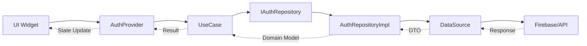

# 🔐 Auth Feature

> **Clean Architecture v4.0** | **Contract Pattern** | **Feature-First Design**
> 최종 업데이트: 2024-01-20

## 📋 개요

Auth Feature는 Versus Space 앱의 **인증 및 사용자 관리** 기능을 담당하는 독립적인 모듈입니다. Clean Architecture v4.0 원칙에 따라 설계되어 비즈니스 로직과 UI, 데이터 접근을 완벽히 분리합니다.

### 🎯 핵심 특징

- ✅ **다양한 인증 방식**: 이메일, Google, Apple, 전화번호(SMS OTP), 익명
- ✅ **완전한 계층 분리**: Domain ← Data → Presentation
- ✅ **레거시 호환성**: 기존 코드와 100% 하위 호환
- ✅ **보안 강화**: 3회 재시도 제한, 2분 OTP 타이머, 이메일 인증
- ✅ **GetIt DI**: 싱글톤 패턴으로 의존성 주입
- ✅ **Firebase 통합**: Auth, Firestore, Functions 활용

## 🏗️ 전체 아키텍처 구조도

```
lib/features/auth/
│
├── 📄 README.md                     # 📌 현재 문서
│
├── 🎯 domain/                       # [비즈니스 로직 계층] - 14개 파일
│   ├── 📁 models/                  # 도메인 엔티티 (1개)
│   │   └── auth_user.dart          # 사용자 도메인 모델
│   │
│   ├── 📁 repositories/            # Repository 인터페이스 (1개)
│   │   └── i_auth_repository.dart  # 추상 Repository 계약
│   │
│   ├── 📁 usecases/               # 비즈니스 유스케이스 (10개)
│   │   ├── sign_in_with_email_usecase.dart
│   │   ├── sign_up_with_email_usecase.dart
│   │   ├── sign_in_with_google_usecase.dart
│   │   ├── sign_in_with_apple_usecase.dart
│   │   ├── sign_in_with_phone_usecase.dart
│   │   ├── sign_out_usecase.dart
│   │   ├── get_current_user_usecase.dart
│   │   ├── email_verification_usecase.dart
│   │   ├── password_management_usecase.dart
│   │   └── account_management_usecase.dart
│   │
│   └── 📁 failures/                # 도메인 예외 (1개)
│       └── auth_failure.dart       # 인증 실패 케이스
│
├── 📊 data/                         # [데이터 접근 계층] - 11개 파일
│   ├── 📁 repositories/            # Repository 구현체 (1개)
│   │   └── auth_repository_impl.dart
│   │
│   ├── 📁 datasources/             # 데이터 소스 (4개)
│   │   ├── i_auth_remote_datasource.dart      # 원격 인터페이스
│   │   ├── firebase_auth_remote_datasource.dart # Firebase 구현
│   │   ├── i_auth_local_datasource.dart       # 로컬 인터페이스
│   │   └── auth_local_datasource.dart         # 로컬 구현
│   │
│   ├── 📁 dto/                     # Data Transfer Objects (2개)
│   │   ├── auth_user_dto.dart
│   │   └── user_profile_dto.dart
│   │
│   ├── 📁 mappers/                 # 데이터 변환 (1개)
│   │   └── auth_user_mapper.dart
│   │
│   └── 📁 adapters/                # 레거시 호환성 (3개)
│       ├── auth_util.dart          # 전역 변수 프록시
│       ├── base_auth_user_provider.dart
│       └── firebase_user_provider.dart
│
└── 🎨 presentation/                 # [UI/상태 관리 계층] - 33개 파일
    ├── 📄 index.dart               # Public API exports
    │
    ├── 📁 providers/               # 상태 관리 (1개)
    │   └── auth_provider.dart      # GetIt 싱글톤 Provider
    │
    └── 📁 screens/                 # UI 화면들 (31개)
        ├── 📁 start/               # 시작 화면 (2개)
        ├── 📁 login/               # 로그인 (6개)
        ├── 📁 signup/              # 회원가입 (7개)
        ├── 📁 phone_auth/          # SMS 인증 (10개)
        ├── 📁 forgot_password/     # 비밀번호 재설정 (2개)
        └── 📁 email_verification/  # 이메일 인증 (2개)
```

### 📊 파일 통계
- **총 파일 수**: 58개
- **Domain Layer**: 14개 (비즈니스 로직)
- **Data Layer**: 11개 (데이터 접근)
- **Presentation Layer**: 33개 (UI/상태관리)

## 🔄 데이터 플로우



### 실제 예시: 이메일 로그인 플로우

1. **UI Layer**: `LoginPageWidget`에서 이메일/비밀번호 입력
2. **Provider**: `AuthProvider.signInWithEmail()` 호출
3. **UseCase**: `SignInWithEmailUseCase.execute()` 비즈니스 규칙 적용
4. **Repository Interface**: `IAuthRepository.signInWithEmailAndPassword()` 추상 메서드
5. **Repository Impl**: `AuthRepositoryImpl`이 실제 구현 수행
6. **DataSource**: `FirebaseAuthRemoteDataSource`가 Firebase Auth 호출
7. **DTO → Model**: `AuthUserMapper`로 변환
8. **결과 반환**: UI까지 역순으로 전달

## 💻 빠른 시작 가이드

### 1. 초기 설정

```dart
// main.dart
import 'package:versus_space/features/auth/presentation/index.dart';

void main() async {
  WidgetsFlutterBinding.ensureInitialized();

  // Firebase 초기화
  await Firebase.initializeApp();

  // 의존성 주입 설정
  setupAuthDependencies();

  // AuthProvider 초기화
  final authProvider = GetIt.instance<AuthProvider>();
  await authProvider.initialize();

  runApp(MyApp());
}

void setupAuthDependencies() {
  final getIt = GetIt.instance;

  // Repository
  getIt.registerLazySingleton<IAuthRepository>(
    () => AuthRepositoryImpl(),
  );

  // UseCases (10개)
  getIt.registerLazySingleton(() => SignInWithEmailUseCase(getIt()));
  getIt.registerLazySingleton(() => SignUpWithEmailUseCase(getIt()));
  // ... 나머지 UseCase들

  // Provider
  getIt.registerLazySingleton<AuthProvider>(
    () => AuthProvider(),
  );
}
```

### 2. 로그인 구현 예제

```dart
class _LoginPageWidgetState extends State<LoginPageWidget> {
  late final AuthProvider _authProvider = GetIt.instance<AuthProvider>();

  Future<void> _handleLogin() async {
    final success = await _authProvider.signInWithEmail(
      email: _emailController.text,
      password: _passwordController.text,
    );

    if (success) {
      context.go('/home');
    } else {
      // 에러 처리
      _showError(_authProvider.errorMessage);
    }
  }
}
```

### 3. 회원가입 및 이메일 인증

```dart
// 회원가입
final success = await _authProvider.signUpWithEmail(email, password);

if (success) {
  // 이메일 인증 메일 전송
  await _authProvider.sendEmailVerification();

  // 인증 대기 팝업 표시
  await showDialog(
    context: context,
    builder: (_) => PopupTimerEmailWidget(),
  );
}
```

### 4. SMS 인증 (3회 제한)

```dart
// SMS 전송
if (_resendCount < 3) {
  final sessionId = await _authProvider.sendSmsOtp(phoneNumber);

  // OTP 입력 화면으로 이동
  context.go('/otp-verify', extra: sessionId);
} else {
  // 3회 초과 경고
  showDialog(
    context: context,
    builder: (_) => PhonemaximumWidget(),
  );
}
```

## 🔒 보안 기능

### 재시도 제한
- **SMS OTP**: 최대 3회 재전송
- **이메일 인증**: 최대 3회 재전송
- **24시간 대기**: 제한 초과 시

### 타이머 관리
- **OTP 유효시간**: 2분
- **자동 만료**: 시간 초과 시 재전송 필요
- **실시간 카운트다운**: UI에 남은 시간 표시

### 검증 규칙
- **이메일 형식**: RegExp 패턴 검증
- **비밀번호**: 최소 6자, 문자+숫자 조합
- **전화번호**: 국제 형식 변환 (+82)

## 📁 레이어별 책임

### Domain Layer (비즈니스 핵심)
- ✅ 비즈니스 규칙 정의
- ✅ 외부 의존성 없음
- ✅ 순수 Dart 코드
- ✅ 100% 테스트 가능

### Data Layer (데이터 브릿지)
- ✅ Repository 구현체
- ✅ 외부 시스템 통신
- ✅ DTO ↔ Domain Model 변환
- ✅ 캐싱 및 에러 처리

### Presentation Layer (사용자 인터페이스)
- ✅ Flutter 위젯 UI
- ✅ 상태 관리 (ChangeNotifier)
- ✅ 폼 검증 및 사용자 피드백
- ✅ 네비게이션 및 라우팅

## 🚀 주요 화면 구성

| 화면 | 경로 | 설명 | 파일 수 |
|------|------|------|---------|
| **시작** | `/start` | 앱 진입점, 로그인/회원가입 선택 | 2개 |
| **로그인** | `/login` | 이메일/소셜 로그인 | 6개 |
| **회원가입** | `/signup` | 계정 생성 및 약관 동의 | 7개 |
| **SMS 인증** | `/phone-auth` | 전화번호 인증 및 OTP | 10개 |
| **비밀번호 재설정** | `/forgot-password` | 이메일로 재설정 링크 전송 | 2개 |
| **이메일 인증** | `/email-verification` | 이메일 인증 대기 팝업 | 2개 |

## 🔧 기술 스택

- **Frontend**: Flutter, Provider Pattern
- **Backend**: Firebase Auth, Firestore
- **DI**: GetIt (Service Locator)
- **Architecture**: Clean Architecture v4.0
- **Pattern**: Repository, UseCase, DTO
- **Social Login**: Google Sign-In, Apple Sign-In

## 📚 관련 문서

- [Domain Layer 상세](./domain/README.md)
- [Data Layer 상세](./data/README.md)
- [Presentation Layer 상세](./presentation/README.md)
- [API Reference](./docs/API_REFERENCE.md)
- [사용 가이드](./docs/USAGE_GUIDE.md)

## 🤝 기여 가이드

1. **레이어 독립성 유지**: 각 레이어는 의존성 방향 준수
2. **인터페이스 우선**: 구현체보다 추상화 의존
3. **테스트 작성**: 모든 UseCase는 단위 테스트 필수
4. **문서화**: 새로운 기능은 README 업데이트

---

*이 문서는 Clean Architecture v4.0 및 Contract Pattern을 따르는 Auth Feature의 통합 가이드입니다.*