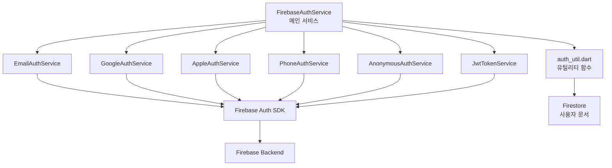

# 🔧 Auth Services Layer - 인증 서비스 계층

> Feature-First Architecture의 Data Layer 중 Services 구현

## 📋 개요

이 디렉토리는 인증 기능의 **Services Layer**를 담당합니다. 각 인증 제공자(Provider)별로 분리된 서비스를 구현하여 관심사 분리(Separation of Concerns)를 실현합니다.

### 🎯 목적
- **단일 책임 원칙**: 각 서비스는 하나의 인증 방식만 담당
- **모듈화**: 독립적인 서비스로 재사용성 극대화
- **유지보수성**: 특정 인증 방식 변경 시 해당 서비스만 수정
- **테스트 용이성**: 각 서비스별 독립적인 테스트 가능

## 🏗️ 아키텍처 구조

```
services/
├── firebase_auth_service.dart    # Firebase Auth 통합 관리
├── email_auth_service.dart       # 이메일/비밀번호 인증
├── google_auth_service.dart      # Google OAuth 2.0
├── apple_auth_service.dart       # Apple Sign In
├── github_auth_service.dart      # GitHub OAuth
├── phone_auth_service.dart       # 전화번호 SMS 인증
├── anonymous_auth_service.dart   # 익명 인증
├── jwt_token_service.dart        # JWT 토큰 관리
└── auth_util.dart                # 인증 유틸리티 함수
```

## 📂 파일 상세 설명

### 1. FirebaseAuthService (메인 서비스)

**책임**: Firebase Auth 인스턴스 관리 및 공통 기능 제공

**주요 기능**:
- 싱글톤 패턴으로 전역 인스턴스 관리
- 인증 상태 변경 감지 및 브로드캐스트
- 현재 사용자 정보 관리
- 토큰 관리 및 갱신

**주요 메서드**:
- `getCurrentUser()` - 현재 로그인 사용자
- `authStateChanges()` - 인증 상태 스트림
- `signOut()` - 공통 로그아웃 처리
- `getIdToken()` - ID 토큰 조회
- `refreshToken()` - 토큰 갱신
- `isEmailVerified()` - 이메일 인증 상태

### 2. EmailAuthService

**책임**: 이메일/비밀번호 인증 처리

**주요 메서드**:
- `signInWithEmail(email, password)` - 이메일 로그인
- `createUserWithEmail(email, password, displayName)` - 회원가입
- `sendPasswordResetEmail(email)` - 비밀번호 재설정 이메일
- `sendEmailVerification()` - 이메일 인증 발송
- `verifyEmail(oobCode)` - 이메일 인증 확인
- `updatePassword(newPassword)` - 비밀번호 변경

**에러 처리**:
- `email-already-in-use` → `EmailAlreadyInUseException`
- `invalid-email` → `InvalidEmailException`
- `weak-password` → `WeakPasswordException`
- `user-not-found` → `UserNotFoundException`
- `wrong-password` → `WrongPasswordException`

### 3. GoogleAuthService

**책임**: Google OAuth 2.0 인증

**주요 메서드**:
- `signInWithGoogle()` - Google 로그인
- `linkGoogleAccount()` - 기존 계정에 Google 연결
- `unlinkGoogleAccount()` - Google 연결 해제
- `signOutGoogle()` - Google 로그아웃

**필요 스코프**:
- `email` - 이메일 정보
- `profile` - 프로필 정보

**에러 처리**:
- `UserCancelledException` - 사용자가 로그인 취소
- `GoogleSignInException` - Google 서비스 오류

### 4. AppleAuthService

**책임**: Apple Sign In 처리

**주요 메서드**:
- `signInWithApple()` - Apple 로그인
- `linkAppleAccount()` - 기존 계정에 Apple 연결
- `unlinkAppleAccount()` - Apple 연결 해제

**설정 요구사항**:
- Bundle ID: `com.versusspace.app`
- Redirect URI: Firebase Auth Handler URL
- 필수 스코프: email, fullName

**특이사항**:
- Apple은 사용자 이름을 최초 로그인 시에만 제공
- iOS 13+ 필수

### 5. PhoneAuthService

**책임**: 전화번호 SMS 인증

**주요 메서드**:
- `verifyPhoneNumber(phoneNumber, callbacks)` - SMS 인증 코드 발송
- `confirmPhoneCode(smsCode)` - SMS 코드 확인
- `resendPhoneCode(phoneNumber)` - 코드 재전송
- `linkPhoneNumber(phoneNumber)` - 기존 계정에 전화번호 연결

**제한사항**:
- 최대 시도 횟수: 3회
- 코드 유효 시간: 60초
- 재전송 대기 시간: 60초

**콜백 처리**:
- `onCodeSent` - 코드 발송 성공
- `onError` - 오류 발생
- `onAutoVerification` - 자동 인증 (Android만 지원)

### 6. AnonymousAuthService

**책임**: 익명 인증 처리

**주요 메서드**:
- `signInAnonymously()` - 익명 로그인
- `linkAnonymousWithEmail(email, password)` - 익명 계정을 이메일 계정으로 전환
- `linkAnonymousWithGoogle()` - 익명 계정을 Google 계정으로 전환
- `linkAnonymousWithApple()` - 익명 계정을 Apple 계정으로 전환
- `isAnonymous()` - 익명 사용자 여부 확인

**제한사항**:
- 익명 사용자는 제한된 기능만 사용 가능
- 계정 전환 후 익명 상태로 돌아갈 수 없음

### 7. JwtTokenService

**책임**: JWT 토큰 관리 및 커스텀 토큰 인증

**주요 메서드**:
- `signInWithCustomToken(token)` - 커스텀 토큰으로 로그인
- `getIdToken(forceRefresh)` - ID 토큰 조회
- `getTokenClaims()` - 토큰 클레임 조회
- `verifyIdToken(token)` - 토큰 유효성 검증
- `startTokenRefreshTimer()` - 자동 토큰 갱신 시작
- `stopTokenRefreshTimer()` - 토큰 갱신 중지
- `setCustomClaims(claims)` - 커스텀 클레임 설정

**토큰 관리**:
- 토큰 유효기간: 1시간
- 자동 갱신 주기: 50분
- 커스텀 클레임: 서버 사이드 처리

### 8. AuthUtil

**책임**: 인증 관련 유틸리티 함수

**주요 함수**:
- `getCurrentUser()` - 현재 사용자 조회
- `isLoggedIn()` - 로그인 상태 확인
- `isEmailVerified()` - 이메일 인증 상태
- `isAnonymous()` - 익명 사용자 여부
- `getCurrentUserUid()` - 현재 사용자 UID
- `getUserDisplayName()` - 사용자 표시 이름
- `getUserEmail()` - 사용자 이메일
- `getUserPhotoUrl()` - 프로필 사진 URL
- `createUserDocument(user)` - Firestore 사용자 문서 생성
- `updateLastSignIn()` - 마지막 로그인 시간 업데이트
- `getAuthErrorMessage(exception)` - 인증 에러 메시지 변환

**유틸리티 기능**:
- 현재 사용자 정보 접근
- Firestore 사용자 문서 관리
- 에러 메시지 한글 변환
- 로그인 시간 추적

## 🔄 서비스 통합 플로우



## 🧪 테스트 전략

### 테스트 케이스
- **성공 시나리오**: 각 인증 방식별 정상 동작 테스트
- **실패 시나리오**: 잘못된 자격증명, 네트워크 오류 등
- **엣지 케이스**: 이메일 미인증, 토큰 만료, 계정 제한 등
- **통합 테스트**: Firebase Auth와의 실제 통합 테스트

### Mock 객체
- `MockFirebaseAuth` - Firebase Auth 시뮬레이션
- `MockGoogleSignIn` - Google 로그인 시뮬레이션
- `MockUserCredential` - 인증 결과 시뮬레이션

## 🔐 보안 고려사항

1. **자격증명 보호**
   - OAuth 토큰은 메모리에만 보관
   - Refresh 토큰 안전한 저장
   - 민감한 정보 로깅 금지

2. **에러 처리**
   - 상세 에러 정보 노출 방지
   - 사용자 친화적 메시지 제공
   - 보안 관련 에러 로깅

3. **세션 관리**
   - 토큰 자동 갱신
   - 비활성 세션 자동 종료
   - 다중 디바이스 세션 관리

## 🚀 마이그레이션 가이드

### 파일 이동 계획

| 현재 위치 | 대상 위치 | 설명 |
|----------|-----------|------|
| `/lib/auth/firebase_auth/firebase_auth_manager.dart` | `firebase_auth_service.dart` | 메인 서비스로 리팩토링 |
| `/lib/auth/firebase_auth/email_auth.dart` | `email_auth_service.dart` | 그대로 이동 |
| `/lib/auth/firebase_auth/google_auth.dart` | `google_auth_service.dart` | 그대로 이동 |
| `/lib/auth/firebase_auth/apple_auth.dart` | `apple_auth_service.dart` | 그대로 이동 |
| `/lib/auth/firebase_auth/github_auth.dart` | `github_auth_service.dart` | 그대로 이동 |
| `/lib/auth/firebase_auth/anonymous_auth.dart` | `anonymous_auth_service.dart` | 그대로 이동 |
| `/lib/auth/firebase_auth/jwt_token_auth.dart` | `jwt_token_service.dart` | 클래스로 리팩토링 |
| `/lib/auth/firebase_auth/auth_util.dart` | `auth_util.dart` | 그대로 이동 |

### 마이그레이션 단계
1. **Services 이동** (1시간) - 기존 파일을 새 구조로 이동
2. **인터페이스 정의** (30분) - 각 서비스별 인터페이스 작성
3. **의존성 수정** (30분) - import 경로 업데이트
4. **테스트 작성** (1시간) - 각 서비스별 단위 테스트
5. **통합 테스트** (30분) - 전체 인증 플로우 테스트

## 📊 성능 최적화

1. **싱글톤 패턴**
   - FirebaseAuthService 싱글톤 구현
   - 메모리 효율성 향상

2. **토큰 캐싱**
   - ID 토큰 50분 캐싱
   - 불필요한 네트워크 요청 감소

3. **에러 재시도**
   - 네트워크 오류 시 자동 재시도
   - 지수 백오프 적용

## 🔗 관련 문서

- [Auth Feature 전체 마이그레이션 가이드](../../MIGRATION_AUTH.md)
- [Repository Layer](../repositories/README.md)
- [Domain Models](../../domain/models/README.md)
- [Presentation Layer](../../presentation/README.md)

## 📝 체크리스트

### 구현 완료도
- [ ] `firebase_auth_service.dart` 메인 서비스 구현
- [ ] `email_auth_service.dart` 이메일 인증
- [ ] `google_auth_service.dart` Google OAuth
- [ ] `apple_auth_service.dart` Apple Sign In
- [ ] `phone_auth_service.dart` SMS 인증
- [ ] `anonymous_auth_service.dart` 익명 인증
- [ ] `jwt_token_service.dart` 토큰 관리
- [ ] `auth_util.dart` 유틸리티
- [ ] 단위 테스트 작성
- [ ] 통합 테스트 작성

### 마이그레이션 체크포인트
- [ ] 기존 서비스 분석 완료
- [ ] Mixin 패턴 적용 결정
- [ ] 에러 처리 전략 수립
- [ ] 테스트 시나리오 작성
- [ ] 보안 검토 완료

---

*이 문서는 Feature-First Architecture의 Auth Services Layer 구현 가이드입니다.*
*작성일: 2025-08-24*
*버전: 1.0*