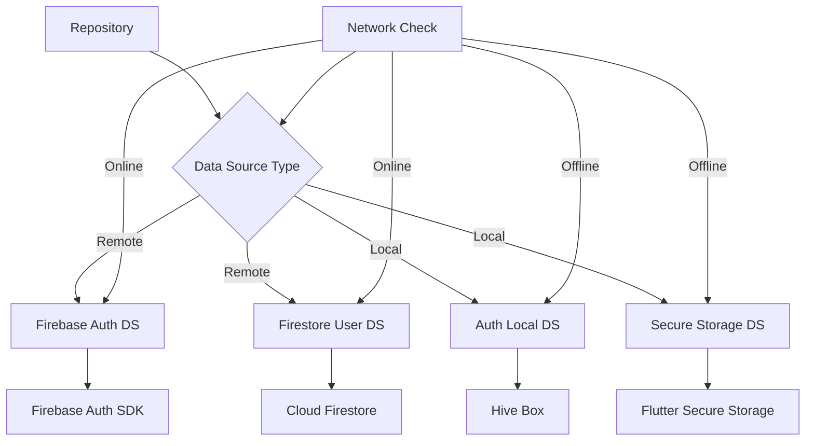

# 📡 /lib/features/auth/data/datasources

> Feature-First Architecture - Auth 데이터소스 계층
> 최종 업데이트: 2025-08-25

## 📋 개요

인증 기능의 **Data Sources Layer**를 담당하는 디렉토리입니다. 원격(Remote) 및 로컬(Local) 데이터 소스를 분리하여 데이터 접근을 추상화합니다.

### 🎯 목적
- **데이터 소스 분리**: 원격/로컬 데이터 접근 로직 분리
- **캐싱 전략**: 로컬 캐시를 통한 성능 최적화
- **오프라인 지원**: 네트워크 없이도 기본 기능 제공
- **테스트 용이성**: Mock 데이터소스로 단위 테스트 지원

## 🏗️ 디렉토리 구조

```
datasources/
├── remote/                               # 원격 데이터소스
│   ├── firebase_auth_datasource.dart    # Firebase Auth API 접근
│   ├── firestore_user_datasource.dart   # Firestore 사용자 데이터
│   └── third_party_auth_datasource.dart # 서드파티 OAuth 통합
│
└── local/                                # 로컬 데이터소스
    ├── auth_local_datasource.dart       # 인증 정보 로컬 캐시
    ├── user_preferences_datasource.dart # 사용자 설정 저장
    └── secure_storage_datasource.dart   # 보안 저장소 (토큰 등)
```

## 📂 Remote 데이터소스 사양

### FirebaseAuthDatasource
**책임**: Firebase Authentication과의 통신 인터페이스

**주요 메서드**:
- `signInWithEmailAndPassword(email, password)` - 이메일/비밀번호 로그인
- `signInWithGoogle()` - Google OAuth 로그인
- `signInWithApple()` - Apple OAuth 로그인
- `signInWithPhone(phoneNumber)` - 전화번호 인증
- `createUserWithEmailAndPassword(email, password)` - 계정 생성
- `resetPassword(email)` - 비밀번호 재설정
- `verifyEmail()` - 이메일 인증
- `updatePassword(newPassword)` - 비밀번호 변경
- `deleteAccount()` - 계정 삭제
- `signOut()` - 로그아웃

**속성**:
- `authStateChanges: Stream<User?>` - 인증 상태 스트림
- `currentUser: User?` - 현재 로그인 사용자
- `isEmailVerified: bool` - 이메일 인증 여부

### FirestoreUserDatasource
**책임**: Firestore 사용자 데이터 관리 인터페이스

**주요 메서드**:
- `getUserProfile(uid)` - 사용자 프로필 조회
- `createUserProfile(userData)` - 신규 프로필 생성
- `updateUserProfile(uid, updates)` - 프로필 정보 업데이트
- `deleteUserProfile(uid)` - 프로필 삭제
- `checkUsernameAvailability(username)` - 사용자명 중복 확인
- `searchUsers(query)` - 사용자 검색
- `getUsersByRole(role)` - 역할별 사용자 조회

**스트림 메서드**:
- `userStream(uid)` - 실시간 사용자 정보 스트림
- `usersStream()` - 전체 사용자 목록 스트림

### ThirdPartyAuthDatasource
**책임**: 서드파티 OAuth 프로바이더 통합

**지원 프로바이더**:
- Google Sign-In
- Apple Sign-In  
- GitHub OAuth
- Phone Auth (SMS)

**주요 메서드**:
- `authenticateWithProvider(provider)` - 프로바이더별 인증
- `linkProvider(provider)` - 기존 계정에 프로바이더 연결
- `unlinkProvider(provider)` - 프로바이더 연결 해제
- `getLinkedProviders()` - 연결된 프로바이더 목록

## 📂 Local 데이터소스 사양

### AuthLocalDatasource
**책임**: 로컬 인증 데이터 캐싱 및 관리

**주요 메서드**:
- `initialize()` - 로컬 스토리지 초기화
- `cacheUser(userData)` - 사용자 정보 캐싱
- `getCachedUser()` - 캐시된 사용자 조회
- `saveToken(token)` - 액세스 토큰 저장
- `getToken()` - 저장된 토큰 조회
- `saveRefreshToken(refreshToken)` - 리프레시 토큰 저장
- `getRefreshToken()` - 리프레시 토큰 조회
- `clearCache()` - 전체 캐시 삭제
- `remove(key)` - 특정 키 삭제
- `isCacheValid()` - 캐시 유효성 검증

**캐시 정책**:
- 유효 기간: 24시간
- 저장소: Hive Box
- 키 관리: 표준화된 키 사용

### SecureStorageDatasource
**책임**: 민감한 데이터의 안전한 저장 관리

**주요 메서드**:
- `write(key, value)` - 암호화된 데이터 저장
- `read(key)` - 암호화된 데이터 조회
- `delete(key)` - 특정 데이터 삭제
- `deleteAll()` - 모든 보안 데이터 삭제
- `containsKey(key)` - 키 존재 여부 확인

**생체 인증 관련**:
- `saveBiometricCredentials(username, password)` - 생체 인증용 자격증명 저장
- `getBiometricCredentials()` - 생체 인증 자격증명 조회
- `clearBiometricData()` - 생체 인증 데이터 삭제

### UserPreferencesDatasource
**책임**: 사용자 설정 및 선호도 로컬 저장

**설정 관리 메서드**:
- `setAutoLogin(enabled)` - 자동 로그인 설정
- `getAutoLogin()` - 자동 로그인 상태 조회
- `setBiometricEnabled(enabled)` - 생체 인증 활성화
- `getBiometricEnabled()` - 생체 인증 상태 조회
- `setLastAuthMethod(method)` - 마지막 인증 방법 저장
- `getLastAuthMethod()` - 마지막 인증 방법 조회

**앱 설정**:
- `setLanguage(languageCode)` - 언어 설정
- `getLanguage()` - 현재 언어 조회
- `setThemeMode(mode)` - 테마 모드 설정
- `getThemeMode()` - 현재 테마 조회
- `setNotificationSettings(settings)` - 알림 설정
- `getNotificationSettings()` - 알림 설정 조회

## 🔄 데이터 흐름



## 🧪 테스트 전략

### Mock 데이터소스 구현 가이드
- **MockFirebaseAuthDatasource**: Firebase Auth 동작 시뮬레이션
- **MockFirestoreUserDatasource**: Firestore 사용자 데이터 Mock
- **MockLocalDatasource**: 로컬 캐시 테스트용 Mock
- **InMemorySecureStorage**: 메모리 기반 보안 저장소 Mock

### 테스트 시나리오
- 성공적인 로그인/로그아웃 플로우
- 인증 실패 케이스 (잘못된 비밀번호, 없는 사용자)
- 네트워크 오류 시뮬레이션
- 캐시 히트/미스 시나리오
- 토큰 만료 및 갱신

## 🔐 보안 고려사항

### 데이터 암호화
- **로컬 저장**: 민감한 데이터는 FlutterSecureStorage 사용
- **네트워크**: HTTPS 통신 강제
- **토큰 관리**: JWT 토큰 만료 시간 관리

### 접근 제어
- **Firebase Rules**: Firestore 보안 규칙 설정
- **API 키 보호**: 환경 변수로 관리
- **생체 인증**: 추가 보안 레이어

## ⚠️ 에러 처리

### 커스텀 예외 타입
**기본 예외**:
- `DataSourceException` - 데이터소스 레벨 기본 예외
- `NetworkException` - 네트워크 연결 실패
- `CacheException` - 캐시 작업 실패
- `TimeoutException` - 작업 시간 초과

**인증 관련 예외**:
- `UserNotFoundException` - 사용자를 찾을 수 없음
- `WrongPasswordException` - 잘못된 비밀번호
- `EmailAlreadyInUseException` - 이미 사용 중인 이메일
- `WeakPasswordException` - 약한 비밀번호
- `InvalidCredentialsException` - 유효하지 않은 자격증명
- `SessionExpiredException` - 세션 만료
- `UnknownAuthException` - 알 수 없는 인증 오류

## ✅ 체크리스트

### 구현 완료
- [x] Firebase Auth 데이터소스
- [x] Firestore User 데이터소스
- [x] 로컬 캐시 데이터소스
- [x] 보안 저장소 데이터소스

### 구현 예정
- [ ] GraphQL 데이터소스
- [ ] REST API 데이터소스
- [ ] WebSocket 실시간 데이터소스
- [ ] 오프라인 동기화 로직

## 📚 참고 자료

- [Firebase Auth Documentation](https://firebase.google.com/docs/auth)
- [Cloud Firestore Documentation](https://firebase.google.com/docs/firestore)
- [Hive Documentation](https://docs.hivedb.dev/)
- [Flutter Secure Storage](https://pub.dev/packages/flutter_secure_storage)

---

*이 문서는 Feature-First Architecture의 Auth 기능 데이터소스 가이드입니다.*
*최종 업데이트: 2025-08-24*