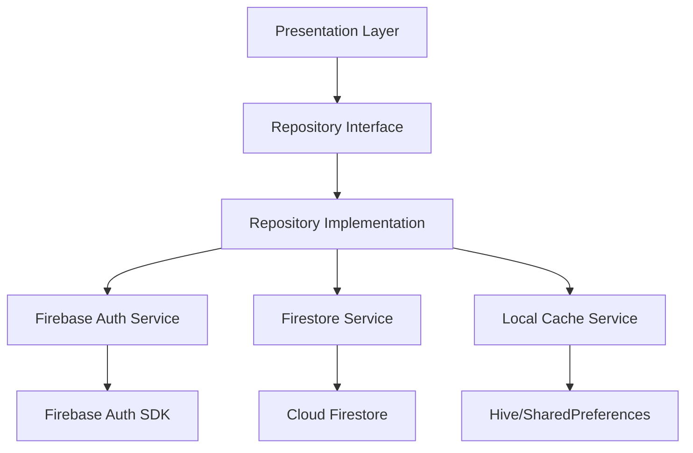

# 📦 Auth Repository Layer - 인증 데이터 계층

> Feature-First Architecture의 Data Layer 중 Repository 패턴 구현
> 최종 업데이트: 2025-08-25

## 📋 개요

이 디렉토리는 인증 기능의 **Repository Layer**를 담당합니다. Repository 패턴을 통해 데이터 소스를 추상화하고, 비즈니스 로직과 데이터 접근 로직을 분리합니다.

### 🎯 목적
- **데이터 소스 추상화**: Firebase Auth, Firestore, 로컬 캐시 등 다양한 데이터 소스를 통합 인터페이스로 제공
- **테스트 용이성**: 인터페이스 기반 설계로 Mock 객체를 활용한 단위 테스트 가능
- **유지보수성**: 데이터 소스 변경 시 Repository 구현체만 수정하면 됨
- **확장성**: 새로운 인증 방식 추가 시 기존 코드 영향 최소화

## 🏗️ 아키텍처 구조

```
repositories/
├── auth_repository.dart          # 인증 Repository 인터페이스
├── auth_repository_impl.dart     # 인증 Repository 구현체
└── user_repository.dart          # 사용자 데이터 Repository
```

## 📂 파일 상세 설명

### 1. AuthRepository (인터페이스)

**책임**: 인증 관련 모든 작업의 추상 인터페이스 정의

**주요 메서드**:

**인증 메서드**:
- `signInWithEmail(email, password)` - 이메일 로그인
- `signInWithGoogle()` - Google OAuth 로그인
- `signInWithApple()` - Apple OAuth 로그인
- `signInWithGithub()` - GitHub OAuth 로그인
- `signInWithPhone(phoneNumber)` - 전화번호 인증
- `signInAnonymously()` - 익명 로그인

**계정 관리**:
- `signUp(email, password)` - 회원가입
- `signOut()` - 로그아웃
- `deleteAccount()` - 계정 삭제

**비밀번호 관리**:
- `resetPassword(email)` - 비밀번호 재설정
- `updatePassword(newPassword)` - 비밀번호 변경

**이메일 인증**:
- `verifyEmail()` - 인증 이메일 발송
- `isEmailVerified()` - 이메일 인증 상태 확인

**상태 관리**:
- `authStateChanges()` - 인증 상태 스트림
- `currentUser` - 현재 사용자 getter
- `getIdToken()` - ID 토큰 조회
- `refreshToken()` - 토큰 갱신

**설계 원칙**:
- 모든 메서드는 Future 또는 Stream 반환 (비동기 처리)
- Null Safety 적용 (User? 타입 사용)
- 에러는 Exception으로 처리

### 2. AuthRepositoryImpl (구현체)

**책임**: AuthRepository 인터페이스의 실제 구현

**의존성**:
- `FirebaseAuthDatasource` - Firebase 인증
- `GoogleSignInDatasource` - Google OAuth
- `AppleSignInDatasource` - Apple OAuth  
- `GithubAuthDatasource` - GitHub OAuth
- `PhoneAuthDatasource` - 전화번호 인증
- `AuthLocalDatasource` - 로컬 캐시
- `SecureStorageDatasource` - 보안 저장소

**핵심 기능**:
- 여러 인증 서비스 통합 관리
- 에러 변환 및 통일된 에러 처리
- 캐싱 전략 구현
- 네트워크 오류 시 재시도 로직
- 도메인 모델 변환 (Firebase User → Domain User)

**구현 패턴**:
1. 데이터소스 호출
2. 에러 처리 및 변환
3. 캐시 업데이트
4. 도메인 모델 반환

**에러 변환 매핑**:
- `user-not-found` → `UserNotFoundException`
- `wrong-password` → `WrongPasswordException`
- `invalid-email` → `InvalidEmailException`
- `email-already-in-use` → `EmailAlreadyInUseException`
- `weak-password` → `WeakPasswordException`
- `network-request-failed` → `NetworkException`

### 3. user_repository.dart

**책임**: 사용자 프로필 데이터 관리

**의존성**:
- `FirestoreUserDatasource` - Firestore 사용자 데이터
- `AuthLocalDatasource` - 로컬 캐시
- `FirebaseStorageService` - 프로필 이미지 저장

**주요 메서드**:

**프로필 관리**:
- `getUserProfile(uid)` - 사용자 프로필 조회 (캐시 우선)
- `createUserProfile(userData)` - 신규 프로필 생성
- `updateUserProfile(user)` - 프로필 업데이트
- `deleteUserProfile(uid)` - 프로필 삭제

**프로필 이미지**:
- `uploadProfileImage(uid, image)` - 프로필 사진 업로드
- `deleteProfileImage(uid)` - 프로필 사진 삭제

**설정 관리**:
- `getUserSettings(uid)` - 사용자 설정 조회
- `updateUserSettings(uid, settings)` - 설정 업데이트

**프리미엄 상태**:
- `isPremiumUser(uid)` - 프리미엄 상태 확인
- `upgradeToPremium(uid)` - 프리미엄 업그레이드
- `cancelPremium(uid)` - 프리미엄 취소

**친구 관리**:
- `getFriends(uid)` - 친구 목록 조회
- `addFriend(uid, friendId)` - 친구 추가
- `removeFriend(uid, friendId)` - 친구 삭제

**캐싱 전략**:
1. 캐시 우선 조회
2. 캐시 미스 시 Firestore 조회
3. 조회 결과 캐시 업데이트
4. 업데이트 시 캐시 무효화

## 🔄 데이터 플로우



## 🧪 테스트 전략

### 단위 테스트 계획
- **Mock 객체 사용**: 모든 외부 의존성을 Mock으로 대체
- **테스트 케이스**: 성공 시나리오와 실패 시나리오 모두 테스트
- **에러 케이스**: 각 에러 타입별 처리 검증
- **캐시 동작**: 캐시 히트/미스 시나리오 테스트

### 테스트 커버리지 목표
- Repository 구현체: 80% 이상
- 에러 핸들링: 100%
- 캐싱 로직: 90% 이상

## 🔐 보안 고려사항

1. **토큰 관리**
   - ID 토큰은 메모리에만 저장
   - Refresh 토큰은 안전한 저장소에 암호화하여 저장
   - 토큰 만료 시 자동 갱신

2. **민감 정보 처리**
   - 비밀번호는 절대 로컬에 저장하지 않음
   - 사용자 개인정보는 필요한 최소한만 캐시
   - 로그아웃 시 모든 캐시 데이터 삭제

3. **에러 처리**
   - 민감한 에러 정보는 로그에 남기지 않음
   - 사용자에게는 일반적인 에러 메시지만 표시

## 🚀 마이그레이션 가이드

### 현재 코드에서 이동할 파일들

| 현재 위치 | 대상 위치 | 설명 |
|----------|-----------|------|
| `/lib/auth/auth_manager.dart` | `auth_repository_impl.dart` | Repository 구현체로 리팩토링 |
| `/lib/auth/firebase_auth/firebase_user_provider.dart` | `user_repository.dart` | 사용자 데이터 관리로 통합 |
| `/lib/backend/schema/users_model.dart` | 참조 | UserModel 타입으로 사용 |

### 마이그레이션 단계

1. **인터페이스 생성** (30분)
   - `auth_repository.dart` 인터페이스 정의
   - 도메인 모델 타입 정의

2. **구현체 작성** (1시간)
   - 기존 서비스들을 통합하는 구현체 작성
   - 에러 처리 로직 추가
   - 캐싱 전략 구현

3. **테스트 작성** (1시간)
   - 단위 테스트 작성
   - Mock 객체 생성
   - 주요 시나리오 테스트

4. **통합** (30분)
   - Presentation Layer와 연결
   - 의존성 주입 설정
   - 기존 코드 제거

## 📊 성능 최적화

1. **캐싱 전략**
   - 사용자 프로필: 5분 캐시
   - 인증 상태: 메모리 캐시만 사용
   - 설정 정보: 30분 캐시

2. **배치 처리**
   - 여러 사용자 정보 조회 시 배치 요청
   - Firestore 트랜잭션 활용

3. **지연 로딩**
   - 프리미엄 상태는 필요시에만 조회
   - 프로필 이미지는 썸네일 우선 로드

## 🔗 관련 문서

- [Auth Feature 전체 마이그레이션 가이드](../MIGRATION_AUTH.md)
- [Domain Layer - Models](../domain/models/README.md)
- [Data Services](../services/README.md)
- [Presentation Layer](../../presentation/README.md)

## 📝 체크리스트

### 구현 완료도
- [ ] `auth_repository.dart` 인터페이스 정의
- [ ] `auth_repository_impl.dart` 구현체 작성
- [ ] `user_repository.dart` 사용자 데이터 관리
- [ ] 단위 테스트 작성
- [ ] 통합 테스트 작성
- [ ] 문서화 완료
- [ ] 코드 리뷰 통과

### 마이그레이션 체크포인트
- [ ] 기존 auth_manager.dart 분석 완료
- [ ] 서비스 의존성 매핑 완료
- [ ] 에러 처리 전략 수립
- [ ] 캐싱 전략 결정
- [ ] 테스트 시나리오 작성

---

*이 문서는 Feature-First Architecture의 Auth Repository Layer 구현 가이드입니다.*
*작성일: 2025-08-24*
*버전: 1.0*