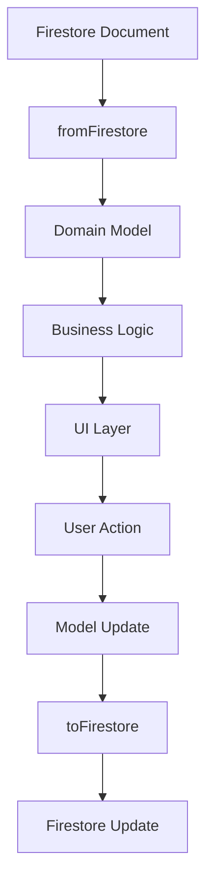

# 📊 Auth Domain Models - 인증 도메인 모델

> Feature-First Architecture의 Domain Layer 중 Models 정의

## 📋 개요

이 디렉토리는 인증 기능의 **Domain Models**를 담당합니다. 비즈니스 도메인의 핵심 엔티티와 값 객체(Value Objects)를 정의하여 비즈니스 규칙을 캡슐화합니다.

### 🎯 목적
- **비즈니스 로직 캡슐화**: 도메인 규칙과 제약사항을 모델에 포함
- **타입 안정성**: 강타입 시스템으로 런타임 에러 방지
- **불변성**: Immutable 모델로 예측 가능한 상태 관리
- **독립성**: 외부 프레임워크에 의존하지 않는 순수 Dart 객체

## 🏗️ 아키텍처 구조

```
models/
├── user_model.dart              # 사용자 엔티티 모델
├── auth_credential_model.dart   # 인증 자격증명 모델
├── premium_user_model.dart      # 프리미엄 사용자 모델
├── user_settings_model.dart     # 사용자 설정 모델
├── user_contents_model.dart     # 사용자 콘텐츠 모델
└── value_objects/               # 값 객체
    ├── email_address.dart       # 이메일 값 객체
    ├── password.dart           # 비밀번호 값 객체
    └── phone_number.dart       # 전화번호 값 객체
```

## 📂 파일 상세 설명

### 1. user_model.dart (핵심 사용자 모델)

**책임**: 사용자 정보의 도메인 표현

**주요 필드**:
- **기본 정보**: uid, email, displayName, photoUrl, phoneNumber
- **인증 상태**: emailVerified, isPremiumUser, role (user/admin/tester)
- **포인트 시스템**: pointsA (답변), pointsQ (질문)
- **프로필 정보**: bio, birthDate, gender, jobCategory, jobName
- **소셜 정보**: followersCount, followingCount, postsCount
- **설정**: notificationsEnabled, languagePreference, themeMode
- **계정 상태**: accountStatus (active/suspended/deleted)

**비즈니스 로직**:
- 레벨 계산: 포인트 기반 5단계 레벨 시스템
- 권한 체크: canPost, canComment, canVote
- 프로필 완성도 계산
- Firestore 변환 메서드

### 2. auth_credential_model.dart

**책임**: 인증 자격증명 정보 관리

**주요 필드**:
- **Provider 정보**: providerId (password/google.com/apple.com/github.com/phone)
- **토큰 관리**: accessToken, idToken, refreshToken, tokenExpiry
- **사용자 정보**: email, additionalInfo

**비즈니스 로직**:
- 토큰 유효성 검증
- 토큰 갱신 필요 여부 (만료 5분 전)
- Provider 타입 체크 메서드

### 3. premium_user_model.dart

**책임**: 프리미엄 사용자 정보 관리

**주요 필드**:
- **구독 정보**: startDate, endDate, subscriptionType (monthly/yearly/lifetime)
- **결제 정보**: price, transactionId, paymentMethod, autoRenew
- **프리미엄 특전**: adFree, unlimitedPosts, prioritySupport, advancedAnalytics
- **사용 통계**: postsCreated, votesUsed

**비즈니스 로직**:
- 구독 상태 체크 (active/expired/cancelled)
- 남은 일수 계산
- 구독 타입별 가격 정책

### 4. user_settings_model.dart

**책임**: 사용자 설정 정보 관리

**주요 필드**:
- **알림 설정**: pushNotifications, emailNotifications, voteNotifications 등
- **프라이버시**: profileVisibility (public/friends/private), blockedUsers
- **콘텐츠 필터**: contentFilter, hideNsfw, mutedKeywords
- **앱 설정**: themeMode, fontSize, autoplayVideos
- **보안**: twoFactorEnabled, biometricEnabled, lastPasswordChange

**비즈니스 로직**:
- 보안 설정 상태 체크
- 비밀번호 업데이트 필요 여부 (90일 기준)
- 사용자 차단/해제 관리
- 키워드 뮤트 관리

### 5. user_contents_model.dart

**책임**: 사용자 콘텐츠 및 활동 정보 관리

**주요 필드**:
- **콘텐츠 통계**: totalPosts, totalComments, totalVotes, totalLikes
- **게시물 관리**: postIds, savedPostIds, hiddenPostIds
- **투표 기록**: votedPosts (postId: 'A' or 'B')
- **일일 제한**: dailyPostCount, dailyVoteCount, dailyLimitResetDate
- **랭킹 정보**: weeklyRank, monthlyRank, allTimeRank

**비즈니스 로직**:
- 일일 제한 체크 및 리셋
- 게시/투표 가능 여부 판단
- 활동 기록 업데이트

### 6. Value Objects (값 객체)

#### value_objects/email_address.dart
**책임**: 이메일 주소 유효성 검증 및 캉슐화
- 이메일 형식 검증
- 실패/성공 Either 타입 반환
- 안전한 값 추출

#### value_objects/password.dart
**책임**: 비밀번호 강도 검증
- 최소 길이 검증
- 대/소문자, 숫자, 특수문자 포함 여부
- 강도 점수 계산

#### value_objects/phone_number.dart
**책임**: 전화번호 형식 검증
- 국가 코드 처리
- 숫자만 포함 여부
- 길이 검증

## 🔄 데이터 플로우



## 🧪 테스트 전략

### 테스트 커버리지 목표
- **모델 단위 테스트**: 80% 이상
- **비즈니스 로직**: 100% 커버
- **값 객체 검증**: 100% 커버

### 테스트 포커스
- 레벨 계산 로직 검증
- 프로필 완성도 계산 정확성
- 계정 상태별 권한 체크
- 토큰 유효성 및 갱신 로직
- 일일 제한 및 리셋 기능

## 🚀 마이그레이션 가이드

### 파일 이동 계획

| 현재 위치 | 대상 위치 | 설명 |
|----------|-----------|------|
| `/lib/backend/schema/users_model.dart` | `user_model.dart` | Freezed로 리팩토링 |
| `/lib/backend/schema/premium_users_model.dart` | `premium_user_model.dart` | Freezed로 리팩토링 |
| `/lib/backend/schema/user_contents_model.dart` | `user_contents_model.dart` | Freezed로 리팩토링 |
| `/lib/backend/schema/settings_model.dart` | `user_settings_model.dart` | 새로 생성 |
| - | `auth_credential_model.dart` | 새로 생성 |
| - | `value_objects/` | 값 객체 생성 |

### 마이그레이션 단계

#### Phase 1: 기존 모델 이동 (30분)
```bash
# 기존 파일 새 위치로 이동
git mv lib/backend/schema/users_model.dart lib/features/auth/domain/models/user_model.dart
git mv lib/backend/schema/premium_users_model.dart lib/features/auth/domain/models/premium_user_model.dart
git mv lib/backend/schema/user_contents_model.dart lib/features/auth/domain/models/user_contents_model.dart
```

#### Phase 2: 새 모델 생성 (20분)
- auth_credential_model.dart - 인증 자격증명 모델
- user_settings_model.dart - 사용자 설정 모델
- value_objects/ - 값 객체 디렉토리

#### Phase 3: Import 경로 업데이트 (10분)
```dart
// 이전
import 'package:versus_space/backend/schema/users_model.dart';

// 이후  
import 'package:versus_space/features/auth/domain/models/user_model.dart';
```

## 📊 모델 설계 원칙

1. **Immutability (불변성)**
   - Freezed 패키지 사용
   - copyWith 메서드로 업데이트

2. **Validation (검증)**
   - 값 객체로 입력 검증
   - 비즈니스 규칙 적용

3. **Serialization (직렬화)**
   - JSON 직렬화 지원
   - Firestore 변환 메서드

4. **Business Logic (비즈니스 로직)**
   - 모델 내 비즈니스 규칙 포함
   - 계산된 속성 제공

## 🔗 관련 문서

- [Auth Feature 전체 마이그레이션 가이드](../../MIGRATION_AUTH.md)
- [Repository Layer](../../data/repositories/README.md)
- [Services Layer](../../data/services/README.md)
- [Use Cases](../usecases/README.md)

## 📝 체크리스트

### 구현 완료도
- [ ] `user_model.dart` 생성 및 리팩토링
- [ ] `auth_credential_model.dart` 구현
- [ ] `premium_user_model.dart` 생성 및 리팩토링
- [ ] `user_settings_model.dart` 구현
- [ ] `user_contents_model.dart` 생성 및 리팩토링
- [ ] Value Objects 구현
- [ ] 단위 테스트 작성
- [ ] 문서화 완료

### 마이그레이션 체크포인트
- [ ] 기존 모델 분석 완료
- [ ] Freezed 의존성 추가 결정
- [ ] 비즈니스 로직 식별
- [ ] 값 객체 생성 필요성 판단
- [ ] 테스트 커버리지 계획

---

*이 문서는 Feature-First Architecture의 Auth Domain Models 구현 가이드입니다.*
*작성일: 2025-08-24*
*버전: 1.0*