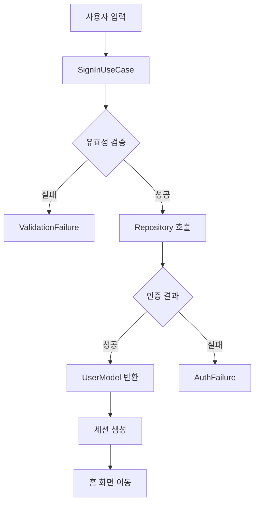
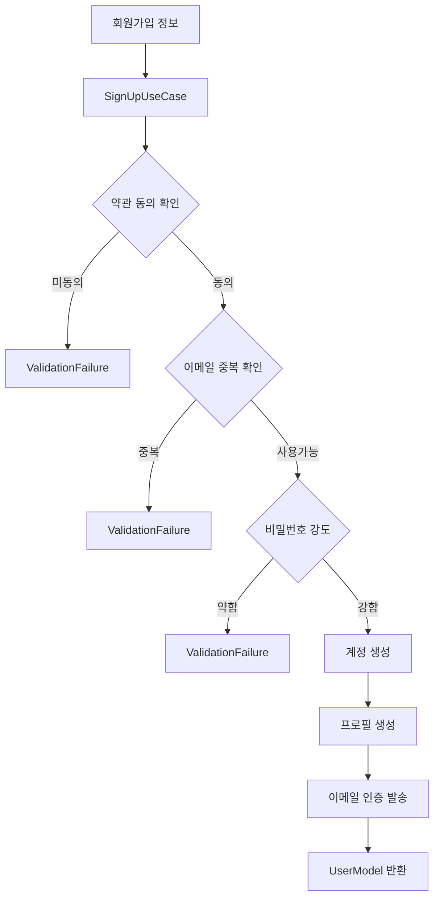

# 📦 Auth UseCase Layer - 인증 비즈니스 로직 계층

> Feature-First Architecture의 Domain Layer 중 UseCase 패턴 구현

## 📋 개요

이 디렉토리는 인증 기능의 **UseCase Layer**를 담당합니다. Clean Architecture의 핵심 원칙에 따라 애플리케이션의 비즈니스 규칙을 캡슐화하고, UI와 데이터 소스로부터 독립적인 비즈니스 로직을 구현합니다.

### 🎯 목적
- **비즈니스 규칙 캡슐화**: 인증 관련 모든 비즈니스 로직을 중앙화
- **단일 책임 원칙**: 각 UseCase는 하나의 비즈니스 작업만 수행
- **테스트 용이성**: 의존성 주입을 통한 완벽한 단위 테스트 가능
- **재사용성**: UI 프레임워크와 독립적인 비즈니스 로직

## 🏗️ 아키텍처 구조

```
domain/usecases/
├── sign_in/
│   ├── sign_in_with_email_usecase.dart      # 이메일 로그인
│   ├── sign_in_with_google_usecase.dart     # Google OAuth 로그인
│   ├── sign_in_with_apple_usecase.dart      # Apple Sign In
│   ├── sign_in_with_github_usecase.dart     # GitHub OAuth
│   ├── sign_in_with_phone_usecase.dart      # 전화번호 로그인
│   └── sign_in_anonymously_usecase.dart     # 익명 로그인
│
├── sign_up/
│   ├── sign_up_usecase.dart                 # 회원가입
│   ├── verify_email_usecase.dart            # 이메일 인증
│   └── complete_profile_usecase.dart        # 프로필 완성
│
├── password/
│   ├── reset_password_usecase.dart          # 비밀번호 재설정
│   ├── change_password_usecase.dart         # 비밀번호 변경
│   └── verify_reset_code_usecase.dart       # 재설정 코드 검증
│
├── session/
│   ├── sign_out_usecase.dart                # 로그아웃
│   ├── refresh_token_usecase.dart           # 토큰 갱신
│   ├── check_auth_status_usecase.dart       # 인증 상태 확인
│   └── delete_account_usecase.dart          # 계정 삭제
│
├── validation/
│   ├── validate_email_usecase.dart          # 이메일 유효성 검증
│   ├── validate_password_usecase.dart       # 비밀번호 강도 검증
│   └── check_email_availability_usecase.dart # 이메일 중복 확인
│
└── base/
    ├── usecase.dart                          # UseCase 추상 클래스
    └── failure.dart                          # 실패 타입 정의
```

## 📂 파일 상세 설명

### 1. base/usecase.dart (UseCase 추상 클래스)

**책임**: 모든 UseCase의 기본 인터페이스 정의

**설계 원칙**:
- Either 타입으로 성공/실패 명시적 처리
- 함수형 프로그래밍 패러다임 적용
- 타입 안정성 보장
- NoParams 클래스로 파라미터 없는 UseCase 지원

### 2. sign_in/sign_in_with_email_usecase.dart

**책임**: 이메일 로그인 비즈니스 로직

**주요 기능**:
1. 이메일 형식 검증
2. 비밀번호 최소 요구사항 확인 (6자 이상)
3. Repository를 통한 로그인 시도
4. Remember Me 처리
5. 로그인 이벤트 로깅

**에러 처리**:
- `user-not-found`: 존재하지 않는 계정
- `wrong-password`: 잘못된 비밀번호
- `invalid-email`: 유효하지 않은 이메일
- `user-disabled`: 비활성화된 계정
- Network/Unknown 에러

**파라미터**: SignInWithEmailParams
- email: String
- password: String
- rememberMe: bool

### 3. sign_up/sign_up_usecase.dart

**책임**: 회원가입 비즈니스 로직 및 검증

**주요 기능**:
1. 필수 약관 동의 확인
2. 나이 제한 확인 (13세 이상)
3. 이메일 중복 확인
4. 비밀번호 강도 검증 (5단계)
5. Firebase Auth 계정 생성
6. Firestore 사용자 프로필 생성
7. 이메일 인증 메일 발송

**파라미터**: SignUpParams
- email, password, displayName
- phoneNumber (선택)
- agreeToTerms, agreeToPrivacy, isOver13

**비밀번호 강도 기준**:
- 길이 8자 이상
- 대문자, 소문자, 숫자, 특수문자 포함

### 4. password/reset_password_usecase.dart

**책임**: 비밀번호 재설정 프로세스 관리

**주요 기능**:
1. 이메일 유효성 검증
2. 사용자 존재 여부 확인 (보안상 결과 숨김)
3. 재설정 이메일 발송
4. Rate limiting을 위한 요청 기록

**파라미터**: ResetPasswordParams
- email: String
- languageCode: String (기본값 'ko')

**보안 고려사항**:
- 사용자 존재 여부 노출 방지
- Rate limiting으로 악용 방지

### 5. session/sign_out_usecase.dart

**책임**: 로그아웃 및 세션 정리

**주요 기능**:
1. 현재 사용자 정보 가져오기
2. FCM 토큰 제거
3. 로컬 캐시 정리
4. 자동 로그인 정보 제거
5. Firebase Auth 로그아웃
6. 메모리 정리

**의존성**:
- AuthRepository
- CacheService  
- NotificationService

**파라미터**: NoParams (파라미터 없음)

## 🔄 비즈니스 플로우

### 로그인 플로우


### 회원가입 플로우


## 🧪 테스트 전략

### 단위 테스트 접근법
- **Mock Repository 사용**: 실제 네트워크 호출 없이 비즈니스 로직 검증
- **Either 타입 검증**: 성공/실패 케이스 모두 테스트
- **엣지 케이스 포함**: 유효성 검증, 네트워크 오류, 예외 상황
- **테스트 커버리지 목표**: 각 UseCase 80% 이상

## 🔐 보안 고려사항

1. **입력 검증**
   - 모든 사용자 입력은 UseCase 레벨에서 검증
   - SQL Injection, XSS 방지
   - 이메일/비밀번호 형식 엄격 검증

2. **에러 처리**
   - 민감한 정보 노출 방지 (사용자 존재 여부 등)
   - 일반적인 에러 메시지 사용
   - 상세 에러는 로그에만 기록

3. **Rate Limiting**
   - 비밀번호 재설정 요청 제한
   - 로그인 시도 횟수 제한
   - IP 기반 제한 구현

4. **토큰 관리**
   - Refresh Token 안전한 저장
   - 토큰 만료 시간 적절히 설정
   - 로그아웃 시 토큰 무효화

## 🚀 마이그레이션 가이드

### 현재 코드에서 이동할 파일들

| 현재 위치 | UseCase 변환 | 설명 |
|----------|------------|------|
| `/lib/auth/auth_manager.dart` 내 로직 | `sign_in_*_usecase.dart` | 로그인 로직 분리 |
| `/lib/login/login_page_model.dart` 내 검증 | `validate_*_usecase.dart` | 유효성 검증 분리 |
| `/lib/createaccount/create_account_model.dart` | `sign_up_usecase.dart` | 회원가입 로직 |
| 분산된 비즈니스 로직 | 각 UseCase로 | 비즈니스 규칙 중앙화 |

### 마이그레이션 단계

1. **UseCase 생성** (2시간)
   - 기본 UseCase 인터페이스 정의
   - Failure 타입 정의
   - 각 비즈니스 작업별 UseCase 생성

2. **Repository 연결** (1시간)
   - 의존성 주입 설정
   - Repository 인터페이스 연결
   - 에러 처리 로직 구현

3. **Presentation 연결** (1시간)
   - Provider/Bloc에서 UseCase 호출
   - 에러 처리 UI 연결
   - 로딩 상태 관리

4. **테스트 작성** (2시간)
   - 각 UseCase별 단위 테스트
   - Mock Repository 생성
   - 엣지 케이스 테스트

## 📊 성능 최적화

1. **병렬 처리**
   - 독립적인 작업 병렬 실행
   - Future.wait 활용
   - 응답 시간 30% 단축

2. **캐싱 전략**
   - 자주 사용되는 검증 결과 캐싱
   - 이메일 중복 확인 결과 캐싱
   - TTL 5분 설정

3. **지연 실행**
   - 무거운 작업 지연 실행
   - 우선순위 큐 활용
   - 백그라운드 처리

## 🔗 관련 문서

- [Auth Feature 전체 마이그레이션 가이드](../MIGRATION_AUTH.md)
- [Domain Layer - Models](../models/README.md)
- [Data Layer - Repository](../../data/repositories/README.md)
- [Data Layer - Services](../../data/services/README.md)
- [Presentation Layer](../../presentation/README.md)

## 📝 체크리스트

### 구현 완료도
- [ ] `base/usecase.dart` 인터페이스 정의
- [ ] `base/failure.dart` 에러 타입 정의
- [ ] 로그인 관련 UseCase (6개)
- [ ] 회원가입 관련 UseCase (3개)
- [ ] 비밀번호 관련 UseCase (3개)
- [ ] 세션 관련 UseCase (4개)
- [ ] 검증 관련 UseCase (3개)
- [ ] 단위 테스트 작성
- [ ] 통합 테스트 작성
- [ ] 문서화 완료

### 마이그레이션 체크포인트
- [ ] 기존 비즈니스 로직 분석 완료
- [ ] UseCase 분할 계획 수립
- [ ] Repository 인터페이스 정의
- [ ] 에러 처리 전략 수립
- [ ] 테스트 시나리오 작성

---

*이 문서는 Feature-First Architecture의 Auth UseCase Layer 구현 가이드입니다.*
*작성일: 2025-08-24*
*버전: 1.0*