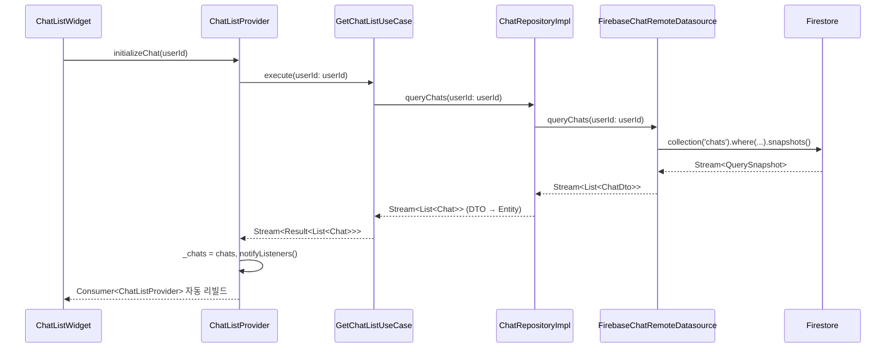
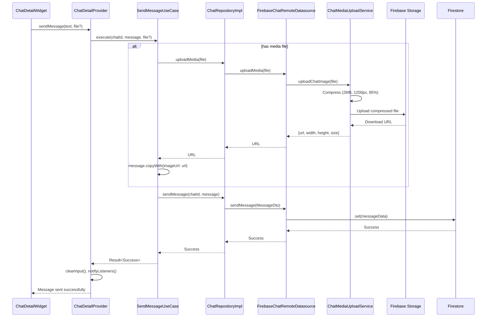
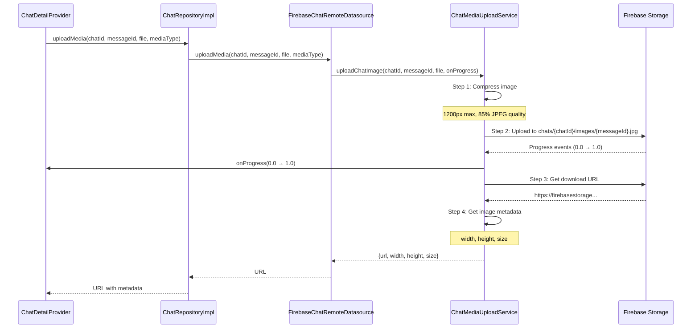
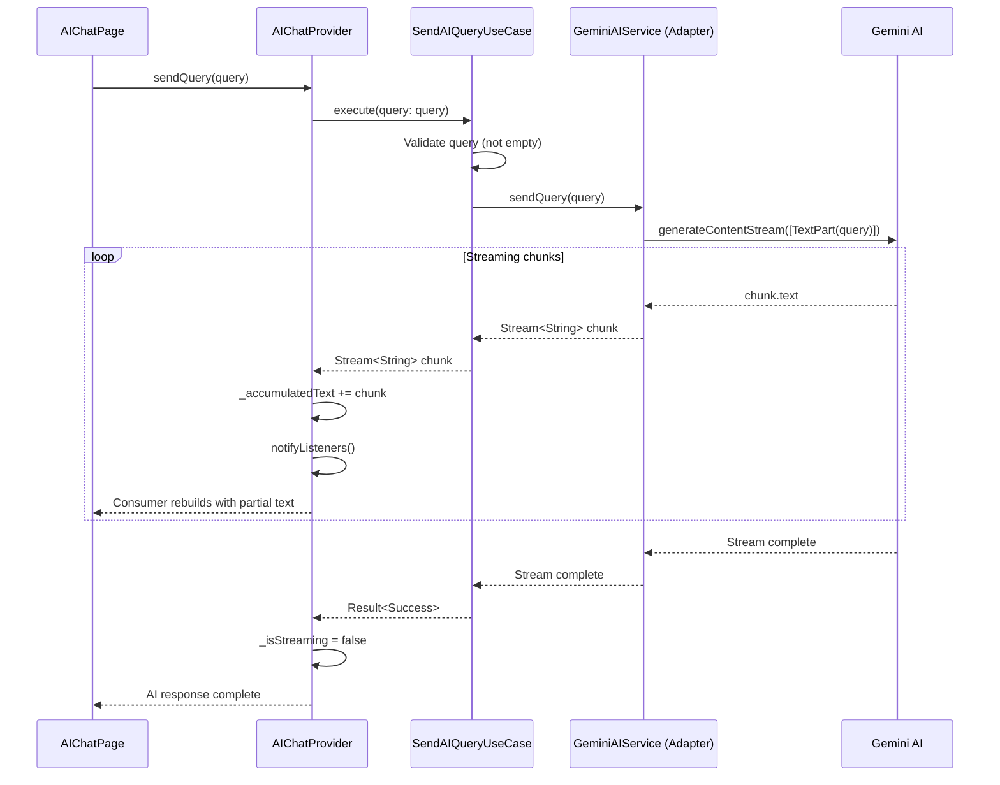

# 💬 Chat Feature
> **Clean Architecture v4.0** | **3-Layer Integration** | **Real-time Messaging System**

## 📋 개요

**Chat Feature**는 Versus Space 앱의 핵심 커뮤니케이션 모듈로, 1:1 채팅, 그룹 채팅, AI 어시스턴트, 투표 시스템을 통합한 실시간 메시징 플랫폼입니다. Clean Architecture v4.0를 완전히 준수하며, 3개 레이어(Presentation, Domain, Data)가 명확히 분리되어 확장 가능하고 테스트 가능한 구조로 설계되었습니다.

### 🎯 핵심 특징

**Clean Architecture v4.0 완전 준수**
- Presentation → Domain ← Data 의존성 방향
- 순수 Dart Domain Layer (Firebase/Flutter 의존성 제거)
- Repository Pattern + Port & Adapter Pattern
- Freezed 불변 엔티티로 타입 안전성 보장

**실시간 메시징 시스템**
- Firestore Stream 기반 실시간 채팅 및 메시지 동기화
- messageId 커서 기반 효율적인 메시지 페이지네이션
- Read Receipts (읽음 표시) 및 메시지 전달 상태 추적
- 오프라인 지원 (Firestore 오프라인 캐시)

**멀티미디어 지원**
- 이미지 자동 압축 (2MB 이하, 1200px, 85% JPEG)
- 비디오 업로드 및 썸네일 자동 생성
- Firebase Storage 통합 (사용자별 경로 분리)
- 진행률 트래킹 및 업로드 최적화

**AI 통합 (Gemini AI)**
- 스트리밍 AI 응답으로 자연스러운 대화 경험
- Port & Adapter 패턴으로 AI 제공자 교체 가능
- AI 어시스턴트 전용 채팅방 지원
- 실시간 응답 취소 기능

**투표 시스템 통합**
- 투표 요청 카드 메시지 (vote_request)
- 실시간 투표 결과 동기화
- 투표 타이머 및 상태 관리 (pending, completed, expired)
- 멀티 이미지 투표 옵션 지원

## 🏗️ 전체 아키텍처 구조도

```
lib/features/chat/
├── data/                           # 데이터 레이어 (11개 파일)
│   ├── adapters/                   # 외부 서비스 어댑터
│   │   ├── chat_media_upload_service.dart    # Firebase Storage 업로드
│   │   ├── chat_message_lifecycle_service.dart # 메시지 생명주기
│   │   ├── chat_message_service.dart          # Message 변환
│   │   ├── chat_scroll_service.dart           # 스크롤 상태 관리
│   │   └── gemini_ai_service.dart            # Gemini AI 어댑터
│   │
│   ├── datasources/                # 데이터 소스
│   │   ├── i_chat_remote_datasource.dart     # Interface (Domain Port)
│   │   └── firebase_chat_remote_datasource.dart # Firebase 구현체
│   │
│   ├── dto/                        # Data Transfer Objects
│   │   ├── chat_dto.dart                     # Chat DTO (Freezed)
│   │   └── message_dto.dart                  # Message DTO (Freezed)
│   │
│   ├── repositories/               # Repository 구현체
│   │   └── chat_repository_impl.dart         # IChatRepository 구현
│   │
│   └── exports/                    # Public API
│       └── data_exports.dart                 # Data layer exports
│
├── domain/                         # 도메인 레이어 (20개 파일)
│   ├── constants/                  # 도메인 상수
│   │   └── chat_constants.dart               # 채팅 시스템 상수
│   │
│   ├── failures/                   # 타입 안전한 에러 처리
│   │   └── chat_failure.dart                 # Sealed Class로 22개 실패 케이스 정의
│   │
│   ├── entities/                   # 순수 도메인 엔티티
│   │   ├── chat.dart                         # Chat 엔티티 (11개 메서드)
│   │   ├── chat.freezed.dart                 # Freezed 생성 코드
│   │   ├── chat.g.dart                       # JSON 직렬화 코드
│   │   ├── message.dart                      # Message 엔티티 (40+ 메서드)
│   │   ├── message.freezed.dart              # Freezed 생성 코드
│   │   └── message.g.dart                    # JSON 직렬화 코드
│   │
│   ├── enums/                      # 도메인 열거형
│   │   └── message_delivery_status.dart      # 메시지 전달 상태
│   │
│   ├── ports/                      # 외부 서비스 인터페이스
│   │   └── i_ai_service.dart                 # AI 서비스 포트
│   │
│   ├── repositories/               # Repository 인터페이스
│   │   └── i_chat_repository.dart            # Chat Repository 포트
│   │
│   └── usecases/                   # 비즈니스 유스케이스
│       ├── get_chat_list_usecase.dart        # 채팅 목록 조회
│       ├── get_chat_messages_usecase.dart    # 메시지 조회
│       ├── load_more_messages_usecase.dart   # 페이지네이션
│       ├── search_messages_usecase.dart      # 메시지 검색
│       ├── send_ai_query_usecase.dart        # AI 쿼리
│       └── send_message_usecase.dart         # 메시지 전송
│
└── presentation/                   # 프레젠테이션 레이어 (13개 파일)
    ├── providers/                  # Provider 상태 관리
    │   ├── chat_detail_provider.dart         # 채팅 상세 Provider
    │   ├── chat_list_provider.dart           # 채팅 목록 Provider
    │   └── ai_chat_provider.dart             # AI 채팅 Provider
    │
    └── screens/                    # 화면 위젯
        ├── chat_detail/            # 채팅 상세 화면
        │   ├── chat_detail_widget_clean.dart # 메인 채팅 화면
        │   ├── chat_detail_controller_v2.dart # 컨트롤러
        │   └── components/         # 화면 컴포넌트
        │       ├── chat_detail_app_bar.dart
        │       ├── chat_detail_fab.dart
        │       ├── chat_detail_loading_widgets.dart
        │       ├── chat_media_picker.dart
        │       └── chat_message_builder.dart
        ├── chat_list/              # 채팅 목록 화면
        │   └── chat_list_widget_clean.dart
        └── ai_chat/                # AI 채팅 화면
            ├── ai_chat_page_clean.dart
            └── ai_chat_controller.dart

총 파일: 44개 (Data 11, Domain 20, Presentation 13)
```

### 📊 파일 통계

- **총 파일**: 44개
- **Data Layer**: 11개 파일 (Adapters 5, DataSources 2, DTOs 2, Repositories 1, Exports 1)
- **Domain Layer**: 20개 파일 (Entities 6, UseCases 6, Repositories 1, Ports 1, Constants 1, Enums 1, Failures 3, Docs 1)
- **Presentation Layer**: 13개 파일 (Providers 3, Screens 3, Components 7)

## 🔄 데이터 플로우

### 1. Chat Query Flow (채팅 목록 조회)



### 2. Send Message Flow (메시지 전송)



### 3. Media Upload Flow (이미지/비디오 업로드)



### 4. AI Query Flow (Gemini AI 통합)



## 💻 빠른 시작 가이드

### 1. 초기 설정

**의존성 주입 등록** (`lib/app/di/chat_module.dart`):

```dart
import 'package:get_it/get_it.dart';

class ChatModule {
  static void registerDependencies(GetIt getIt) {
    // ========== Data Layer ==========

    // DataSources
    getIt.registerLazySingleton<IChatRemoteDatasource>(
      () => FirebaseChatRemoteDatasource(),
    );

    // Repositories
    getIt.registerLazySingleton<IChatRepository>(
      () => ChatRepositoryImpl(remoteDatasource: getIt()),
    );

    // Adapters
    getIt.registerLazySingleton(() => ChatMediaUploadService());
    getIt.registerLazySingleton(() => ChatMessageLifecycleService());
    getIt.registerLazySingleton<IAIService>(
      () => GeminiAIService(apiKey: const String.fromEnvironment('GEMINI_API_KEY')),
    );

    // ========== Domain Layer ==========

    // Use Cases
    getIt.registerFactory(() => GetChatListUseCase(chatRepository: getIt()));
    getIt.registerFactory(() => GetChatMessagesUseCase(chatRepository: getIt()));
    getIt.registerFactory(() => LoadMoreMessagesUseCase(chatRepository: getIt()));
    getIt.registerFactory(() => SearchMessagesUseCase(chatRepository: getIt()));
    getIt.registerFactory(() => SendMessageUseCase(chatRepository: getIt()));
    getIt.registerFactory(() => SendAIQueryUseCase(aiService: getIt()));

    // ========== Presentation Layer ==========

    // Providers
    getIt.registerFactory(() => ChatListProvider(
      getChatListUseCase: getIt(),
    ));

    getIt.registerFactory(() => ChatDetailProvider(
      getMessagesUseCase: getIt(),
      loadMoreUseCase: getIt(),
      sendMessageUseCase: getIt(),
      searchUseCase: getIt(),
      lifecycleService: getIt(),
      chatController: ChatDetailControllerV2(),
    ));

    getIt.registerFactory(() => AIChatProvider(
      sendAIQueryUseCase: getIt(),
    ));
  }
}
```

### 2. 채팅 목록 화면 통합

**Provider 설정**:

```dart
import 'package:versus/app/di/di.dart';
import 'package:provider/provider.dart';

class ChatListScreen extends StatelessWidget {
  const ChatListScreen({Key? key}) : super(key: key);

  @override
  Widget build(BuildContext context) {
    return ChangeNotifierProvider(
      create: (_) => getIt<ChatListProvider>()
        ..initializeChat(currentUserId: getCurrentUserId()),
      child: const ChatListWidgetClean(),
    );
  }
}
```

**UI 구현**:

```dart
class ChatListWidgetClean extends StatelessWidget {
  const ChatListWidgetClean({Key? key}) : super(key: key);

  @override
  Widget build(BuildContext context) {
    return Scaffold(
      appBar: AppBar(title: const Text('채팅')),
      body: Consumer<ChatListProvider>(
        builder: (context, provider, _) {
          // 로딩 상태 처리
          if (provider.state == ChatListLoadingState.loading) {
            return const Center(child: CircularProgressIndicator());
          }

          // 에러 상태 처리
          if (provider.state == ChatListLoadingState.error) {
            return Center(child: Text('Error: ${provider.errorMessage}'));
          }

          // 빈 상태 처리
          if (provider.chats.isEmpty) {
            return const Center(child: Text('채팅방이 없습니다'));
          }

          // 채팅 목록 표시
          return ListView.builder(
            itemCount: provider.chats.length,
            itemBuilder: (context, index) {
              final chat = provider.chats[index];
              return ListTile(
                leading: CircleAvatar(
                  backgroundImage: chat.photoUrl.isNotEmpty
                      ? NetworkImage(chat.photoUrl)
                      : null,
                  child: chat.photoUrl.isEmpty
                      ? Text(chat.displayName[0])
                      : null,
                ),
                title: Text(chat.displayName),
                subtitle: Text(chat.lastMessageContent),
                trailing: chat.hasUnreadMessages(getCurrentUserId())
                    ? const Icon(Icons.circle, color: Colors.blue, size: 12)
                    : null,
                onTap: () => Navigator.pushNamed(
                  context,
                  '/chat-detail',
                  arguments: {'chatId': chat.chatId},
                ),
              );
            },
          );
        },
      ),
    );
  }
}
```

### 3. 메시지 전송 예제

**텍스트 메시지 전송**:

```dart
Future<void> _handleSendPressed(String text) async {
  final provider = context.read<ChatDetailProvider>();

  // 1. Message 엔티티 생성
  final message = Message(
    id: generateMessageId(),
    parentPath: 'chats/${widget.chatId}',
    messageId: generateMessageId(),
    senderId: getCurrentUserId(),
    content: text,
    isRead: false,
    messageType: 'text',
    timeStamp: DateTime.now(),
  );

  // 2. UseCase를 통한 메시지 전송
  await provider.sendMessage(
    chatId: widget.chatId,
    message: message,
  );
}
```

**이미지 메시지 전송**:

```dart
Future<void> _handleSendImage(File imageFile) async {
  final provider = context.read<ChatDetailProvider>();

  // 1. Message 엔티티 생성 (mediaType 지정)
  final message = Message(
    id: generateMessageId(),
    parentPath: 'chats/${widget.chatId}',
    messageId: generateMessageId(),
    senderId: getCurrentUserId(),
    content: '',
    isRead: false,
    messageType: 'image',
    mediaType: 'image',
    timeStamp: DateTime.now(),
  );

  // 2. UseCase가 자동으로 이미지 업로드 후 메시지 전송
  await provider.sendMessage(
    chatId: widget.chatId,
    message: message,
    mediaFile: imageFile,
  );
}
```

### 4. AI 채팅 통합 예제

**AI Provider 설정**:

```dart
class AIChatPage extends StatelessWidget {
  const AIChatPage({Key? key}) : super(key: key);

  @override
  Widget build(BuildContext context) {
    return ChangeNotifierProvider(
      create: (_) => getIt<AIChatProvider>(),
      child: const AIChatPageClean(),
    );
  }
}
```

**AI 쿼리 전송**:

```dart
class _AIChatPageCleanState extends State<AIChatPageClean> {
  final TextEditingController _textController = TextEditingController();

  Future<void> _handleSendQuery() async {
    final query = _textController.text.trim();
    if (query.isEmpty) return;

    final provider = context.read<AIChatProvider>();

    // AI 쿼리 전송 (스트리밍 응답)
    await provider.sendQuery(query);

    _textController.clear();
  }

  @override
  Widget build(BuildContext context) {
    return Scaffold(
      appBar: AppBar(title: const Text('AI 어시스턴트')),
      body: Consumer<AIChatProvider>(
        builder: (context, provider, _) {
          return Column(
            children: [
              // AI 응답 표시
              Expanded(
                child: ListView.builder(
                  itemCount: provider.messages.length,
                  itemBuilder: (context, index) {
                    final message = provider.messages[index];
                    return _buildMessageBubble(message);
                  },
                ),
              ),

              // 입력 창
              Padding(
                padding: const EdgeInsets.all(8.0),
                child: Row(
                  children: [
                    Expanded(
                      child: TextField(
                        controller: _textController,
                        decoration: const InputDecoration(
                          hintText: 'AI에게 물어보세요...',
                        ),
                      ),
                    ),
                    IconButton(
                      icon: provider.isStreaming
                          ? const Icon(Icons.stop)
                          : const Icon(Icons.send),
                      onPressed: provider.isStreaming
                          ? () => provider.cancelCurrentQuery()
                          : _handleSendQuery,
                    ),
                  ],
                ),
              ),
            ],
          );
        },
      ),
    );
  }
}
```

## 📁 레이어별 책임

### Data Layer
**역할**: 외부 데이터 소스와의 통신 및 데이터 변환

- **Repositories**: 도메인 Repository 인터페이스 구현 (DTO ↔ Entity 변환)
- **DataSources**: Firebase Firestore, Storage와 직접 통신
- **DTOs**: Firestore 문서 구조에 맞춘 데이터 전송 객체 (Freezed)
- **Adapters**: 외부 서비스 통합 (Media Upload, AI Service, Lifecycle, Scroll)

**핵심 파일**:
- `chat_repository_impl.dart`: IChatRepository 구현, DTO ↔ Entity 변환
- `firebase_chat_remote_datasource.dart`: Firestore 실시간 쿼리, CRUD
- `chat_dto.dart`, `message_dto.dart`: Firestore ↔ Domain 직렬화
- `gemini_ai_service.dart`: IAIService 구현 (Gemini AI 어댑터)
- `chat_media_upload_service.dart`: 이미지/비디오 압축 및 업로드

**상세 문서**: [Data Layer README](./data/README.md)

---

### Domain Layer
**역할**: 비즈니스 로직과 규칙 정의 (프레임워크 독립적)

- **Entities**: 순수 Dart 객체 + 비즈니스 메서드 (Rich Domain Model)
  - `Chat`: 11개 메서드 (hasParticipant, hasUnreadMessages, getOtherUserId 등)
  - `Message`: 40+ 메서드 (isVoteRequest, voteRemainingSeconds, hasUserVoted 등)
- **Failures**: Sealed Class로 타입 안전한 에러 처리 (22개 실패 케이스)
  - Pattern Matching으로 누락 케이스 컴파일 시 체크
  - 중앙 집중식 에러 메시지 관리
- **UseCases**: 단일 비즈니스 작업 캡슐화 (6개 Use Cases)
- **Repositories**: 데이터 접근 인터페이스 (IChatRepository)
- **Ports**: 외부 서비스 인터페이스 (IAIService)
- **Constants**: 도메인 규칙 및 설정 (ChatConstants)
- **Enums**: 타입 안전한 상태 값 (MessageDeliveryStatus)

**핵심 파일**:
- `chat.dart`: Chat 엔티티 (참여자 관리, 읽음 상태, 타입 헬퍼)
- `message.dart`: Message 엔티티 (메시지 타입, 투표 로직, 미디어 헬퍼)
- `chat_failure.dart`: Sealed Class 에러 타입 (22개 실패 케이스, Pattern Matching)
- `i_chat_repository.dart`: 데이터 접근 추상화 (15개 메서드)
- `i_ai_service.dart`: AI 서비스 추상화 (Port & Adapter 패턴)
- `send_message_usecase.dart`: 메시지 전송 UseCase (미디어 업로드 통합)

**상세 문서**: [Domain Layer README](./domain/README.md)

---

### Presentation Layer
**역할**: UI 표시 및 사용자 상호작용

- **Providers**: Provider 패턴 기반 상태 관리 (ChangeNotifier)
  - `ChatDetailProvider`: 채팅 상세 화면 상태 (메시지, 검색, 스크롤)
  - `ChatListProvider`: 채팅 목록 상태 (실시간 채팅 목록)
  - `AIChatProvider`: AI 채팅 상태 (스트리밍 응답)
- **Screens**: 화면 위젯 (ChatDetail, ChatList, AIChat)
- **Components**: 재사용 가능 UI 컴포넌트 (AppBar, FAB, MessageBuilder)
- **flutter_chat_ui v2**: 최신 채팅 UI 라이브러리 통합

**핵심 파일**:
- `chat_detail_provider.dart`: 채팅 상세 Provider (4개 UseCase 통합)
- `chat_detail_widget_clean.dart`: 채팅 화면 UI (flutter_chat_ui 통합)
- `chat_detail_app_bar.dart`: 채팅 앱바 (검색, 네비게이션)
- `chat_detail_fab.dart`: 하단 이동 FAB (스케일 + 바운스 애니메이션)
- `chat_message_builder.dart`: 커스텀 메시지 빌더 (투표 카드)

**상세 문서**: [Presentation Layer README](./presentation/README.md)

## 🚀 주요 기능

### 1. 실시간 채팅
- **Firestore Stream**: 실시간 메시지 및 채팅 목록 동기화
- **읽음 표시**: 마지막 읽은 시간 추적 (lastReadTimestamps)
- **전달 상태**: sent, delivered, seen 3단계 상태
- **오프라인 지원**: Firestore 오프라인 캐시 활용

### 2. 메시지 페이지네이션
- **messageId 커서**: 효율적인 무한 스크롤 (DocumentSnapshot 대신)
- **초기 로드**: 30개 메시지
- **추가 로드**: 20개씩 페이지네이션
- **스크롤 임계값**: 100px 이내에서 자동 로드

### 3. 멀티미디어 지원
- **이미지 압축**: 자동 리사이징 (1200px max, 85% JPEG)
- **비디오 업로드**: 썸네일 자동 생성
- **진행률 트래킹**: 업로드 진행률 실시간 표시
- **Firebase Storage**: 경로 분리 (chats/{chatId}/images/, chats/{chatId}/videos/)

### 4. AI 채팅
- **Gemini AI**: Google Generative AI 통합
- **스트리밍 응답**: 실시간 청크 단위 응답 표시
- **응답 취소**: Stop 버튼으로 진행 중인 응답 중단
- **전용 채팅방**: AI 어시스턴트 전용 UI (입력창 숨김, 하단 검색바)

### 5. 투표 시스템
- **투표 카드 메시지**: vote_request 타입 메시지
- **실시간 동기화**: 투표 결과 실시간 업데이트
- **타이머 관리**: VoteTimerService로 타이머 통합 관리
- **멀티 이미지**: A/B 옵션별 여러 이미지 지원
- **상태 추적**: pending, completed, expired 상태

## 🔧 기술 스택

### Core Architecture
- **Clean Architecture v4.0**: 완전한 레이어 분리 (Presentation → Domain ← Data)
- **Repository Pattern**: 데이터 접근 추상화
- **Port & Adapter Pattern**: 외부 서비스 추상화 (AI, Media Upload)
- **Rich Domain Model**: 비즈니스 로직을 엔티티에 캡슐화

### State Management
- **Provider Pattern**: ChangeNotifier 기반 상태 관리
- **GetIt**: 의존성 주입 (Service Locator)
- **Result Type**: 성공/실패를 명확히 표현

### Backend & Services
- **Firebase**:
  - Firestore: 데이터베이스 (실시간 쿼리, 오프라인 캐시)
  - Storage: 미디어 저장 (이미지/비디오)
- **Gemini AI**: Google Generative AI (스트리밍 응답)
- **flutter_chat_ui v2**: 최신 채팅 UI 라이브러리

### Data Models
- **Freezed**: 불변 엔티티, copyWith, pattern matching
- **JSON Serialization**: toJson/fromJson 지원
- **DTO Pattern**: Firestore ↔ Domain 변환

## 🔒 보안 & 성능

### Firebase Security Rules

```javascript
// Firestore Rules for chats collection
service cloud.firestore {
  match /databases/{database}/documents {
    match /chats/{chatId} {
      // Read: Only participants can read
      allow read: if request.auth != null &&
                     request.auth.uid in resource.data.participantIds;

      // Create: Authenticated users only
      allow create: if request.auth != null &&
                       request.auth.uid in request.resource.data.participantIds;

      // Update: Only participants can update
      allow update: if request.auth != null &&
                       request.auth.uid in resource.data.participantIds;

      match /messages/{messageId} {
        // Read: Only chat participants
        allow read: if request.auth != null &&
                       request.auth.uid in get(/databases/$(database)/documents/chats/$(chatId)).data.participantIds;

        // Create: Only participants can send
        allow create: if request.auth != null &&
                         request.auth.uid == request.resource.data.senderId;

        // Update: Only sender can update
        allow update: if request.auth != null &&
                         request.auth.uid == resource.data.senderId;
      }
    }
  }
}
```

### 성능 최적화

**1. Firestore 인덱스**:
```yaml
# firestore.indexes.json
{
  "indexes": [
    {
      "collectionGroup": "chats",
      "fields": [
        {"fieldPath": "participantIds", "arrayConfig": "CONTAINS"},
        {"fieldPath": "lastMessageAt", "order": "DESCENDING"}
      ]
    },
    {
      "collectionGroup": "messages",
      "fields": [
        {"fieldPath": "chatId", "order": "ASCENDING"},
        {"fieldPath": "createdAt", "order": "DESCENDING"}
      ]
    }
  ]
}
```

**2. 이미지 압축 알고리즘**:
```dart
Future<File> _compressImage(File imageFile) async {
  final bytes = await imageFile.readAsBytes();
  final image = img.decodeImage(bytes)!;

  // Resize if too large (max 1200px)
  final resized = image.width > 1200 || image.height > 1200
      ? img.copyResize(
          image,
          width: image.width > image.height ? 1200 : null,
          height: image.height >= image.width ? 1200 : null,
        )
      : image;

  // Compress to 85% quality JPEG
  final compressed = img.encodeJpg(resized, quality: 85);

  // 결과: 파일 크기 50-70% 감소, 비용 절감
  return File('${tempDir.path}/compressed_${timestamp}.jpg')
    ..writeAsBytesSync(compressed);
}
```

**3. 페이지네이션 전략**:
```dart
// Efficient pagination using messageId cursor
Future<List<Message>> loadMoreMessages({
  required String chatId,
  required String lastMessageId,
}) async {
  // Get the reference message document
  final messageDoc = await _firestore
      .collection('chats')
      .doc(chatId)
      .collection('messages')
      .doc(lastMessageId)
      .get();

  // Query messages before the reference (efficient cursor)
  final snapshot = await _firestore
      .collection('chats')
      .doc(chatId)
      .collection('messages')
      .orderBy('createdAt', descending: true)
      .endBeforeDocument(messageDoc) // Efficient cursor
      .limit(20)
      .get();

  return snapshot.docs.map((doc) => Message.fromDoc(doc)).toList();
}
```

**4. 캐싱 전략**:
```dart
// Enable offline persistence
await FirebaseFirestore.instance.enablePersistence(
  const PersistenceSettings(synchronizeTabs: true),
);

// Use cache-first strategy
final snapshot = await _firestore
    .collection('chats')
    .doc(chatId)
    .get(const GetOptions(source: Source.cache)); // Try cache first
```

## 📚 관련 문서

### Layer READMEs
- [Data Layer README](./data/README.md) - Repository, DataSource, DTO, Adapter 세부 가이드 (1,890 lines)
- [Domain Layer README](./domain/README.md) - Entity, UseCase, Repository Interface 세부 가이드 (1,540 lines)
- [Presentation Layer README](./presentation/README.md) - Provider, Screen, Widget 세부 가이드 (1,092 lines)

### Architecture Guides
- [Clean Architecture v4.0](/docs/architecture/clean-architecture.md)
- [Repository Pattern](/docs/patterns/repository-pattern.md)
- [Port & Adapter Pattern](/docs/patterns/port-adapter-pattern.md)
- [Rich Domain Model](/docs/patterns/rich-domain-model.md)

### Feature Documentation
- [Voting Feature](/lib/features/voting/domain/README.md) - 투표 시스템 통합 가이드
- [Profile Feature](/lib/features/profile/README.md) - 사용자 프로필 통합 (예정)

### Firebase Documentation
- [Firestore Best Practices](https://firebase.google.com/docs/firestore/best-practices)
- [Storage Security Rules](https://firebase.google.com/docs/storage/security)
- [Offline Persistence](https://firebase.google.com/docs/firestore/manage-data/enable-offline)

### Testing Resources
- [Flutter Testing Guide](https://docs.flutter.dev/testing)
- [Mockito Documentation](https://pub.dev/packages/mockito)
- [Firebase Emulator Suite](https://firebase.google.com/docs/emulator-suite)

## 🤝 기여 가이드

### 코드 추가 시 체크리스트

**새로운 UseCase 추가**:
- [ ] Domain Layer에 UseCase 클래스 생성 (`domain/usecases/`)
- [ ] Repository 인터페이스 메서드 추가 (필요 시)
- [ ] Data Layer에 Repository 구현 추가
- [ ] GetIt 의존성 주입 등록 (`app/di/chat_module.dart`)
- [ ] Unit Test 작성 (`test/domain/usecases/`)

**새로운 화면 추가**:
- [ ] Presentation Layer에 Screen 위젯 생성 (`presentation/screens/`)
- [ ] Provider 생성 및 ChangeNotifier 구현 (`presentation/providers/`)
- [ ] GetIt 의존성 주입 등록
- [ ] GoRouter 경로 등록 (`app/router/`)
- [ ] Widget Test 작성

**새로운 메시지 타입 추가**:
- [ ] Domain Layer에 messageType 상수 추가 (`domain/constants/chat_constants.dart`)
- [ ] Message Entity에 타입 체크 메서드 추가 (예: `isCustomMessage`)
- [ ] MessageDto에 직렬화 로직 추가
- [ ] CustomMessageBuilder 구현 (`presentation/screens/chat_detail/components/`)

### 코드 스타일 가이드

**Naming Conventions**:
- Repository 구현: `{Entity}RepositoryImpl`
- DataSource 구현: `Firebase{Entity}RemoteDatasource`
- DTO: `{Entity}Dto`
- UseCase: `{Action}{Entity}UseCase`
- Provider: `{Feature}Provider`

**File Organization**:
- 한 파일당 하나의 클래스 원칙
- 관련 파일은 서브디렉토리로 그룹화
- exports 파일로 Public API 명확히 정의

**Documentation**:
- 모든 public 메서드에 Dart doc 주석 추가
- README 파일은 각 레이어마다 유지
- 복잡한 로직은 inline 주석으로 설명

---

## Changelog

### v2.0.0 (2025-01-20)
- ✅ Clean Architecture v4.0 완전 마이그레이션
- ✅ Firestore 의존성 완전 제거 (Pure Dart Domain Layer)
- ✅ Chat Entity 11개 비즈니스 메서드 추가
- ✅ Message Entity 40+ 비즈니스 메서드 추가
- ✅ Freezed로 불변 엔티티 타입 안전성 보장
- ✅ GeminiAIService 어댑터 추가 (IAIService 구현)
- ✅ ChatMediaUploadService 이미지 압축 최적화 (2MB, 1200px, 85%)
- ✅ messageId 커서 기반 효율적 페이지네이션
- ✅ 실시간 스트림 쿼리 완성 (Chat, Message)
- ✅ 투표 시스템 통합 (투표 카드 메시지)
- ✅ flutter_chat_ui v2 통합 완료
- ✅ Provider 패턴 상태 관리 (ChatDetail, ChatList, AIChat)
- ✅ GetIt 의존성 주입 완성

### v1.0.0 (2024-12-01)
- 🎉 Initial release with basic chat functionality

---

> 💡 **Tip**: 이 문서는 Chat Feature의 **완전한 통합 가이드**입니다. 각 레이어의 상세 정보는 레이어별 README를 참조하십시오.

**마지막 업데이트**: 2025-01-20 | **유지관리자**: Chat Feature Team
