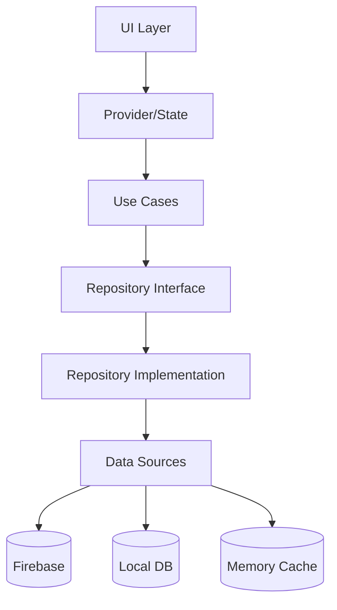

# 💬 Chat Feature Module

> Feature-First Architecture - 채팅 기능 모듈 통합 가이드

## 📋 개요

Versus Space 앱의 **채팅 기능 모듈**입니다. Clean Architecture 원칙에 따라 Domain, Data, Presentation 계층으로 구성되어 있으며, 실시간 메시징, 투표 카드, AI 채팅 등 다양한 기능을 제공합니다.

### 🎯 핵심 기능
- **실시간 메시징**: Firebase Firestore 기반 실시간 채팅
- **투표 카드 시스템**: 10분 타이머 기반 A/B 투표
- **AI 채팅**: 도우미 및 투표 AI 봇
- **그룹 채팅**: 다중 사용자 채팅방
- **미디어 공유**: 이미지, 비디오, 파일 공유
- **3-Layer 캐싱**: 메모리, Hive, Firestore 캐싱
- **알림 시스템**: 실시간 푸시 알림

## 🏗️ 아키텍처 구조

```
chat/
├── domain/                 # 비즈니스 로직 & 엔티티
│   ├── models/            # 도메인 모델
│   ├── usecases/          # 비즈니스 규칙
│   └── repositories/      # Repository 인터페이스
│
├── data/                   # 데이터 계층
│   ├── datasources/       # 데이터 소스 (Remote/Local)
│   ├── repositories/      # Repository 구현체
│   └── services/          # 비즈니스 서비스
│
└── presentation/           # 프레젠테이션 계층
    ├── screens/           # 화면/페이지
    ├── widgets/           # 재사용 컴포넌트
    └── providers/         # 상태 관리
```

## 📊 계층별 상세 구조

### Domain Layer (비즈니스 핵심)
```
domain/
├── models/
│   ├── entities/
│   │   ├── chat_model.dart           # 채팅방 엔티티
│   │   ├── message_model.dart        # 메시지 엔티티
│   │   ├── notification_model.dart   # 알림 엔티티
│   │   └── vote_model.dart           # 투표 엔티티
│   │
│   ├── value_objects/
│   │   ├── message_type.dart         # 메시지 타입
│   │   ├── vote_status.dart          # 투표 상태
│   │   └── notification_priority.dart # 알림 우선순위
│   │
│   └── aggregates/
│       ├── chat_aggregate.dart       # 채팅 집합체
│       └── vote_aggregate.dart       # 투표 집합체
│
└── usecases/
    ├── chat/                          # 채팅방 Use Cases
    ├── message/                       # 메시지 Use Cases
    ├── vote/                          # 투표 Use Cases
    └── notification/                  # 알림 Use Cases
```

### Data Layer (데이터 처리)
```
data/
├── datasources/
│   ├── remote/
│   │   ├── firebase_chat_datasource.dart
│   │   ├── firestore_message_datasource.dart
│   │   └── cloud_functions_datasource.dart
│   │
│   └── local/
│       ├── chat_local_datasource.dart
│       ├── hive_chat_datasource.dart
│       └── memory_cache_datasource.dart
│
├── repositories/
│   ├── implementations/
│   │   ├── chat_repository_impl.dart
│   │   └── message_repository_impl.dart
│   │
│   └── mixins/
│       ├── cache_mixin.dart
│       └── error_handler_mixin.dart
│
└── services/
    ├── cache/                         # 캐싱 서비스
    ├── chat/                          # 채팅 서비스
    ├── vote/                          # 투표 서비스
    └── notification/                  # 알림 서비스
```

### Presentation Layer (UI/UX)
```
presentation/
├── screens/
│   ├── chat_list/                    # 채팅 목록 화면
│   ├── chat_detail/                  # 채팅방 화면
│   ├── ai_chat/                      # AI 채팅 화면
│   └── group_chat/                   # 그룹 채팅 화면
│
├── widgets/
│   ├── chat_list/                    # 채팅 목록 위젯
│   ├── messages/                     # 메시지 위젯
│   ├── vote_cards/                   # 투표 카드 위젯
│   └── input/                        # 입력 위젯
│
└── providers/
    ├── chat_list_provider.dart       # 채팅 목록 상태
    ├── chat_detail_provider.dart     # 채팅방 상태
    ├── vote_provider.dart            # 투표 상태
    └── notification_provider.dart    # 알림 상태
```

## 🔄 데이터 플로우



## 🚀 시작하기

### 1. 의존성 설정

```yaml
# pubspec.yaml
dependencies:
  # Firebase
  firebase_core: ^3.8.0
  cloud_firestore: ^5.5.0
  firebase_storage: ^12.3.2
  firebase_auth: ^5.3.3
  
  # State Management
  provider: ^6.1.2
  
  # Local Storage
  hive: ^2.2.3
  hive_flutter: ^1.1.0
  
  # Chat UI
  flutter_chat_ui: ^2.9.0
  flutter_chat_core: ^2.8.0
  
  # Utilities
  dartz: ^0.10.1
  freezed_annotation: ^2.4.1
  injectable: ^2.3.2
  
dev_dependencies:
  freezed: ^2.4.5
  build_runner: ^2.4.6
  injectable_generator: ^2.4.1
```

### 2. 초기화

**필수 초기화 단계**:

1. **Firebase 초기화**: Firebase Core 및 서비스 설정
2. **Hive 초기화**: 로컬 캐시 데이터베이스 준비
3. **캐시 서비스 초기화**: UnifiedCacheService 인스턴스 생성 및 설정
4. **의존성 주입 설정**: Injectable을 통한 DI 컨테이너 구성
5. **Provider 설정**: 상태 관리를 위한 Provider 트리 구성

**초기화 위치**: `main.dart`의 `main()` 함수

### 3. 라우팅 설정

**GoRouter 라우트 구조**:

- `/chats` - 채팅 목록 화면 (ChatListScreen)
- `/chats/:id` - 채팅 상세 화면 (ChatDetailScreen)
- `/chats/ai` - AI 채팅 화면 (AIChatScreen)
- `/chats/new` - 새 채팅 생성 화면
- `/chats/archived` - 보관된 채팅 목록
- `/chats/:id/info` - 채팅방 정보 화면
- `/chats/:id/media` - 미디어 갤러리

**라우팅 파일 위치**: `router.dart` 또는 `/lib/core/nav/router.dart`

## 💡 주요 기능 구현 예시

### 1. 채팅방 생성

**Use Case 활용**:
- `CreateChatUseCase`를 통한 채팅방 생성
- 파라미터: participantIds, createdBy, initialMessage
- Either 패턴으로 성공/실패 처리
- 성공 시 채팅방 네비게이션

### 2. 메시지 전송

**Provider 패턴 활용**:
- `ChatDetailProvider`를 통한 상태 관리
- `sendMessage()` 메서드로 메시지 전송
- 메시지 타입: text, image, video, file, voteCard
- 실시간 스트림 업데이트

### 3. 투표 카드 생성

**투표 시스템**:
- `CreateVoteCardUseCase`로 투표 생성
- 10분 타이머 자동 설정
- A/B 옵션 텍스트 및 이미지 지원
- 실시간 투표 상태 업데이트

## 🧪 테스트

### 단위 테스트

```bash
# 모든 테스트 실행
flutter test

# 특정 디렉토리 테스트
flutter test test/features/chat/

# 커버리지 리포트 생성
flutter test --coverage
```

### 통합 테스트

**테스트 파일 위치**: `test/features/chat/chat_integration_test.dart`

**테스트 시나리오**:
- 채팅방 생성 플로우
- 메시지 전송 및 수신
- 투표 카드 상호작용
- 실시간 동기화 검증
- 캐시 동작 확인

**테스트 프레임워크**: Flutter Integration Test

## 📈 성능 최적화

### 3-Layer 캐싱 시스템
- **L1 Memory Cache**: LRU 캐시, 100개 제한, 5분 TTL
- **L2 Hive Local DB**: 영구 저장소, 오프라인 지원
- **L3 Firestore Cache**: 무제한 크기, 자동 동기화

### 성능 지표
- 캐시 히트 시: **<10ms** 응답
- 첫 메시지 로드: **<200ms**
- 메시지 전송: **<100ms**
- 투표 제출: **<150ms**

## 🔒 보안 고려사항

### Firebase Security Rules

**파일 위치**: `/firebase/firestore.rules`

**보안 규칙**:
- 인증된 사용자만 접근 가능
- 채팅 참여자만 읽기/쓰기 권한
- 메시지는 발신자만 수정/삭제 가능
- 투표는 중복 방지 로직 적용

### 데이터 암호화
- 민감한 메시지 End-to-End 암호화
- 로컬 캐시 암호화 저장
- 미디어 파일 서명된 URL 사용

## 📝 마이그레이션 가이드

현재 구조에서 Feature-First Architecture로의 마이그레이션은 [MIGRATION_CHAT.md](./MIGRATION_CHAT.md)를 참조하세요.

## 🤝 기여 가이드

### 코드 스타일
- Dart 공식 스타일 가이드 준수
- `flutter analyze` 통과 필수
- 의미있는 커밋 메시지 작성

### PR 체크리스트
- [ ] 단위 테스트 작성
- [ ] 문서 업데이트
- [ ] 코드 리뷰 요청
- [ ] CI/CD 통과

## 📚 참고 문서

### 내부 문서
- [Domain Models](./domain/models/README.md)
- [Use Cases](./domain/usecases/README.md)
- [Repositories](./data/repositories/README.md)
- [Data Sources](./data/datasources/README.md)
- [Services](./data/services/README.md)
- [Screens](./presentation/screens/README.md)
- [Widgets](./presentation/widgets/README.md)
- [Providers](./presentation/providers/README.md)

### 외부 참고자료
- [Clean Architecture](https://blog.cleancoder.com/uncle-bob/2012/08/13/the-clean-architecture.html)
- [Flutter Documentation](https://docs.flutter.dev/)
- [Firebase Documentation](https://firebase.google.com/docs)
- [Provider Package](https://pub.dev/packages/provider)

## 📞 지원

문제가 발생하거나 질문이 있으시면:
- GitHub Issues 생성
- 팀 Slack 채널: #versus-space-dev
- 이메일: dev@versus.space

---

*이 문서는 Versus Space 채팅 기능 모듈의 통합 가이드입니다.*
*최종 업데이트: 2025-08-24*
*버전: 1.0.0*