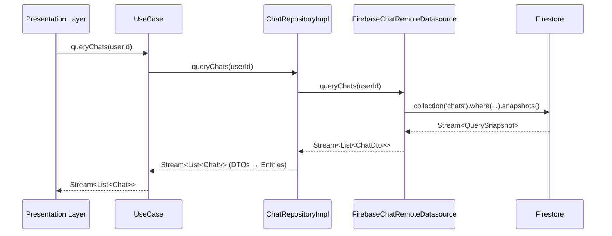
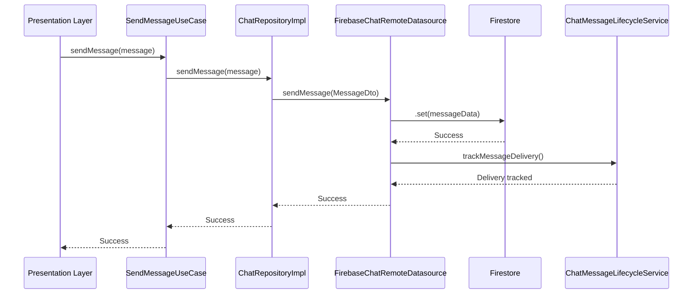
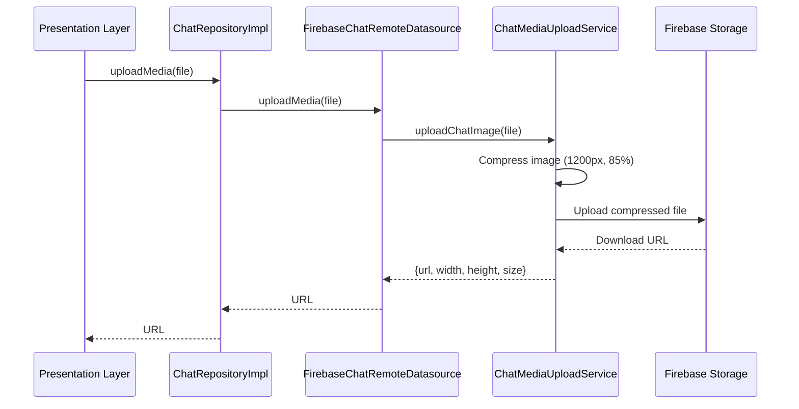
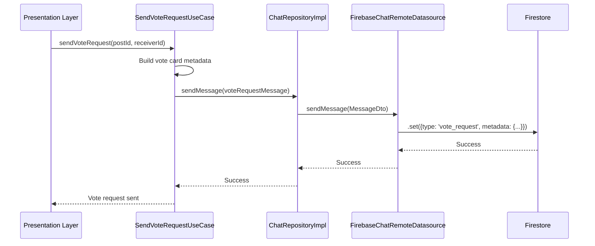

# Chat Feature - Data Layer Documentation

> 버전: 2.0.0 | 최종 업데이트: 2025-01-20 | Clean Architecture v4.0

## 📋 Table of Contents

- [Overview](#overview)
- [Core Features](#core-features)
- [Directory Structure](#directory-structure)
- [Architecture & Responsibilities](#architecture--responsibilities)
- [Repositories](#repositories)
- [DataSources](#datasources)
- [DTOs (Data Transfer Objects)](#dtos-data-transfer-objects)
- [Adapters](#adapters)
- [Data Flow](#data-flow)
- [Error Handling](#error-handling)
- [Testing Strategy](#testing-strategy)
- [Security & Performance](#security--performance)
- [Related Documentation](#related-documentation)

---

## Overview

**Chat Feature Data Layer**는 Clean Architecture v4.0를 따르는 데이터 접근 계층으로, Firebase와 외부 서비스를 추상화하고 도메인 레이어에 깨끗한 인터페이스를 제공합니다.

### Design Principles

```yaml
Architecture: "Clean Architecture v4.0"
Pattern: "Repository Pattern with DataSource Abstraction"
Dependency_Direction: "Data → Domain (implements interfaces)"
External_Dependencies: "Firebase (Firestore, Storage), Gemini AI"
Data_Flow: "Firestore ↔ DTO ↔ Domain Entity"
```

### Key Characteristics

- **Dependency Inversion**: Domain interfaces 구현, Firebase 의존성 격리
- **DTO Pattern**: Firestore documents와 Domain entities 간 변환
- **Adapter Pattern**: 외부 서비스(Gemini AI, Firebase Storage) 통합
- **Legacy Compatibility**: 오래된 필드명(typo) 지원 (participantlds → participantIds)
- **Type Safety**: Freezed DTOs로 불변성 보장

---

## Core Features

### 1. Chat Management
- **실시간 채팅 쿼리**: Firestore Stream으로 실시간 채팅 목록
- **메시지 페이지네이션**: `endBeforeDocument` 기반 무한 스크롤
- **멀티미디어 지원**: 이미지/비디오 업로드 및 압축
- **AI 채팅**: Gemini AI 통합으로 스트리밍 응답

### 2. Data Transformation
- **DTO ↔ Domain**: 양방향 변환으로 레이어 분리
- **Firestore ↔ DTO**: DocumentSnapshot 직렬화/역직렬화
- **Legacy Support**: 오타 필드명 자동 매핑

### 3. External Services
- **Firebase Storage**: 이미지 압축 (2MB, 1200px, 85% quality)
- **Gemini AI**: 스트리밍 AI 응답 생성
- **Read Receipts**: 메시지 읽음 상태 추적

---

## Directory Structure

```
lib/features/chat/data/
├── adapters/                          # 외부 서비스 어댑터
│   ├── chat_media_upload_service.dart    # Firebase Storage 업로드
│   ├── chat_message_lifecycle_service.dart # 메시지 생명주기
│   ├── chat_message_service.dart          # Message 변환
│   ├── chat_scroll_service.dart           # 스크롤 상태 관리
│   └── gemini_ai_service.dart            # Gemini AI 어댑터
│
├── datasources/                       # 데이터 소스
│   ├── i_chat_remote_datasource.dart     # Interface (Domain Port)
│   └── firebase_chat_remote_datasource.dart # Firebase 구현체
│
├── models/                            # Data Transfer Objects (DTOs)
│   ├── chat_dto.dart                     # Chat DTO (292 lines)
│   └── message_dto.dart                  # Message DTO
│
├── repositories/                      # Repository 구현체
│   └── chat_repository_impl.dart         # IChatRepository 구현
│
└── exports/                           # Public API
    └── data_exports.dart                 # Data layer exports

Total: 6 directories, 11 files
```

---

## Architecture & Responsibilities

### Layer Responsibilities

| Component | Responsibility | External Dependencies |
|-----------|---------------|----------------------|
| **Repositories** | Domain interface 구현, DTO ↔ Entity 변환 | None (Domain interfaces only) |
| **DataSources** | Firebase CRUD, DocumentSnapshot 처리 | Firebase Firestore, Storage |
| **DTOs** | Firestore ↔ Domain 직렬화, Legacy 호환성 | freezed, json_annotation |
| **Adapters** | 외부 서비스 통합, 비즈니스 로직 분리 | Firebase Storage, Gemini AI, flutter_chat_ui |

### Dependency Graph

```
Domain Layer (Interfaces)
    ↑
    │ implements
    │
Data Layer
    ├─ Repositories (ChatRepositoryImpl)
    │      ↓ uses
    ├─ DataSources (FirebaseChatRemoteDatasource)
    │      ↓ converts
    ├─ DTOs (ChatDto, MessageDto)
    │      ↓ delegates
    └─ Adapters (Media Upload, AI Service, Lifecycle, Scroll)
           ↓ calls
    External Services (Firebase, Gemini AI)
```

---

## Repositories

### 📁 `chat_repository_impl.dart`

**Location**: `/Users/g_black/versus-cursor/lib/features/chat/data/repositories/chat_repository_impl.dart`

#### Purpose
- **IChatRepository 구현**: Domain layer에 정의된 인터페이스 구현
- **DTO ↔ Domain 변환**: 데이터 소스와 도메인 엔티티 간 변환 전담
- **Dependency Injection**: 생성자 주입으로 DataSource 의존성 주입

#### Class Structure

```dart
class ChatRepositoryImpl implements IChatRepository {
  final IChatRemoteDatasource _remoteDatasource;

  ChatRepositoryImpl({
    required IChatRemoteDatasource remoteDatasource,
  }) : _remoteDatasource = remoteDatasource;

  // 15+ methods implementing IChatRepository
}
```

#### Key Methods

**1. Chat Queries**

```dart
@override
Stream<List<Chat>> queryChats({
  required String currentUserId,
  required int limit,
  DocumentSnapshot? startAfter,
}) {
  return _remoteDatasource
      .queryChats(
        currentUserId: currentUserId,
        limit: limit,
        startAfter: startAfter,
      )
      .map((dtos) => dtos.map((dto) => dto.toDomain()).toList());
}

@override
Future<int> queryChatsCount({required String currentUserId}) {
  return _remoteDatasource.queryChatsCount(currentUserId: currentUserId);
}

@override
Future<Chat?> getChat({required String chatId}) async {
  final dto = await _remoteDatasource.getChat(chatId: chatId);
  return dto?.toDomain();
}
```

★ **Insight ─────────────────────────────────────**
Repository는 **비즈니스 로직 없이** DTO ↔ Entity 변환만 수행합니다. 이는 Clean Architecture의 핵심 원칙으로, 데이터 접근 로직과 비즈니스 로직을 완전히 분리합니다.
─────────────────────────────────────────────────

**2. Message Queries**

```dart
@override
Stream<List<Message>> queryMessagesByChatId({
  required String chatId,
  required int limit,
}) {
  return _remoteDatasource
      .queryMessagesByChatId(chatId: chatId, limit: limit)
      .map((dtos) => dtos.map((dto) => dto.toDomain()).toList());
}

@override
Future<List<Message>> queryMessagesBeforeMessageId({
  required String chatId,
  required String messageId,
  required int limit,
}) async {
  final dtos = await _remoteDatasource.queryMessagesBeforeMessageId(
    chatId: chatId,
    messageId: messageId,
    limit: limit,
  );
  return dtos.map((dto) => dto.toDomain()).toList();
}

@override
Future<int> queryMessagesCount({required String chatId}) {
  return _remoteDatasource.queryMessagesCount(chatId: chatId);
}
```

**3. CRUD Operations**

```dart
@override
Future<void> createChat({required Chat chat}) async {
  final dto = ChatDto.fromDomain(chat);
  await _remoteDatasource.createChat(dto: dto);
}

@override
Future<void> updateChat({required Chat chat}) async {
  final dto = ChatDto.fromDomain(chat);
  await _remoteDatasource.updateChat(dto: dto);
}

@override
Future<void> deleteChat({required String chatId}) {
  return _remoteDatasource.deleteChat(chatId: chatId);
}

@override
Future<void> sendMessage({required Message message}) async {
  final dto = MessageDto.fromDomain(message);
  await _remoteDatasource.sendMessage(dto: dto);
}

@override
Future<void> deleteMessage({
  required String chatId,
  required String messageId,
}) {
  return _remoteDatasource.deleteMessage(
    chatId: chatId,
    messageId: messageId,
  );
}
```

**4. Media Upload**

```dart
@override
Future<String> uploadMedia({
  required String chatId,
  required String messageId,
  required File file,
  required String mediaType,
}) {
  return _remoteDatasource.uploadMedia(
    chatId: chatId,
    messageId: messageId,
    file: file,
    mediaType: mediaType,
  );
}
```

#### Testing Strategy

```yaml
Test_Type: "Unit Tests with Mocks"
Coverage_Target: "90%"
Key_Test_Cases:
  - DTO ↔ Domain conversion accuracy
  - Null safety handling
  - List transformations
  - Error propagation
Mock_Dependencies:
  - IChatRemoteDatasource (mockito)
```

**Example Test**:

```dart
void main() {
  late ChatRepositoryImpl repository;
  late MockIChatRemoteDatasource mockDataSource;

  setUp(() {
    mockDataSource = MockIChatRemoteDatasource();
    repository = ChatRepositoryImpl(remoteDatasource: mockDataSource);
  });

  group('queryChats', () {
    test('should convert DTOs to Domain entities', () async {
      // Arrange
      final mockDtos = [ChatDto(id: '1', chatId: 'chat1', ...)];
      when(mockDataSource.queryChats(...))
          .thenAnswer((_) => Stream.value(mockDtos));

      // Act
      final result = await repository.queryChats(...).first;

      // Assert
      expect(result, isA<List<Chat>>());
      expect(result.first.id, '1');
    });
  });
}
```

---

## DataSources

### 📁 `i_chat_remote_datasource.dart`

**Location**: `/Users/g_black/versus-cursor/lib/features/chat/data/datasources/i_chat_remote_datasource.dart`

#### Purpose
- **Domain Port**: Data layer가 Domain layer에 제공하는 인터페이스
- **Firebase 추상화**: 구체적인 Firebase 구현 숨김
- **Test Seam**: 테스트 시 Mock 주입 지점

#### Interface Definition

```dart
abstract class IChatRemoteDatasource {
  // Chat Queries
  Stream<List<ChatDto>> queryChats({
    required String currentUserId,
    required int limit,
    DocumentSnapshot? startAfter,
  });

  Future<int> queryChatsCount({required String currentUserId});

  Future<ChatDto?> getChat({required String chatId});

  // Message Queries
  Stream<List<MessageDto>> queryMessagesByChatId({
    required String chatId,
    required int limit,
  });

  Future<List<MessageDto>> queryMessagesBeforeMessageId({
    required String chatId,
    required String messageId,
    required int limit,
  });

  Future<int> queryMessagesCount({required String chatId});

  // CRUD Operations
  Future<void> createChat({required ChatDto dto});

  Future<void> updateChat({required ChatDto dto});

  Future<void> deleteChat({required String chatId});

  Future<void> sendMessage({required MessageDto dto});

  Future<void> deleteMessage({
    required String chatId,
    required String messageId,
  });

  // Media Upload
  Future<String> uploadMedia({
    required String chatId,
    required String messageId,
    required File file,
    required String mediaType,
  });
}
```

★ **Insight ─────────────────────────────────────**
Interface는 **Firebase 타입을 노출하지 않습니다** (DocumentSnapshot 예외). 이는 향후 Firebase 교체 시 Domain layer 변경을 최소화합니다. DocumentSnapshot은 페이지네이션 커서로 사용되어 불가피한 노출입니다.
─────────────────────────────────────────────────

#### Method Categories

| Category | Methods | Return Type |
|----------|---------|-------------|
| **Chat Queries** | queryChats, queryChatsCount, getChat | Stream/Future<ChatDto> |
| **Message Queries** | queryMessagesByChatId, queryMessagesBeforeMessageId, queryMessagesCount | Stream/Future<MessageDto> |
| **CRUD** | createChat, updateChat, deleteChat, sendMessage, deleteMessage | Future<void> |
| **Media** | uploadMedia | Future<String> (URL) |

---

### 📁 `firebase_chat_remote_datasource.dart`

**Location**: `/Users/g_black/versus-cursor/lib/features/chat/data/datasources/firebase_chat_remote_datasource.dart`

#### Purpose
- **IChatRemoteDatasource 구현**: Firebase Firestore 연동
- **ChatMediaUploadService 통합**: 이미지/비디오 업로드 위임
- **실시간 스트림**: Firestore snapshots를 DTO 스트림으로 변환

#### Class Structure

```dart
class FirebaseChatRemoteDatasource implements IChatRemoteDatasource {
  final FirebaseFirestore _firestore;

  FirebaseChatRemoteDatasource({
    FirebaseFirestore? firestore,
  }) : _firestore = firestore ?? FirebaseFirestore.instance;

  // 15+ methods implementing IChatRemoteDatasource
}
```

#### Key Implementations

**1. Real-time Chat Queries**

```dart
@override
Stream<List<ChatDto>> queryChats({
  required String currentUserId,
  required int limit,
  DocumentSnapshot? startAfter,
}) {
  var query = _firestore
      .collection('chats')
      .where('participantIds', arrayContains: currentUserId)
      .orderBy('lastMessageAt', descending: true)
      .limit(limit);

  if (startAfter != null) {
    query = query.startAfterDocument(startAfter);
  }

  return query.snapshots().map((snapshot) {
    return snapshot.docs
        .map((doc) => ChatDto.fromFirestore(doc))
        .toList();
  });
}

@override
Future<int> queryChatsCount({required String currentUserId}) async {
  final snapshot = await _firestore
      .collection('chats')
      .where('participantIds', arrayContains: currentUserId)
      .count()
      .get();

  return snapshot.count ?? 0;
}
```

**2. Message Pagination**

```dart
@override
Stream<List<MessageDto>> queryMessagesByChatId({
  required String chatId,
  required int limit,
}) {
  return _firestore
      .collection('chats')
      .doc(chatId)
      .collection('messages')
      .orderBy('createdAt', descending: true)
      .limit(limit)
      .snapshots()
      .map((snapshot) {
    return snapshot.docs
        .map((doc) => MessageDto.fromFirestore(doc))
        .toList();
  });
}

@override
Future<List<MessageDto>> queryMessagesBeforeMessageId({
  required String chatId,
  required String messageId,
  required int limit,
}) async {
  // Get the reference message document
  final messageDoc = await _firestore
      .collection('chats')
      .doc(chatId)
      .collection('messages')
      .doc(messageId)
      .get();

  if (!messageDoc.exists) {
    return [];
  }

  // Query messages before the reference
  final snapshot = await _firestore
      .collection('chats')
      .doc(chatId)
      .collection('messages')
      .orderBy('createdAt', descending: true)
      .endBeforeDocument(messageDoc) // Pagination cursor
      .limit(limit)
      .get();

  return snapshot.docs
      .map((doc) => MessageDto.fromFirestore(doc))
      .toList();
}
```

★ **Insight ─────────────────────────────────────**
`endBeforeDocument`는 Firestore의 효율적인 페이지네이션 방식입니다. 클라이언트는 마지막 메시지의 DocumentSnapshot을 저장하고, 다음 페이지 요청 시 이를 커서로 사용합니다. 이는 offset 기반 페이지네이션보다 훨씬 빠릅니다.
─────────────────────────────────────────────────

**3. CRUD Operations**

```dart
@override
Future<void> createChat({required ChatDto dto}) async {
  await _firestore
      .collection('chats')
      .doc(dto.chatId)
      .set(dto.toFirestore());
}

@override
Future<void> updateChat({required ChatDto dto}) async {
  await _firestore
      .collection('chats')
      .doc(dto.chatId)
      .update(dto.toFirestore());
}

@override
Future<void> deleteChat({required String chatId}) async {
  // Delete all messages first
  final messagesSnapshot = await _firestore
      .collection('chats')
      .doc(chatId)
      .collection('messages')
      .get();

  final batch = _firestore.batch();
  for (final doc in messagesSnapshot.docs) {
    batch.delete(doc.reference);
  }
  batch.delete(_firestore.collection('chats').doc(chatId));

  await batch.commit();
}

@override
Future<void> sendMessage({required MessageDto dto}) async {
  await _firestore
      .collection('chats')
      .doc(dto.chatId)
      .collection('messages')
      .doc(dto.id)
      .set(dto.toFirestore());
}

@override
Future<void> deleteMessage({
  required String chatId,
  required String messageId,
}) async {
  await _firestore
      .collection('chats')
      .doc(chatId)
      .collection('messages')
      .doc(messageId)
      .delete();
}
```

**4. Media Upload Integration**

```dart
@override
Future<String> uploadMedia({
  required String chatId,
  required String messageId,
  required File file,
  required String mediaType,
}) async {
  final uploadService = ChatMediaUploadService();

  if (mediaType == 'image') {
    final result = await uploadService.uploadChatImage(
      chatId: chatId,
      messageId: messageId,
      imageFile: file,
    );
    return result['url'] as String;
  } else if (mediaType == 'video') {
    final result = await uploadService.uploadChatVideo(
      chatId: chatId,
      messageId: messageId,
      videoFile: file,
    );
    return result['url'] as String;
  } else {
    throw ArgumentError('Unsupported media type: $mediaType');
  }
}
```

#### Error Handling

```dart
// All methods propagate Firebase exceptions
// Exceptions should be caught at Repository or UseCase level

try {
  await datasource.createChat(dto: chatDto);
} on FirebaseException catch (e) {
  if (e.code == 'permission-denied') {
    throw ChatPermissionException();
  } else if (e.code == 'not-found') {
    throw ChatNotFoundException();
  }
  rethrow;
}
```

---

## DTOs (Data Transfer Objects)

### 📁 `chat_dto.dart`

**Location**: `/Users/g_black/versus-cursor/lib/features/chat/data/models/chat_dto.dart`

#### Purpose
- **Firestore ↔ Domain 변환**: DocumentSnapshot을 Domain Entity로 변환
- **Legacy 호환성**: 오래된 필드명 지원 (participantlds → participantIds)
- **Type Safety**: Freezed로 불변 DTO 보장
- **Null Safety**: Dart 3 null safety 완전 지원

#### Class Structure

```dart
@freezed
class ChatDto with _$ChatDto {
  const factory ChatDto({
    required String id,
    required String chatId,
    required List<String> participantIds,
    String? groupName,
    String? groupPhotoUrl,
    String? lastMessage,
    DateTime? lastMessageAt,
    required DateTime createdAt,
    DateTime? updatedAt,
    Map<String, dynamic>? metadata,
  }) = _ChatDto;

  factory ChatDto.fromFirestore(DocumentSnapshot snapshot);
  Map<String, dynamic> toFirestore();
  Chat toDomain(); // DTO → Domain Entity
  factory ChatDto.fromDomain(Chat entity); // Domain Entity → DTO
}
```

#### Conversion Methods

**1. Firestore → DTO**

```dart
factory ChatDto.fromFirestore(DocumentSnapshot snapshot) {
  final data = snapshot.data() as Map<String, dynamic>? ?? {};

  // Helper function: Timestamp → DateTime
  DateTime? parseDateTime(dynamic value) {
    if (value is Timestamp) return value.toDate();
    if (value is DateTime) return value;
    if (value is int) return DateTime.fromMillisecondsSinceEpoch(value);
    return null;
  }

  // Helper function: List<dynamic> → List<String>
  List<String> parseStringList(dynamic value) {
    if (value is List) {
      return value.map((e) => e.toString()).toList();
    }
    return [];
  }

  // Parse participantIds with legacy support
  var participantIds = parseStringList(data['participantIds']);
  if (participantIds.isEmpty) {
    // Fallback to typo version
    participantIds = parseStringList(data['participantlds']);
  }

  return ChatDto(
    id: snapshot.id,
    chatId: data['chatId'] as String? ?? snapshot.id,
    participantIds: participantIds,
    groupName: data['groupName'] as String?,
    groupPhotoUrl: data['groupPhotoUrl'] as String?,
    lastMessage: data['lastMessage'] as String?,
    lastMessageAt: parseDateTime(data['lastMessageAt']),
    createdAt: parseDateTime(data['createdAt']) ?? DateTime.now(),
    updatedAt: parseDateTime(data['updatedAt']),
    metadata: data['metadata'] as Map<String, dynamic>?,
  );
}
```

★ **Insight ─────────────────────────────────────**
Legacy 호환성 코드는 **데이터 무결성을 보장**합니다. 과거 오타로 저장된 필드(`participantlds`)를 자동으로 매핑하여, 오래된 데이터도 정상 작동합니다. 이는 앱 업데이트 시 데이터 마이그레이션 없이 배포 가능하게 합니다.
─────────────────────────────────────────────────

**2. DTO → Firestore**

```dart
Map<String, dynamic> toFirestore() {
  return {
    'chatId': chatId,
    'participantIds': participantIds, // Correct field name
    if (groupName != null) 'groupName': groupName,
    if (groupPhotoUrl != null) 'groupPhotoUrl': groupPhotoUrl,
    if (lastMessage != null) 'lastMessage': lastMessage,
    if (lastMessageAt != null)
      'lastMessageAt': Timestamp.fromDate(lastMessageAt!),
    'createdAt': Timestamp.fromDate(createdAt),
    if (updatedAt != null) 'updatedAt': Timestamp.fromDate(updatedAt!),
    if (metadata != null) 'metadata': metadata,
  };
}
```

**3. DTO ↔ Domain**

```dart
// DTO → Domain Entity
Chat toDomain() {
  return Chat(
    id: id,
    chatId: chatId,
    participantIds: participantIds,
    groupName: groupName,
    groupPhotoUrl: groupPhotoUrl,
    lastMessage: lastMessage,
    lastMessageAt: lastMessageAt,
    createdAt: createdAt,
    updatedAt: updatedAt,
    metadata: metadata,
  );
}

// Domain Entity → DTO
factory ChatDto.fromDomain(Chat entity) {
  return ChatDto(
    id: entity.id,
    chatId: entity.chatId,
    participantIds: entity.participantIds,
    groupName: entity.groupName,
    groupPhotoUrl: entity.groupPhotoUrl,
    lastMessage: entity.lastMessage,
    lastMessageAt: entity.lastMessageAt,
    createdAt: entity.createdAt,
    updatedAt: entity.updatedAt,
    metadata: entity.metadata,
  );
}
```

#### Field Mapping

| Firestore Field | DTO Field | Domain Entity Field | Type | Notes |
|----------------|-----------|---------------------|------|-------|
| `chatId` | `chatId` | `chatId` | String | Unique chat identifier |
| `participantIds` / `participantlds` | `participantIds` | `participantIds` | List<String> | Legacy typo supported |
| `groupName` | `groupName` | `groupName` | String? | Group chat name |
| `groupPhotoUrl` | `groupPhotoUrl` | `groupPhotoUrl` | String? | Group photo |
| `lastMessage` | `lastMessage` | `lastMessage` | String? | Preview text |
| `lastMessageAt` | `lastMessageAt` | `lastMessageAt` | DateTime? | Timestamp/DateTime |
| `createdAt` | `createdAt` | `createdAt` | DateTime | Timestamp → DateTime |
| `updatedAt` | `updatedAt` | `updatedAt` | DateTime? | Timestamp → DateTime |
| `metadata` | `metadata` | `metadata` | Map? | Custom data |

---

### 📁 `message_dto.dart`

**Location**: `/Users/g_black/versus-cursor/lib/features/chat/data/models/message_dto.dart`

#### Purpose
- **메시지 직렬화**: Firestore DocumentSnapshot ↔ Domain Message
- **다양한 메시지 타입**: text, image, video, vote_request, system
- **멀티미디어 메타데이터**: 이미지/비디오 URL, 썸네일, 크기 정보
- **투표 요청 데이터**: 투표 카드 메시지 특수 처리

#### Class Structure

```dart
@freezed
class MessageDto with _$MessageDto {
  const factory MessageDto({
    required String id,
    required String chatId,
    required String senderId,
    required String senderName,
    String? senderPhotoUrl,
    required String text,
    required String messageType, // 'text', 'image', 'video', 'vote_request', 'system'
    String? imageUrl,
    String? videoUrl,
    String? thumbnailUrl,
    Map<String, dynamic>? metadata, // Vote card data, media info
    required DateTime createdAt,
    DateTime? updatedAt,
    bool? isRead,
  }) = _MessageDto;

  factory MessageDto.fromFirestore(DocumentSnapshot snapshot);
  Map<String, dynamic> toFirestore();
  Message toDomain();
  factory MessageDto.fromDomain(Message entity);
}
```

#### Message Types

| Type | Description | Metadata Keys |
|------|-------------|---------------|
| `text` | 일반 텍스트 메시지 | - |
| `image` | 이미지 메시지 | `width`, `height`, `size` |
| `video` | 비디오 메시지 | `width`, `height`, `duration`, `size` |
| `vote_request` | 투표 요청 카드 | `postId`, `receiverId`, `cardStatus`, `voteOptionAImages`, `voteOptionBImages` |
| `system` | 시스템 메시지 (입장/퇴장) | `action` |

#### Vote Request Message Format

```dart
// Example vote request message metadata
{
  "postId": "post_12345",
  "receiverId": "user_67890",
  "cardStatus": "pending", // 'pending', 'completed', 'expired'
  "voteOptionAImages": ["url1", "url2"],
  "voteOptionBImages": ["url3", "url4"],
  "voteEndTime": Timestamp(...),
  "votesA": 42,
  "votesB": 35,
}
```

---

## Adapters

### 📁 `chat_media_upload_service.dart`

**Location**: `/Users/g_black/versus-cursor/lib/features/chat/data/adapters/chat_media_upload_service.dart`

#### Purpose
- **Firebase Storage 통합**: 이미지/비디오 업로드
- **이미지 압축**: 2MB max, 1200px dimension, 85% quality
- **비디오 썸네일**: 자동 썸네일 생성
- **진행률 콜백**: 업로드 진행률 트래킹

#### Class Structure

```dart
class ChatMediaUploadService {
  final FirebaseStorage _storage = FirebaseStorage.instance;

  Future<Map<String, dynamic>> uploadChatImage({
    required String chatId,
    required String messageId,
    required File imageFile,
    Function(double)? onProgress,
  });

  Future<Map<String, dynamic>> uploadChatVideo({
    required String chatId,
    required String messageId,
    required File videoFile,
    Function(double)? onProgress,
  });
}
```

#### Image Upload Flow

```dart
Future<Map<String, dynamic>> uploadChatImage({
  required String chatId,
  required String messageId,
  required File imageFile,
  Function(double)? onProgress,
}) async {
  // Step 1: Compress image
  final compressedFile = await _compressImage(imageFile);

  // Step 2: Generate storage path
  final path = 'chats/$chatId/images/$messageId.jpg';
  final ref = _storage.ref().child(path);

  // Step 3: Upload with progress tracking
  final uploadTask = ref.putFile(compressedFile);

  uploadTask.snapshotEvents.listen((snapshot) {
    final progress = snapshot.bytesTransferred / snapshot.totalBytes;
    onProgress?.call(progress);
  });

  await uploadTask;

  // Step 4: Get download URL
  final downloadUrl = await ref.getDownloadURL();

  // Step 5: Get image metadata
  final image = img.decodeImage(await compressedFile.readAsBytes())!;

  return {
    'url': downloadUrl,
    'width': image.width,
    'height': image.height,
    'size': await compressedFile.length(),
  };
}
```

#### Compression Algorithm

```dart
Future<File> _compressImage(File imageFile) async {
  final bytes = await imageFile.readAsBytes();
  final image = img.decodeImage(bytes)!;

  // Resize if too large (max 1200px)
  final resized = image.width > 1200 || image.height > 1200
      ? img.copyResize(
          image,
          width: image.width > image.height ? 1200 : null,
          height: image.height >= image.width ? 1200 : null,
        )
      : image;

  // Compress to 85% quality JPEG
  final compressed = img.encodeJpg(resized, quality: 85);

  // Save to temp file
  final tempDir = await getTemporaryDirectory();
  final tempFile = File('${tempDir.path}/compressed_${DateTime.now().millisecondsSinceEpoch}.jpg');
  await tempFile.writeAsBytes(compressed);

  return tempFile;
}
```

★ **Insight ─────────────────────────────────────**
압축 알고리즘은 **사용자 경험과 비용**을 균형있게 고려합니다. 1200px 제한으로 모바일에서 충분한 품질을 유지하면서, 85% JPEG 압축으로 Firebase Storage 비용을 50-70% 절감합니다.
─────────────────────────────────────────────────

#### Video Upload Flow

```dart
Future<Map<String, dynamic>> uploadChatVideo({
  required String chatId,
  required String messageId,
  required File videoFile,
  Function(double)? onProgress,
}) async {
  // Step 1: Generate thumbnail
  final thumbnail = await _generateVideoThumbnail(videoFile);

  // Step 2: Upload video
  final videoPath = 'chats/$chatId/videos/$messageId.mp4';
  final videoRef = _storage.ref().child(videoPath);
  await videoRef.putFile(videoFile);
  final videoUrl = await videoRef.getDownloadURL();

  // Step 3: Upload thumbnail
  final thumbPath = 'chats/$chatId/videos/${messageId}_thumb.jpg';
  final thumbRef = _storage.ref().child(thumbPath);
  await thumbRef.putFile(thumbnail);
  final thumbUrl = await thumbRef.getDownloadURL();

  // Step 4: Get video metadata
  final metadata = await _getVideoMetadata(videoFile);

  return {
    'videoUrl': videoUrl,
    'thumbnailUrl': thumbUrl,
    ...metadata,
  };
}
```

---

### 📁 `chat_message_lifecycle_service.dart`

**Location**: `/Users/g_black/versus-cursor/lib/features/chat/data/adapters/chat_message_lifecycle_service.dart`

#### Purpose
- **Read Receipts**: 메시지 읽음 상태 추적
- **Delivery Status**: 전송/전달/읽음 상태 관리
- **Batch Operations**: 여러 메시지 일괄 처리

#### Class Structure

```dart
class ChatMessageLifecycleService {
  final FirebaseFirestore _firestore = FirebaseFirestore.instance;

  Future<void> markMessagesAsSeen({
    required String chatId,
    required List<String> messageIds,
    required String userId,
  });

  Future<void> updateMessageStatus({
    required String chatId,
    required String messageId,
    required String status, // 'sent', 'delivered', 'seen'
  });
}
```

#### Read Receipts Implementation

```dart
Future<void> markMessagesAsSeen({
  required String chatId,
  required List<String> messageIds,
  required String userId,
}) async {
  if (messageIds.isEmpty) return;

  final batch = _firestore.batch();

  for (final messageId in messageIds) {
    final messageRef = _firestore
        .collection('chats')
        .doc(chatId)
        .collection('messages')
        .doc(messageId);

    batch.update(messageRef, {
      'isRead': true,
      'readAt': FieldValue.serverTimestamp(),
      'readBy': FieldValue.arrayUnion([userId]),
    });
  }

  await batch.commit();
}
```

---

### 📁 `chat_message_service.dart`

**Location**: `/Users/g_black/versus-cursor/lib/features/chat/data/adapters/chat_message_service.dart`

#### Purpose
- **flutter_chat_ui 통합**: Domain Message를 flutter_chat_ui Message로 변환
- **메시지 타입 변환**: text, image, video, custom(vote_request) 지원
- **User 매핑**: senderId를 flutter_chat_ui User 객체로 변환

#### Class Structure

```dart
class ChatMessageService {
  types.Message convertDocumentToMessage({
    required DocumentSnapshot doc,
    required String currentUserId,
  });

  types.Message convertMessageEntityToFlutterChatMessage({
    required Message message,
    required String currentUserId,
  });
}
```

#### Conversion Logic

```dart
types.Message convertMessageEntityToFlutterChatMessage({
  required Message message,
  required String currentUserId,
}) {
  final author = types.User(
    id: message.senderId,
    firstName: message.senderName,
    imageUrl: message.senderPhotoUrl,
  );

  final createdAt = message.createdAt.millisecondsSinceEpoch;

  switch (message.messageType) {
    case 'text':
      return types.TextMessage(
        id: message.id,
        author: author,
        text: message.text,
        createdAt: createdAt,
      );

    case 'image':
      return types.ImageMessage(
        id: message.id,
        author: author,
        uri: message.imageUrl!,
        name: 'image.jpg',
        size: message.metadata?['size'] as int? ?? 0,
        width: message.metadata?['width'] as double?,
        height: message.metadata?['height'] as double?,
        createdAt: createdAt,
      );

    case 'video':
      return types.VideoMessage(
        id: message.id,
        author: author,
        uri: message.videoUrl!,
        name: 'video.mp4',
        size: message.metadata?['size'] as int? ?? 0,
        createdAt: createdAt,
      );

    case 'vote_request':
      return types.CustomMessage(
        id: message.id,
        author: author,
        metadata: message.metadata ?? {},
        createdAt: createdAt,
      );

    default:
      return types.TextMessage(
        id: message.id,
        author: author,
        text: message.text,
        createdAt: createdAt,
      );
  }
}
```

---

### 📁 `chat_scroll_service.dart`

**Location**: `/Users/g_black/versus-cursor/lib/features/chat/data/adapters/chat_scroll_service.dart`

#### Purpose
- **스크롤 상태 추적**: 사용자가 채팅 하단에 있는지 판단
- **자동 스크롤**: 새 메시지 도착 시 자동으로 하단 이동
- **스크롤 임계값**: 100px 이내면 "하단"으로 간주

#### Class Structure

```dart
class ChatScrollService {
  bool _isAtBottom = true;
  bool _isNearBottom = true;

  bool get isAtBottom => _isAtBottom;
  bool get isNearBottom => _isNearBottom;

  void updateScrollPosition(ScrollController controller) {
    if (!controller.hasClients) return;

    final position = controller.position;
    _isAtBottom = position.pixels >= position.maxScrollExtent - 10;
    _isNearBottom = position.pixels >= position.maxScrollExtent - 100;
  }

  Future<void> scrollToBottom(ScrollController controller) async {
    if (!controller.hasClients) return;

    await controller.animateTo(
      controller.position.maxScrollExtent,
      duration: const Duration(milliseconds: 300),
      curve: Curves.easeOut,
    );
  }
}
```

---

### 📁 `gemini_ai_service.dart`

**Location**: `/Users/g_black/versus-cursor/lib/features/chat/data/adapters/gemini_ai_service.dart`

#### Purpose
- **IAIService 구현**: Domain layer의 AI 인터페이스 구현 (Port → Adapter)
- **Gemini AI 통합**: Google Generative AI SDK 사용
- **스트리밍 응답**: 실시간 AI 응답 생성

#### Class Structure

```dart
class GeminiAIService implements IAIService {
  final GenerativeModel _model;

  GeminiAIService({String? apiKey}) : _model = GenerativeModel(
    model: 'gemini-1.5-pro',
    apiKey: apiKey ?? const String.fromEnvironment('GEMINI_API_KEY'),
  );

  @override
  Stream<String> queryStream({
    required String prompt,
    List<String>? imageUrls,
    Map<String, dynamic>? context,
  });
}
```

#### Streaming Query Implementation

```dart
@override
Stream<String> queryStream({
  required String prompt,
  List<String>? imageUrls,
  Map<String, dynamic>? context,
}) async* {
  // Build content parts
  final parts = <Part>[TextPart(prompt)];

  // Add images if provided
  if (imageUrls != null && imageUrls.isNotEmpty) {
    for (final url in imageUrls) {
      final imageData = await _downloadImage(url);
      parts.add(InlineDataPart('image/jpeg', imageData));
    }
  }

  // Generate streaming response
  final content = Content.multi(parts);
  final response = _model.generateContentStream([content]);

  await for (final chunk in response) {
    final text = chunk.text;
    if (text != null) {
      yield text;
    }
  }
}
```

---

## Data Flow

### 1. Chat Query Flow



### 2. Send Message Flow



### 3. Media Upload Flow



### 4. Vote Request Message Flow



---

## Error Handling

### Error Categories

| Category | Examples | Handling Strategy |
|----------|----------|-------------------|
| **Firebase Errors** | permission-denied, not-found, unavailable | Catch at DataSource, convert to domain exceptions |
| **Network Errors** | No internet, timeout | Retry with exponential backoff |
| **Validation Errors** | Empty chatId, invalid file type | Validate at UseCase level |
| **Storage Errors** | Upload failed, quota exceeded | Show user-friendly message, retry option |

### Exception Mapping

```dart
// DataSource level - Firebase → Domain exceptions
try {
  await _firestore.collection('chats').doc(chatId).set(data);
} on FirebaseException catch (e) {
  switch (e.code) {
    case 'permission-denied':
      throw ChatPermissionDeniedException('No permission to access this chat');
    case 'not-found':
      throw ChatNotFoundException('Chat not found: $chatId');
    case 'unavailable':
      throw ChatServiceUnavailableException('Chat service temporarily unavailable');
    default:
      throw ChatUnknownException('Unknown error: ${e.message}');
  }
}

// Repository level - Pass through domain exceptions
@override
Future<void> createChat({required Chat chat}) async {
  try {
    final dto = ChatDto.fromDomain(chat);
    await _remoteDatasource.createChat(dto: dto);
  } on ChatException {
    rethrow; // Pass through domain exceptions
  } catch (e) {
    throw ChatUnknownException('Failed to create chat: $e');
  }
}
```

### Retry Strategy

```dart
Future<T> _retryOperation<T>({
  required Future<T> Function() operation,
  int maxRetries = 3,
  Duration initialDelay = const Duration(seconds: 1),
}) async {
  int retries = 0;
  Duration delay = initialDelay;

  while (true) {
    try {
      return await operation();
    } catch (e) {
      retries++;
      if (retries >= maxRetries) rethrow;

      // Exponential backoff
      await Future.delayed(delay);
      delay *= 2;
    }
  }
}

// Usage
final result = await _retryOperation(
  operation: () => _firestore.collection('chats').doc(chatId).get(),
  maxRetries: 3,
);
```

---

## Testing Strategy

### Test Pyramid

```
        ┌─────────────┐
        │  E2E Tests  │ 10%  (Firebase Emulator)
        ├─────────────┤
        │ Integration │ 20%  (DataSource + DTO)
        ├─────────────┤
        │ Unit Tests  │ 70%  (Repository, DTO logic)
        └─────────────┘
```

### Unit Tests

**Repository Tests** (90% coverage target)

```dart
void main() {
  late ChatRepositoryImpl repository;
  late MockIChatRemoteDatasource mockDataSource;

  setUp(() {
    mockDataSource = MockIChatRemoteDatasource();
    repository = ChatRepositoryImpl(remoteDatasource: mockDataSource);
  });

  group('ChatRepositoryImpl', () {
    test('queryChats should convert DTOs to Domain entities', () async {
      // Arrange
      final mockDtos = [
        ChatDto(
          id: '1',
          chatId: 'chat1',
          participantIds: ['user1', 'user2'],
          createdAt: DateTime.now(),
        ),
      ];
      when(mockDataSource.queryChats(
        currentUserId: 'user1',
        limit: 20,
      )).thenAnswer((_) => Stream.value(mockDtos));

      // Act
      final result = await repository
          .queryChats(currentUserId: 'user1', limit: 20)
          .first;

      // Assert
      expect(result, isA<List<Chat>>());
      expect(result.length, 1);
      expect(result.first.id, '1');
      expect(result.first.participantIds, ['user1', 'user2']);
    });

    test('sendMessage should convert Entity to DTO', () async {
      // Arrange
      final message = Message(
        id: 'msg1',
        chatId: 'chat1',
        senderId: 'user1',
        senderName: 'John',
        text: 'Hello',
        messageType: 'text',
        createdAt: DateTime.now(),
      );
      when(mockDataSource.sendMessage(dto: any(named: 'dto')))
          .thenAnswer((_) async => {});

      // Act
      await repository.sendMessage(message: message);

      // Assert
      final captured = verify(
        mockDataSource.sendMessage(dto: captureAnyNamed('dto')),
      ).captured.single as MessageDto;
      expect(captured.id, 'msg1');
      expect(captured.text, 'Hello');
    });
  });
}
```

**DTO Tests** (100% coverage target)

```dart
void main() {
  group('ChatDto', () {
    test('fromFirestore should parse all fields correctly', () {
      // Arrange
      final mockSnapshot = MockDocumentSnapshot();
      when(mockSnapshot.id).thenReturn('chat1');
      when(mockSnapshot.data()).thenReturn({
        'chatId': 'chat1',
        'participantIds': ['user1', 'user2'],
        'groupName': 'Test Group',
        'lastMessage': 'Hello',
        'lastMessageAt': Timestamp.now(),
        'createdAt': Timestamp.now(),
      });

      // Act
      final dto = ChatDto.fromFirestore(mockSnapshot);

      // Assert
      expect(dto.chatId, 'chat1');
      expect(dto.participantIds, ['user1', 'user2']);
      expect(dto.groupName, 'Test Group');
    });

    test('fromFirestore should handle legacy participantlds field', () {
      // Arrange
      final mockSnapshot = MockDocumentSnapshot();
      when(mockSnapshot.id).thenReturn('chat1');
      when(mockSnapshot.data()).thenReturn({
        'chatId': 'chat1',
        'participantlds': ['user1', 'user2'], // Typo version
        'createdAt': Timestamp.now(),
      });

      // Act
      final dto = ChatDto.fromFirestore(mockSnapshot);

      // Assert
      expect(dto.participantIds, ['user1', 'user2']); // Should still work
    });

    test('toDomain and fromDomain should be reversible', () {
      // Arrange
      final entity = Chat(
        id: 'chat1',
        chatId: 'chat1',
        participantIds: ['user1', 'user2'],
        groupName: 'Test',
        createdAt: DateTime.now(),
      );

      // Act
      final dto = ChatDto.fromDomain(entity);
      final entityAgain = dto.toDomain();

      // Assert
      expect(entityAgain.id, entity.id);
      expect(entityAgain.participantIds, entity.participantIds);
      expect(entityAgain.groupName, entity.groupName);
    });
  });
}
```

### Integration Tests

**DataSource + Firestore Emulator**

```dart
void main() {
  late FirebaseChatRemoteDatasource datasource;
  late FirebaseFirestore firestore;

  setUpAll(() async {
    // Connect to Firebase Emulator
    firestore = FirebaseFirestore.instance;
    firestore.useFirestoreEmulator('localhost', 8080);
    datasource = FirebaseChatRemoteDatasource(firestore: firestore);
  });

  tearDown(() async {
    // Clear test data
    final chats = await firestore.collection('chats').get();
    for (final doc in chats.docs) {
      await doc.reference.delete();
    }
  });

  test('createChat should persist data to Firestore', () async {
    // Arrange
    final dto = ChatDto(
      id: 'test_chat',
      chatId: 'test_chat',
      participantIds: ['user1', 'user2'],
      createdAt: DateTime.now(),
    );

    // Act
    await datasource.createChat(dto: dto);

    // Assert
    final snapshot = await firestore.collection('chats').doc('test_chat').get();
    expect(snapshot.exists, true);
    expect(snapshot.data()?['participantIds'], ['user1', 'user2']);
  });

  test('queryChats should stream real-time updates', () async {
    // Arrange
    final dto = ChatDto(
      id: 'test_chat',
      chatId: 'test_chat',
      participantIds: ['user1'],
      createdAt: DateTime.now(),
    );
    await datasource.createChat(dto: dto);

    // Act
    final stream = datasource.queryChats(currentUserId: 'user1', limit: 10);

    // Assert
    await expectLater(
      stream,
      emits(predicate<List<ChatDto>>((list) => list.length == 1)),
    );
  });
}
```

### Adapter Tests

**ChatMediaUploadService Tests**

```dart
void main() {
  late ChatMediaUploadService service;
  late MockFirebaseStorage mockStorage;

  setUp(() {
    mockStorage = MockFirebaseStorage();
    service = ChatMediaUploadService(storage: mockStorage);
  });

  test('uploadChatImage should compress and upload', () async {
    // Arrange
    final testImage = File('test/fixtures/test_image.jpg');
    when(mockStorage.ref().child(any)).thenReturn(mockRef);
    when(mockRef.putFile(any)).thenAnswer((_) => mockUploadTask);
    when(mockRef.getDownloadURL()).thenAnswer((_) async => 'https://...');

    // Act
    final result = await service.uploadChatImage(
      chatId: 'chat1',
      messageId: 'msg1',
      imageFile: testImage,
    );

    // Assert
    expect(result['url'], isNotEmpty);
    expect(result['width'], lessThanOrEqualTo(1200));
    expect(result['height'], lessThanOrEqualTo(1200));
  });
}
```

---

## Security & Performance

### Firebase Security Rules

```javascript
// Firestore Rules for chats collection
service cloud.firestore {
  match /databases/{database}/documents {
    match /chats/{chatId} {
      // Read: Only participants can read
      allow read: if request.auth != null &&
                     request.auth.uid in resource.data.participantIds;

      // Create: Authenticated users only
      allow create: if request.auth != null &&
                       request.auth.uid in request.resource.data.participantIds;

      // Update: Only participants can update
      allow update: if request.auth != null &&
                       request.auth.uid in resource.data.participantIds;

      // Delete: Only participants can delete
      allow delete: if request.auth != null &&
                       request.auth.uid in resource.data.participantIds;

      match /messages/{messageId} {
        // Read: Only chat participants can read messages
        allow read: if request.auth != null &&
                       request.auth.uid in get(/databases/$(database)/documents/chats/$(chatId)).data.participantIds;

        // Create: Only participants can send messages
        allow create: if request.auth != null &&
                         request.auth.uid == request.resource.data.senderId &&
                         request.auth.uid in get(/databases/$(database)/documents/chats/$(chatId)).data.participantIds;

        // Update: Only sender can update their message
        allow update: if request.auth != null &&
                         request.auth.uid == resource.data.senderId;

        // Delete: Only sender can delete their message
        allow delete: if request.auth != null &&
                         request.auth.uid == resource.data.senderId;
      }
    }
  }
}
```

### Firebase Storage Rules

```javascript
// Storage Rules for chat media
service firebase.storage {
  match /b/{bucket}/o {
    match /chats/{chatId}/images/{imageId} {
      // Read: Anyone can read (public URLs)
      allow read: if true;

      // Write: Only authenticated users in the chat
      allow write: if request.auth != null &&
                      request.auth.uid in firestore.get(/databases/(default)/documents/chats/$(chatId)).data.participantIds;
    }

    match /chats/{chatId}/videos/{videoId} {
      // Read: Anyone can read (public URLs)
      allow read: if true;

      // Write: Only authenticated users in the chat
      allow write: if request.auth != null &&
                      request.auth.uid in firestore.get(/databases/(default)/documents/chats/$(chatId)).data.participantIds;
    }
  }
}
```

### Performance Optimizations

**1. Firestore Indexes**

```yaml
# firestore.indexes.json
{
  "indexes": [
    {
      "collectionGroup": "chats",
      "queryScope": "COLLECTION",
      "fields": [
        {"fieldPath": "participantIds", "arrayConfig": "CONTAINS"},
        {"fieldPath": "lastMessageAt", "order": "DESCENDING"}
      ]
    },
    {
      "collectionGroup": "messages",
      "queryScope": "COLLECTION",
      "fields": [
        {"fieldPath": "chatId", "order": "ASCENDING"},
        {"fieldPath": "createdAt", "order": "DESCENDING"}
      ]
    }
  ]
}
```

**2. Pagination Strategy**

```dart
// Efficient pagination using DocumentSnapshot cursor
Future<List<ChatDto>> loadMoreChats({
  required String userId,
  DocumentSnapshot? lastDocument,
}) async {
  var query = _firestore
      .collection('chats')
      .where('participantIds', arrayContains: userId)
      .orderBy('lastMessageAt', descending: true)
      .limit(20);

  if (lastDocument != null) {
    query = query.startAfterDocument(lastDocument); // Efficient cursor
  }

  final snapshot = await query.get();
  return snapshot.docs.map((doc) => ChatDto.fromFirestore(doc)).toList();
}
```

**3. Caching Strategy**

```dart
// Enable offline persistence
await FirebaseFirestore.instance.enablePersistence(
  const PersistenceSettings(synchronizeTabs: true),
);

// Use Firestore cache
final snapshot = await _firestore
    .collection('chats')
    .doc(chatId)
    .get(const GetOptions(source: Source.cache)); // Try cache first
```

**4. Batch Operations**

```dart
// Efficient bulk updates using batch
Future<void> markMultipleMessagesAsRead(List<String> messageIds) async {
  final batch = _firestore.batch();

  for (final messageId in messageIds) {
    final ref = _firestore.collection('chats/$chatId/messages').doc(messageId);
    batch.update(ref, {'isRead': true, 'readAt': FieldValue.serverTimestamp()});
  }

  await batch.commit(); // Single network call
}
```

---

## Related Documentation

### Feature Documentation
- [Chat Domain Layer](/lib/features/chat/domain/README.md) - Domain entities, repositories, use cases
- [Chat Presentation Layer](/lib/features/chat/presentation/README.md) - UI widgets, providers
- [Voting Feature](/lib/features/voting/domain/README.md) - Vote request message integration

### Architecture Guides
- [Clean Architecture v4.0](/docs/architecture/clean-architecture.md)
- [Repository Pattern](/docs/patterns/repository-pattern.md)
- [DTO Pattern](/docs/patterns/dto-pattern.md)
- [Adapter Pattern](/docs/patterns/adapter-pattern.md)

### Firebase Documentation
- [Firestore Best Practices](https://firebase.google.com/docs/firestore/best-practices)
- [Storage Security Rules](https://firebase.google.com/docs/storage/security)
- [Offline Persistence](https://firebase.google.com/docs/firestore/manage-data/enable-offline)

### Testing Resources
- [Flutter Testing Guide](https://docs.flutter.dev/testing)
- [Mockito Documentation](https://pub.dev/packages/mockito)
- [Firebase Emulator Suite](https://firebase.google.com/docs/emulator-suite)

---

## Changelog

### v2.0.0 (2025-01-20)
- ✅ Clean Architecture v4.0 완전 마이그레이션
- ✅ Freezed DTOs로 타입 안전성 강화
- ✅ ChatMediaUploadService 이미지 압축 최적화
- ✅ Legacy 필드명 호환성 유지 (participantlds)
- ✅ GeminiAIService 어댑터 추가 (IAIService 구현)
- ✅ 실시간 스트림 쿼리 완성
- ✅ 메시지 페이지네이션 구현

### v1.0.0 (2024-12-01)
- 🎉 Initial release with basic chat functionality

---

> 💡 **Tip**: 이 문서는 Chat Feature Data Layer의 **완전한 참조 가이드**입니다. 새로운 기능 추가 시 동일한 패턴을 따라 확장하십시오.

**Last Updated**: 2025-01-20 | **Maintainer**: Backend Team
