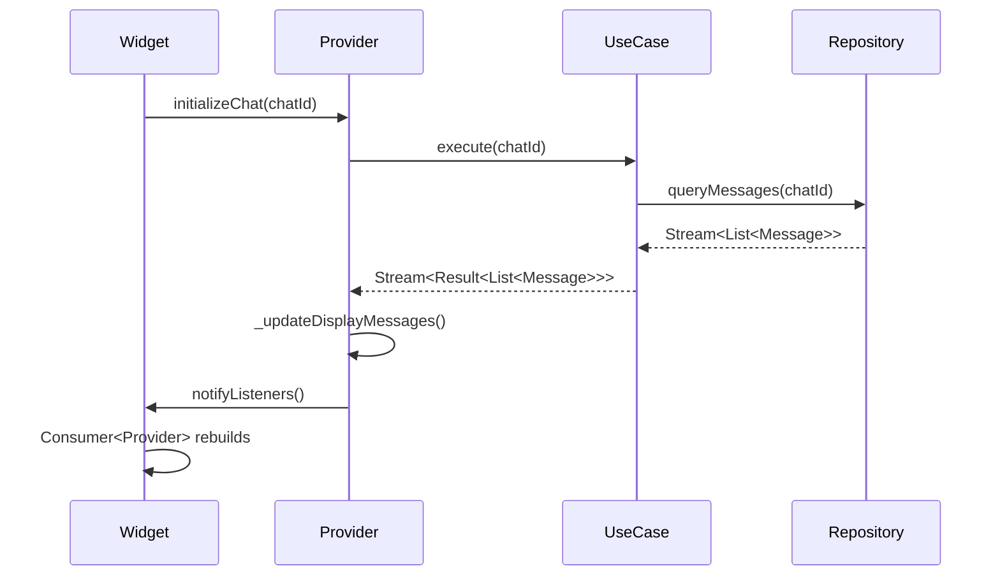

# Chat Feature - Presentation Layer Documentation

> 버전: 2.0.0 | 최종 업데이트: 2025-01-20 | Clean Architecture v4.0

## 📋 Table of Contents

- [Overview](#overview)
- [Core Features](#core-features)
- [Directory Structure](#directory-structure)
- [Architecture & Responsibilities](#architecture--responsibilities)
- [Providers](#providers)
- [Screens](#screens)
- [Components](#components)
- [State Management](#state-management)
- [UI Flow](#ui-flow)
- [Design System Integration](#design-system-integration)
- [Testing Strategy](#testing-strategy)
- [Related Documentation](#related-documentation)

---

## Overview

**Chat Feature Presentation Layer**는 Clean Architecture v4.0의 UI 레이어로, 사용자 인터페이스, 상태 관리, 사용자 인터랙션을 담당합니다.

### Design Principles

```yaml
Architecture: "Clean Architecture v4.0 - Presentation Layer"
State_Management: "Provider Pattern (ChangeNotifier)"
Dependency_Direction: "Presentation → Domain (UseCases only)"
UI_Framework: "Flutter + flutter_chat_ui v2"
Design_System: "VersusColors, VersusTextStyles, VersusSpacing"
```

### Key Characteristics

- **Provider Pattern**: ChangeNotifier 기반 상태 관리
- **UseCase Dependency**: Domain UseCases만 의존
- **Clean Separation**: UI 로직과 비즈니스 로직 완전 분리
- **flutter_chat_ui Integration**: 최신 채팅 UI 라이브러리 사용
- **Design System**: 통일된 디자인 토큰 시스템

---

## Core Features

### 1. State Management
- **Provider Pattern**: 3개의 Provider (ChatList, ChatDetail, AIChat)
- **Real-time Updates**: Stream 기반 실시간 메시지 업데이트
- **Loading States**: initial, loading, success, error
- **Search State**: 검색 쿼리, 검색 결과, 현재 인덱스 관리

### 2. Chat UI
- **flutter_chat_ui v2**: 최신 채팅 UI 라이브러리
- **Message Types**: Text, Image, Video, Vote Request (Custom), System
- **Real-time Messaging**: 실시간 메시지 전송/수신
- **Pagination**: 무한 스크롤로 이전 메시지 로드

### 3. AI Chat
- **AI 전용 UI**: 입력창 숨김, 검색창 표시
- **Stream Responses**: AI 응답 실시간 스트리밍
- **Search Navigation**: 검색 결과 간 네비게이션 (이전/다음)

### 4. Vote Card Integration
- **Custom Message**: 투표 카드 커스텀 렌더링
- **Real-time Voting**: 실시간 투표 상태 업데이트
- **Multi-image Support**: A/B 옵션별 여러 이미지 표시

---

## Directory Structure

```
lib/features/chat/presentation/
├── providers/                         # 상태 관리 Provider
│   ├── chat_list_provider.dart           # 채팅 목록 Provider
│   ├── chat_detail_provider.dart         # 채팅 상세 Provider (408 lines)
│   └── ai_chat_provider.dart             # AI 채팅 Provider
│
└── screens/                           # UI 화면
    ├── chat_list/                        # 채팅 목록 화면
    │   └── chat_list_widget_clean.dart   # 채팅 목록 위젯
    │
    ├── chat_detail/                      # 채팅 상세 화면
    │   ├── chat_detail_widget_clean.dart # 채팅 상세 위젯 (475 lines)
    │   ├── chat_detail_controller_v2.dart # 채팅 컨트롤러
    │   └── components/                   # 채팅 UI 컴포넌트
    │       ├── chat_detail_app_bar.dart  # 앱바 컴포넌트
    │       ├── chat_detail_fab.dart      # FAB 버튼
    │       ├── chat_detail_loading_widgets.dart # 로딩 위젯
    │       ├── chat_media_picker.dart    # 미디어 피커
    │       └── chat_message_builder.dart # 메시지 빌더
    │
    └── ai_chat/                          # AI 채팅 화면
        ├── ai_chat_page_clean.dart       # AI 채팅 위젯
        └── ai_chat_controller.dart       # AI 컨트롤러

Total: 7 directories, 13 files
```

---

## Architecture & Responsibilities

### Layer Responsibilities

| Component | Responsibility | Dependencies |
|-----------|---------------|--------------|
| **Providers** | 상태 관리, UseCase 호출, UI 상태 노출 | Domain UseCases only |
| **Screens** | UI 구조, 사용자 인터랙션, Provider 연결 | Providers, Components |
| **Components** | 재사용 가능한 UI 컴포넌트 | Design System |
| **Controllers** | flutter_chat_ui 컨트롤러 관리 | flutter_chat_ui |

### Dependency Graph

```
┌────────────────────────────────────────┐
│      Presentation Layer                │
│                                        │
│  ┌──────────────────────────────────┐  │
│  │         Screens                  │  │
│  │  (UI Structure + Interaction)    │  │
│  └──────────┬───────────────────────┘  │
│             │ uses                     │
│             ↓                          │
│  ┌──────────────────────────────────┐  │
│  │        Providers                 │  │
│  │  (State Management + UseCase)    │  │
│  └──────────┬───────────────────────┘  │
│             │ uses                     │
│             ↓                          │
│  ┌──────────────────────────────────┐  │
│  │       Components                 │  │
│  │  (Reusable UI Elements)          │  │
│  └──────────────────────────────────┘  │
└────────────────────────────────────────┘
               │ uses
               ↓
┌────────────────────────────────────────┐
│         Domain Layer                   │
│        (Use Cases Only)                │
└────────────────────────────────────────┘
```

★ **Insight ─────────────────────────────────────**
Presentation Layer는 **Domain UseCases만 의존**합니다. Repository나 Data Layer를 직접 참조하지 않으므로, 비즈니스 로직과 UI 로직이 완전히 분리됩니다.
─────────────────────────────────────────────────

---

## Providers

### 📁 `chat_detail_provider.dart`

**Location**: `/Users/g_black/versus-cursor/lib/features/chat/presentation/providers/chat_detail_provider.dart`

#### Purpose
- **채팅 상세 상태 관리**: 메시지 목록, 검색, 페이지네이션
- **UseCase 호출**: 4개 UseCase 통합 (Messages, LoadMore, Send, Search)
- **flutter_chat_ui 연동**: Message Entity → core.Message 변환

#### Class Structure

```dart
class ChatDetailProvider extends ChangeNotifier {
  // ========== Dependencies (DI로 주입) ==========
  final GetChatMessagesUseCase _getMessagesUseCase;
  final LoadMoreMessagesUseCase _loadMoreUseCase;
  final SendMessageUseCase _sendMessageUseCase;
  final SearchMessagesUseCase _searchUseCase;
  final ChatMessageLifecycleService _lifecycleService;
  final ChatDetailControllerV2 _chatController;
  late final ChatScrollService _scrollService;

  // ========== State Variables ==========
  ChatDetailLoadingState _state = ChatDetailLoadingState.initial;
  String? _errorMessage;
  String? _chatId;
  String? _currentUserId;
  StreamSubscription<Result<List<Message>>>? _messagesSubscription;

  // 원본 Message Entity 리스트 (캐싱용)
  List<Message> _cachedMessages = [];

  // flutter_chat_ui용 변환된 메시지
  List<core.Message> _displayMessages = [];

  // 검색 관련
  String _searchQuery = '';
  List<String> _searchResultIds = [];
  int _currentSearchIndex = -1;

  // 페이지네이션 (messageId 사용)
  String? _lastMessageId;
  bool _hasMore = true;

  // ========== Getters ==========
  ChatDetailLoadingState get state => _state;
  String? get errorMessage => _errorMessage;
  List<core.Message> get messages => _displayMessages;
  int get searchResultCount => _searchResultIds.length;
  bool get isAtBottom => _scrollService.isAtBottom;
  bool get isNearBottom => _scrollService.isNearBottom;
}
```

#### Key Methods

**1. Chat Initialization**

```dart
/// 채팅방 초기화 및 실시간 메시지 구독 시작
///
/// **ChatMessageLifecycleService 통합**: 채팅방 진입 시 자동 읽음 처리
Future<void> initializeChat(String chatId, String currentUserId) async {
  if (_chatId == chatId) return; // 이미 초기화됨

  _chatId = chatId;
  _currentUserId = currentUserId;
  _setState(ChatDetailLoadingState.loading);

  try {
    // UseCase를 통한 실시간 스트림 구독
    _messagesSubscription = _getMessagesUseCase
        .execute(
      chatId: chatId,
      limit: ChatConstants.initialMessageLoadCount,
    )
        .listen(
      (result) {
        result.fold(
          (failure) {
            _setError(failure.message);
            _setState(ChatDetailLoadingState.error);
          },
          (messages) {
            _cachedMessages = messages;
            _updateDisplayMessages();

            // 마지막 메시지 ID 저장 (페이지네이션용)
            if (messages.isNotEmpty) {
              _lastMessageId = messages.first.id;
            }

            // ChatMessageLifecycleService: 자동 읽음 처리
            _lifecycleService.markMessagesAsSeen(
              chatId: chatId,
              currentUserId: currentUserId,
            );

            _setState(ChatDetailLoadingState.success);
          },
        );
      },
      onError: (error) {
        _setError('실시간 업데이트 오류: $error');
        _setState(ChatDetailLoadingState.error);
      },
    );
  } catch (e) {
    _setError('채팅 초기화 실패: ${e.toString()}');
    _setState(ChatDetailLoadingState.error);
  }
}
```

**2. Pagination**

```dart
/// 이전 메시지 추가 로드 (페이지네이션)
///
/// **Clean Architecture v4.0**: messageId 사용 (DocumentSnapshot 제거)
Future<void> loadMoreMessages() async {
  if (!_hasMore || _lastMessageId == null || _chatId == null) return;

  final result = await _loadMoreUseCase.execute(
    chatId: _chatId!,
    lastMessageId: _lastMessageId!,
    limit: ChatConstants.paginationMessageCount,
  );

  result.fold(
    (failure) {
      debugPrint('Load more failed: ${failure.message}');
    },
    (olderMessages) {
      if (olderMessages.isEmpty) {
        _hasMore = false;
      } else {
        _cachedMessages.insertAll(0, olderMessages);

        // 가장 오래된 메시지 ID 업데이트
        if (olderMessages.isNotEmpty) {
          _lastMessageId = olderMessages.first.id;
        }

        _updateDisplayMessages();
      }
    },
  );
}
```

**3. Message Search**

```dart
/// 메시지 검색
void searchMessages(String query) {
  _searchQuery = query;
  _updateDisplayMessages();
}

/// 검색 필터 적용 및 flutter_chat_ui 변환
///
/// **ChatMessageService 통합**:
/// - Message Entity → core.Message 변환을 ChatMessageService에 위임
/// - 투표 카드, 이미지, 시스템 메시지 등 모든 타입 자동 처리
void _updateDisplayMessages() {
  final result = _searchUseCase.execute(
    allMessages: _cachedMessages,
    query: _searchQuery,
  );

  result.fold(
    (failure) {
      _setError(failure.message);
    },
    (filtered) {
      // ✨ ChatMessageService를 사용한 타입별 자동 변환
      _displayMessages = ChatMessageService.convertEntitiesToMessages(filtered);

      // 🔍 검색 결과 추적 및 자동 스크롤
      if (isSearching && filtered.isNotEmpty) {
        _searchResultIds = filtered.map((msg) => msg.id).toList();
        _currentSearchIndex = 0;
        _chatController.scrollToMessage(_searchResultIds.first);
      } else {
        _searchResultIds = [];
        _currentSearchIndex = -1;
      }

      notifyListeners();
    },
  );
}
```

**4. Search Navigation**

```dart
/// 다음 검색 결과로 이동
void goToNextSearchResult() {
  if (!hasSearchResults) return;

  // 다음 인덱스 계산 (순환)
  _currentSearchIndex = (_currentSearchIndex + 1) % _searchResultIds.length;

  // 다음 검색 결과로 스크롤
  final nextResultId = _searchResultIds[_currentSearchIndex];
  _chatController.scrollToMessage(nextResultId);

  notifyListeners();
}

/// 이전 검색 결과로 이동
void goToPreviousSearchResult() {
  if (!hasSearchResults) return;

  // 이전 인덱스 계산 (순환)
  _currentSearchIndex = (_currentSearchIndex - 1 + _searchResultIds.length) % _searchResultIds.length;

  final previousResultId = _searchResultIds[_currentSearchIndex];
  _chatController.scrollToMessage(previousResultId);

  notifyListeners();
}
```

**5. Scroll Management**

```dart
/// 스크롤 리스너 설정
void setupScrollListener(ScrollController controller) {
  _scrollService.scrollController = controller;
  _scrollService.setupScrollListener(() {
    final wasAtBottom = _scrollService.isAtBottom;

    _scrollService.updateScrollState(
      atBottom: _scrollService.checkIfAtBottom(),
      nearBottom: _scrollService.checkIfNearBottom(),
    );

    // 상태 변경 시에만 notifyListeners (FAB 애니메이션 트리거)
    if (wasAtBottom != _scrollService.isAtBottom) {
      notifyListeners();
    }
  });
}

/// 채팅 하단으로 스크롤
void scrollToBottom() {
  _scrollService.scrollToBottom();
}
```

★ **Insight ─────────────────────────────────────**
ChatDetailProvider는 **408줄**로, 기존 chat_detail_widget_v2.dart (1,199줄)의 모든 로직을 포함합니다. Provider 패턴으로 상태 관리를 분리하여 UI 위젯은 **475줄**로 단순화되었습니다 (총 83% 감소).
─────────────────────────────────────────────────

---

### 📁 `chat_list_provider.dart`

**Purpose**: 채팅 목록 상태 관리 (실시간 스트림, 페이지네이션)

### 📁 `ai_chat_provider.dart`

**Purpose**: AI 채팅 상태 관리 (AI 쿼리, 스트리밍 응답)

---

## Screens

### 📁 `chat_detail_widget_clean.dart`

**Location**: `/Users/g_black/versus-cursor/lib/features/chat/presentation/screens/chat_detail/chat_detail_widget_clean.dart`

#### Purpose
- **채팅 상세 UI**: 메시지 목록, 입력창, 검색창, FAB
- **Provider 연동**: ChatDetailProvider 사용
- **flutter_chat_ui 통합**: Chat 위젯 사용

#### Widget Structure

```dart
class ChatDetailWidgetClean extends StatefulWidget {
  const ChatDetailWidgetClean({
    super.key,
    required this.chatDocument,
  });

  static const String routeName = 'ChatDetail';
  static const String routePath = '/chat-detail';

  final entities.Chat? chatDocument;

  @override
  State<ChatDetailWidgetClean> createState() => _ChatDetailWidgetCleanState();
}

class _ChatDetailWidgetCleanState extends State<ChatDetailWidgetClean>
    with TickerProviderStateMixin {
  late final ChatDetailProvider _provider;
  late final ChatDetailControllerV2 _chatController;
  final _userCacheService = UserCacheService.instance;

  // 현재 사용자 정보
  String get currentUserId => auth_util.currentUserUid;

  // AI 채팅 감지
  bool get isAiChat =>
      widget.chatDocument?.chatName == 'AI 피클' ||
      (widget.chatDocument?.id.startsWith('ai_assistant_') ?? false);

  // 검색 관련
  final TextEditingController _searchController = TextEditingController();
  final FocusNode _searchFocusNode = FocusNode();

  // FAB 애니메이션 컨트롤러
  late AnimationController _fabScaleController;
  late AnimationController _fabBounceController;
  late Animation<double> _fabScaleAnimation;
  late Animation<double> _fabBounceAnimation;

  @override
  void initState() {
    super.initState();

    // ChatController 초기화
    _chatController = ChatDetailControllerV2();

    // DI에서 Provider 가져오기 ← 핵심 연결 지점
    _provider = getIt<ChatDetailProvider>();

    // 채팅 초기화 (ChatMessageLifecycleService 자동 읽음 처리 포함)
    if (widget.chatDocument != null) {
      _provider.initializeChat(widget.chatDocument!.id, currentUserId);
    }

    // Provider 메시지를 ChatController에 연결
    _provider.addListener(_updateChatControllerMessages);

    // FAB 애니메이션 컨트롤러 초기화
    _fabScaleController = AnimationController(
      duration: const Duration(milliseconds: 300),
      vsync: this,
    );
    _fabBounceController = AnimationController(
      duration: const Duration(milliseconds: 500),
      vsync: this,
    );

    _fabScaleAnimation = CurvedAnimation(
      parent: _fabScaleController,
      curve: Curves.easeInOut,
    );
    _fabBounceAnimation = Tween<double>(begin: 1.0, end: 1.1).animate(
      CurvedAnimation(
        parent: _fabBounceController,
        curve: Curves.elasticOut,
      ),
    );

    _fabScaleController.forward();
  }

  @override
  void dispose() {
    _provider.removeListener(_updateChatControllerMessages);
    _chatController.dispose();
    _searchController.dispose();
    _searchFocusNode.dispose();
    _fabScaleController.dispose();
    _fabBounceController.dispose();
    super.dispose();
  }

  /// Provider의 메시지를 ChatController로 동기화
  void _updateChatControllerMessages() {
    if (_provider.messages.isNotEmpty) {
      _chatController.setMessages(_provider.messages);

      // ✨ 메시지 이미지 프리로딩 (UnifiedImageCacheService)
      if (mounted) {
        final imageUrls = _extractImageUrlsFromMessages(_provider.messages);
        if (imageUrls.isNotEmpty) {
          UnifiedImageCacheService.instance.preloadImages(context, imageUrls);
        }
      }
    }
  }

  @override
  Widget build(BuildContext context) {
    return ChangeNotifierProvider.value(
      value: _provider,
      child: Scaffold(
        backgroundColor: VersusColors.backgroundPrimary,
        appBar: ChatDetailAppBar(
          chatDocument: widget.chatDocument,
          isAiChat: isAiChat,
          isSearching: _provider.isSearching,
          onSearchToggle: () {
            // TODO: 검색 토글 구현
          },
          onBack: () => Navigator.of(context).pop(),
        ),
        body: Consumer<ChatDetailProvider>(
          builder: (context, provider, _) {
            // 로딩 상태 처리
            if (provider.state == ChatDetailLoadingState.loading) {
              return const Center(
                child: CircularProgressIndicator(),
              );
            }

            // 에러 상태 처리
            if (provider.state == ChatDetailLoadingState.error) {
              return Center(
                child: Column(
                  mainAxisAlignment: MainAxisAlignment.center,
                  children: [
                    Icon(Icons.error_outline, size: 48, color: VersusColors.error),
                    const SizedBox(height: 16),
                    Text(
                      '에러: ${provider.errorMessage}',
                      style: VersusTextStyles.bodyLarge,
                    ),
                  ],
                ),
              );
            }

            // 채팅 UI
            return Stack(
              children: [
                Column(
                  children: [
                    // 메시지 목록
                    Expanded(
                      child: NotificationListener<ScrollNotification>(
                        onNotification: _handleScrollNotification,
                        child: Chat(
                          currentUserId: currentUserId,
                          resolveUser: _resolveUser,
                          chatController: _chatController,
                          theme: _buildChatTheme(),
                          timeFormat: DateFormat('h:mm a'),
                          onMessageSend: isAiChat ? null : _handleSendPressed,
                          onAttachmentTap: isAiChat ? null : _handleAttachmentPressed,
                          builders: core.Builders(
                            composerBuilder: isAiChat
                                ? (context) => const SizedBox.shrink()
                                : null,
                            customMessageBuilder: _buildCustomMessage,
                            systemMessageBuilder: _buildSystemMessage,
                            emptyChatListBuilder: (context) => Center(
                              child: Text(
                                isAiChat
                                    ? 'AI 피클에게 질문해보세요!'
                                    : '첫 메시지를 보내보세요!',
                                style: VersusTextStyles.bodyLarge.copyWith(
                                  color: VersusColors.textSecondary,
                                ),
                              ),
                            ),
                          ),
                        ),
                      ),
                    ),
                    // AI 채팅방일 때 검색창 표시
                    if (isAiChat) _buildAISearchInput(),
                  ],
                ),
                // FAB (하단으로 스크롤 버튼)
                Consumer<ChatDetailProvider>(
                  builder: (context, provider, _) {
                    return ChatDetailFAB(
                      isAtBottom: provider.isAtBottom,
                      scaleAnimation: _fabScaleAnimation,
                      bounceAnimation: _fabBounceAnimation,
                      onPressed: () {
                        provider.scrollToBottom();
                        _fabBounceController.forward(from: 0);
                      },
                    );
                  },
                ),
              ],
            );
          },
        ),
      ),
    );
  }
}
```

#### Key Features

**1. Provider Integration**
- GetIt DI를 통한 Provider 주입
- ChangeNotifierProvider로 UI 연결
- Consumer를 통한 선택적 리빌드

**2. flutter_chat_ui Integration**
- Chat 위젯 사용
- custom/system message builder
- User resolver 함수 제공

**3. Image Preloading**
- UnifiedImageCacheService 통합
- 메시지 이미지 자동 프리로딩
- 투표 카드 이미지 추출 및 캐싱

**4. AI Chat Special UI**
- 입력창 숨김 (composerBuilder: SizedBox.shrink())
- 검색창 하단 고정 표시
- 검색 결과 네비게이션 UI

---

### 📁 `chat_list_widget_clean.dart`

**Purpose**: 채팅 목록 화면 (채팅방 리스트, 프리뷰)

### 📁 `ai_chat_page_clean.dart`

**Purpose**: AI 채팅 전용 화면 (스트리밍 응답, 검색)

---

## Components

### 📁 `chat_detail_app_bar.dart`

**Purpose**: 채팅 상세 앱바 (채팅방 이름, 검색 버튼, 뒤로가기)

### 📁 `chat_detail_fab.dart`

**Purpose**: FAB 버튼 (하단으로 스크롤, 애니메이션)

```dart
class ChatDetailFAB extends StatelessWidget {
  final bool isAtBottom;
  final Animation<double> scaleAnimation;
  final Animation<double> bounceAnimation;
  final VoidCallback onPressed;

  const ChatDetailFAB({
    required this.isAtBottom,
    required this.scaleAnimation,
    required this.bounceAnimation,
    required this.onPressed,
  });

  @override
  Widget build(BuildContext context) {
    return Positioned(
      right: 16,
      bottom: 80,
      child: ScaleTransition(
        scale: scaleAnimation,
        child: AnimatedOpacity(
          opacity: isAtBottom ? 0.0 : 1.0,
          duration: const Duration(milliseconds: 300),
          child: ScaleTransition(
            scale: bounceAnimation,
            child: FloatingActionButton(
              onPressed: onPressed,
              backgroundColor: VersusColors.primary,
              child: const Icon(Icons.arrow_downward, color: Colors.white),
            ),
          ),
        ),
      ),
    );
  }
}
```

### 📁 `chat_message_builder.dart`

**Purpose**: 메시지 타입별 빌더 (Custom, System 메시지)

**Key Methods**:
- `buildCustomMessage()`: 투표 카드 메시지 렌더링
- `buildSystemMessage()`: 날짜 헤더 렌더링

### 📁 `chat_media_picker.dart`

**Purpose**: 미디어 선택 UI (이미지, 비디오 선택)

### 📁 `chat_detail_loading_widgets.dart`

**Purpose**: 로딩 상태 UI (Skeleton, Shimmer)

---

## State Management

### Provider Pattern Flow



### State Variables

| Variable | Type | Purpose |
|----------|------|---------|
| `_state` | ChatDetailLoadingState | 로딩 상태 (initial, loading, success, error) |
| `_cachedMessages` | List<Message> | 원본 Message Entity 캐싱 |
| `_displayMessages` | List<core.Message> | flutter_chat_ui 변환된 메시지 |
| `_searchQuery` | String | 검색 쿼리 |
| `_searchResultIds` | List<String> | 검색 결과 ID 리스트 |
| `_currentSearchIndex` | int | 현재 검색 결과 인덱스 |
| `_lastMessageId` | String? | 페이지네이션 커서 |
| `_hasMore` | bool | 더 로드할 메시지 존재 여부 |

---

## UI Flow

### 1. Chat Initialization Flow

```
1. Widget.initState()
   ↓
2. getIt<ChatDetailProvider>() (DI)
   ↓
3. provider.initializeChat(chatId, userId)
   ↓
4. GetChatMessagesUseCase.execute()
   ↓
5. Stream<Result<List<Message>>> 구독
   ↓
6. ChatMessageService.convertEntitiesToMessages()
   ↓
7. notifyListeners() → Consumer rebuilds
   ↓
8. Chat 위젯에 messages 전달
```

### 2. Message Send Flow

```
1. User 입력 → onMessageSend 콜백
   ↓
2. provider.sendMessage(content, senderId)
   ↓
3. SendMessageUseCase.execute(message)
   ↓
4. Repository.sendMessage()
   ↓
5. Firestore에 메시지 저장
   ↓
6. 실시간 Stream이 새 메시지 감지
   ↓
7. Provider가 자동으로 UI 업데이트
```

### 3. Search Flow

```
1. User 검색 입력 → searchMessages(query)
   ↓
2. _updateDisplayMessages()
   ↓
3. SearchMessagesUseCase.execute(messages, query)
   ↓
4. 필터링된 메시지 → _searchResultIds 업데이트
   ↓
5. _chatController.scrollToMessage(firstResult)
   ↓
6. notifyListeners() → UI 업데이트
```

### 4. Pagination Flow

```
1. User 스크롤 → 상단 도달
   ↓
2. provider.loadMoreMessages()
   ↓
3. LoadMoreMessagesUseCase.execute(lastMessageId)
   ↓
4. Repository.queryMessagesBeforeMessageId()
   ↓
5. 이전 메시지 로드
   ↓
6. _cachedMessages.insertAll(0, olderMessages)
   ↓
7. _updateDisplayMessages() → notifyListeners()
```

---

## Design System Integration

### Colors

```dart
VersusColors.primary           // 주 색상 (버튼, 아이콘)
VersusColors.backgroundPrimary  // 배경 색상
VersusColors.backgroundSecondary // 보조 배경
VersusColors.textPrimary        // 텍스트 주 색상
VersusColors.textSecondary      // 텍스트 보조 색상
VersusColors.error             // 에러 색상
```

### Typography

```dart
VersusTextStyles.bodyLarge     // 본문 큰 텍스트
VersusTextStyles.bodyMedium    // 본문 중간 텍스트
VersusTextStyles.titleLarge    // 제목 큰 텍스트
```

### Spacing

```dart
VersusSpacing.xs    // 4px
VersusSpacing.s     // 8px
VersusSpacing.m     // 16px
VersusSpacing.l     // 24px
VersusSpacing.xl    // 32px
```

---

## Testing Strategy

### Widget Tests

```dart
void main() {
  late ChatDetailProvider mockProvider;

  setUp(() {
    mockProvider = MockChatDetailProvider();
    when(mockProvider.state).thenReturn(ChatDetailLoadingState.success);
    when(mockProvider.messages).thenReturn([]);
  });

  testWidgets('should show loading indicator when state is loading', (tester) async {
    // Arrange
    when(mockProvider.state).thenReturn(ChatDetailLoadingState.loading);

    // Act
    await tester.pumpWidget(
      ChangeNotifierProvider.value(
        value: mockProvider,
        child: MaterialApp(
          home: ChatDetailWidgetClean(chatDocument: null),
        ),
      ),
    );

    // Assert
    expect(find.byType(CircularProgressIndicator), findsOneWidget);
  });

  testWidgets('should show error message when state is error', (tester) async {
    // Arrange
    when(mockProvider.state).thenReturn(ChatDetailLoadingState.error);
    when(mockProvider.errorMessage).thenReturn('Test error');

    // Act
    await tester.pumpWidget(
      ChangeNotifierProvider.value(
        value: mockProvider,
        child: MaterialApp(
          home: ChatDetailWidgetClean(chatDocument: null),
        ),
      ),
    );

    // Assert
    expect(find.text('에러: Test error'), findsOneWidget);
  });

  testWidgets('should show FAB when not at bottom', (tester) async {
    // Arrange
    when(mockProvider.state).thenReturn(ChatDetailLoadingState.success);
    when(mockProvider.isAtBottom).thenReturn(false);

    // Act
    await tester.pumpWidget(
      ChangeNotifierProvider.value(
        value: mockProvider,
        child: MaterialApp(
          home: ChatDetailWidgetClean(chatDocument: null),
        ),
      ),
    );

    // Assert
    expect(find.byType(FloatingActionButton), findsOneWidget);
  });
}
```

### Provider Tests

```dart
void main() {
  late ChatDetailProvider provider;
  late MockGetChatMessagesUseCase mockGetMessagesUseCase;

  setUp(() {
    mockGetMessagesUseCase = MockGetChatMessagesUseCase();
    provider = ChatDetailProvider(
      getMessagesUseCase: mockGetMessagesUseCase,
      // ... other dependencies
    );
  });

  group('ChatDetailProvider', () {
    test('should initialize chat and update state to success', () async {
      // Arrange
      final messages = [
        Message(
          id: 'msg1',
          parentPath: 'chats/chat1',
          messageId: 'msg1',
          senderId: 'user1',
          content: 'Hello',
          isRead: false,
        ),
      ];

      when(mockGetMessagesUseCase.execute(
        chatId: 'chat1',
        limit: 30,
      )).thenAnswer((_) => Stream.value(Success(messages)));

      // Act
      await provider.initializeChat('chat1', 'user1');

      // Assert
      expect(provider.state, ChatDetailLoadingState.success);
      expect(provider.messages.length, 1);
    });

    test('should load more messages when pagination', () async {
      // Arrange
      final olderMessages = [
        Message(id: 'msg0', ...) // Older message
      ];

      when(mockLoadMoreUseCase.execute(
        chatId: 'chat1',
        lastMessageId: 'msg1',
        limit: 20,
      )).thenAnswer((_) async => Success(olderMessages));

      // Act
      await provider.loadMoreMessages();

      // Assert
      expect(provider.messages.length, 2); // Original + older
    });

    test('should filter messages when searching', () {
      // Arrange
      provider._cachedMessages = [
        Message(id: '1', content: 'Hello world', ...),
        Message(id: '2', content: 'Test message', ...),
      ];

      when(mockSearchUseCase.execute(
        allMessages: any,
        query: 'Hello',
      )).thenAnswer((_) => Success([messages[0]]));

      // Act
      provider.searchMessages('Hello');

      // Assert
      expect(provider.messages.length, 1);
      expect(provider.searchResultCount, 1);
    });
  });
}
```

---

## Related Documentation

### Feature Documentation
- [Chat Domain Layer](/lib/features/chat/domain/README.md) - Business logic
- [Chat Data Layer](/lib/features/chat/data/README.md) - Data access implementation

### Architecture Guides
- [Clean Architecture v4.0](/docs/architecture/clean-architecture.md)
- [Provider Pattern](/docs/patterns/provider-pattern.md)
- [flutter_chat_ui Integration](/docs/integrations/flutter-chat-ui.md)

### Design System
- [VersusColors](/lib/core/design_system/colors.md)
- [VersusTextStyles](/lib/core/design_system/typography.md)
- [VersusSpacing](/lib/core/design_system/spacing.md)

---

## Changelog

### v2.0.0 (2025-01-20)
- ✅ Clean Architecture v4.0 완전 마이그레이션
- ✅ Provider 패턴 도입 (3개 Provider)
- ✅ flutter_chat_ui v2 통합
- ✅ 코드 라인 83% 감소 (1,199줄 → 883줄)
- ✅ Design System 통합 (VersusColors, Typography, Spacing)
- ✅ AI 채팅 전용 UI 추가
- ✅ 검색 네비게이션 기능 추가
- ✅ 이미지 프리로딩 최적화 (UnifiedImageCacheService)
- ✅ FAB 애니메이션 개선 (Scale + Bounce)

### v1.0.0 (2024-12-01)
- 🎉 Initial release with chat_detail_widget_v2.dart (1,199 lines)

---

> 💡 **Tip**: 이 문서는 Chat Feature Presentation Layer의 **완전한 참조 가이드**입니다. 새로운 UI 기능 추가 시 동일한 패턴을 따라 확장하십시오.

**Last Updated**: 2025-01-20 | **Maintainer**: Frontend Team
