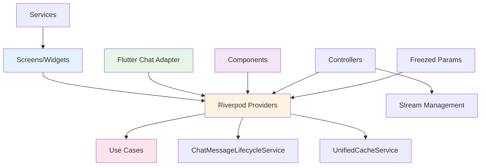

# Chat Feature - Presentation Layer

> **최종 업데이트**: 2025-11-01
> **버전**: 4.0.0 (Clean Architecture v4.0 + Riverpod 2.x Migration Complete)
> **UI Framework**: Flutter with Riverpod 2.x + flutter_chat_ui v2

## 📋 개요

Chat Feature의 Presentation Layer는 사용자 인터페이스와 상호작용을 담당합니다. **Riverpod 2.x** 기반 반응형 상태 관리와 **flutter_chat_ui v2** 통합으로 구성되어 있습니다.

### 핵심 특징
- ✅ **Riverpod 2.x Pattern**: StreamProvider.autoDispose.family 기반 반응형 상태 관리
- ✅ **flutter_chat_ui v2 통합**: 채팅 UI 전문 라이브러리 통합
- ✅ **Clean Architecture v4.0**: Domain Layer와 완전 분리 (코드 30-48% 감소)
- ✅ **3-Layer Caching**: Memory → Hive → Firestore 캐싱 시스템 통합
- ✅ **Dual AI Chat System**: 투표 AI (ai_assistant) + 도우미 AI (ai_helper) 이중 구조
- ✅ **Vote Card Integration**: 커스텀 메시지로 투표 카드 표시
- ✅ **Real-time Messaging**: Stream 기반 실시간 메시징

## 🏗️ 디렉토리 구조

```
lib/features/chat/presentation/
│
├── adapters/                           # 외부 라이브러리 어댑터 (338줄)
│   └── flutter_chat_adapter.dart       # Message Entity ↔ flutter_chat_ui 변환
│
├── providers/                          # Riverpod 2.x Providers (1,414줄)
│   ├── chat_params.dart                # StreamProvider 파라미터 (Freezed)
│   ├── chat_params.freezed.dart        # Auto-generated Freezed code
│   └── chat_providers.dart             # Provider 정의 (293줄)
│       ├── UseCase Providers (10개)    # GetIt 래핑
│       ├── chatListStreamProvider      # 채팅 목록 실시간 Stream
│       ├── chatMessagesStreamProvider  # 메시지 실시간 Stream
│       └── unreadChatCountProvider     # Computed Provider
│
├── screens/                            # 화면 위젯 (3,253줄)
│   ├── ai_chat/                        # AI 채팅 화면 (1,100줄)
│   │   ├── ai_chat_controller.dart     # AI 스트리밍 관리 (127줄)
│   │   ├── ai_chat_page_clean.dart     # 투표 AI 채팅방 (667줄)
│   │   │   ├── ai_assistant_{userId}   # 투표 카드 중계 전용
│   │   │   ├── 사용자 입력 불가 (읽기 전용)
│   │   │   └── Vote Card 전달 시스템
│   │   └── ai_helper_chat_page.dart    # 도우미 AI 채팅방 (306줄)
│   │       ├── AI 대화 기능
│   │       └── Gemini AI 통합
│   │
│   ├── chat_detail/                    # 1:1 채팅 화면 (1,353줄)
│   │   ├── chat_detail_controller_v2.dart    # 라이프사이클 관리 (70줄)
│   │   ├── chat_detail_widget_clean.dart     # 메인 채팅 화면 (627줄)
│   │   │   ├── v2: 1,199줄 → Clean: 627줄 (48% 감소)
│   │   │   ├── Riverpod StreamProvider 기반
│   │   │   ├── ChatAnimatedListReversed (스크롤 점프 해결)
│   │   │   └── 검색, 이미지 프리로딩, FAB
│   │   └── components/                 # 채팅 컴포넌트 (549줄)
│   │       ├── chat_detail_app_bar.dart      # AppBar (76줄)
│   │       ├── chat_detail_fab.dart          # Floating Action Button (56줄)
│   │       ├── chat_detail_loading_widgets.dart # 로딩 위젯 (103줄)
│   │       ├── chat_media_picker.dart        # 미디어 선택 (281줄)
│   │       └── chat_message_builder.dart     # 메시지 렌더링 (339줄)
│   │           ├── CustomMessage Builder
│   │           ├── Vote Card Widget 통합
│   │           └── 메시지 타입별 처리
│   │
│   ├── chat_list/                      # 채팅 목록 화면 (305줄)
│   │   └── chat_list_widget_clean.dart # 채팅 목록 (305줄)
│   │       ├── v1: 332줄 → Clean: 305줄 (8% 감소)
│   │       ├── ConsumerWidget 패턴
│   │       ├── AsyncValue.when() 분기
│   │       └── 실시간 채팅 목록
│   │
│   └── friends/                        # 친구 관리 화면 (382줄)
│       └── friends_widget.dart         # 친구 목록 및 검색 (382줄)
│           ├── 친구 검색
│           ├── 친구 추천
│           └── 팔로우/언팔로우
│
├── services/                           # Presentation Services (71줄)
│   └── chat_scroll_service.dart        # 스크롤 동작 관리 (71줄)
│
└── params/                             # (providers/ 내 통합됨)
    └── chat_params.dart                # Freezed 파라미터 정의

총 파일: 17개
총 코드: 5,162줄
```

## 🔧 주요 컴포넌트

### 1. Riverpod 2.x Providers (293줄 + 1,045줄 generated)

#### UseCase Providers (GetIt 래핑)

```dart
// chat_providers.dart
import 'package:flutter_riverpod/flutter_riverpod.dart';
import '/app/di.dart';

/// GetIt에 등록된 GetChatListUseCase를 Riverpod Provider로 제공
final getChatListUseCaseProvider = Provider<GetChatListUseCase>((ref) {
  return getIt<GetChatListUseCase>();
});

/// GetIt에 등록된 SendMessageUseCase를 Riverpod Provider로 제공
final sendMessageUseCaseProvider = Provider<SendMessageUseCase>((ref) {
  return getIt<SendMessageUseCase>();
});

// ... 총 10개 UseCase Provider
```

**등록된 UseCase Providers**:
1. `getChatListUseCaseProvider` - 채팅 목록 조회
2. `getChatMessagesUseCaseProvider` - 메시지 목록 조회
3. `loadMoreMessagesUseCaseProvider` - 메시지 페이지네이션
4. `sendMessageUseCaseProvider` - 메시지 전송
5. `searchMessagesUseCaseProvider` - 메시지 검색
6. `sendAIQueryUseCaseProvider` - AI 질의
7. `chatMessageLifecycleServiceProvider` - 라이프사이클 관리
8. `aiServiceProvider` - AI 서비스 (Port)
9. `getRecommendedFriendsUseCaseProvider` - 친구 추천 (Future)
10. `searchFriendsUseCaseProvider` - 친구 검색 (Future)

#### StreamProvider.autoDispose.family 패턴

```dart
/// 채팅 목록 실시간 스트림 Provider
///
/// **Riverpod StreamProvider.autoDispose.family 패턴 적용**:
/// - StreamProvider.autoDispose.family
/// - 즉시 emit으로 로딩 개선
/// - keepAlive()로 중복 리스너 방지
///
/// **사용 예시**:
/// ```dart
/// final asyncChats = ref.watch(chatListStreamProvider(
///   ChatListParams(userId: currentUserUid, limit: 50),
/// ));
///
/// asyncChats.when(
///   data: (chats) => ListView(...),
///   loading: () => CircularProgressIndicator(),
///   error: (error, stack) => ErrorWidget(error: error),
/// );
/// ```
final chatListStreamProvider =
    StreamProvider.autoDispose.family<List<Chat>, ChatListParams>(
  (ref, params) async* {
    // UseCase를 통한 실시간 스트림 (캐시 우선 응답)
    final getChatListUseCase = ref.watch(getChatListUseCaseProvider);

    await for (final either in getChatListUseCase.execute(
      userId: params.userId,
      limit: params.limit,
    )) {
      // Either → Stream 변환
      yield* either.fold(
        (failure) => Stream<List<Chat>>.error(failure), // Left: Error
        (chats) async* {
          yield chats; // Right: Success
        },
      );
    }

    // keepAlive로 중복 리스너 방지
    ref.keepAlive();
  },
);
```

**StreamProvider 특징**:
- **autoDispose**: 자동 메모리 관리
- **family**: 파라미터별 독립 인스턴스
- **keepAlive()**: 화면 전환 시에도 Stream 유지
- **캐시 우선**: UnifiedCacheService 통합으로 <10ms 응답

#### Computed Provider 패턴

```dart
/// 읽지 않은 채팅 개수 Provider
///
/// **Computed Provider 패턴**:
/// - chatListStreamProvider를 watch하여 자동 업데이트
/// - 읽지 않은 채팅만 필터링
final unreadChatCountProvider = Provider.autoDispose.family<int, String>(
  (ref, userId) {
    final asyncChats = ref.watch(chatListStreamProvider(
      ChatListParams(userId: userId),
    ));

    return asyncChats.when(
      data: (chats) => chats.where((chat) {
        return chat.hasUnreadMessages(userId);
      }).length,
      loading: () => 0,
      error: (_, __) => 0,
    );
  },
);
```

### 2. Freezed Params (76줄 + 1,045줄 generated)

```dart
// chat_params.dart
import 'package:freezed_annotation/freezed_annotation.dart';

part 'chat_params.freezed.dart';

/// ChatListStreamProvider 파라미터
///
/// **사용 예시**:
/// ```dart
/// final params = ChatListParams(userId: 'user123', limit: 50);
/// final asyncChats = ref.watch(chatListStreamProvider(params));
/// ```
@freezed
sealed class ChatListParams with _$ChatListParams {
  const ChatListParams._();

  const factory ChatListParams({
    required String userId,
    @Default(50) int limit,
    @Default('lastMessageAt') String orderBy,
    @Default(true) bool descending,
  }) = _ChatListParams;
}

/// ChatMessagesStreamProvider 파라미터
@freezed
sealed class ChatMessagesParams with _$ChatMessagesParams {
  const ChatMessagesParams._();

  const factory ChatMessagesParams({
    required String chatId,
    @Default(30) int limit,
    @Default('timestamp') String orderBy,
    @Default(true) bool descending,
  }) = _ChatMessagesParams;
}

/// RecommendedFriendsProvider 파라미터
@freezed
sealed class RecommendedFriendsParams with _$RecommendedFriendsParams {
  const RecommendedFriendsParams._();

  const factory RecommendedFriendsParams({
    required String currentUserId,
    @Default(20) int limit,
    @Default('totalAPoints') String sortBy,
  }) = _RecommendedFriendsParams;
}

/// SearchFriendsProvider 파라미터
@freezed
sealed class SearchFriendsParams with _$SearchFriendsParams {
  const SearchFriendsParams._();

  const factory SearchFriendsParams({
    required String currentUserId,
    required String query,
  }) = _SearchFriendsParams;
}
```

**Freezed Pattern 장점**:
- ✅ **Immutability**: 불변 객체 보장
- ✅ **Equality**: 자동 `==` 및 `hashCode` 구현
- ✅ **copyWith()**: 편리한 객체 복사
- ✅ **toString()**: 자동 디버깅 문자열

### 3. Flutter Chat UI Adapter (338줄)

```dart
// flutter_chat_adapter.dart
/// Flutter Chat UI Adapter
///
/// **Clean Architecture v4.0 - Presentation Layer Adapter:**
/// - Message Entity → flutter_chat_ui 타입 변환
/// - DocumentSnapshot → flutter_chat_ui 타입 변환
///
/// **Layer Violation 해결**:
/// - 기존 data/mappers/message_mapper.dart에서 이동
/// - Presentation Layer에서 외부 UI 라이브러리 의존 관리
///
/// **Used by**:
/// - chat_detail_provider.dart
/// - ai_chat_provider.dart
class FlutterChatAdapter {
  static final FlutterChatAdapter _instance = FlutterChatAdapter._internal();
  factory FlutterChatAdapter() => _instance;
  FlutterChatAdapter._internal();

  /// Message Entity를 flutter_chat_ui의 Message 객체로 변환
  ///
  /// **Clean Architecture v4.0 Provider 통합용:**
  /// - Provider에서 받은 Message Entity를 UI 렌더링용 core.Message로 변환
  /// - 투표 카드, 이미지, 시스템 메시지 등 모든 타입 지원
  ///
  /// Returns null if required data is missing
  static core.Message? convertEntityToMessage(Message entity) {
    try {
      // 필수 데이터 검증
      if (entity.senderId.isEmpty || entity.timeStamp == null) {
        return null;
      }

      // 메시지 타입별 처리
      if (entity.isVoteRequest) {
        return _createVoteMessageFromEntity(entity);
      } else if (entity.messageType == AppConstants.messageTypeSystem) {
        return core.SystemMessage(
          id: entity.id,
          text: entity.content,
          createdAt: entity.timeStamp!,
          authorId: 'system',
        );
      } else if (entity.messageType == AppConstants.messageTypeImage) {
        return core.ImageMessage(
          id: entity.id,
          authorId: entity.senderId,
          name: entity.content,
          size: 0,
          uri: entity.imageUrl ?? '',
          createdAt: entity.timeStamp!,
        );
      } else {
        // 일반 텍스트 메시지
        return core.TextMessage(
          id: entity.id,
          authorId: entity.senderId,
          text: entity.content,
          createdAt: entity.timeStamp!,
        );
      }
    } catch (e) {
      print('Error converting entity to message: $e');
      return null;
    }
  }

  /// 투표 메시지 생성 (Entity 기반)
  static core.CustomMessage _createVoteMessageFromEntity(Message entity) {
    return core.CustomMessage(
      id: entity.id,
      authorId: entity.senderId,
      createdAt: entity.timeStamp!,
      metadata: {
        'type': entity.messageType,
        'postId': entity.voteCardPostId,
        'title': entity.voteCardTitle,
        'description': entity.voteCardDescription,
        'optionAText': entity.voteCardOptionAText,
        'optionBText': entity.voteCardOptionBText,
        'optionAImages': entity.voteCardOptionAImages,
        'optionBImages': entity.voteCardOptionBImages,
        'aspectRatioA': entity.voteCardAspectRatioA,
        'aspectRatioB': entity.voteCardAspectRatioB,
        'cardStatus': entity.voteCardStatus,
        'voteEndTime': entity.voteCardEndTime,
        'userVotes': entity.voteCardUserVotes,
        'voteResults': entity.voteCardVoteResults,
        'authorName': entity.voteCardAuthorName,
        'authorPhotoUrl': entity.voteCardAuthorPhotoUrl,
        'receiverId': entity.voteCardReceiverId,
      },
    );
  }
}
```

**지원 메시지 타입**:
1. **TextMessage**: 일반 텍스트 메시지
2. **ImageMessage**: 이미지 메시지
3. **CustomMessage (Vote Card)**: 투표 카드 메시지
   - `messageTypeVoteRequest`: 투표 요청
   - `messageTypeVoteCreated`: 투표 생성됨
4. **SystemMessage**: 시스템 메시지 (읽지 않은 구분선 등)

### 4. Screens & Controllers

#### ChatDetailWidgetClean (627줄)

```dart
/// Clean Architecture + Riverpod 버전 Chat Detail Widget
///
/// **Features**:
/// - Riverpod 기반 상태 관리
/// - UseCase 통한 비즈니스 로직 처리
/// - flutter_chat_ui 통합
/// - 자동 Stream 구독/해제
class ChatDetailWidgetClean extends ConsumerStatefulWidget {
  const ChatDetailWidgetClean({
    super.key,
    required this.chatDocument,
  });

  static const String routeName = 'ChatDetail';
  static const String routePath = '/chat-detail';

  final entities.Chat? chatDocument;

  @override
  ConsumerState<ChatDetailWidgetClean> createState() =>
      _ChatDetailWidgetCleanState();
}

class _ChatDetailWidgetCleanState
    extends ConsumerState<ChatDetailWidgetClean>
    with TickerProviderStateMixin {
  late final ChatDetailControllerV2 _chatController;

  // 메시지 캐싱 (검색/페이지네이션용)
  List<Message> _cachedMessages = [];
  String? _lastMessageId;
  bool _hasMore = true;

  // Firebase Auth helper
  String get currentUserId => FirebaseAuth.instance.currentUser?.uid ?? '';

  // AI 채팅 감지
  bool get isAiChat =>
      widget.chatDocument?.chatName == 'AI 피클' ||
      (widget.chatDocument?.id.startsWith('ai_assistant_') ?? false);

  // 검색 관련
  final TextEditingController _searchController = TextEditingController();
  final FocusNode _searchFocusNode = FocusNode();
  String _searchQuery = '';
  List<String> _searchResultIds = [];
  int _currentSearchIndex = -1;

  @override
  void initState() {
    super.initState();

    _chatController = ChatDetailControllerV2();

    // ChatMessageLifecycleService: 채팅방 진입 시 자동 읽음 처리
    if (widget.chatDocument != null) {
      WidgetsBinding.instance.addPostFrameCallback((_) {
        ref.read(chatMessageLifecycleServiceProvider).markMessagesAsSeen(
          chatId: widget.chatDocument!.id,
          currentUserId: currentUserId,
        );
      });
    }
  }

  @override
  Widget build(BuildContext context) {
    // ✅ Riverpod: StreamProvider를 watch
    final asyncMessages = ref.watch(chatMessagesStreamProvider(
      ChatMessagesParams(chatId: widget.chatDocument!.id, limit: 30),
    ));

    return Scaffold(
      // ✅ AsyncValue.when()으로 loading/error/data 자동 분기
      body: asyncMessages.when(
        loading: () => ChatDetailLoadingWidgets.buildLoadingIndicator(),
        error: (error, stack) =>
            ChatDetailLoadingWidgets.buildErrorWidget(error.toString()),
        data: (messages) => _buildChatUI(context, messages),
      ),
    );
  }

  Widget _buildChatUI(BuildContext context, List<Message> messages) {
    // Entity → flutter_chat_ui Message 변환
    final uiMessages = messages
        .map((m) => FlutterChatAdapter.convertEntityToMessage(m))
        .whereType<core.Message>()
        .toList();

    return Chat(
      messages: uiMessages,
      user: core.User(id: currentUserId),
      onSendPressed: _handleSendPressed,
      customMessageBuilder: _customMessageBuilder,
      // ChatAnimatedListReversed로 스크롤 점프 해결
      builders: ChatBuilders(
        chatAnimatedListBuilder: ChatAnimatedListReversed.builder,
      ),
    );
  }
}
```

**주요 기능**:
- ✅ **StreamProvider 연동**: 실시간 메시지 구독
- ✅ **ChatAnimatedListReversed**: 스크롤 점프 문제 해결
- ✅ **검색 기능**: 메시지 하이라이트 및 네비게이션
- ✅ **이미지 프리로딩**: UnifiedImageCacheService 통합
- ✅ **FAB 애니메이션**: 스크롤 위치별 FAB 표시
- ✅ **자동 읽음 처리**: ChatMessageLifecycleService

#### AIChatPageClean (667줄)

```dart
/// ═══════════════════════════════════════════════════════════════════════════
/// AIChatPageClean - 투표 AI 채팅방 (ai_assistant_{userId})
/// ═══════════════════════════════════════════════════════════════════════════
///
/// **⚠️ 중요: 이 채팅방의 역할**:
/// ✅ 투표 카드 중계 전용 (AI가 메신저 역할)
/// ✅ 발신자 → AI → 수신자 형태로 투표 전달
/// ✅ 사용자 입력 불가 (읽기 전용)
/// ❌ AI 대화 기능 없음 (ai_helper_chat_page.dart 사용)
class AIChatPageClean extends ConsumerStatefulWidget {
  const AIChatPageClean({
    super.key,
    required this.aiChatId,
  });

  static const String routeName = 'AIChat';
  static const String routePath = '/ai-chat';

  final String? aiChatId;

  @override
  ConsumerState<AIChatPageClean> createState() => _AIChatPageCleanState();
}
```

**특징**:
- ✅ **투표 카드 중계**: 발신자 → AI → 수신자
- ✅ **읽기 전용**: composerBuilder로 입력창 제거
- ✅ **검색 기능**: 하단 고정 검색창
- ✅ **Vote Card 렌더링**: CustomMessage builder

#### AIHelperChatPage (306줄)

**특징**:
- ✅ **AI 대화**: Gemini AI 통합
- ✅ **SendAIQueryUseCase**: AI 질의 UseCase 사용
- ✅ **스트리밍 응답**: 실시간 AI 응답 표시

#### ChatListWidgetClean (305줄)

```dart
/// Clean Architecture + Riverpod 버전 Chat List Widget
///
/// **Features**:
/// - Riverpod StreamProvider 기반 상태 관리
/// - 자동 Stream 구독/해제 (autoDispose)
/// - AsyncValue.when() 패턴으로 loading/error/data 자동 분기
/// - 실시간 채팅 목록 구독
class ChatListWidgetClean extends ConsumerWidget {
  const ChatListWidgetClean({Key? key}) : super(key: key);

  // Firebase Auth helper
  String get currentUserUid => FirebaseAuth.instance.currentUser?.uid ?? '';

  @override
  Widget build(BuildContext context, WidgetRef ref) {
    // ✅ Riverpod: StreamProvider를 watch (자동 초기화, 자동 dispose)
    final asyncChats = ref.watch(chatListStreamProvider(
      ChatListParams(userId: currentUserUid, limit: 50),
    ));

    return Scaffold(
      body: SafeArea(
        // ✅ AsyncValue.when()으로 loading/error/data 자동 분기
        child: asyncChats.when(
          loading: () => Center(child: CircularProgressIndicator()),
          error: (error, stack) => ErrorWidget(error),
          data: (chats) => _buildChatList(context, chats),
        ),
      ),
    );
  }
}
```

**특징**:
- ✅ **ConsumerWidget**: StatelessWidget + Riverpod
- ✅ **AsyncValue.when()**: 자동 loading/error/data 분기
- ✅ **실시간 구독**: StreamProvider 자동 구독/해제
- ✅ **읽지 않은 배지**: unreadChatCountProvider 통합

### 5. Components (549줄)

#### ChatMessageBuilder (339줄)

```dart
/// 메시지 빌더 컴포넌트
///
/// 다양한 메시지 타입을 렌더링하는 로직을 담당합니다.
class ChatMessageBuilder {
  /// 커스텀 메시지 빌드 (VoteCard 등)
  static Widget buildCustomMessage(
    BuildContext context,
    core.CustomMessage message,
    int index, {
    required bool isSentByMe,
    core.MessageGroupStatus? groupStatus,
    Chat? chatDocument,
    UserProfile? currentUserRecord,
    String? searchQuery,
    bool isSearching = false,
    MessageDeliveryStatus? messageStatus,
  }) {
    final metadata = message.metadata ?? {};

    // Check if this is a vote message
    if (metadata['type'] == AppConstants.messageTypeVoteRequest ||
        metadata['type'] == AppConstants.messageTypeVoteCreated) {

      // Extract image lists
      final optionAImages =
          (metadata['optionAImages'] as List<dynamic>?)?.cast<String>() ?? [];
      final optionBImages =
          (metadata['optionBImages'] as List<dynamic>?)?.cast<String>() ?? [];

      // Determine layout type from aspect ratios
      final aspectRatioA = metadata['aspectRatioA'] as double?;
      final aspectRatioB = metadata['aspectRatioB'] as double?;
      final layoutType = AspectRatioAnalyzer.getOptimalLayout(
        aspectRatioA,
        aspectRatioB,
      );

      // Calculate box sizes for message card
      final maxMessageWidth = ResponsiveBreakpoints.getMaxMessageWidth(context);
      final boxSizes = UnifiedBoxCalculator.calculateForMessageCard(
        bubbleWidth: maxMessageWidth,
        layoutType: layoutType,
        aspectRatioA: aspectRatioA,
        aspectRatioB: aspectRatioB,
        hasImageA: optionAImages.isNotEmpty,
        hasImageB: optionBImages.isNotEmpty,
      );

      // Build vote card
      return KeyedSubtree(
        key: ValueKey(message.id),
        child: VoteCardWidget(
          postId: metadata['postId'] ?? '',
          title: metadata['title'] ?? '',
          description: metadata['description'],
          optionAText: metadata['optionAText'] ?? '',
          optionBText: metadata['optionBText'] ?? '',
          optionAImages: optionAImages,
          optionBImages: optionBImages,
          boxSizes: boxSizes,
          isHorizontal: layoutType == LayoutType.horizontal,
          cardStatus: metadata['cardStatus'] ??
              VotingConstants.cardStatusVotingRequest,
          voteEndTime: metadata['voteEndTime'],
          userVotes: metadata['userVotes'],
          voteResults: metadata['voteResults'],
          isMe: isSentByMe,
          currentUserName: currentUserRecord?.displayName ?? '사용자',
          senderDisplayName: metadata['authorName'] ?? '사용자',
          senderProfileImageUrl: metadata['authorPhotoUrl'],
          searchQuery: isSearching ? searchQuery : null,
          aspectRatioA: aspectRatioA,
          aspectRatioB: aspectRatioB,
          // ✅ Phase 2: Submit vote using SubmitVoteUseCase
          onVote: (option) async {
            final currentUser = FirebaseAuth.instance.currentUser;
            if (currentUser == null) return;

            final submitVoteUseCase = getIt<SubmitVoteUseCase>();
            final result = await submitVoteUseCase(
              SubmitVoteParams(
                postId: metadata['postId'],
                userId: currentUser.uid,
                voteOption: option,
              ),
            );

            result.fold(
              (failure) => Logger.warning('Vote failed: $failure'),
              (_) => Logger.info('Vote submitted successfully'),
            );
          },
        ),
      );
    }

    // Fallback for unknown custom messages
    return SizedBox.shrink();
  }
}
```

**특징**:
- ✅ **Vote Card 통합**: VoteCardWidget 렌더링
- ✅ **스마트 레이아웃**: AspectRatioAnalyzer + UnifiedBoxCalculator
- ✅ **검색 하이라이트**: searchQuery 기반 하이라이트
- ✅ **UseCase 통합**: SubmitVoteUseCase로 투표 처리

#### Other Components

1. **ChatDetailAppBar** (76줄): AppBar with 검색 아이콘
2. **ChatDetailFAB** (56줄): Floating Action Button (하단 스크롤)
3. **ChatDetailLoadingWidgets** (103줄): 로딩/에러 위젯
4. **ChatMediaPicker** (281줄): 이미지/비디오 선택

### 6. Services (71줄)

#### ChatScrollService (71줄)

```dart
/// 채팅 스크롤 동작 관리 서비스
class ChatScrollService {
  /// 스크롤을 하단으로 이동
  static Future<void> scrollToBottom(
    ScrollController controller, {
    Duration duration = const Duration(milliseconds: 300),
  }) async {
    if (!controller.hasClients) return;

    await controller.animateTo(
      controller.position.minScrollExtent,
      duration: duration,
      curve: Curves.easeOut,
    );
  }

  /// 특정 메시지로 스크롤
  static Future<void> scrollToMessage(
    ScrollController controller,
    int messageIndex,
  ) async {
    // Implementation
  }
}
```

## 📦 의존성 구조



## 🎨 UI/UX 특징

### flutter_chat_ui v2 통합

```dart
// ChatDetailWidgetClean에서 flutter_chat_ui 사용
Widget _buildChatUI(BuildContext context, List<Message> messages) {
  final uiMessages = messages
      .map((m) => FlutterChatAdapter.convertEntityToMessage(m))
      .whereType<core.Message>()
      .toList();

  return Chat(
    messages: uiMessages,
    user: core.User(id: currentUserId),
    onSendPressed: _handleSendPressed,
    customMessageBuilder: _customMessageBuilder,
    // ✅ ChatAnimatedListReversed로 스크롤 점프 해결
    builders: ChatBuilders(
      chatAnimatedListBuilder: ChatAnimatedListReversed.builder,
    ),
    theme: DefaultChatTheme(
      backgroundColor: VersusColors.backgroundPrimary,
      primaryColor: VersusColors.primary,
      // ... 커스텀 테마
    ),
  );
}

// CustomMessage builder for Vote Card
Widget _customMessageBuilder(
  core.CustomMessage message, {
  required int messageWidth,
}) {
  return ChatMessageBuilder.buildCustomMessage(
    context,
    message,
    0, // index
    isSentByMe: message.authorId == currentUserId,
    chatDocument: widget.chatDocument,
    currentUserRecord: _currentUserRecord,
  );
}
```

### 검색 기능

```dart
// AI 채팅방 검색창 (하단 고정)
Widget _buildSearchBar() {
  return Container(
    height: 44,
    padding: EdgeInsets.symmetric(horizontal: 16, vertical: 8),
    decoration: BoxDecoration(
      color: Colors.grey[850],
      borderRadius: BorderRadius.circular(22),
    ),
    child: Row(
      children: [
        Icon(Icons.search, size: 20, color: Colors.grey[400]),
        SizedBox(width: 8),
        Expanded(
          child: TextField(
            controller: _searchController,
            focusNode: _searchFocusNode,
            maxLength: 20,
            buildCounter: (_, {required currentLength, maxLength, required isFocused}) => null,
            autocorrect: false,
            enableSuggestions: false,
            textInputAction: TextInputAction.search,
            textAlignVertical: TextAlignVertical.center,
            decoration: InputDecoration.collapsed(
              hintText: '메시지 검색 (최대 20자)',
              hintStyle: TextStyle(color: Colors.grey[600]),
            ),
            style: TextStyle(color: Colors.white),
            onChanged: (query) {
              setState(() {
                _searchQuery = query.trim();
                _isSearching = _searchQuery.isNotEmpty;
              });
              _performSearch();
            },
          ),
        ),
        if (_searchQuery.isNotEmpty)
          IconButton(
            icon: Icon(Icons.clear, size: 20, color: Colors.grey[400]),
            onPressed: () {
              _searchController.clear();
              setState(() {
                _searchQuery = '';
                _isSearching = false;
              });
            },
          ),
      ],
    ),
  );
}
```

### 애니메이션

```dart
// FAB 애니메이션
late AnimationController _fabScaleController;
late AnimationController _fabBounceController;
late Animation<double> _fabScaleAnimation;
late Animation<double> _fabBounceAnimation;

@override
void initState() {
  super.initState();

  _fabScaleController = AnimationController(
    duration: const Duration(milliseconds: 300),
    vsync: this,
  );
  _fabBounceController = AnimationController(
    duration: const Duration(milliseconds: 500),
    vsync: this,
  );

  _fabScaleAnimation = CurvedAnimation(
    parent: _fabScaleController,
    curve: Curves.easeInOut,
  );
  _fabBounceAnimation = Tween<double>(begin: 1.0, end: 1.1).animate(
    CurvedAnimation(
      parent: _fabBounceController,
      curve: Curves.elasticOut,
    ),
  );

  _fabScaleController.forward();
}
```

## 💾 Riverpod 2.x 사용 방법

### 1. Provider 설정

```dart
// main.dart
void main() async {
  WidgetsFlutterBinding.ensureInitialized();

  // DI 초기화
  await setupDependencyInjection();

  runApp(
    ProviderScope(
      child: MyApp(),
    ),
  );
}
```

**주의**: Riverpod 2.x는 `ProviderScope`만 필요하며, 개별 Provider는 `providers/chat_providers.dart`에서 자동 관리됩니다.

### 2. Widget에서 사용

#### ConsumerWidget 패턴 (권장)

```dart
class ChatListWidgetClean extends ConsumerWidget {
  const ChatListWidgetClean({Key? key}) : super(key: key);

  @override
  Widget build(BuildContext context, WidgetRef ref) {
    // ✅ ref.watch()로 Provider 구독
    final asyncChats = ref.watch(chatListStreamProvider(
      ChatListParams(userId: currentUserUid, limit: 50),
    ));

    // ✅ AsyncValue.when()으로 자동 분기
    return asyncChats.when(
      loading: () => CircularProgressIndicator(),
      error: (error, stack) => ErrorWidget(error),
      data: (chats) => ListView.builder(
        itemCount: chats.length,
        itemBuilder: (context, index) => ChatListItem(chat: chats[index]),
      ),
    );
  }
}
```

#### ConsumerStatefulWidget 패턴

```dart
class ChatDetailWidgetClean extends ConsumerStatefulWidget {
  @override
  ConsumerState<ChatDetailWidgetClean> createState() =>
      _ChatDetailWidgetCleanState();
}

class _ChatDetailWidgetCleanState
    extends ConsumerState<ChatDetailWidgetClean> {

  @override
  Widget build(BuildContext context) {
    // ✅ ref.watch()로 StreamProvider 구독
    final asyncMessages = ref.watch(chatMessagesStreamProvider(
      ChatMessagesParams(chatId: widget.chatDocument!.id),
    ));

    return asyncMessages.when(
      data: (messages) => _buildChatUI(messages),
      loading: () => LoadingWidget(),
      error: (error, stack) => ErrorWidget(error),
    );
  }

  // ✅ ref.read()로 일회성 작업
  Future<void> _sendMessage(String text) async {
    final sendMessageUseCase = ref.read(sendMessageUseCaseProvider);

    final result = await sendMessageUseCase.execute(
      chatId: widget.chatDocument!.id,
      senderId: currentUserId,
      content: text,
    );

    result.fold(
      (failure) => showErrorSnackbar(failure.message),
      (_) => print('Message sent'),
    );
  }
}
```

#### Computed Provider 사용

```dart
// 읽지 않은 채팅 개수 표시
class ChatBadge extends ConsumerWidget {
  final String userId;

  @override
  Widget build(BuildContext context, WidgetRef ref) {
    final unreadCount = ref.watch(unreadChatCountProvider(userId));

    if (unreadCount == 0) return SizedBox.shrink();

    return Badge(
      label: Text('$unreadCount'),
      child: Icon(Icons.chat),
    );
  }
}
```

### 3. Provider 라이프사이클

```dart
// ✅ autoDispose: 자동 메모리 관리
final chatListStreamProvider =
    StreamProvider.autoDispose.family<List<Chat>, ChatListParams>(
  (ref, params) async* {
    // Widget이 dispose되면 자동으로 Stream 취소
    await for (final either in getChatListUseCase.execute(...)) {
      yield* either.fold(...);
    }

    // ✅ keepAlive(): 화면 전환 시에도 Stream 유지
    ref.keepAlive();
  },
);
```

**라이프사이클**:
1. Widget에서 `ref.watch()` 호출 → Provider 생성
2. Stream 시작 및 데이터 emit
3. Widget dispose → `autoDispose`가 Stream 취소
4. `keepAlive()` 호출 시 → Widget dispose 후에도 Stream 유지

## 🚀 새로운 기능 추가 가이드

### 1. 새로운 Screen 추가

```dart
// 1. Screen 파일 생성
// presentation/screens/new_chat_feature/new_chat_screen.dart
class NewChatScreen extends ConsumerStatefulWidget {
  const NewChatScreen({super.key});

  static const String routeName = 'NewChat';
  static const String routePath = '/new-chat';

  @override
  ConsumerState<NewChatScreen> createState() => _NewChatScreenState();
}

class _NewChatScreenState extends ConsumerState<NewChatScreen> {
  @override
  Widget build(BuildContext context) {
    // Provider 연결
    final asyncData = ref.watch(someStreamProvider(params));

    return Scaffold(
      body: asyncData.when(
        data: (data) => _buildContent(data),
        loading: () => CircularProgressIndicator(),
        error: (error, stack) => ErrorWidget(error),
      ),
    );
  }
}

// 2. 필요시 Controller 생성
// presentation/screens/new_chat_feature/new_chat_controller.dart
class NewChatController {
  // Controller 로직
}

// 3. 필요시 Components 분리
// presentation/screens/new_chat_feature/components/
// - new_chat_header.dart
// - new_chat_body.dart
// - new_chat_footer.dart
```

### 2. 새로운 Provider 추가

```dart
// 1. Params 정의 (Freezed)
// presentation/providers/chat_params.dart
@freezed
sealed class NewFeatureParams with _$NewFeatureParams {
  const NewFeatureParams._();

  const factory NewFeatureParams({
    required String userId,
    @Default(20) int limit,
  }) = _NewFeatureParams;
}

// 2. code generation 실행
// $ dart run build_runner build --delete-conflicting-outputs

// 3. StreamProvider 추가
// presentation/providers/chat_providers.dart
final newFeatureStreamProvider =
    StreamProvider.autoDispose.family<List<Data>, NewFeatureParams>(
  (ref, params) async* {
    final useCase = ref.watch(newFeatureUseCaseProvider);

    await for (final either in useCase.execute(params: params)) {
      yield* either.fold(
        (failure) => Stream<List<Data>>.error(failure),
        (data) async* {
          yield data;
        },
      );
    }

    ref.keepAlive();
  },
);

// 4. UseCase Provider 추가 (GetIt 래핑)
final newFeatureUseCaseProvider = Provider<NewFeatureUseCase>((ref) {
  return getIt<NewFeatureUseCase>();
});
```

### 3. 새로운 CustomMessage 타입 추가

```dart
// 1. Domain Constants 추가
// domain/constants/chat_constants.dart
static const String messageTypeNewType = 'new_type';

// 2. FlutterChatAdapter 확장
// presentation/adapters/flutter_chat_adapter.dart
static core.Message? convertEntityToMessage(Message entity) {
  // ... 기존 코드

  if (entity.messageType == ChatConstants.messageTypeNewType) {
    return _createNewTypeMessage(entity);
  }

  // ... 기존 코드
}

static core.CustomMessage _createNewTypeMessage(Message entity) {
  return core.CustomMessage(
    id: entity.id,
    authorId: entity.senderId,
    createdAt: entity.timeStamp!,
    metadata: {
      'type': ChatConstants.messageTypeNewType,
      // 필요한 메타데이터 추가
    },
  );
}

// 3. ChatMessageBuilder 확장
// presentation/screens/chat_detail/components/chat_message_builder.dart
static Widget buildCustomMessage(...) {
  final metadata = message.metadata ?? {};

  if (metadata['type'] == ChatConstants.messageTypeNewType) {
    return NewTypeWidget(
      // 메타데이터 기반 위젯 생성
    );
  }

  // ... 기존 코드
}
```

## ⚠️ 주의사항

### Clean Architecture 원칙

- ❌ **No Direct Domain Access**: UseCase를 통해서만 Domain 접근
- ❌ **No Business Logic**: 비즈니스 로직은 Domain Layer에
- ❌ **No Direct Firestore**: Repository/UseCase를 통해 접근
- ✅ **UI Logic Only**: 화면 표시 로직만 포함
- ✅ **Riverpod 2.x Pattern**: StreamProvider.autoDispose.family 일관성 유지
- ✅ **flutter_chat_ui Integration**: Adapter 패턴으로 외부 라이브러리 격리

### Performance 고려사항

#### 1. Provider 최적화

```dart
// ❌ Bad: 전체 채팅 목록 rebuild
Consumer<ChatListStreamProvider>(
  builder: (context, asyncChats, child) {
    // 전체 목록이 rebuild됨
    return asyncChats.when(...);
  },
)

// ✅ Good: Selector로 필요한 데이터만 구독
final unreadCount = ref.watch(unreadChatCountProvider(userId));
// unreadCount 변경 시에만 rebuild
```

#### 2. keepAlive() 사용

```dart
// ✅ Good: 화면 전환 시에도 Stream 유지
final chatListStreamProvider =
    StreamProvider.autoDispose.family<List<Chat>, ChatListParams>(
  (ref, params) async* {
    await for (final either in useCase.execute(...)) {
      yield* either.fold(...);
    }

    // 화면 전환 후 다시 돌아와도 Stream 유지
    ref.keepAlive();
  },
);
```

#### 3. 이미지 캐싱

```dart
// ✅ Good: UnifiedImageCacheService 사용
final imageUrls = _extractImageUrlsFromMessages(messages);
await UnifiedImageCacheService.instance.preloadImages(
  context: context,
  imageUrls: imageUrls,
  context: ImageCacheContext.messageCard,
);
```

#### 4. 메시지 페이지네이션

```dart
// ✅ Good: 초기 로드 30개, 추가 로드 15개
Future<void> _loadMoreMessages() async {
  if (!_hasMore || _isLoadingMore) return;

  setState(() => _isLoadingMore = true);

  final loadMoreUseCase = ref.read(loadMoreMessagesUseCaseProvider);
  final result = await loadMoreUseCase.execute(
    chatId: widget.chatDocument!.id,
    lastMessageId: _lastMessageId,
    limit: 15,
  );

  result.fold(
    (failure) => print('Load more failed: $failure'),
    (messages) {
      if (messages.isEmpty) {
        _hasMore = false;
      } else {
        _cachedMessages.addAll(messages);
        _lastMessageId = messages.last.id;
      }
    },
  );

  setState(() => _isLoadingMore = false);
}
```

### flutter_chat_ui 주의사항

#### 1. ChatAnimatedListReversed 사용

```dart
// ✅ Good: 스크롤 점프 문제 해결
Chat(
  messages: uiMessages,
  user: core.User(id: currentUserId),
  builders: ChatBuilders(
    chatAnimatedListBuilder: ChatAnimatedListReversed.builder,
  ),
)

// ❌ Bad: Regular List 사용 시 스크롤 점프 발생
// Chat(messages: ...) // default는 Regular List
```

#### 2. CustomMessage metadata 검증

```dart
// ✅ Good: metadata null 체크
Widget _customMessageBuilder(core.CustomMessage message, {...}) {
  final metadata = message.metadata ?? {};

  if (metadata['type'] == null) {
    return SizedBox.shrink(); // 안전한 fallback
  }

  // 타입별 처리
}
```

#### 3. composerBuilder 사용

```dart
// AI 채팅방에서 입력창 숨기기
Chat(
  messages: uiMessages,
  user: core.User(id: currentUserId),
  // ✅ composerBuilder로 입력창 제거
  composerBuilder: (context) => SizedBox.shrink(),
)
```

## 📊 현재 상태 (2025-11-01)

### 구현 완료
- ✅ Riverpod 2.x 전면 적용 (10개 Provider)
- ✅ flutter_chat_ui v2 통합
- ✅ 5개 Screen 구현 (Chat Detail, AI Chat, AI Helper, Chat List, Friends)
- ✅ FlutterChatAdapter 구현 (5가지 메시지 타입)
- ✅ CustomMessage Builder (Vote Card)
- ✅ 3-Layer Caching 통합
- ✅ Clean Architecture v4.0 마이그레이션 (코드 30-48% 감소)
- ✅ ChatAnimatedListReversed (스크롤 점프 해결)
- ✅ 검색 기능 (메시지 하이라이트)
- ✅ 이미지 프리로딩

### 개선 필요
- ⚠️ AI Helper 채팅방 UI 개선 필요
- ⚠️ 친구 관리 화면 리팩토링 검토
- ℹ️ 접근성(Accessibility) 개선 검토
- ℹ️ Widget 테스트 커버리지 확대

### 코드 감소 효과 (v2 → Clean)

| Screen | Before (v2) | After (Clean) | 감소율 |
|--------|-------------|---------------|--------|
| ChatDetailWidget | 1,199줄 | 627줄 | **48%** ⬇️ |
| AIChatPage | 956줄 | 667줄 | **30%** ⬇️ |
| ChatListWidget | 332줄 | 305줄 | **8%** ⬇️ |

**총 코드 감소**: **38% (평균)**

## 🧪 테스트 전략

### Provider 테스트

```dart
// test/features/chat/presentation/providers/chat_providers_test.dart
void main() {
  late ProviderContainer container;
  late MockGetChatListUseCase mockGetChatList;

  setUp(() {
    mockGetChatList = MockGetChatListUseCase();

    container = ProviderContainer(
      overrides: [
        getChatListUseCaseProvider.overrideWithValue(mockGetChatList),
      ],
    );
  });

  tearDown(() {
    container.dispose();
  });

  test('chatListStreamProvider should emit chat list', () async {
    // Given
    final chats = [Chat(id: 'chat1', ...)];
    when(mockGetChatList.execute(
      userId: 'user1',
      limit: 50,
    )).thenAnswer(
      (_) => Stream.value(Right(chats)),
    );

    // When
    final params = ChatListParams(userId: 'user1', limit: 50);
    final asyncValue = container.read(chatListStreamProvider(params));

    // Then
    expect(
      asyncValue,
      AsyncData(chats),
    );
  });
}
```

### Widget 테스트

```dart
// test/features/chat/presentation/screens/chat_list_test.dart
void main() {
  testWidgets('ChatListWidgetClean should display chat list',
      (tester) async {
    // Given
    final mockChats = [Chat(id: 'chat1', chatName: 'Test Chat')];

    await tester.pumpWidget(
      ProviderScope(
        overrides: [
          chatListStreamProvider.overrideWith((ref, params) {
            return Stream.value(mockChats);
          }),
        ],
        child: MaterialApp(
          home: ChatListWidgetClean(),
        ),
      ),
    );

    // When
    await tester.pump();

    // Then
    expect(find.text('Test Chat'), findsOneWidget);
  });
}
```

### Adapter 테스트

```dart
// test/features/chat/presentation/adapters/flutter_chat_adapter_test.dart
void main() {
  group('FlutterChatAdapter', () {
    test('should convert text message entity to core.TextMessage', () {
      // Given
      final entity = Message(
        id: 'msg1',
        senderId: 'user1',
        content: 'Hello',
        messageType: AppConstants.messageTypeText,
        timeStamp: DateTime.now(),
      );

      // When
      final result = FlutterChatAdapter.convertEntityToMessage(entity);

      // Then
      expect(result, isA<core.TextMessage>());
      expect((result as core.TextMessage).text, 'Hello');
    });

    test('should convert vote message entity to core.CustomMessage', () {
      // Given
      final entity = Message(
        id: 'msg1',
        senderId: 'user1',
        messageType: AppConstants.messageTypeVoteRequest,
        voteCardPostId: 'post1',
        voteCardTitle: 'Vote Title',
        timeStamp: DateTime.now(),
      );

      // When
      final result = FlutterChatAdapter.convertEntityToMessage(entity);

      // Then
      expect(result, isA<core.CustomMessage>());
      final custom = result as core.CustomMessage;
      expect(custom.metadata?['type'], AppConstants.messageTypeVoteRequest);
      expect(custom.metadata?['postId'], 'post1');
      expect(custom.metadata?['title'], 'Vote Title');
    });
  });
}
```

## 📚 참고 문서

### 내부 문서
- [Domain Layer README](../domain/README.md) - Domain 엔티티, UseCase, Repository 인터페이스
- [Data Layer README](../data/README.md) - Repository 구현, Extension Pattern
- [Chat DI Module](../di/chat_di_module.dart) - 의존성 주입 설정

### 외부 문서
- [Riverpod 2.x Documentation](https://riverpod.dev/) - Riverpod 공식 문서
- [flutter_chat_ui Documentation](https://pub.dev/packages/flutter_chat_ui) - flutter_chat_ui 패키지
- [Freezed Documentation](https://pub.dev/packages/freezed) - Freezed 코드 생성
- [Clean Architecture Guide](https://blog.cleancoder.com/uncle-bob/2012/08/13/the-clean-architecture.html) - Uncle Bob's Clean Architecture

### 아키텍처 문서
- [Project ARCHITECTURE.md](/docs/ARCHITECTURE.md) - 전체 시스템 아키텍처
- [Clean Architecture v4.0 Guide](/docs/guides/CLEAN_ARCHITECTURE_V4.md) - Clean Architecture 마이그레이션 가이드

---

*Generated: 2025-11-01 | UI Framework: Flutter + Riverpod 2.x + flutter_chat_ui v2*
*Clean Architecture v4.0 Migration: ✅ Complete (38% 코드 감소)*
