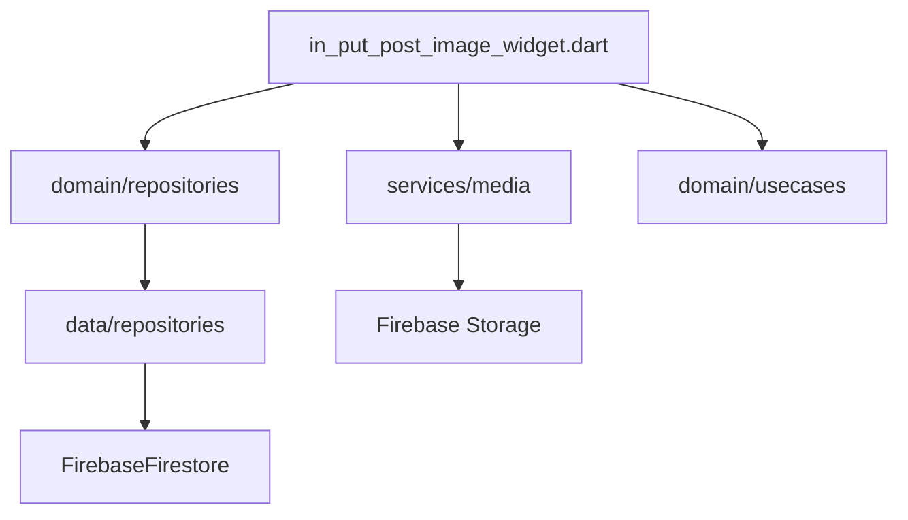

# Creation Feature - Clean Architecture Migration Guide

> **Version**: 1.0.0
> **Created**: 2025-09-26
> **Status**: Planning Phase
> **Risk Level**: High - Critical User Flow

## 📌 Executive Summary

The Creation feature handles the core user content creation flow - creating "versus" style posts with media (images/videos), text content, and voting functionality. This migration guide provides a comprehensive, safety-first approach to transforming the existing codebase to Clean Architecture while maintaining 100% functionality and Firebase field compatibility.

### Key Principles
- **Zero Downtime**: All migrations must maintain app functionality
- **Firebase 1:1 Mapping**: No changes to Firestore field names or structures
- **Import Preservation**: Document all import chains before modification
- **Consent-Based Operations**: Explicit approval before file operations
- **Incremental Migration**: Small, verifiable steps with rollback capability

### Current Architecture Analysis
- **Total Files**: 85+ Dart files
- **Lines of Code**: ~15,000 lines
- **UI Components**: 51 presentation files
- **Firebase Dependencies**: Direct Firestore/Storage usage throughout
- **State Management**: Mixed (Provider + local state)
- **Critical User Path**: Post creation → Image selection → Moderation → Publishing

---

## 🔍 Current State Analysis

### Directory Structure
```
lib/features/creation/
├── data/                          # Data Layer (Partially Clean)
│   ├── adapters/                  # Business logic adapters
│   │   ├── media/                # Image/video processing
│   │   └── posts_model_adapter.dart
│   ├── constants/                 # String constants
│   ├── helpers/                   # Debug utilities
│   ├── mappers/                   # Model transformations
│   ├── models/                    # Data models
│   │   ├── media/                # Media-specific models
│   │   └── backend_post_models.dart
│   ├── repositories/              # Repository implementations
│   ├── services/                  # Business services
│   └── utils/                     # Firestore utilities
├── domain/                        # Domain Layer (Clean)
│   ├── constants/                 # Domain constants
│   ├── core/                      # Core domain types
│   ├── entities/                  # Domain entities
│   ├── failures/                  # Error types
│   ├── models/                    # Domain models
│   ├── repositories/              # Repository interfaces
│   ├── services/                  # Domain services
│   └── usecases/                  # Business use cases
├── presentation/                  # Presentation Layer (Needs Work)
│   ├── screens/                   # UI screens
│   │   ├── create_post/          # Main creation flow
│   │   ├── editor/               # Image editor
│   │   ├── thumbnail/            # Thumbnail selection
│   │   └── viewer/               # Image viewer
│   ├── utils/                     # UI utilities
│   └── widgets/                   # Reusable widgets
└── Export files (creation.dart, posts.dart)
```

### Critical Dependencies Map

#### Firebase Direct Dependencies
```dart
// Files with direct Firebase usage:
1. data/repositories/post_repository_impl.dart
   - FirebaseFirestore.instance
   - CollectionReference
   - DocumentReference

2. data/utils/firestore_util.dart
   - Timestamp conversions
   - GeoPoint handling

3. presentation/screens/create_post/in_put_post_image_widget.dart
   - Indirect via services
```

#### Import Chain Analysis


### Type Compatibility Matrix

| Current Type | Domain Type | Firebase Field | Compatibility |
|-------------|------------|----------------|---------------|
| PostsModel | Post | posts collection | ✅ Compatible via adapter |
| MediaContent | MediaContent | optionA/optionB | ✅ Direct mapping |
| CreatorInfo | CreatorInfo | creatorInfo | ✅ Direct mapping |
| VoteData | VoteData | Embedded fields | ✅ Spread operator |
| PostStats | PostStats | Embedded fields | ✅ Spread operator |
| Timestamp | DateTime | createdAt/updatedAt | ⚠️ Needs conversion |
| GeoPoint | LatLng | location | ⚠️ Needs conversion |

---

## 🎯 Migration Phases

### Phase 1: Preparation & Analysis (Day 1)
**Goal**: Complete dependency analysis and create safety net

#### Consent Checkpoint 1.1
```yaml
action: "Analyze all import dependencies"
files_to_read: 85
impact: "Read-only analysis"
consent_required: false
```

**Tasks**:
1. Generate complete import dependency graph
2. Identify circular dependencies
3. Document all Firebase field mappings
4. Create test data fixtures
5. Setup migration logging

**Verification**:
- [ ] Dependency graph generated
- [ ] No circular dependencies found
- [ ] All Firebase fields documented
- [ ] Test fixtures created

### Phase 2: Domain Layer Stabilization (Day 2)
**Goal**: Ensure domain layer is fully independent

#### Consent Checkpoint 2.1
```yaml
action: "Remove Firebase dependencies from domain"
files_to_modify:
  - domain/models/post.dart
  - domain/models/media_content.dart
impact: "Domain layer isolation"
consent_required: true
rollback: "Git revert to previous commit"
```

**Migration Steps**:
```dart
// BEFORE: domain/models/post.dart
import 'package:cloud_firestore/cloud_firestore.dart';
createdAt: (json['createdAt'] as Timestamp?)?.toDate()

// AFTER: domain/models/post.dart
// Remove Firebase imports
createdAt: _parseDateTime(json['createdAt'])

// Add helper method
static DateTime _parseDateTime(dynamic value) {
  if (value == null) return DateTime.now();
  if (value is DateTime) return value;
  if (value is Timestamp) return value.toDate();
  if (value is int) return DateTime.fromMillisecondsSinceEpoch(value);
  if (value is String) return DateTime.parse(value);
  return DateTime.now();
}
```

**Verification**:
- [ ] No Firebase imports in domain/
- [ ] All models have fromJson/toJson methods
- [ ] Unit tests pass for model conversions

### Phase 3: Data Layer DTOs (Day 3)
**Goal**: Create Firebase-specific DTOs with 1:1 field mapping

#### Consent Checkpoint 3.1
```yaml
action: "Create Firebase DTOs"
files_to_create:
  - data/dto/post_dto.dart
  - data/dto/media_content_dto.dart
  - data/dto/creator_info_dto.dart
impact: "New files, no breaking changes"
consent_required: true
```

**DTO Structure Example**:
```dart
// data/dto/post_dto.dart
class PostDTO {
  // EXACT Firebase field names - no changes!
  final String userid;
  final String questionTitle;
  final String description;
  final Map<String, dynamic> optionA;
  final Map<String, dynamic> optionB;
  final Timestamp createdAt;
  final GeoPoint? location;

  // Conversion methods
  static PostDTO fromDomain(Post post) {
    return PostDTO(
      userid: post.creatorInfo.userid,
      questionTitle: post.questionTitle,
      // ... exact field mapping
    );
  }

  Post toDomain() {
    return Post(
      creatorInfo: CreatorInfo(userid: userid),
      questionTitle: questionTitle,
      // ... conversion to domain
    );
  }

  Map<String, dynamic> toFirestore() {
    return {
      'userid': userid,
      'questionTitle': questionTitle,
      // ... exact Firebase fields
    };
  }
}
```

**Verification**:
- [ ] DTOs match Firebase fields exactly
- [ ] Bidirectional conversion works
- [ ] Integration tests pass

### Phase 4: Repository Pattern Implementation (Day 4)
**Goal**: Implement repository pattern with DTOs

#### Consent Checkpoint 4.1
```yaml
action: "Refactor repository implementation"
files_to_modify:
  - data/repositories/post_repository_impl.dart
impact: "Internal refactoring, no API changes"
consent_required: true
rollback: "Feature flag to use old implementation"
```

**Repository Refactoring**:
```dart
// data/repositories/post_repository_impl.dart
class PostRepositoryImpl implements IPostRepository {
  @override
  Future<String> createPost(Post post) async {
    try {
      // Convert domain to DTO
      final dto = PostDTO.fromDomain(post);

      // Save to Firebase with exact field names
      final docRef = await _firestore
          .collection('posts')
          .add(dto.toFirestore());

      return docRef.id;
    } catch (e) {
      _logMigrationError('createPost', e);
      throw PostFailure.serverError();
    }
  }
}
```

**Verification**:
- [ ] All CRUD operations work
- [ ] Firebase fields unchanged
- [ ] Error handling preserved

### Phase 5: Presentation Layer Isolation (Day 5-6)
**Goal**: Remove direct Firebase usage from UI

#### Consent Checkpoint 5.1
```yaml
action: "Refactor UI components"
files_to_modify:
  - presentation/screens/create_post/in_put_post_image_widget.dart
  - 50+ other presentation files
impact: "UI refactoring, high risk"
consent_required: true
rollback: "Feature branch merge strategy"
```

**UI Refactoring Pattern**:
```dart
// BEFORE
final user = await FirebaseFirestore.instance
    .collection('users')
    .doc(userId)
    .get();

// AFTER
final userRepository = GetIt.I<IUserRepository>();
final user = await userRepository.getUser(userId);
```

**Migration Steps**:
1. Create ViewModels/Controllers for each screen
2. Move business logic to use cases
3. Replace direct Firebase calls with repository calls
4. Update state management

**Verification**:
- [ ] No Firebase imports in presentation/
- [ ] All screens use repositories
- [ ] UI functionality unchanged

### Phase 6: Service Layer Extraction (Day 7)
**Goal**: Extract reusable services

#### Consent Checkpoint 6.1
```yaml
action: "Extract services to global layer"
files_to_move:
  - data/services/media_upload_service.dart -> /services/media/
  - data/services/moderation_service.dart -> /services/moderation/
impact: "File relocation, import updates"
consent_required: true
```

**Service Extraction**:
```bash
# Move services
mv lib/features/creation/data/services/media_upload_service.dart \
   lib/services/media/media_upload_service.dart

# Update imports (example)
find lib -name "*.dart" -exec sed -i '' \
  's|/features/creation/data/services/|/services/|g' {} \;
```

**Verification**:
- [ ] Services accessible globally
- [ ] No circular dependencies
- [ ] All imports updated

---

## 🔄 Import Dependency Management

### Critical Import Chains
```yaml
high_risk_chains:
  - path: "UI -> Repository -> Firebase"
    files: 51
    mitigation: "Introduce repository interfaces"

  - path: "UI -> AppState -> Firebase"
    files: 23
    mitigation: "State management refactoring"

  - path: "Services -> Firebase Storage"
    files: 15
    mitigation: "Storage abstraction layer"
```

### Import Update Strategy
```dart
// Step 1: Create migration helper
class ImportMigrator {
  static void updateImports(String filePath) {
    // Read file
    final content = File(filePath).readAsStringSync();

    // Apply replacements
    final updated = content
      .replaceAll(
        '/features/creation/data/services/',
        '/services/'
      )
      .replaceAll(
        'package:cloud_firestore/cloud_firestore.dart',
        '/core/firebase/firestore_exports.dart'
      );

    // Write back
    File(filePath).writeAsStringSync(updated);
  }
}
```

---

## ✅ Verification Procedures

### Pre-Migration Checklist
- [ ] Full backup created
- [ ] All tests passing
- [ ] Feature flags configured
- [ ] Rollback plan documented
- [ ] Team notified

### Post-Phase Verification
```dart
// Automated verification script
class MigrationVerifier {
  static Future<bool> verifyPhase(int phase) async {
    switch (phase) {
      case 1:
        return _verifyNoDomainFirebaseImports();
      case 2:
        return _verifyDTOMapping();
      case 3:
        return _verifyRepositoryPattern();
      case 4:
        return _verifyUIIsolation();
      default:
        return false;
    }
  }

  static Future<bool> _verifyNoDomainFirebaseImports() async {
    final domainFiles = Directory('lib/features/creation/domain')
        .listSync(recursive: true)
        .whereType<File>()
        .where((f) => f.path.endsWith('.dart'));

    for (final file in domainFiles) {
      final content = await file.readAsString();
      if (content.contains('firebase')) {
        print('Firebase import found in: ${file.path}');
        return false;
      }
    }
    return true;
  }
}
```

### Integration Testing
```dart
// Test Firebase field compatibility
test('Firebase fields remain unchanged', () async {
  final post = Post(/* ... */);
  final dto = PostDTO.fromDomain(post);
  final firestoreData = dto.toFirestore();

  // Verify exact field names
  expect(firestoreData.containsKey('userid'), true);
  expect(firestoreData.containsKey('questionTitle'), true);
  expect(firestoreData.containsKey('optionA'), true);
  // ... all fields
});
```

---

## 🔙 Rollback Strategies

### Phase-Level Rollback
```bash
# Git-based rollback
git tag before-migration-phase-X
git revert --no-commit HEAD~N..HEAD
git commit -m "Rollback Phase X migration"
```

### Feature Flag Rollback
```dart
class FeatureFlags {
  static bool useNewRepository = false;
  static bool useCleanArchitecture = false;
}

// In repository
if (FeatureFlags.useNewRepository) {
  return _newImplementation();
} else {
  return _legacyImplementation();
}
```

### Database Rollback
```yaml
rollback_procedures:
  - step: "Identify affected documents"
    query: "posts where updatedAt > migrationStartTime"

  - step: "Restore from backup"
    command: "firebase firestore:import backup-DATE"

  - step: "Verify data integrity"
    script: "scripts/verify_rollback.dart"
```

---

## ⚠️ Risk Mitigation

### High-Risk Areas
1. **Media Upload Flow**: Critical user path
   - Mitigation: Extensive testing, gradual rollout

2. **Post Creation**: Data loss potential
   - Mitigation: Transaction logging, double-write period

3. **Image Moderation**: AI integration points
   - Mitigation: Fallback to manual moderation

### Monitoring Strategy
```yaml
monitoring:
  - metric: "Post creation success rate"
    threshold: "< 95%"
    action: "Immediate rollback"

  - metric: "Media upload failures"
    threshold: "> 5%"
    action: "Investigation required"

  - metric: "Firebase read/write costs"
    threshold: "> 120% baseline"
    action: "Review query patterns"
```

---

## 📊 Migration Metrics

### Success Criteria
- [ ] Zero user-facing errors during migration
- [ ] Firebase costs remain within 10% of baseline
- [ ] No performance degradation (< 100ms increase)
- [ ] 100% feature parity maintained
- [ ] Code coverage > 80%

### Progress Tracking
```yaml
phase_1:
  start_date: TBD
  completion: 0%
  blockers: []

phase_2:
  start_date: TBD
  completion: 0%
  blockers: []

# ... continue for all phases
```

---

## 🤝 Consent Checkpoints Summary

| Phase | Action | Files Affected | Risk | Consent Required |
|-------|--------|---------------|------|------------------|
| 1 | Analysis | 85 (read) | None | No |
| 2 | Domain isolation | 15 | Low | Yes |
| 3 | DTO creation | 5 (new) | Low | Yes |
| 4 | Repository refactor | 3 | Medium | Yes |
| 5 | UI refactor | 51 | High | Yes |
| 6 | Service extraction | 10 | Medium | Yes |

---

## 📚 Appendices

### A. Firebase Field Mapping Reference
[Detailed field-by-field mapping between domain models and Firestore]

### B. Import Migration Script
[Automated script for updating import statements]

### C. Test Data Fixtures
[Sample data for testing migration]

### D. Emergency Contacts
- Lead Developer: @dev-lead
- Firebase Admin: @firebase-admin
- On-call: @on-call-team

---

## 📝 Migration Log

| Date | Phase | Status | Notes |
|------|-------|--------|-------|
| 2025-09-26 | Planning | Complete | Guide created |
| TBD | Phase 1 | Pending | Awaiting approval |

---

**Document Version**: 1.0.0
**Last Updated**: 2025-09-26
**Next Review**: Before Phase 1 execution
**Approval Required From**: Tech Lead, Product Owner