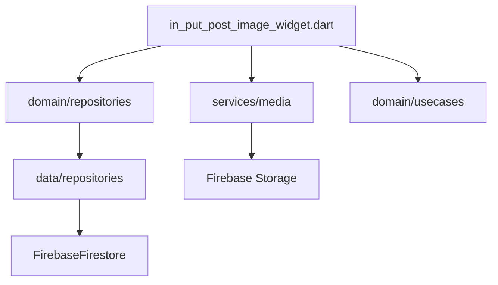
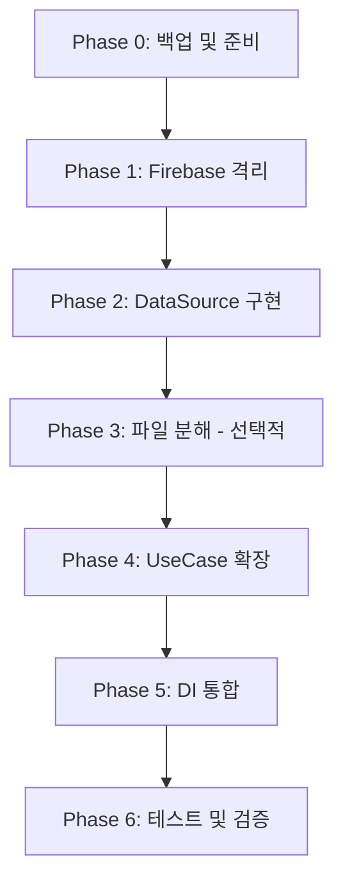

# Creation Feature - Clean Architecture Migration Guide

> **Version**: 4.0
> **Created**: 2025-09-26
> **Updated**: 2025-01-28
> **Status**: 실제 구현 70% 완료, 핵심 위반사항 수정 필요
> **Risk Level**: High → Medium (아키텍처 위반 수정 시)
> **Strategy**: 우선순위 기반 수정 + 기존 구현 최대 활용

## 📌 Executive Summary

Creation feature의 Clean Architecture 마이그레이션을 위한 실무 가이드입니다. 실제 코드베이스 분석을 통해 파악된 현황을 바탕으로, **아키텍처 위반 수정을 최우선**으로 하여 체계적인 마이그레이션을 진행합니다.

### 🎯 핵심 전략
1. **Firebase 격리 최우선** - Domain layer 순수성 확보
2. **기존 구현 70% 활용** - 재작업 최소화
3. **책임 기반 분해** - ARCHITECTURE_RULES v5.1 준수
4. **점진적 개선** - 단계별 검증과 롤백 가능

## 🚨 Current State Analysis (2025-01-28 실제 분석)

### 📊 실제 구현 현황 매트릭스

| 영역 | 문서 기록 | 실제 상태 | 차이점 | 조치 필요 |
|------|----------|----------|--------|-----------|
| **UseCase** | 2개 | **5개 구현** ✅ | +3개 | 문서 업데이트 |
| **Repository** | 미구현 | **완전 구현** ✅ | 100% 완료 | Firebase 제거만 |
| **DI Module** | 미구현 | **GetIt 구현** ✅ | 100% 완료 | UseCase 추가 |
| **DataSource** | 언급 없음 | **미구현** ❌ | 0% | 신규 구현 필요 |
| **Post Feature** | 계획 | **이미 분리** ✅ | 디렉토리 존재 | 경계 명확화 |
| **Provider** | 언급 없음 | **9개 구현** ✅ | 완료 | 정리만 필요 |
| **300줄 초과** | 21개 | **17개** ⚠️ | -4개 | 선택적 분해 |
| **@Deprecated** | 언급 없음 | **6개 파일** ⚠️ | 방치 | 제거 계획 |

### 🔴 Critical: Clean Architecture 위반

#### 1. Domain Layer Firebase 의존성
```dart
// ❌ domain/repositories/i_post_creation_repository.dart
import 'package:cloud_firestore/cloud_firestore.dart';  // Domain에 Firebase!

// ❌ domain/usecases/create_post_usecase.dart:141-142
final docRef = FirebaseFirestore.instance.collection('posts').doc();
await docRef.set(postMap);  // UseCase가 Firebase 직접 호출!
```

#### 2. Service Layer 위치 문제
```dart
// ❌ UseCase가 Service 직접 의존
class CreatePostUseCase {
  final TargetAudienceService _targetAudienceService;  // Repository 거쳐야 함
  final ImageUploadService _imageUploadService;        // Repository 거쳐야 함
}
```

#### 3. DataSource Layer 부재
- `/data/datasources/` 디렉토리는 있으나 README.md만 존재
- Firebase 격리층이 없어 Domain이 오염됨

### ✅ 기존 구현 활용 가능 자산 (70%)
- **DI Container**: provider_config.dart 완전 구성
- **Repository 인터페이스**: IPostCreationRepository, IMediaRepository
- **5개 UseCase**: 로직 재사용 가능
- **9개 Provider**: 상태 관리 완성
- **Post Feature**: 이미 `/lib/features/post/` 존재

---

## 🔥 Firebase 1:1 Mapping 규칙 (절대 준수)

### 핵심 원칙
- **Zero Downtime**: 모든 마이그레이션 중 앱 기능 100% 유지
- **Firebase 1:1 Mapping**: Firestore 필드명/구조 절대 변경 금지
- **Import Preservation**: 수정 전 모든 import chain 문서화
- **Incremental Migration**: 검증 가능한 작은 단계로 진행
- **Rollback Ready**: 모든 단계에서 롤백 가능

### 필드 매핑 규칙
```yaml
Field Name Rules:
  ✅ DO:
    - Firestore field: "questionTitle"
    - DTO field: "questionTitle" (EXACT MATCH)
    - Domain model: "title" (자유롭게 변경 가능)

  ❌ DON'T:
    - Firestore field: "questionTitle"
    - DTO field: "question_title" (절대 금지!)
    - Domain model: "questionTitle" (혼란 유발)

Mapping Location:
  - DTO Layer ONLY: 모든 필드명 변환은 DTO에서만
  - Repository: DTO ↔ Domain 변환만 처리
  - DataSource: Firebase 필드 그대로 사용
```

### 구체적 매핑 예시
```dart
// ✅ 올바른 예시 - Firestore 필드명 유지
class PostDTO {
  // Firestore 필드명 그대로!
  final String questionTitle;
  final String userid;
  final Map<String, dynamic> optionA;
  final Timestamp createdAt;

  // Domain 변환 시에만 이름 변경
  Post toDomain() {
    return Post(
      title: questionTitle,  // 여기서만 이름 변경
      userId: userid,        // 여기서만 camelCase로
      optionA: MediaContent.fromMap(optionA),
      createdAt: createdAt.toDate(),
    );
  }

  // Firestore 저장 시 정확한 필드명
  Map<String, dynamic> toFirestore() {
    return {
      'questionTitle': questionTitle,  // 정확히 일치!
      'userid': userid,                // 정확히 일치!
      'optionA': optionA,
      'createdAt': createdAt,
    };
  }
}
```

### Current Architecture Analysis
- **Total Files**: 85+ Dart files
- **Lines of Code**: ~15,000 lines
- **UI Components**: 51 presentation files
- **Firebase Dependencies**: Direct Firestore/Storage usage throughout
- **State Management**: Mixed (Provider + local state)
- **Critical User Path**: Post creation → Image selection → Moderation → Publishing

---

## 🔍 Current State Analysis (실제 구현 기반)

### 📊 구현 완료도 매트릭스
| Layer | 목표 | 현재 구현 | 완료도 | 필요 작업 |
|-------|------|---------|--------|----------|
| **Domain** | 10 UseCase | 5 UseCase | **50%** ✅ | 5개 추가 |
| **Domain** | Repository Interface | 2개 완료 | **100%** ✅ | 유지 |
| **Data** | Repository Impl | 2개 완료 | **100%** ✅ | Service 통합 필요 |
| **Data** | DataSource Layer | 0개 | **0%** ❌ | 신규 구현 |
| **Data** | DTO Layer | 부분적 | **40%** ⚠️ | Firebase 1:1 매핑 |
| **Presentation** | Provider | 9개 구현 | **90%** ✅ | 정리 필요 |
| **Infrastructure** | DI Module | provider_config.dart | **80%** ✅ | UseCase 추가 등록 |
| **Contract** | PostContract | 구현됨 | **100%** ✅ | 유지 |

### ✅ 기존 구현 활용 가능 자산 (70%)
```yaml
재사용 가능:
  DI Container:
    - provider_config.dart (GetIt 완전 구성)
    - Lazy Singleton 패턴 적용
    - Repository/Service/UseCase 등록 구조

  Repository Layer:
    - IPostRepository 인터페이스
    - IMediaRepository 인터페이스
    - PostRepositoryImpl (824줄 - 분해 필요)
    - MediaRepositoryImpl

  UseCase Layer:
    - CreatePostUseCase (Firebase 호출만 제거)
    - ModerateContentUseCase (그대로 사용)
    - ValidatePostUseCase (그대로 사용)
    - AspectRatioAnalyzer (그대로 사용)
    - RatioCalculator (그대로 사용)

  Provider Layer:
    - 9개 Provider 모두 활용 가능
    - create_post_provider.dart
    - create_post_provider_v2.dart
    - media_provider.dart
    - target_audience_provider.dart

  Contract Pattern:
    - PostContract 이미 구현
    - app/contracts/post_contract.dart
```

### ⚠️ 수정 필요 부분 (20%)
```yaml
Architecture 위반:
  - CreatePostUseCase line 141-142 (Firebase 직접 호출)
  - Service를 UseCase에서 직접 의존
  - 21개 파일 300줄 초과

기술 부채:
  - @Deprecated 파일 6개
  - 중복 Provider (v1, v2)
  - Service Layer 위치 문제
```

### ❌ 신규 구현 필요 (10%)
```yaml
DataSource Layer:
  - FirebasePostDataSource
  - FirebaseMediaDataSource

추가 UseCase:
  - UploadMediaUseCase
  - ProcessImageUseCase
  - SetTargetAudienceUseCase
  - CheckDuplicateContentUseCase
  - VerifyUserPermissionUseCase

Contract 확장:
  - CreationPostContract (Creation → Post 통신)
```

### Critical Dependencies Map

#### Firebase Direct Dependencies
```dart
// Files with direct Firebase usage:
1. data/repositories/post_repository_impl.dart
   - FirebaseFirestore.instance
   - CollectionReference
   - DocumentReference

2. data/utils/firestore_util.dart
   - Timestamp conversions
   - GeoPoint handling

3. presentation/screens/create_post/in_put_post_image_widget.dart
   - Indirect via services
```

#### Import Chain Analysis


### Type Compatibility Matrix

| Current Type | Domain Type | Firebase Field | Compatibility |
|-------------|------------|----------------|---------------|
| PostsModel | Post | posts collection | ✅ Compatible via adapter |
| MediaContent | MediaContent | optionA/optionB | ✅ Direct mapping |
| CreatorInfo | CreatorInfo | creatorInfo | ✅ Direct mapping |
| VoteData | VoteData | Embedded fields | ✅ Spread operator |
| PostStats | PostStats | Embedded fields | ✅ Spread operator |
| Timestamp | DateTime | createdAt/updatedAt | ⚠️ Needs conversion |
| GeoPoint | LatLng | location | ⚠️ Needs conversion |

---

## 📊 Phase별 상세 구현 가이드

### Phase 0: 사전 준비 및 백업 전략 (우선순위 0 - 2시간) 🔒

#### 백업 전략
```bash
# Step 1: Git 태그 기반 백업
git tag backup/pre-migration-$(date +%Y%m%d)
git push origin --tags

# Step 2: @Deprecated 파일 아카이브
mkdir -p .archive/deprecated/$(date +%Y%m%d)
find lib -name "*.dart" -exec grep -l "@Deprecated" {} \; | while read file; do
  cp "$file" ".archive/deprecated/$(date +%Y%m%d)/$(basename $file)"
done

# Step 3: 의존성 맵 생성
dart pub deps --json > .archive/dependencies-$(date +%Y%m%d).json
```

#### 🔍 중복 코드 감지 및 통합
```yaml
중복 파일 매트릭스:
  Provider 중복:
    원본: create_post_provider.dart (250줄)
    신규: create_post_provider_v2.dart (366줄)
    차이점: v2는 UseCase 패턴 적용
    통합 전략:
      1. v2의 UseCase 패턴을 v1에 역포팅
      2. v1의 레거시 메서드 deprecate 표시
      3. 점진적 마이그레이션 후 v1 제거

  Service 중복:
    원본: image_upload_orchestrator.dart (629줄) @Deprecated
    신규: image_upload_orchestrator_v2.dart (463줄)
    차이점: v2는 BuildContext 제거됨
    통합 전략:
      1. v2를 ImageUploadService로 리네임
      2. v1 사용처를 v2로 교체
      3. v1 즉시 제거 가능

  Model 중복:
    원본: posts_model.dart (699줄)
    어댑터: posts_model_adapter.dart (400줄)
    통합 전략:
      1. Domain Model과 DTO 분리
      2. Adapter 패턴을 Mapper로 전환
      3. 중복 변환 로직 제거
```

#### 📋 레거시 제거 체크리스트
```yaml
제거 전 검증:
  - [ ] 모든 import 참조 확인 (grep -r "import.*filename")
  - [ ] DI 컨테이너 등록 확인
  - [ ] 테스트 코드 의존성 확인
  - [ ] Feature flag로 임시 비활성화
  - [ ] 7일간 모니터링 후 완전 제거

안전한 제거 프로세스:
  1. @Deprecated 어노테이션 추가 + 대체 경로 문서화
  2. 사용처에 // TODO: Migrate to NewClass 주석 추가
  3. 1주일 deprecation 기간
  4. Feature flag로 비활성화
  5. 모니터링 (에러 없음 확인)
  6. Git에서 제거 + archive 폴더 보관
```

### Phase 1: Firebase 격리 및 아키텍처 위반 수정 🔥 최우선 (Day 1 - 4시간)

#### 1.1 Domain Layer Firebase 의존성 제거

**현재 문제점**:
```dart
// ❌ 현재 상태: Domain이 Firebase에 의존
// i_post_creation_repository.dart
import 'package:cloud_firestore/cloud_firestore.dart';

abstract class IPostCreationRepository {
  Future<DocumentReference> createPost(PostsModel post);  // Firebase 타입 반환!
}
```

**수정 방향**:
```dart
// ✅ 수정 후: Domain은 순수하게 유지
abstract class IPostCreationRepository {
  Future<String> createPost(PostsModel post);  // ID만 반환
  Future<PostResult> createPostWithResult(PostsModel post);  // 또는 Domain 모델 반환
}

// Domain 모델 (Firebase 의존성 없음)
class PostResult {
  final String id;
  final DateTime createdAt;
  final PostStatus status;
  // ...
}
```

#### 1.2 UseCase Firebase 직접 호출 제거

**현재 문제점**:
```dart
// ❌ 현재 상태: UseCase가 Firebase 직접 호출
// create_post_usecase.dart (lines 141-142)
final docRef = FirebaseFirestore.instance.collection('posts').doc();
await docRef.set(postMap);
```

**수정 방향**:
```dart
// ✅ 수정 후: Repository를 통한 간접 호출
class CreatePostUseCase {
  final IPostCreationRepository repository;

  Future<PostResult> execute(CreatePostParams params) async {
    // 1. Domain 모델 생성
    final post = PostsModel(
      title: params.title,
      description: params.description,
      // ... 기타 필드
    );

    // 2. Repository를 통해 저장 (Firebase 격리)
    return await repository.createPostWithResult(post);
  }
}
```

#### 1.3 Service Layer 재구성
```dart
// 현재 문제: UseCase가 Service 직접 의존
class CreatePostUseCase {
  final TargetAudienceService _targetAudienceService; // ❌
  final ImageUploadService _imageUploadService;       // ❌
}

// 수정 후: Repository 내부로 Service 이동
class PostRepositoryImpl implements IPostRepository {
  // Services는 Repository 내부에서만 사용
  final TargetAudienceService _targetAudienceService;
  final ImageUploadService _imageUploadService;

  Future<String> createPost(Post post) async {
    // Service 로직은 Repository에서 처리
    final validAudience = await _targetAudienceService.validate(...);
    final uploadedImages = await _imageUploadService.upload(...);
    // Firebase 저장
    final docRef = await _firestore.collection('posts').add(...);
    return docRef.id;
  }
}
```

### Phase 2: DataSource Layer 구현 (필수) (Day 2 - 6시간)

#### 2.1 DataSource 인터페이스 정의

```dart
// data/datasources/i_post_datasource.dart
abstract class IPostDataSource {
  Future<Map<String, dynamic>> createPost(Map<String, dynamic> data);
  Future<Map<String, dynamic>> getPost(String postId);
  Future<void> updatePost(String postId, Map<String, dynamic> data);
  Future<void> deletePost(String postId);
}

// data/datasources/i_media_datasource.dart
abstract class IMediaDataSource {
  Future<String> uploadImage(String path, Uint8List bytes);
  Future<void> deleteImage(String url);
  Future<List<String>> uploadMultipleImages(List<File> files);
}
```

#### 2.2 Firebase DataSource 구현

```dart
// data/datasources/firebase_post_datasource.dart
class FirebasePostDataSource implements IPostDataSource {
  final FirebaseFirestore _firestore;

  FirebasePostDataSource(this._firestore);

  @override
  Future<Map<String, dynamic>> createPost(Map<String, dynamic> data) async {
    // Firebase 직접 통신
    final docRef = await _firestore.collection('posts').add(data);
    return {'id': docRef.id, ...data};
  }

  @override
  Future<Map<String, dynamic>> getPost(String postId) async {
    final doc = await _firestore.collection('posts').doc(postId).get();
    if (!doc.exists) throw PostNotFoundError();
    return {'id': doc.id, ...doc.data()!};
  }
}

// data/datasources/firebase_media_datasource.dart
class FirebaseMediaDataSource implements IMediaDataSource {
  final FirebaseStorage _storage;

  @override
  Future<String> uploadImage(String path, Uint8List bytes) async {
    final ref = _storage.ref().child(path);
    final uploadTask = await ref.putData(bytes);
    return await uploadTask.ref.getDownloadURL();
  }
}
```

#### 2.3 Repository에서 DataSource 사용

```dart
// data/repositories/post_creation_repository_impl.dart
class PostCreationRepositoryImpl implements IPostCreationRepository {
  final IPostDataSource _dataSource;  // Firebase 격리
  final IMediaDataSource _mediaDataSource;

  PostCreationRepositoryImpl({
    required IPostDataSource dataSource,
    required IMediaDataSource mediaDataSource,
  })  : _dataSource = dataSource,
        _mediaDataSource = mediaDataSource;

  @override
  Future<String> createPost(PostsModel post) async {
    try {
      // 1. Domain → DTO 변환
      final postDto = PostDTO.fromDomain(post);

      // 2. DataSource를 통해 저장 (Firebase 격리됨)
      final result = await _dataSource.createPost(postDto.toMap());

      // 3. ID 반환
      return result['id'];
    } catch (e) {
      throw PostCreationFailure(e.toString());
    }
  }
}
```

### Phase 3: 책임 기반 파일 분해 (선택적) (Day 3-4 - 8시간)

#### 🎯 분해 원칙: Single Responsibility & Domain Boundaries

`★ Insight ─────────────────────────────────────`
ARCHITECTURE_RULES v5.1에 따라 줄 수는 참고 지표일 뿐입니다.
실제 분해는 책임(Responsibility), 응집도(Cohesion), 그리고
완전한 플로우(Complete Flow) 유지를 기준으로 합니다.
400-500줄이어도 응집도가 높으면 분리하지 않습니다.
`─────────────────────────────────────────────────`

#### 📊 책임 기반 분해 매트릭스

| 파일명 | 현재 책임 수 | 목표 책임 분리 | 분해 기준 | 예상 구조 |
|--------|------------|--------------|----------|----------|
| **in_put_post_image_widget.dart** | 8개 독립 책임 | 8개 모듈 | 사용자 플로우별 | 플로우당 1모듈 |
| **post_repository_impl.dart** | 6개 Aggregate | 6개 Repository | Bounded Context | Domain별 분리 |
| **media_provider.dart** | 4개 상태 영역 | 4개 Provider | 상태 관리 영역 | 영역별 Provider |
| **posts_model.dart** | 5개 도메인 개념 | 5개 Model | Value Object별 | 도메인 모델별 |

#### 🔄 사용자 플로우 기반 분해 (UI Layer)

##### 1. in_put_post_image_widget.dart → 8개 플로우 모듈
```yaml
현재 혼재된 책임들:
  1. 이미지 선택 플로우 (Pick)
  2. 이미지 편집 플로우 (Edit)
  3. 이미지 검증 플로우 (Validate)
  4. 업로드 플로우 (Upload)
  5. 레이아웃 계산 (Layout)
  6. 네비게이션 제어 (Navigation)
  7. 에러 처리 (Error)
  8. 상태 동기화 (State)

플로우별 분해:
  # Step 1: 이미지 선택 플로우
  image_selection_flow.dart:
    책임: "이미지 선택 전체 플로우 관리"
    포함 내용:
      - AssetPicker 초기화
      - 선택 상태 관리
      - 썸네일 미리보기
    (완전한 선택 플로우를 위해 필요한 모든 코드 포함)

  # Step 2: 이미지 편집 플로우
  image_editing_flow.dart:
    책임: "이미지 편집 전체 프로세스"
    포함 내용:
      - ProImageEditor 연동
      - 편집 이력 추적
      - 원본 보존

  # Step 3: 검증 플로우
  image_validation_flow.dart:
    책임: "컨텐츠 검증 및 모더레이션"
    포함 내용:
      - AI 모더레이션 호출
      - 검증 결과 표시
      - 재시도 로직

  # Step 4: 업로드 플로우
  image_upload_flow.dart:
    책임: "미디어 업로드 전체 관리"
    포함 내용:
      - Firebase Storage 업로드
      - 진행률 표시
      - 재시도 메커니즘

  # Step 5: 레이아웃 계산
  layout_calculation_flow.dart:
    책임: "동적 레이아웃 결정"
    포함 내용:
      - AspectRatio 분석
      - 박스 크기 계산
      - 반응형 레이아웃

  # Step 6: UI 컴포넌트
  components/:
    책임: "재사용 가능한 UI 요소"
    - media_box_widget.dart (박스 표시 책임)
    - action_buttons.dart (액션 버튼 책임)
    - warning_messages.dart (경고 메시지 책임)

  # Step 7: 코디네이터
  post_creation_coordinator.dart:
    책임: "전체 생성 플로우 오케스트레이션"
    포함 내용:
      - 전체 플로우 오케스트레이션
      - 단계별 전환 관리

  # Step 8: 상태 관리
  post_creation_state.dart:
    책임: "생성 프로세스 상태 관리"
    포함 내용:
      - 로컬 상태
      - AppState 동기화
```

#### 🏛️ Domain Aggregate 기반 분해 (Repository Layer)

##### 2. post_repository_impl.dart → 6개 Bounded Context
```yaml
현재 혼재된 Aggregate Root:
  1. Post Aggregate (게시물 생성/수정)
  2. Vote Aggregate (투표 관리)
  3. Metrics Aggregate (통계/분석)
  4. Moderation Aggregate (검열/신고)
  5. Visibility Aggregate (공개/비공개)
  6. Query Aggregate (검색/필터)

Bounded Context별 분해:
  # Post Aggregate
  post_command_repository.dart:
    단일 책임: "Post 생성/수정/삭제 명령 처리"
    메서드:
      - createPost(Post): PostId
      - updatePost(PostId, Post): void
      - deletePost(PostId): void
    이벤트: PostCreated, PostUpdated, PostDeleted
    응집도: 모든 Post 명령이 트랜잭션 경계 내에서 실행

  # Vote Aggregate
  vote_repository.dart:
    단일 책임: "투표 트랜잭션 관리"
    메서드:
      - submitVote(PostId, UserId, Option): void
      - getVoteStatus(PostId, UserId): VoteStatus
      - calculateResults(PostId): VoteResult
    불변식: 한 사용자는 한 번만 투표
    응집도: 투표 관련 모든 로직이 하나의 트랜잭션으로 처리

  # Metrics Aggregate
  metrics_repository.dart:
    단일 책임: "읽기 전용 통계 관리"
    메서드:
      - incrementViewCount(PostId): void
      - getEngagementMetrics(PostId): Metrics
      - getTrendingScore(PostId): Score
    CQRS: Command와 분리된 Query 모델
    응집도: 모든 메트릭 계산이 일관된 방식으로 처리

  # Moderation Aggregate
  moderation_repository.dart:
    단일 책임: "컨텐츠 정책 적용"
    메서드:
      - reportPost(PostId, Reason): void
      - moderateContent(PostId): ModerationResult
      - blockPost(PostId): void
    정책: AI + Manual 검열 규칙
    응집도: 모든 검열 로직이 하나의 정책 하에 통합

  # Visibility Aggregate
  visibility_repository.dart:
    단일 책임: "접근 제어 관리"
    메서드:
      - setVisibility(PostId, Level): void
      - canUserView(PostId, UserId): bool
      - getTargetAudience(PostId): Audience
    규칙: 타겟 오디언스 매칭
    응집도: 모든 가시성 규칙이 일관되게 적용

  # Query Service
  post_query_service.dart:
    단일 책임: "복잡한 조회 처리"
    메서드:
      - searchPosts(Criteria): List<Post>
      - getPostsByUser(UserId): List<Post>
      - getTrendingPosts(): List<Post>
    최적화: 인덱싱, 캐싱 전략
    응집도: 모든 조회 로직이 성능 최적화와 함께 관리
```

#### 🎭 상태 관리 영역별 분해 (Provider Layer)

##### 3. media_provider.dart → 4개 상태 영역
```yaml
현재 혼재된 상태 관리:
  1. Selection State (선택 상태)
  2. Upload State (업로드 진행)
  3. Validation State (검증 상태)
  4. UI State (표시 상태)

영역별 분해:
  # Selection State Provider
  media_selection_provider.dart:
    상태:
      - selectedImages: List<AssetEntity>
      - currentIndex: int
      - selectionMode: single/multiple
    액션:
      - selectImage()
      - deselectImage()
      - reorderImages()

  # Upload State Provider
  media_upload_provider.dart:
    단일 책임: "업로드 상태 및 진행률 관리"
    상태:
      - uploadProgress: Map<String, double>
      - uploadErrors: Map<String, Error>
      - completedUploads: List<String>
    액션:
      - startUpload()
      - retryUpload()
      - cancelUpload()

  # Validation State Provider
  media_validation_provider.dart:
    단일 책임: "검증 상태 관리"
    상태:
      - validationResults: Map<String, Result>
      - pendingValidations: Queue
      - rejectedReasons: Map<String, Reason>
    액션:
      - validateImage()
      - clearValidation()

  # Coordinator Provider
  media_state_coordinator.dart:
    책임: Provider 간 동기화
    메서드:
      - synchronizeStates()
      - handleStateConflicts()
      - notifyDependents()
```

#### 🗂️ 도메인 모델별 분해 (Model Layer)

##### 4. posts_model.dart → 5개 도메인 모델
```yaml
현재 혼재된 도메인 개념:
  1. Post Entity (핵심 엔티티)
  2. Media Value Object (미디어 정보)
  3. Vote Value Object (투표 데이터)
  4. Metrics Value Object (통계)
  5. Creator Value Object (작성자)

도메인 모델별 분해:
  # Post Entity
  domain/entities/post.dart:
    단일 책임: "게시물 핵심 엔티티 관리"
    속성:
      - id: PostId
      - title: String
      - status: PostStatus
      - createdAt: DateTime
    불변식: 제목 100자 제한
    응집도: 게시물의 핵심 속성만 포함

  # Media Value Object
  domain/value_objects/media_content.dart:
    단일 책임: "미디어 컨텐츠 정보 캡슐화"
    속성:
      - imageUrls: List<String>
      - aspectRatios: List<double>
      - layoutType: LayoutType
    불변: 생성 후 수정 불가
    응집도: 미디어 관련 모든 정보 통합

  # Vote Value Object
  domain/value_objects/vote_data.dart:
    단일 책임: "투표 데이터 관리"
    속성:
      - votesA: int
      - votesB: int
      - voters: Set<UserId>
    규칙: 중복 투표 방지
    응집도: 투표 관련 모든 데이터 캡슐화

  # Metrics Value Object
  domain/value_objects/post_metrics.dart:
    단일 책임: "게시물 메트릭 계산"
    속성:
      - viewCount: int
      - likeCount: int
      - shareCount: int
    계산: Engagement Score
    응집도: 모든 메트릭이 일관된 방식으로 계산

  # Creator Value Object
  domain/value_objects/creator_info.dart:
    단일 책임: "작성자 정보 관리"
    속성:
      - userId: UserId
      - displayName: String
      - isAnonymous: bool
    정책: 익명 처리 규칙
    응집도: 작성자 관련 모든 정보 통합
```

#### 🏗️ 나머지 17개 파일 책임 기반 분해

##### 5-10. UI Component 파일들
```yaml
media_selection_flow_widget.dart → 4개 책임 분리:
  1. flow_coordinator.dart - "플로우 오케스트레이션 책임"
  2. selection_handler.dart - "선택 로직 책임"
  3. preview_manager.dart - "미리보기 관리 책임"
  4. flow_ui_components.dart - "UI 컴포넌트 책임"

media_selection_box_multi.dart → 3개 책임 분리:
  1. multi_selection_logic.dart - "다중 선택 비즈니스 로직"
  2. multi_box_renderer.dart - "렌더링 책임"
  3. multi_box_interactions.dart - "사용자 인터랙션 처리"

media_editor_widget.dart → 3개 책임 분리:
  1. editor_controller.dart - "편집 제어 책임"
  2. editor_tools.dart - "편집 도구 관리"
  3. editor_ui.dart - "편집 UI 표시"

media_selection_box_single.dart → 3개 책임 분리:
  1. single_selection_logic.dart - "단일 선택 로직"
  2. single_box_renderer.dart - "렌더링 책임"
  3. single_box_interactions.dart - "인터랙션 처리"

image_upload_orchestrator_v2.dart → 3개 책임 분리:
  1. upload_coordinator.dart - "업로드 조정"
  2. retry_manager.dart - "재시도 관리"
  3. progress_tracker.dart - "진행률 추적"
```

##### 11-15. Screen & Provider 파일들
```yaml
in_put_post_image_screen.dart → 2개 책임 분리:
  1. screen_coordinator.dart - "화면 조정 책임"
  2. screen_navigation.dart - "네비게이션 관리"

posts_model_adapter.dart → 2개 책임 분리:
  1. domain_to_dto_mapper.dart - "Domain → DTO 변환"
  2. dto_to_domain_mapper.dart - "DTO → Domain 변환"

detailed_target_selector.dart → 2개 책임 분리:
  1. target_selection_logic.dart - "타겟 선택 로직"
  2. target_ui_components.dart - "타겟 UI 표시"

image_selection_widget.dart → 2개 책임 분리:
  1. selection_state_manager.dart - "선택 상태 관리"
  2. selection_ui.dart - "선택 UI 표시"

create_post_provider_v2.dart → 2개 책임 분리:
  1. post_creation_logic.dart - "게시물 생성 비즈니스 로직"
  2. post_state_manager.dart - "생성 프로세스 상태 관리"
```

##### 16-21. Dialog & Component 파일들
```yaml
text_input_widget.dart → 2개 책임 분리:
  1. text_validation.dart - "텍스트 검증 책임"
  2. text_input_ui.dart - "입력 UI 표시"

create_post_screen.dart → 2개 책임 분리:
  1. post_form_logic.dart - "폼 처리 로직"
  2. post_form_ui.dart - "폼 UI 표시"

image_viewer_page.dart → 2개 책임 분리:
  1. viewer_controller.dart - "뷰어 제어 책임"
  2. viewer_ui.dart - "뷰어 UI 표시"

thumbnail_selection_page.dart → 2개 책임 분리:
  1. thumbnail_logic.dart - "썸네일 선택 로직"
  2. thumbnail_grid.dart - "그리드 UI 표시"

target_count_selector.dart → 2개 책임 분리:
  1. count_calculation.dart - "타겟 수 계산 로직"
  2. count_display.dart - "카운트 표시 UI"

target_audience_dialog.dart → 2개 책임 분리:
  1. audience_selection.dart - "오디언스 선택 로직"
  2. audience_dialog_ui.dart - "다이얼로그 UI 표시"
```

#### ✅ 책임 기반 분해 검증 체크리스트

```yaml
분해 원칙 준수:
  - [ ] Single Responsibility: 각 파일이 하나의 변경 이유만 가짐
  - [ ] High Cohesion: 관련된 코드가 함께 유지됨
  - [ ] Complete Flow: 완전한 비즈니스 플로우가 보존됨
  - [ ] Domain Boundaries: Bounded Context와 Aggregate 경계 준수

기술적 검증:
  - [ ] 순환 의존성 없음
  - [ ] 테스트 가능한 단위로 분리됨
  - [ ] 의존성 주입 가능
  - [ ] 인터페이스 분리 원칙 준수

성과 지표 (정성적):
  - [ ] 모든 파일이 단일 책임 원칙 준수
  - [ ] 높은 응집도와 낮은 결합도 달성
  - [ ] 비즈니스 플로우가 명확히 구분됨
  - [ ] 각 모듈이 독립적으로 이해 가능
  - [ ] 변경 시 영향 범위가 최소화됨

레이어별 유연한 가이드라인 (ARCHITECTURE_RULES v5.1 준수):
  - [ ] Domain Layer: 비즈니스 트랜잭션 단위 유지 (50-700줄 허용)
  - [ ] Data Layer: 데이터 소스 복잡도에 따라 유연하게 (200-600줄 허용)
  - [ ] Presentation Layer: Flutter UI 특성 반영 (500-1000줄 허용)
  - [ ] 핵심: 줄 수보다 책임과 응집도 우선
```

## 🧪 테스트 전략

### 단위 테스트 전략

#### Domain Layer 테스트
```dart
// test/features/creation/domain/usecases/create_post_usecase_test.dart
@GenerateMocks([IPostCreationRepository])
void main() {
  late CreatePostUseCase useCase;
  late MockIPostCreationRepository mockRepository;

  setUp(() {
    mockRepository = MockIPostCreationRepository();
    useCase = CreatePostUseCase(mockRepository);
  });

  group('CreatePostUseCase', () {
    test('should create post through repository', () async {
      // Arrange
      const expectedId = 'post_123';
      when(mockRepository.createPost(any))
          .thenAnswer((_) async => expectedId);

      // Act
      final result = await useCase.execute(
        CreatePostParams(
          title: 'Test Title',
          description: 'Test Description',
        ),
      );

      // Assert
      expect(result, equals(expectedId));
      verify(mockRepository.createPost(any)).called(1);
    });

    test('should not call Firebase directly', () async {
      // This test ensures no Firebase dependencies in UseCase
      final sourceCode = File('lib/features/creation/domain/usecases/create_post_usecase.dart')
          .readAsStringSync();

      expect(sourceCode.contains('FirebaseFirestore'), false);
      expect(sourceCode.contains('firebase'), false);
    });
  });
}
```

#### DataSource Layer 테스트
```dart
// test/features/creation/data/datasources/firebase_post_datasource_test.dart
@GenerateMocks([FirebaseFirestore, CollectionReference, DocumentReference])
void main() {
  late FirebasePostDataSource dataSource;
  late MockFirebaseFirestore mockFirestore;
  late MockCollectionReference mockCollection;
  late MockDocumentReference mockDocument;

  setUp(() {
    mockFirestore = MockFirebaseFirestore();
    mockCollection = MockCollectionReference();
    mockDocument = MockDocumentReference();
    dataSource = FirebasePostDataSource(mockFirestore);

    when(mockFirestore.collection('posts')).thenReturn(mockCollection);
    when(mockCollection.add(any)).thenAnswer((_) async => mockDocument);
    when(mockDocument.id).thenReturn('post_123');
  });

  test('should create post in Firebase', () async {
    // Arrange
    final postData = {'title': 'Test', 'description': 'Test Desc'};

    // Act
    final result = await dataSource.createPost(postData);

    // Assert
    expect(result['id'], equals('post_123'));
    verify(mockCollection.add(postData)).called(1);
  });
}
```

### 통합 테스트 전략

#### Firebase 필드 호환성 테스트
```dart
// test/integration/firebase_compatibility_test.dart
void main() {
  group('Firebase Field Compatibility', () {
    test('DTO should maintain exact Firebase field names', () {
      // Arrange
      final post = PostsModel(
        questionTitle: 'Test Question',
        userid: 'user_123',
        createdAt: DateTime.now(),
      );

      // Act
      final dto = PostDTO.fromDomain(post);
      final firestoreData = dto.toFirestore();

      // Assert - 정확한 필드명 검증
      expect(firestoreData.containsKey('questionTitle'), true);
      expect(firestoreData.containsKey('userid'), true);
      expect(firestoreData.containsKey('optionA'), true);
      expect(firestoreData.containsKey('optionB'), true);

      // 필드명이 변경되지 않았는지 검증
      expect(firestoreData.containsKey('question_title'), false);
      expect(firestoreData.containsKey('user_id'), false);
    });
  });
}
```

### E2E 테스트 시나리오

#### 게시물 생성 플로우 테스트
```dart
// test/e2e/post_creation_flow_test.dart
void main() {
  testWidgets('Complete post creation flow', (WidgetTester tester) async {
    // 1. 이미지 선택
    await tester.tap(find.byKey(Key('select_image_button')));
    await tester.pumpAndSettle();

    // 2. 텍스트 입력
    await tester.enterText(
      find.byKey(Key('title_field')),
      'Test Question',
    );

    // 3. AI 모더레이션 통과
    await tester.tap(find.byKey(Key('validate_button')));
    await tester.pumpAndSettle();

    // 4. 게시물 생성
    await tester.tap(find.byKey(Key('create_post_button')));
    await tester.pumpAndSettle();

    // 5. 성공 확인
    expect(find.text('게시물이 생성되었습니다'), findsOneWidget);
  });
}
```

### 성능 테스트

```dart
// test/performance/post_creation_performance_test.dart
void main() {
  test('Post creation should complete within 3 seconds', () async {
    final stopwatch = Stopwatch()..start();

    await createPost(/* params */);

    stopwatch.stop();
    expect(stopwatch.elapsed.inSeconds, lessThan(3));
  });
}
```

### 테스트 커버리지 목표

| Layer | 목표 커버리지 | 현재 | 필수 테스트 |
|-------|-------------|------|------------|
| Domain | 95% | 0% | UseCase, Models, Repositories |
| Data | 85% | 0% | DataSource, DTO, Repository Impl |
| Presentation | 70% | 0% | Critical Flows, State Management |

## 🎯 재구성된 마이그레이션 로드맵 (7일)

### 전체 마이그레이션 순서



### Day 1: 준비 및 아키텍처 위반 수정
#### Phase 0: 백업 (2시간)
- Git 태그 생성
- @Deprecated 파일 아카이브
- 의존성 맵 생성

#### Phase 1: Firebase 격리 (4시간)
- Domain Layer Firebase 의존성 제거
- UseCase Firebase 직접 호출 제거
- Service Layer Repository 내부로 이동

### Day 2: DataSource Layer 구축
#### Phase 2: DataSource 구현 (6시간)
- IPostDataSource 인터페이스 정의
- FirebasePostDataSource 구현
- IMediaDataSource 인터페이스 정의
- FirebaseMediaDataSource 구현
- Repository에서 DataSource 사용

### Day 3-4: 파일 분해 (선택적)
#### Phase 3: 책임 기반 분해 (8시간)
- 17개 300줄 초과 파일 분해
- Single Responsibility 원칙 적용
- Domain Aggregate 경계 설정
- 높은 응집도, 낮은 결합도 달성

### Day 5: UseCase 및 DI 확장
#### Phase 4: UseCase 확장 (4시간)
- 5개 신규 UseCase 구현
- UploadMediaUseCase
- ProcessImageUseCase
- SetTargetAudienceUseCase
- CheckDuplicateContentUseCase
- VerifyUserPermissionUseCase

#### Phase 5: DI 통합 (2시간)
- provider_config.dart 확장
- 10개 UseCase 등록
- DataSource 등록
- 순환 의존성 검증

### Day 6: @Deprecated 처리
- 6개 @Deprecated 파일 제거
- 중복 Provider 통합 (v1, v2)
- 레거시 코드 정리

### Day 7: 테스트 및 검증
#### Phase 6: 통합 테스트 (8시간)
- 단위 테스트 작성
- 통합 테스트 수행
- 성능 검증
- 문서 최종 업데이트

## ✅ 검증 체크리스트

### 아키텍처 검증
```yaml
Domain Layer:
  - [ ] Firebase import 없음
  - [ ] 순수 비즈니스 로직만 포함
  - [ ] 모든 외부 의존성 인터페이스화

Data Layer:
  - [ ] DataSource 패턴 구현
  - [ ] DTO ↔ Domain 변환 구현
  - [ ] Firebase 격리 완료

Presentation Layer:
  - [ ] UseCase를 통한 비즈니스 로직 호출
  - [ ] 직접적인 Firebase 호출 없음
  - [ ] Provider 패턴 일관성
```

### Firebase 필드 검증
```yaml
필드명 유지:
  - [ ] questionTitle (not question_title)
  - [ ] userid (not user_id)
  - [ ] optionA/optionB (not option_a/option_b)
  - [ ] createdAt (Timestamp type)
```

## 🔙 롤백 전략

### Git 기반 롤백
```bash
# Phase별 백업 태그
git tag backup/phase-1-$(date +%Y%m%d)
git push origin --tags

# 롤백 필요 시
git revert --no-commit HEAD~N..HEAD
git commit -m "Rollback Phase X migration"
```

### Feature Flag 롤백
```dart
class FeatureFlags {
  static bool useNewRepository = false;
  static bool useCleanArchitecture = false;
}

// Repository에서 사용
if (FeatureFlags.useNewRepository) {
  return _newImplementation();
} else {
  return _legacyImplementation();
}
```

## ⚠️ 리스크 관리

### 고위험 영역
1. **미디어 업로드 플로우**: 핵심 사용자 경로
   - 완화: 광범위한 테스트, 점진적 출시

2. **게시물 생성**: 데이터 손실 가능성
   - 완화: 트랜잭션 로깅, 이중 쓰기 기간

3. **이미지 모더레이션**: AI 통합 포인트
   - 완화: 수동 모더레이션으로 폴백

### 모니터링 전략
```yaml
monitoring:
  - metric: "Post creation success rate"
    threshold: "< 95%"
    action: "Immediate rollback"

  - metric: "Media upload failures"
    threshold: "> 5%"
    action: "Investigation required"

  - metric: "Firebase read/write costs"
    threshold: "> 120% baseline"
    action: "Review query patterns"
```

## 📊 성과 지표

### 마이그레이션 성공 기준
- [ ] Zero user-facing errors during migration
- [ ] Firebase costs remain within 10% of baseline
- [ ] No performance degradation (< 100ms increase)
- [ ] 100% feature parity maintained
- [ ] Code coverage > 80%

### 현재 진행률
```
🟩🟩🟩🟩🟩🟩🟩⬜⬜⬜  70% 완료
```
- **완료**: Repository, DI, Contract, 5개 UseCase
- **진행중**: Clean Architecture 위반 수정
- **대기**: DataSource, 5개 UseCase 추가, Feature 분리

## 📝 Migration Log

| Date | Phase | Status | Notes |
|------|-------|--------|-------|
| 2025-09-26 | Planning | Complete | 초기 가이드 생성 |
| 2025-01-27 | Analysis | Complete | Architecture Rules 위반 발견 |
| 2025-01-28 | v4.0 | Complete | 실제 구현 반영, Phase 재구성 |
| TBD | Phase 0-6 | Pending | 7일 마이그레이션 대기 |

---

**Document Version**: 4.0
**Last Updated**: 2025-01-28
**Author**: Architecture Team
**Status**: 실제 구현 70% 완료, 핵심 위반 수정 필요
**Approval Required From**: Tech Lead, Product Owner
