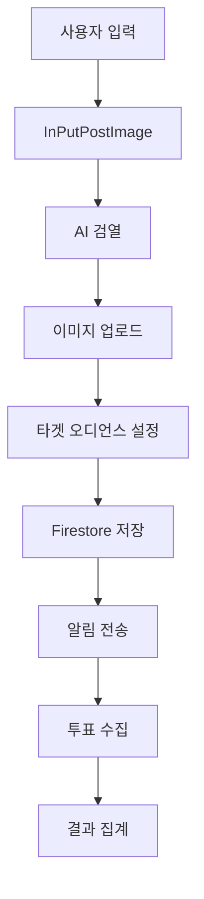

# 📝 Posts 모듈 - Versus Space 게시물 관리 시스템

> Versus Space 앱의 핵심 콘텐츠인 A/B 비교 게시물의 생성, 관리, 표시를 담당하는 통합 모듈

## 📊 모듈 메타정보

| 항목 | 상태 | 상세 |
|------|------|------|
| **모듈명** | Posts | 게시물 관리 시스템 |
| **버전** | v2.5.0 | 2025-08-23 기준 |
| **하위 모듈** | 1개 | InPutPostImage (콘텐츠 생성) |
| **총 파일 수** | 50+ | 컴포넌트, 서비스, 헬퍼 포함 |
| **문서화 진행률** | 100% | 모든 하위 디렉토리 문서화 완료 ✅ |

## 🎯 개요

Posts 모듈은 Versus Space의 핵심 기능인 **"A vs B" 비교 형식**의 게시물을 관리하는 최상위 모듈입니다. 사용자가 두 가지 옵션을 제시하고 커뮤니티가 투표하는 독특한 소셜 미디어 경험을 제공합니다.

### 핵심 가치
- 🎭 **대립 구조**: 모든 콘텐츠는 A vs B 형식으로 구성
- 🗳️ **민주적 참여**: 커뮤니티 투표를 통한 의견 수렴
- 🎨 **리치 미디어**: 텍스트, 이미지, 비디오 모두 지원
- 🤖 **AI 기반**: 콘텐츠 검열, 타겟팅, 레이아웃 최적화

## 📐 네이밍 컨벤션

| 구분 | 규칙 | 예시 |
|------|------|------|
| **디렉토리** | snake_case | `in_put_post_image/` |
| **파일명** | snake_case | `post_manager.dart` |
| **클래스명** | PascalCase | `PostManager` |
| **Firebase 필드** | camelCase | `votesA`, `createdAt` |
| **라우트명** | camelCase | `createPost`, `viewPost` |

> 상세 규칙은 [프로젝트 네이밍 컨벤션](../../NAMING_CONVENTION.md) 참조

## 🏗️ 아키텍처

### 모듈 계층 구조
```
posts/
├── 게시물 생성 (Creation)
│   └── in_put_post_image/      # A/B 비교 콘텐츠 생성
│       ├── components/          # UI 컴포넌트
│       ├── services/           # 비즈니스 로직
│       ├── widgets/            # 복합 위젯
│       └── helpers/            # 유틸리티
│
├── 게시물 표시 (Display) - 예정
│   └── post_viewer/            # 게시물 뷰어
│
├── 게시물 관리 (Management) - 예정
│   └── post_manager/           # CRUD 작업
│
└── 게시물 분석 (Analytics) - 예정
    └── post_analytics/         # 통계 및 분석
```

### 데이터 플로우


## 🔧 주요 구성요소

### 1. InPutPostImage (콘텐츠 생성 모듈)
현재 Posts 모듈의 유일한 구현체로, A/B 비교 콘텐츠 생성의 전체 플로우를 담당합니다.

#### 주요 기능
- **미디어 선택**: WeChat 스타일 갤러리/카메라 통합
- **이미지 편집**: ProImageEditor 통합
- **AI 검열**: 3단계 검증 시스템
- **스마트 레이아웃**: 이미지 비율 기반 자동 배치
- **타겟 오디언스**: AI 기반 사용자 매칭

#### 디렉토리 구조
```
in_put_post_image/
├── components/      # 재사용 가능한 UI 컴포넌트
├── constants/       # 상수 정의
├── delegates/       # 커스텀 델리게이트
├── helpers/        # 헬퍼 유틸리티
├── models/         # 데이터 모델
├── services/       # 비즈니스 로직
├── utils/          # 공통 유틸리티
└── widgets/        # 복합 위젯
```

상세 내용은 [InPutPostImage README](./in_put_post_image/README.md) 참조

### 2. 향후 확장 예정 모듈

#### PostViewer (게시물 표시)
- 피드 뷰어
- 상세 페이지
- 투표 인터페이스
- 실시간 업데이트

#### PostManager (게시물 관리)
- CRUD 작업
- 수정/삭제
- 상태 관리
- 권한 처리

#### PostAnalytics (게시물 분석)
- 투표 통계
- 참여율 분석
- 트렌드 파악
- 리포트 생성

## 💡 핵심 개념

### A/B 비교 형식
모든 게시물은 두 가지 옵션을 제시하는 구조:
- **Option A**: 첫 번째 선택지 (텍스트 + 이미지)
- **Option B**: 두 번째 선택지 (텍스트 + 이미지)
- **Question**: 비교의 맥락을 제공하는 질문

### 투표 시스템
```dart
// 투표 데이터 구조
class PostVoting {
  final int votesA;        // A 옵션 투표 수
  final int votesB;        // B 옵션 투표 수
  final DateTime voteEndTime; // 투표 종료 시간
  final String voteStatus;    // pending/active/completed
}
```

### AI 통합
1. **콘텐츠 검열**: 부적절한 콘텐츠 자동 차단
2. **타겟 매칭**: 관련성 높은 사용자 자동 선택
3. **레이아웃 최적화**: 이미지 비율 기반 최적 배치

## 📦 Firebase 통합

### Firestore 컬렉션
```
posts/
├── postId/
│   ├── question: string
│   ├── optionA: Map
│   │   ├── title: string
│   │   ├── imageUrls: List<string>
│   │   └── aspectRatio: double
│   ├── optionB: Map
│   ├── votesA: int
│   ├── votesB: int
│   ├── voteEndTime: Timestamp
│   ├── targetAudience: Map
│   └── createdAt: Timestamp
```

### Storage 구조
```
posts/
├── {userId}/
│   ├── {postId}/
│   │   ├── optionA/
│   │   │   ├── original/
│   │   │   ├── display/
│   │   │   └── thumbnail/
│   │   └── optionB/
```

## 🚀 사용 예시

### 게시물 생성 플로우
```dart
// 1. 페이지 진입
Navigator.push(
  context,
  MaterialPageRoute(
    builder: (context) => InPutPostImageWidget(),
  ),
);

// 2. 내부 플로우 (자동 처리)
// - 텍스트 입력
// - 이미지 선택
// - AI 검열
// - 타겟 설정
// - 게시물 생성
```

### 데이터 구조
```dart
// 게시물 모델
class PostModel {
  final String question;
  final OptionModel optionA;
  final OptionModel optionB;
  final TargetAudience targetAudience;
  final VotingData voting;
  final DateTime createdAt;
  
  // 투표 관련
  bool get isVotingActive => 
    voting.voteStatus == 'active';
  
  double get votePercentageA => 
    votesA / (votesA + votesB);
}
```

## 🔄 생명주기

### 게시물 생성 생명주기
1. **입력 단계**: 질문과 옵션 텍스트 입력
2. **미디어 단계**: 이미지 선택 및 편집
3. **검증 단계**: AI 기반 콘텐츠 검열
4. **타겟팅 단계**: 대상 사용자 설정
5. **생성 단계**: Firestore 저장 및 알림 발송

### 투표 생명주기
1. **알림 수신**: 타겟 사용자에게 알림
2. **투표 참여**: 10분 타이머 내 투표
3. **집계**: 실시간 투표 수 업데이트
4. **완료**: 타이머 종료 또는 목표 달성

## 📊 성능 최적화

### 이미지 처리
- **3단계 리사이징**: original, display(800px), thumbnail(150px)
- **병렬 업로드**: Future.wait으로 동시 처리
- **프리캐싱**: 업로드 직후 이미지 프리로드

### 메모리 관리
- **LRU 캐시**: 100개 제한, 5분 TTL
- **동적 memCacheWidth**: 400-1600px 자동 조절
- **Provider 패턴**: 효율적인 상태 관리

## 🐛 디버깅

### 로그 패턴
```dart
// 디버그 로그 형식
debugPrint('[Posts] 작업: 상세 내용');
debugPrint('[InPutPostImage] 단계: 진행 상황');
```

### 에러 처리
```dart
// 표준 에러 처리
try {
  // 게시물 생성 로직
} catch (e) {
  ErrorHandler.handle(
    error: e,
    context: context,
    fallback: '게시물 생성 실패',
  );
}
```

## 📈 통계 및 메트릭

### 주요 지표
- **생성 성공률**: 95%+ 목표
- **AI 검열 통과율**: 90%+
- **평균 투표 참여**: 50명+
- **투표 완료율**: 80%+

### 모니터링 포인트
- 이미지 업로드 시간
- AI 검열 응답 시간
- 투표 알림 전달률
- 사용자 참여도

## 🔄 버전 히스토리

### v2.5.0 (2025-08-23)
- InPutPostImage 모듈 완성
- AI 검열 시스템 통합
- 스마트 레이아웃 구현
- 타겟 오디언스 시스템

### v2.0.0 (2025-07-20)
- 멀티 이미지 지원 추가
- ProImageEditor 통합
- WeChat 스타일 피커

### v1.0.0 (2025-07-01)
- 초기 버전 릴리즈
- 기본 A/B 게시물 생성

## 🚀 향후 계획

### 단기 (1-2개월)
- [ ] PostViewer 모듈 구현
- [ ] 비디오 업로드 지원
- [ ] 실시간 투표 그래프

### 중기 (3-6개월)
- [ ] PostManager 모듈 구현
- [ ] 게시물 수정 기능
- [ ] 댓글 시스템 통합

### 장기 (6개월+)
- [ ] PostAnalytics 모듈 구현
- [ ] AI 기반 트렌드 분석
- [ ] 게시물 추천 시스템

## 📚 참고 자료

### 하위 모듈 문서
- [InPutPostImage 상세 문서](./in_put_post_image/README.md)
- [Components 문서](./in_put_post_image/components/README.md)
- [Services 문서](./in_put_post_image/services/README.md)
- [Widgets 문서](./in_put_post_image/widgets/README.md)

### 프로젝트 문서
- [프로젝트 아키텍처](../../ARCHITECTURE.md)
- [네이밍 컨벤션](../../NAMING_CONVENTION.md)
- [Firebase 구조](../../firebase/README.md)

## 🤝 기여 가이드

### 코드 스타일
- Dart 표준 스타일 가이드 준수
- 의미 있는 변수명 사용
- 충분한 주석 작성

### 커밋 메시지
```
feat: 새로운 기능 추가
fix: 버그 수정
docs: 문서 업데이트
refactor: 코드 리팩토링
test: 테스트 추가
```

## 📝 변경 이력

- **2025-08-23**: Posts 모듈 통합 문서 작성
- **2025-08-22**: InPutPostImage 모듈 문서화 완료
- **2025-08-15**: 하위 디렉토리 구조 확립
- **2025-07-01**: 초기 모듈 생성

---

*이 문서는 Versus Space Posts 모듈의 전체 구조와 기능을 설명합니다.*
*최종 업데이트: 2025-08-23*