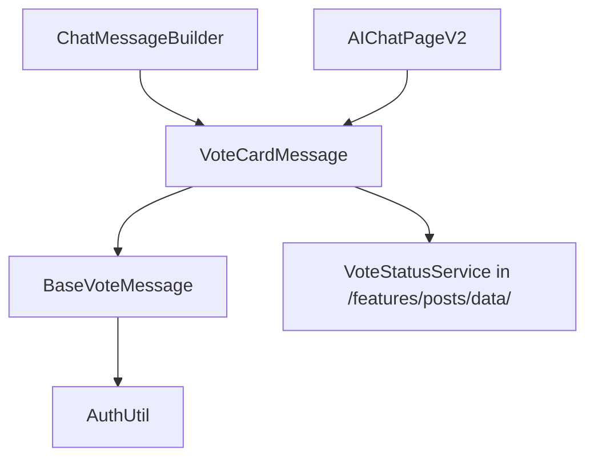

# 투표 채팅 카드 이동 마이그레이션 가이드

> **마이그레이션 대상**: Posts → Voting Feature로 투표 관련 컴포넌트 이동
> **작성일**: 2025-01-20
> **Clean Architecture 준수**: Domain Layer 분리 유지

## 📋 마이그레이션 개요

Posts Feature에서 Voting Feature로 투표 채팅 카드 관련 컴포넌트들을 이동합니다. 이는 단일 책임 원칙(SRP)과 Clean Architecture 원칙에 따라 투표 관련 로직을 한 곳으로 집중화하기 위함입니다.

## 🎯 마이그레이션 범위

### 이동 대상 파일 목록

#### 1. Presentation Layer - Widgets
**소스 디렉토리**: `/lib/features/posts/presentation/widgets/vote/`

```
소스 파일들:
├── base_vote_message.dart           (5,302 bytes) - 투표 메시지 추상 클래스
├── vote_action_button.dart          (1,447 bytes) - 투표 액션 버튼
├── vote_card_header.dart            (4,811 bytes) - 투표 카드 헤더
├── vote_card_message.dart           (44,521 bytes) - 메인 투표 카드 메시지
├── vote_option_box.dart             (12,562 bytes) - 투표 옵션 박스
├── vote_result_display.dart         (1,499 bytes) - 투표 결과 표시
└── README.md                        (9,360 bytes) - 문서
```

#### 2. Domain Layer - Use Cases
**소스 디렉토리**: `/lib/features/posts/domain/usecases/vote/`

```
소스 파일들:
├── vote_usecase.dart                (990 bytes) - 투표 유스케이스
```

**추가 파일**: `/lib/features/posts/domain/usecases/voting_usecases.dart`

#### 3. Domain Layer - Repository
**소스 파일**: `/lib/features/posts/domain/repositories/voting_repository.dart` (3,408 bytes)

#### 4. Domain Layer - Models
**소스 디렉토리**: `/lib/features/posts/domain/models/`

```
소스 파일들:
├── vote_data.dart                   (220 lines) - 투표 데이터 도메인 엔티티
├── voting_summary.dart              (76 lines) - 투표 요약 (Freezed)
├── voting_update.dart               (53 lines) - 실시간 투표 업데이트 (Freezed)
└── post_voting.dart                 (추가 확인 필요) - 포스트 투표 모델
```

## 🗺️ 파일 매핑 (소스 → 타겟)

### Presentation Layer Widgets

| 소스 파일 | 타겟 위치 | 충돌 여부 | 조치 |
|-----------|-----------|----------|------|
| `base_vote_message.dart` | `/lib/features/voting/presentation/widgets/chat_cards/` | ❌ 없음 | 신규 디렉토리 생성 |
| `vote_action_button.dart` | `/lib/features/voting/presentation/widgets/chat_cards/` | ❌ 없음 | 이동 |
| `vote_card_header.dart` | `/lib/features/voting/presentation/widgets/chat_cards/` | ❌ 없음 | 이동 |
| `vote_card_message.dart` | `/lib/features/voting/presentation/widgets/chat_cards/` | ❌ 없음 | 이동 |
| `vote_option_box.dart` | `/lib/features/voting/presentation/widgets/chat_cards/` | ❌ 없음 | 이동 |
| `vote_result_display.dart` | `/lib/features/voting/presentation/widgets/chat_cards/` | ❌ 없음 | 이동 |
| `README.md` | `/lib/features/voting/presentation/widgets/chat_cards/` | ❌ 없음 | 이동 |

### Domain Layer

| 소스 파일 | 타겟 위치 | 충돌 여부 | 조치 |
|-----------|-----------|----------|------|
| `vote_usecase.dart` | `/lib/features/voting/domain/usecases/chat_cards/` | ❌ 없음 | 신규 디렉토리 생성 |
| `voting_usecases.dart` | `/lib/features/voting/domain/usecases/chat_cards/` | ❌ 없음 | 이동 |
| `voting_repository.dart` | `/lib/features/voting/domain/repositories/` | ⚠️ 유사 | `i_voting_repository.dart`와 통합 고려 |
| `vote_data.dart` | `/lib/features/voting/domain/models/` | ❌ 없음 | 이동 |
| `voting_summary.dart` | `/lib/features/voting/domain/models/` | ❌ 없음 | 이동 |
| `voting_update.dart` | `/lib/features/voting/domain/models/` | ❌ 없음 | 이동 |
| `post_voting.dart` | `/lib/features/voting/domain/models/` | ❌ 없음 | 이동 |

## 🔍 종속성 분석

### 현재 Import Dependencies

#### 직접 사용하는 파일들 (2개):
1. **ChatMessageBuilder** - `/lib/features/chat/presentation/screens/chat_detail/components/chat_message_builder.dart`
   ```dart
   import '/features/posts/presentation/widgets/vote/vote_card_message.dart';
   ```

2. **AIChatPageV2** - `/lib/features/chat/presentation/screens/ai_chat/ai_chat_page_v2.dart`
   ```dart
   import '/features/posts/presentation/widgets/vote/vote_card_message.dart';
   ```

#### 내부 종속성:
- `base_vote_message.dart` ← `vote_card_message.dart`
- `vote_option_box.dart` ← Posts README.md에서만 참조

### 외부 종속성 체인:


## 📦 충돌 및 중복 분석

### 1. Repository Interface 충돌
**문제**: Posts의 `VotingRepository`와 Voting의 `IVotingRepository` 중복

**현재 상황**:
- Posts: `VotingRepository` (인터페이스) - 투표 기본 동작
- Voting: `IVotingRepository` (인터페이스) - 투표 집계/랭킹 중심

**해결책**:
- Posts의 `VotingRepository` → `IVotingChatRepository` 이름 변경
- 또는 `IVotingRepository`에 메서드 통합

### 2. Widget 구조 차이
**기존 Voting 구조**:
```
/vote_card/
├── components/          # 세분화된 컴포넌트들
├── models/             # 로컬 모델들
├── utils/              # 헬퍼 유틸리티
└── vote_card_widget.dart # 메인 위젯
```

**Posts 구조**:
```
/vote/
├── base_vote_message.dart
├── vote_card_message.dart    # 44KB - 메인 구현체
├── vote_option_box.dart
└── 기타 컴포넌트들...
```

**해결책**: 새로운 `chat_cards` 서브디렉토리 생성

## 🔧 단계별 마이그레이션 절차

### Phase 1: 준비 작업 (안전성 검증)

```bash
# 1. 백업 생성
cp -r /Users/g_black/versus-cursor/lib/features/posts/presentation/widgets/vote \
      /Users/g_black/versus-cursor/backup_vote_widgets_$(date +%Y%m%d)

# 2. 타겟 디렉토리 생성
mkdir -p /Users/g_black/versus-cursor/lib/features/voting/presentation/widgets/chat_cards
mkdir -p /Users/g_black/versus-cursor/lib/features/voting/domain/usecases/chat_cards
```

### Phase 2: 파일 이동 (Domain → Presentation 순서)

#### 2.1 Domain Models 이동
```bash
# Models 이동
mv /Users/g_black/versus-cursor/lib/features/posts/domain/models/vote_data.dart \
   /Users/g_black/versus-cursor/lib/features/voting/domain/models/

mv /Users/g_black/versus-cursor/lib/features/posts/domain/models/voting_summary.dart \
   /Users/g_black/versus-cursor/lib/features/voting/domain/models/

mv /Users/g_black/versus-cursor/lib/features/posts/domain/models/voting_update.dart \
   /Users/g_black/versus-cursor/lib/features/voting/domain/models/

mv /Users/g_black/versus-cursor/lib/features/posts/domain/models/post_voting.dart \
   /Users/g_black/versus-cursor/lib/features/voting/domain/models/ 2>/dev/null || echo "post_voting.dart not found - skip"
```

#### 2.2 Repository 이동 (이름 변경)
```bash
# Repository 이동 (충돌 방지를 위해 이름 변경)
mv /Users/g_black/versus-cursor/lib/features/posts/domain/repositories/voting_repository.dart \
   /Users/g_black/versus-cursor/lib/features/voting/domain/repositories/i_voting_chat_repository.dart
```

#### 2.3 Use Cases 이동
```bash
# Use Cases 이동
mv /Users/g_black/versus-cursor/lib/features/posts/domain/usecases/vote/vote_usecase.dart \
   /Users/g_black/versus-cursor/lib/features/voting/domain/usecases/chat_cards/

mv /Users/g_black/versus-cursor/lib/features/posts/domain/usecases/voting_usecases.dart \
   /Users/g_black/versus-cursor/lib/features/voting/domain/usecases/chat_cards/

# 빈 디렉토리 제거
rmdir /Users/g_black/versus-cursor/lib/features/posts/domain/usecases/vote 2>/dev/null || true
```

#### 2.4 Presentation Widgets 이동
```bash
# Widgets 이동
mv /Users/g_black/versus-cursor/lib/features/posts/presentation/widgets/vote/* \
   /Users/g_black/versus-cursor/lib/features/voting/presentation/widgets/chat_cards/

# 빈 디렉토리 제거
rmdir /Users/g_black/versus-cursor/lib/features/posts/presentation/widgets/vote
```

### Phase 3: Import 경로 수정

#### 3.1 주요 사용처 Import 수정
```bash
# ChatMessageBuilder import 수정
sed -i '' 's|/features/posts/presentation/widgets/vote/vote_card_message.dart|/features/voting/presentation/widgets/chat_cards/vote_card_message.dart|g' \
  /Users/g_black/versus-cursor/lib/features/chat/presentation/screens/chat_detail/components/chat_message_builder.dart

# AIChatPageV2 import 수정
sed -i '' 's|/features/posts/presentation/widgets/vote/vote_card_message.dart|/features/voting/presentation/widgets/chat_cards/vote_card_message.dart|g' \
  /Users/g_black/versus-cursor/lib/features/chat/presentation/screens/ai_chat/ai_chat_page_v2.dart
```

#### 3.2 내부 import 수정 (이동된 파일들 내부)
```bash
# vote_card_message.dart 내부 import 수정
sed -i '' 's|base_vote_message.dart|/features/voting/presentation/widgets/chat_cards/base_vote_message.dart|g' \
  /Users/g_black/versus-cursor/lib/features/voting/presentation/widgets/chat_cards/vote_card_message.dart

# 기타 필요한 import 경로들 확인 및 수정
grep -r "features/posts.*vote" /Users/g_black/versus-cursor/lib/features/voting/presentation/widgets/chat_cards/ || echo "No more posts/vote imports found"
```

#### 3.3 Domain Layer import 수정
```bash
# Repository import 수정 (사용하는 모든 파일에서)
find /Users/g_black/versus-cursor/lib/features/voting -name "*.dart" -exec \
  sed -i '' 's|/features/posts/domain/repositories/voting_repository.dart|/features/voting/domain/repositories/i_voting_chat_repository.dart|g' {} \;

# Models import 수정
find /Users/g_black/versus-cursor/lib/features/voting -name "*.dart" -exec \
  sed -i '' 's|/features/posts/domain/models/vote_data.dart|/features/voting/domain/models/vote_data.dart|g' {} \;

find /Users/g_black/versus-cursor/lib/features/voting -name "*.dart" -exec \
  sed -i '' 's|/features/posts/domain/models/voting_summary.dart|/features/voting/domain/models/voting_summary.dart|g' {} \;

find /Users/g_black/versus-cursor/lib/features/voting -name "*.dart" -exec \
  sed -i '' 's|/features/posts/domain/models/voting_update.dart|/features/voting/domain/models/voting_update.dart|g' {} \;
```

### Phase 4: 검증 및 테스트

#### 4.1 빌드 검증
```bash
# Flutter clean & get
cd /Users/g_black/versus-cursor
flutter clean
flutter pub get

# 빌드 테스트
flutter analyze
```

#### 4.2 Import 검증
```bash
# 남아있는 잘못된 import 확인
echo "=== Checking for remaining incorrect imports ==="
grep -r "features/posts.*vote" /Users/g_black/versus-cursor/lib/ --include="*.dart" || echo "✅ No incorrect imports found"

# 이동된 파일들이 올바른 위치에 있는지 확인
echo "=== Verifying moved files ==="
ls -la /Users/g_black/versus-cursor/lib/features/voting/presentation/widgets/chat_cards/
ls -la /Users/g_black/versus-cursor/lib/features/voting/domain/models/
ls -la /Users/g_black/versus-cursor/lib/features/voting/domain/usecases/chat_cards/
```

#### 4.3 기능 테스트 체크리스트
- [ ] 채팅방에서 투표 카드 메시지가 정상적으로 표시되는가?
- [ ] 투표 액션 버튼이 작동하는가?
- [ ] 투표 결과 표시가 올바른가?
- [ ] AI 채팅에서 투표 카드가 정상 작동하는가?
- [ ] 타이머 기능이 정상 작동하는가?

## 🔄 롤백 계획

마이그레이션 실패 시 롤백 절차:

### Quick Rollback (긴급)
```bash
# 1. 백업에서 복원
cp -r /Users/g_black/versus-cursor/backup_vote_widgets_$(date +%Y%m%d) \
      /Users/g_black/versus-cursor/lib/features/posts/presentation/widgets/vote

# 2. 이동된 파일들 제거
rm -rf /Users/g_black/versus-cursor/lib/features/voting/presentation/widgets/chat_cards
rm -rf /Users/g_black/versus-cursor/lib/features/voting/domain/usecases/chat_cards

# 3. Import 경로 되돌리기
sed -i '' 's|/features/voting/presentation/widgets/chat_cards/vote_card_message.dart|/features/posts/presentation/widgets/vote/vote_card_message.dart|g' \
  /Users/g_black/versus-cursor/lib/features/chat/presentation/screens/chat_detail/components/chat_message_builder.dart

sed -i '' 's|/features/voting/presentation/widgets/chat_cards/vote_card_message.dart|/features/posts/presentation/widgets/vote/vote_card_message.dart|g' \
  /Users/g_black/versus-cursor/lib/features/chat/presentation/screens/ai_chat/ai_chat_page_v2.dart
```

### Complete Rollback (전체)
```bash
# Git을 사용한 완전 롤백 (권장)
cd /Users/g_black/versus-cursor
git stash  # 현재 변경사항 임시 저장
git reset --hard HEAD  # 마지막 커밋으로 복원
```

## ⚠️ 주의사항

### 1. Clean Architecture 원칙 준수
- Domain Layer가 Presentation Layer를 의존하지 않도록 주의
- Use Cases는 Repository Interface만 의존해야 함
- Models은 Framework 무관하게 유지

### 2. Breaking Changes 최소화
- 기존 API 호환성 유지
- Public Interface는 변경하지 않음
- Internal 구조만 변경

### 3. 테스트 영향도
- 단위 테스트 경로 수정 필요
- Mock 객체 경로 업데이트
- Integration 테스트 확인

### 4. 성능 고려사항
- Import 경로 최적화로 Bundle Size 영향 확인
- Tree Shaking 효과 검증
- 런타임 성능 측정

## 📈 마이그레이션 후 기대효과

### 1. 코드 구조 개선
- **Single Responsibility**: 투표 로직이 Voting Feature로 집중화
- **모듈성**: 투표 관련 모든 컴포넌트가 한 곳에 위치
- **유지보수성**: 투표 기능 수정 시 한 곳만 수정하면 됨

### 2. Clean Architecture 강화
- **도메인 분리**: 투표 도메인이 명확히 분리됨
- **의존성 역전**: Repository Interface와 Implementation 분리 유지
- **테스트 용이성**: 투표 관련 로직만 독립적으로 테스트 가능

### 3. 개발 효율성
- **코드 재사용성**: 투표 컴포넌트의 재사용성 향상
- **확장성**: 새로운 투표 기능 추가 시 한 곳에서 관리
- **협업**: 투표 기능 담당자가 명확히 구분됨

## 💡 추가 고려사항

### Repository 통합 방안
현재 Posts의 `VotingRepository`와 Voting의 `IVotingRepository`가 중복됩니다:

**옵션 A**: 인터페이스 분리 유지
```dart
// Chat 관련 투표 동작
abstract class IVotingChatRepository {
  Future<Either<VotingFailure, PostVoting>> castVote(...);
  Stream<VotingUpdate> watchVotingUpdates(String postId);
}

// 집계/랭킹 관련 투표 동작
abstract class IVotingRepository {
  Stream<List<VoteCounts>> queryVotecounts(...);
  Stream<List<RankingsModel>> queryRankings(...);
}
```

**옵션 B**: 단일 통합 Repository
```dart
abstract class IVotingRepository {
  // 기본 투표 동작 (from Posts)
  Future<Either<VotingFailure, PostVoting>> castVote(...);

  // 집계/랭킹 동작 (기존)
  Stream<List<VoteCounts>> queryVotecounts(...);
}
```

**권장**: 옵션 A - 책임 분리 원칙에 따라 Chat 투표와 집계/랭킹을 분리

---

## 📞 마이그레이션 지원

**작성자**: Claude Code Assistant
**검토 필요**: Clean Architecture 전문가
**예상 소요 시간**: 2-3시간
**위험도**: Medium (Import 경로 다수 변경으로 인한 빌드 에러 가능성)

---

> **마이그레이션 전 필독**: 이 가이드의 모든 절차를 따르기 전에 Git 백업을 생성하고, 테스트 환경에서 먼저 실행해보시기 바랍니다.